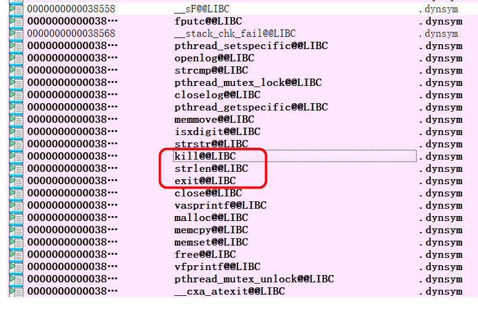
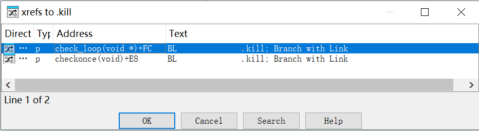
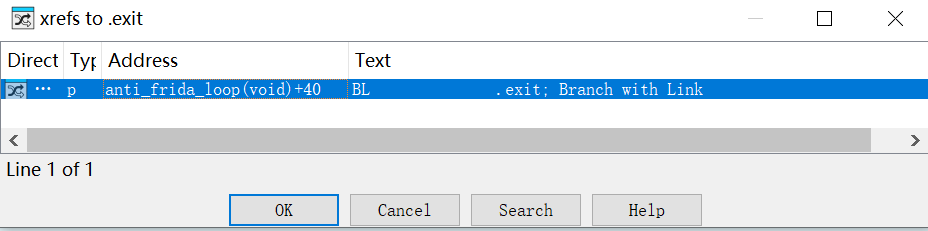
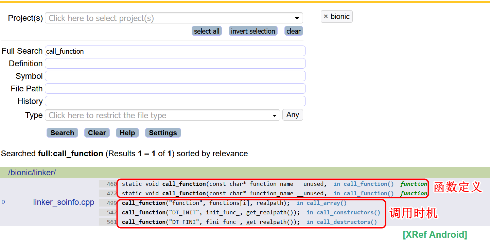
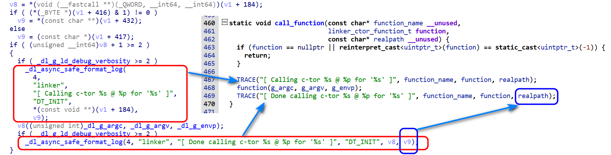

# Unicorn 学习与应用

## Unicorn、Keystone、Capstone 介绍

[Unicorn](https://github.com/unicorn-engine/unicorn)、[Keystone](https://github.com/keystone-engine/keyskeystone-enginetone) 和 [Capstone](https://github.com/capstone-engine/capstone) 是三款在逆向工程和安全研究领域中广泛使用的开源工具，它们各自具有不同的功能和用途。

- Unicorn ：Unicorn 是一个轻量级、多平台、多架构的 CPU 模拟器框架。它允许开发者专注于 CPU 操作，而无需担心机器设备之间的差异。这意味着它可以用来模拟执行二进制代码，这对于分析恶意软件或理解编译后的程序非常有用。
- Keystone ：Keystone 是一个汇编器引擎，支持多种处理器架构。它能够将汇编语言转换为机器码，这在创建自定义编译工具或者需要直接生成可执行代码的情况下特别有用。Keystone 与 Capstone 和 Unicorn 一起被提及，作为逆向工程的标准工具集的一部分。
- Capstone ：Capstone 被誉为“终极反汇编器”，是一个下一代的反汇编引擎，提供了一个轻量级的支持多平台和多架构的反汇编框架。它的设计目的是为了从二进制文件中提取汇编代码，这对于进行逆向工程和安全分析至关重要。

如果需要使用 Unicorn，最好将上面三个框架都安装。这样就可以使用 Unicorn 来模拟 CPU 执行二进制代码，使用 Keystone 来将汇编语言转换为机器码，并使用 Capstone 来反汇编二进制文件。

这里直接使用 python 版本进行安装：

```bash
$ pip install unicorn
$ pip install keystone-engine
$ pip install capstone
```

### antiFrida

根据课程中给出的例子，我们需要过掉检测 frida 的方法。首先观察到使用 frida 后，应用就会退出。所以可以通过退出的时机来判断检测代码在哪里。
由于这里的测试例子比较简单，所以这一步可以忽略。下面还是给出相关的代码，判断检测点在哪个 so 中。

```javascript
function hook_dlopen() {
  Interceptor.attach(Module.findExportByName(null, "android_dlopen_ext"), {
    onEnter: function (args) {
      let so_path_ptr = args[0];
      if (so_path_ptr !== undefined && so_path_ptr !== null) {
        let path = so_path_ptr.readCString();
        console.log("load: " + path);
      }
    },
  });
}

function main() {
  hook_dlopen();
}

setImmediate(main);
```

然后使用 frida 加载脚本即可找到检测的 so 文件为 `libnative-lib.so` 。

```bash
➜ frida  frida -Uf com.example.test -l capstonetest.js
     ____
    / _  |   Frida 16.6.6 - A world-class dynamic instrumentation toolkit
   | (_| |
    > _  |   Commands:
   /_/ |_|       help      -> Displays the help system
   . . . .       object?   -> Display information about 'object'
   . . . .       exit/quit -> Exit
   . . . .
   . . . .   More info at https://frida.re/docs/home/
   . . . .
   . . . .   Connected to Pixel (id=FA6AF0309510)
Spawned `com.example.test`. Resuming main thread!
[Pixel::com.example.test ]-> load: /data/app/com.example.test-pQBCsbbccuyK6mlYBQv7tg==/oat/arm64/base.odex
load: /data/app/com.example.test-pQBCsbbccuyK6mlYBQv7tg==/lib/arm64/libnative-lib.so
Process terminated
[Pixel::com.example.test ]->

Thank you for using Frida!
```

下面就开始分析 `libnative-lib.so` 中的反调试代码。使用 IDA 打开 `libnative-lib.so`，发现导入表中存在 kill 和 exit 函数。



使用快捷键 x 分别查看 kill 和 exit 函数的调用位置，如下图所示：





找到了相关调用地址之后，就可以使用 IDA 进行静态 patch 了。

这里为了学习课程中的内容，使用 frida 进行动态 patch。

首先需要在 libnative-lib.so 加载时进行 hook，避免 hook 时机太晚导致失败。

在 Android 系统中，linker 加载 so 文件时会调用 `call_function` 函数，这个函数会调用 `.init_proc` 等类型的函数，这是常见的反调试手段插入点。通过查阅 [Android Linker](https://xrefandroid.com/android-15.0.0_r1/search?full=call_function&project=bionic) 源码，可以了解 `call_function` 的实现和调用时机，如下图所示：



`call_function` 函数会被 `call_constructors` 调用，由于调用 `call_function` 时会传递 so 的路径，因此这是一个理想的 hook 点，可以在这里获取 so 的路径。、

为了进一步确认 `call_function` 函数在 so 中的名称，将手机中的 `/apex/com.android.runtime/bin/linker64` 文件导出并用 IDA 反编译后，发现找不到 `call_function`，原因是该函数被内联到 `call_constructors` 函数中了。此时可以选择 hook `call_constructors` 函数来间接获取 so 路径。



通过对比源码可知，v1 为 soinfo 对象，v9 保存了 so 的路径。进一步分析发现，v9 的值为 `[v1 + 432]`，据此可获取 so 路径。

获取了 so 的路径之后，就可以在加载 `libnative-lib.so` 时使用 frida 进行动态 patch 了。下面是完整的代码：

```javascript
// 输出汇编指令
function dis(address, num) {
  for (let i = 0; i < num; i++) {
    let ins = Instruction.parse(address);
    console.log("address: " + address + "--dis:" + ins.toString());
    address = ins.next;
  }
}
function hook() {
  // linker 加载 so 时会调用 call_function 函数，该函数会在so加载时被调用。
  // hook call_function("DT_INIT", init_func_, get_realpath());
  let linker_module = Process.getModuleByName("linker64");
  let call_function_addr = null;
  let symbols = linker_module.enumerateSymbols();
  for (let i = 0; i < symbols.length; i++) {
    let symbol = symbols[i];
    // console.log(linker_module.name + " symbol:" + symbol.name + " -- " + symbol.address);
    if (symbol.name.indexOf("_dl__ZN6soinfo17call_constructorsEv") !== -1) {
      console.log(
        linker_module.name + " symbol:" + symbol.name + " -- " + symbol.address
      );
      call_function_addr = symbol.address;
    }
  }
  Interceptor.attach(call_function_addr, {
    onEnter: function (args) {
      let soinfo = args[0];
      let path = ptr(soinfo).add(432).readPointer().readCString();
      if (path.indexOf("libnative-lib.so") !== -1) {
        let libnative_module = Process.getModuleByName("libnative-lib.so");
        let base = libnative_module.base;
        console.log("-----------patch kill before----------");
        dis(base.add(0xffb4), 10);
        // FFC4 4B FE FF 97     BL .kill
        let patchaddr = base.add(0xffc4);
        Memory.patchCode(patchaddr, 4, (patchaddr) => {
          let cw = new Arm64Writer(patchaddr);
          cw.putNop();
          cw.flush();
        });
        console.log("-----------patch kill after----------");
        dis(base.add(0xffb4), 10);

        // 10340 74 FD FF 97     BL .exit
        console.log("-----------patch exit before-----------");
        dis(base.add(0x10330), 10);
        Memory.protect(base.add(0x10340), 4, "rwx");
        base.add(0x10340).writeByteArray([0x1f, 0x20, 0x03, 0xd5]);
        console.log("-----------patch exit after----------");
        dis(base.add(0x10330), 10);
      }
    },
  });
}

function main() {
  hook();
}

setImmediate(main);
```

运行 frida 脚本后，发现应用不会退出了。

```bash
$ frida -Uf com.example.test -l capstonetest.js
     ____
    / _  |   Frida 16.6.6 - A world-class dynamic instrumentation toolkit
   | (_| |
    > _  |   Commands:
   /_/ |_|       help      -> Displays the help system
   . . . .       object?   -> Display information about 'object'
   . . . .       exit/quit -> Exit
   . . . .
   . . . .   More info at https://frida.re/docs/home/
   . . . .
   . . . .   Connected to Pixel (id=FA6AF0309510)
Spawning `com.example.test`...
linker64 symbol:__dl__ZN6soinfo17call_constructorsEv -- 0x72e9f40e48
Spawned `com.example.test`. Resuming main thread!
[Pixel::com.example.test ]-> -----------patch kill before----------
address: 0x71f4f94fb4--dis:mov w1, #9
address: 0x71f4f94fb8--dis:str w1, [sp, #0xc]
address: 0x71f4f94fbc--dis:bl #0x71f4f945f0
address: 0x71f4f94fc0--dis:ldr w1, [sp, #0xc]
address: 0x71f4f94fc4--dis:bl #0x71f4f948f0
address: 0x71f4f94fc8--dis:add x8, sp, #0x48
address: 0x71f4f94fcc--dis:add x3, sp, #0x248
address: 0x71f4f94fd0--dis:add x2, sp, #0x254
address: 0x71f4f94fd4--dis:add x5, sp, #0x258
address: 0x71f4f94fd8--dis:add x9, sp, #0x267
-----------patch kill after----------
address: 0x71f4f94fb4--dis:mov w1, #9
address: 0x71f4f94fb8--dis:str w1, [sp, #0xc]
address: 0x71f4f94fbc--dis:bl #0x71f4f945f0
address: 0x71f4f94fc0--dis:ldr w1, [sp, #0xc]
address: 0x71f4f94fc4--dis:nop
address: 0x71f4f94fc8--dis:add x8, sp, #0x48
address: 0x71f4f94fcc--dis:add x3, sp, #0x248
address: 0x71f4f94fd0--dis:add x2, sp, #0x254
address: 0x71f4f94fd4--dis:add x5, sp, #0x258
address: 0x71f4f94fd8--dis:add x9, sp, #0x267
-----------patch exit before-----------
address: 0x71f4f95330--dis:bl #0x71f4f94420
address: 0x71f4f95334--dis:cbz w0, #0x71f4f95344
address: 0x71f4f95338--dis:b #0x71f4f9533c
address: 0x71f4f9533c--dis:mov w0, #-1
address: 0x71f4f95340--dis:bl #0x71f4f94910
address: 0x71f4f95344--dis:ldr x0, [sp, #0x10]
address: 0x71f4f95348--dis:bl #0x71f4f943f0
address: 0x71f4f9534c--dis:mrs x30, tpidr_el0
address: 0x71f4f95350--dis:ldr x30, [x30, #0x28]
address: 0x71f4f95354--dis:ldur x8, [x29, #-8]
-----------patch exit after----------
address: 0x71f4f95330--dis:bl #0x71f4f94420
address: 0x71f4f95334--dis:cbz w0, #0x71f4f95344
address: 0x71f4f95338--dis:b #0x71f4f9533c
address: 0x71f4f9533c--dis:mov w0, #-1
address: 0x71f4f95340--dis:nop
address: 0x71f4f95344--dis:ldr x0, [sp, #0x10]
address: 0x71f4f95348--dis:bl #0x71f4f943f0
address: 0x71f4f9534c--dis:mrs x30, tpidr_el0
address: 0x71f4f95350--dis:ldr x30, [x30, #0x28]
address: 0x71f4f95354--dis:ldur x8, [x29, #-8]
[Pixel::com.example.test ]->

```

## Unicorn 简单上手
