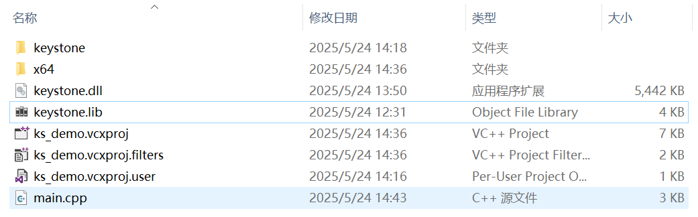
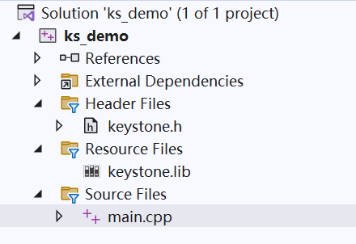

# Keystone-Engine API Documentation

| Version | Commit: 24bffaab |
| ------- | ---------------- |

**Official API document by [CKCat](https://github.com/CKCat)**

[Keystone Engine](https://www.keystone-engine.org/) 是一个轻量级的多平台、多体系结构汇编框架。

## 开发准备

KeyStone 官网: https://www.keystone-engine.org/

```bash
git clone https://github.com/keystone-engine/keystone.git
```

KeyStone 源码文件结构如下：

```bash
. <- 主要引擎core engine + README + 编译文档COMPILE.TXT 等
├─bindings      <- 绑定
│  ├─csharp     <- .Net 绑定 + 测试代码
│  ├─go         <-  go 绑定 + 测试代码
│  ├─haskell    <-  Haskell 绑定 + 测试代码
│  ├─java       <- Java 绑定 + 测试代码
│  ├─masm
│  ├─nodejs
│  ├─ocaml
│  ├─powershell
│  ├─python      <- Python 绑定 + 测试代码
│  ├─ruby
│  ├─rust
│  └─vb6
├─debian    <- 包含为 Debian 及其衍生发行版（如 Ubuntu）创建软件包（.deb 文件）所需的文件
├─docs      <- 文档
├─include   <- 包含 Keystone 引擎的公共 C 头文件
├─kstool    <- 基于 Keystone 引擎的命令行工具
├─llvm      <- LLVM 是 Keystone 实现对多种 CPU 架构汇编能力的基础
├─samples   <- 存放使用 Keystone 核心库的示例代码
└─suite     <- 测试套件
```

### 编译

#### Linux & MacOS & Windows

windows + vs2022

下载安装 [camke](https://cmake.org/download/)，并将 cmake 添加到环境变量中 。

使用以下命令编译：

```bash
$ cmake -B build
$ cmake --build build
```

编译过程中会出现表达式的计算结果不是常数的错误，这里需要修改 `llvm\include\llvm\Support\Compiler.h` 文件中 `LLVM_CONSTEXPR` 宏的定义，使其支持 msvc，修改内容如下：

```cpp
#if defined(_MSC_VER)
  #if _MSC_VER >= 1900 // Visual Studio 2015 (MSVC++ 14.0) and later fully support constexpr
    #define LLVM_CONSTEXPR constexpr
  #else
    #define LLVM_CONSTEXPR // Older MSVC versions might have limited or no support
  #endif
#elif __has_feature(cxx_constexpr) || defined(__GXX_EXPERIMENTAL_CXX0X__)
# define LLVM_CONSTEXPR constexpr
#else
# define LLVM_CONSTEXPR
#endif
```

或者直接注释 `llvm\lib\Target\RISCV\MCTargetDesc\RISCVAsmBackend.h` 文件中的下列内容：

```cpp
    // static_assert((array_lengthof(Infos)) == RISCV::NumTargetFixupKinds,
    //               "Not all fixup kinds added to Infos array");
```

修改完成后，重新编译即可，最后 `build\llvm\bin` 目录下将会产生 `unicorn.dll` 文件和 `build\llvm\lib` 目录下的 `keystone.lib` 文件。

> 其他编译方式点击[这里](https://github.com/keystone-engine/keystone/blob/master/docs/COMPILE.md)

### 安装

- Python 模块

```bash
pip install keystone-engine
```

### 引擎调用测试

（以 Windows VS2022 为例）新建一个 VS 项目，将编译好的 `keystone.lib` 和 `keystone.dll` 文件以及 keystone 源码中 include 下的 keystone 目录拷贝到新建项目的源码目录下。



在 VS 解决方案中，头文件添加现有项 -> 选择 keystone 目录中所有的头文件进行添加，资源文件中添加 `keystone.lib` 文件，重新生成解决方案



keystone 使用方式与 capstone 类似，基本可以参考 capstone 的使用方式。

接下来测试我们生成的 keystone 引擎，主文件代码如下：

主文件代码如下:

```cpp
#include <iostream>
#include "keystone/keystone.h"
using namespace std;

int test_ks(ks_arch arch, int mode, const char* assembly, int syntax) {
	ks_engine* ks = nullptr;
	ks_err err;
	size_t count;
	unsigned char* encode;
	size_t size;
	err = ks_open(arch, mode, &ks);
	if (err != KS_ERR_OK) {
		printf("Failed on ks_open error msg: %s\n\n", ks_strerror(err));
		return -1;
	}
	if (syntax)
		ks_option(ks, KS_OPT_SYNTAX, syntax);
	if (ks_asm(ks, assembly, 0, &encode, &size, &count)) {
		printf("Failed on ks_asm() with count = %llu, error msg: = %s\n", count,
			ks_strerror(ks_errno(ks)));
	}
	else {
		printf("%s = ", assembly);
		for (int i = 0; i < size; i++)
		{
			printf("%02X ", encode[i]);
		}
		printf("\n");
		printf("Assembled: %llu bytes, %llu statements\n\n", size, count);
	}
	// 释放空间
	ks_free(encode);
	// 关闭 Keystone 实例，释放资源
	ks_close(ks);
	return 0;
}

// 符号解析器回调函数
bool sym_resolver(const char* symbol, uint64_t* value){
	// 这是我们想要处理的缺失符号 "_l1" 吗？
	if (!strcmp(symbol, "_l1")) {
		// 将此符号的值放入 @value 指向的内存中
		*value = 0x1002;
		// 我们已经处理了这个符号，所以返回 true
		return true;
	}
	// 我们没有处理这个符号，所以返回 false
	return false;
}

// 测试符号解析器以处理缺失的符号
int test_sym_resolver(){
	ks_engine* ks; // Keystone 引擎句柄
	ks_err err;    // Keystone 错误码
	size_t count;  // 成功汇编的语句数量
	unsigned char* encode; // 指向存储机器码的缓冲区的指针
	size_t size;   // 机器码的大小 (字节数)
	const char* assembly = "jmp _l1; nop"; // 要汇编的汇编代码字符串

	err = ks_open(KS_ARCH_X86, KS_MODE_32, &ks); // 初始化 Keystone 引擎，针对 X86 架构，32位模式
	if (err != KS_ERR_OK) {
		printf("错误：ks_open() 执行失败，退出\n");
		return -1;
	}

	// 注册符号解析器的回调函数
	ks_option(ks, KS_OPT_SYM_RESOLVER, (size_t)sym_resolver); // 设置 KS_OPT_SYM_RESOLVER 选项，值为 sym_resolver 函数的地址

	if (ks_asm(ks, assembly, 0x1000, &encode, &size, &count)) { // 汇编字符串，起始地址为 0x1000
		// 如果 ks_asm 返回非零值 (表示失败)
		printf("Failed on ks_asm() with count = %llu, error msg: = %s\n", count, ks_strerror(ks_errno(ks)));
	}
	else {
		// 如果 ks_asm 返回零 (表示成功)
		size_t i;

		printf("%s = ", assembly); // 打印原始汇编代码
		for (i = 0; i < size; i++) {
			printf("%02x ", encode[i]); // 以两位十六进制格式打印每个字节的机器码
		}
		printf("\n");
		printf("Assembled: %llu bytes, %llu statements\n\n", size, count); // 打印汇编结果的大小和语句数
	}
	// 注意：使用后必须释放 encode 指向的内存，以避免内存泄漏
	ks_free(encode);
	// 完成后关闭 Keystone 实例
	ks_close(ks);
	return 0;
}
int main(int argc, char* argv[]) {
	// X86
	printf("x86 16bit:\n");
	test_ks(KS_ARCH_X86, KS_MODE_16, "add eax, ecx", 0);
	printf("x86 32bit:\n");
	test_ks(KS_ARCH_X86, KS_MODE_32, "add eax, ecx", 0);
	printf("x86 64bit:\n");
	test_ks(KS_ARCH_X86, KS_MODE_64, "add rax, rcx", 0);
	printf("x86 32bit att syntax:\n");
	test_ks(KS_ARCH_X86, KS_MODE_32, "add %ecx, %eax", KS_OPT_SYNTAX_ATT);
	printf("x86 64bit att syntax:\n");
	test_ks(KS_ARCH_X86, KS_MODE_64, "add %rcx, %rax", KS_OPT_SYNTAX_ATT);

	test_ks(KS_ARCH_X86, KS_MODE_32, "add eax, 0x15", 0);
	test_ks(KS_ARCH_X86, KS_MODE_32, "add eax, 15h", 0);
	test_ks(KS_ARCH_X86, KS_MODE_32, "add eax, 15", 0);

	// ARM
	printf("ARM :\n");
	test_ks(KS_ARCH_ARM, KS_MODE_ARM, "sub r1, r2, r5", 0);
	printf("ARM BIG_ENDIAN :\n");
	test_ks(KS_ARCH_ARM, KS_MODE_ARM + KS_MODE_BIG_ENDIAN, "sub r1, r2, r5", 0);
	printf("THUMB :\n");
	test_ks(KS_ARCH_ARM, KS_MODE_THUMB, "movs r4, #0xf0", 0);
	printf("THUMB BIG_ENDIAN :\n");
	test_ks(KS_ARCH_ARM, KS_MODE_THUMB + KS_MODE_BIG_ENDIAN, "movs r4, #0xf0", 0);

	// ARM64
	printf("ARM64:\n");
	test_ks(KS_ARCH_ARM64, KS_MODE_LITTLE_ENDIAN, "ldr w1, [sp, #0x8]", 0);

	test_sym_resolver();
	return 0;
}
```

运行结果如下

```bash
x86 16bit:
add eax, ecx = 66 01 C8
Assembled: 3 bytes, 1 statements

x86 32bit:
add eax, ecx = 01 C8
Assembled: 2 bytes, 1 statements

x86 64bit:
add rax, rcx = 48 01 C8
Assembled: 3 bytes, 1 statements

x86 32bit att syntax:
add %ecx, %eax = 01 C8
Assembled: 2 bytes, 1 statements

x86 64bit att syntax:
add %rcx, %rax = 48 01 C8
Assembled: 3 bytes, 1 statements

add eax, 0x15 = 83 C0 15
Assembled: 3 bytes, 1 statements

Failed on ks_asm() with count = 0, error msg: = Invalid operand (KS_ERR_ASM_INVALIDOPERAND)
add eax, 15 = 83 C0 15
Assembled: 3 bytes, 1 statements

ARM :
sub r1, r2, r5 = 05 10 42 E0
Assembled: 4 bytes, 1 statements

ARM BIG_ENDIAN :
sub r1, r2, r5 = E0 42 10 05
Assembled: 4 bytes, 1 statements

THUMB :
movs r4, #0xf0 = F0 24
Assembled: 2 bytes, 1 statements

THUMB BIG_ENDIAN :
movs r4, #0xf0 = 24 F0
Assembled: 2 bytes, 1 statements

ARM64:
ldr w1, [sp, #0x8] = E1 0B 40 B9
Assembled: 4 bytes, 1 statements

jmp _l1; nop = eb 01 90
Assembled: 3 bytes, 2 statements
```

这里解析 `add eax, 15h` 失败了，并且解析 `add eax, 15` 的结果是错误的。暂时不太清楚是什么原因，后面有空再看看。

## 数据类型

### ks_arch

架构类型。

```cpp
// 架构类型
typedef enum ks_arch {
    KS_ARCH_ARM = 1,    // ARM 架构 (包括 Thumb, Thumb-2)
    KS_ARCH_ARM64,      // ARM-64 架构，也称为 AArch64
    KS_ARCH_MIPS,       // Mips 架构
    KS_ARCH_X86,        // X86 架构 (包括 x86 和 x86-64)
    KS_ARCH_PPC,        // PowerPC 架构 (当前不支持)
    KS_ARCH_SPARC,      // Sparc 架构
    KS_ARCH_SYSTEMZ,    // SystemZ 架构 (S390X)
    KS_ARCH_HEXAGON,    // Hexagon 架构
    KS_ARCH_EVM,        // 以太坊虚拟机 (Ethereum Virtual Machine) 架构
    KS_ARCH_RISCV,      // RISC-V 架构
    KS_ARCH_MAX,        // 架构枚举的最大值标记 (用于内部或迭代)
} ks_arch;

```

### ks_mode

模式类型。

```cpp
// 模式类型
typedef enum ks_mode {
    KS_MODE_LITTLE_ENDIAN = 0,    // 小端模式 (默认模式)
    KS_MODE_BIG_ENDIAN = 1 << 30, // 大端模式
    // arm / arm64 架构模式
    KS_MODE_ARM = 1 << 0,              // ARM 模式
    KS_MODE_THUMB = 1 << 4,       // THUMB 模式 (包括 Thumb-2)
    KS_MODE_V8 = 1 << 6,          // 用于 ARM 的 ARMv8 A32 编码模式
    // mips 架构模式
    KS_MODE_MICRO = 1 << 4,       // MicroMips 模式
    KS_MODE_MIPS3 = 1 << 5,       // Mips III 指令集架构 (ISA)
    KS_MODE_MIPS32R6 = 1 << 6,    // Mips32r6 指令集架构 (ISA)
    KS_MODE_MIPS32 = 1 << 2,      // Mips32 指令集架构 (ISA)
    KS_MODE_MIPS64 = 1 << 3,      // Mips64 指令集架构 (ISA)
    // x86 / x64 架构模式
    KS_MODE_16 = 1 << 1,          // 16位模式
    KS_MODE_32 = 1 << 2,          // 32位模式
    KS_MODE_64 = 1 << 3,          // 64位模式
    // ppc (PowerPC) 架构模式
    KS_MODE_PPC32 = 1 << 2,       // 32位模式
    KS_MODE_PPC64 = 1 << 3,       // 64位模式
    KS_MODE_QPX = 1 << 4,         // Quad Processing eXtensions (四核处理扩展) 模式
        //riscv (RISC-V) 架构模式
    KS_MODE_RISCV32 = 1 << 2,     // 32位模式
    KS_MODE_RISCV64 = 1 << 3,     // 64位模式
    // sparc 架构模式
    KS_MODE_SPARC32 = 1 << 2,     // 32位模式
    KS_MODE_SPARC64 = 1 << 3,     // 64位模式
    KS_MODE_V9 = 1 << 4,          // SparcV9 模式
} ks_mode;
```

### ks_err

Keystone API 可能遇到的所有错误类型。

```cpp
// Keystone API 可能遇到的所有错误类型。
typedef enum ks_err {
    KS_ERR_OK = 0,   // 无错误：一切正常
    KS_ERR_NOMEM,      // 内存不足错误：可能发生在 ks_open(), ks_emulate() (注：ks_emulate() 可能指早期或相关API)
    KS_ERR_ARCH,     // 不支持的架构：可能发生在 ks_open()
    KS_ERR_HANDLE,   // 无效句柄
    KS_ERR_MODE,     // 无效或不支持的模式：可能发生在 ks_open()
    KS_ERR_VERSION,  // 不支持的版本 (通常指绑定库与核心库版本不匹配)
    KS_ERR_OPT_INVALID,  // 不支持的选项

    // 通用输入汇编错误 - 解析器特定错误
    KS_ERR_ASM_EXPR_TOKEN = KS_ERR_ASM,    // 表达式中出现未知标记 (token)
    KS_ERR_ASM_DIRECTIVE_VALUE_RANGE,   // 伪指令中的字面量值超出范围
    KS_ERR_ASM_DIRECTIVE_ID,    // 伪指令中期望出现标识符
    KS_ERR_ASM_DIRECTIVE_TOKEN, // 伪指令中出现意外标记
    KS_ERR_ASM_DIRECTIVE_STR,   // 伪指令中期望出现字符串
    KS_ERR_ASM_DIRECTIVE_COMMA, // 伪指令中期望出现逗号
    KS_ERR_ASM_DIRECTIVE_RELOC_NAME, // 伪指令中期望出现重定位名称
    KS_ERR_ASM_DIRECTIVE_RELOC_TOKEN, // .reloc 伪指令中出现意外标记
    KS_ERR_ASM_DIRECTIVE_FPOINT,    // 伪指令中出现无效浮点数
    KS_ERR_ASM_DIRECTIVE_UNKNOWN,    // 未知伪指令
    KS_ERR_ASM_DIRECTIVE_EQU,   // 无效的EQU (等于) 伪指令
    KS_ERR_ASM_DIRECTIVE_INVALID,   // (通用) 无效伪指令
    KS_ERR_ASM_VARIANT_INVALID, // 无效的指令变体
    KS_ERR_ASM_EXPR_BRACKET,    // 当前目标不支持括号表达式
    KS_ERR_ASM_SYMBOL_MODIFIER, // '@' 符号后出现意外的符号修饰符
    KS_ERR_ASM_SYMBOL_REDEFINED, // 无效的符号重定义
    KS_ERR_ASM_SYMBOL_MISSING,  // 找不到符号
    KS_ERR_ASM_RPAREN,          // 圆括号表达式中期望出现 ')'
    KS_ERR_ASM_STAT_TOKEN,      // 语句开头出现意外标记
    KS_ERR_ASM_UNSUPPORTED,     // 尚不支持的标记
    KS_ERR_ASM_MACRO_TOKEN,     // 宏实例化中出现意外标记
    KS_ERR_ASM_MACRO_PAREN,     // 宏参数中圆括号不匹配
    KS_ERR_ASM_MACRO_EQU,       // 宏形参标识符后期望出现 '='
    KS_ERR_ASM_MACRO_ARGS,      // 位置参数过多
    KS_ERR_ASM_MACRO_LEVELS_EXCEED, // 宏嵌套不能超过20层
    KS_ERR_ASM_MACRO_STR,    // 无效的宏字符串
    KS_ERR_ASM_MACRO_INVALID,    // 无效宏 (通用错误)
    KS_ERR_ASM_ESC_BACKSLASH,   // 转义字符串末尾出现意外的反斜杠
    KS_ERR_ASM_ESC_OCTAL,       // 无效的八进制转义序列 (超出范围)
    KS_ERR_ASM_ESC_SEQUENCE,         // 无效的转义序列 (无法识别的字符)
    KS_ERR_ASM_ESC_STR,         // 损坏的转义字符串
    KS_ERR_ASM_TOKEN_INVALID,   // 无效标记
    KS_ERR_ASM_INSN_UNSUPPORTED,   // 当前模式不支持此指令
    KS_ERR_ASM_FIXUP_INVALID,   // 无效的修正 (fixup)
    KS_ERR_ASM_LABEL_INVALID,   // 无效的标签
    KS_ERR_ASM_FRAGMENT_INVALID,   // 无效的片段 (fragment)

    // 通用输入汇编错误 - 架构特定错误
    KS_ERR_ASM_INVALIDOPERAND = KS_ERR_ASM_ARCH, // 无效操作数
    KS_ERR_ASM_MISSINGFEATURE, // 缺少特性 (例如，CPU不支持某个指令扩展)
    KS_ERR_ASM_MNEMONICFAIL,   // 助记符处理失败 (通用架构错误)
} ks_err;
```

### ks_opt_type

Keystone 引擎的运行时选项类型。

```cpp
// Keystone 引擎的运行时选项类型
typedef enum ks_opt_type {
    KS_OPT_SYNTAX = 1,    // 选择输入汇编的语法
    KS_OPT_SYM_RESOLVER,  // 设置符号解析器回调函数
} ks_opt_type;
```

### ks_opt_value

运行时选项值 (与上面的 ks_opt_type 相关联)。

```cpp
// 运行时选项值 (与上面的 ks_opt_type 相关联)
typedef enum ks_opt_value {
    KS_OPT_SYNTAX_INTEL =   1 << 0, // X86 Intel 语法 - X86 上的默认语法 (用于 KS_OPT_SYNTAX)。
    KS_OPT_SYNTAX_ATT   =   1 << 1, // X86 ATT 汇编语法 (用于 KS_OPT_SYNTAX)。
    KS_OPT_SYNTAX_NASM  =   1 << 2, // X86 Nasm 语法 (用于 KS_OPT_SYNTAX)。
    KS_OPT_SYNTAX_MASM  =   1 << 3, // X86 Masm 语法 (用于 KS_OPT_SYNTAX) - 尚不支持。
    KS_OPT_SYNTAX_GAS   =   1 << 4, // X86 GNU GAS 语法 (用于 KS_OPT_SYNTAX)。
    KS_OPT_SYNTAX_RADIX16 = 1 << 5, // 所有立即数都采用十六进制格式 (例如，12 表示 0x12)
} ks_opt_value;
```
### ks_sym_resolver

```cpp
typedef bool (*ks_sym_resolver)(const char *symbol, uint64_t *value);

// 符号解析器回调函数，用于为 @symbol 中的缺失符号提供值。
// 要处理一个符号，解析器必须将符号的值放入 @value 中，
// 然后返回 True。
// 如果我们不解析某个缺失的符号，此函数必须返回 False。
// 在这种情况下，ks_asm() 最终将返回错误 KS_ERR_ASM_SYMBOL_MISSING。

// 要注册解析器，请将其函数地址传递给 ks_option()，使用
// KS_OPT_SYM_RESOLVER 选项。例如，请参见 samples/sample.c。
```

## API

### ks_version

```cpp
unsigned int ks_version(unsigned int *major, unsigned int *minor);

 返回组合的 API 版本以及主版本号和次版本号。

 @major: 指向用于存储 API 主版本号的无符号整数指针
 @minor: 指向用于存储 API 次版本号的无符号整数指针

 @return 返回一个十六进制数，形式为 (major << 8 | minor)，它同时编码了
     主版本号和次版本号。
     注意：此返回值可以与使用 KS_MAKE_VERSION 宏创建的版本号进行比较。

 例如，API 版本为 1.1 时，@major 将返回 1，@minor 将返回 1。
 返回值将是 0x0101。

 注意：如果您只关心返回值，而不关心主版本号和次版本号的值，
 请将 @major 和 @minor 参数都设置为 NULL。
```

<details><summary> 源码实现 </summary>

```c
// Keystone API version
#define KS_API_MAJOR 0
#define KS_API_MINOR 9

// Package version
#define KS_VERSION_MAJOR KS_API_MAJOR
#define KS_VERSION_MINOR KS_API_MINOR
#define KS_VERSION_EXTRA 2

#define KS_MAKE_VERSION(major, minor) ((major << 8) + minor)

unsigned int ks_version(unsigned int *major, unsigned int *minor)
{
    if (major != NULL && minor != NULL) {
        *major = KS_API_MAJOR;
        *minor = KS_API_MINOR;
    }

    return (KS_API_MAJOR << 8) + KS_API_MINOR;
}
```

</details>

编译后不可更改，不接受自定义版本。

使用示例：

```cpp
#include <iostream>
#include "keystone/keystone.h"
using namespace std;

int main()
{
	unsigned int version = 0;
	unsigned int major = 0;
	unsigned int minor = 0;

	version = ks_version(&major, &minor);
	cout << "verson: 0x" << hex << version << endl;
	cout << "major: 0x" << hex << ((version & 0x0000FF00) >> 8) << endl;
	cout << "minor: 0x" << hex << (version & 0x000000FF) << endl;
	cout << "major: " << major << ", minor: " << minor << endl;
	return 0;
}
```

输出：

```bash
verson: 0x9
major: 0x0
minor: 0x9
major: 0, minor: 9
```

得到版本号 2.1.3。

### uc_arch_supported

```c
bool ks_arch_supported(ks_arch arch);

 判断此库是否支持给定的架构。

 @arch: 架构类型 (KS_ARCH_*)

 @return 如果此库支持给定的架构，则返回 True (布尔真)。
```

<details><summary> 源码实现 </summary>

```c
bool ks_arch_supported(ks_arch arch)
{
    switch (arch) {
#ifdef LLVM_ENABLE_ARCH_ARM
        case KS_ARCH_ARM:   return true;
#endif
#ifdef LLVM_ENABLE_ARCH_AArch64
        case KS_ARCH_ARM64: return true;
#endif
#ifdef LLVM_ENABLE_ARCH_Mips
        case KS_ARCH_MIPS:  return true;
#endif
#ifdef LLVM_ENABLE_ARCH_PowerPC
        case KS_ARCH_PPC:   return true;
#endif
#ifdef LLVM_ENABLE_ARCH_Sparc
        case KS_ARCH_SPARC: return true;
#endif
#ifdef LLVM_ENABLE_ARCH_X86
        case KS_ARCH_X86:   return true;
#endif
#ifdef LLVM_ENABLE_ARCH_Hexagon
        case KS_ARCH_HEXAGON:   return true;
#endif
#ifdef LLVM_ENABLE_ARCH_SystemZ
        case KS_ARCH_SYSTEMZ:   return true;
#endif
#ifdef LLVM_ENABLE_ARCH_EVM
        case KS_ARCH_EVM:   return true;
#endif
#ifdef LLVM_ENABLE_ARCH_RISCV
        case KS_ARCH_RISCV: return true;
#endif
        /* Invalid or disabled arch */
        default:            return false;
    }
}
```

</details>

使用示例：

```cpp
#include <iostream>
#include "keystone/keystone.h"
using namespace std;

int main()
{
	cout << "is supported ARM: " << ks_arch_supported(KS_ARCH_ARM) << endl;
	return 0;
}
```

输出：

```bash
is supported ARM: 1
```

### uc_open

```c
ks_err ks_open(ks_arch arch, int mode, ks_engine **ks);

 创建 Keystone 引擎的新实例。

 @arch: 架构类型 (KS_ARCH_*)
 @mode: 硬件模式。这是 KS_MODE_* 的组合值。
 @ks: 指向 ks_engine 指针的指针，函数返回时将更新此指针。

 @return 成功时返回 KS_ERR_OK，失败时返回其他值 (详细错误请参考 ks_err 枚举)。
```

<details><summary> 源码实现 </summary>

```c
ks_err ks_open(ks_arch arch, int mode, ks_engine **result)
{
    struct ks_struct *ks;
    std::string TripleName = "";

    if (arch < KS_ARCH_MAX) {
        // LLVM-based architectures
        ks = new (std::nothrow) ks_struct(arch, mode, KS_ERR_OK, KS_OPT_SYNTAX_INTEL);

        if (!ks) {
            // memory insufficient
            return KS_ERR_NOMEM;
        }

        switch(arch) {
            default: break;

#ifdef LLVM_ENABLE_ARCH_ARM
            case KS_ARCH_ARM:
                if (mode & ~KS_MODE_ARM_MASK) {
                    delete ks;
                    return KS_ERR_MODE;
                }

                switch(mode) {
                    default:
                        return KS_ERR_MODE;
                    // big-endian
                    case KS_MODE_BIG_ENDIAN | KS_MODE_V8 | KS_MODE_ARM:
                        TripleName = "armv8eb";
                        break;
                    case KS_MODE_BIG_ENDIAN | KS_MODE_V8 | KS_MODE_THUMB:
                        TripleName = "thumbv8eb";
                        break;
                    case KS_MODE_BIG_ENDIAN | KS_MODE_ARM:
                        TripleName = "armv7eb";
                        break;
                    case KS_MODE_BIG_ENDIAN | KS_MODE_THUMB:
                        TripleName = "thumbebv7";
                        break;

                    // little-endian
                    case KS_MODE_LITTLE_ENDIAN | KS_MODE_V8 | KS_MODE_ARM:
                        TripleName = "armv8";
                        break;
                    case KS_MODE_LITTLE_ENDIAN | KS_MODE_V8 | KS_MODE_THUMB:
                        TripleName = "thumbv8";
                        break;
                    case KS_MODE_LITTLE_ENDIAN | KS_MODE_ARM:
                        TripleName = "armv7";
                        break;
                    case KS_MODE_LITTLE_ENDIAN | KS_MODE_THUMB:
                        TripleName = "thumbv7";
                        break;
                }

                InitKs(arch, ks, TripleName);

                //ks->init_arch = arm_ks_init;
                break;
#endif

#ifdef LLVM_ENABLE_ARCH_AArch64
            case KS_ARCH_ARM64:
                if (mode != KS_MODE_LITTLE_ENDIAN) {
                    delete ks;
                    return KS_ERR_MODE;
                }

                TripleName = "aarch64";
                InitKs(arch, ks, TripleName);

                //ks->init_arch = arm64_ks_init;
                break;
#endif

#ifdef LLVM_ENABLE_ARCH_Hexagon
            case KS_ARCH_HEXAGON:
                if (mode & ~KS_MODE_HEXAGON_MASK) {
                    delete ks;
                    return KS_ERR_MODE;
                }

                TripleName = "hexagon";

                InitKs(arch, ks, TripleName);

                //ks->init_arch = arm_ks_init;
                break;
#endif

#ifdef LLVM_ENABLE_ARCH_SystemZ
            case KS_ARCH_SYSTEMZ:
                if (mode & ~KS_MODE_SYSTEMZ_MASK) {
                    delete ks;
                    return KS_ERR_MODE;
                }

                TripleName = "s390x";

                InitKs(arch, ks, TripleName);

                //ks->init_arch = arm_ks_init;
                break;
#endif

#ifdef LLVM_ENABLE_ARCH_Sparc
            case KS_ARCH_SPARC:
                if ((mode & ~KS_MODE_SPARC_MASK) ||
                        !(mode & (KS_MODE_SPARC32|KS_MODE_SPARC64))) {
                    delete ks;
                    return KS_ERR_MODE;
                }
                if (mode & KS_MODE_BIG_ENDIAN) {
                    // big endian
                    if (mode & KS_MODE_SPARC64)
                        TripleName = "sparc64";
                    else
                        TripleName = "sparc";
                } else {
                    // little endian
                    if (mode & KS_MODE_SPARC64) {
                        // TripleName = "sparc64el";
                        // FIXME
                        delete ks;
                        return KS_ERR_MODE;
                    } else
                        TripleName = "sparcel";
                }

                InitKs(arch, ks, TripleName);

                break;
#endif

#ifdef LLVM_ENABLE_ARCH_RISCV
            case KS_ARCH_RISCV: {
                if ((mode & ~KS_MODE_RISCV_MASK) ||
                        (mode & KS_MODE_BIG_ENDIAN) ||
                        !(mode & (KS_MODE_RISCV32|KS_MODE_RISCV64))) {
                    delete ks;
                    return KS_ERR_MODE;
                }

                switch(mode) {
                    default: break;
                    case KS_MODE_RISCV32:
                        TripleName = "riscv32";
                        break;
                    case KS_MODE_RISCV64:
                        TripleName = "riscv64";
                        break;
                }

                InitKs(arch, ks, TripleName);

                break;
            }
#endif

#ifdef LLVM_ENABLE_ARCH_Mips
            case KS_ARCH_MIPS:
                if ((mode & ~KS_MODE_MIPS_MASK) ||
                        !(mode & (KS_MODE_MIPS32|KS_MODE_MIPS64))) {
                    delete ks;
                    return KS_ERR_MODE;
                }
                if (mode & KS_MODE_BIG_ENDIAN) {
                    // big endian
                    if (mode & KS_MODE_MIPS32)
                        TripleName = "mips";
                    if (mode & KS_MODE_MIPS64)
                        TripleName = "mips64";
                } else {    // little endian
                    if (mode & KS_MODE_MIPS32)
                        TripleName = "mipsel";
                    if (mode & KS_MODE_MIPS64)
                        TripleName = "mips64el";
                }

                InitKs(arch, ks, TripleName);

                break;
#endif

#ifdef LLVM_ENABLE_ARCH_PowerPC
            case KS_ARCH_PPC:
                if ((mode & ~KS_MODE_PPC_MASK) ||
                        !(mode & (KS_MODE_PPC32|KS_MODE_PPC64))) {
                    delete ks;
                    return KS_ERR_MODE;
                }

                if (mode & KS_MODE_BIG_ENDIAN) {
                    // big endian
                    if (mode & KS_MODE_PPC32)
                        TripleName = "ppc32";
                    if (mode & KS_MODE_PPC64)
                        TripleName = "ppc64";
                } else {    // little endian
                    if (mode & KS_MODE_PPC32) {
                        // do not support this mode
                        delete ks;
                        return KS_ERR_MODE;
                    }
                    if (mode & KS_MODE_MIPS64)
                        TripleName = "ppc64le";
                }

                InitKs(arch, ks, TripleName);

                //ks->init_arch = ppc_ks_init;
                break;
#endif

#ifdef LLVM_ENABLE_ARCH_X86
            case KS_ARCH_X86: {
                if ((mode & ~KS_MODE_X86_MASK) ||
                        (mode & KS_MODE_BIG_ENDIAN) ||
                        !(mode & (KS_MODE_16|KS_MODE_32|KS_MODE_64))) {
                    delete ks;
                    return KS_ERR_MODE;
                }

                switch(mode) {
                    default: break;
                    case KS_MODE_16:
                        // FIXME
                        TripleName = "i386-unknown-unknown-code16";
                        break;
                    case KS_MODE_32:
                        // FIXME
                        TripleName = "i386";
                        break;
                    case KS_MODE_64:
                        // FIXME
                        TripleName = "x86_64";
                        break;
                }

                InitKs(arch, ks, TripleName);

                //ks->init_arch = x86_ks_init;
                break;
            }
#endif
#ifdef LLVM_ENABLE_ARCH_EVM
            case KS_ARCH_EVM: {
                *result = ks;
                return KS_ERR_OK;
            }
#endif
        }

        if (TripleName.empty()) {
            // this arch is not supported
            delete ks;
            return KS_ERR_ARCH;
        }

        *result = ks;

        return KS_ERR_OK;
    } else
        return KS_ERR_ARCH;
}
```

</details>

**注意： ks_open 会申请堆内存，使用完必须用 ks_close 释放，否则会发生泄露**

使用示例见 [引擎调用测试](#引擎调用测试) 。

### uc_close

```cpp
ks_err ks_close(ks_engine *ks);

 关闭 KS 实例：当不再使用句柄时，必须调用此函数以释放句柄。
 注意：此函数仅应在不再使用 Keystone 时调用。
 原因是此 API 会释放一些缓存的内存，因此在 ks_close() 之后访问任何
 Keystone API 都可能导致应用程序崩溃。
 调用此函数后，@ks 将无效，不能再使用。

 @ks: 指向由 ks_open() 返回的句柄的指针。

 @return 成功时返回 KS_ERR_OK，失败时返回其他值 (详细错误请参考 ks_err 枚举)。
```

<details><summary> 源码实现 </summary>

```c
ks_err ks_close(ks_engine *ks)
{
    if (!ks)
        return KS_ERR_HANDLE;

    if (ks->arch == KS_ARCH_EVM) {
        // handle EVM differently
        delete ks;
        return KS_ERR_OK;
    }

    // LLVM-based architectures
    delete ks->STI;
    delete ks->MCII;
    delete ks->MAI;
    delete ks->MRI;
    delete ks->MAB;

    // finally, free ks itself.
    delete ks;

    return KS_ERR_OK;
}
```

</details>

使用实例见 [引擎调用测试](#引擎调用测试) 。

### ks_errno

```c
ks_err ks_errno(ks_engine *ks);

 当某些 API 函数失败时，报告最后一个错误号。
 类似于 glibc 的 errno，一旦被访问，ks_errno 可能不会保留其旧的错误值。

 @ks: 由 ks_open() 返回的句柄。

 @return: ks_err 枚举类型的错误代码 (KS_ERR_*，见上文)。
```

<details><summary> 源码实现 </summary>

```c
ks_err ks_errno(ks_engine *ks)
{
    return (ks_err)ks->errnum;
}
```

</details>

使用示例见 [引擎调用测试](#引擎调用测试) 。

### ks_strerror

```cpp
uc_err uc_errno(uc_engine *uc);

 返回描述给定错误代码的字符串。

 @code: 错误代码 (见上文的 KS_ERR_*)

 @return: 返回一个指向描述参数 @code 中传递的错误代码的字符串的指针。
```

<details><summary> 源码实现 </summary>

```c
const char *ks_strerror(ks_err code)
{
    switch(code) {
        default:
            return "Unknown error";  // FIXME
        case KS_ERR_OK:
            return "OK (KS_ERR_OK)";
        case KS_ERR_NOMEM:
            return "No memory available or memory not present (KS_ERR_NOMEM)";
        case KS_ERR_ARCH:
            return "Invalid/unsupported architecture (KS_ERR_ARCH)";
        case KS_ERR_HANDLE:
            return "Invalid handle (KS_ERR_HANDLE)";
        case KS_ERR_MODE:
            return "Invalid mode (KS_ERR_MODE)";
        case KS_ERR_VERSION:
            return "Different API version between core & binding (KS_ERR_VERSION)";
        case KS_ERR_OPT_INVALID:
            return "Invalid option (KS_ERR_OPT_INVALID)";
        case KS_ERR_ASM_INVALIDOPERAND:
            return "Invalid operand (KS_ERR_ASM_INVALIDOPERAND)";
        case KS_ERR_ASM_MISSINGFEATURE:
            return "Missing CPU feature (KS_ERR_ASM_MISSINGFEATURE)";
        case KS_ERR_ASM_MNEMONICFAIL:
            return "Invalid mnemonic (KS_ERR_ASM_MNEMONICFAIL)";

        // generic input assembly errors - parser specific
        case KS_ERR_ASM_EXPR_TOKEN:    // unknown token in expression
            return "Unknown token in expression (KS_ERR_ASM_EXPR_TOKEN)";
        case KS_ERR_ASM_DIRECTIVE_VALUE_RANGE:   // literal value out of range for directive
            return "Literal value out of range for directive (KS_ERR_ASM_DIRECTIVE_VALUE_RANGE)";
        case KS_ERR_ASM_DIRECTIVE_ID:    // expected identifier in directive
            return "Expected identifier in directive (KS_ERR_ASM_DIRECTIVE_ID)";
        case KS_ERR_ASM_DIRECTIVE_TOKEN: // unexpected token in directive
            return "Unexpected token in directive (KS_ERR_ASM_DIRECTIVE_TOKEN)";
        case KS_ERR_ASM_DIRECTIVE_STR:   // expected string in directive
            return "Expected string in directive (KS_ERR_ASM_DIRECTIVE_STR)";
        case KS_ERR_ASM_DIRECTIVE_COMMA: // expected comma in directive
            return "Expected comma in directive (KS_ERR_ASM_DIRECTIVE_COMMA)";
        //case KS_ERR_ASM_DIRECTIVE_RELOC_NAME: // expected relocation name in directive
        //    return "Expected relocation name in directive (KS_ERR_ASM_DIRECTIVE_RELOC_NAME)";
        //case KS_ERR_ASM_DIRECTIVE_RELOC_TOKEN: // unexpected token in .reloc directive
        //    return "Unexpected token in .reloc directive (KS_ERR_ASM_DIRECTIVE_RELOC_TOKEN)";
        case KS_ERR_ASM_DIRECTIVE_FPOINT:    // invalid floating point in directive
            return "Invalid floating point in directive (KS_ERR_ASM_DIRECTIVE_FPOINT)";
        case KS_ERR_ASM_VARIANT_INVALID: // invalid variant
            return "Invalid variant (KS_ERR_ASM_VARIANT_INVALID)";
        case KS_ERR_ASM_DIRECTIVE_EQU:
            return "Invalid equal directive (KS_ERR_ASM_DIRECTIVE_EQU)";
        case KS_ERR_ASM_EXPR_BRACKET:    // brackets expression not supported on this target
            return "Brackets expression not supported (KS_ERR_ASM_EXPR_BRACKET)";
        case KS_ERR_ASM_SYMBOL_MODIFIER: // unexpected symbol modifier following '@'
            return "Unexpected symbol modifier following '@' (KS_ERR_ASM_SYMBOL_MODIFIER)";
        case KS_ERR_ASM_SYMBOL_REDEFINED:
            return "Invalid symbol redefined (KS_ERR_ASM_SYMBOL_REDEFINED)";
        case KS_ERR_ASM_SYMBOL_MISSING:
            return "Cannot find a symbol (KS_ERR_ASM_SYMBOL_MISSING)";
        case KS_ERR_ASM_RPAREN:          // expected ')' in parentheses expression
            return "Expected ')' (KS_ERR_ASM_RPAREN)";
        case KS_ERR_ASM_STAT_TOKEN:      // unexpected token at start of statement
            return "Unexpected token at start of statement (KS_ERR_ASM_STAT_TOKEN)";
        case KS_ERR_ASM_UNSUPPORTED:     // unsupported token yet
            return "Unsupported token yet (KS_ERR_ASM_UNSUPPORTED)";
        case KS_ERR_ASM_MACRO_TOKEN:     // unexpected token in macro instantiation
            return "Unexpected token in macro instantiation (KS_ERR_ASM_MACRO_TOKEN)";
        case KS_ERR_ASM_MACRO_PAREN:     // unbalanced parentheses in macro argument
            return "Unbalanced parentheses in macro argument (KS_ERR_ASM_MACRO_PAREN)";
        case KS_ERR_ASM_MACRO_EQU:       // expected '=' after formal parameter identifier
            return "Expected '=' after formal parameter identifier (KS_ERR_ASM_MACRO_EQU)";
        case KS_ERR_ASM_MACRO_ARGS:      // too many positional arguments
            return "Too many positional arguments (KS_ERR_ASM_MACRO_ARGS)";
        case KS_ERR_ASM_MACRO_LEVELS_EXCEED: // macros cannot be nested more than 20 levels deep
            return "Macros cannot be nested more than 20 levels deep (KS_ERR_ASM_MACRO_LEVELS_EXCEED)";
        case KS_ERR_ASM_MACRO_STR:         // invalid macro string
            return "Invalid macro string (KS_ERR_ASM_MACRO_STR)";
        case KS_ERR_ASM_MACRO_INVALID:         // invalid macro string
            return "Invalid macro (KS_ERR_ASM_MACRO_INVALID)";
        case KS_ERR_ASM_ESC_BACKSLASH:   // unexpected backslash at end of escaped string
            return "Unexpected backslash at end of escaped string (KS_ERR_ASM_ESC_BACKSLASH)";
        case KS_ERR_ASM_ESC_OCTAL:       // invalid octal escape sequence (out of range)
            return "Invalid octal escape sequence (KS_ERR_ASM_ESC_OCTAL)";
        case KS_ERR_ASM_ESC_SEQUENCE:         // invalid escape sequence (unrecognized character)
            return "Invalid escape sequence (KS_ERR_ASM_ESC_SEQUENCE)";
        case KS_ERR_ASM_ESC_STR:         // broken escape string
            return "Invalid escape string (KS_ERR_ASM_ESC_STR)";
        case KS_ERR_ASM_TOKEN_INVALID:   // invalid token from input assembly
            return "Invalid input token (KS_ERR_ASM_TOKEN_INVALID)";
        case KS_ERR_ASM_INSN_UNSUPPORTED:
            return "Instruction is unsupported in this mode (KS_ERR_ASM_INSN_UNSUPPORTED)";
        case KS_ERR_ASM_DIRECTIVE_UNKNOWN:
            return "Unknown directive (KS_ERR_ASM_DIRECTIVE_UNKNOWN)";
        case KS_ERR_ASM_FIXUP_INVALID:
            return "Invalid fixup (KS_ERR_ASM_FIXUP_INVALID)";
        case KS_ERR_ASM_LABEL_INVALID:
            return "Invalid label (KS_ERR_ASM_LABEL_INVALID)";
        case KS_ERR_ASM_FRAGMENT_INVALID:
            return "Invalid fragment (KS_ERR_ASM_FRAGMENT_INVALID)";
        case KS_ERR_ASM_DIRECTIVE_INVALID:
            return "Invalid directive (KS_ERR_ASM_DIRECTIVE_INVALID)";
    }
}
```

</details>

使用示例见 [引擎调用测试](#引擎调用测试) 。

### ks_option

```cpp
ks_err ks_option(ks_engine *ks, ks_opt_type type, size_t value);

 在运行时为 Keystone 引擎设置选项。

 @ks: 由 ks_open() 返回的句柄。
 @type: 要设置的选项类型。参见 ks_opt_type。
 @value: 与 @type 对应的选项值。

 @return: 成功时返回 KS_ERR_OK，失败时返回其他值。
 详细错误请参考 ks_err 枚举。
```

<details><summary> 源码实现 </summary>

```cpp
ks_err ks_option(ks_engine *ks, ks_opt_type type, size_t value)
{
    ks->MAI->setRadix(16);
    switch(type) {
        case KS_OPT_SYNTAX:
            if (ks->arch != KS_ARCH_X86)
                return KS_ERR_OPT_INVALID;
            switch(value) {
                default:
                    return KS_ERR_OPT_INVALID;
                case KS_OPT_SYNTAX_RADIX16: // default syntax is Intel
                case KS_OPT_SYNTAX_NASM | KS_OPT_SYNTAX_RADIX16:
                case KS_OPT_SYNTAX_INTEL | KS_OPT_SYNTAX_RADIX16:
                    ks->MAI->setRadix(16);
                case KS_OPT_SYNTAX_NASM:
                case KS_OPT_SYNTAX_INTEL:
                    ks->syntax = (ks_opt_value)value;
                    ks->MAI->setAssemblerDialect(1);
                    break;
                case KS_OPT_SYNTAX_GAS | KS_OPT_SYNTAX_RADIX16:
                case KS_OPT_SYNTAX_ATT | KS_OPT_SYNTAX_RADIX16:
                    ks->MAI->setRadix(16);
                case KS_OPT_SYNTAX_GAS:
                case KS_OPT_SYNTAX_ATT:
                    ks->syntax = (ks_opt_value)value;
                    ks->MAI->setAssemblerDialect(0);
                    break;
            }

            return KS_ERR_OK;
        case KS_OPT_SYM_RESOLVER:
            ks->sym_resolver = (ks_sym_resolver)value;
            return KS_ERR_OK;
    }

    return KS_ERR_OPT_INVALID;
}
```

</details>

使用示例见 [引擎调用测试](#引擎调用测试) 。

### ks_asm

```c
int ks_asm(ks_engine *ks,
        const char *string,
        uint64_t address,
        unsigned char **encoding, size_t *encoding_size,
        size_t *stat_count);

 汇编给定的字符串，参数包括其缓冲区、大小、起始地址和要解码的指令数。
 (此处“要解码的指令数”可能略有误导，更准确地说是“成功处理的语句数”会通过 stat_count 返回)
 此 API 动态分配内存以包含汇编后的指令。
 包含机器码的结果字节数组存入 @*encoding 中。

 注意 1：此 API 将自动确定 *encoding 中容纳输出字节所需的内存。

 注意 2：调用者必须自行释放分配的内存以避免内存泄漏。

 @ks: 由 ks_open() 返回的句柄。
 @str: 以 NULL 结尾的汇编字符串。使用 ; 或 \n 分隔语句。
 @address: 第一条汇编指令的地址，如果忽略则为 0。
 @encoding: 指向包含输入汇编字符串编码结果的字节数组的指针。
       注意：*encoding 将由此函数分配，并应使用 ks_free() 函数释放。
 @encoding_size: *encoding 的大小 (字节数)。
 @stat_count: 成功处理的语句数量。

 @return: 成功时返回 0，失败时返回 -1。

 失败时，调用 ks_errno() 获取错误代码。
```

<details><summary> 源码实现 </summary>

```cpp
int ks_asm(ks_engine *ks,
        const char *assembly,
        uint64_t address,
        unsigned char **insn, size_t *insn_size,
        size_t *stat_count)
{
    MCCodeEmitter *CE;
    MCStreamer *Streamer;
    unsigned char *encoding;
    SmallString<1024> Msg;
    raw_svector_ostream OS(Msg);

    if (ks->arch == KS_ARCH_EVM) {
        // handle EVM differently
        unsigned short opcode = EVM_opcode(assembly);
        if (opcode == (unsigned short)-1) {
            // invalid instruction
            return -1;
        }

        *insn_size = 1;
        *stat_count = 1;
        encoding = (unsigned char *)malloc(*insn_size);
        encoding[0] = opcode;
        *insn = encoding;
        return 0;
    }

    *insn = NULL;
    *insn_size = 0;

    MCContext Ctx(ks->MAI, ks->MRI, &ks->MOFI, &ks->SrcMgr, true, address);
    ks->MOFI.InitMCObjectFileInfo(Triple(ks->TripleName), Ctx);
    CE = ks->TheTarget->createMCCodeEmitter(*ks->MCII, *ks->MRI, Ctx);
    if (!CE) {
        // memory insufficient
        return KS_ERR_NOMEM;
    }
    Streamer = ks->TheTarget->createMCObjectStreamer(
            Triple(ks->TripleName), Ctx, *ks->MAB, OS, CE, *ks->STI, ks->MCOptions.MCRelaxAll,
            /*DWARFMustBeAtTheEnd*/ false);

    if (!Streamer) {
        // memory insufficient
        delete CE;
        return KS_ERR_NOMEM;
    }

    // Tell SrcMgr about this buffer, which is what the parser will pick up.
    ErrorOr<std::unique_ptr<MemoryBuffer>> BufferPtr = MemoryBuffer::getMemBuffer(assembly);
    if (BufferPtr.getError()) {
        delete Streamer;
        delete CE;
        return KS_ERR_NOMEM;
    }

    ks->SrcMgr.clearBuffers();
    ks->SrcMgr.AddNewSourceBuffer(std::move(*BufferPtr), SMLoc());

    Streamer->setSymResolver((void *)(ks->sym_resolver));

    MCAsmParser *Parser = createMCAsmParser(ks->SrcMgr, Ctx, *Streamer, *ks->MAI);
    if (!Parser) {
        delete Streamer;
        delete CE;
        // memory insufficient
        return KS_ERR_NOMEM;
    }
    MCTargetAsmParser *TAP = ks->TheTarget->createMCAsmParser(*ks->STI, *Parser, *ks->MCII, ks->MCOptions);
    if (!TAP) {
        // memory insufficient
        delete Parser;
        delete Streamer;
        delete CE;
        return KS_ERR_NOMEM;
    }
    TAP->KsSyntax = ks->syntax;

    Parser->setTargetParser(*TAP);

    // TODO: optimize this to avoid setting up NASM every time we call ks_asm()
    if (ks->arch == KS_ARCH_X86 && ks->syntax == KS_OPT_SYNTAX_NASM) {
        Parser->initializeDirectiveKindMap(KS_OPT_SYNTAX_NASM);
        ks->MAI->setCommentString(";");
    }

    *stat_count = Parser->Run(false, address);

    // PPC counts empty statement
    if (ks->arch == KS_ARCH_PPC)
        *stat_count = *stat_count / 2;

    ks->errnum = Parser->KsError;

    delete TAP;
    delete Parser;
    delete CE;
    delete Streamer;

    if (ks->errnum >= KS_ERR_ASM)
        return -1;
    else {
        *insn_size = Msg.size();
        encoding = (unsigned char *)malloc(*insn_size);
        if (!encoding) {
            return KS_ERR_NOMEM;
        }
        memcpy(encoding, Msg.data(), *insn_size);
        *insn = encoding;
        return 0;
    }
}
```

</details>

使用示例同 [引擎调用测试](#引擎调用测试)

### ks_free

```c
void ks_free(unsigned char *p);

 释放由 ks_asm() 分配的内存。

 @p: ks_asm() 函数的 @encoding 参数中分配的内存。
```

<details><summary> 源码实现 </summary>

```c
void ks_free(unsigned char *p)
{
    free(p);
}
```

</details>

使用示例同 [引擎调用测试](#引擎调用测试)
