# 模板

作为 Web 框架，Django 提供了模板，用于编写 html 代码，还可以嵌入模板代码更快更方便的完成页面开发，再通过在视图中渲染模板，将生成最终的 html 字符串返回给客户端浏览器。模版致力于表达外观，而不是程序逻辑。模板的设计实现了业务逻辑 view 与显示内容 template 的分离，一个视图可以使用任意一个模板，一个模板可以供多个视图使用。

模板包含两部分：

- 静态部分，包含 html、css、js 。
- 动态部分，就是模板语言。

Django 模板语言，简写 DTL ，定义在 `django.template` 包中。 创建项目后，在 `项目名称/settings.py` 文件中定义了关于模板的配置。

```
TEMPLATES = [
    {
        'BACKEND': 'django.template.backends.django.DjangoTemplates',
        'DIRS': [os.path.join(BASE_DIR, 'templates')],
        'APP_DIRS': True,
        'OPTIONS': {
            'context_processors': [
                'django.template.context_processors.debug',
                'django.template.context_processors.request',
                'django.contrib.auth.context_processors.auth',
                'django.contrib.messages.context_processors.messages',
            ],
        },
    },
]
```

DIRS 定义一个目录列表，模板引擎按列表顺序搜索这些目录以查找模板文件，通常是在项目的根目录下创建 templates 目录。

Django 处理模板分为两个阶段：

1. 加载：根据给定的路径找到模板文件，编译后放在内存中。
2. 渲染：使用上下文数据对模板插值并返回生成的字符串。

为了减少开发人员重复编写加载、渲染的代码，Django 提供了简写函数 render，用于调用模板。

## 创建示例项目

1）创建项目 test4 。

```
django-admin startproject test4
```

2）进入项目目录 test4 ，创建应用 booktest 。

```
cd test4
python manage.py startapp booktest
```

3）在 `test4/settings.py` 中 INSTALLED_APPS 项安装应用。

```
INSTALLED_APPS = (
    'django.contrib.admin',
    'django.contrib.auth',
    'django.contrib.contenttypes',
    'django.contrib.sessions',
    'django.contrib.messages',
    'django.contrib.staticfiles',
    'booktest',
)
```

4）在 `test4/settings.py` 中 DATABASES 项配置使用 MySQL 数据库 test2 。

```
DATABASES = {
    'default': {
        # 'ENGINE': 'django.db.backends.sqlite3',
        # 'NAME': os.path.join(BASE_DIR, 'db.sqlite3'),
        'ENGINE': 'django.db.backends.mysql',
        'NAME': 'test2',
        'HOST': 'localhost',
        'PORT': '3306',
        'USER': 'ckcat',
        'PASSWORD': 'mysql',
    }
}
```

在 `test4/__init__.py`中添加以下代码：

```
import pymysql

pymysql.install_as_MySQLdb()
```

5）在 `test4/settings.py`中 TEMPLATES 项配置模板查找路径，并创建模板文件夹 `templates` 。

```
'DIRS': [os.path.join(BASE_DIR, 'templates')],
```

6）打开 `test4/urls.py` 文件，包含 booktest 的 url 配置。

```
from django.conf.urls import include, url
from django.contrib import admin

urlpatterns = [
    url(r'^admin/', include(admin.site.urls)),
    url(r'^', include('booktest.urls')),
]
```

7）创建 `booktest/urls.py` ，配置 url 。

```
from django.conf.urls import url
from booktest import views

urlpatterns = [
    url(r'^$', views.index)
]
```

8）打开 `booktest/views.py` 文件，定义视图 index。

```
from django.shortcuts import render

def index(request):
    return render(request,'booktest/index.html')
```

9）在 `templates/booktest` 目录下创建文件 index.html，代码如下：

```
<html>
<head>
    <title>首页</title>
</head>
<body>

</body>
</html>
```

10）打开 `booktest/models.py` 文件，定义模型类 BookInfo 。

```
from django.db import models

class BookInfo(models.Model):
    btitle = models.CharField(max_length=20, db_column='title')
    bpub_date = models.DateField()
    bread = models.IntegerField(default=0)
    bcomment = models.IntegerField(default=0)
    isDelete = models.BooleanField(default=False)
```

# 模板语言

## 模板变量

模板变量的作用是计算并输出，变量名必须由字母、数字、下划线（不能以下划线开头）和点组成。

语法如下：

```
{{变量}}
```

当模版引擎遇到点如 book.title，会按照下列顺序解析：

1. 字典 `book['title']` 。
2. 先属性后方法，将 `book` 当作对象，查找属性 `title` ，如果没有再查找方法 `title()` 。
3. 如果是格式为 `book.0` 则解析为列表 `book[0]` 。

> 如果变量不存在则插入空字符串''。

在模板中调用方法时不能传递参数。

### 示例

1）打开 `booktest/views.py` 文件，创建视图 temp_var 。

```
def temp_var(request):
    dict={'title':'字典键值'}
    book=BookInfo()
    book.btitle='对象属性'
    context={'dict':dict,'book':book}
    return render(request,'booktest/temp_var.html',context)
```

2）打开 booktest/urls.py 文件，配置 url。

```
url(r'^temp_var/$', views.temp_var),
```

3）修改在 `templates/booktest` 下创建 `temp_var.html` 。

```
<!DOCTYPE html>
<html lang="en">
<head>
    <meta charset="UTF-8">
    <title>模板变量</title>
</head>
<body>
模板变量：<br/>
{{ dic.title }} <br/>
<br/>
对象属性：
{{ book.btitle }} <br/>
</body>
</html>
```

4）运行服务器，在浏览器中输入如下网址，浏览效果如下图。

```
http://127.0.0.1:8000/temp_var/
```

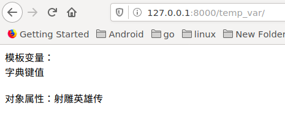

## 标签

语法如下：

```

```

for 标签语法如下：

```

循环逻辑
{{forloop.counter}}表示当前是第几次循环，从1开始

列表为空或不存在时执行此逻辑

```

if 标签语法如下：

```

逻辑1

逻辑2

逻辑3

```

比较运算符如下：

> 注意：运算符左右两侧不能紧挨变量或常量，必须有空格。

```
==
!=
<
>
<=
>=
```

布尔运算符如下：

```
and
or
not
```

点击查看[内建标签](http://python.usyiyi.cn/translate/django_182/ref/templates/builtins.html)了解更多标签，还有一些常用的标签会在后续地章节中讲解。

### 示例

1）打开 `booktest/views.py` 文件，创建视图 temp_tag 。

```
from booktest.models import BookInfo
def temp_tags(request):
    context = {"list":BookInfo.objects.all()}
    return render(request, 'booktest/temp_tags.html', context)
```

2）打开 `booktest/urls.py` 文件，配置 url 。

```
    url(r'^temp_tag/$', views.temp_tags),
```

3）在 `templates/booktest` 下创建 `temp_tag.html` 。

```
<!DOCTYPE html>
<html lang="en">
<head>
    <meta charset="UTF-8">
    <title>标签</title>
</head>
<body>
图书列表如下：
<ul>
    
        
            <li style="background-color: red">{{ book.btitle }}</li>
        
             <li style="background-color: blue">{{ book.btitle }}</li>
        
             <li style="background-color: greenyellow">{{ book.btitle }}</li>
        
        
            <li>对不起，没有图书</li>
    
</ul>
</body>
</html>
```

4）运行服务器，在浏览器中输入如下网址，浏览效果如下图：

```
http://127.0.0.1:8000/temp_tags/
```


## 过滤器

语法如下:

- 使用管道符号|来应用过滤器，用于进行计算、转换操作，可以使用在变量、标签中。
- 如果过滤器需要参数，则使用冒号:传递参数。

```
变量|过滤器:参数
```

长度 length ，返回字符串包含字符的个数，或列表、元组、字典的元素个数。

默认值 default，如果变量不存在时则返回默认值。

```
data|default:'默认值'
```

日期 date，用于对日期类型的值进行字符串格式化，常用的格式化字符如下：

- Y 表示年，格式为 4 位，y 表示两位的年。
- m 表示月，格式为 01,02,12 等。
- d 表示日, 格式为 01,02 等。
- j 表示日，格式为 1,2 等。
- H 表示时，24 进制，h 表示 12 进制的时。
- i 表示分，为 0-59。
- s 表示秒，为 0-59。

```
value|date:"Y年m月j日  H时i分s秒"
```

点击查看[内建过滤器](http://python.usyiyi.cn/translate/django_182/ref/templates/builtins.html)了解更多过滤器。

### 示例

1）打开 `booktest/views.py` 文件，创建视图 temp_filter 。

```
def temp_filter(request):
    context={'list':BookInfo.objects.all()}
    return render(request,'booktest/temp_filter.html',context)
```

2）打开 `booktest/urls.py` 文件，配置 `url` 。

```
    url(r'^temp_filter/$', views.temp_filter),
```

3）在 `templates/booktest`下创建 `temp_filter.html` 。

```
<head>
    <title>过滤器</title>
</head>
<body>
图书列表如下：
<ul>
    
        
            <li style="background-color: red;">
                {{book.btitle}}
                ---默认时间格式为：
                {{book.bpub_date}}
            </li>
        
            <li style="background-color: green;">
                {{book.btitle}}
                ---格式化时间为：
                {{book.bpub_date|date:"Y-m-j"}}
            </li>
        
    
</ul>
</body>
</html>
```

4）运行服务器，在浏览器中输入如下网址，浏览效果如下图：

```
http://127.0.0.1:8000/temp_filter/
```

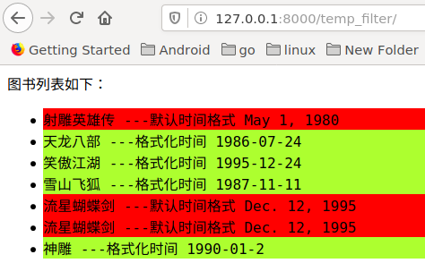

## 自定义过滤器

过滤器就是 python 中的函数，注册后就可以在模板中当作过滤器使用，下面以求余为例开发一个自定义过滤器 mod 。

### 示例

1）在应用中创建 templatetags 目录，当前示例为 `booktest/templatetags` ，创建 `__init__.py` 文件，内容为空。

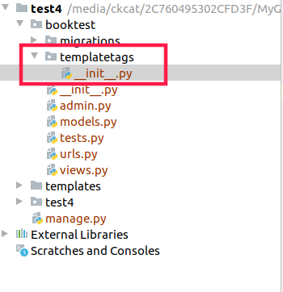

2）在 `booktest/templatetags` 目录下创建 `filters.py`文件，代码如下：

```
#导入Library类
from django.template import Library

#创建一个Library类对象
register=Library()

#使用装饰器进行注册
@register.filter
#定义求余函数mod，将value对2求余
def mod(value):
    return value%2 == 0
```

3）在 templates/booktest/temp_filter.html 中，使用自定义过滤器。

- 首先使用 load 标签引入模块。

```

```

- 在遍历时添加如下代码：

```

    <li style="background-color: yellow">
    {{ book.btitle }}
    ---默认时间格式
    {{ book.bpub_date }}
```

4）运行服务器，浏览效果如下：

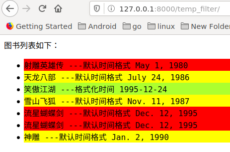

过滤器可以接收参数，将 `booktest/templatetags/filters.py` 中增加 mod_num 函数。

```
#使用装饰器进行注册
@register.filter
#定义求余函数mod_num，将value对num求余
def mod_num(value,num):
    return value%num
```

5）在 `templates/booktest/temp_filter.html` 中修改遍历时判断代码。

```

    <li style="background-color: cornflowerblue">
    {{ book.btitle }}
    ---默认时间格式
    {{ book.bpub_date }}
```

6）运行服务器，浏览效果如下：

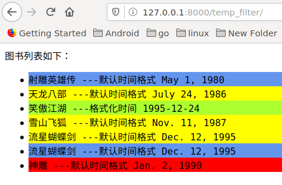

## 注释

在模板中使用如下模板注释，这段代码不会被编译，不会输出到客户端；html 注释只能注释 html 内容，不能注释模板语言。

1）单行注释语法如下：

```
{#...#}
```

注释可以包含任何模版代码，有效的或者无效的都可以。

```
{# { % if foo % }bar{ % else % } #}
```

2）多行注释使用 comment 标签，语法如下：

```

...

```

# 模板继承

模板继承和类的继承含义是一样的，主要是为了提高代码重用，减轻开发人员的工作量。

**典型应用：网站的头部、尾部信息。**

## 父模板

如果发现在多个模板中某些内容相同，那就应该把这段内容定义到父模板中。

`标签 block` ：用于在父模板中预留区域，留给子模板填充差异性的内容，名字不能相同。 为了更好的可读性，建议给 endblock 标签写上名字，这个名字与对应的 block 名字相同。父模板中也可以使用上下文中传递过来的数据。

```

预留区域，可以编写默认内容，也可以没有默认内容

```

## 子模板

`标签 extends` ：继承，写在子模板文件的第一行。

```

```

子模版不用填充父模版中的所有预留区域，如果子模版没有填充，则使用父模版定义的默认值。

填充父模板中指定名称的预留区域。

```

实际填充内容
{{block.super}}用于获取父模板中block的内容

```

### 示例

1）打开 `booktest/views.py` 文件，创建视图 temp_inherit 。

```
def temp_inherit(request):
    context={'title':'模板继承','list':BookInfo.objects.all()}
    return render(request,'booktest/temp_inherit.html',context)
```

2）打开 `booktest/urls.py` 文件，配置 url 。

```
    url(r'^temp_inherit/$', views.temp_inherit),
```

3）在 templates 下创建 `inherit_base.html` 。

```
<html>
<head>
    <title>{{title}}</title>
</head>
<body>
<h2>这是头</h2>
<hr>

这是区域一，有默认值

<hr>


<hr>
<h2>这是尾</h2>
</body>
</html>
```

4）在 `templates/booktest` 下创建 `temp_inherit.html` 。

```


<ul>
    
    <li>{{book.btitle}}</li>
    
</ul>

```

5）运行服务器，在浏览器中输入如下网址,浏览效果如下图。

```
http://127.0.0.1:8000/temp_inherit/
```

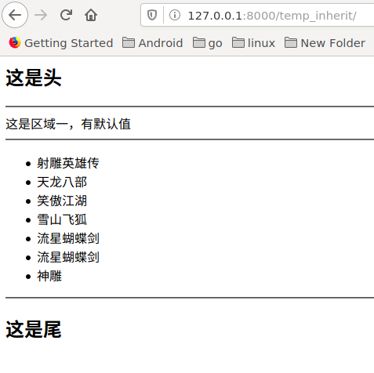

## HTML 转义

模板对上下文传递的字符串进行输出时，会对以下字符自动转义。

```
小于号< 转换为 &lt;

大于号> 转换为 &gt;

单引号' 转换为 &#39;

双引号" 转换为 &quot;

与符号& 转换为 &amp;
```

### 示例

1）打开 `booktest/views.py` 文件，创建视图 html_escape 。

```
def html_escape(request):
    context={'content':'<h1>hello world</h1>'}
    return render(request,'booktest/html_escape.html',context)
```

2）打开 `booktest/urls.py` 文件，配置 url 。

```
    url(r'^html_escape/$', views.html_escape),
```

3）在 `templates/booktest/` 目录下创建 `html_escape.html` 。

```
<html>
<head>
    <title>转义</title>
</head>
<body>
自动转义：{{content}}
</body>
</html>
```

4）运行服务器，在浏览器中输入如下网址。

```
http://127.0.0.1:8000/html_escape/
```

> 转义后标记代码不会被直接解释执行，而是被直接呈现，防止客户端通过嵌入 js 代码攻击网站.

浏览效果如下图:


## 关闭转义

过滤器 `escape` 可以实现对变量的 html 转义，默认模板就会转义，一般省略。

```
{{t1|escape}}
```

过滤器 `safe`：禁用转义，告诉模板这个变量是安全的，可以解释执行。

```
{{data|safe}}
```

1）修改 templates/booktest/html_escape.html 代码如下。

```
<html>
<head>
    <title>转义</title>
</head>
<body>
自动转义：{{content}}
<hr>
过滤器safe关闭转义：{{content|safe}}
</body>
</html>
```

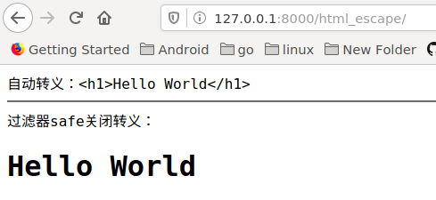

标签 `autoescape` ：设置一段代码都禁用转义，接受 on、off 参数。

```


...


```

1）修改 `templates/booktest/html_escape.html` 代码如下。

```
<html>
<head>
    <title>转义</title>
</head>
<body>
自动转义：{{content}}
<hr>
过滤器safe关闭转义：{{content|safe}}
<hr>
标签autoescape关闭转义：

{{content}}

</body>
</html>
```

刷新浏览器后效果如下图：

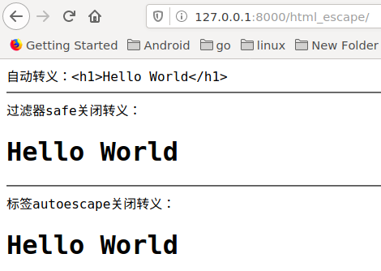

## 字符串字面值

对于在模板中硬编码的 html 字符串，不会转义。

1）修改 `templates/booktest/html_escape.html` 代码如下：

```
<html>
<head>
    <title>转义</title>
</head>
<body>
自动转义：{{content}}
<hr>
过滤器safe关闭转义：{{content|safe}}
<hr>
标签autoescape关闭转义：

{{content}}

<hr>
模板硬编码不转义：{{data|default:'<h1>hello</h1>'}}
</body>
</body>
</html>
```

2）刷新浏览器后效果如下图：

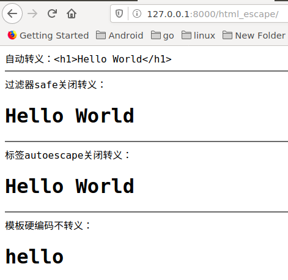

如果希望出现转义的效果，则需要手动编码转义。

1）修改 templates/booktest/html_escape.html 代码如下：

```
<html>
<head>
    <title>转义</title>
</head>
<body>
自动转义：{{content}}
<hr>
过滤器safe关闭转义：{{content|safe}}
<hr>
标签autoescape关闭转义：

{{content}}

<hr>
模板硬编码不转义：{{data|default:'<h1>hello</h1>'}}
<hr>
模板硬编码手动转义：{{data|default:"&lt;h1&gt;123&lt;/h1&gt;"}}
</body>
</html>
```

2）刷新浏览器后效果如下图：

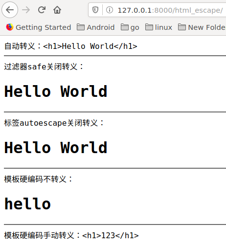

# CSRF

CSRF 全拼为 `Cross Site Request Forgery` ，译为跨站请求伪造。CSRF 指攻击者盗用了你的身份，以你的名义发送恶意请求。

CSRF 示意图如下：

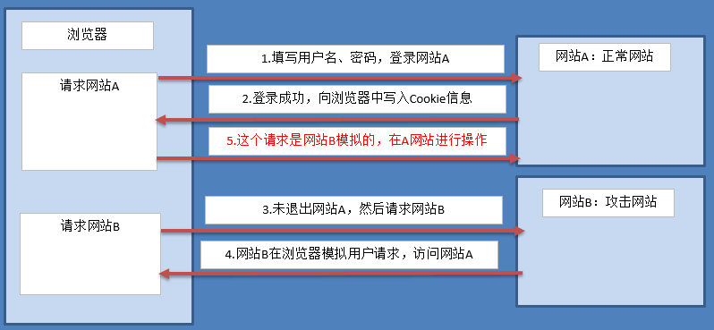

如果想防止 CSRF ，首先是重要的信息传递都采用 POST 方式而不是 GET 方式，接下来就说 POST 请求的攻击方式以及在 Django 中的避免。

## 示例

攻击过程的操作了解即可，不需要重现。

1）打开 `booktest/views.py` 文件，创建视图 login ， login_check , post 和 post_action 。

```
def login(reqeust):
    return render(reqeust, 'booktest/login.html')

def login_check(request):
    username = request.POST.get('username') #获取用户名
    password = request.POST.get('password') #获取密码

    # 校验
    if username == 'smart' and password == '123':
        request.session['username']=name #记住登录用户名
        request.session['islogin']=True　#判断用户是否已登录
        return redirect('/post/')
    else:
        return redirect('／login/')

def post(request):
    return render(request, 'booktest/post.html')

def post_action(request):
    if request.session['islogin']:
        username = request.session['username']
        return HttpResponse('用户'+username+'发了一篇帖子')
    else:
        return HttpResponse('发帖失败')
```

2）打开 booktest/urls.py 文件，配置 url。

```
url(r'^login/$', views.login),
url(r'^login_check/$', views.login_check),
url(r'^post/$', views.post),
url(r'^post_action/$',views.post_action),
```

3）在 `templates/booktest/` 目录下创建 `login.html` 和 `post.html` 。

```
login.html

<!DOCTYPE html>
<html lang="en">
<head>
    <meta charset="UTF-8">
    <title>登录案例</title>
</head>
<body>
<form method="post" action="/login_check/">
    用户名：<input type="text" name="username"/><br/>
    密码：<input type="password" name="password"/><br/>
    <input type="submit" value="提交"/>
</form>
</body>
</html>

post.html

<!DOCTYPE html>
<html lang="en">
<head>
    <meta charset="UTF-8">
    <title>发帖页</title>
</head>
<body>
<form method="post" action="/post_action/">
    标题:<input type="text" name="title"/><br/>
    内容:<textarea name="content"></textarea>
    <input type="submit" value="发帖"/>
</form>
</body>
</html>
```

4）启动运行服务器，采用 IP 的方式，因为要演示其它 IP 的请求。

```
python3 manage.py runserver 192.168.141.130:8000
```

5）回到 windows 中，在浏览器中输入如下网址，将这个标签称为网站 A。

```
http://127.0.0.1:8000/post/
```

浏览效果如下图：

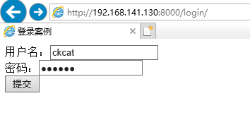

输入用户名和密码，点击登录，效果如下图：


6）下面使用 windows 中使用 Django 模拟一个网站，创建 `post.html`，复制 `templates/booktest/post.html` 内容，并修改 `action` 路径。

```
<html>
<head>
    <title>发帖页</title>
</head>
<body>
<form method="post" action="http://192.168.141.130:8000/post_action/">
  标题:<input type="text" name="title"/><br/>
  内容:<textarea name="content"></textarea>
  <input type="submit" value="发帖"/>
</form>
</body>
</html>
```

7）在 windows 中浏览器查看效果如下图，将这个标签称为网站 B。

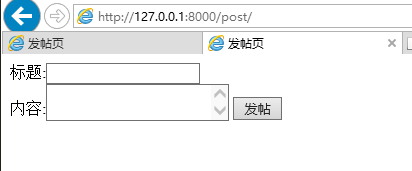

8）Django 项目中默认启用了 csrf 保护，现在先禁用，打开 `test4/settings.py` 文件，注释掉 csrf 中间件。

```
MIDDLEWARE_CLASSES = (
    'django.contrib.sessions.middleware.SessionMiddleware',
    'django.middleware.common.CommonMiddleware',
    # 'django.middleware.csrf.CsrfViewMiddleware',# 禁用
    'django.contrib.auth.middleware.AuthenticationMiddleware',
    'django.contrib.auth.middleware.SessionAuthenticationMiddleware',
    'django.contrib.messages.middleware.MessageMiddleware',
    'django.middleware.clickjacking.XFrameOptionsMiddleware',
    'django.middleware.security.SecurityMiddleware',
)
```

9）点击游览器的第一个标签即网站 A，点击"发帖"按钮后如下图：

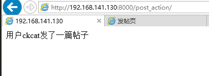

10）点击游览器的第二个标签即 IIS 网站 B，点击“发帖”按钮后如下图：


对比上面两张图，发现无论从网站 A 还是网站 B 都可以访问网站 A 的 post_action 视图，这就是不安全的。

## 防止 CSRF

1）Django 提供了 csrf 中间件用于防止 CSRF 攻击，只需要在 `test4/settings.py` 中启用 csrf 中间件即可。

```
MIDDLEWARE_CLASSES = (
    'django.contrib.sessions.middleware.SessionMiddleware',
    'django.middleware.common.CommonMiddleware',
    'django.middleware.csrf.CsrfViewMiddleware', # 启用csrf中间件
    'django.contrib.auth.middleware.AuthenticationMiddleware',
    'django.contrib.auth.middleware.SessionAuthenticationMiddleware',
    'django.contrib.messages.middleware.MessageMiddleware',
    'django.middleware.clickjacking.XFrameOptionsMiddleware',
    'django.middleware.security.SecurityMiddleware',
)
```

2）回到 windows 浏览器中，分别在网站 A、网站 B 中点击“提交”按钮，效果一样，如下图：


3）接下来 `templates/booktest/post.html`内容，在 form 表单中使用标签 `csrf_token` 。

```
<!DOCTYPE html>
<html lang="en">
<head>
    <meta charset="UTF-8">
    <title>发帖页</title>
</head>
<body>
<form method="post" action="/post_action/">
    
    标题:<input type="text" name="title"/><br/>
    内容:<textarea name="content"></textarea>
    <input type="submit" value="发帖"/>
</form>
</body>
</html>
```

4）回到 windows 浏览器中，在网站 A 中点击“提交”按钮，效果如下图：


好了，Django 中成功完成 CSRF 防护。

## 保护原理

加入标签后，可以查看 post.html 的源代码，发现多了一个隐藏域。

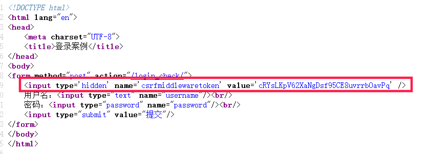

在浏览器的“开发者工具”中查看 cookie 信息。


说明：当启用中间件并加入标签 csrf_token 后，会向客户端浏览器中写入一条 Cookie 信息，这条信息的值与隐藏域 input 元素的 value 属性是一致的，提交到服务器后会先由 csrf 中间件进行验证，如果对比失败则返回 403 页面，而不会进行后续的处理。

# 验证码

## 手动实现验证码

1）安装包 Pillow3.4.1。

```
pip install Pillow
```

点击查看[PIL 模块 API](http://pillow.readthedocs.io/en/3.4.x/)，以下代码中用到了 Image、ImageDraw、ImageFont 对象及方法。

2）在 booktest/views.py 文件中，创建视图 verify_code。

- 提示 1：随机生成字符串后存入 session 中，用于后续判断。
- 提示 2：视图返回 mime-type 为 image/png。

```
from PIL import Image, ImageDraw, ImageFont
from django.utils.six import BytesIO
...
def verify_code(request):
    #引入随机函数模块
    import random
    #定义变量，用于画面的背景色、宽、高
    bgcolor = (random.randrange(20, 100), random.randrange(
        20, 100), 255)
    width = 100
    height = 25
    #创建画面对象
    im = Image.new('RGB', (width, height), bgcolor)
    #创建画笔对象
    draw = ImageDraw.Draw(im)
    #调用画笔的point()函数绘制噪点
    for i in range(0, 100):
        xy = (random.randrange(0, width), random.randrange(0, height))
        fill = (random.randrange(0, 255), 255, random.randrange(0, 255))
        draw.point(xy, fill=fill)
    #定义验证码的备选值
    str1 = 'ABCD123EFGHIJK456LMNOPQRS789TUVWXYZ0'
    #随机选取4个值作为验证码
    rand_str = ''
    for i in range(0, 4):
        rand_str += str1[random.randrange(0, len(str1))]
    #构造字体对象，ubuntu的字体路径为“/usr/share/fonts/truetype/freefont”
    font = ImageFont.truetype('FreeMono.ttf', 23)
    #构造字体颜色
    fontcolor = (255, random.randrange(0, 255), random.randrange(0, 255))
    #绘制4个字
    draw.text((5, 2), rand_str[0], font=font, fill=fontcolor)
    draw.text((25, 2), rand_str[1], font=font, fill=fontcolor)
    draw.text((50, 2), rand_str[2], font=font, fill=fontcolor)
    draw.text((75, 2), rand_str[3], font=font, fill=fontcolor)
    #释放画笔
    del draw
    #存入session，用于做进一步验证
    request.session['verifycode'] = rand_str
    #内存文件操作
    buf = BytesIO()
    #将图片保存在内存中，文件类型为png
    im.save(buf, 'png')
    #将内存中的图片数据返回给客户端，MIME类型为图片png
    return HttpResponse(buf.getvalue(), 'image/png')
```

3）打开 booktest/urls.py 文件，配置 url。

```
    url(r'^verify_code/$', views.verify_code),
```

4）运行服务器，在浏览器中输入如下网址，效果图如下

```
http://127.0.0.1:8000/verify_code/
```


## 调用验证码

1）在 booktest/views.py 文件中，创建视图 verify_show。

```
def verify_show(request):
    return render(request,'booktest/verify_show.html')
```

2）打开 booktest/urls.py 文件，配置 url。

```
    url(r'^verify_show/$', views.verify_show),
```

3）在 templates/booktest/目录下创建 verify_show.html。

```
<html>
<head>
    <title>验证码</title>
</head>
<body>
<form method="post" action="/verify_yz/">
    
    <input type="text" name="yzm">
    
    <span id="change">看不清，换一个</span>
    <br>
    <input type="submit" value="提交">
</form>
</body>
</html>
```

4）运行服务器，在浏览器中输入如下网址,效果图如下

```
http://127.0.0.1:8000/verify_show/
```

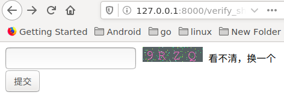

## 验证

1）在 booktest/views.py 文件中，创建视图 verify_yz。

```
def verify_yz(request):
    yzm = request.POST.get('yanzhengma')
    verifycode = request.session['verifycode']
    response = HttpResponse(yzm + " " + verifycode)

    if yzm.upper() == verifycode.upper():
        response = HttpResponse('OK')
    return response
```

2）打开 booktest/urls.py 文件，配置 url。

```
    url(r'^verify_yz/$', views.verify_yz),
```

3）回到浏览器后刷新，在文本框中填写验证码，点击提交按钮。


# 反向解析

反向解析应用在两个地方：模板中的超链接，视图中的重定向。

## 示例

1）在 `test4/urls.py` 中为 include 定义 namespace 属性。

```
    url(r'^',include('booktest.urls',namespace='booktest')),
```

2）在 `booktest/urls.py` 中为 url 定义 name 属性，并修改为 fan2。

```
    url(r'^fan2/$', views.fan2,name='fan2'),
```

3）在模板中使用 url 标签做超链接，此处为 `templates/booktest/fan1.html` 文件。

```
<html>
<head>
    <title>反向解析</title>
</head>
<body>
普通链接：<a href="/fan2/">fan2</a>
<hr>
反向解析：<a href="">fan2</a>
</body>
</html>
```

4）回到浏览器中，后退，刷新，查看源文件如下图，两个链接地址一样。

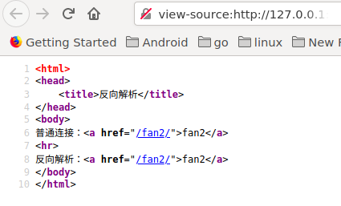

5）在 `booktest/urls.py` 中，将 fan2 修改为 fan_show 。

```
    url(r'^fan_show/$', views.fan2,name='fan2'),
```

6）回到浏览器中，刷新，查看源文件如下图，两个链接地址不一样。


7）反向解析也可以应用在视图的重定向中。

```
from django.shortcuts import redirect
from django.core.urlresolvers import reverse

return redirect(reverse('booktest:fan2'))
```

总结：在定义 url 时，需要为 include 定义 namespace 属性，为 url 定义 name 属性，使用时，在模板中使用 url 标签，在视图中使用 reverse 函数，根据正则表达式动态生成地址，减轻后期维护成本。

## URL 的参数

有些 url 配置项正则表达式中是有参数的，接下来讲解如何传递参数。

### 情况一：位置参数

1）在 `booktest/urls.py` 中，添加 fan3 如下：

```
    url(r'^fan(\d+)_(\d+)/$', views.fan3,name='fan3'),
```

2）在 `booktest/views`中，定义视图 fan3 如下:

```
def fan3(request, a, b):
    return HttpResponse(a+b)
```

3）修改 `templates/booktest/fan1.html` 文件如下：

```
<html>
<head>
    <title>反向解析</title>
</head>
<body>
普通连接：<a href="/fan2/">fan2</a>
<hr>
反向解析：<a href="">fan2</a>

<hr>
位置参数：<a href="">fan3</a>
</body>
</html>
```

4）回到浏览器中，刷新，查看源文件如下图：

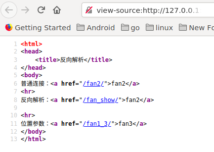

使用重定向传递位置参数格式如下：

```
return redirect(reverse('booktest:fan3', args=(2,3)))
```

### 情况二：关键字参数

1）在 `booktest/urls.py` 中，修改 fan2 如下：

```
    url(r'^fan(?P<id>\d+)_(?P<age>\d+)/$', views.fan4,name='fan2'),
```

2）在 `booktest/views` 中，定义视图 fan4 如下:

```
def fan4(request, id, age):
    return HttpResponse(id+age)
```

3）修改 `templates/booktest/fan1.html` 文件如下：

```
<html>
<head>
    <title>反向解析</title>
</head>
<body>
普通连接：<a href="/fan2/">fan2</a>
<hr>
反向解析：<a href="">fan2</a>

<hr>
位置参数：<a href="">fan3</a>

<hr>
关键字参数<a href="">fan4</a>
</body>
</html>
```

4）回到浏览器中，刷新，查看源文件如下图：


使用重定向传递关键字参数格式如下：

```
return redirect(reverse('booktest:fan4', kwargs={'id':100,'age':18}))
```
