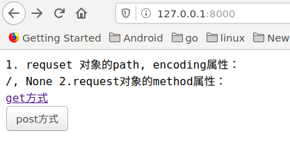
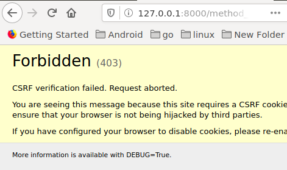
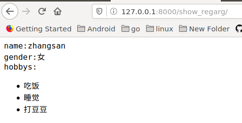
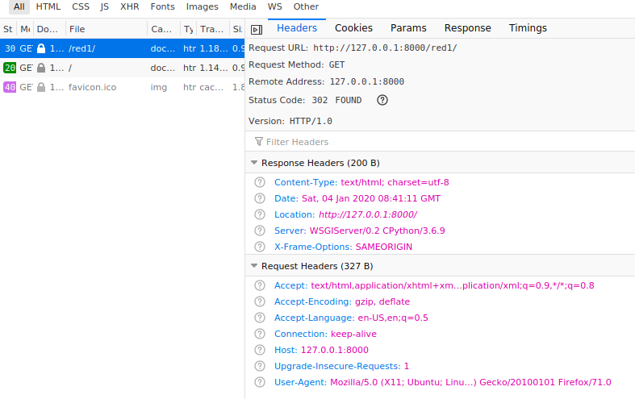
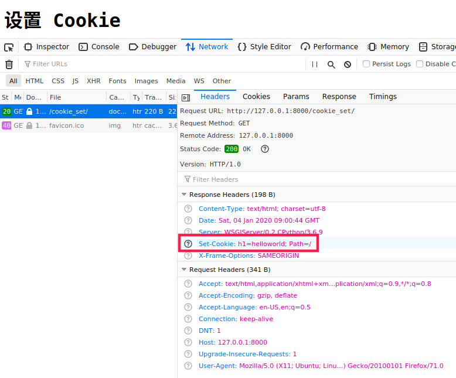
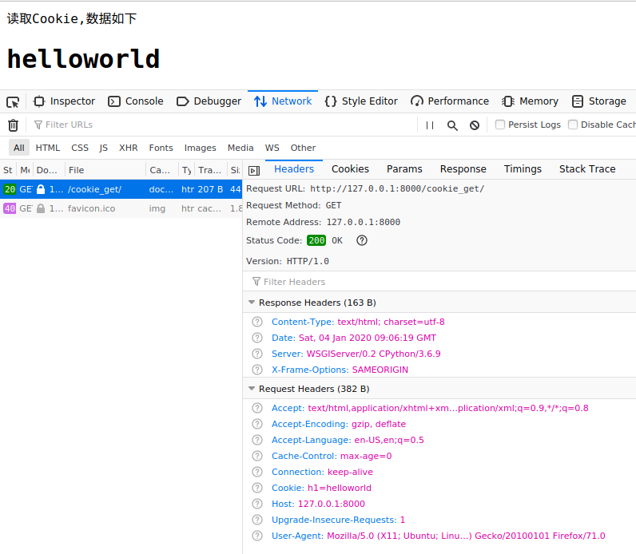
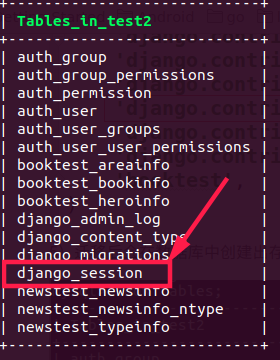

# 视图

视图的功能

视图负责接受 Web 请求 HttpRequest，进行逻辑处理，返回 Web 响应 HttpResponse 给请求者。

## 创建示例项目

### 1. 创建项目 test3

```
django-admin startproject test3
```

### 2. 进入项目目录，创建应用 booktest

```
cd test3
test3 python manage.py startapp booktest
```

### 3. 在 `test3/settings.py` 中 `INSTALLED_APPS` 项安装应用

```
INSTALLED_APPS = (
    'django.contrib.admin',
    'django.contrib.auth',
    'django.contrib.contenttypes',
    'django.contrib.sessions',
    'django.contrib.messages',
    'django.contrib.staticfiles',
    'booktest',
)
```

### 4. 在 `test3/settings.py` 中 DATABASES 项配置使用 MySQL 数据库 `test2`

```
DATABASES = {
    'default': {
        'ENGINE': 'django.db.backends.mysql',
        'NAME': 'test2',
        'HOST': 'localhost',
        'PORT': '3306',
        'USER': 'ckcat',
        'PASSWORD': 'mysql'
    }
}
```

并在 `test/__init__.py` 中加入以下内容

```
import pymysql

pymysql.install_as_MySQLdb()
```

### 5. 在 `test3/settings.py` 中 `TEMPLATES` 项配置模板查找路径

```
TEMPLATES = [
    {
        'BACKEND': 'django.template.backends.django.DjangoTemplates',
        'DIRS': [os.path.join(BASE_DIR, 'templates')],
        'APP_DIRS': True,
        ...
    },
]

```

### 6. 创建模板目录 `test3/templates/booktest` 。

### 7. 使用视图

1. 在 `booktest/views.py` 中定义视图函数 index：

```
from django.shortcuts import render, HttpResponse

def index(request):
    return HttpResponse("视图函数Index")
```

2. 在 `test3/urls.py` 中编辑加入如下代码：

```
from django.conf.urls import include, url
from django.contrib import admin

urlpatterns = [
    url(r'^admin/', include(admin.site.urls)),
    url(r'^', include('booktest.urls'))
]
```

3. 在 booktest 目录下创建 `urls.py` 文件并编辑其内容如下：

```
from django.conf.urls import url
from booktest import views

urlpatterns = [
    url(r'^$', views.index)
]
```

### 8. 启动服务

```
python manage.py runserver
```

# URLconf

用户通过在浏览器的地址栏中输入网址请求网站，对于 Django 开发的网站，由哪一个视图进行处理请求，是由 url 匹配找到的。

## 配置

### 1. 在 `test3/settings.py` 中通过 ROOT_URLCONF 指定 url 配置，默认已经有此配置。

```
ROOT_URLCONF = 'test3.urls'
```

### 2. 打开 `test3/urls.py` 可以看到默认配置。

```
from django.conf.urls import include, url
from django.contrib import admin

urlpatterns = [
    url(r'^admin/', include(admin.site.urls)),
]
```

**注意点**

- 在 `test3/urls.py` 中进行包含配置，在各自应用中创建具体配置。
- 定义 `urlpatterns` 列表，存储 `url()` 对象，这个名称是固定的。
  > urlpatterns 中的每个正则表达式在第一次访问它们时被编译，这使得运行很快。

## 语法

`url()` 对象，被定义在 `django.conf.urls` 包中，有两种语法结构：

### 语法一

包含，一般在自定义应用中创建一个 urls.py 来定义 url。

```
url(正则,include('应用.urls'))
```

### 语法二

定义，指定 URL 和视图函数的对应关系。

```
url(正则,'视图函数名称')
```

> 说明 1：正则部分推荐使用 r，表示字符串不转义，这样在正则表达式中使用\只写一个就可以。

> 说明 2：不能在开始加反斜杠，推荐在结束加反斜杠。

## 获取值

请求的 url 被看做是一个普通的 python 字符串，进行匹配时不包括域名、get 或 post 参数。 如请求地址如下：

```
http://127.0.0.1:8000/delete1/?a=10
```

1）去除掉域名和参数部分，并将最前面的/去除后，只剩下如下部分与正则匹配。

```
delete1/
```

2）打开 booktest/urls.py 文件，定义与这个地址匹配的 url 如下：

```
url(r'^delete\d+/$', views.show_args),
```

3）在 booktest/views.py 中创建视图 show_arg。

```
def show_args(request):
    return HttpResponse('show_args')
```

4）启动服务器，输入上面的网址，浏览器中效果如下图。


可以在匹配过程中从 url 中捕获参数，每个捕获的参数都作为一个普通的 python 字符串传递给视图。

获取值需要在正则表达式中使用小括号，分为两种方式：

- 位置参数
- 关键字参数

> 注意：两种参数的方式不要混合使用，在一个正则表达式中只能使用一种参数方式。

### 方式一：位置参数

直接使用小括号，通过位置参数传递给视图。

1）为了提取参数，修改上面的正则表达式如下：

```
url(r'^delete(\d+)/$',views.show_args),
```

2）修改视图 show_arg 如下：

> 注意：参数的名字是任意的如 a1、b8，尽量做到见名知意。

```
def show_args(request,id):
    return HttpResponse('show args %s'%id)
```

3）刷新浏览器页面，效果如下图：


### 方式二：关键字参数

在正则表达式部分为组命名。

1）修改正则表达式如下：

> 其中 `?P` 部分表示为这个参数定义的名称为 id ，可以是其它名称，起名做到见名知意。

```
url(r'^add(?P<id1>\d+)/', views.show_arg),
```

2）修改视图 show_arg 如下：

> 注意：视图 show_arg 此时必须要有一个参数名为 id1，否则报错。

```
def show_arg(requset, id1):
    return HttpResponse('show_arg %s' % id1)
```

3）刷新浏览器页面，效果如下图


# 视图

视图就是 python 中的函数，视图一般被定义在"应用/views.py"文件中，此例中为"booktest/views.py"文件。视图必须返回一个 HttpResponse 对象或子对象作为响应。响应可以是一张网页的 HTML 内容，一个重定向，一个 404 错误等。

视图的第一个参数必须为 HttpRequest 实例，还可能包含下参数如：

- 通过正则表达式组获得的关键字参数。
- 通过正则表达式组获取的位置参数。

## 内置错误视图

Django 内置处理 HTTP 错误的视图，主要错误及视图包括：

- 404 错误：page not found 视图
- 500 错误：server error 视图

如果想看到错误视图而不是调试信息，需要修改 `test3/setting.py`文件的 DEBUG 项。

```
DEBUG = False
ALLOWED_HOSTS = ['*', ]
```

### 404 错误及视图

将请求地址进行 url 匹配后，没有找到匹配的正则表达式，则调用 404 视图，这个视图会调用 `404.html` 的模板进行渲染。视图传递变量 request_path 给模板，表示导致错误的 URL 。

1）在 templates 中创建 `404.html` 。

2）定义代码如下：

```
<!DOCTYPE html>
<html lang="en">
<head>
    <meta charset="UTF-8">
    <title>404 Page</title>
</head>
<body>
找不到了...
</body>
</html>
```

3）在浏览器中输入无效网址，效果如下：


### 500 错误及视图

在视图中代码运行报错会发生 500 错误，调用内置错误视图，使用 `templates/500.html` 模板渲染。

# HttpReqeust 对象

服务器接收到 http 协议的请求后，会根据报文创建 HttpRequest 对象，这个对象不需要我们创建，直接使用服务器构造好的对象就可以。**视图的第一个参数必须是 HttpRequest 对象**，在 django.http 模块中定义了 HttpRequest 对象的 API。

## 属性

> 下面除非特别说明，属性都是只读的。

- path：一个字符串，表示请求的页面的完整路径，不包含域名和参数部分。

- method：一个字符串，表示请求使用的 HTTP 方法，常用值包括：'GET'、'POST'。

  - 在浏览器中给出地址发出请求采用 get 方式，如超链接。
  - 在浏览器中点击表单的提交按钮发起请求，如果表单的 method 设置为 post 则为 post 请求。

- encoding：一个字符串，表示提交的数据的编码方式。

  - 如果为 None 则表示使用浏览器的默认设置，一般为 utf-8。
  - 这个属性是可写的，可以通过修改它来修改访问表单数据使用的编码，接下来对属性的任何访问将使用新的 encoding 值。

- GET：QueryDict 类型对象，类似于字典，包含 get 请求方式的所有参数。

- POST：QueryDict 类型对象，类似于字典，包含 post 请求方式的所有参数。

- FILES：一个类似于字典的对象，包含所有的上传文件。

- COOKIES：一个标准的 Python 字典，包含所有的 cookie，键和值都为字符串。

- session：一个既可读又可写的类似于字典的对象，表示当前的会话，只有当 Django 启用会话的支持时才可用，详细内容见"状态保持"。

## 示例

接下来演示属性 path 、 method 、 encoding ，对于 GET 、 POST 、 FILES 、 COOKIES 、 session 后面会有详细讲解。

### path、encoding

1）打开 `booktest/views.py` 文件，代码如下：

```
def index(request):
    str='%s,%s'%(request.path,request.encoding)
    return render(request, 'booktest/index.html', {'str':str})
```

2）在 `templates/booktest/` 下创建 `index.html` 文件，代码如下：

```
<html>
<head>
    <title>首页</title>
</head>
<body>
1. request对象的path,encoding属性：<br/>
{{ str }}
<br/>
</body>
</html>
```

3）打开浏览器请求，运行效果如下图：


### method

1）打开 `booktest/views.py` 文件，编写视图 method_show，代码如下：

```
def method_show(request):
    return HttpResponse(request.method)
```

2）打开 `booktest/urls.py` 文件，新增配置如下：

```
url(r'^method_show/$', views.method_show),
```

3）在 `templates/booktest/`下创建 `method_show.html` 文件，添加代码如下：

```
<html>
<head>
    <title>首页</title>
</head>
<body>
...
...
2.request对象的method属性：<br/>
<a href='/method_show/'>get方式</a><br/>
<form method="post" action="/method_show/">
    <input type="submit" value="post方式">
</form>
<br/>
</body>
</html>
```

4）打开浏览器请求，点击 "get 方式" 运行效果如下图：




5. 回到 method_test 页面，点击按钮，转到 method_post，浏览效果如下图，报错了。



6）打开 `test3/settings.py` 文件，将 MIDDLEWARE_CLASSES 项的 csrf 注释。

```
MIDDLEWARE_CLASSES = (
    'django.contrib.sessions.middleware.SessionMiddleware',
    'django.middleware.common.CommonMiddleware',
     #'django.middleware.csrf.CsrfViewMiddleware', # 注释
    'django.contrib.auth.middleware.AuthenticationMiddleware',
    'django.contrib.auth.middleware.SessionAuthenticationMiddleware',
    'django.contrib.messages.middleware.MessageMiddleware',
    'django.middleware.clickjacking.XFrameOptionsMiddleware',
    'django.middleware.security.SecurityMiddleware',
)
```

6）回到浏览器中点击 "post 方式"，浏览效果如下图。


## QueryDict 对象

- 定义在 django.http.QueryDict
- HttpRequest 对象的属性 GET、POST 都是 QueryDict 类型的对象
- 与 python 字典不同，QueryDict 类型的对象用来处理同一个键带有多个值的情况
- 方法 get()：根据键获取值
- 如果一个键同时拥有多个值将获取最后一个值
- 如果键不存在则返回 None 值，可以设置默认值进行后续处理
- 方法 getlist()：根据键获取值，值以列表返回，可以获取指定键的所有值
- 如果键不存在则返回空列表[]，可以设置默认值进行后续处理

## GET 属性

请求格式：在请求地址结尾使用?，之后以"键=值"的格式拼接，多个键值对之间以&连接。

例：网址如下

```
http://www.itcast.cn/?a=10&b=20&c=python
```

其中的请求参数为：

```
a=10&b=20&c=python
```

- 分析请求参数，键为'a'、'b'、'c'，值为'10'、'20'、'python'。
- 在 Django 中可以使用 HttpRequest 对象的 GET 属性获得 get 方方式请求的参数。
- GET 属性是一个 QueryDict 类型的对象，键和值都是字符串类型。
- 键是开发人员在编写代码时确定下来的。
- 值是根据数据生成的。

## POST 属性

使用 form 表单请求时，method 方式为 post 则会发起 post 方式的请求，需要使用 HttpRequest 对象的 POST 属性接收参数，POST 属性是一个 QueryDict 类型的对象。

问：表单 form 如何提交参数呢？

答：表单控件 name 属性的值作为键，value 属性的值为值，构成键值对提交。

- 如果表单控件没有 name 属性则不提交。
- 对于 checkbox 控件，name 属性的值相同为一组，被选中的项会被提交，出现一键多值的情况。
- 键是表单控件 name 属性的值，是由开发人员编写的。
- 值是用户填写或选择的。

### 示例

1）打开 `booktest/views.py` 文件，创建视图 show_reqarg 。

```
#接收请求参数
def show_reqarg(request):
    if request.method == 'GET':
        a = request.GET.get('a') #获取请求参数a
        b = request.GET.get('b') #获取请求参数b
        c = request.GET.get('c') #获取请求参数c
        return render(request, 'booktest/show_getarg.html', {'a':a, 'b':b, 'c':c})
    else:
        name = request.POST.get('uname') #获取name
        gender = request.POST.get('gender') #获取gender
        hobbys = request.POST.getlist('hobby') #获取hobby
        return render(request, 'booktest/show_postarg.html', {'name':name, 'gender':gender, 'hobbys':hobbys})
```

2）打开 `booktest/urls.py` 文件，配置 url 。

```
    url(r'^show_reqarg/$', views.show_reqarg),
```

3）修改 `templates/booktest` 目录下的 `index.html` ，添加代码如下：

```
<html>
<head>
    <title>首页</title>
</head>
<body>
...
...
3.提交数据的两种方式：
get方式:<br/>
<a href="/show_reqarg/?a=1&b=2&c=python">get方式提交数据</a><br/>
post方式:<br/>
<form method="post" action="/show_reqarg/">
    姓名：<input type="text" name="uname"><br/>
    性别：男<input type="radio" name="gender" value="男"/>
    女<input type="radio" name="gender" value="女"/><br/>
    爱好：
    吃饭<input type="checkbox" name="hobby" value="吃饭"/>
    睡觉<input type="checkbox" name="hobby" value="睡觉"/>
    打豆豆<input type="checkbox" name="hobby" value="打豆豆"/><br>
    <input type="submit" value="提交">
</form>
<br/>
</body>
</html>
```

4）运行服务器，浏览效果如下图：


5）在 `templates/booktest` 目录下创建 `show_getarg.html，show_postarg.html` ，代码如下:

show_getarg.html:

```
<html>
<head>
    <title>GET方式提交数据</title>
</head>
<body>
a:{{ a }}<br/>
b:{{ b }}<br/>
c:{{ c }}<br/>
</body>
</html>
```

show_postarg.html:

```
<html>
<head>
    <title>POST方式提交数据</title>
</head>
<body>
name:{{ name }}<br/>
gender:{{ gender }}<br/>
hobbys:
<ul>
    
        <li>{{ hobby }}</li>
    
</ul>
</body>
</html>
```

6）点击链接 GET 方式提交数据，浏览效果如下图：


7）点击 POST 方式提交数据，浏览效果如下图：



# HttpResponse 对象

视图在接收请求并处理后，必须返回 HttpResponse 对象或子对象。在 `django.http` 模块中定义了 HttpResponse 对象的 API 。 HttpRequest 对象由 Django 创建，HttpResponse 对象由开发人员创建。

## 属性

- `content`：表示返回的内容。
- `charset`：表示 response 采用的编码字符集，默认为 utf-8 。
- `status_code`：返回的 HTTP 响应状态码。
- `content-type`：指定返回数据的的 MIME 类型，默认为'text/html'。

## 方法

- `_init_`：创建 HttpResponse 对象后完成返回内容的初始化。
- `set_cookie`：设置 Cookie 信息。
- cookie 是网站以键值对格式存储在浏览器中的一段纯文本信息，用于实现用户跟踪。
  - `max_age` 是一个整数，表示在指定秒数后过期。
  - `expires` 是一个 datetime 或 timedelta l 对象，会话将在这个指定的日期/时间过期。
  - max_age 与 expires 二选一。
  - 如果不指定过期时间，在关闭浏览器时 cookie 会过期。
- delete_cookie(key)：删除指定的 key 的 Cookie，如果 key 不存在则什么也不发生。
- write：向响应体中写数据。

## 示例

### 直接返回数据

1）打开 `booktest/views.py` 文件，定义视图 `index2` 如下：

```
def index2(request):
    str='<h1>hello world</h1>'
    return HttpResponse(str)
```

2）打开 booktest/urls.py 文件，配置 url。

```
    url(r'^index2/$',views.index2),
```

3）运行服务器，在浏览器中打开如下网址。

```
http://127.0.0.1:8000/index2/
```

### 调用模板

可以将 html、css、js 定义到一个 html 文件中，然后由视图来调用。

1）打开 `booktest/views.py` 文件，定义视图 index3 如下：

```
from django.template import RequestContext, loader
...
def index3(request):
    #加载模板
    t1=loader.get_template('booktest/index3.html')
    #构造上下文
    context=RequestContext(request,{'h1':'hello'})
    #使用上下文渲染模板，生成字符串后返回响应对象
    return HttpResponse(t1.render(context))
```

2）打开 `booktest/urls.py` 文件，配置 url 。

```
    url(r'^index3/$',views.index3),
```

3）在 `templates/booktest/` 目录下创建 `index3.html` ，代码如下：

```
<html>
<head>
    <title>使用模板</title>
</head>
<body>
<h1>{{h1}}</h1>
</body>
</html>
```

4）运行服务器，在浏览器中打开如下网址。

```
http://127.0.0.1:8000/index3/
```

### 调用模板简写函数 render

每次调用模板时都要执行加载、上下文、渲染三个步骤，为了简化操作， Django 定义了 `render()` 函数封装了以上三个步骤的代码，定义在 `django.shortcuts` 模块中。

1）打开 `booktest/views.py` 文件，定义视图 index3 如下：

```
from django.shortcuts import render
...
def index3(request):
    return render(request, 'booktest/index3.html', {'h1': 'hello'})
```

## 子类 JsonResponse

在浏览器中使用 javascript 发起 ajax 请求时，返回 json 格式的数据，此处以 jquery 的 get()方法为例。类 JsonResponse 继承自 HttpResponse 对象，被定义在 django.http 模块中，创建对象时接收字典作为参数。

> JsonResponse 对象的 content-type 为'application/json'。

### 示例

1）在 booktest/views.py 文件中定义视图 json1、json2，代码如下：

```
from django.http import JsonResponse
...
def json1(request):
    return render(request,'booktest/json1.html')
def json2(request):
    return JsonResponse({'h1':'hello','h2':'world'})
```

2）在 booktest/urls.py 文件中配置 url。

```
    url(r'^json1/$', views.json1),
    url(r'^json2/$', views.json2),
```

3）创建目录 static/js/，把 jquery 文件拷贝到这个目录下。

4）打开 test3/settings.py 文件，在文件最底部，配置静态文件查找路径，并且要求开启调试

```
DEBUG = True
...
STATICFILES_DIRS = [
    os.path.join(BASE_DIR, 'static'),
]
```

s 5）在 templates/booktest/目录下创建 json1.html，代码如下：

```
<html>
<head>
    <title>json</title>
    <script src="/static/js/jquery-1.12.4.min.js"></script>
    <script>
        $(function () {
            $('#btnJson').click(function () {
                $.get('/json2/',function (data) {
                    ul=$('#jsonList');
                    ul.append('<li>'+data['h1']+'</li>')
                    ul.append('<li>'+data['h2']+'</li>')
                })
            });
        });
    </script>
</head>
<body>
<input type="button" id="btnJson" value="获取json数据">
<ul id="jsonList"></ul>
</body>
</html>
```

6）运行服务器，在浏览器中输入如下地址。

```
http://127.0.0.1:8000/json1/
```

7）点击按钮"获取 json 数据"后浏览如下图。


## 子类 HttpResponseRedirect

当一个逻辑处理完成后，不需要向客户端呈现数据，而是转回到其它页面，如添加成功、修改成功、删除成功后显示数据列表，而数据的列表视图已经开发完成，此时不需要重新编写列表的代码，而是转到这个视图就可以，此时就需要模拟一个用户请求的效果，从一个视图转到另外一个视图，就称为重定向。

Django 中提供了 HttpResponseRedirect 对象实现重定向功能，这个类继承自 HttpResponse，被定义在 django.http 模块中，返回的状态码为 302。

### 示例

1）在 booktest/views.py 文件中定义视图 red1，代码如下：

```
from django.http import HttpResponseRedirect
...
# 定义重定义向视图，转向首页
def red1(request):
    return HttpResponseRedirect('/')
```

2）在 booktest/urls.py 文件中配置 url。

```
    url(r'^red1/$', views.red1),
```

3）在地址栏中输入网址如下：

```
http://127.0.0.1:8000/red1/
```

4）回车后，浏览器地址栏如下图。



### 重定向简写函数 redirect

在 django.shortcuts 模块中为重定向类提供了简写函数 redirect。

1）修改 booktest/views.py 文件中 red1 视图，代码如下：

```
from django.shortcuts import redirect
...
def red1(request):
    return redirect('/')
```

# 状态保持

浏览器请求服务器是无状态的。无状态指一次用户请求时，浏览器、服务器无法知道之前这个用户做过什么，每次请求都是一次新的请求。无状态的应用层面的原因是：浏览器和服务器之间的通信都遵守 HTTP 协议。根本原因是：浏览器与服务器是使用 Socket 套接字进行通信的，服务器将请求结果返回给浏览器之后，会关闭当前的 Socket 连接，而且服务器也会在处理页面完毕之后销毁页面对象。

有时需要保存下来用户浏览的状态，比如用户是否登录过，浏览过哪些商品等。 实现状态保持主要有两种方式：

- 在客户端存储信息使用 Cookie。
- 在服务器端存储信息使用 Session。

## Cookie

Cookie，有时也用其复数形式 Cookies ，指某些网站为了辨别用户身份、进行 session 跟踪而储存在用户本地终端上的数据（通常经过加密）。 Cookie 最早是网景公司的前雇员 Lou Montulli 在 1993 年 3 月的发明。Cookie 是由服务器端生成，发送给 `User-Agent`（一般是浏览器），浏览器会将 Cookie 的 `key/value` 保存到某个目录下的文本文件内，下次请求同一网站时就发送该 Cookie 给服务器（前提是浏览器设置为启用 cookie ）。Cookie 名称和值可以由服务器端开发自己定义，这样服务器可以知道该用户是否是合法用户以及是否需要重新登录等。服务器可以利用 Cookies 包含信息的任意性来筛选并经常性维护这些信息，以判断在 HTTP 传输中的状态。Cookies 最典型记住用户名。

Cookie 是存储在浏览器中的一段纯文本信息，建议不要存储敏感信息如密码，因为电脑上的浏览器可能被其它人使用。

### Cookie 的特点

- Cookie 以键值对的格式进行信息的存储。
- Cookie 基于域名安全，不同域名的 Cookie 是不能互相访问的，如访问 `google.com` 时向浏览器中写了 Cookie 信息，使用同一浏览器访问 `baidu.com` 时，无法访问到 `google.com` 写的 Cookie 信息。
- 当浏览器请求某网站时，会将浏览器存储的跟网站相关的所有 Cookie 信息提交给网站服务器。

### 设置 Cookie

1）打开 booktest/views.py 文件，创建视图 cookie_set。

```
def cookie_set(request):
    response = HttpResponse("<h1>设置Cooki</h1>")
    response.set_cookie('h1', 'hellworld')
    return response
```

2）打开 booktest/urls.py 文件，配置 url。

```
    url(r'^cookie_set/$',views.cookie_set),
```

3）在浏览器输入如下网址。

```
http://127.0.0.1:8000/cookie_set/
```

在"开发者工具"中可以在响应头中查看到设置的 Cookie 信息。



### 读取 Cookie

Cookie 信息被包含在请求头中，使用 request 对象的 COOKIES 属性访问。

1）打开 booktest/views.py 文件，创建视图 cookie_get。

```
def cookie_get(request):
    response = HttpResponse("读取Cookie，数据如下：<br>")
    if 'h1' in request.COOKIES:
        response.write('<h1>' + request.COOKIES['h1'] + '</h1>')
    return response
```

2）打开 booktest/urls.py 文件，配置 url。

```
    url(r'^cookie_get/$',views.cookie_get),
```

3）在浏览器输入如下网址。

```
http://127.0.0.1:8000/cookie_get/
```

4）打开“开发者工具”，在请求头中可以查看 Cookie 信息，浏览效果如下图：



## Session

对于敏感、重要的信息，建议要储在服务器端，不能存储在浏览器中，如用户名、余额、等级、验证码等信息。

> 在服务器端进行状态保持的方案就是 Session。

### 启用 Session

Django 项目默认启用 Session。

打开 `test3/settings.py` 文件，在项 MIDDLEWARE_CLASSES 中启用 Session 中间件。

```
MIDDLEWARE_CLASSES = (
    'django.contrib.sessions.middleware.SessionMiddleware',#默认启动
    'django.middleware.common.CommonMiddleware',
     #'django.middleware.csrf.CsrfViewMiddleware',
    'django.contrib.auth.middleware.AuthenticationMiddleware',
    'django.contrib.auth.middleware.SessionAuthenticationMiddleware',
    'django.contrib.messages.middleware.MessageMiddleware',
    'django.middleware.clickjacking.XFrameOptionsMiddleware',
    'django.middleware.security.SecurityMiddleware',
)
```

禁用 Session：将 Session 中间件删除。

### 存储方式

打开 `test3/settings.py` 文件，设置 SESSION_ENGINE 项指定 Session 数据存储的方式，可以存储在数据库、缓存、Redis 等。

1）存储在数据库中，如下设置可以写，也可以不写，这是默认存储方式。

```
SESSION_ENGINE='django.contrib.sessions.backends.db'
```

2）存储在缓存中：存储在本机内存中，如果丢失则不能找回，比数据库的方式读写更快。

```
SESSION_ENGINE='django.contrib.sessions.backends.cache'
```

3）混合存储：优先从本机内存中存取，如果没有则从数据库中存取。

```
SESSION_ENGINE='django.contrib.sessions.backends.cached_db'
```

4）如果存储在数据库中，需要在项 INSTALLED_APPS 中安装 Session 应用。

```
INSTALLED_APPS = (
    'django.contrib.admin',
    'django.contrib.auth',
    'django.contrib.contenttypes',
    'django.contrib.sessions', # 如果sessions存储在数据库中，则需要安装该应用
    'django.contrib.messages',
    'django.contrib.staticfiles',
    'booktest',
)
```

5）迁移后会在数据库中创建出存储 Session 的表。



6）表结构如下图。


> 由表结构可知，操作 Session 包括三个数据：键，值，过期时间。

### 依赖于 Cookie

所有请求者的 Session 都会存储在服务器中，服务器如何区分请求者和 Session 数据的对应关系呢？

答：在使用 Session 后，会在 Cookie 中存储一个 sessionid 的数据，每次请求时浏览器都会将这个数据发给服务器，服务器在接收到 sessionid 后，会根据这个值找出这个请求者的 Session。

结果：如果想使用 Session，浏览器必须支持 Cookie，否则就无法使用 Session 了。

存储 Session 时，键与 Cookie 中的 sessionid 相同，值是开发人员设置的键值对信息，进行了 base64 编码，过期时间由开发人员设置。

### 对象及方法

通过 HttpRequest 对象的 session 属性进行会话的读写操作。

1） 以键值对的格式写 session。

```
request.session['键']=值
```

2）根据键读取值。

```
request.session.get('键',默认值)
```

3）清除所有 session，在存储中删除值部分。

```
request.session.clear()
```

4）清除 session 数据，在存储中删除 session 的整条数据。

```
request.session.flush()
```

5）删除 session 中的指定键及值，在存储中只删除某个键及对应的值。

```
del request.session['键']
```

6）设置会话的超时时间，如果没有指定过期时间则两个星期后过期。

```
request.session.set_expiry(value)
```

- 如果 value 是一个整数，会话将在 value 秒没有活动后过期。
- 如果 value 为 0，那么用户会话的 Cookie 将在用户的浏览器关闭时过期。
- 如果 value 为 None，那么会话永不过期。

### 示例

#### 写 session

1）打开 `booktest/views.py` 文件，创建视图 session_test ，代码如下：

```
def session_test(request):
    request.session['h1'] = 'hello django'
    return HttpResponse("写 Session")
```

2）打开 `booktest/urls.py` 文件，配置 url 。

```
    url(r'^session_test/$',views.session_test),
```

3）运行服务器，打开浏览器请求如下网址。

```
http://127.0.0.1:8000/session_test/
```

4）浏览效果如下图，在"开发者工具"中可以查看到响应头中创建了 Cookie ，里面有个键为 sessionid 。


5）打开 MySQL 数据库命令行，查询数据如下图。


查看 Cookie 中的 sessionid 值为 `v5w6h9k1b12kfkncvjmqa0yj2x5egt0h` ，数据表中 session 的键为 `v5w6h9k1b12kfkncvjmqa0yj2x5egt0h` ，是一样的，这样，服务器就可以在众多的请求者中找到对应的 Session 数据。

在 MySQL 数据库命令行中复制值，在 Base64 解码中进行解码查看如下图。


#### 读 session

1）打开 `booktest/views.py` 文件，添加 session_read 视图如下：

```
def session_read(request):
    h1 = request.session.get("h1")
    return HttpResponse(h1)
```

2）刷新浏览器效果如下图。


#### 删除

1）打开 `booktest/views.py` 文件，添加 session_del 视图如下：

```
def session_del(request):
    del request.session["h1"]
    return HttpResponse("del OK")
```

2）刷新浏览器，在数据库命令行中查询，base64 解码后如下图。


如果将所有的键及值都删除，逐个调用 del 太麻烦，可以使用 clear()方法。

#### 删除 session

1）打开 `booktest/views.py` 文件，添加 del_session 视图如下：

```
def del_session(request):
    request.session.flush()
    return HttpResponse("Del session OK")
```

2）刷新浏览器，在数据库命令行中查询如下图。


