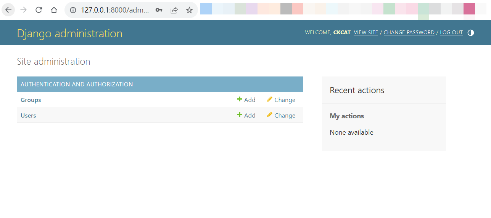

# 创建博客应用

## 创建第一个 Django 项目

Django 提供了一个创建项目并且初始化其中目录结构和文件的命令，在命令行模式中输入：

```bash
$ django-admin startproject mysite
$ tree mysite
mysite
├── manage.py
└── mysite
    ├── __init__.py
    ├── asgi.py
    ├── settings.py
    ├── urls.py
    └── wsgi.py

2 directories, 6 files
```

这会创建一个项目，名称叫做 `mysite`，项目中的文件解释如下：

- `manage.py`：是一个命令行工具，可以通过这个文件管理项目。其实是一个 `django-admin.py` 的包装器，这个文件在创建项目过程中不需要编辑。
- `mysite`：这是项目目录，由以下文件组成：
  - `__init__.py`：一个空文件，告诉 Python 将 `mysite` 看成一个包。
  - `settings.py`：这是当前项目的设置文件，包含一些初始设置
  - `urls.py`：这是 URL patterns 的所在地，其中的每一行 URL，表示 URL 地址与视图的一对一映射关系。
  - `wsgi.py`：这是自动生成的当前项目的 WSGI 程序，用于将项目作为一个 WSGI 程序启动。
  - `asgi.py`：这是自动生成的当前项目的 ASGI 程序，用于将项目作为一个 ASGI 程序启动。

自动生成的 `settings.py` 是当前项目的配置文件，包含一个用于使用 SQLite 3 数据库的设置，以及一个叫做 `INSTALLED_APPS` 的列表。`INSTALLED_APPS` 包含 Django 默认添加到一个新项目中的所有应用。

为了完成项目创建，还必须在数据库里创建起 `INSTALLED_APPS` 中的应用所需的数据表，打开系统命令行输入下列命令：

```bash
$ python manage.py migrate
Operations to perform:
  Apply all migrations: admin, auth, contenttypes, sessions
Running migrations:
    ...
  Applying sessions.0001_initial... OK
```

这些输出表示 Django 刚刚执行的数据库迁移（migrate）工作，在数据库中创建了这些应用所需的数据表。

Django 提供了一个轻量级的 Web 服务程序，无需在生产环境即可快速测试开发中的站点。启动这个服务之后，会检查所有的代码是否正确，还可以在代码被修改之后，自动重新载入修改后的代码，但部分情况下比如向项目中加入了新的文件，还需要手工关闭服务再重新启动。

在命令行中输入下列命令就可以启动站点：

```bash
$ python manage.py runserver
Watching for file changes with StatReloader
Performing system checks...

System check identified no issues (0 silenced).
April 19, 2024 - 16:47:33
Django version 4.2.8, using settings 'mysite.settings'
Starting development server at http://127.0.0.1:8000/
Quit the server with CTRL-BREAK.
```

现在可以在浏览器中打开 `http://127.0.0.1:8000/`，会看到成功运行站点的页面。

在启动站点的时候，还可以指定具体的主机地址和端口，或者使用另外一个配置文件，例如：

```bash
$ python manage.py runserver 127.0.0.1:8001 --settings=mysite.settings
```

当前这个站点只能用作开发测试，不能够配置为生产用途。想要将 Django 配置到生产环境中，必须通过一个 Web 服务程序比如 Apache，Gunicorn 或者 uWSGI，将 Django 作为一个 WSGI 程序运行。

### 项目设置

打开 `settings.py` 看一下项目设置，其中列出了一些设置，但这只是 Django 所有设置的一部分。可以在 https://docs.djangoproject.com/zh-hans/4.2/ref/settings/ 查看所有的设置和初始值。

文件中的以下设置值得注意：

- `DEBUG` 是一个布尔值，控制 `DEBUG` 模式的开启或关闭。当设置为 `True` 时，Django 会将所有的日志和错误信息都打印在窗口中。在生产环境中则必须设置为 `False`，否则会导致信息泄露。
- `ALLOWED_HOSTS` 在本地开发的时候，无需设置。在生产环境中，`DEBUG` 设置为 `False` 时，必须将主机名/IP 地址填入该列表中，以让 Django 为该主机/IP 提供服务。
- `INSTALLED_APPS` 列出了每个项目当前激活的应用，Django 默认包含下列应用：
  - `django.contrib.admin`：管理后台应用。
  - `django.contrib.auth`：用户身份认证。
  - `django.contrib.contenttypes`：追踪 ORM 模型与应用的对应关系。
  - `django.contrib.sessions`：session 应用。
  - `django.contrib.messages`：消息应用。
  - `django.contrib.staticfiles`：管理站点静态文件。
- `MIDDLEWARE` 是中间件列表。
- `ROOT_URLCONF` 指定项目的根 URL patterns 配置文件。
- `DATABASE` 是一个字典，包含不同名称的数据库及其具体设置，必须始终有一个名称为 default 的数据库，默认使用 SQLite 3 数据库。
- `LANGUAGE_CODE` 站点默认的语言代码。
- `USE_TZ` 是否启用时区支持，Django 可以支持根据时区自动切换时间显示。如果通过 `startproject` 命令创建站点，该项默认被设置为 `True`。

## 创建一个博客应用

在 Django 中，像我们刚才那样的一套目录结构和其中的设置就是一个 Django 可识别的项目。应用指的就是一组 Model（数据模型）、Views（视图）、Templates（模板）和 URLs 的集合。Django 框架通过使用应用，为站点提供各种功能，应用还可以被复用在不同的项目中。你可以将一个项目理解为一个站点，站点中包含很多功能，比如博客，wiki，论坛，每一种功能都可以看作是一个应用。

进入项目根目录，在系统命令行中输入以下命令创建第一个 Django 应用：

```bash
$ python manage.py startapp blog
$ tree blog
blog
├── __init__.py
├── admin.py
├── apps.py
├── migrations
│   └── __init__.py
├── models.py
├── tests.py
└── views.py

2 directories, 7 files
```

`blog` 目录中各个文件的含义为：

- `admin.py`：用于将模型注册到管理后台，以便在 Django 的管理后台（Django administration site）查看。管理后台也是一个可选的应用。
- `apps.py`：当前应用的主要配置文件。
- `migrations` 这个目录包含应用的数据迁移记录，用来追踪数据模型的变化然后和数据库同步。
- `models.py`：当前应用的数据模型，所有的应用必须包含一个 `models.py` 文件，但其中内容可以是空白。
- `test.py`：为应用增加测试代码的文件。
- `views.py`：应用的业务逻辑部分，每一个视图接受一个 HTTP 请求，处理这个请求然后返回一个 HTTP 响应。

### 设计博客应用的数据架构

schema 是一个数据库名词，一般指的是数据在数据库中的组织模式或者说架构。我们将通过在 Django 中定义数据模型来设计我们博客应用在数据库中的数据架构。一个数据模型，是指一个继承了 `django.db.models.Model` 的 Python 类。Django 会为在 `models.py` 文件中定义的每一个类，在数据库中创建对应的数据表。Django 为创建和操作数据模型提供了一系列便捷的 API（Django ORM）：

我们首先来定义一个 `Post` 类，在 `blog` 应用下的 `models.py` 文件中添加下列代码：

```python
from django.contrib.auth.models import User
from django.db import models
from django.utils import timezone

class Post(models.Model):
    STATUS_CHOICES = (("draft", "Draft"), ("published", "Published"))
    title = models.CharField("文章标题", max_length=250)
    slug = models.SlugField("标识资源", max_length=250, unique_for_date="publish")
    author = models.ForeignKey(
        User,
        verbose_name="文章作者",
        on_delete=models.CASCADE,
        related_name="blog_posts",
    )
    body = models.TextField("文章内容")
    publish = models.DateTimeField("发布的时间", default=timezone.now)
    created = models.DateTimeField("创建的时间", auto_now_add=True)
    updated = models.DateTimeField("更新的时间", auto_now=True)
    status = models.CharField(
        "文章状态", max_length=10, choices=STATUS_CHOICES, default="draft"
    )

    class Meta:
        ordering = ("-publish",)

    def __str__(self) -> str:
        return self.title
```

这是我们为了博客中每一篇文章定义的数据模型：

- `title`：这是文章标题字段。这个字段被设置为 `Charfield` 类型，在 SQL 数据库中对应 `VARCHAR` 数据类型。
- `slug`：该字段通常在 URL 中使用。`slug` 是一个短的字符串，只能包含字母，数字，下划线和减号。将使用 `slug` 字段构成优美的 URL，也方便搜索引擎搜索。其中的 `unique_for_date` 参数表示不允许两条记录的 `publish` 字段日期和 `title` 字段全都相同，这样就可以使用文章发布的日期与 `slug` 字段共同生成一个唯一的 URL 标识该文章。
- `author`：是一个外键字段。通过这个外键，告诉 Django 一篇文章只有一个作者，一个作者可以写多篇文章。对于这个字段，Django 会在数据库中使用外键关联到相关数据表的主键上。在这个例子中，这个外键关联到 Django 内置用户验证模块的 `User` 数据模型上。`on_delete` 参数表示删除外键关联的内容时候的操作，这个并不是 Django 特有的定义，而是 SQL 数据库的标准操作；将其设置为 `CASCADE` 意味着如果删除一个作者，将自动删除所有与这个作者关联的文章，对于该参数的设置，可以查看 https://docs.djangoproject.com/zh-hans/4.2/ref/models/fields/#django.db.models.ForeignKey.on_delete 。`related_name` 参数设置了从 `User` 到 `Post` 的反向关联关系，用 `blog_posts` 为这个反向关联关系命名。
- `body`：是文章的正文部分。这个字段是一个文本域，对应 SQL 数据库的 `TEXT` 数据类型。
- `publish`：文章发布的时间。使用了 `django.utils.timezone.now` 作为默认值，这是一个包含时区的时间对象，可以将其认为是带有时区功能的 Python 标准库中的 `datetime.now` 方法。
- `created`：表示创建该文章的时间。`auto_now_add` 表示当创建一行数据的时候，自动用创建数据的时间填充。
- `updated`：表示文章最后一次修改的时间，`auto_now` 表示每次更新数据的时候，都会用当前的时间填充该字段。
- `statues`：这个字段表示该文章的状态，使用了一个 `choices` 参数，所以这个字段的值只能为一系列选项中的值。

Django 提供了很多不同类型的字段可以用于数据模型，具体可以参考： https://docs.djangoproject.com/zh-hans/4.2/ref/models/fields/ 。

在数据模型中的 `Meta` 类表示存放模型的元数据。通过定义 `ordering = ('-publish',)`，指定了 Django 在进行数据库查询的时候，默认按照发布时间的逆序将查询结果排序。逆序通过加在字段名前的减号表示。这样最近发布的文章就会排在前边。

`__str__()` 方法是 Python 类的功能，供显示给人阅读的信息，这里将其设置为文章的标题。Django 在很多地方比如管理后台中都调用该方法显示对象信息。

### 激活应用

为了让 Django 可以为应用中的数据模型创建数据表并追踪数据模型的变化，必须在项目里激活应用。要激活应用，编辑 `settings.py` 文件，添加 `blog.apps.BlogConfig` 到 `INSTALLED_APPS` 设置中：

```python
INSTALLED_APPS = [
    "django.contrib.admin",
    "django.contrib.auth",
    "django.contrib.contenttypes",
    "django.contrib.sessions",
    "django.contrib.messages",
    "django.contrib.staticfiles",
    "blog.apps.BlogConfig",  # 添加 blog 应用
]
```

`BlogConfig` 类是我们应用的配置类。现在 Django 就已经知道项目中包含了一个新应用，可以载入这个应用的数据模型了。

### 创建和执行迁移

创建好了博客文章的数据模型，之后需要将其变成数据库中的数据表。Django 提供数据迁移系统，用于追踪数据模型的变动，然后将变化写入到数据库中。我们之前执行过的 `migrate` 命令会对 `INSTALLED_APPS` 中的所有应用进行扫描，根据数据模型和已经存在的迁移数据执行数据库同步操作。

首先，我们需要来为 `Post` 模型创建迁移数据，进入项目根目录，输入下列命令：

```bash
$ python manage.py makemigrations blog
Migrations for 'blog':
  blog\migrations\0001_initial.py
    - Create model Post
```

该命令执行后会在 `blog` 应用下的 `migrations` 目录里新增一个 `0001_initial.py` 文件，一个迁移数据文件里包含了与其他迁移数据的依赖关系，以及实际要对数据库执行的操作。

为了了解 Django 实际执行的 SQL 语句，可以使用 `sqlmigrate` 加上迁移文件名，会列出要执行的 SQL 语句，但不会实际执行。在命令行中输入下列命令然后观察数据迁移的指令：

```bash
$ python manage.py sqlmigrate blog 0001
BEGIN;
--
-- Create model Post
--
CREATE TABLE "blog_post" ("id" integer NOT NULL PRIMARY KEY AUTOINCREMENT, "title" varchar(250) NOT NULL, "slug" varchar(250) NOT NULL, "body" text NOT NULL, "publish" datetime NOT NULL, "created" datetime NOT NULL, "updated" datetime NOT NULL, "status" varchar(10) NOT NULL, "author_id" integer NOT NULL REFERENCES "auth_user" ("id") DEFERRABLE INITIALLY DEFERRED);
CREATE INDEX "blog_post_slug_b95473f2" ON "blog_post" ("slug");
CREATE INDEX "blog_post_author_id_dd7a8485" ON "blog_post" ("author_id");
COMMIT;
```

具体的输出根据你使用的数据库会有变化。上边的输出针对 SQLite 数据库。可以看到表名被设置为应用名加上小写的类名（`blog_post`）也**可以通过在 `Meta` 类中使用 `db_table` 属性设置表名。**

Django 自动为每个模型创建了主键，也可以通过设置某个模型字段参数 `primary_key=True` 来指定主键。默认的主键列名叫做 `id`，和这个列同名的 `id` 字段会自动添加到你的数据模型上。（即 `Post` 类被 Django 添加了 `Post.id` 属性）。

然后来让数据库与新的数据模型进行同步，在命令行中输入下列命令：

```bash
$ python manage.py migrate
Operations to perform:
  Apply all migrations: admin, auth, blog, contenttypes, sessions
Running migrations:
  Applying blog.0001_initial... OK
```

这样就对 `INSTALLED_APPS` 中的所有应用执行完了数据迁移过程，包括我们的 `blog` 应用。在执行完迁移之后，数据库中的数据表就反映了我们此时的数据模型。

如果之后又编辑了 `models.py` 文件，对已经存在的数据模型进行了增删改，或者又添加了新的数据模型，必须重新执行 `makemigrations` 创建新的数据迁移文件然后执行 `migrate` 命令同步数据库。

## 为数据模型创建管理后台站点

定义了 Post 数据模型之后，可以为方便的管理其中的数据创建一个简单的管理后台。Django 内置了一个管理后台，这个管理后台动态的读入数据模型，然后创建一个完备的管理界面，从而可以方便的管理数据。这是一个可以“拿来就用”的方便工具。

管理后台功能其实也是一个应用叫做 `django.contrib.admin`，默认包含在 `INSTALLED_APPS` 设置中。

### 创建超级用户

要使用管理后台，需要先注册一个超级用户，输入 `python manage.py createsuperuser` 命令，然后根据输出提示，输入用户名、密码和邮件：

```bash
$ python manage.py createsuperuser
Username (leave blank to use 'admin'): admin
Email address: admin@admin.com
Password:
Password (again):
Bypass password validation and create user anyway? [y/N]: y
Superuser created successfully.
```

使用 `python manage.py runserver` 启动站点，然后打开 `http://127.0.0.1:8000/admin/` ，可以看到如下的管理后台登录页面：


输入刚才创建的超级用户的用户名和密码，可以看到管理后台首页，如下所示：



`Group` 和 `User` 已经存在于管理后台中，这是因为设置中默认启用了 `django.contrib.auth` 应用的原因。如果你点击 `Users`，可以看到刚刚创建的超级用户。还记得 `blog` 应用的 `Post` 模型与 `User` 模型通过 `author` 字段产生外键关联吗？

### 向管理后台内添加模型

我们把 `Post` 模型添加到管理后台中，编辑 `blog` 应用的 `admin.py` 文件为如下这样：

```python
from django.contrib import admin
from .models import Post

admin.site.register(Post)
```

之后刷新管理后台页面，可以看到 `Post` 类出现在管理后台中：


看上去好像很简单。每当在管理后台中注册一个模型，就能迅速在管理后台中看到它，还可以对其进行增删改查。

点击 `Posts` 右侧的 `Add` 链接，可以看到 Django 根据模型的具体字段动态的生成了添加页面，如下所示：


Django 对于每个字段使用不同的表单插件（`form widgets`，控制该字段实际在页面上对应的 HTML 元素）。即使是比较复杂的字段比如 `DateTimeField`，也会以简单的界面显示出来，类似于一个 JavaScript 的时间控件。

填写完这个表单然后点击 `SAVE` 按钮（此时 `slug` 还不能根据标题自动填充），被重定向到文章列表页然后显示一条成功信息，像下面这样：


可以再录入一些文章数据，为之后数据库相关操作做准备。

### 自定义模型在管理后台的显示

现在我们来看一下如何自定义管理后台，编辑 blog 应用的 `admin.py`，修改成如下：

```python
@admin.register(Post)
class PostAdmin(admin.ModelAdmin):
    list_display = ('title', 'slug', 'author', 'publish', 'status',)
    list_filter = ('status', 'created', 'publish', 'author',)
    search_fields = ('title', 'body',)
    prepopulated_fields = {'slug': ('title',)}
    raw_id_fields = ('author',)
    date_hierarchy = 'publish'
    ordering = ('status', 'publish',)
```

这段代码的意思是将我们的模型注册到管理后台中，并且创建了一个类继承 `admin.ModelAdmin` 用于自定义模型的展示方式和行为。`@admin.register()` 装饰器的功能与之前的 `admin.site.register()` 一样，用于将 `PostAdmin` 类注册成 `Post` 的管理类。


可以看到在该页面上显示的字段就是 `list_display` 中的字段。页面出现了一个右侧边栏用于筛选结果，这个功能由 `list_filter` 属性控制。页面上方出现了一个搜索栏，这是因为在 `search_fields` 中定义了可搜索的字段。在搜索栏的下方，出现了时间层级导航条，这是在 `date_hierarchy` 中定义的。还可以看到文章默认通过 `Status` 和 `Publish` 字段进行排序，这是由 `ordering` 属性设置的。

这个时候点击 `Add Post`，可以发现也有变化。当输入文章标题时，`slug` 字段会根据标题自动填充，这是因为设置了 `prepopulated_fields` 属性中 `slug` 字段与 `title` 字段的对应关系。现在 `author` 字段旁边出现了一个搜索图标，并且可以按照 ID 来查找和显示作者，如果在用户数量很大的时候，这就方便太多了。

通过短短几行代码，就可以自定义模型在管理后台中的显示方法，还有很多自定义管理后台和扩展管理后台功能的方法，会在以后的各章中逐步遇到。

## 使用 QuerySet 和模型管理器

现在我们有了一个功能齐备的管理后台用于管理博客的内容数据，现在可以来学习如何从数据库中查询数据并且对结果进行操作了。Django 具有一套强大的 API，可以供你轻松的实现增删改查的功能，这就是 Django Object-relational-mapper 即 Django ORM，可以兼容 MySQL，PostgreSQL，SQLite 和 Oracle，可以在 `settings.py` 的 `DATABASES` 中修改数据库设置。可以通过编辑数据库的路由设置让 Django 同时使用多个数据库。

一旦你创建好了数据模型，Django 就提供了一套 API 供你操作数据模型，详情可以参考https://docs.djangoproject.com/zh-hans/4.2/ref/models/。

### 创建数据对象

打开系统的终端窗口，运行如下命令：

```bash
$ python manage.py shell
```

然后录入如下命令：

```bash
>>> from django.contrib.auth.models import User
>>> from blog.models import Post
>>> user = User.objects.get(username='admin')
>>> post = Post(title='Another post', slug='another-post', body='Post body', author = user)
>>> post.save()
```

让我们来分析一下这段代码做的事情：我们先通过用户名 `admin` 取得 `user` 对象，就是下边这条命令：

```bash
>>> user = User.objects.get(username='admin')
```

`get()` 方法允许从数据库中取出单独一个数据对象。如果找不到对应数据，会抛出 `DoseNotExist` 异常，如果结果超过一个，会抛出 `MultipleObjectsReturn` 异常，这两个异常都是被查找的类的属性。

然后我们通过下边这条命令，使用了标题，简称和文章内容，以及指定 `author` 字段为刚取得的 `User` 对象，新建了一个 `Post` 对象：

```bash
>>> post = Post(title='Another post', slug='another-post', body='Post body', author = user)
```

这个对象暂时保存在内存中，没有被持久化（写入）到数据库中。

最后，我们通过 `save()` 方法将 `Post` 对象写入到数据库中：

```bash
>>> post.save()
```

这条命令实际会转化成一条 `INSERT SQL` 语句。现在我们已经知道了如何在内存中先创建一个数据对象然后将其写入到数据库中的方法，我们还可以使用 `create()` 方法一次性创建并写入数据库，像这样：

```bash
>>> Post.objects.create(title='One more post', slug='One more post', body='Post body', author=user)
```

### 修改数据对象

现在，修改刚才的 `post` 对象的标题：

```bash
>>> post.title = 'New title'
>>> post.save()
```

这次 `save()` 方法实际转化为一个 `UPDATE SQL` 语句。

对数据对象做的修改直到调用 `save()` 方法才会被存入数据库。

### 查询数据

Django ORM 的全部使用都基于 `QuerySet`（查询结果集对象）。一个查询结果集是一系列从数据库中取得的数据对象，经过一系列的过滤条件，最终组合到一起构成的一个对象。

之前已经了解了使用 `Post.objects.get()` 方法从数据库中取出一个单独的数据对象，每个模型都有至少一个管理器，默认的管理器叫做 `objects` 。通过使用一个模型管理器，可以得到一个 `QuerySet`，想得到一个数据表里的所有数据对象，可以使用默认模型管理器的 `all()` 方法，像这样：

```bash
>>> all_posts = Post.objects.all()
```

这样就取得了一个包含数据库中全部 `post` 的 `Queryset`，值得注意的是，`QuerySet` 还没有被执行（即执行 SQL 语句），因为 `QuerySet` 是惰性求值的，只有在确实要对其进行表达式求值的时候，`QuerySet` 才会被执行。惰性求值特性使得 `QuerySet` 非常有用。如果我们不是把 `QuerySet` 的结果赋值给一个变量，而是直接写在 Python 命令行中，对应的 SQL 语句就会立刻被执行，因为会强制对其求值。

#### 使用 `filter()` 方法

可以使用模型管理器的 `filter()` 过滤所需的数据，例如，可以过滤出所有 2017 年发布的博客文章：

```bash
>>> Post.objects.filter(publish__year=2017)
```

还可以同时使用多个字段过滤，比如选出所有 `admin` 作者于 2017 年发布的文章：

```bash
>>> Post.objects.filter(publish__year=2017, author__username='admin')
```

这和链式调用 `QuerySet` 的结果一样：

```bash
>>> Post.objects.filter(publish__year=2017).filter(author__username='admin')
```

`QuerySet` 中使用的条件查询采用双下划线写法，比如例子中的 `publish__year` ，双下划线还一个用法是从关联的模型中取其字段，例如 `author__username` 。

#### 使用 `exclude()` 方法

使用模型管理器的 `exclude()` 从结果集中去除符合条件的数据。例如选出 2017 年发布的所有标题不以 Why 开头的文章：

```bash
>>> Post.objects.filter(publish__year=2017).exclude(title__startswith='Why')
```

> `filter()`，`exclude()`，`all()`这三个方法都返回一个 `QuerySet` 对象，所以可以任意链式调用。

#### 使用 `order_by()` 方法

对于查询出的结果，可以使用 `order_by()` 方法按照不同的字段进行排序。例如选出所有文章，使其按照 title 字段排序：

```bash
>>> Post.objects.order_by('title')
```

默认会采用升序排列，如果需要使用降序排列，在字符串格式的字段名前加一个减号：

```bash
>>> Post.objects.order_by('-title')
```

如果不指定 `order_by` 的排序方式，但在 `Meta` 中指定了顺序，则默认会优先以 `Meta` 中的顺序列出。

### 删除数据

如果想删除一个数据，可以对一个数据对象直接调用 `delete()` 方法：

```bash
>>> post = Post.objects.get(id=1)
>>> post.delete()
```

当外键中的 `on_delete` 参数被设置为 `CASCADE` 时，删除一个对象会同时删除所有对其有依赖关系的对象，比如删除作者的时候该作者的文章会一并删除。

### QuerySet 何时会被求值

可以对一个 `QuerySet` 串联任意多的过滤方法，但只有到该 `QuerySet` 实际被求值的时候，才会进行数据库查询。`QuerySet` 仅在下列时候才被实际执行：

- 第一次迭代 `QuerySet`
- 执行切片操作，例如 `Post.objects.all()[:3]`
- pickled 或者缓存 `QuerySet` 的时候
- 调用 `QuerySet` 的 `repr()` 或者 `len()` 方法
- 显式对其调用 `list()` 方法将其转换成列表
- 将其用在逻辑判断表达式中。比如 `bool()`，`or`，`and` 和 `if`

### 创建模型管理器

像之前提到的那样，类名后的 `.objects` 就是默认的模型管理器，所有的 ORM 方法都通过模型管理器操作。除了默认的管理器之外，我们还可以自定义这个管理器。我们要创建一个管理器，用于获取所有 `status` 字段是 `published` 的文章。

自行编写模型管理器有两种方法：一是给默认的管理器增加新的方法，二是修改默认的管理器。第一种方法就像是给你提供了一个新的方法例如：`Post.objects.my_manager()`，第二种方法则是直接使用新的管理器例如：`Post.my_manager.all()`。我们想实现的方式是：`Post.published.all()` 这样的管理器。

在 `blog` 的 `models.py` 里增加自定义的管理器：

```python
class PublishedManager(models.Manager):
    def get_queryset(self):
        return super(PublishedManager, self).get_queryset().filter(status='published')

class Post(models.Model):
    # ......
    objects = models.Manager()  # 默认的管理器
    published = PublishedManager()  # 自定义管理器
```

模型管理器的 `get_queryset()` 方法返回后续方法要操作的 `QuerySet`，我们重写了该方法，以让其返回所有过滤后的结果。现在我们已经自定义好了管理器并且将其添加到了 `Post` 模型中，现在可以使用这个管理器进行数据查询，来测试一下：

启动包含 Django 环境的 Python 命令行模式：

```bash
$ python manage.py shell
```

现在可以取得所有标题开头是 Who，而且已经发布的文章（实际的查询结果根据具体数据而变）：

```bash
>>> Post.published.filter(title__startswith="Who")
```

## 创建列表和详情视图函数

在了解了 ORM 的相关知识以后，就可以来创建视图了。视图是一个 Python 中的函数，接受一个 HTTP 请求作为参数，返回一个 HTTP 响应。所有返回 HTTP 响应的业务逻辑都在视图中完成。

首先，我们会创建应用中的视图，然后会为每个视图定义一个匹配的 URL 路径，最后，会创建 HTML 模板将视图生成的结果展示出来。每一个视图都会向模板传递参数并且渲染模板，然后返回一个包含最终渲染结果的 HTTP 响应。

### 创建视图函数

来创建一个视图用于列出所有的文章。编辑 `blog` 应用的 `views.py` 文件：

```python
from django.shortcuts import render, get_object_or_404
from .models import Post

def post_list(request):
    posts = Post.published.all()
    return render(request, 'blog/post/list.html', {'posts': posts})
```

我们创建了第一个视图函数--文章列表视图。`post_list` 目前只有一个参数 `request`，这个参数对于所有的视图都是必需的。在这个视图中，取得了所有已经发布（使用了 `published` 管理器）的文章。

最后，使用由 `django.shortcuts` 提供的 `render()`方法，使用一个 HTML 模板渲染结果。`render()`方法的参数分别是 `reqeust`，HTML 模板的位置，传给模板的变量名与值。`render()` 方法返回一个带有渲染结果（HTML 文本）的 `HttpResponse` 对象。`render()`方法还会将 `request` 对象携带的变量也传给模板，在模板中可以访问所有模板上下文管理器设置的变量。模板上下文管理器就是将变量设置到模板环境的可调用对象。

再写一个显示单独一篇文章的视图，在 `views.py` 中添加下列函数：

```python
def post_detail(request, year, month, day, post):
    post = get_object_or_404(Post, slug=post, status="published", publish__year=year, publish__month=month,
                             publish__day=day)
    return render(request, 'blog/post/detail.html', {'post': post})
```

这就是我们的文章详情视图。这个视图需要 year，month，day 和 post 参数，用于获取一个指定的日期和简称的文章。还记得之前创建模型时设置 `slug` 字段的 `unique_for_date` 参数，这样通过日期和简称可以找到唯一的一篇文章（或者找不到）。使用 `get_object_or_404()` 方法来获取文章，这个方法返回匹配的一个数据对象，或者在找不到的情况下返回一个 HTTP 404 错误（not found）。最后使用 `render()` 方法通过一个模板渲染页面。

### 为视图配置 URL

URL pattern 的作用是将 URL 映射到视图上。一个 URL pattern 由一个正则字符串，一个视图和可选的名称（该名称必须唯一，可以在整个项目环境中使用）组成。Django 接到对于某个 URL 的请求时，按照顺序从上到下试图匹配 URL，停在第一个匹配成功的 URL 处，将 `HttpRequest` 类的一个实例和其他参数传给对应的视图并调用视图处理本次请求。

在 `blog` 应用下目录下边新建一个 `urls.py` 文件，然后添加如下内容：

```python
from django.urls import path
from . import views

app_name = 'blog'
urlpatterns = [
    # post views
    path('', views.post_list, name='post_list'),
    path('<int:year>/<int:month>/<int:day>/<slug:post>/', views.post_detail, name='post_detail'),
]
```

上边的代码中，通过 `app_name` 定义了一个命名空间，方便以应用为中心组织 URL 并且通过名称对应到 URL 上。然后使用 `path()` 设置了两条具体的 URL pattern。第一条没有任何的参数，对应 `post_list` 视图。第二条需要如下四个参数并且对应到 `post_detail` 视图：

- `year`：需要匹配一个整数
- `month`：需要匹配一个整数
- `day`：需要匹配一个整数
- `post`：需要匹配一个 `slug` 形式的字符串

我们使用了一对尖括号从 URL 中获取这些参数。任何 URL 中匹配上这些内容的文本都会被捕捉为这个参数的对应的类型值。例如 `<int:year>` 会匹配到一个整数形式的字符串然后会给模板传递名称为 `int` 的变量，其值为捕捉到的字符串转换为整数后的值。而 `<slug:post>` 则会被转换成一个名称为 `post`，值为 `slug` 类型（仅有 ASCII 字符或数字，减号，下划线组成的字符串）的变量传给视图。

对于 URL 匹配的类型，可以参考 https://docs.djangoproject.com/zh-hans/4.2/topics/http/urls/#path-converters

如果使用 `path()` 无法满足需求，则可以使用 `re_path()`，通过 Python 正则表达式匹配复杂的 URL。参考 https://docs.djangoproject.com/zh-hans/4.2/ref/urls/#django.urls.re_path 了解 `re_path()` 的使用方法，参考 https://docs.python.org/3/howto/regex.html 了解 Python 中如何使用正则表达式。

> 为每个视图创建单独的 `urls.py` 文件是保持应用可被其他项目重用的最好方式。

现在我们必须把 `blog` 应用的 URL 包含在整个项目的 URL 中，到 `mysite` 目录下编辑 `urls.py`：

```python
from django.contrib import admin
from django.urls import path, include

urlpatterns = [
    path('admin/', admin.site.urls),
    path('blog/', include('blog.urls', namespace='blog')),
]
```

这行新的 URL 使用 `include` 方法导入了 `blog` 应用的所有 URL，使其位于 `blog/url` 路径下，还指定了命名空间 `blog`。**URL 命名空间必须在整个项目中唯一。** 之后我们方便的通过使用命名空间来快速指向具体的 URL，例如 `blog:post_list` 和 `blog:post_detail`。关于 URL 命名空间可以参考 https://docs.djangoproject.com/zh-hans/4.2/topics/http/urls/#url-namespaces。

### 规范模型的 URL

可以使用在上一节创建的 `post_detail` URL 来为 `Post` 模型的每一个数据对象创建规范化的 URL。通常的做法是给模型添加一个 `get_absolute_url()` 方法，该方法返回对象的 URL。我们将使用 `reverse()` 方法通过名称和其他参数来构建 URL。编辑 `models.py` 文件

```python
from django.urls import reverse

class Post(models.Model):
    # ......
    def get_absolute_url(self):
        return reverse('blog:post_detail', args=[self.publish.year, self.publish.month, self.publish.day, self.slug])
```

之后在模板中，就可以使用 `get_absolute_url()` 创建超链接到具体数据对象。

## 为视图创建模板

已经为 `blog` 应用配置好了 URL pattern，现在需要将内容通过模板展示出来。

在 `blog` 应用下创建如下目录：

```bash
$ tree templates
templates
└── blog
    ├── base.html
    └── post
        ├── detail.html
        └── list.html

3 directories, 3 files
```

这就是模板的目录结构。`base.html` 包含页面主要的 HTML 结构，并且将结构分为主体内容和侧边栏两部分。`list.html` 和 `detail.html` 会分表继承 `base.html` 并渲染各自的内容。

Django 提供了强大的模板语言用于控制数据渲染，由模板标签(template tags)，模板变量(template variables)，模板过滤器(template filters)组成：

- `template tags`：进行渲染控制，类似 `` 。
- `template variables`：可认为是模板标签的一种特殊形式，即只是一个变量，渲染的时候只替换内容，类似 `{{ variable }}` 。
- `template filters`：附加在模板变量上改变变量最终显示结果，类似 `{{ variable|filter }}` 。

所有内置的模板标签和过滤器可以参考 https://docs.djangoproject.com/zh-hans/4.2/ref/templates/builtins/ 。

编辑 `base.html`，添加下列内容：

```django-html

<!DOCTYPE html>
<html lang="en">
  <head>
    <meta charset="utf-8" />
    <title></title>
    <link rel="stylesheet" href="">
  </head>
  <body>
    <div id="content"> </div>
    <div id="sidebar">
      <h2>My blog</h2>
      <p>This is my blog.</p>
    </div>
  </body>
</html>
```

`` 表示导入由 `django.contrib.staticfiles` 应用提供的 `static` 模板标签，导入之后，在整个当前模板中都可以使用 `` 标签从而导入静态文件例如 `blog.css`（`blog/static/css/blog.css`）。

还可以看到有两个 `` 表示这个标签的开始与结束部分定义了一个块，继承该模板的模板将用具体内容替换这两个块。这两个块的名称是 `title` 和 `content`。

编辑 `post/list.html`：

```django-html
 My Blog 
<h1>My Blog</h1>

<h2>
  <a href="{{ post.get_absolute_url }}"> {{ post.title }} </a>
</h2>
<p class="date">Published {{ post.publish }} by {{ post.author }}</p>
{{ post.body|truncatewords:30|linebreaks }}  
```

通过使用 ``，让该模板继承了母版 `blog/base.html`，然后用实际内容填充了 `title` 和 `content` 块。通过迭代所有的文章，展示文章标题，发布日期，作者、正文及一个链接到文章的规范化 URL。在正文部分使用了两个 filter：`truncatewords` 用来截断指定数量的文字，`linebreaks` 将结果带上一个 HTML 换行。filter 可以任意连用，每个都在上一个的结果上生效。

打开系统命令行输入 `python manage.py runserver` 启动站点，然后在浏览器中访问 http://127.0.0.1:8000/blog/ ，可以看到如下页面（如果没有文章，通过管理后台添加一些）：


然后编辑 `post/detail.html`：

```django-html
  {{ post.title }} 

<h1>{{ post.title }}</h1>
<p class="date">Published {{ post.publish }} by {{ post.author }}</p>
{{ post.body|linebreaks }} 
```

现在可以回到刚才的页面，点击任何一篇文章可以看到详情页：

看一下此时的 URL，应该类似 `/blog/2017/12/14/who-was-djangoreinhardt/` 。这就是我们生成的规范化的 URL。

## 添加分页功能

当输入一些文章后，你会很快意识到需要将所有的文章分页进行显示。Django 自带了一个分页器可以方便地进行分页。

编辑 `blog` 应用的 `views.py` 文件，修改 `post_list` 视图：

```python
from django.core.paginator import Paginator, EmptyPage, PageNotAnInteger

def post_list(request):
    object_list = Post.published.all()
    paginator = Paginator(object_list, 3)  # 每页显示3篇文章
    page = request.GET.get('page')
    try:
        posts = paginator.page(page)
    except PageNotAnInteger:
        # 如果page参数不是一个整数就返回第一页
        posts = paginator.page(1)
    except EmptyPage:
        # 如果页数超出总页数就返回最后一页
        posts = paginator.page(paginator.num_pages)
    return render(request, 'blog/post/list.html', {'page': page, 'posts': posts})
```

分页器相关代码解释如下：

1. 使用要分页的内容和每页展示的内容数量，实例化 Paginator 类得到 paginator 对象
1. 通过 `get()` 方法获取 `page` 变量，表示当前的页码
1. 调用 `paginator.page()` 方法获取要展示的数据
1. 如果 `page` 参数不是一个整数就返回第一页，如果页数超出总页数就返回最后一页
1. 把页码和要展示的内容传给页面。

现在需要为分页功能创建一个单独的模板，以让该模板可以包含在任何使用分页功能的页面中，在 `blog` 应用的 `templates/` 目录中新建 `pagination.html`，添加如下代码：

```django-html
<div class="pagination">
  <span class="step-links">
    
    <a href="?page={{ page.previous_page_number }}">Previous</a>
    
    <span class="current">
      Page {{ page.number }} of {{ page.paginator.num_pages }}.
    </span>
    
    <a href="?page={{ page.next_page_number }}">Next</a>
    
  </span>
</div>
```

这个用于分页的模板接受一个名称为 `Page` 的对象，然后显示前一页，后一页和总页数。为此，回到 `blog/post/list.html` 文件，在 `` 中的最下边增加一行：

```django-html
 # ......  
```

由于视图传递给列表页的 `Page` 对象的名称叫做 `posts`，所以通过 `with` 重新指定了变量名称以让分页模板也能正确接收到该对象。

打开浏览器到 http://127.0.0.1:8000/blog/ ，可以看到页面如下：


## 使用基于类的视图

Python 中类可以取代函数，视图是一个接受 HTTP 请求并返回 HTTP 响应的可调用对象，所以基于函数的视图（`FBV`）也可以通过基于类的视图（`CBV`）来实现。Django 为 `CBV` 提供了基类 View，包含请求分发功能和其他一些基础功能。

`CBV` 相比 `FBV` 有如下优点

- 可编写单独的方法对应不同的 HTTP 请求类型如 GET，POST，PUT 等请求，不像 `FBV` 一样需要使用分支
- 使用多继承创建可复用的类模块（也叫做 mixins）

可以看一下关于 `CBV` 的介绍：https://docs.djangoproject.com/zh-hans/4.2/topics/class-based-views/intro/。

我们用 Django 的内置 `CBV` 类 `ListView` 来改写 `post_list` 视图，`ListView` 的作用是列出任意类型的数据。编辑 `blog` 应用的 `views.py` 文件，添加下列代码：

```python
from django.views.generic import ListView
class PostListView(ListView):
    queryset = Post.published.all()
    context_object_name = 'posts'
    paginate_by = 3
    template_name = 'blog/post/list.html'
```

这个 `CBV` 和 `post_list` 视图函数的功能类似，在上边的代码里做了以下工作：

- 使用 `queryset` 变量查询所有已发布的文章。实际上，可以不使用这个变量，通过指定 `model = Post`，这个 `CBV` 就会去进行 `Post.objects.all()` 查询获得全部文章。
- 设置 `posts` 为模板变量的名称，如果不设置 `context_object_name` 参数，默认的变量名称是 `object_list` 。
- 设置 `paginate_by` 为每页显示 3 篇文章。
- 通过 `template_name` 指定需要渲染的模板，如果不指定，默认使用 `blog/post_list.html` 。

打开 `blog` 应用的 `urls.py` 文件，注释掉刚才的 `post_list` URL pattern，为 `PostListView` 类增加一行：

```python
urlpatterns = [
    # post views
    # path('', views.post_list, name='post_list'),
    path('',views.PostListView.as_view(),name='post_list'),
    path('<int:year>/<int:month>/<int:day>/<slug:post>/', views.post_detail, name='post_detail'),
]
```

为了正常使用分页功能，需要使用正确的变量名称，Django 内置的 `ListView` 返回的变量名称叫做 `page_obj`,所以必须修改 `post/list.html` 中导入分页模板的那行代码：

```python

```

在浏览器中打开 http://127.0.0.1:8000/blog/ ，看一下是否和原来使用 `post_list` 的结果一样。

# 增强博客功能

## 通过邮件分享文章

首先来制作允许用户通过邮件分享文章链接的功能。在开始之前，先想一想你将如何使用视图、URLs 和模板来实现这个功能，然后看一看你需要做哪些事情：

- 创建一个表单供用户填写名称和电子邮件地址收件人，以及评论等。
- 在 `views.py` 中创建一个视图控制这个表单，处理接收到的数据然后发送电子邮件。
- 为新的视图在 `urls.py` 中配置 URL 。
- 创建展示表单的模板。

### 使用 Django 创建表单

Django 内置一个表单框架，可以简单快速的创建表单。表单框架具有自定义表单字段、确定实际显示的方式和验证数据的功能。

Django 使用两个类创建表单：

- `Form`：用于生成标准的表单
- `ModelForm`：用于从模型生成表单

在 `blog` 应用中创建一个 `forms.py` 文件，然后编写：

```python
from django import forms

class EmailPostForm(forms.Form):
    name = forms.CharField(max_length=25)
    email = forms.EmailField()
    to = forms.EmailField()
    comments = forms.CharField(required=False, widget=forms.Textarea)
```

这是使用 `forms` 类创建的第一个标准表单，通过继承内置 `Form` 类，然后设置字段为各种类型，用于验证数据。

> 表单可以编写在项目的任何位置，但通常将其编写在对应应用的 `forms.py` 文件中。

`name` 字段是 `Charfield` 类型，会被渲染为 `<input type="text">` HTML 标签。每个字段都有一个默认的 `widget` 参数决定该字段被渲染成的 `HTML` 元素类型，可以通过 `widget` 参数改写。在 `comments` 字段中，使用了 `widget=forms.Textarea` 令该字段被渲染为一个 `<textarea>` 元素，而不是默认的 `<input>` 元素。

字段验证也依赖于字段属性。例如：`email` 和 `to` 字段都是 `EmailField` 类型，两个字段都接受一个有效的电子邮件格式的字符串，否则这两个字段会抛出 `forms.ValidationError` 错误。表单里还存在的验证是：`name` 字段的最大长度 `maxlength` 是 25 个字符，`comments` 字段的 `required=False` 表示该字段可以没有任何值。所有的这些设置都会影响到表单验证。本表单只使用了很少一部分的字段类型，关于所有表单字段可以参考 https://docs.djangoproject.com/zh-hans/4.2/ref/forms/fields/ 。

### 通过视图控制表单

现在需要写一个视图，用于处理表单提交来的数据，当表单成功提交的时候发送电子邮件。编辑 `blog` 应用的 `views.py` 文件：

```python
from .forms import EmailPostForm

def post_share(request, post_id):
    # 通过id 获取 post 对象
    post = get_object_or_404(Post, id=post_id, status='published')
    if request.method == "POST":
        # 表单被提交
        form = EmailPostForm(request.POST)
        if form.is_valid():
            # 验证表单数据
            cd = form.cleaned_data
            # 发送邮件......
    else:
        form = EmailPostForm()
    return render(request, 'blog/post/share.html', {'post': post, 'form': form})
```

这段代码的逻辑如下：

- 定义了 `post_share` 视图，参数是 `request` 对象和 `post_id`。
- 使用 `get_object_or_404()` 方法，通过 ID 和 published 取得所有已经发布的文章中对应 ID 的文章。
- 这个视图同时用于显示空白表单和处理提交的表单数据。我们先通过 `request.method` 判断当前请求是 POST 还是 GET 请求。如果是 GET 请求，展示一个空白表单；如果是 POST 请求，需要处理表单数据。

处理表单数据的过程如下：

1. 视图收到 GET 请求，通过 `form = EmailPostForm()` 创建一个空白的 `form` 对象，展示在页面中是一个空白的表单供用户填写。
1. 用户填写并通过 POST 请求提交表单，视图使用 `request.POST` 中包含的表单数据创建一个表单对象：
   ```python
   if request.method == 'POST':
       # 表单被提交
       form = EmailPostForm(request.POST)
   ```
1. 在上一步之后，调用表单对象的 `is_valid()` 方法。这个方法会验证表单中所有的数据是否有效，如果全部通过验证会返回 `True`，任意一个字段未通过验证，`is_valid()` 就会返回 `False`。如果返回 `False`，此时可以在 `form.errors` 属性中查看错误信息。
1. 如果表单验证失败，我们将这个表单对象渲染回页面，页面中会显示错误信息。
1. 如果表单验证成功，可以通过 `form.cleaned_data` 属性访问表单内所有通过验证的数据，这个属性类似于一个字典，包含字段名与值构成的键值对。

如果表单验证失败，`form.cleaned_data` 只会包含通过验证的数据。

现在就可以来学习如何使用 Django 发送邮件了。

### 使用 Django 发送邮件

使用 Django 发送邮件比较简单，需要一个本地或者外部的 SMTP 服务器，然后在 `settings.py` 文件中加入如下设置：

- `EMAIL_HOST`：邮件主机，默认是 localhost
- `EMAIL_PORT`：SMTP 服务端口，默认是 25
- `EMAIL_HOST_USER`：SMTP 服务器的用户名
- `EMAIL_HOST_PASSWORD`：SMTP 服务器的密码
- `EMAIL_USE_TLS`：是否使用 TLS 进行连接
- `EMAIL_USE_SSL`：是否使用 SSL 进行连接

如果无法使用任何 SMTP 服务器，则可以将邮件打印在命令行窗口中，在 `settings.py` 中加入下列这行：

```python
EMAIL_BACKEND = 'django.core.mail.backends.console.EmailBackend'
```

这样会把所有的邮件内容显示在控制台，非常便于测试。

如果没有本地 SMTP 服务器，可以使用很多邮件服务供应商提供的 SMTP 服务，以下是使用 Google 的邮件服务示例：

```python
EMAIL_HOST = 'smtp.gmail.com'
EMAIL_HOST_USER = 'your_account@gmail.com'
EMAIL_HOST_PASSWORD = 'your_password'
EMAIL_PORT = 587
EMAIL_USE_TLS = True
```

输入 `python manage.py shell`，在命令行环境中试验一下发送邮件的指令：

```bash
>>> from django.core.mail import send_mail
>>> send_mail('Django mail', 'This e-mail was sent with Django.', 'your_account@gmail.com', ['your_account@gmail.com'], fail_silently=False)
Content-Type: text/plain; charset="utf-8"
MIME-Version: 1.0
Content-Transfer-Encoding: 7bit
Subject: Django mail
From: your_account@gmail.com
To: your_account@gmail.com
Date: Wed, 24 Apr 2024 09:51:46 -0000
Message-ID: <171395230634.4996.682955308033365218@DESKTOP-17SOUC1>

This e-mail was sent with Django.
-------------------------------------------------------------------------------
1
```

`send_mail()` 方法的参数分别是邮件标题、邮件内容、发件人和收件人地址列表，最后一个参数 `fail_silently=False` 表示如果发送失败就抛出异常。如果看到返回 1，就说明邮件成功发送。

如果采用以上设置无法成功使用 Google 的邮件服务，需要到 https://myaccount.google.com/lesssecureapps ，启用“允许不够安全的应用”，如下图所示：


现在我们把发送邮件的功能加入到视图中，编辑 `views.py` 中的 `post_share` 视图函数：

```python
def post_share(request, post_id):
    # 通过id 获取 post 对象
    post = get_object_or_404(Post, id=post_id, status='published')
    sent = False

    if request.method == "POST":
        # 表单被提交
        form = EmailPostForm(request.POST)
        if form.is_valid():
            # 表单字段通过验证
            cd = form.cleaned_data
            post_url = request.build_absolute_uri(post.get_absolute_url())
            subject = '{} ({}) recommends you reading "{}"'.format(cd['name'], cd['email'], post.title)
            message = 'Read "{}" at {}\n\n{}\'s comments:{}'.format(post.title, post_url, cd['name'], cd['comments'])
            send_mail(subject, message, 'lee0709@vip.sina.com', [cd['to']])
            sent = True

    else:
        form = EmailPostForm()
    return render(request, 'blog/post/share.html', {'post': post, 'form': form, 'sent': sent})
```

声明了一个 `sent` 变量用于向模板返回邮件发送的状态，当邮件发送成功的时候设置为 `True`。稍后将使用该变量显示一条成功发送邮件的消息。由于要在邮件中包含连接，因此使用了 `get_absolute_url()` 方法获取被分享文章的 URL，然后将其作为 `request.build_absolute_uri()` 的参数转为完整的 URL，再加上表单数据创建邮件正文，最后将邮件发送给 to 字段中的收件人。

还需要给视图配置 URL，打开 `blog` 应用中的 `urls.py`，加一条 `post_share` 的 URL pattern：

```python
urlpatterns = [
    # ...
    path('<int:post_id>/share/', views.post_share, name='post_share'),
]
```

### 在模板中渲染表单

在创建表单，视图和配置好 URL 之后，现在只剩下模板了。在 `blog/templates/blog/post/` 目录内创建 `share.html`，添加如下代码：

```django-html
 Share a post  
<h1>E-mail successfully sent</h1>
<p>"{{ post.title }}" was successfully sent to {{ form.cleaned_data.to }}.</p>

<h1>Share "{{ post.title }}" by e-mail</h1>
<form action="." method="post">
  {{ form.as_p }} 
  <input type="submit" value="Send e-mail" />
</form>
 
```

这个模板在邮件发送成功的时候显示一条成功信息，否则则显示表单。你可能注意到了，创建了一个 HTML 表单元素并且指定其通过 POST 请求提交：

```django-html
<form action="." method="post"></form>
```

之后渲染表单实例，通过使用 `as_p` 方法，将表单中的所有元素以 `<p>` 元素的方式展现出来。还可以使用 `as_ul` 和 `as_table` 分别以列表和表格的形式显示。如果想分别渲染每个表单元素，可以迭代表单对象中的每个元素，例如这样：

```django-html

<div>{{ field.errors }} {{ field.label_tag }} {{ field }}</div>

```

`` 在页面中显示为一个隐藏的 `input` 元素，是一个自动生成的防止跨站请求伪造(CSRF)攻击的 token。跨站请求伪造是一种冒充用户在已经登录的 Web 网站上执行非用户本意操作的一种攻击方式，可能由其他网站或一段程序发起。关于 CRSF 的更多信息可以参考 https://www.owasp.org/index.php/Cross-Site_Request_Forgery_(CSRF) 。

例子生成的隐藏字段类似如下：

```django-html
<input
  type="hidden"
  name="csrfmiddlewaretoken"
  value="26JjKo2lcEtYkGoV9z4XmJIEHLXN5LDR"
/>
```

Django 默认会对所有 POST 请求进行 CSRF 检查，在所有 POST 方式提交的表单中，都要添加 `csrf_token`。

修改 `blog/post/detail.html` 将下列链接增加到 `{{ post.body|linebreaks }}` 之后：

```python
<p>
    <a href="">Share this post</a>
</p>
```

这里的 `` 标签，其功能和在视图中使用的 `reverse()` 方法类似，使用 URL 的命名空间 `blog` 和 URL 命名 `post_share`，再传入一个 ID 作为参数，就可以构建出一个 URL。在页面渲染时，`` 就会被渲染成反向解析出的 URL。

现在使用 `python manage.py runserver` 启动站点，打开 http://127.0.0.1:8000/blog/ ，点击任意文章查看详情页，在文章的正文下会出现分享链接，如下所示：


点击 Share this post 链接，可以看到分享页面：


这个表单的 CSS 样式表文件位于 `static/css/blog.css`。当你点击 SEND E-MAIL 按钮的时候，就会提交表单并验证数据，如果有错误，可以看到页面如下：


在某些现代浏览器上，很有可能浏览器会阻止你提交表单，提示必须完成某些字段，这是因为浏览器在提交根据表单的 HTML 元素属性先进行了验证。现在通过邮件分享链接的功能制作完成了，下一步是创建一个评论系统。

> 关闭浏览器验证的方法是给表单添加 `novalidate` 属性：`<form action="" novalidate>`。

## 创建评论系统

现在，我们要创建一个评论系统，让用户可以对文章发表评论。创建评论系统需要进行以下步骤：

- 创建一个模型用于存储评论
- 创建一个表单用于提交评论和验证数据
- 创建一个视图用于处理表单和将表单数据存入数据库
- 编辑文章详情页以展示评论和提供增加新评论的表单

首先来创建评论对应的数据模型，编辑 `blog` 应用的 `models.py` 文件，添加以下代码：

```python
class Comment(models.Model):
    post = models.ForeignKey(Post, on_delete=models.CASCADE, related_name='comments')
    name = models.CharField(max_length=80)
    email = models.EmailField()
    body = models.TextField()
    created = models.DateTimeField(auto_now_add=True)
    updated = models.DateTimeField(auto_now=True)
    active = models.BooleanField(default=True)

    class Meta:
        ordering = ("created",)

    def __str__(self):
        return 'Comment by {} on {}'.format(self.name, self.post)
```

`Comment` 模型包含一个外键（ForeignKey）用于将评论与一个文章联系起来，定义了文章和评论的一对多关系，即一个文章下边可以有多个评论；外键的 `related_name` 参数定义了在通过文章查找其评论的时候引用该关联关系的名称。这样定义了该外键之后，可以通过 `comment.post` 获得一条评论对应的文章，通过 `post.comments.all()` 获得一个文章对应的所有评论。如果不定义 `related_name`，Django 会使用模型的小写名加上 `_set`（`comment_set`）来作为反向查询的管理器名称。

关于一对多关系的可以参考 https://docs.djangoproject.com/zh-hans/4.2/topics/db/examples/many_to_one/ 。

模型还包括一个 `active` 布尔类型字段，用于手工关闭不恰当的评论；还指定了排序方式为按照 `created` 字段进行排序。

新的 `Comment` 模型还没有与数据库同步，执行以下命令进行数据迁移：

```bash
$ python manage.py makemigrations blog
Migrations for 'blog':
  blog\migrations\0002_comment.py
    - Create model Comment
$ python manage.py migrate
Operations to perform:
  Apply all migrations: blog
Running migrations:
  Applying blog.0002_comment... OK
```

Django 在 `migrations/` 目录下创建了 `0002_comment.py` 文件用以记录数据迁移和数据转换，方便版本控制和历史回滚。

数据迁移的过程结束后，数据库中新创建了名为 `blog_comment` 的数据表。

创建了模型之后，可以将其加入管理后台。打开 `blog` 应用中的 `admin.py` 文件，导入 `Comment` 模型，然后增加如下代码：

```python
from .models import Post, Comment

@admin.register(Comment)
class CommentAdmin(admin.ModelAdmin):
    list_display = ('name', 'email', 'post', 'created', 'active')
    list_filter = ('active', 'created', 'updated')
    search_fields = ('name', 'email', 'body')
```

启动站点，到 http://127.0.0.1:8000/admin/ 查看管理站点，会看到新的模型已经被加入到管理后台中：


### 根据模型创建表单

在发送邮件的功能里，采用继承 `forms.Form` 类的方式，自行编写各个字段创建了一个表单。Django 对于表单有两个类：`Form` 和 `ModelForm`。这次我们使用 `ModelForm` 动态的根据 `Comment` 模型生成表单。编辑 `blog` 应用的 `forms.py` 文件：

```python
from .models import Comment

class CommentForm(forms.ModelForm):
    class Meta:
        model = Comment
        fields = ('name', 'email', 'body')
```

依据模型创建表单，只需要在 `Meta` 类中指定基于哪个类即可。Django 会自动内省该类然后创建对应的表单。我们对于模型字段的设置会影响到表单数据的验证规则。默认情况下，Django 对每一个模型字段都创建一个对应的表单元素。然而，可以显示的通过 `Meta` 类中的 `fields` 属性指定需要创建表单元素的字段，或者使用 `exclude` 属性指定需要排除的字段。对于我们的 `CommentForm` 类，我们指定了表单只需要包含 `name`，`email` 和 `body` 字段即可。

### 在视图中处理表单

由于提交评论的动作在文章详情页发生，所以把处理表单的功能整合进文章详情视图中会让代码更简洁。编辑 `views.py` 文件，导入 `Comment` 模型然后修改 `post_detail` 视图：

```python
from .models import Post, Comment
from .forms import EmailPostForm, CommentForm

def post_detail(request, year, month, day, post):
    post = get_object_or_404(Post, slug=post, status="published", publish__year=year, publish__month=month, publish__day=day)
    # 列出文章对应的所有活动的评论
    comments = post.comments.filter(active=True)

    new_comment = None

    if request.method == "POST":
        comment_form = CommentForm(data=request.POST)
        if comment_form.is_valid():
            # 通过表单直接创建新数据对象，但是不要保存到数据库中
            new_comment = comment_form.save(commit=False)
            # 设置外键为当前文章
            new_comment.post = post
            # 将评论数据对象写入数据库
            new_comment.save()
    else:
        comment_form = CommentForm()
    return render(request, 'blog/post/detail.html',
                  {'post': post, 'comments': comments, 'new_comment': new_comment, 'comment_form': comment_form})
```

现在 `post_detail` 视图可以显示文章及其评论，在视图中增加了一个获得当前文章对应的全部评论的 `QuerySet`，如下：

```python
comments = post.comments.filter(active=True)
```

以 `Comments` 类中定义的外键的 `related_name` 属性的名称作为管理器，对 `post` 对象执行查询从而得到了所需的 `QuerySet`。

同时还为这个视图增加了新增评论的功能。初始化了一个 `new_comment` 变量为 `None`，用于标记一个新评论是否被创建。如果是 GET 请求，使用 `comment_form = CommentForm()` 创建空白表单；如果是 POST 请求，使用提交的数据生成表单对象并调用 `is_valid()` 方法进行验证。如果表单未通过验证，使用当前表单渲染页面以提供错误信息。如果表单通过验证，则进行如下工作：

1. 调用当前表单的 `save()` 方法生成一个 `Comment` 实例并且赋给 `new_comment` 变量，就是下边这一行：
   ```python
   new_comment = comment_form.save(commit=False)
   ```
1. 表单对象的 `save()` 方法会返回一个由当前数据构成的，表单关联的数据类的对象，并且会将这个对象写入数据库。如果指定 `commit=False`，则数据对象会被创建但不会被写入数据库，便于在保存到数据库之前对对象进行一些操作。
1. 将 `comment` 对象的外键关联指定为当前文章：`new_comment.post = post`，这样就明确了当前的评论是属于这篇文章的。
1. 最后，调用 `save()`方法将新的评论对象写入数据库：`new_comment.save()`

> `save()` 方法仅对 `ModelForm` 生效，因为 `Form` 类没有关联到任何数据模型。

### 为文章详情页面添加评论

已经创建了用于管理一个文章的评论的视图，现在需要修改 `post/detail.html` 来做以下的事情：

- 展示当前文章的评论总数
- 列出所有评论
- 展示表单供用户添加新评论

首先要增加评论总数，编辑 `post/detail.html`，将下列内容追加在 `content` 块内的底部：

```django-html

<h2>{{ total_comments }} comment{{ total_comments|pluralize }}</h2>

```

我们在模板里使用了 Django ORM，执行了 `comments.count()`。在模板中执行一个对象的方法时，不需要加括号；也正因为如此，不能够执行必须带有参数的方法。`` 标签表示在 `` 结束之前，都可以使用一个变量来代替另外一个变量或者值。

`` 标签经常用于避免反复对数据库进行查询和向模板传入过多变量。

这里使用了 `pluralize` 模板过滤器，用于根据 `total_comments` 的值显示复数词尾。将在下一章详细讨论模板过滤器。

如果值大于 1，`pluralize` 过滤器会返回一个带复数词尾"s"的字符串，实际渲染出的字符串会是 0 comments，1 comment，2 comments 或者 N comments。

然后来增加评论列表的部分，在 `post/detail.html` 中上述代码之后继续追加：

```django-html

<div class="comment">
  <p class="info">
    Comment {{ forloop.counter }} by {{ comment.name }} {{ comment.created }}
  </p>
  {{ comment.body|linebreaks }}
</div>

<p>There are no comments yet.</p>

```

这里使用了 `` 标签，用于循环所有的评论数据对象。如果 `comments` 对象为空，则显示一条信息提示用户没有评论。使用 `{{ forloop.counter }}` 可以在循环中计数。然后，显示该条评论的发布者，发布时间和评论内容。

最后是显示表单或者一条成功信息的部分，在上述代码后继续追加：

```django-html

<h2>Your comment has been added.</h2>

<h2>Add a new comment</h2>
<form action="." method="post">
  {{ comment_form.as_p }} 
  <p><input type="submit" value="Add comment" /></p>
</form>

```

这段代码的逻辑很直白：如果 `new_comment` 对象存在，显示一条成功信息，其他情况下则用 `as_p` 方法渲染整个表单以及 CSRF token。在浏览器中打开 http://127.0.0.1:8000/blog/ ，可以看到如下页面：


使用表单添加一些评论，然后刷新页面，应该可以看到评论以发布的时间排序：


在浏览器中打开 http://127.0.0.1:8000/admin/blog/comment/ ，可以在管理后台中看到所有评论，点击其中的一个进行编辑，取消掉 `Active` 字段的勾，然后点击 SAVE 按钮。然后会跳回评论列表，`Acitve` 栏会显示一个红色叉号表示该评论未被激活，如下图所示：


此时返回文章详情页，可以看到被设置为未激活的评论不会显示出来，也不会被统计到评论总数中。由于有了这个 `active` 字段，可以非常方便的控制评论显示与否而不需要实际删除。

## 添加标签功能

在完成了评论系统之后，我们将来给文章加上标签系统。标签系统通过集成 `django-taggit` 第三方应用模块到我们的 Django 项目来实现，`django-taggit` 提供一个 Tag 数据模型和一个管理器，可以方便的给任何模型加上标签。`django-taggit` 的源代码位于：https://github.com/alex/django-taggit 。

通过 `pip` 安装 `django-taggit`：

```bash
pip install django_taggit
```

之后在 `setting.py` 里的 `INSTALLED_APPS` 设置中增加 `taggit` 以激活该应用：

```python
INSTALLED_APPS = [
    # ...
    'blog.apps.BlogConfig',
    'taggit',
]
```

打开 `blog` 应用下的 `models.py` 文件，将 `django-taggit` 提供的 `TaggableMananger` 模型管理器加入到 `Post` 模型中：

```python
from taggit.managers import TaggableManager

class Post(models.Model):
    # ......
    tags=TaggableManager()
```

这个管理器可以对 `Post` 对象的标签进行增删改查。然后执行数据迁移。

现在数据库也已经同步完成了，先学习一下如何使用` django-taggit` 模块和其 `tags` 管理器。使用 `python manage.py shell` 进入 Python 命令行然后输入下列命令：

之后来看如何使用，先到命令行里：

```bash
>>> from blog.models import Post
>>> post = Post.objects.get(id=1)
```

然后给这个文章增加一些标签，然后再获取这些标签看一下是否添加成功：

```bash
>>> post.tags.add('music', 'jazz', 'django')
>>> post.tags.all()
<QuerySet [<Tag: jazz>, <Tag: music>, <Tag: django>]>
```

删除一个标签再检查标签列表：

```bash
>>> post.tags.remove('django')
>>> post.tags.all()
<QuerySet [<Tag: jazz>, <Tag: music>]>
```

操作很简单。启动站点然后到 http://127.0.0.1:8000/admin/taggit/tag/ ，可以看到列出 `taggit` 应用中 `Tag` 对象的管理页面：


到 http://127.0.0.1:8000/admin/blog/post/ 点击一篇文章进行修改，可以看到文章现在包含了一个标签字段，如下所示：


现在还需要在页面上展示标签，编辑 `blog/post/list.html`，在显示文章的标题下边添加：

```django-html
<p class="tags">Tags: {{ post.tags.all|join:", " }}</p>
```

`join` 过滤器的功能和 Python 字符串的 `join()`方法很类似，打开 http://127.0.0.1:8000/blog/ ，就可以看到在每个文章的标题下方列出了标签：


现在来编辑 `post_list` 视图，让用户可以根据一个标签列出具备该标签的所有文章，打开 `blog` 应用的 `views.py` 文件，从 `django-taggit` 中导入 `Tag` 模型，然后修改 `post_list` 视图，让其可以额外的通过标签来过滤文章：

```python
from taggit.models import Tag

def post_list(request, tag_slug=None):
    tag = None
    if tag_slug:
        tag = get_object_or_404(Tag, slug=tag_slug)
        object_list = object_list.filter(tags__in=[tag])
    paginator = Paginator(object_list, 3) # 3 posts in each page
    # ......
```

`post_list` 视图现在工作如下：

1. 多接收一个 `tag_slug` 参数，默认值为 `None`。这个参数将通过 URL 传入。
1. 在视图中，创建了初始的 `QuerySet` 用于获取所有的已发布的文章，然后判断如果传入了 `tag_slug`，就通过 `get_object_or_404()` 方法获取对应的 `Tag` 对象。
1. 然后过滤初始的 `QuerySet`，条件为文章的标签中包含选出的 `Tag` 对象，由于这是一个多对多关系，所以将 `Tag` 对象放入一个列表内选择。

`QuerySet` 是惰性的，直到模板渲染过程中迭代 `posts` 对象列表的时候，`QuerySet` 才被求值。

最后修改，视图底部的 `render()` 方法，把 `tag` 变量也传入模板。完整的视图如下：

```python
def post_list(request, tag_slug=None):
    object_list = Post.published.all()
    tag = None

    if tag_slug:
        tag = get_object_or_404(Tag, slug=tag_slug)
        object_list = object_list.filter(tags__in=[tag])

    paginator = Paginator(object_list, 3) # 3 posts in each page
    page = request.GET.get('page')
    try:
        posts = paginator.page(page)
    except PageNotAnInteger:
        posts = paginator.page(1)
    except EmptyPage:
        posts = paginator.page(paginator.num_pages)

    return render(request, 'blog/post/list.html', {'page': page, 'posts': posts, 'tag': tag})
```

打开 `blog` 应用的 `urls.py` 文件，注释掉 `PostListView` 那一行，取消 `post_list` 视图的注释，像下边这样：

```python
path('', views.post_list, name='post_list'),
# path('', views.PostListView.as_view(), name='post_list'),
```

再增加一行通过标签显示文章的 URL：

```python
path('tag/<slug:tag_slug>/', views.post_list, name='post_list_by_tag'),
```

可以看到，两个 URL 指向了同一个视图，但命名不同。第一个 URL 不带任何参数去调用 `post_list` 视图，第二个 URL 则会带上 `tag_slug` 参数调用 `post_list` 视图。使用了一个 `<slug:tag_slug>` 获取参数。

由于我们将 `CBV` 改回为 `FBV`，所以在 `blog/post/list.html` 里将 `include` 语句的变量改回 `FBV` 的 `posts`：

```django-html

```

再增加显示文章标签的 `` 循环的代码：

```django-html

<h2>Posts tagged with "{{ tag.name }}"</h2>

```

如果用户访问博客，可以看到全部的文章列表；如果用户点击某个具体标签，就可以看到具备该标签的文章。现在还需改变一下标签的显示方式：

```django-html
<p class="tag">
    Tags:
    
        <a href="">{{ tag.name }}</a>
    , 
    
</p>
```

我们通过迭代所有标签，将标签设置为一个链接，指向通过该标签对应的所有文章。通过 `` 反向解析出了链接。

现在到 http://127.0.0.1:8000/blog/ ，然后点击任何标签，就可以看到该标签对应的文章列表：


## 通过相似性获取文章

在为博客添加了标签功能之后，可以使用标签来做一些有趣的事情。一些相同主题的文章会具有相同的标签，可以创建一个功能给用户按照共同标签数量的多少推荐文章。

为了实现该功能，需要如下几步：

1. 获得当前文章的所有标签。
1. 拿到所有具备这些标签的文章。
1. 把当前文章从这个文章列表里去掉以避免重复显示。
1. 按照具有相同标签的多少来排列。
1. 如果文章具有相同数量的标签，按照时间来排列。
1. 限制总推荐文章数目。

这几个步骤会使用到更复杂的 `QuerySet`，打开 `blog` 应用的 `views.py` 文件，在最上边增加一行：

```python
from django.db.models import Count
```

这是从 Django ORM 中导入的 `Count` 聚合函数，这个函数可以按照分组统计某个字段的数量，`django.db.models` 还包含下列聚合函数：

- `Avg`：计算平均值
- `Max`：取最大值
- `Min`：取最小值
- `Count`：计数
- `Sum`：求和

聚合查询的官方文档在 https://docs.djangoproject.com/zh-hans/4.2/topics/db/aggregation/ 。

修改 `post_detail` 视图，在 `render()` 上边加上这一段内容，缩进与 `render()` 行同级：

```python
def post_detail(request, year, month, day, post):
    # ......
    # 显示相近Tag的文章列表
    post_tags_ids = post.tags.values_list('id',flat=True)
    similar_tags = Post.published.filter(tags__in=post_tags_ids).exclude(id=post.id)
    similar_posts = similar_tags.annotate(same_tags=Count('tags')).order_by('-same_tags','-publish')[:4]
    return render(......
```

以上代码解释如下：

1. `values_list` 方法返回指定的字段的值构成的元组，通过指定` flat=True`，让其结果变成一个列表比如 `[1, 2, 3, ...]` 。
1. 选出所有包含上述标签的文章并且排除当前文章。
1. 使用 `Count` 对每个文章按照标签计数，并生成一个新字段 `same_tags` 用于存放计数的结果。
1. 按照相同标签的数量，降序排列结果，然后截取前四个结果作为最终传入模板的数据对象。

最后修改 `render()` 函数将新生成的 `similar_posts` 传给模板：

```python
    return render(request,
        'blog/post/detail.html',
        {'post': post,
        'comments': comments,
        'new_comment': new_comment,
        'comment_form': comment_form,
        'similar_posts': similar_posts})
```

然后编辑 `blog/post/detail.html`，将以下代码添加到评论列表之前：

```django-html
<h2>Similar posts</h2>

<p>
  <a href="{{ post.get_absolute_url }}">{{ post.title }}</a>
</p>
 There are no similar posts yet. 
```

现在的文章详情页面示例如下：


现在已经实现了该功能。`django-taggit` 模块包含一个 `similar_objects()` 模型管理器也可以实现这个功能，可以在 https://django-taggit.readthedocs.io/en/latest/api.html 查看 `django-taggit` 的所有模型管理器使用方法。

还可以用同样的方法在文章详情页为文章添加标签显示。

# 扩展博客功能

## 自定义模板标签和过滤器

Django 提供很多内置的模板标签和过滤器，例如 `` 或 ``，在之前已经在模板中使用过它们。关于完整的内置模板标签和过滤器可以看 https://docs.djangoproject.com/zh-hans/4.2/ref/templates/builtins/ 。

Django 也允许你创建自已的模板标签，用来在页面中进行各种操作。当你想在模板中实现 Django 没有提供的功能时，自定义模板标签是一个好的选择。

### 自定义模板标签

Django 提供下边的两个函数可以简单快速地创建自定义模板标签：

- `simple_tag`: 处理数据并且返回字符串。
- `inclusion_tag`: 处理数据并返回一个渲染的模板。

所有的自定义标签，只能够在模板中使用。

在 `blog` 应用目录里新建一个目录 `templatetags`，然后在其中创建一个空白的 `__init__.py`，再创建一个文件 `blog_tags.py`，文件结构如下：。

```bash
$ tree blog
blog
├── __init__.py
├── admin.py
...
├── templatetags
│   ├── __init__.py
│   └── blog_tags.py
```

注意这里的命名很关键，一会在模板内载入自定义标签的时候就需要使用这个包的名称（`templatetags`）。

先创建一个简单的标签，在刚刚创建的 `blog_tags.py` 里写如下代码：

```python
from django import template
from ..models import Post

register = template.Library()

@register.simple_tag
def total_posts():
    return Post.published.count()
```

我们创建了一个标签返回已经发布的文章总数。每个模板标签的模块内需要一个 `register` 变量，是 `template.Library` 的实例，用于注册自定义的标签。然后创建了一个 Python 函数 `total_posts`，用 `@register.simple_tag` 装饰器将其注册为一个简单标签。Django 会使用这个函数的名称作为标签名称，如果想使用其他的名称，可以通过 `name` 属性指定，例如 `@register.simple_tag(name='my_tag')`。

在添加了新的自定义模板标签或过滤器之后，必须重新启动 django 服务才能在模板中生效。

在模板内使用自定义标签之前，需要使用 `` 在模板中引入自定义的标签，像之前提到的那样，使用创建的包的名字作为 `load` 的参数。

打开 `blog/templates/base.html` 模板，在最上边添加 ``，然后使用自定义标签 ``，这个模板最后看起来像这样：

```django-html


<!DOCTYPE html>
<html>
    <head>
        <title></title>
        <link href="" rel="stylesheet">
    </head>
    <body>
        <div id="content">
            
            
        </div>
        <div id="sidebar">
            <h2>My blog</h2>
            <p>This is my blog. I've written  posts so far.</p>
        </div>
    </body>
</html>
```

启动站点然后到 http://127.0.0.1:8000/blog/ ，应该可以看到总文章数被显示在了侧边栏：


自定义标签威力强大之处在于不通过视图就可以处理数据和添加到模板中。

现在再来创建一个用于在侧边栏显示最新发布的文章的自定义标签。这次通过 `inclusion_tag` 渲染一段 HTML 代码。编辑 `blog_tags.py` 文件，添加如下内容：

```python
@register.inclusion_tag('blog/post/latest_posts.html')
def show_latest_posts(count=5):
    latest_posts = Post.published.order_by('-publish')[:count]
    return {'latest_posts': latest_posts}
```

在上边的代码里，使用 `@register.inclusion_tag` 装饰器装饰了自定义函数 `show_latest_posts`，同时指定了要渲染的模板为 `blog/post/latest_posts.html`。我们的模板标签还接受一个参数 `count`，通过 `Post.published.order_by('-publish')[:count]` 切片得到指定数量的最新发布的文章。注意这个自定义函数返回的是一个字典对象而不是一个具体的值。`inclusion_tag` 必须返回一个类似给模板传入变量的字典，用于在 `blog/post/latest_posts.html` 中取得数据并渲染模板。刚刚创建的这一切在模板中以类似 `` 的形式来使用。

那么在模板里如何使用呢，这是一个带参数的 `tag`，就像之前使用内置的那样，在标签后边加参数： ``

在 `blog/post/` 目录下创建 `latest_posts.html` 文件，添加下列代码：

```django-html
<ul>
    
    <li>
        <a href="{{ post.get_absolute_url }}">{{ post.title }}</a>
    </li>
    
</ul>
```

在上边的代码里，使用 `lastest_posts` 显示出了一个未排序的最新文章列表。然后编辑 `blog/base.html`，加入新标签以显示最新的三篇文章：

```django-html
<div id="sidebar">
    <h2>My blog</h2>
    <p>This is my blog. I've written  posts so far.</p>
    <h3>Latest posts</h3>
    
</div>
```

模板中调用了自定义标签，然后传入了一个参数 3，之后这个标签的位置会被替换成被渲染的模板。

现在返回浏览器，刷新页面，可以看到侧边栏显示如下：


最后再来创建一个 `simple_tag`，将数据存放在这个标签内，而不是像我们创建的第一个标签一样直接展示出来。我们使用这种方法来显示评论最多的文章。编辑 `blog_tags.py`，添加下列代码：

```python
from django.db.models import Count

@register.simple_tag
def get_most_commented_posts(count=5):
    return Post.published.annotate(total_comments=Count('comments')).order_by('-total_comments')[:count]
```

在上边的代码里，使用 `annotate`，对每篇文章的评论进行计数然后按照 `total_comments` 字段降序排列，之后使用 `[:count]` 切片得到评论数量最多的特定篇文章，

除了 `Count` 之外，Django 提供了其他聚合函数 `Avg`，`Max`，`Min` 和 `Sum`，聚合函数的详情可以查看 https://docs.djangoproject.com/zh-hans/4.2/topics/db/aggregation/ 。

编辑 `blog/base.html` 把以下代码追加到侧边栏 `<div>` 元素内部：

```django-html
<h3>Most commented posts</h3>

<ul>
  
  <li>
    <a href="{{ post.get_absolute_url }}">{{ post.title }}</a>
  </li>
  
</ul>
```

在这里使用了 `as` 将我们的模板标签保存在一个叫做 `most_commented_posts` 变量中，然后展示其中的内容。

现在打开浏览器刷新页面，可以看到新的页面如下：


关于自定义模板标签的详情可以查看 https://docs.djangoproject.com/zh-hans/4.2/howto/custom-template-tags/ 。

### 自定义模板过滤器

Djangon 内置很多模板过滤器用于在模板内修改变量。模板过滤器实际上是 Python 函数，接受 1 或 2 个参数，其中第一个参数是变量，第二个参数是一个可选的变量，然后返回一个可供其他模板过滤器操作的值。一个模板过滤器类似这样：`{{ variable|my_filter }}`，带参数的模板过滤器类似：`{{ variable|my_filter:"foo" }}`，可以连用过滤器，例如：`{{ variable|filter1|filter2 }}`。

我们来通过自定义过滤器使我们的博客文章可以支持 `Markdown` 语法，然后将其转换成对应的 HTML 格式。`Markdown` 是一种易于使用的轻型标记语言而且可以方便的转为 HTML。可以在这里查看 `Markdown` 语法的详情：https://daringfireball.net/projects/markdown/basics 。

先通过 `pip` 安装 Python 的 `Markdown` 模块：

```bash
pip install Markdown
```

然后编辑 `blog_tags.py`，添加如下内容：

```python
from django.utils.safestring import mark_safe
import markdown

@register.filter(name='markdown')
def markdown_format(text):
    return mark_safe(markdown.markdown(text))
```

我们使用和模板标签类似的方式注册了模板过滤器，为了不使我们的函数和 `markdown` 模块重名，将我们的函数命名为 `markdown_format`，但是指定了模板中的标签名称为 `markdown`，这样就可以通过 `{{ variable|markdown }}` 来使用标签了。`mark_safe` 用来告诉 Django 该段 HTML 代码是安全的，可以将其渲染到最终页面中。默认情况下，Django 对于生成的 HTML 代码都会进行转义而不会当成 HTML 代码解析，只有对 `mark_safe` 标记的内容才会正常解析，这是为了避免在页面中出现危险代码（如添加外部 JavaScript 文件的代码）。

然后在 `blog/post/list.html` 和 `blog/post/detail.html` 中的 `` 之后引入自定义模板的模块：

```django-html

```

在 `post/detail.html` 中，找到下边这行：

```django-html
{{ post.body|linebreaks }}
```

将其替换成：

```django-html
{{ post.body|markdown }}
```

然后在 `post/list.html` 中，找到下边这行：

```django-html
{{ post.body|truncatewords:30|linebreaks }}
```

将其替换成：

```django-html
{{ post.body|markdown|truncatewords_html:30 }}
```

`truncatewords_html` 过滤器不会截断未闭合的 HTML 标签。

浏览器中打开 http://127.0.0.1:8000/admin/blog/post/add/ 然后写一段使用 `Markdown` 语法的正文：

```md
## This is a post formatted with markdown

_This is emphasized_ and **this is more emphasized**.
Here is a list:

- One
- Two
- Three

And a [link to the Django website](https://www.djangoproject.com/)
```

然后在浏览器中查看刚添加的文章，可以看到如下的结果：


可以看到，自定义模板过滤器在需要自定义格式的时候非常好用。可在 https://docs.djangoproject.com/zh-hans/4.2/howto/custom-template-tags/#writing-custom-template-filters 找到更多关于自定义过滤器的信息。

## 创建站点地图

Django 带有站点地图功能框架，可以根据网站内容动态的生成站点地图。站点地图是一个 `XML` 文件，用于给搜索引擎提供信息，可以帮助搜索引擎爬虫索引站点的内容。

Django 的站点地图框架是 `django.contrib.sites`。如果使用同一个 Django 项目运行多个站点，站点地图功能允许为每个站点创建单独的站点地图。为了使用站点地图功能，需要启用 `django.contrib.sites` 和 `django.contrib.sitemaps`，将这两个应用添加到 `settings.py` 的 `INSTALLED_APPS` 设置中：

```python
SITE_ID = 1
# Application definition
INSTALLED_APPS = [
    # ...
    'django.contrib.sites',
    'django.contrib.sitemaps',
]
```

由于添加了新应用，需要执行数据迁移。迁移完成之后，在 `blog` 应用目录内创建 `sitemaps.py` 文件并添加如下代码：

```python
from django.contrib.sitemaps import Sitemap
from .models import Post


class PostSitemap(Sitemap):
    changefreq = 'weekly'
    priority = 0.9

    def items(self):
        return Post.published.all()

    def lastmod(self, obj):
        return obj.updated
```

我们通过继承 `django.contrib.sitemaps` 的 `Sitemap` 类创建了一个站点地图对象。`changefreq` 和 `priority` 属性表示文章页面更新的频率和这些文章与站点的相关性（最大相关性为 1）。使用 `items()` 方法返回这个站点地图所需的 `QuerySet`，Django 默认会调用数据对象的 `get_absolute_url()` 获取对应的 URL，如果想手工指定具体的 URL，可以为 `PostSitemap` 添加一个 `location` 方法。`lastmod` 方法接收 `items()` 返回的每一个数据对象然后返回其更新时间。`changefreq` 和 `priority` 可以通过定义方法也可以作为属性名进行设置。站点地图的详细使用可以看官方文档：https://docs.djangoproject.com/zh-hans/4.2/ref/contrib/sitemaps/ 。

最后就是配置站点地图对应的 URL，打开项目的根 `urls.py`，添加如下代码：

```python
from django.urls import path, include
from django.contrib import admin
from django.contrib.sitemaps.views import sitemap
from blog.sitemaps import PostSitemap

sitemaps = {'posts': PostSitemap,}

urlpatterns = [
    path('admin/', admin.site.urls),
    path('blog/', include('blog.urls', namespace='blog')),
    path('sitemap.xml', sitemap, {'sitemaps': sitemaps}, name='django.contrib.sitemaps.views.sitemap')
]
```

在上述代码中，导入了需要的库并且定义了一个站点地图的字典。将 `sitemap.xml` 的路径匹配到 `sitemap` 视图。`sitemaps` 字典会被传递给 `sitemap` 视图。

打开 http://127.0.0.1:8000/admin/sites/site/ ，可以看到类似下边的界面：


可以看到站点名为 `example.com`，这个名称来自于数据库存储的 `Site` 对象，这是我们在为站点地图应用进行数据迁移的时候默认生成的一个对象。将其修改成 `127.0.0.1:8000` 以使用本地地址生成 URL。如下图所示：


设置之后，URL 就会使用本地地址。在生产环境中，需要在此处设置正常的主机和站点名。

现在启动站点然后在浏览器中打开 http://127.0.0.1:8000/sitemap.xml ，可以看到如下的输出：

```xml
<urlset xmlns="http://www.sitemaps.org/schemas/sitemap/0.9"
    xmlns:xhtml="http://www.w3.org/1999/xhtml">
    <url>
        <loc>http://127.0.0.1:8000/blog/2024/5/8/markdowntest/</loc>
        <lastmod>2024-05-08</lastmod>
        <changefreq>weekly</changefreq>
        <priority>0.9</priority>
    </url>
    <url>
        <loc>http://127.0.0.1:8000/blog/2024/4/24/the-two/</loc>
        <lastmod>2024-05-08</lastmod>
        <changefreq>weekly</changefreq>
        <priority>0.9</priority>
    </url>
    ...
</urlset>
```

其中的每个文章的 URL 都是由 `get_absolute_url()` 方法生成的。`lastmod` 标签的内容是最后更新的时间，和在类中定义的一样。`changefreq` 和 `priority` 标签也包含对应的值。

## 创建订阅功能

Django 内置一些功能，采用和创建站点地图类似的方法为站点增加 `RSS` 或者 `Atom` 订阅信息。订阅信息是一个特定的数据格式，通常是 XML 文件，用于向用户提供这个网站的更新数据，用户通过一个订阅代理程序，订阅这个网站的 feed，就可以接收到新的内容通知。

在 `blog` 应用目录下新建 `feeds.py` 文件并添加如下代码：

```python
from django.contrib.syndication.views import Feed
from django.template.defaultfilters import truncatewords
from .models import Post

class LastestPostFeed(Feed):
    title = 'My blog'
    link = '/blog/'
    description = 'New posts of my blog.'

    def items(self):
        return Post.published.all()[:5]

    def item_title(self, item):
        return item.title

    def item_description(self, item):
        return truncatewords(item.body, 30)
```

这段代码首先继承了内置的 `Feed` 类，`title`，`link` 和 `description` 属性分别对应 XML 文件的 `<title>` 、`<link>` 和 `<description>` 标签。

`items()` 方法用于获得订阅信息要使用的数据对象，这里只取了最新发布的 5 篇文章。 `item_title()` 和 `item_description()` 方法接收每一个数据对象并且分别返回标题和正文前 30 个字符。

现在为配置订阅路径，编辑 `blog/urls.py`，导入 `LatestPostsFeed` 然后配置一条新路由：

```python
from .feeds import LatestPostsFeed

urlpatterns = [
    # ...
    path('feed/', LatestPostsFeed(), name='post_feed'),
]
```

打开地址 http://127.0.0.1:8000/blog/feed/ 即可看到 feed 内容，包含最新的 5 篇文章：

```xml
<?xml version="1.0" encoding="utf-8"?>
<rss version="2.0"
    xmlns:atom="http://www.w3.org/2005/Atom">
    <channel>
        <title>My Blog</title>
        <link>http://127.0.0.1:8000/blog/</link>
        <description>New Post of my blog.</description>
        <atom:link href="http://127.0.0.1:8000/blog/feed/" rel="self"/>
        <language>en-us</language>
        <lastBuildDate>Thu, 09 May 2024 02:09:46 +0000</lastBuildDate>
        <item>
            <title>markdownTest</title>
            <link>http://127.0.0.1:8000/blog/2024/5/8/markdowntest/</link>
            <description>&lt;h2&gt;This is a post formatted with markdown&lt;/h2&gt; &lt;p&gt;&lt;em&gt;This is emphasized&lt;/em&gt; and &lt;strong&gt;this is more emphasized&lt;/strong&gt;. Here is a list:&lt;/p&gt; &lt;ul&gt; &lt;li&gt;One&lt;/li&gt; &lt;li&gt;Two&lt;/li&gt; &lt;li&gt;Three&lt;/li&gt; &lt;/ul&gt; &lt;p&gt;And a &lt;a href="https://www.djangoproject.com/"&gt;link to the …</description>
            <guid>http://127.0.0.1:8000/blog/2024/5/8/markdowntest/</guid>
        </item>
        ...
    </channel>
</rss>
```

如果用一个 `RSS` 阅读器打开这个链接，就可以在其界面里看到对应信息。

最后一步是在侧边栏添加订阅本博客的链接，在 `blog/base.html` 里的侧边栏 `<div>` 里追加：

```django-html
<p><a href=''>Subscribe to my RSS feed</a></p>
```

之后就可以在 http://127.0.0.1:8000/blog/ 看到订阅链接，类似下图：


## 增加全文搜索功能

现在可以为博客添加搜索功能。Django ORM 可以使用 `contains` 或类似的 `icontains` 过滤器执行简单的匹配任务。比如：

```python
from blog.models import Post
Post.objects.filter(body__contains='framework')
```

然而，如果要执行更加复杂的搜索，比如通过权重或者相似性，就必须使用一个全文搜索引擎（full-text search engine）。

Django 的全文检索功能基于 PostgreSQL 数据库的全文搜索特性，所以这个全文检索功能不能用于 Django ORM 支持的其他种类的数据库。PostgreSQL 的全文搜索介绍在 https://www.postgresql.org/docs/10/static/textsearch.html 。

虽然 Django ORM 通过面向对象抽象，可以不依赖于具体的数据库，但是用于 PostgreSQL 的一部分功能无法用于其他数据库。

### 自定义模板过滤器

现在 `blog` 项目使用的是 Python 自带的 SQLlite 数据库，对于开发而言已经足够。在生产环境中，需要使用诸如 MySQL，PostgreSQL 和 Oracle 等更强力的数据库。为了实现全文搜索功能，我们将转而使用 PostgreSQL。

在 Linux 环境下，需要先安装 PostgreSQL 和 Python 的相关依赖：

```bash
$ sudo apt-get install libpq-dev python-dev
```

之后使用下列命令安装 PostgreSQL：

```bash
$ sudo apt-get install postgresql postgresql-contrib
$ sudo systemctl status postgresql # 查看 PostgreSQL 服务状态
```

如果使用 MacOS X 或者 Windows，到 https://www.postgresql.org/download/ 查看安装说明。

默认情况下，PostgreSQL 使用名为 `postgres` 的超级用户，在 PostgreSQL 中创建一个名叫 `blog` 的用户以及名为 `blog` 的数据库，供项目使用。在系统命令行中输入下列命令：

```bash
$ sudo -u postgres createuser --interactive
Enter name of role to add: blog
Shall the new role be a superuser? (y/n) y

$  sudo -u postgres psql
psql (12.18 (Ubuntu 12.18-0ubuntu0.20.04.1))
Type "help" for help.

postgres=# \password blog
Enter new password for user "blog":
Enter it again:
postgres=# create database blog owner blog;
CREATE DATABASE
postgres=# grant all privileges on database blog to blog;
GRANT
```

修改 `pg_hba.conf` 和 `postgresql.conf` 文件以实现远程访问。

```bash
$ sudo vim /etc/postgresql/12/main/postgresql.conf  # 将 listen_addresses 这行修改为下列内容
listen_addresses = '*'

$ sudo vim /etc/postgresql/12/main/pg_hba.conf  # 将 IPv4 local connections 下一行修改为下列内容
# IPv4 local connections:
host    all             all             0.0.0.0/0            md5

$ sudo service postgresql restart # 重启PostgreSQL服务
```

之后编辑 `settings.py` 文件中的 `DATABASES` 设置：

```python
DATABASES = {
    'default': {
        "ENGINE": "django.db.backends.postgresql",
        "HOST": "192.168.xxx.xxx",
        "NAME": "blog",
        "USER": "blog",
        "PASSWORD": "test",
    }
}
```

在安装完之后，还需要为 python 安装 `psycopg2` 模块：

```bash
pip install psycopg2
```

这里我们将默认的数据库修改成了 PostgreSQL，之后执行数据迁移和创建超级用户。然后可以在 http://127.0.0.1:8000/admin/ 登录管理后台。由于更换了数据库，博客应用内没有任何文章数据，这里需要先注释掉 `sites` 和 `sitemaps` 两个应用才可以访问后台，否则会报 `Site matching query does not exist.` 错误信息。然后录入一些数据，为之后使用全文搜索做准备。

### 执行简单搜索

编辑 `settings.py` 文件，将 `django.contrib.postgres` 加入到 `INSTALLED_APPS` 中：

```python
INSTALLED_APPS = [
    # ...
    'django.contrib.postgres',
]
```

激活还应用后，现在可以通过 `search` 参数进行搜索：

```python
from blog.models import Post
Post.objects.filter(body__search='django')
```

这个 `QuerySet` 会使用 PostgreSQL 为 `body` 字段创建内容是 'django' 字符串的搜索向量和一个查询，通过匹配查询和结果向量，返回最后的结果。

可能想在多个字段中进行检索。在这种情况下，需要定义一个 `SearchVector` 搜索向量对象，来创建一个针对 `Post` 模型的 `title` 和 `body` 进行搜索的向量：

```python
from django.contrib.postgres.search import SearchVector
from blog.models import Post

Post.objects.annotate(search=SearchVector('title','body'),).filter(search='poem')
```

使用分组函数然后定义了两个字段的向量，之后使用查询，就可以得到最终的结果。

全文搜索是一个密集计算过程，如果要检索的数据多于几百行，最好创建一个匹配搜索向量的索引，Django 提供了一个 `SearchVectorField` 字段在模型中定义搜索向量。具体可以参考 https://docs.djangoproject.com/zh-hans/4.2/ref/contrib/postgres/search/#performance 。

### 创建搜索视图

现在我们可以创建一个视图用于让用户执行搜索。首先需要一个表单让用户输入要查询的数据，编辑 `blog` 应用的 `forms.py` 增加下面的表单：

```python
class SearchForm(forms.Form):
    query = forms.CharField()
```

`query` 字段用于输入查询内容，然后编辑 `blog` 应用的 `views.py` 文件，然后添加如下代码：

```python
from django.contrib.postgres.search import SearchVector
from .forms import EmailPostForm, CommentForm, SearchForm

def post_search(request):
    form = SearchForm()
    query = None
    results = []
    if 'query' in request.GET:
        form = SearchForm(request.GET)
        if form.is_valid():
            query = form.cleaned_data['query']
            results = Post.objects.annotate(search=SearchVector('title', 'slug', 'body'), ).filter(search=query)
    return render(request, 'blog/post/search.html', {'query': query, "form": form, 'results': results})
```

这个视图先初始化空白 `SearchForm` 表单，通过 GET 请求附加 URL 参数的方式提交表单。如果 `request.GET` 字典中存在 `query` 参数且通过了表单验证，就执行搜索并返回结果。

视图编写完毕，需要编写对应的模板，在 `/blog/post/` 目录下创建 `search.html` 文件，添加如下代码：

```django-html



Search




    <h1>Post containing {{ query }}</h1>
    <h3>
    
        Found {{ total_results }} result{{ total_results|pluralize }}
    
    </h3>
    
        <h4>
            <a href="{{ post.get_absolute_url }}">{{ post.title }}</a>
        </h4>
        {{ post.body|truncatewords:5 }}
    
        <p>There are no results for your query.</p>
    
    <p><a href="">Search again</a></p>

    <h1>Search for posts</h1>
    <form action="." method="get">
    {{ form.as_p }}
        <input type="submit" value="Search">
    </form>


```

就像在视图中的逻辑一样，我们通过 `query` 参数存在与否判断表单是否提交。默认不提交表单的页面，显示表单和一个搜索按钮，进行搜索后则显示结果总数和搜索到的文章列表。

由于表单里配置了反向解析，所以编辑 `blog` 应用的 `urls.py`：

```python
path('search/', views.post_search, name='post_search'),
```

现在启动站点，到 http://127.0.0.1:8000/blog/search/ 可以看到表单页面如下：


输入查询内容然后点击搜索按钮，可以看到查询结果，如下所示：


现在我们就创建了全文搜索功能了。

### 词干提取与搜索排名

Django 提供了一个 `SearchQuery` 类将一个查询词语转换成一个查询对象，默认会通过词干提取算法（stemming algorithms）转换成查询对象，用于更好的进行匹配。在查询时候还可能会依据相关性进行排名。PostgreSQL 提供了一个排名功能，按照被搜索内容在一条数据里出现的次数和频率进行排名。

编辑 `blog` 应用的 `views.py` 文件:

```python
from django.contrib.postgres.search import SearchVector, SearchQuery, SearchRank
```

然后找到下边这行：

```python
results = Post.objects.annotate(search=SearchVector('title', 'body'),).filter(search=query)
```

替换成如下内容：

```python
search_vector = SearchVector('title', 'body')
search_query = SearchQuery(query)
results = Post.objects.annotate(search=search_vector,
                rank=SearchRank(search_vector, search_query)
          ).filter(search=search_query).order_by('-rank')
```

在上边的代码中，先创建了一个 `SearchQuery` 对象，用其过滤结果。之后使用 `SearchRank` 方法将结果按照相关性排序。打开 http://127.0.0.1:8000/blog/search/ 并且用不同的词语来测试搜索。下边是使用 'django' 搜索的示例：


### 搜索权重

当按照相关性进行搜索时，可以给不同的向量赋予不同的权重，从而影响搜索结果。例如，可以对在标题中搜索到的结果给予比正文中搜索到的结果更大的权重。编辑 `blog` 应用的 `views.py` 文件：

```python
search_vector = SearchVector('title', weight='A') + SearchVector('body', weight='B')
results = Post.objects.annotate(
                search=search_vector,
                rank=SearchRank(search_vector, search_query)
            ).filter(rank__gte=0.3).order_by('-rank')
```

在上边的代码中，给 `title` 和 `body` 字段的搜索向量赋予了不同的权重。默认的权重 D，C，B，A 分别对应 0.1, 0.2, 0.4 和 1。我们给 `title` 字段的搜索向量赋予权重 1.0，给 `body` 字段的搜索向量的权重是 0.4，说明文章标题的重要性要比正文更重要，最后设置了只显示综合权重大于 0.3 的搜索结果。

### 三元相似性搜索

还有一种搜索方式是三元相似性搜索。三元指的是三个连续的字符。通过比较两个字符串里，有多少个三个连续的字符相同，可以检测这两个字符串的相似性。这种搜索方式对于不同语言中的相近单词很高效。

如果要在 PostgreSQL 中使用三元检索，必须安装一个 `pg_trgm` 扩展。

在系统命令行执行下列命令连接到数据库：

```bash
$ psql blog
```

然后输入下列数据库指令：

```bash
$ CREATE EXTENSION pg_trgm
```

然后编辑视图来增加三元相似搜索功能，编辑 `blog` 应用的 `views.py`，这一次需要导入的新组件：

```python
from django.contrib.postgres.search import TrigramSimilarity
```

然后将 `Post` 搜索查询对象替换成如下这样：

```python
results = Post.objects.annotate(
              similarity=TrigramSimilarity('title',query),
              ).filter(similarity__gte=0.1).order_by('-similarity')
```

打开 http://127.0.0.1:8000/blog/search/ ，然后试验不同的三元相似锁边，下边的例子显示了使用 yango 想搜索 django 的结果：


现在就为我们的博客创建了一个强力的搜索引擎。关于在 Django 中使用 PostgreSQL 的全文搜索，可以参考 https://docs.djangoproject.com/zh-hans/4.2/ref/contrib/postgres/search/ 。

### 使用其他全文搜索引擎

除了常用的 PostgreSQL 之外，还有 Solr 和 Elasticsearch 等常用的全文搜索引擎，可以使用 Haystack 来将其集成到 Django 中。Haystack 是一个 Django 应用，作为一个搜索引擎的抽象层工作。提供了与 Django 的 `QuerySet` 非常类似的 API 供执行搜索操作。关于 Haystack 的详情可以查看：http://haystacksearch.org/ 。
