# 创建在线教育平台项目

## 创建在线教育平台项目

我们最后一个项目就是这个在线教育平台。在这个项目中，我们将建立一个灵活的 CMS 系统，让讲师可以创建课程并且管理课程的内容。

为本项目建立一个 `Dockerfile` 和 `docker-compose.yml`，在终端输入如下命令：

```bash
$ docker compose run web django-admin startproject educa
```

进入 `educa` 目录然后新建名为 `courses` 的应用：

```bash
$ docker compose run web django-admin startapp courses
```

编辑 `settings.py`，将应用激活并且放在最上边一行：

```python
INSTALLED_APPS = [
    'courses.apps.CoursesConfig', # courses 应用
    'django.contrib.admin',
    'django.contrib.auth',
    'django.contrib.contenttypes',
    'django.contrib.sessions',
    'django.contrib.messages',
    'django.contrib.staticfiles',
]
```

之后的第一步工作，依然是定义数据模型。

## 创建课程模型

我们的在线教育平台会提供很多不同主题（subject）的课程，每一个课程会被划分为一定数量的课程章节（module），每个章节里边又有一定数量的内容（content）。对于一个课程来说，里边使用到的内容类型很多，包含文本，文件，图片甚至视频，下边的是一个课程的例子：

```bash
Subject 1
  Course 1
    Module 1
      Content 1 (image)
      Content 2 (text)
    Module 2
      Content 3 (text)
      Content 4 (file)
      Content 5 (video)
......
```

来建立课程的数据模型，编辑 `courses` 应用下的 `models.py` 文件：

```python
from django.db import models
from django.contrib.auth.models import User

class Subject(models.Model):
    title = models.CharField(max_length=200)
    slug = models.SlugField(max_length=200, unique=True)

    class Meta:
        ordering = ['title']

    def __str__(self):
        return self.title

class Course(models.Model):
    owner = models.ForeignKey(User, related_name='course_created', on_delete=models.CASCADE)
    subject = models.ForeignKey(Subject, related_name='courses', on_delete=models.CASCADE)
    title = models.CharField(max_length=200)
    slug = models.SlugField(max_length=200, unique=True)
    overview = models.TextField()
    created = models.DateTimeField(auto_now_add=True)

    class Meta:
        ordering = ['-created']

    def __str__(self):
        return self.title

class Module(models.Model):
    course = models.ForeignKey(Course,related_name='modules',on_delete=models.CASCADE)
    title = models.CharField(max_length=200)
    description = models.TextField(blank=True)

    def __str__(self):
        return self.title
```

这是初始的 `Subject`，`Course` 和 `Module` 模型。`Course` 模型的字段如下：

- `owner`： 课程讲师，也是课程创建者。
- `subject`： 课程的主体，外键关联到 `Subject` 模型。
- `title`： 课程名称。
- `slug`： 课程 `slug` 名称，将来用在生成 URL。
- `overview`： 课程简介。
- `created`： 课程建立时间，生成数据行时候自动填充。

`Module` 从属于一个具体的课程，所以 `Module` 模型中有一个外键连接到 `Course` 模型。

之后进行数据迁移。

### 在管理后台注册上述模型

编辑 `course` 应用的 `admin.py` 文件，添加如下代码：

```python
from django.contrib import admin
from .models import Subject, Course, Module

@admin.register(Subject)
class SubjectAdmin(admin.ModelAdmin):
    list_display = ['title', 'slug']
    prepopulated_fields = {'slug': ('title',)} # slug 字段会根据标题自动填充

class ModuleInline(admin.StackedInline):
    model = Module

@admin.register(Course)
class CourseAdmin(admin.ModelAdmin):
    list_display = ['title', 'subject', 'created']
    list_filter = ['created', 'subject']
    search_fields = ['title', 'overview']
    prepopulated_fields = {'slug': ('title',)}
    inlines = [ModuleInline] # inlines 可以将一个模型显示在相关联的另外一个模型的编辑页面中
```

这就注册好了应用里的全部模型，记住 `@admin.register()` 用于将模型注册到管理后台中。

### 使用 fixture 为模型提供初始化数据

有些时候，需要使用原始数据来直接填充数据库，这比每次建立项目之后手工录入原始数据要方便很多。DJango 提供了 fixtures（可以理解为一个预先格式化好的数据文件）功能，可以方便的从数据库中读取数据到 fixture 中，或者把 fixture 中的数据导入至数据库。

Django 支持使用 JSON，XML 或 YAML 等格式来使用 fixture。来建立一个包含一些初始化的 `Subject` 对象的 fixture：

首先创建超级用户：

```bash
$ docker compose run web python manage.py createsuperuser
```

之后运行站点：

```bash
$ docker compose up
```

进入 http://127.0.0.1:8000/admin/courses/subject/ 可以看到如下界面（需要先输入一些数据）：

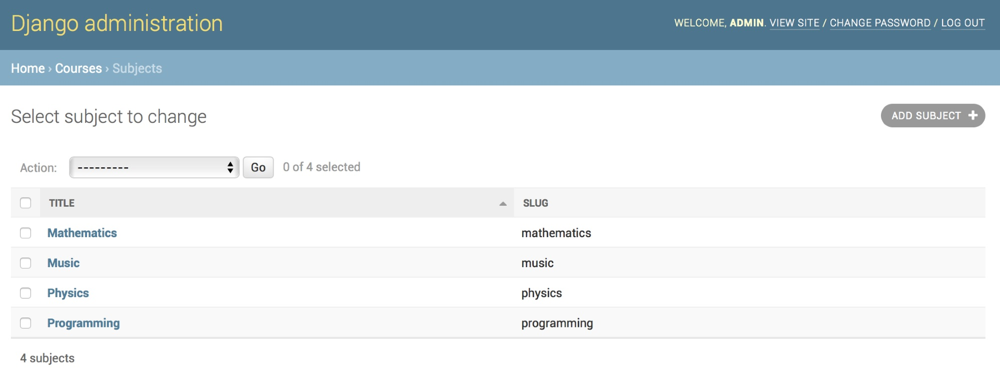

在 shell 中执行如下命令：

```bash
$ docker compose run web python manage.py dumpdata courses --indent=2
[+] Creating 1/0
 ✔ Container educa-db-1  Running              0.0s
[
{
  "model": "courses.subject",
  "pk": 1,
  "fields": {
    "title": "Mathematics",
    "slug": "mathematics"
  }
},
{
  "model": "courses.subject",
  "pk": 2,
  "fields": {
    "title": "Music",
    "slug": "music"
  }
},
{
  "model": "courses.subject",
  "pk": 3,
  "fields": {
    "title": "Physics",
    "slug": "physics"
  }
},
{
  "model": "courses.subject",
  "pk": 4,
  "fields": {
    "title": "Programming",
    "slug": "programming"
  }
}
]
```

`dumpdata` 命令采取默认的 JSON 格式，将 `Course` 类中的数据序列化并且输出。JSON 中包含了模型的名称，主键，字段与对应的值。设置了 `indent=2` 是表示每行的缩进。

可以通过向命令行提供应用名和模块名，例如 `app.Model`，让数据直接输出到这个模型中；还可以通过 `--format` 参数控制输出的数据格式，默认是使用 JSON 格式。还可以通过`--output` 参数指定输出到具体文件。

对于 `dumpdata` 的详细参数，可以使用命令 `python manage.py dumpdata --help` 查看。

使用如下命令把这个 `dump` 结果保存到 `courses` 应用的一个 `fixture/` 目录中：

```bash
$ mkdir courses/fixtures
$ docker compose run web python manage.py dumpdata courses --indent=2 --output /educa/courses/fixtures/subjects.json
[+] Creating 1/0
 ✔ Container educa-db-1  Running              0.0s
[............................................]
```

现在进入管理后台，将 `Subject` 表中的数据全部删除，之后执行下列语句，从 `fixture` 中加载数据：

```bash
$ python manage.py loaddata subjects.json
```

可以发现，所有删除的数据都都回来了。

默认情况下 Django 会到每个应用里的 `fixtures/` 目录内寻找指定的文件名，也可以在 `settings.py` 中设置 `FIXTURE_DIRS` 来告诉 Django 到哪里寻找 fixture。

fixture 除了初始化数据库之外，还可以方便的为应用提供测试数据。

有关 fixture 的详情可以查看 https://docs.djangoproject.com/zh-hans/4.2/topics/testing/tools/#fixture-loading 。

如果在进行数据模型移植的时候就加载 fixture 生成初始数据，可以查看 https://docs.djangoproject.com/zh-hans/4.2/topics/migrations/#data-migrations 。

## 创建不同类型内容的模型

在课程中会向用户提供不同类型的内容，包括文字，图片，文件和视频等。我们必须采用一个能够存储各种文件类型的通用模型。在第六章中，我们学会了使用通用关系来创建与项目内任何一个数据模型的关系。这里我们建立一个 `Content` 模型，用于存放章节中的内容，定义一个通用关系来连接任何类型的内容。

编辑 `courses` 应用的 `models.py` 文件，增加下列内容：

```python
from django.contrib.contenttypes.models import ContentType
from django.contrib.contenttypes.fields import GenericForeignKey

class Content(models.Model):
    module = models.ForeignKey(Module, related_name='contents', on_delete=models.CASCADE)
    content_type = models.ForeignKey(ContentType, on_delete=models.CASCADE)
    object_id = models.PositiveIntegerField()
    item = GenericForeignKey('content_type', 'object_id')
```

这就是 `Content` 模型，设置外键关联到了 `Module` 模型，同时设置了与 `ContentType` 模型的通用关联关系，可以从获取任意模型的内容。复习一下创建通用关系的所需的三个字的：

- `content_type`：一个外键用于关联到 `ContentType` 模型。
- `object_id`： 对象的 `id`，使用 `PositiveIntegerField` 字段。
- `item`: 通用关联关系字段，通过合并上两个字段来进行关联。

`content_type`, `object_id` 两个字段会实际生成在数据库中，`item` 字段的关系是 ORM 引擎构建的，不真正被写进数据库中。

下一步的工作是建立每种具体内容类型的数据库，这些数据库有一些相同的字段用于标识基本信息，也有不同的字段存放该模型独特的信息。

### 模型的继承

Django 支持数据模型之间的继承关系，这和 Python 程序的类继承关系很相似，Django 提供了以下三种继承的方式：

1. `Abstarct model`： 接口模型继承，用于方便的向不同的数据模型中添加相同的信息，这种继承方式中的基类不会在数据库中建立数据表，子类会建立数据表。
1. `Multi-table model inheritance`： 多表模型继承，在继承关系中的每个表都被认为是一个完整的模型时采用此方法，继承关系中的每一个表都会实际在数据库中创建数据表。
1. `Proxy models`：代理模型继承，在继承的时候需要改变模型的行为时使用，例如加入额外的方法，修改默认的模型管理器或使用新的 `Meta` 类设置，此种继承不会在数据库中创建数据表。

让我们详细看一下这三种方式。

#### Abstract models 抽象基类继承

接口模型本质上是一个基类类，其中定义了所有需要包含在子模型中的字段。Django 不会为接口模型创建任何数据库中的数据表。继承接口模型的子模型必须将这些字段完善，每一个子模型会创建数据表，表中的字段包括继承自接口模型的字段和子模型中自定义的字段。

为了标记一个模型为接口模型，在其 `Meta` 设置中，必须设置 `abstract = True`，django 就会认为该模型是一个接口模型，不会创建数据表。子模型只需要继承该模型即可。

下边的例子是如何建立一个接口模型 `Content` 和子模型 `Text`：

```python
from django.db import models

class BaseContent(models.Model):
    title = models.CharField(max_length=100)
    created = models.DateTimeField(auto_now_add=True)

    class Meta:
        abstract = True

class Text(BaseContent):
    body = models.TextField()
```

在这个例子中，实际在数据库中创建的是 `Text` 类对应的数据表，包含 `title`，`created` 和 `body` 字段。

#### Multi-table model inheritance 多表继承

多表继承关系中的每一个表都是完整的数据模型。对于继承关系，Django 会自动在子模型中创建一个一对一关系的外键连接到父模型。

要使用该种继承方式，必须继承一个已经存在的模型，django 会把父模型和子模型都写入数据库，下边是一个例子：

```python
from django.db import models

class BaseContent(models.Model):
    title = models.CharField(max_length=100)
    created = models.DateTimeField(auto_now_add=True)

class Text(BaseContent):
    body = models.TextField()
```

Django 会将两张表都写入数据库，`Text` 表中除了 `body` 字段，还有一个一对一的外键关联到 `BaseContent` 表。

#### Proxy models 代理模型

代理模型用于改变类的行为，例如增加额外的方法或者不同的 `Meta` 设置。父模型和子模型操作一张相同的数据表。`Meta` 类中指定 `proxy=True` 就可以建立一个代理模型。

下边是一个创建代理模型的例子：

```python
from django.db import models
from django.utils import timezone

class BaseContent(models.Model):
    title = models.CharField(max_length=100)
    created = models.DateTimeField(auto_now_add=True)

class OrderedContent(BaseContent):
    class Meta:
        proxy = True
        ordering = ['created']

    def created_delta(self):
        return timezone.now() - self.created
```

这里我们定义了一个 `OrderedContent` 模型，作为 `BaseContent` 模型的一个代理模型。这个代理模型提供了排序设置和一个新方法 `created_delta()`。`OrderedContent` 和 `BaseContent` 都是操作由 `BaseContent` 模型生成的数据表，但新增的排序和方法，只有通过 `OrderedContent` 对象才能使用。

这种方法就类似于经典的 Python 类继承方式。

### 创建内容的模型

`courses` 应用中的 `Content` 模型现在有着通用关系，可以取得任何模型的数据。我们要为每种内容建立不同的模型。所有的内容模型都有相同的字段也有不同的字段，这里就采取接口模型继承的方式来建立内容模型：

编辑 `courses` 应用中的 `models.py` 文件，添加下列代码：

```python
class ItemBase(models.Model):
    owner = models.ForeignKey(User, related_name='%(class)s_related', on_delete=models.CASCADE)
    title = models.CharField(max_length=250)
    created = models.DateTimeField(auto_now_add=True)
    updated = models.DateTimeField(auto_now=True)

    class Meta:
        abstract = True

    def __str__(self):
        return self.title


class Text(ItemBase):
    content = models.TextField()


class File(ItemBase):
    file = models.FileField(upload_to='files')


class Image(ItemBase):
    file = models.FileField(upload_to='images')


class Video(ItemBase):
    url = models.URLField()
```

在这段代码中，首先建立了一个接口模型 `ItemBase`，其中有四个字段，然后在 `Meta` 中设置了 `abstract=True` 以使该类为接口类。该类中定义了 `owner`, `title`, `created`, `updated` 四个字段，将在所有的内容模型中使用。`owner` 是关联到用户的外键，存放当前内容的创建者。由于这是一个基类，必须要为不同的模型指定不同的 `related_name`。Django 允许在 `related_name` 属性中使用类似 `%(class)s` 之类的占位符。设置之后，`related_name` 就会动态生成。这里我们使用了 `'%(class)s_related'`，最后实际的名称是 `text_related`, `file_related`, `image_related` 和 `video_retaled`。

我们定义了四种类型的内容模型，均继承 `ItemBase` 抽象基类：

- `Text`： 存储教学文本。
- `File`： 存储分发给用户的文件，比如 PDF 文件等教学资料。
- `Image`: 存储图片。
- `Video`：存储视频，定义了一个 `URLField` 字段存储视频的路径。

每个子模型中都包含 `ItemBase` 中定义的字段。Django 会针对四个子模型分别在数据库中创建数据表，但 `ItemBase` 类不会被写入数据库。

继续编辑 `courses` 应用的 `models.py` 文件，由于四个子模型的类名已经确定了，需要修改 `Content` 模型让其对应到这四个模型上，修改 `content_type` 字段如下：

```python
class Content(models.Model):
    content_type = models.ForeignKey(ContentType, on_delete=models.CASCADE,
                                 limit_choices_to={'model__in': ('text', 'file', 'image', 'video')})
```

这里使用了 `limit_choices_to` 属性，以使 `ContentType` 对象限于这四个模型中。如此定义之后，在查询数据库的时候还能够使用 `filter` 的参数例如 `model__in='text'` 来检索具体某个模型的对象。

建立好所有模型之后，执行数据迁移程序。

现在就已经建立了本项目所需要的基本数据表及其结构。然而我们的模型中还缺少一些内容：课程和课程的内容是按照一定顺序排列的，但用户建立课程和上传内容的时候未必是线性的，我们需要一个排序字段，通过字段可以把课程，章节和内容进行排序。

### 创建自定义字段

Django 内置了很完善的模型字段供方便快捷的建立数据模型。然而依然有无法满足用户需求的地方，我们也可以自定义模型字段，来存储个性化的内容，或者修改内置字段的行为。

我们需要一个字段存储课程和内容组织的顺序。通常用于确定顺序可以方便的采用内置的 `PositiveIntegerField` 字段，采用一个正整数就可以方便的标记数据的顺序。这里我们继承 `PositiveIntegerField` 字段，然后增加额外的行为来完成我们的自定义排序。

我们要给自定义字段增加增加如下两个功能：

1. 如果序号没有给出，则自动分配一个序号。当内容和课程表中存进一个新的数据对象的时候，如果用户给出了具体的序号，就将该序号存入到排序字段中。如果用户没有给出序号，应该自动按照最大的序号再加 1。例如如果已经存在两个数据对象的序号是 1 和 2，如果用户存入第三个数据但未给出序号，则应该自动给新数据对象分配序号 3。
1. 根据其他相关的内容排序：章节应该按照课程排序，而内容应该按照章节排序。

在 `courses` 应用下建立 `fields.py` 文件，添加如下代码：

```python
from django.db import models
from django.core.exceptions import ObjectDoesNotExist

class OrderField(models.PositiveIntegerField):

    def __init__(self, for_fields=None, *args, **kwargs):
        self.for_fields = for_fields
        super(OrderField, self).__init__(*args, **kwargs)

    def pre_save(self, model_instance, add):
        if getattr(model_instance, self.attname) is None:
            # 如果没有值，查询自己所在表的全部内容，找到最后一条字段，设置临时变量value = 最后字段的序号+1
            try:
                qs = self.model.objects.all()
                if self.for_fields:
                    # 存在for_fields参数，通过该参数取对应的数据行
                    query = {field: getattr(model_instance, field) for field in self.for_fields}
                    qs = qs.filter(**query)
                # 取最后一个数据对象的序号
                last_item = qs.latest(self.attname)
                value = last_item.order + 1
            except ObjectDoesNotExist:
                value = 0
            setattr(model_instance, self.attname, value)
            return value
        else:
            return super(OrderField, self).pre_save(model_instance, add)
```

这是自定义的字段类 `OrderField`，继承了内置的 `PositiveIntegerField` 类，还增加了额外的参数 `for_fields` 指定按照哪一个字段的顺序进行计算。

我们重写了 `pre_save()` 方法，这个方法是在将字段的值实际存入到数据库之前执行的。在这个方法里，执行了如下逻辑：

1. 检查当前字段是否已经存在值，`self.attname` 表示该字段对应的属性名，也就是字段属性。如果属性名是 `None`，说明用户没有设置序号。则按照以下逻辑进行计算：
   a. 建立一个 `QuerySet`，查询这个字段所在的模型的全部数据行。访问字段所在的模型使用了 `self.model`。
   b. 通过用户给出的 `for_fields` 参数，把上一步的 `QuerySet` 用其中的字段拆解之后过滤，这样就可以取得具体的用于计算序号的参考数据行。
   c. 然后从过滤过的 `QuerySet` 中使用 `last_item = qs.latest(self.attname)` 方法取出最新一行数据对应的序号。如果取不到，说明自己是第一行。就将临时变量设置为 0 。
   d. 如果能够取到，就把取到的序号+1 然后赋给 `value` 临时变量。
   e. 然后通过 `setattr()` 将临时变量 `value` 添加为字段名属性对应的值。
1. 如果当前的字段已经有值，说明用户传入了序号，不需要做任何工作。

在自定义字段时，一定不要硬编码将内容写死，也需要像内置字段一样注意通用性。

关于自定义字段可以看 https://docs.djangoproject.com/zh-hans/4.2/howto/custom-model-fields/ 。

### 将自定义字段加入到模型中

建立好自定义的字段类之后，需要在各个模型中设置该字段，编辑 `courses` 应用的 `models.py` 文件，添加如下内容：

```python
from .fields import OrderField

class Module(models.Model):
    # ......
    order = OrderField(for_fields=['course'], blank=True)
```

我们给自定义的排序字段起名叫 `order`，然后通过设置 `for_fields=['course']`，让该字段按照课程来排序。这意味着如果最新的某个 `Course` 对象关联的 `module` 对象的序号是 3，为该 `Course` 对象其新增一个关联的 `module` 对象的序号就是 4。

然后编辑 `Module` 模型的 `__str__()` 方法：

```python
class Module(models.Model):
    def __str__(self):
        return '{}. {}'.format(self.order, self.title)
```

章节对应的内容也必须有序号，现在为 `Content` 模型也增加上 `OrderField` 类型的字段：

```python
class Content(models.Model):
    # ...
    order = OrderField(blank=True, for_fields=['module'])
```

这样就指定了 `Content` 对象的序号根据其对应的 `module` 字段来排序，最后为两个模型添加默认的排序，为两个模型添加如下 `Meta` 类：

```python
class Module(models.Model):
    # ...
    class Meta:
        ordering = ['order']

class Content(models.Model):
    # ...
    class Meta:
        ordering = ['order']
```

最终的 `Module` 和 `Content` 模型应该是这样：

```python
class Module(models.Model):
    course = models.ForeignKey(Course, related_name='modules', on_delete=models.CASCADE)
    title = models.CharField(max_length=200)
    description = models.TextField(blank=True)
    order = OrderField(for_fields=['course'], blank=True)

    def __str__(self):
        return '{}. {}'.format(self.order, self.title)

    class Meta:
        ordering = ['order']


class Content(models.Model):
    module = models.ForeignKey(Module, related_name='contents', on_delete=models.CASCADE)
    content_type = models.ForeignKey(ContentType, on_delete=models.CASCADE,
                                     limit_choices_to={'model__in': ('text', 'video', 'image', 'file')})
    object_id = models.PositiveIntegerField()
    item = GenericForeignKey('content_type', 'object_id')
    order = OrderField(for_fields=['module'], blank=True)

    class Meta:
        ordering = ['order']
```

模型修改好了，执行迁移命令 `python manage.py makemigrations courses`，可以发现提示如下：

```bash
Tracking file by folder pattern:  migrations
You are trying to add a non-nullable field 'order' to content without a default; we can't do that (the database needs something to populate existing rows).
Please select a fix:
 1) Provide a one-off default now (will be set on all existing rows with a null value for this column)
 2) Quit, and let me add a default in models.py
Select an option:
```

这个提示的意思是说不能添加值为 `null` 的新字段 `order` 到数据表中，必须提供一个默认值。如果字段有 `null=True` 属性，就不会提示此问题。我们有两个选择，选项 1 是输入一个默认值，作为所有已经存在的数据行该字段的值，选项 2 是放弃这次操作，在模型中为该字段添加 `default=xx` 属性来设置默认值。

这里我们输入 1 并按回车键，看到如下提示：

```bash
Please enter the default value now, as valid Python
The datetime and django.utils.timezone modules are available, so you can do e.g. timezone.now
Type 'exit' to exit this prompt
```

系统提示我们输入值，输入 0 然后按回车，之后 Django 又会对 `Module` 模型询问同样的问题，依然选择第一项然后输入 0。之后可以看到：

```bash
Migrations for 'courses':
  courses\migrations\0003_auto_20181001_1344.py
    - Change Meta options on content
    - Change Meta options on module
    - Add field order to content
    - Add field order to module
```

表示成功，之后执行 `python manage.py migrate`。然后我们来测试一下排序，打开系统命令行窗口：

```bash
$ python manage.py shell
>>> from django.contrib.auth.models import User
>>> from courses.models import Subject, Course, Module
>>> user = User.objects.last()
>>> subject = Subject.objects.last()
>>> c1 = Course.objects.create(subject=subject, owner=user, title='Course 1', slug='course1')
```

添加了一个新课程，现在我们来为新课程添加对应的章节，来看看是如何自动排序的。

```bash
>>> m1 = Module.objects.create(course=c1, title='Module 1')
>>> m1.order
0
```

可以看到 `m1` 对象的序号字段的值被设置为 0，因为这是针对课程的第一个 `Module` 对象，下边再增加一个 `Module` 对象：

```bash
>>> m2 = Module.objects.create(course=c1, title='Module 2')
>>> m2.order
1
```

可以看到随后增加的 `Module` 对象的序号自动被设置成了 1，这次我们创建第三个对象，指定序号为 5：

```bash
>>> m3 = Module.objects.create(course=c1, title='Module 3', order=5)
>>> m3.order
5
```

如果指定了序号，则序号就会是指定的数字。为了继续试验，再增加一个对象，不给出序号参数：

```bash
>>> m4 = Module.objects.create(course=c1, title='Module 4')
>>> m4.order
6
```

可以看到，序号会根据最后保存的数据继续增加 1。`OrderField` 字段无法保证序号一定连续，但可以保证添加的内容的序号一定是从小到大排列的。

继续试验，我们再增加第二个课程，然后第二个课程添加一个 `Module` 对象：

```bash
>>> c2 = Course.objects.create(subject=subject, title='Course 2', slug='course2', owner=user)
>>> m5 = Module.objects.create(course=c2, title='Module 1')
>>> m5.order
0
```

可以看到序号又从 0 开始，该字段在生成序号的时候只会考虑同属于同一个外键字段下边的对象，第二个课程的第一个 `Module` 对象的序号又从 0 开始，正是由于 `order` 字段设置了 `for_fields=['course']` 所致。

祝贺你成功创建了第一个自定义字段。

## 创建内容管理系统 CMS

在创建好了完整的数据模型之后，需要创建内容管理系统。内容管理系统能够让讲师创建课程然后管理课程资源。

我们的内容管理系统需要如下几个功能：

- 登录功能
- 列出讲师的全部课程
- 新建，编辑和删除课程
- 为课程增加章节
- 为章节增加不同的内容

### 为站点增加用户验证系统

这里我们使用 Django 内置验证模块为项目增加用户验证功能、所有的讲师和学生都是 `User` 模型的实例，都可以通过 `django.contrib.auth` 来管理用户。

编辑 `educa` 项目的根 `urls.py` 文件，添加连接到内置验证函数 `login` 和 `logout` 的路由：

```python
from django.contrib import admin
from django.urls import path
from django.contrib.auth import views as auth_views

urlpatterns = [
    path('accounts/login/', auth_views.LoginView.as_view(), name='login'),
    path('accounts/logout/', auth_views.LogoutView.as_view(), name='logout'),
    path('admin/', admin.site.urls),
]
```

### 创建用户验证模板

在 `courses` 应用下建立如下目录和文件：

```bash
$ tree courses/templates
courses/templates
├── base.html
└── registration
    ├── logged_out.html
    └── login.html
```

在编写登录登出和其他模板之前，先来编辑 `base.html` 作为母版，在其中添加如下内容：

```django-html

<!DOCTYPE html>
<html>
<head>
    <meta charset="utf-8"/>
    <title>Educa</title>
    <link href="" rel="stylesheet">
</head>
<body>
<div id="header">
    <a href="/" class="logo">Educa</a>
    <ul class="menu">
        
            <li><a href="">Sign out</a></li>
        
            <li><a href="">Sign in</a></li>
        
    </ul>
</div>
<div id="content">
    
    
</div>
<script src="https://cdnjs.cloudflare.com/ajax/libs/jquery/3.3.1/jquery.min.js"></script>
<script>
    $(document).ready(function () {
        
        
    });
</script>
</body>
</html>
```

在母版中，定义了几个块：

- `title`: 用于 `HEAD` 标签的 `TITLE` 标签使用。
- `content`: 页面主体内容。
- `domready`：包含 jQuery 的 `$document.ready()` 代码，为页面 DOM 加载完成后执行的 JS 代码。

这里还用到了 CSS 文件，在 `courses` 应用中建立 `static/css/` 目录并将随书源代码中的 CSS 文件复制过来。

有了母版之后，编辑 `registration/login.html`：

```django-html


Log-in


    <h1>Log-in</h1>
    <div class="module">
        
            <p>Your username and password didn't match. Please try again.</p>
        
            <p>Please, use the following form to log-in:</p>
        
        <div class="login-form">
            <form action="" method="post">
                {{ form.as_p }}
                
                <input type="hidden" name="next" value="{{ next }}"/>
                <p><input type="submit" value="Log-in"></p>
            </form>
        </div>
    </div>

```

这是 Django 标准的用于内置 `login` 视图的模板。继续编写同目录下的 `logged_out.html`：

```django-html

Logged out

    <h1>Logged out</h1>
    <div class="module">
        <p>You have been successfully logged out.
            You can <a href="">log-in again</a>.</p>
    </div>

```

这是用户登出之后展示的页面。启动站点，到 http://127.0.0.1:8000/accounts/login/ 查看，页面如下：

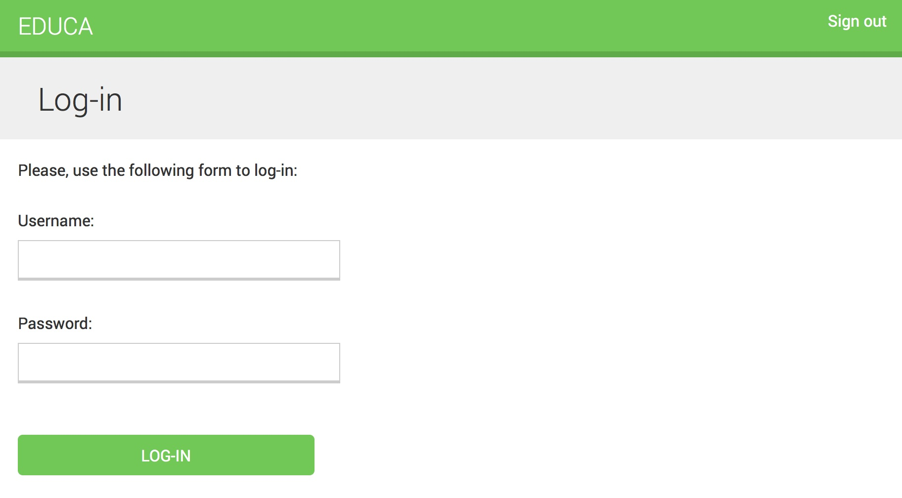

### 创建 CBV

接下来创建增加、编辑和删除课程的功能。这次使用基于类的视图进行编写，编辑 `courses` 应用的 `views.py` 文件：

```python
from django.views.generic.list import ListView
from .models import Course

class ManageCourseListView(ListView):
    model = Course
    template_name = 'courses/manage/course/list.html'

    def get_queryset(self):
        qs = super(ManageCourseListView, self).get_queryset()
        return qs.filter(owner=self.request.user)
```

这是 `ManageCourseListView` 视图，继承自内置的 `ListView` 视图。为了避免用户操作不属于该用户的内容，重写了 `get_queryset()` 方法以取得当前用户相关的课程，在其他增删改内容的视图中，我们同样需要重写 `get_queryset()` 方法。

如果想为一些 CBV 提供特定的功能和行为（而不是在每个类内重写某个方法），可以使用 mixins。

### 在 CBV 中使用 mixin

对类来说，[Mixin](https://en.wikipedia.org/wiki/Mixin) 是一种特殊的多继承方式。通过 Mixin 可以给类附加一系列功能，自定义类的行为。有两种情况一般都会使用 mixins：

1. 给类提供一系列可选的特性。
1. 在很多类中实现一种特定的功能。

> Mixin 是面向对象程序设计语言中的类，提供了方法的实现。其他类可以访问 mixin 类的方法而不必成为其子类。Mixin 有时被称作"included"而不是"inherited"。mixin 为使用它的 class 提供额外的功能，但自身却不单独使用（不能单独生成实例对象，属于抽象类）。因为有以上限制，Mixin 类通常作为功能模块使用，在需要该功能时“混入”，而且不会使类的关系变得复杂。用户与 Mixin 不是“is-a”的关系，而是“-able”关系。
> Mixin 有利于代码复用又避免了多继承的复杂。使用 Mixin 享有单一继承的单纯性和多重继承的共有性。接口与 mixin 相同的地方是都可以多继承，不同的地方在于 mixin 是带实现的。Mixin 也可以看作是带实现的 interface。这种设计模式实现了依赖反转原则。

Django 为 CBV 提供了一系列 mixins 用来增强 CBV 的功能，具体可以看 https://docs.djangoproject.com/zh-hans/4.2/topics/class-based-views/mixins/ 。

我们准备创建一个 mixin，包含一个通用的方法，用于我们与课程相关的 CBV 中。修改 `courses` 应用的 `views.py` 文件，修改成下面这样：

```python
from django.urls import reverse_lazy
from django.views.generic.list import ListView
from django.views.generic.edit import CreateView, UpdateView, DeleteView

from .models import Course

class OwnerMixin:
    def get_queryset(self):
        qs = super(OwnerMixin, self).get_queryset()
        return qs.filter(owner=self.request.user)

class OwnerEditMixin:
    def form_valid(self, form):
        form.instance.owner = self.request.user
        return super(OwnerEditMixin, self).form_valid(form)

class OwnerCourseMixin(OwnerMixin):
    model = Course

class OwnerCourseEditMixin(OwnerCourseMixin, OwnerEditMixin):
    fields = ['subject', 'title', 'slug', 'overview']
    success_url = reverse_lazy('manage_course_list')
    template_name = 'courses/manage/course/form.html'

class ManageCourseListView(OwnerCourseMixin, ListView):
    template_name = 'courses/manage/course/list.html'

class CourseCreateView(OwnerCourseEditMixin, CreateView):
    pass

class CourseUpdateView(OwnerCourseEditMixin, UpdateView):
    pass

class CourseDeleteView(OwnerCourseMixin, DeleteView):
    template_name = 'courses/manage/course/delete.html'
    success_url = reverse_lazy('manage_course_list')
```

在上述代码中，创建了两个 mixin 类 `OwnerMixin` 和 `OwnerEditMixin`，将这些 mixins 和 Django 内置的 `ListView`，`CreateView`，`UpdateView`，`DeleteView` 一起使用。

这里创建的 mixin 类解释如下：

`OwnerMixin` 实现了下列方法：

- `get_queryset()`：这个方法是内置视图用于获取 `QuerySet` 的方法，我们的 mixin 重写了该方法，让该方法只返回与当前用户 `request.user` 关联的查询结果。

`OwnerEditMixin` 实现下列方法：

- `form_valid()`：所有使用了 Django 内置的 `ModelFormMixin` 的视图，都具有该方法。这个方法具体工作机制是：如 `CreateView` 和 `UpdateView` 这种需要处理表单数据的视图，当表单验证通过时，就会执行 `form_valid()` 方法。该方法的默认行为是保存数据对象，然后重定向到一个保存成功的 URL。这里重写了该方法，自动给当前的数据对象设置上 `owner` 属性对应的用户对象，这样我们就在保存过程中自动附加上用户信息。

`OwnerMixin` 可以用于任何带有 `owner` 字段的模型。

我们还定义了继承自 `OwnerMixin` 的 `OwnerCourseMixin`，然后指定了下列参数：

- `model`：进行查询的模型，可以被所有 CBV 使用。

定义了 `OwnerCourseEditMixin`，具有下列属性：

- `fields`：指定 `CreateView` 和 `UpdateView` 等处理表单的视图在建立表单对象的时候使用的字段。
- `success_url`：`CreateView` 和 `UpdateView` 视图在表单提交成功后的跳转地址，这里定义了一个 URL 名称 `manage_course_list`，稍后会在路由中配置该名称。

最后我们创建了如下几个 `OwnerCourseMixin` 的子类

- `ManageCourseListView`：展示当前用户创建的课程，继承 `OwnerCourseMixin` 和 `ListView`。
- `CourseCreateView`：使用一个模型表单创建一个新的 `Course` 对象，使用 `OwnerCourseEditMixin` 定义的字段，并且继承内置的 `CreateView`。
- `CourseUpdateView`：允许编辑和修改已经存在的 `Course` 对象，继承 `OwnerCourseEditMixin` 和 `UpdateView`。
- `CourseDeleteView`：继承 `OwnerCourseMixin` 和内置的 `DeleteView`，定义了成功删除对象之后跳转的 `success_url`。

译者注：使用 mixin 时必须了解 Python 3 对于类继承的 MRO 查找顺序，想要确保 mixin 中重写的方法生效，必须在继承时把 mixin 放在内置 CBV 的左侧。对于刚开始使用 mixin 的读者，可以使用 Pycharm 专业版点击右键--Diagrams--Show Diagrams--Python Class Diagram 查看当前文件的类图来了解继承关系。

### 使用用户组和权限

我们已经创建好了所有管理课程的视图。目前任何已登录用户都可以访问这些视图。但是我们要限制课程相关的内容只能由创建者进行操作，Django 的内置用户验证模块提供了权限系统，用于向用户和用户组分派权限。我们准备针对讲师建立一个用户组，然后给这个用户组内用户授予增删改课程的权限。

启动站点，进入 http://127.0.0.1:8000/admin/auth/group/add/ ，然后创建一个新的 Group，名字叫做 `Instructors`，然后为其选择除了 `Subject` 模型之外，所有与 `courses` 应用相关的权限。如下图所示：

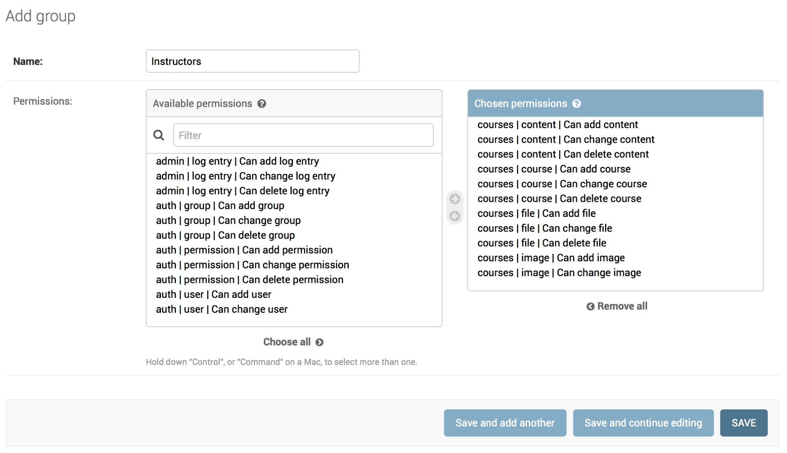

可以看到，对于每个应用中的每个模型，都有三个权限 can add, can change, can delete。选好之后，点击 SAVE 按钮保存。

Django 会为项目内的模型自动设置权限，如果需要的话，也可以编写自定义权限。具体可以查看 https://docs.djangoproject.com/zh-hans/4.2/topics/auth/customizing/#custom-permissions 。

打开 http://127.0.0.1:8000/admin/auth/user/add/ 添加一个新用户，然后设置其为 `Instructors` 用户组的成员，如下图所示：

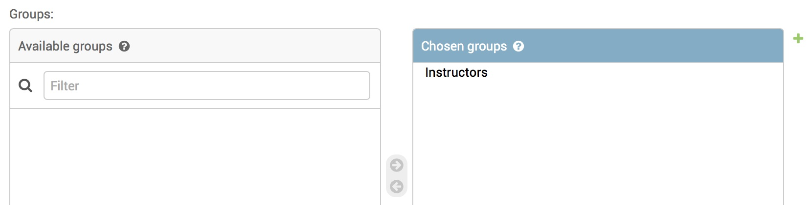

默认情况下，用户会继承其用户组设置的权限，也可以自行选择任意的其他单独权限。如果用户的 `is_superuser` 属性被设置为 `True`，则自动具有全部权限。

### 限制访问 CBV

我们将限制用户对于视图的访问，使具有对应权限的用户才能进行增删改 `Course` 对象的操作。这里使用两个 `django.contrib.auth` 提供的 mixins 来限制对视图的访问：

- `LoginRequiredMixin`: 与 `@login_required` 装饰器功能一样。
- `PermissionRequiredMixin`: 允许具有特定权限的用户访问该视图，超级用户具备所有权限。

编辑 `courses` 应用的 `views.py` 文件，让 `OwnerCourseMixin` 类继承 `LoginRequiredMixin` 类，然后添加属性：

```python
from django.contrib.auth.mixins import LoginRequiredMixin, PermissionRequiredMixin

class OwnerCourseMixin(OwnerMixin, LoginRequiredMixin):
    model = Course
    fields = ['subject', 'title', 'slug', 'overview']
    success_url = reverse_lazy('manage_course_list')
```

然后为几个视图都配置一个 `permission_required` 属性：

```python
class CourseCreateView(PermissionRequiredMixin, OwnerCourseEditMixin, CreateView):
    permission_required = 'courses.add_course'

class CourseUpdateView(PermissionRequiredMixin, OwnerCourseEditMixin, UpdateView):
    permission_required = 'courses.change_course'

class CourseDeleteView(PermissionRequiredMixin, OwnerCourseMixin, DeleteView):
    template_name = 'courses/manage/course/delete.html'
    success_url = reverse_lazy('manage_course_list')
    permission_required = 'courses.delete_course'
```

`PermissionRequiredMixin` 会检查用户是否具备在 `permission_required` 参数里指定的权限。现在视图就只能供指定权限的用户使用了。

视图编写完毕之后，为视图配置路由，先在 `courses` 应用中新建 `urls.py` 文件，添加下列代码：

```python
from django.urls import path
from . import views

urlpatterns = [
    path('mine/', views.ManageCourseListView.as_view(), name='manage_course_list'),
    path('create/', views.CourseCreateView.as_view(), name='course_create'),
    path('<pk>/edit/', views.CourseUpdateView.as_view(), name='course_edit'),
    path('<pk>/delete/', views.CourseDeleteView.as_view(), name='course_delete'),
]
```

再来配置项目的根路由，将 `courses` 应用的路由作为二级路由：

```python
from django.urls import path, include
from django.contrib.auth import views as auth_views

urlpatterns = [
    path('accounts/login/', auth_views.LoginView.as_view(), name='login'),
    path('accounts/logout/', auth_views.LogoutView.as_view(), name='logout'),
    path('admin/', admin.site.urls),
    path('course/', include('courses.urls')),
]
```

然后需要为视图创建模板，在 `courses` 应用的 `templates/` 目录下新建如下目录和文件：

```bash
$ tree courses/templates/courses
courses/templates/courses
└── manage
    └── course
        ├── delete.html
        ├── form.html
        └── list.html
```

编辑其中的 `courses/manage/course/list.html`，添加下列代码：

```django-html

My courses

    <h1>My courses</h1>
    <div class="module">
        
            <div class="course-info">
                <h3>{{ course.title }}</h3>
                <p>
                    <a href="">Edit</a>
                    <a href="">Delete</a>
                </p>
            </div>
        
            <p>You haven't created any courses yet.</p>
        
        <p>
            <a href="" class="button">Create new
                course</a>
        </p>
    </div>

```

这是供 `ManageCourseListView` 使用的视图。在这个视图里列出了所有的课程，然后生成对应的编辑和删除功能链接。

启动站点，到 http://127.0.0.1:8000/accounts/login/?next=/course/mine/ ，用一个在 `Instructors` 用户组内的用户登录，可以看到如下界面：

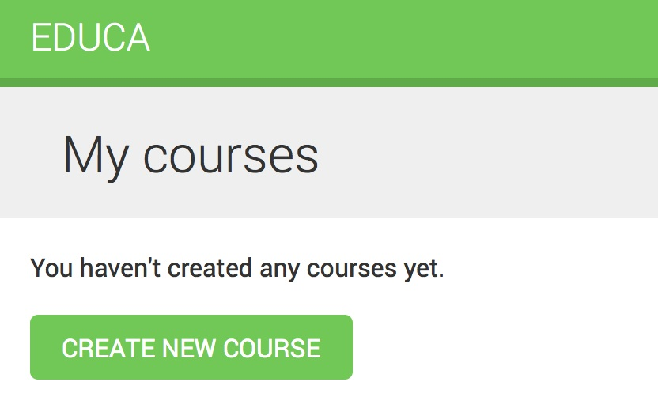

这个页面会显示当前用户创建的所有课程。

现在来创建新增和修改课程需要的模板，编辑 `courses/manage/course/form.html`，添加下列代码：

```django-html


    
        Edit course "{{ object.title }}"
    
        Create a new course
    


    <h1>
        
            Edit course "{{ object.title }}"
        
            Create a new course
        
    </h1>
    <div class="module">
        <h2>Course info</h2>
        <form action="." method="post">
            {{ form.as_p }}
            
            <p><input type="submit" value="Save course"></p>
        </form>
    </div>

```

这个模板由 `CourseCreateView` 和 `CourseUpdateView` 进行操作。在模板内先检查 object 变量是否存在，如果存在则显示针对该对象的修改功能。如果不存在就建立一个新的 `Course` 对象。

浏览器中打开 http://127.0.0.1:8000/course/mine/ ，点击 CREATE NEW COURSE 按钮，可以看到如下界面：

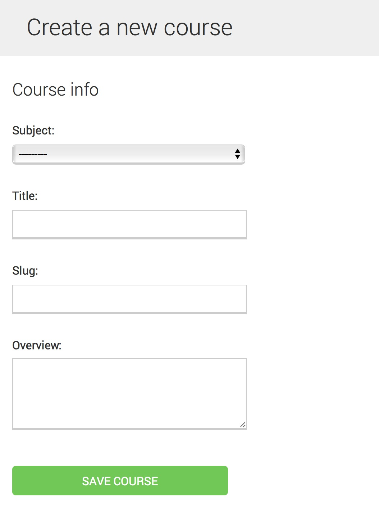

填写表单后后点击 SAVE COURSE 进行保存，课程会被保存，然后重定向到课程列表页，可以看到如下界面：

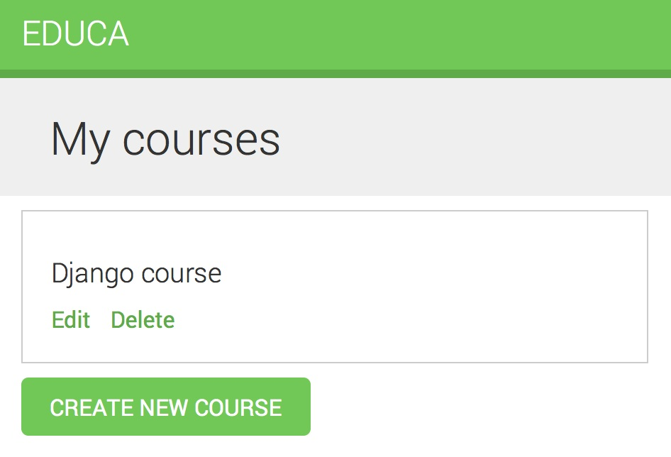

点击其中的 Edit 链接，可以在看到这个表单页面，但这次是修改已经存在的 `Course` 对象。

最后来编写 `courses/manage/course/delete.html`，添加下列代码：

```django-html

Delete course

    <h1>Delete course "{{ object.title }}"</h1>
    <div class="module">
        <form action="" method="post">
            
            <p>Are you sure you want to delete "{{ object }}"?</p>
            <input type="submit" class="button" value="Confirm">
        </form>
    </div>

```

这个模板由继承了 `DeleteView` 的 `CourseDeleteView` 视图操作，负责删除课程。

打开浏览器，点击刚才页面中的 Delete 链接，跳转到如下确认页面：

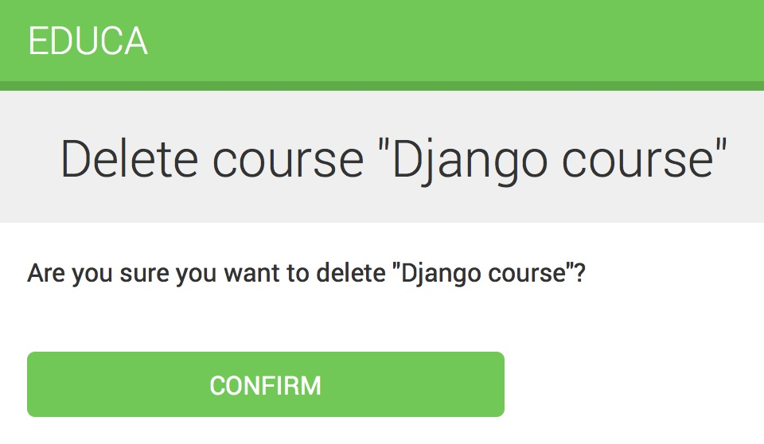

点击 CONFIRM 按钮，课程就会被删除，然后重定向至课程列表页。

讲师组用户现在可以增删改课程了。下边要做的是通过 CMS 让讲师组用户为课程添加章节和内容。

## 管理章节与内容

这一节里来建立一个管理课程中章节和内容的系统，将为同时管理课程中的多个章节及其中不同的内容建立表单。章节和内容都需要按照特定的顺序记录在我们的 CMS 中。

### 在课程模型中使用表单集（formsets）

Django 通过一个抽象层控制页面中的所有表单对象。一组表单对象被称为表单集。表单集由多个 `Form` 类或者 `ModelForm` 类的实例组成。表单集内的所有表单在提交的时候会一并提交，表单集可以控制显示的表单数量，对提交的最大表单数量做限制，同时对其中的全部表单进行验证。

表单集包含一个 `is_valid()` 方法用于一次验证所有表单。可以给表单集初始数据，也可以控制表单集显示的空白表单数量。普通的表单集官方文档可以看 https://docs.djangoproject.com/zh-hans/4.2/topics/forms/formsets/ ，由模型表单构成的 model formset 可以看 https://docs.djangoproject.com/zh-hans/4.2/topics/forms/modelforms/#model-formsets 。

由于一个课程由多个章节组成，方便运用表单集进行管理。在 `courses` 应用中建立 `forms.py` 文件，添加如下代码：

```python
from django import forms
from django.forms.models import inlineformset_factory
from .models import Course, Module

ModuleFormSet = inlineformset_factory(Course, Module, fields=['title', 'description'], extra=2, can_delete=True)
```

我们使用内置的 `inlineformset_factory()` 方法构建了表单集 `ModuleFormSet`。内联表单工厂函数是在普通的表单集之上的一个抽象。这个函数允许我们动态的通过与 `Course` 模型关联的 `Module` 模型创建表单集。

对这个表单集我们应用了如下字段：

- `fields`：表示表单集中每个表单的字段。
- `extra`：设置每次显示表单集时候的表单数量。
- `can_delete`：该项如果设置 `True`，Django 会在每个表单内包含一个布尔字段（被渲染成为一个 `CHECKBOX` 类型的 `INPUT` 元素），供用户选中需要删除的表单。

编辑 `courses` 应用的 `views.py` 文件，增加下列代码：

```python
from django.shortcuts import redirect, get_object_or_404
from django.views.generic.base import TemplateResponseMixin, View
from .forms import ModuleFormSet

class CourseModuleUpdateView(TemplateResponseMixin, View):
    template_name = 'courses/manage/module/formset.html'
    course = None

    def get_formset(self, data=None):
        return ModuleFormSet(instance=self.course, data=data)

    def dispatch(self, request, pk):
        self.course = get_object_or_404(Course, id=pk, owner=request.user)
        return super(CourseModuleUpdateView, self).dispatch(request, pk)

    def get(self, request, *args, **kwargs):
        formset = self.get_formset()
        return self.render_to_response({'course': self.course, 'formset': formset})

    def post(self, request, *args, **kwargs):
        formset = self.get_formset(data=request.POST)
        if formset.is_valid():
            formset.save()
            return redirect('manage_course_list')
        return self.render_to_response({'course': self.course, 'formset': formset})
```

`CourseModuleUpdateView` 用于对一个课程的章节进行增删改。这个视图继承了以下的 mixins 和视图：

- `TemplateResponseMixin`：这个 mixin 提供的功能是渲染模块并且返回 HTTP 响应，需要一个 `template_name` 属性用于指定模板位置，提供了一个 `render_to_response()` 方法给模板传入上下文并且渲染模板
- `View`：基础的 CBV 视图，由 Django 内置提供。简单继承该类就可以得到一个基本的 CBV。

在这个视图中，实现了如下的方法：

- `get_formset()`：这个方法是创建 `formset` 对象的过程，为了避免重复编写所以写了一个方法。功能是根据获得的 `Course` 对象和可选的 `data` 参数来构建一个 `ModuleFormSet` 对象。
- `dispatch()`：这个方法是 `View` 视图的方法，是一个分发器，HTTP 请求进来之后，最先执行的是 `dispatch()` 方法。该方法把小写的 HTTP 请求的种类分发给同名方法：例如 GET 请求会被发送到 `get()` 方法进行处理，POST 请求会被发送到 `post()` 方法进行处理。在这个方法里。使用 `get_object_or_404()` 加一个 `id` 参数，从 `Course` 类中获取对象。把这段代码包含在 `dispatch()` 方法中是因为无论 GET 还是 POST 请求，都会使用 `Course` 对象。在请求一进来的时候，就把 `Course` 对象存入 `self.course`，供其他方法使用。
- `get()`：处理 GET 请求。创建一个 `ModuleFormSet` 然后使用当前的 `Course` 对象渲染模板，使用了 `TemplateResponseMixin` 提供的 `render_to_response()` 方法。
- `post()`：处理 POST 请求，在这个方法中执行了如下动作：
  - 使用请求附带的数据建立 `ModuleFormSet` 对象。
  - 执行 `is_valid()` 方法验证所有表单。
  - 验证通过则使用 `save()` 方法保存，这时增删改都会写入数据库。然后重定向到 `manage_course_list` URL。如果未通过验证，就返回当前表单对象以显示错误信息。

编辑 `courses` 应用中的 `urls.py` 文件，为刚写的视图配置 URL：

```python
    path('<pk>/module/', views.CourseModuleUpdateView.as_view(), name='course_module_update'),
```

在模板目录 `courses/templates/` 下创建一个新目录，叫做 `module`，然后创建 `templates/courses/manage/module/formset.html` 文件，添加下列代码：

```django-html


    Edit "{{ course.title }}"


    <h1>Edit "{{ course.title }}"</h1>
    <div class="module">
        <h2>Course modules</h2>
        <form action="" method="post">
            {{ formset }}
            {{ formset.management_form }}
            
            <input type="submit" class="button" value="Save modules">
        </form>
    </div>

```

在这个模板中，创建了一个表单元素 `<form>` ，其中包含了 `formset` 表单集，还包含了一个管理表单 `{{ formset.management_form }}`。这个管理表单包含隐藏的字段用于控制显示起始，总计，最小和最大编号的表单。可以看到创建表单集很简单。

编辑 `courses/templates/course/list.html`，把 `course_module_update` 的链接加在编辑和删除链接之下：

```django-html
<a href="">Edit</a>
<a href="">Delete</a>
<a href="">Edit modules</a>
```

现在模板中有了编辑课程中章节的链接，启动站点，到 http://127.0.0.1:8000/course/mine/ 创建一个课程然后点击 Edit modules 链接，可以看到页面中的表单集如下：

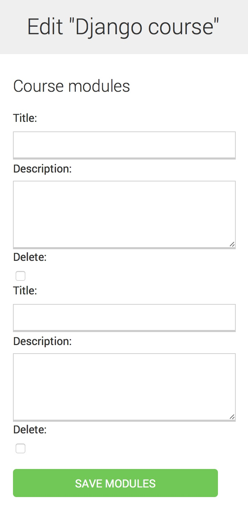

这个表单集合包含了该课程中的每个 `Module` 对象，然后还多出来 2 个空白的表单可供填写，这是因为我们为 `ModuleFormSet` 设置了 `extra=2`。输入两个新的章节内容，然后保存表单，再进编辑页面，可以看到又多出来了两个空白表单。

### 向课程中添加内容

现在要为章节添加具体的内容。在之前我们定义了四种内容对应四个模型：文字，图片，文件和视频。可能会考虑建立四个不同的视图操作这四个不同的类，但这里我们采用更加通用的方式：建立一个视图来对这四个类进行增删改。

编辑 `courses` 应用中的 `views.py` 文件，添加如下代码：

```python
from django.forms.models import modelform_factory
from django.apps import apps
from .models import Module, Content


class ContentCreateUpdateView(TemplateResponseMixin, View):
    module = None
    model = None
    obj = None
    template_name = 'courses/manage/content/form.html'

    def get_model(self, model_name):
        if model_name in ['text', 'video', 'image', 'file']:
            return apps.get_model(app_label='courses', model_name=model_name)
        return None

    def get_form(self, model, *args, **kwargs):
        Form = modelform_factory(model, exclude=['owner', 'order', 'created', 'updated'])
        return Form(*args, **kwargs)

    def dispatch(self, request, module_id, model_name, id=None):
        self.module = get_object_or_404(Module, id=module_id, course__owner=request.user)
        self.model = self.get_model(model_name)
        if id:
            self.obj = get_object_or_404(self.model, id=id, owner=request.user)
        return super(ContentCreateUpdateView, self).dispatch(request, module_id, model_name, id)
```

这是 `ContentCreateUpdateView` 视图的第一部分。这个类用于建立和更新章节中的内容，这个类定义了如下方法：

- `get_model()`：检查给出的名字是否在指定的四个类名中，然后用 Django 的 `apps` 模块，从 `courses` 应用中取出对应的模块，如果没有找到，就返回 `None`。
- `get_form()`：使用内置的 `modelform_factory()` 方法建立表单集，去掉了四个指定的字段，使用剩下的字段建立。这么做，我们可以不考虑具体是哪个模型，只去掉通用的字段保留剩下的字段。
- `dispatch()`：这个方法接收下列的 URL 参数，然后为当前对象设置 `module` 和 `model` 属性：
  - `module_id`：章节的 `id`。
  - `model_name`：内容模型的名称。
  - `id`：要更新的内容的 `id`，默认值为 `None` 表示新建。

然后来编写该视图的 `get()` 和 `post()` 方法：

```python
def get(self, request, module_id, model_name, id=None):
    form = self.get_form(self.model, instance=self.obj)
    return self.render_to_response({'form': form, 'object': self.obj})


def post(self, request, module_id, model_name, id=None):
    form = self.get_form(self.model, instance=self.obj, data=request.POST, files=request.FILES)
    if form.is_valid():
        obj = form.save(commit=False)
        obj.owner = request.user
        obj.save()
        if not id:
            # 新内容
            Content.objects.create(module=self.module, item=obj)
        return redirect('module_content_list', self.module.id)
    return self.render_to_response({'form': form, 'object': self.obj})
```

这两个方法解释如下：

- `get()`：处理 GET 请求。通过 `get_form()` 方法获取需要修改的四种内容之一生成的表单。如果没有 `id`，前置的 `dispatch` 方法里不设置 `self.obj`，所以 `instance=None`，表示新建。
- `post()`：处理 POST 请求。通过传入的所有数据创建表单集对象，然后进行验证。如果验证通过，给当前对象设置上 `user` 属性，然后保存。如果没有传入 `id`，说明是新建内容，需要在 `Content` 中追加一条记录关联到 `module` 对象和新建的内容对象。

编辑 `courses` 应用的 `urls.py` 文件，为新视图配置 URL：

```python
    path('module/<int:module_id>/content/<model_name>/create/', views.ContentCreateUpdateView.as_view(),
         name='module_content_create'),
    path('module/<int:module_id>/content/<model_name>/<id>/', views.ContentCreateUpdateView.as_view(),
         name='module_content_update'),
```

这两条路由解释如下：

- `module_content_create`：用于建立新内容的 URL，带有 `module_id` 和 `model_name` 两个参数，第一个是用来取得对应的 `module` 对象，第二个用来取得对应的内容数据模型。
- `module_content_update`：用于修改原有内容的 URL，除了带有 `module_id` 和 `model_name` 两个参数之外，还带有 `id` 用于确定具体修改哪一个内容对象。

在 `courses/manage/` 目录下创建一个新目录叫 `content`，再创建 `courses/manage/content/form.html`，添加下列代码：

```django-html


    
        Edit content "{{ object.title }}"
    
        Add a new content
    


    <h1>
        
            Edit content "{{ object.title }}"
        
            Add a new content
        
    </h1>
    <div class="module">
        <h2>Course info</h2>
        <form action="" method="post" enctype="multipart/form-data">
            {{ form.as_p }}
            
            <p><input type="submit" value="Save content"></p>
        </form>
    </div>

```

这是视图 `ContentCreateUpdateView` 控制的模板。在这个模板里，使用了一个 `object` 变量，如果 `object` 变量不为 `None`，说明在修改一个已经存在的内容，否则就是新建一个内容。

`<form>` 标签中设置了属性 `enctype="multipart/form-data"`，因为 `File` 和 `Image` 模型中有文件字段。

启动站点，到 http://127.0.0.1:8000/course/mine/ ，点击任何一个已经存在的课程的 Edit modules 链接，之后新建一个` module`。

然后打开带有当前 Django 环境的 Python 命令行，来进行一些测试，首先取到最后一个建立的 `module` 对象：

```bash
>>> from courses.models import Module
>>> Module.objects.latest('id').id
6
```

取到了这个 `id` 之后，打开 http://127.0.0.1:8000/course/module/6/content/image/create/ ，把 6 替换成你实际取到的结果，可以看到创建 `Image` 对象的页面：

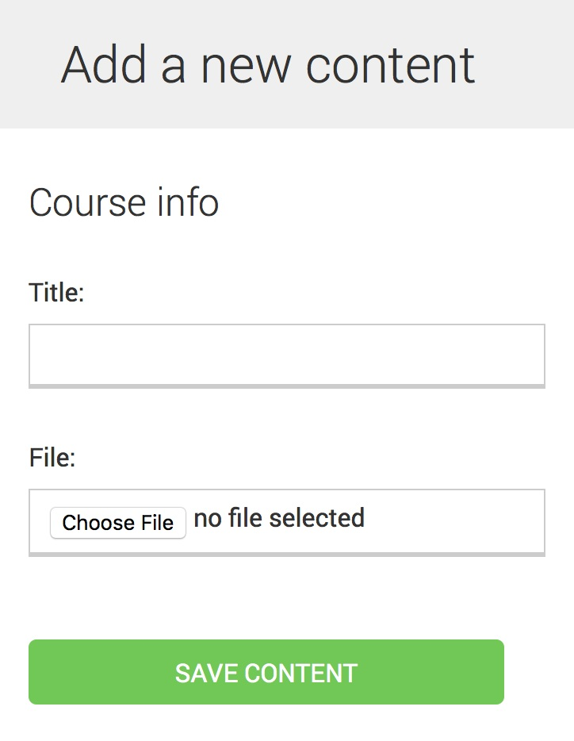

现在还不要提交表单，如果提交会报错，因为我们还没有定义 `module_content_list` URL。

现在还需要一个视图用来删除内容。编辑 `courses` 应用的 `views.py` 文件：

```python
class ContentDeleteView(View):
    def post(self, request, id):
        content = get_object_or_404(Content, id=id, module__course__owner=request.user)
        module = content.module
        content.item.delete()
        content.delete()
        return redirect('module_content_list', module.id)
```

这个 `ContentDeleteView` 视图通过 `ID` 参数获取 `Content` 对象，然后删除相关的 `Text`、`Video`、`Image`、或 `File` 对象，再把 `Content` 对象删除，之后重定向到 `module_content_list` URL。

在就在 `courses` 应用的 `urls.py` 文件中设置该 URL:

```python
    path('content/<int:id>/delete/', views.ContentDeleteView.as_view(), name='module_content_delete'),
```

现在讲师用户就可以增删改内容了。

### 管理章节与内容

在上一节里编写好了增删改的视图，现在需要一个视图将一个课程的全部章节和其中的内容展示出来的视图。

编辑 `courses` 应用的 `views.py` 文件，添加下列代码：

```python
class ModuleContentListView(TemplateResponseMixin, View):
    template_name = 'courses/manage/module/content_list.html'

    def get(self, request, module_id):
        module = get_object_or_404(Module,
                                   id=module_id,
                                   course__owner=request.user)
        return self.render_to_response({'module': module})
```

这个 `ModuleContentListView` 视图通过一个指定的 `Module` 对象的 `ID` 和当前用户，来获取 `Module` 对象，然后使用该对象渲染模板。

在 `courses` 应用的 `urls.py` 内加入该视图的路由：

```python
    path('module/<int:module_id>/', views.ModuleContentListView.as_view(), name='module_content_list'),
```

在 `templates/courses/manage/module/` 目录中新建 `content_list.html`，添加下列代码：

```django-html


    Module {{ module.order|add:1 }}: {{ module.title }}


    
        <h1>Course "{{ course.title }}"</h1>
        <div class="contents">
            <h3>Modules</h3>
            <ul id="modules">
                
                    <li data-id="{{ m.id }}" 
                        class="selected">
                        <a href="">
                            <span>
                            Module <span class="order">{{ m.order|add:1 }}</span>
                            </span>
                            <br>
                            {{ m.title }}
                        </a>
                    </li>
                
                    <li>No modules yet.</li>
                
            </ul>
            <p><a href="">
                Edit modules</a></p>
        </div>
        <div class="module">
            <h2>Module {{ module.order|add:1 }}: {{ module.title }}</h2>
            <h3>Module contents:</h3>
            <div id="module-contents">
                
                    <div data-id="{{ content.id }}">
                        
                            <p>{{ item }}</p>
                            <a href="#">Edit</a>
                            <form action=""
                                  method="post">
                                <input type="submit" value="Delete">
                                
                        </form>
                        
                    </div>
                
                    <p>This module has no contents yet.</p>
                
            </div>
            <h3>Add new content:</h3>
            <ul class="content-types">
                <li><a href="">
                    Text</a></li>
                <li><a href="">
                    Image</a></li>
                <li><a href="">
                    Video</a></li>
                <li><a href="">
                    File</a></li>
            </ul>
        </div>
    

```

这是用来展示该课程中全部章节和内容的模板。迭代全部的章节显示在侧边栏中，然后针对每个章节的内容，通过 `content.item` 迭代其中的相关的所有内容进行展示，然后配上对应的链接。

我们想知道每个 `item` 对象究竟是 `text`, `video`, `image` 或者 `file` 的哪一种，因为我们需要模型的名称来创建修改数据的 URL。此外还需要在模板中按照类别单独把每个内容展示出来。对于一个数据对象，可以通过 `_meta_` 属性获取该数据所属的模型类，但 Django 不允许在视图中使用以下划线开头的模板变量或者属性，以防访问到私有属性或方法。可以通过编写一个自定义的模板过滤器来解决。

在 `courses` 应用中建立如下目录和文件：

```bash
templatetags/
    __init__.py
    course.py
```

在其中的 `course.py` 中编写：

```python
from django import template

register = template.Library()

@register.filter
def model_name(obj):
    try:
        return obj._meta.model_name
    except AttributeError:
        return None
```

这是 `model_name` 模板过滤器，在模板里可以通过 `object|model_name` 来获得一个数据对象所属的模型名称。

编辑刚才的 `templates/courses/manage/module/content_list.html`，在 `` 的下一行添加：

```django-html

```

然后找到下边两行：

```django-html
<p>{{ item }}</p>
<a href="#">Edit</a>
```

替换成：

```django-html
<p>{{ item }} ({{ item|model_name }})</p>
<a href="">Edit</a>
```

使用了自定义模板过滤器之后，我们在模板中显示内容对象时，就可以通过对象所属模型的名称来生成 URL 链接了。编辑 `courses/manage/course/list.html`，添加一个列表页的链接：

```django-html
<a href="">Edit modules</a>

    <a href="">Manage contents</a>

```

这个新连接跳转到显示第一个章节的内容的页面。

打开 http://127.0.0.1:8000/course/mine/ ，可以看到页面中多出来了 Manage contents 链接，点击该链接后如下图所示：

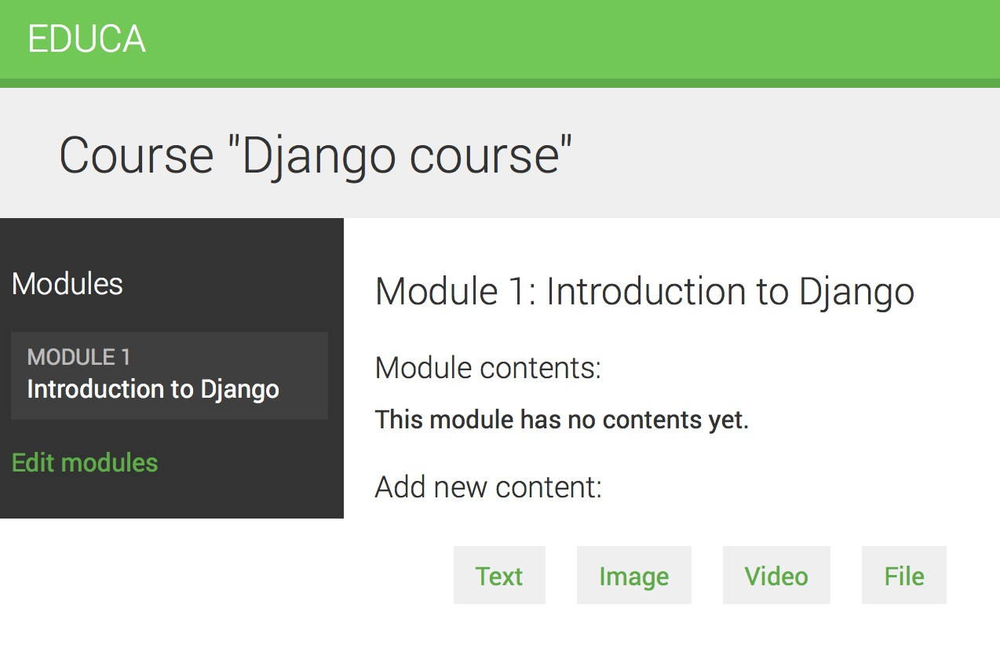

在左侧边栏点击一个章节时，该章节的内容就显示在右侧。这个页面还带了链接到添加四种类型内容的页面。实际添加一些内容然后看一下页面效果，内容也会展示出来：

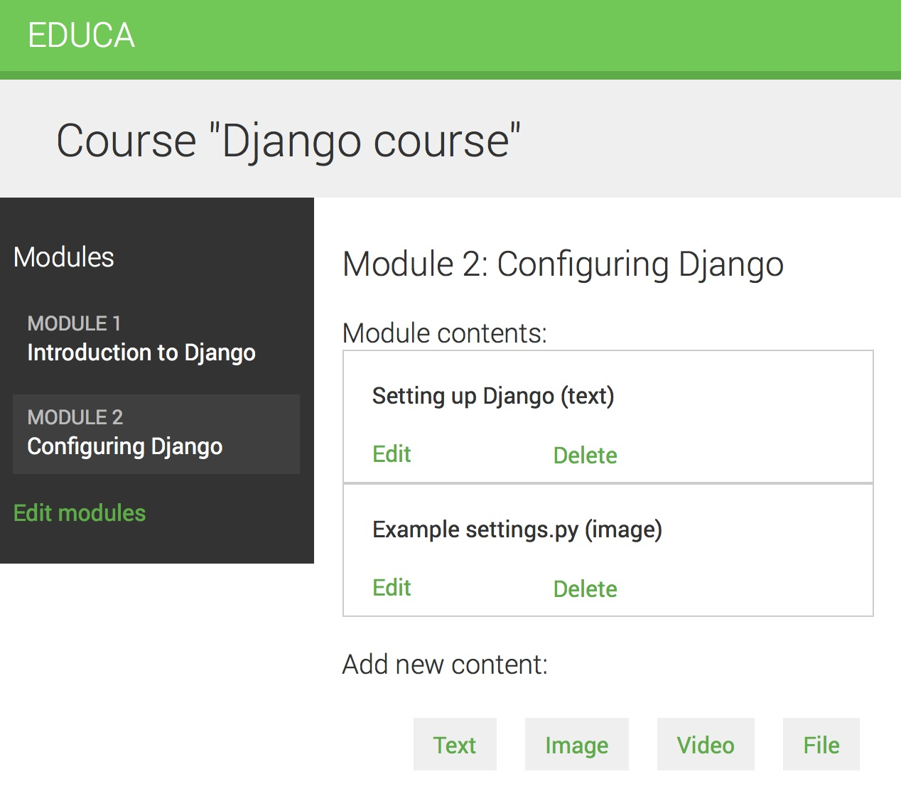

### 重新排列章节和内容的顺序

我们需要给用户提供一个简单的可以重新排序的方法。通过 JavaScrip 的拖动插件，让用户通过拖动就可以重新排列章节和内容的顺序。在用户结束拖动的时候，我们使用 AJAX 来记录当前的新顺序。

#### 使用 django-braces 模块中的 mixins

django-braces 是一个第三方模块，包含了一系列通用的 Mixin，为 CBV 提供额外的功能。可以查看其官方文档：https://django-braces.readthedocs.io/en/latest/ 来获得完整的 mixin 列表。

我们要使用 django-braces 中下列 mixin：

- `CsrfExemptMixin`：在 POST 请求中不检查 CSRF，无需生成 `csrf_token`。
- `JsonRequestResponseMixin`：以 JSON 字符串形式解析请求中的数据，并且序列化响应数据为 JSON 格式，带有 `application/json` 头部信息。

通过 pip 安装 django-braces：

```bash
￥ pip install django-braces
```

我们需要一个视图，能够接受 JSON 格式的新的模块顺序。编辑 `courses` 应用的 `views.py` 文件，添加下列代码：

```python
from braces.views import CsrfExemptMixin, JsonRequestResponseMixin

class ModuleOrderView(CsrfExemptMixin, JsonRequestResponseMixin, View):

    def post(self, request):
        for id, order in self.request_json.items():
            Module.objects.filter(id=id, course__owner=request.user).update(order=order)
        return self.render_json_response({'saved': 'OK'})
```

这个 `ModuleOrderView` 视图的逻辑是拿到 JSON 数据后，对于其中的每一条记录，更新 `module` 对象的 `order` 字段。

基于类似的逻辑，来编写章节内容的重新排列视图，继续在 `views.py` 中追加代码：

```python
class ContentOrderView(CsrfExemptMixin, JsonRequestResponseMixin, View):
    def post(self, request):
        for id, order in self.request_json.items():
            Content.objects.filter(id=id, module__course__owner=request.user).update(order=order)
        return self.render_json_response({'saved': 'OK'})
```

然后编辑 `courses` 应用的 `urls.py`，为这两个视图配置 URL：

```python
    path('module/order/', views.ModuleOrderView.as_view(), name='module_order'),
    path('content/order/', views.ContentOrderView.as_view(), name='content_order'),
```

最后，需要在模板中实现拖动功能。使用 jQuery UI 库来完成这个功能。jQuery UI 基于 jQuery，提个了一系列的界面互动操作，效果和插件。我们使用其中的 `sortable` 元素。首先，需要把 jQuery 加载到母版中。打开 `base.html`，在加载 jQuery 的 script 标签之后加入 jQuery UI。

```html
<script src="https://cdnjs.cloudflare.com/ajax/libs/jquery/3.3.1/jquery.min.js"></script>
<script src="https://cdnjs.cloudflare.com/ajax/libs/jqueryui/1.12.1/jquery-ui.min.js"></script>
```

这里使用了国内的 CDN。由于 jQueryUI 依赖于 jQuery，所以要在其后载入。之后编辑 `courses/manage/module/content_list.html`，在底部添加如下代码：

```django-html

$('#modules').sortable({
    stop: function (event, ui) {
        let modules_order = {};
        $('#modules').children().each(function () {
            $(this).find('.order').text($(this).index() + 1);
            modules_order[$(this).data('id')] = $(this).index();
        });
        $.ajax({
            type: 'POST',
            url: '',
            contentType: 'application/json; charset=utf-8',
            dataType: 'json',
            data: JSON.stringify(modules_order)
        });
    }
});

$('#module-contents').sortable({
    stop: function (event, ui) {
        let contents_order = {};
        $('#module-contents').children().each(function () {
            contents_order[$(this).data('id')] = $(this).index();
        });
        $.ajax({
            type: 'POST',
            url: '',
            contentType: 'application/json; charset=utf-8',
            dataType: 'json',
            data: JSON.stringify(contents_order),
        });
    }
});

```

这段代码加载在 `` 块中，会在页面 DOM 加载完成后立刻执行。在代码中为所有的侧边栏中的章节列表定义了一个 `sortable` 方法，为内容也定义了一个同样功能的方法。这段代码做了下列工作：

1. 使用 `#modules` 选择器，为 `modules` 的 HTML 元素定义了 `sortable` 元素
1. 定义了一个 `stop` 事件处理函数，用户停止拖动后触发该事件
1. 建立了一个空字典 `modules_order`（JS 里叫做对象），其中的键是 `module` 的 ID（LI 元素的 `data-id` 属性的值），值是重新排列后的顺序。
1. 遍历拖动后的 `#module` 的子元素，取得此时每个元素的 `data-id` 和此时在列表中的索引，用此时的 `id` 作为键，其顺序作为值，更新 `modules_order` 字典。
1. 通过 AJAX 发送 POST 请求到 `content_order` URL 进行处理，请求中带有 `modules_order` JSON 字符串，交给 `ModuleOrderView` 进行处理。

用于排序内容部分的 `sortable` 元素与上述这个相似。启动站点，重新加载编辑内容的页面，现在可以通过拖动重新排列章节和内容的顺序，如下图所示：

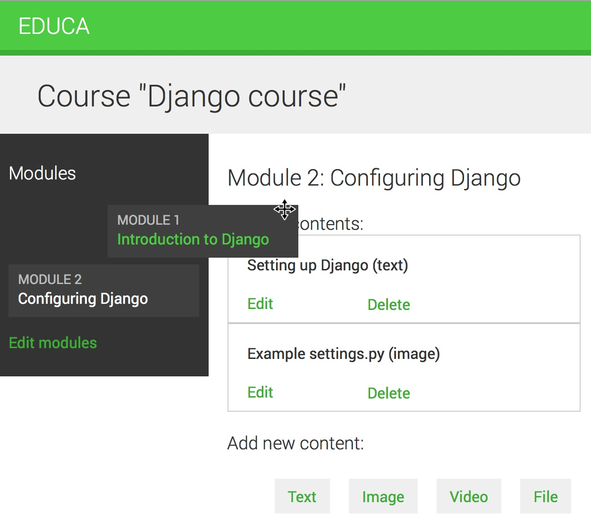

现在我们就实现了拖动排序功能。

# 渲染和缓存课程内容

在上一章中，使用了模型继承和通用关系建立弹性的课程、章节和内容的关联数据模型，并且建立了一个 CMS 系统，在其中使用了 CBV，表单集和 AJAX 管理课程内容。在这一章将要做的事情是：

- 创建公开对外展示课程的视图。
- 创建学生注册系统。
- 学生选课功能。
- 渲染不同的课程内容。
- 采用缓存框架缓存课程内容。

我们就从建立一个课程目录，供学生们浏览和选课来开始本章。

## 展示课程

为了展示课程，我们需要实现如下功能：

- 列出所有可用的课程，可以通过课程主题来进行筛选。
- 显示某个课程的具体内容。

由于数据模型已经齐备，编辑 `courses` 应用的 `views.py` 文件，增加以下代码：

```python
from django.db.models import Count
from .models import Subject

class CourseListView(TemplateResponseMixin, View):
    model = Course
    template_name = 'courses/course/list.html'

    def get(self, request, subject=None):
        subjects = Subject.objects.annotate(total_courses=Count('courses'))
        courses = Course.objects.annotate(total_modules=Count('modules'))
        if subject:
            subject = get_object_or_404(Subject, slug=subject)
            courses = courses.filter(subject=subject)
        return self.render_to_response({'subjects': subjects, 'subject': subject, 'courses': courses})
```

这个 `CourseListView` 继承了 `TemplateResponseMixin` 和 `View` 视图，执行了如下任务：

1. 取所有的主题，使用了 `annotate()` 分组和 `Count()` 聚合方法生成一个其中包含课程的数量字段。
1. 获得所有课程，同样进行了分组，增加了一个按照章节分组计数的字段。
1. 如果传入了某个具体的主题 `slug` 字段，就取得该 `slug` 对应的具体主题，并且将课程设置为该主题对应的课程，而不是全部课程。
1. 使用个 `TemplateResponseMixin` 类提供的 `render_to_response()` 方法将上边几个结果返回给模板。

再创建一个显示具体课程的视图，在 `views.py` 里增加如下内容：

```python
from django.views.generic.detail import DetailView

class CourseDetailView(DetailView):
    model = Course
    template_name = 'courses/course/detail.html'
```

这个视图继承了 Django 内置的 `DetailView` 视图，为其指定模型 `model` 和模板 `template_name` 属性，该 CBV 会在模板上渲染其中该数据类的详情。`DetailView` 需要一个 `slug` 或者主键 `pk` 来从指定的 `Course` 模型中获取具体信息，然后在 `template_name` 属性指定的模板中进行渲染。

编辑 `educa` 项目的根路由 `urls.py` 文件，增加以下代码：

```python
from courses.views import CourseListView
urlpatterns = [
    # ...
    path('', CourseListView.as_view(), name='course_list'),
]
```

我们想让访问该站点的人默认就来到列表页，因此将 `course_list` 设置为匹配网站的根目录，将这行放在所有 URL 的最下边，其他课程相关的 URL 都带有 `/course/` 前缀。

然后编辑 `courses` 应用的 `urls.py` 文件，增加下边两条 URL：

```python
    path('subject/<slug:subject>', views.CourseListView.as_view(), name='course_list_subject'),
    path('<slug:slug>', views.CourseDetailView.as_view(), name='course_detail'),
```

我们添加了如下两条路由：

- `course_list_subject`：展示所有的或某个主题下的课程。
- `course_detail`：展示某个课程的详情。

来为这两个视图创建模板，在 `templates/courses/` 目录下创建：

```bash
$ tree templates/courses
templates/courses
└── course
   ├── detail.html
   └── list.html
```

编辑 `courses/course/list.html` 模板，添加下列代码：

```django-html


    
        {{ subject.title }} courses
    
        All courses
    


    <h1>
        
            {{ subject.title }} courses
        
            All courses
        
    </h1>
    <div class="contents">
        <h3>Subjects</h3>
        <ul id="modules">
            <li class="selected">
                <a href="">All</a>
            </li>
            
                <li class="selected">
                    <a href="">
                        {{ s.title }}
                        <br><span>{{ s.total_courses }} courses</span>
                    </a>
                </li>
            
        </ul>
    </div>
    <div class="module">
        
            
                <h3><a href="">
                    {{ course.title }}</a></h3>
                <p>
                    <a href="">
                        {{ subject }}</a>.
                    {{ course.total_modules }} modules.
                    Instructor: {{ course.owner.get_full_name }}
                </p>
            
        
    </div>

```

这个模板用来列出所有的课程。模板中创建了一个列表，展示所有的 `Subject` 对象和反向解析的链接 `course_list_subject`，使用判断来切换 CSS 类 `selected` 用于显示当前被选中的主题。然后迭代所有的 `Course` 对象，展示其中的总章节数目以及讲师的名字。

启动站点，打开 http://127.0.0.1:8000/course ，可以看到如下页面：

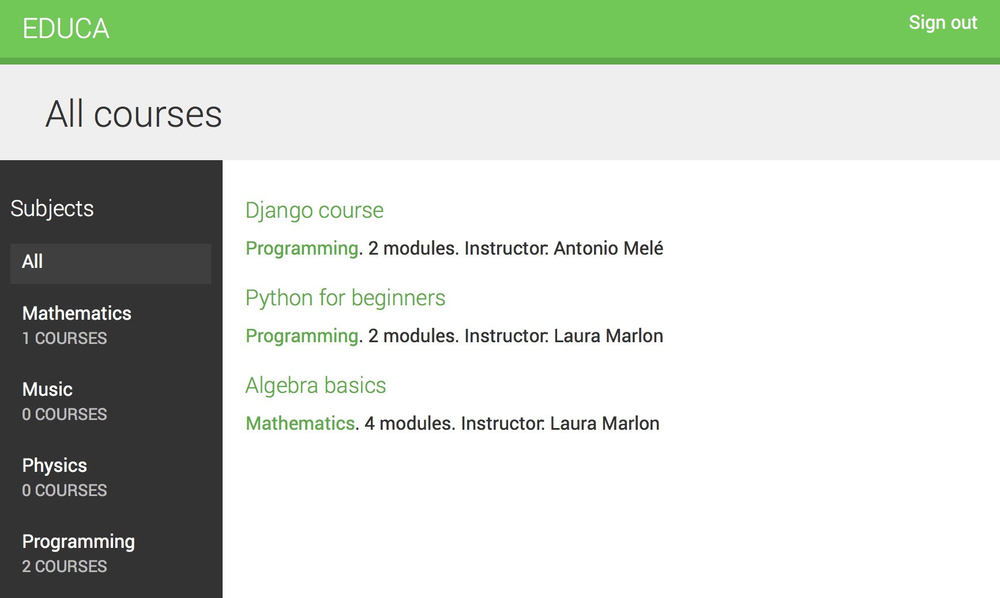

左侧边栏包含所有的主题以及主题中的课程数量，右侧在默认情况下，显示所有的主题其中的所有的课程。如果选择任何主题，则只显示该主题对应的课程。

编辑 `courses/course/detail.html`，添加如下代码：

```django-html


    {{ object.title }}


    
        <h1>
            {{ object.title }}
        </h1>
        <div class="module">
            <h2>Overview</h2>
            <p>
                <a href="">
                    {{ subject.title }}</a>.
                {{ course.modules.count }} modules.
                Instructor: {{ course.owner.get_full_name }}
            </p>
            {{ object.overview|linebreaks }}
        </div>
    

```

这个模板中显示了一个课程的整体情况和其中的具体内容。在浏览器中打开 http://127.0.0.1:8000/course ，点击右侧任意一个课程，可以看到如下页面：

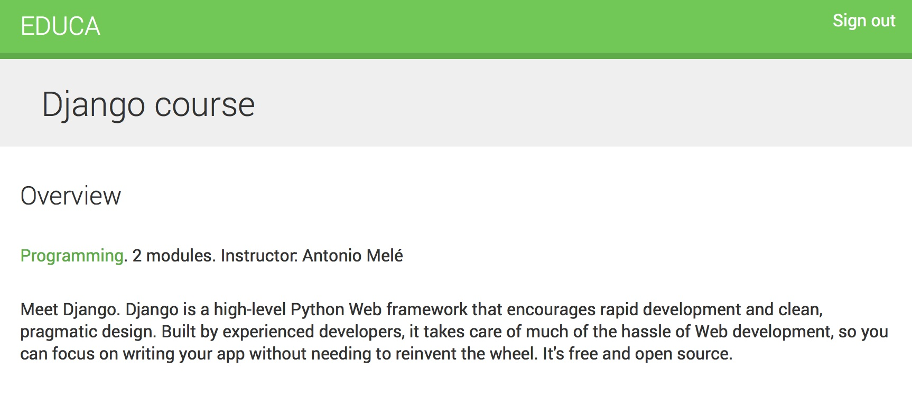

我们已经建立好了公共的（不需要特别权限）的展示课程的页面，下一步，需要允许用户以学生身份注册并且选课。

## 增加学生注册功能

建立一个新的应用来管理学生注册功能：

```bash
python manage.py startapp students
```

编辑 `settings.py` 激活新应用：

```python
INSTALLED_APPS = [
    # ...
    'students.apps.StudentsConfig',
]
```

### 创建注册视图

编辑 `students` 目录内的 `views.py` 文件，增加如下代码：

```python
from django.urls import reverse_lazy
from django.views.generic.edit import CreateView
from django.contrib.auth.forms import UserCreationForm
from django.contrib.auth import authenticate, login

class StudentRegistrationView(CreateView):
    template_name = 'students/student/registration.html'
    form_class = UserCreationForm
    success_url = reverse_lazy('student_course_list')

    def form_valid(self, form):
        result = super(StudentRegistrationView, self).form_valid(form)
        cd = form.cleaned_data
        user = authenticate(username=cd['username'], password=cd['password1'])
        login(self.request, user)
        return result
```

这是允许学生注册的视图，继承了内置的 `CreateView` 视图，该视图提供了创建模型对象的一般方法。这个视图需要如下属性：

- `template_name`：需要渲染的模板位置。
- `form_class`：必须是一个 `ModelForm` 对象，这里指定为 Django 内置的建立新用户的 `UserCreationForm` 表单。
- `success_url`：成功后跳转的 URL，通过反向解析 `student_course_list` 获取，看名字就知道是给学生列出课程列表的 URL，会在稍后配置该 URL。

`form_valid()` 方法表单数据成功验证的时候执行，该方法必须返回一个 HTTP 响应。重写该方法以使用户在成功注册之后就登录。

在 `students` 应用中创建 `urls.py` 文件，并在其中设置该视图的 URL：

```python
from django.urls import path
from . import views

urlpatterns = [
    path('register/', views.StudentRegistrationView.as_view(), name='student_registration'),
]
```

然后编辑 `educa` 项目的根 `urls.py`，为 `students` 应用配置二级路由：

```python
urlpatterns = [
    # ...
    path('students/', include('students.urls')),
]
```

之后在 `students` 应用中创建如下目录和模板文件：

```bash
$ tree students/templates/students
students/templates/students
└── student
    └── registration.html
```

编辑 `students/student/registration.html` 模板，添加下列代码：

```django-html


    Sign up


    <h1>
        Sign up
    </h1>
    <div class="module">
        <p>Enter your details to create an account:</p>
        <form action="" method="post">
            {{ form.as_p }}
            
            <p><input type="submit" value="Create my account"></p>
        </form>
    </div>

```

启动站点，到 http://127.0.0.1:8000/students/register/ ，应该可以看到如下的注册表单：

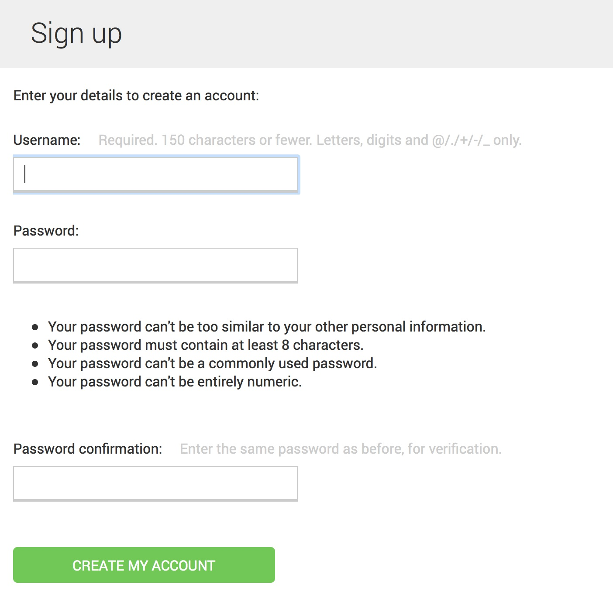

注意此时 `StudentRegistrationView` 视图的 `success_url` 属性中的 `student_course_list` URL 还没有配置，所以还不能提交表单，否则会报错。会在下一节中配置该 URL。

### 选课功能

在用户注册成功之后，应该能够让其选课以便加入到某门课的学习中去。很显然，一个学生可以选择多门课程，一个课程也有多个学生，需要在 `Course` 模型和 `User` 模型之间添加一个多对多关系。

编辑 `courses` 应用的 `models.py` 文件，为 `Course` 模型添加一个字段：

```python
class Course(models.Model):
    # ......
    students = models.ManyToManyField(User, related_name='courses_joined', blank=True)
```

之后立刻执行数据迁移过程。

现在我们可以通过多对多关系来设置学生与课程之间的关系了。之后需要编写一个视图用于实现选课功能。

在 `students` 应用内创建 `forms.py`：

```python
from django import forms
from courses.models import Course

class CourseEnrollForm(forms.Form):
    course = forms.ModelChoiceField(queryset=Course.objects.all(), widget=forms.HiddenInput)
```

这个表单是学生选课时候提交的表单。`course` 字段使用了 `ModelChoiceField`，供学生选择所有的课程，使用了 `HiddenInput` 插件不给学生展示该表单。这个表单将在 `CourseDetailView` 中使用，在页面上显示一个选课按钮让学生进行选课。

编辑 `students` 应用的 `views.py` 文件，增加如下代码：

```python
from django.views.generic.edit import FormView
from django.contrib.auth.mixins import LoginRequiredMixin
from .forms import CourseEnrollForm

class StudentEnrollCourseView(LoginRequiredMixin, FormView):
    course = None
    form_class = CourseEnrollForm

    def form_valid(self, form):
        self.course = form.cleaned_data['course']
        self.course.students.add(self.request.user)
        return super(StudentEnrollCourseView, self).form_valid(form)

    def get_success_url(self):
        return reverse_lazy('student_course_detail', args=[self.course.id])
```

这是用于处理学生选课的 `StudentEnrollCourseView` 视图。该视图继承了内置 `LoginRequiredMixin` 类，一定要用户登录才能使用该功能。还继承了内置的 `FormView`，因为我们要处理表单提交。设置 `form_class` 属性为 `CourseEnrollForm` 类，设置了一个 `course` 属性用于保存学生选的课程对象。当表单验证通过的时候，取得当前的用户，设置多对多关系，然后调用父类的方法保存数据。

`get_success_url()` 方法返回了成功之后跳转的 URL，这个方法和 `success_url` 属性的功能一样。该 URL 会在下一节中设置。

编辑 `students` 应用中的 `urls.py` 文件，为该视图配置 URL：

```python
    path('enroll-course/', views.StudentEnrollCourseView.as_view(), name='student_enroll_course'),
```

然后在课程详情页面增加一个选课按钮，编辑 `courses` 应用中的 `views.py` 文件，找到 `CourseDetailView` 视图，修改成如下所示：

```python
from students.forms import CourseEnrollForm

class CourseDetailView(DetailView):
    model = Course
    template_name = 'courses/course/detail.html'

    def get_context_data(self, **kwargs):
        context = super(CourseDetailView, self).get_context_data(**kwargs)
        context['enroll_form'] = CourseEnrollForm(initial={'course':self.object})
        return context
```

这里重写了 `get_context_data()` 方法，把这个表单添加到模板变量中，并且将表单中隐藏的字段内容初始化成了当前的课程对象，所以可以直接通过按钮提交表单，无需填写隐藏字段。

在 `courses/course/detail.html` 文件中找到如下一行：

```django-html
{{ object.overview|linebreaks }}
```

将其替换成如下代码：

```django-html
{{ object.overview|linebreaks }}

    <form action="" method="post">
        {{ enroll_form }}
        
        <input type="submit" class="button" value="Enroll now">
    </form>

    <a href="" class="button">
        Register to enroll
</a>

```

这样就给页面添加上了按钮，如果用户已登录，就展示该按钮，包含一个指向 `student_enroll_course` 的隐藏表单，如果未登录，展示一个登录链接供用户登录。

启动站点，在浏览器中打开 http://127.0.0.1:8000/ ，然后点击一个具体的课程，如果已经登录，可以看到该按钮，如下所示：

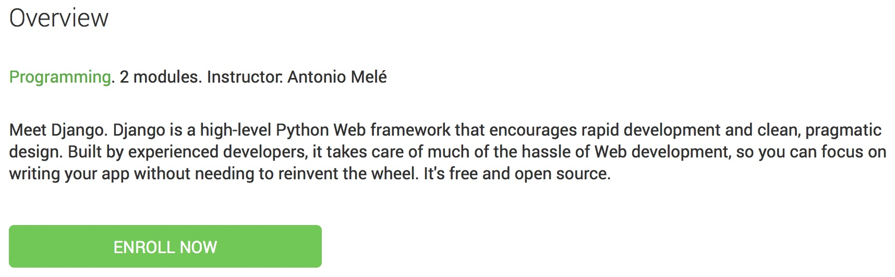

如果未登录，则看到的是一个 REGISTER TO ENROLL 的按钮。

## 访问课程内容

在学生选好课之后，还必须创建一个视图给学生展示课程中的章节和内容，以便让他们访问课程内容来进行具体学习。

编辑 `students` 应用的 `views.py` 文件，添加下列代码：

```python
from django.views.generic.list import ListView
from courses.models import Course

class StudentCourseListView(LoginRequiredMixin, ListView):
    model = Course
    template_name = 'students/course/list.html'

    def get_queryset(self):
        qs = super(StudentCourseListView,self).get_queryset()
        return qs.filter(students__in=[self.request.user])
```

这个视图用来给学生展示所有的课程。该视图继承了需要登录的 `LoginRequiredMixin`。还继承了内置的 `ListView` 用于展示一系列的 `Course` 对象。重写了 `get_queryset()` 方法，通过 `ManyToManyField` 过滤出当前学生的已选课程。

继续在 `views.py` 文件里添加显示详情的类：

```python
from django.views.generic.detail import DetailView

class StudentCourseDetailView(DetailView):
    model = Course
    template_name = 'students/course/detail.html'

    def get_queryset(self):
        qs = super(StudentCourseDetailView, self).get_queryset()
        return qs.filter(students__in=[self.request.user])

    def get_context_data(self, **kwargs):
        context = super(StudentCourseDetailView, self).get_context_data(**kwargs)
        course = self.get_object()

        if 'module_id' in self.kwargs:
            context['module'] = course.modules.get(id=self.kwargs['module_id'])
        else:
            context['module'] = course.modules.all()[0]
        return context
```

这个视图用于向学生展示他们选的课程和章节。依然重写了 `get_queryset()` 方法用于返回与当前学生已选课程。重写了 `get_context_data()` 方法，如果给了一个 `module_id`，就将模板变量 `module` 设置为这个 `module_id` 对应的课程，如果没给出，默认为该课程的第一个章节。这样学生就能浏览整个课程的章节。

然后在 `students` 应用中的 `urls.py` 中为该视图配置 URL：

```python
    path('course/',views.StudentCourseListView.as_view(),name='student_course_list'),
    path('course/<pk>/',views.StudentCourseDetailView.as_view(),name='student_course_detail'),
    path('course/<pk>/<module_id>/',views.StudentCourseDetailView.as_view(),name='student_course_detail_module'),
```

在 `students` 应用中的 `templates/students/` 目录下创建如下文件和目录结构：

```python
$ tree students/templates/students/course
students/templates/students/course
├── detail.html
└── list.html
```

编辑 `students/course/list.html`：

```django-html

My courses

    <h1>My courses</h1>
    <div class="module">
        
            <div class="course-info">
                <h3>{{ course.title }}</h3>
                <p><a href="">
                    Access contents</a></p>
            </div>
        
            <p>
                You are not enrolled in any courses yet.
                <a href="">Browse courses</a>
                to enroll in a course.
            </p>
        
    </div>

```

这个模板用于展示用户所有选的课程。注意在上一小节里，学生注册成功之后，会被重定向至 `student_course_list` URL，但是如果在其他页面登录，会被导向内置的验证模块的相关 URL，所以修改 `settings.py`：

```python
from django.urls import reverse_lazy
LOGIN_REDIRECT_URL = reverse_lazy('student_course_list')
```

设置成这样之后，所有内置 `auth` 模块完成登录操作之后都跳转到该指定地址。现在所有的学生在注册成功之后都会跳转到 `student_course_list` URL，即显示该学生已选课程的页面。

再编辑 `students/course/detail.html`，添加下列代码：

```django-html


    {{ object.title }}


    <h1>
        {{ module.title }}
    </h1>
    <div class="contents">
        <h3>Modules</h3>
        <ul id="modules">
            
                <li data-id="{{ m.id }}" class="selected"
                    >
                    <a href="">
                        <span>Module <span class="order">{{ m.order|add:1 }}</span></span>
                        <br>
                        {{ m.title }}
                    </a>
                </li>
            
                <li>No modules yet.</li>
            
        </ul>
    </div>
    <div class="module">
        
            
                <h2>{{ item.title }}</h2>
                {{ item.render }}
            
        
    </div>

```

这是用于让学生具体学习已选课程内容的页面。首先我们创建了一个列表包含所有章节，并且高亮当前章节，然后迭代所有当前章节中的内容，使用了一个 `{{ item.render }}` 来展示具体的内容。

此时 `render()` 方法还没有编写，在下一节中就来为每个内容对象编写这个方法来展示不同种类的内容。

### 渲染各种课程内容

我们想为不同的内容编写一个统一的渲染方式。编辑 `courses` 应用的 `models.py` 文件，来为这四个类共同继承的基类 `ItemBase` 模型编写一个 `render()` 方法：

```python
from django.template.loader import render_to_string
from django.utils.safestring import mark_safe

class ItemBase(models.Model):
    # ......
    def render(self):
        return render_to_string('courses/content/{}.html'.format(self._meta.model_name), {'item': self})
```

这个方法利用的内置的 `render_to_string()` 方法，传入一个模板名称和上下文，然后模板渲染成为一个 HTML 字符串。每种类型的内容采用不同名称的模板。使用 `self._meta.model_name` 获取当前的模型名字。通过这个 r`ender()` 方法，就得到了渲染内容的通用接口。

在 `courses` 应用的 `templates/courses/` 下边建立如下目录和文件结构：

```bash
$ tree courses/templates/courses/content
courses/templates/courses/content
├── file.html
├── image.html
├── text.html
└── video.html
```

编辑 `courses/content/text.html`，添加如下代码：

```djnago-html
{{ item.content|linebreaks|safe }}
```

编辑 `courses/content/file.html`，添加如下代码：

```djnago-html
<p><a href="{{ item.file.url }}" class="button">Download file</a></p>
```

编辑 `courses/content/image.html`，添加如下代码：

```djnago-html
<p></p>
```

由于 `ImageField` 和 `FileField` 都是文件字段，为了管理这两个字段，必须在 `settings.py` 中配置媒体文件的路径：

```python
MEDIA_URL = '/media/'
MEDIA_ROOT = os.path.join(BASE_DIR, 'media/')
```

回忆一下，这里 `MEDIA_URL` 是指上传媒体文件的路径，`MEDIA_ROOT` 是指的查找媒体文件的路径。

编辑项目的根 `urls.py` 文件，在开头添加下列导入代码：

```python
from django.conf import settings
from django.conf.urls.static import static
```

然后在末尾追加：

```python
if settings.DEBUG:
    urlpatterns += static(settings.MEDIA_URL,document_root=settings.MEDIA_ROOT)
```

现在我们的站点就能够接受文件上传和提供文件存储了。在开发的过程中，Django 会管理媒体文件。但在正式生产环境中，就不能如此配置了。我们将在第十三章学习生产环境的配置。

关于 `video.html`，有点额外的事情要做。将使用 django-embed-video 模块来集成视频内容。django-embed-video 是一个第三方模块，可以将来自 YouTube 或者 Vimeo 等来源的视频内容集成到模板中，只需为其提供视频的 URL 即可。

安装该模块：

```bash
pip install django-embed-video
```

然后在 `settings.py` 里激活该应用：

```python
INSTALLED_APPS = [
    # ...
    'embed_video',
]
```

可以在 https://django-embed-video.readthedocs.io/en/latest/ 找到这个模块的文档。

现在来编辑 `video.html`：

```django-html


```

现在启动站点，到 http://127.0.0.1:8000/course/mine/ ，以 `Instructors` 组内用户的身份登录，为一个课程添加各种课程内容，视频地址可以拷贝任意的 YouTube 链接比如 https://www.youtube.com/watch?v=bgV39DlmZ2U 。

在添加完内容之后，到 http://127.0.0.1:8000/ 点击刚创建的课程，再点击 Enroll Now，之后被重定向到课程列表，应该可以看到类似下面的页面：

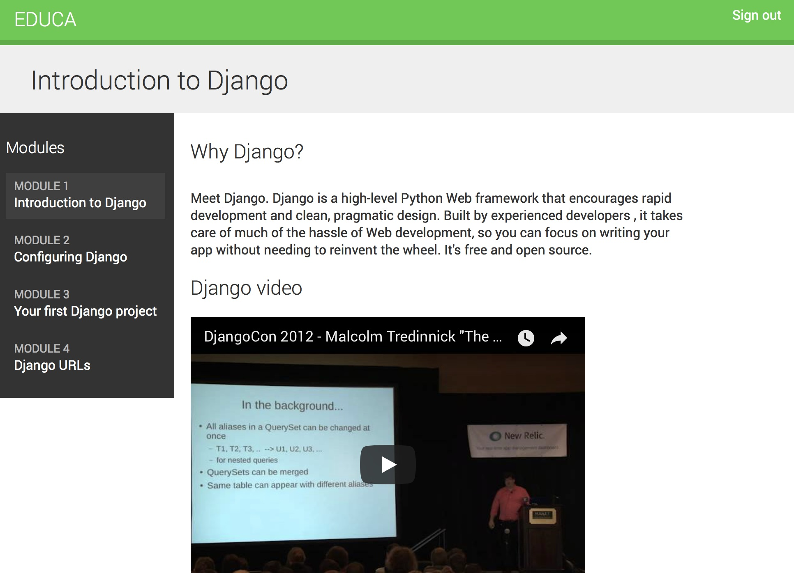

这样就完成了展示内容的通用方法。

译者注：这里还有一些不完善的地方，比如选了某个课之后回到列表页面再次进入已经选过的课程，会看到 Enroll Now 还在，其实应该显示 Start to Learn 之类的词语。这只要在模板中检测一下当前的课程是否包含在用户已经选择的课程中就可以了。

此外在测试代码的时候还发现，如果一个课程内没有章节，则作者在 `StudentCourseDetailView` 中的最后一句：

```python
    context['module'] = course.modules.all()[0]
```

此处硬编码了返回第一个查询结果，就会报错，修改方法是做个判断，如果长度=0，就返回空就可以了，这样页面不会渲染出内容。

## 使用缓存框架

HTTP 请求对我们的 Web 应用来说，意味着查询数据和处理业务逻辑和渲染模板等工作，这比返回一个静态的页面开销要大很多。

当站点的流量越来越大的时候，大量访问给后端带领的压力是巨大的。这个时候就是缓存系统大派用场的时刻。把一个 HTTP 请求导致的数据查询，业务逻辑处理结果，甚至渲染后的内容缓存起来，就可以避免在后续类似的请求中反复执行开销大的操作，会有效地提高网站的响应时间。

Django 包含一个健壮的缓存系统，可以缓存不同粒度的数据。可以缓存一个查询，一个视图的返回结果，部分模板的渲染内容，甚至整个站点。在缓存系统中存储的数据有时效性，可以设置其过期的时间。

当应用接到一个 HTTP 请求的时候，通常按照如下的顺序使用缓存系统：

1. 在缓存系统中寻找 HTTP 请求需要的数据。
1. 如果找到了，返回缓存的数据。
1. 如果没有找到，按照如下顺序执行：
   a. 进行数据查询或者处理，得到数据。
   b. 将数据保存在缓存内。
   c. 返回数据。

关于详细的缓存机制，可以官方文档： https://docs.djangoproject.com/zh-hans/4.2/topics/cache/ 。

### 可用的缓存后端

就像数据库一样，Django 的缓存机制可以使用多种缓存服务后端来完成，主要有这些：

1. `backends.memcached.MemcachedCache` 或 `backends.memcached.PyLibMCCache`：是基于 Memcached 服务的后端。具体使用哪种后端取决于采用哪种 Python 支持的 Memcached 模块。
1. `backends.db.DatabaseCache`：使用数据库作为缓存（如 redis）。
1. `backends.filebased.FileBasedCache`：使用文件作为缓存，序列化每个缓存数据为一个单独的文件。
1. `backends.locmem.LocMemCache`：本地内存缓存，这是默认值。
1. `backends.dummy.DummyCache`：伪缓存机制，仅用于开发。提供了缓存界面但实际上不缓存任何内容。每个进程的缓存互相独立而且线程安全。

对于优化性能而言，最好选取基于内存缓存的缓存机制比如 Memcached 后端。

### 安装 Memcached 服务

我们将使用 Memcached 缓存。Memcached 在内存中运行，占用一定大小的内存作为缓冲区。当被分配的内存用光的时候，Memcached 就会以新数据替代较老的数据。

在 https://memcached.org/downloads 下载 Memcached，如果是 Linux 系统，可以使用下列命令编译安装：

```bash
./configure && make && make test && sudo make install
```

如果使用 MacOS X 而且安装了 Homebrew，可以直接通过 `brew install memcached` 安装，也可以在 https://brew.sh/ 下载。

安装了 Memcached 之后，可以通过一个命令启动服务：

```bash
memcached -l 127.0.0.1:11211
```

此时 Memcached 就会在默认的 11211 端口运行。还可以通过 `-l` 参数指定其他的主机和端口号。可以在 https://memcached.org 查看文档。

还需要安装 Python 的 Memcached 模块：

```bash
pip install python-memcached==1.59
```

### 缓存设置

Django 提供了下列缓存设置：

- `CACHES`：一个字典，包含当前项目所有可用的缓存。
- `CACHE_MIDDLEWARE_ALIAS`：缓存的别名。
- `CACHE_MIDDLEWARE_KEY_PREFIX`：缓存键名的前缀，如果不同站点都用同一个 Memcached 服务，设置这个 KEY 可以避免发生键冲突。
- `CACHE_MIDDLEWARE_SECONDS`：缓存页面的时间。

通过 `CACHES` 可以设置项目的缓存系统。这个设置以字典的形式，可以配置多个缓存后端的设置。每个 `CACHES` 中的缓存后端有如下设置：

- `BACKEND`：缓存后端。
- `KEY_FUNCTION`：生成键的函数，是一个字符串，包含一个可调用函数的位置，这个函数接受前缀，版本和键名为参数，返回一个最终的缓存键。
- `KEY_PREFIX`：缓存键名的前缀。
- `LOCATION`：缓存后端的位置，根据不同的后端配置，可能是一个目录，一个主机+端口或者一个内存缓存的名称。
- `OPTIONS`：其他的向缓存后端传递的配置参数。
- `TIMEOUT`：过期设置，单位是秒。默认是 300 秒=5 分钟，如果设置为 None，则缓存键不会过期。
- `VERSION`：缓存键的版本号，用于缓存版本信息。

### 为项目配置 Memcached 缓存

编辑 `settings.py`，将上述的缓存设置加入到文件中：

```python
CACHES = {
    'default': {
        'BACKEND': 'django.core.cache.backends.memcached.MemcachedCache',
        'LOCATION': '127.0.0.1:11211',
}
}
```

这里指定了后端为 Memcached，然后指定了主机 IP 和端口号。如果有很多 Memcached 配置在不同主机上，可以给 `LOCATION` 传一个列表。

#### 监控 Memcached 服务

为了监控 Memcached 的服务，可以使用第三方模块 `django-memcache-status`，该模块可以在管理后台中显示 Memcached 的统计情况。安装该模块：

```bash
pip install django-memcache-status
```

编辑 `setting.py`，激活该应用:

```python
INSTALLED_APPS = [
    # ...
    'memcache_status',
]
```

确保 Memcached 服务在运行，然后进入站点的管理后台，可以看到如下的内容：

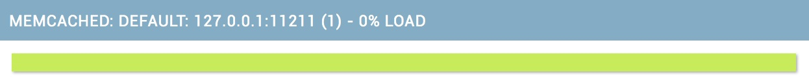

### 缓存级别

Django 为不同粒度的数据提供了如下的缓存级别：

- Low-level cache API：粒度最细，缓存精确的查询或者计算结果。
- Per-view cache：对单独的视图进行缓存。
- Template cache：缓存模板片段。
- Per-site cache：站点缓存，最高级别缓存。

在建立缓存系统之前，必须仔细考虑缓存策略。建议对不基于具体用户身份的，系统开销比较大的数据库查询和密集计算进行缓存。

### 使用 Low-level cache API

Low-level 缓存 API 可以存储任意粒度的对象，该功能位于 `django.core.cache`，可以导入进来，：

```python
from django.core.cache import cache
```

这个缓存默认使用会使用配置中的 `default` 名称对应的缓存后端，类似于数据库，等于通过 `caches['default]` 获取缓存后端。。

可以通过如下命令得到一个使用某个具体配置名称的缓存配置：

```python
from django.core.cache import caches
my_cache = caches['alias']
```

在导入当前 Django 环境的 Python 命令行中里进行一些实验：

```bash
>>> from django.core.cache import cache
>>> cache.set('musician', 'Django Reinhardt', 20)
```

通过使用了 `set(key,value,timeout)` 方法，向默认的缓存后端存入了一个键名叫 `'musician'`，值是 `'Django Reinhardt'`，20 秒过期。如果不给出具体时间，则 Django 使用 `settings.py` 中的默认设置。然后再输入：

```bash
>>> cache.get('musician')
'Django Reinhardt'
```

可以获取对应的值。等待 20 秒再执行上述命令：

```bash
>>> cache.get('musician')
```

说明该键已经过期，`get()` 方法返回 `None` 。

不要在缓存中存储值为 `None` 的键，否则无法区分缓存命中与否。

再实验如下代码：

```bash
>>> from courses.models import Subject
>>> subjects = Subject.objects.all()
>>> cache.set('all_subjects', subjects)
```

这里先执行了一个 `QuerySet` 查询，然后将查询的结果缓存到 `all_subjects` 键中。来试试从缓存中取数：

```bash
>>> cache.get('all_subjects')
<QuerySet [<Subject: Mathematics>, <Subject: Music>, <Subject: Physics>, <Subject: Programming>]>
```

现在我们知道如何使用缓存了。下一步就是给常用的视图增加缓存机制。打开 `courses` 应用的 `views.py` 文件，首先导入缓存：

```python
from django.core.cache import cache
```

在 `CourseListView` 的 `get()` 方法里，找到下面这一行：

```python
subjects = Subject.objects.annotate(total_courses=Count('courses'))
```

将其修改成：

```python
subjects = cache.get('all_subjects')
if not subjects:
    subjects = Subject.objects.annotate(total_courses=Count('courses'))
    cache.set('all_subjects', subjects)
```

在这段代码里，我们先尝试去缓存中获取 `all_subjects` 这个键，如果结果为 `None`，说明缓存中没有，执行正常数据查询，然后将结果存入到缓存中。

启动站点，访问 http://127.0.0.1:8000/ ，只要访问这个路径，刚才配置的缓存就会启动，由于第一次执行，之前没有缓存内容，所以视图就会将查询结果放入缓存。此时进入管理后台查看 Memcached 的统计，可以看到如下内容：

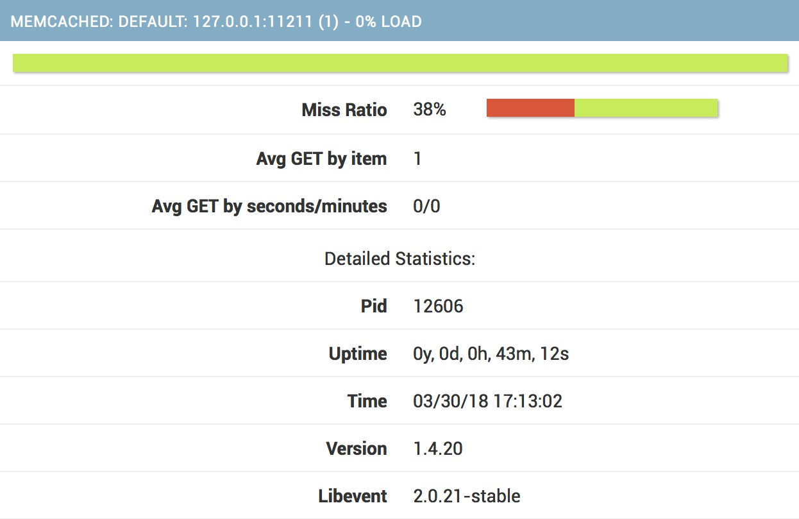

在 Memcache 的统计数据里找到 Curr Item 这一项，如果严格按照本文来进行，应该为 1，除非之前存储了其他内容。这表示当前缓存中有一个键值对。Get Hits 表示有多少次 Get 操作成功命中缓存数据，Get Miss 则表示未命中的次数。最上边的 Miss Ration 使用这两个值计算得到。

现在打开浏览器，反复刷新 http://127.0.0.1:8000/ ，然后再去看 Memcahed 的统计页面，看看统计数据的变化。

#### 缓存动态数据

但有的时候，想缓存动态生成的数据。这就必须建立动态的键，用于唯一确定对具体的缓存数据。看以下例子：

编辑 `courses` 应用的 `views.py` 文件，修改 `CourseListView` 视图如下所示：

```python
def get(self, request, subject=None):
    subjects = cache.get('all_subjects')
    if not subjects:
        subjects = Subject.objects.annotate(total_courses=Count('courses'))
        cache.set('all_subjects', subjects)
    all_courses = Course.objects.annotate(total_modules=Count('modules'))
    if subject:
        subject = get_object_or_404(Subject, slug=subject)
        key = 'subject_{}_courses'.format(subject.id)
        courses = cache.get(key)
        if not courses:
            courses = all_courses.filter(subject=subject)
            cache.set(key, courses)
    else:
        courses = cache.get('all_courses')
        if not courses:
            courses = all_courses
            cache.set('all_courses', courses)
    return self.render_to_response({'subjects': subjects,
                                    'subject': subject,
                                    'courses': courses})
```

在这个视图里，我们还保存了所有的课程和按主题过滤的课程。`all_courses` 键对应的是所有课程的查询结果集，动态生成的键名 `'subject_{}_courses'.format(subject.id)` 对应着具体类别的查询结果集。

要注意的是，不能用从缓存中取出来的查询结果再去建立其他查询结果，也就是说下边的代码是不行的：

```python
courses = cache.get('all_courses')
courses.filter(subject=subject)
```

缓存只能用于存储最终可供页面直接使用的查询结果，不能在中间步骤缓存。所以这就是为什么要在视图开始的地方建立基础查询 `all_courses = Course.objects.annotate(total_modules=Count('modules'))`，然后再用 `courses = all_courses.filter(subject=subject)` 生成查询结果的原因。

### 缓存模板片段

缓存模板片段是比较高级别的缓存，需要在模板中加载缓存标签： ``，然后使用 `` 来标记需要缓存的片段。实际使用像这样：

```django-html

...

```

如上边例子所示，`` 标签有两个可选的参数，第一个是过期秒数，第二个是为该片段起的名称。如果需要缓存动态生成的模板片段，可以再增加额外的参数用于生成唯一 KEY。

编辑 `/students/course/detail.html`，为模板在 `` 标签后加上：

```python

```

然后找到下列代码：

```django-html

    
        <h2>{{ item.title }}</h2>
        {{ item.render }}
    

```

替换成下列代码：

```django-html

    
        
            <h2>{{ item.title }}</h2>
            {{ item.render }}
        
    

```

这里使用了 600 秒的过期时间，指定了该片段的别名为 `module_contents`，然后用 `module` 变量动态创建键，这样就建立了独特的键以避免重复。

如果启用了国际化设置 `USE_I18N=True`，缓存中间件会考虑语言的影响。如果你在一个页面中使用了 `` 标签，下次想从缓存中拿到正确的数据，必须将特定语言的代码和缓存标签一起使用，才能得到正确的结果：例如 ``。

### 缓存视图

可以通过使用 `django.views.decorators.cache` 中的 `cache_page` 装饰器来缓存视图的输出结果，需要一个参数 `timeout`，是过期秒数。

在视图中使用该装饰器，编辑 `students` 应用的 `urls.py` 文件，先导入该装饰器：

```python
from django.views.decorators.cache import cache_page
```

然后把 `cache_page` 用于 `student_course_detail` 和 `student_course_detail_module` 两个 URL 上，如下：

```python
path('course/<pk>/', cache_page(60 * 15)(views.StudentCourseDetailView.as_view()), name='student_course_detail'),
path('course/<pk>/<module_id>/', cache_page(60 * 15)(views.StudentCourseDetailView.as_view()),
     name='student_course_detail_module'),
```

这样配置之后，`StudentCourseDetailView` 的结果就会被缓存 15 分钟。

注意，缓存使用 URL 来构建缓存键，对同一个视图函数，来自不同 URL 路由的结果，会被分别缓存。

#### 缓存动态数据

缓存站点是级别最高的缓存，允许缓存整个站点。

要启用站点缓存，需要编辑 `settings.py`，把 `UpdateCacheMiddleware` 和 `FetchFromCacheMiddleware` 中间件加入 `MIDDLEWARE` 设置中：

```python
MIDDLEWARE = [
    'django.middleware.security.SecurityMiddleware',
    'django.contrib.sessions.middleware.SessionMiddleware',
    'django.middleware.cache.UpdateCacheMiddleware',
    'django.middleware.common.CommonMiddleware',
    'django.middleware.cache.FetchFromCacheMiddleware',
    # ...
]
```

中间件的顺序至关重要，中间件在 HTTP 请求进来的时候是按照从上到下的顺序执行，返回响应的时候按照从下到上的顺序执行。`UpdateCacheMiddleware` 必须放在 `CommonMiddleware` 的上边，因为 `UpdateCacheMiddleware` 只在响应的时候才执行。`FetchFromCacheMiddleware` 被放在 `CommonMiddleware` 之后，因为 `FetchFromCacheMiddleware` 需要 `CommonMiddleware` 处理过的请求数据。

然后还需要把下列设置加入到 `settings.py` 中：

```python
CACHE_MIDDLEWARE_ALIAS = 'default'
CACHE_MIDDLEWARE_SECONDS = 60 * 15 # 15 minutes
CACHE_MIDDLEWARE_KEY_PREFIX = 'educa'
```

在这些设置里，设置了使用 `default` 名称的缓存后端，15 分钟过期时间，以及设置前缀避免重复。现在站点对所有的 GET 请求，都缓存和优先返回缓存的结果。

这样我们就设置好了整个站点的缓存，然而站点缓存对于我们这个站来说是不适合的，因为 CMS 系统里更改了数据之后，必须立刻返回更新后的数据。所以最佳的方法是缓存向学生返回课程内容的视图或者模板。

我们已经学习过了 Django 内的各种方法用于缓存数据。应该明智的设置缓存策略，优先缓存开销高的查询和计算。

# 创建 API

在上一章里，创建了一个学生注册系统和选课系统。然后创建了展示课程内容的视图，以及学习了如何使用 Django 缓存框架。在这一章里有如下内容：

- 建立 RESTful API。
- 管理 API 视图的认证与权限。
- 建立 API 视图集和路由。

## 创建 RESTful API

你可能会想建立一个接口（API），让其他应用程序和我们的网站进行交互。通过建立一个 API，就可以让第三方应用程序自动化的操作和消费我们网站生产的数据。

有很多种方式可以建立这样一个 API，推荐根据 REST 原则来建立这样一个 API。REST 是 Representational State Transfer 的简称。RESTful API 是基于资源的，即 URL 用于表示网站所有的资源，HTTP 的请求种类比如 GET,POST,PUT 或 DELETE 表示对应的行为，即获取，创建，更新和删除数据。不同的 HTTP 响应码表示这次动作的完成结果，例如 2XX 表示该操作成功，4XX 表示错误等。

RESTful API 常用的数据交换格式是 JSON 或者 XML，我们准备建立一个使用 JSON 进行数据交换的 API。我们的 API 会提供以下功能：

- 获取主题。
- 获取可用的课程。
- 获取课程内容。
- 在一个课程中注册。

我们可以从 0 开始写视图来建立该 API，也可以通过第三方应用简单的为项目建立 API，在这方面最出名的第三方应用就是 Django REST framework。

### 安装 Django REST framework

Django REST framework 可以让你简单地创建符合 REST 风格的 API，其官方网站是 https://www.django-rest-framework.org/ 。

打开系统命令行输入如下命令：

```bash
pip install djangorestframework
```

然后编辑 `settings.py` 激活 `rest_framework` 应用：

```python
INSTALLED_APPS = [
    # ...
    'rest_framework',
]
```

再在 `settings.py` 中加入如下设置：

```python
REST_FRAMEWORK = {
    'DEFAULT_PERMISSION_CLASSES': [
        'rest_framework.permissions.DjangoModelPermissionsOrAnonReadOnly',
    ]
}
```

`REST_FRAMEWORK` 用于具体设置该模块。REST framework 提供了很多设置：`DEFAULT_PERMISSION_CLASSES` 提供了对于增删改查行为的默认权限。我们设置了 `DjangoModelPermissionsOrAnonReadOnly` 作为唯一默认的权限类。

这个权限类依赖于 Django 的权限系统，让用户可以增删改查数据对象，同时让未登录用户只能进行只读操作。在下边的向视图增加权限一节中还会详细学习这部分功能。

Django REST 框架的全部设置可以在 https://www.django-rest-framework.org/api-guide/settings/ 找到。

### 设置序列化器

在设置好框架后，还需要确定使用的序列化器。网站对外提供的数据应当是经过序列化的标准数据，同时还需要对外界输入的数据进行反序列化。REST 框架提供了下列类用于对一个单独对象设置序列化器：

- `Serializer`：为普通的 Python 类实例提供序列化。
- `ModelSerializer`：为数据模型的实例提供序列化。
- `HyperlinkedModelSerializer`：与 `ModelSerializer` 的功能相同，但可以通过超链接来表示对象之间的关系，而不是通过主键关联。

让我们来实际建立一个序列化器。在 `courses` 应用中建立如下文件结构：

```bash
$ tree courses/api
courses/api
├── __init__.py
└── serializers.py
```

我们创建了一个叫做 `api` 的包，然后打算在这个包里建立序列化器。编辑 `serializers.py` 文件，添加下列代码：

```python
from rest_framework import serializers
from ..models import Subject


class SubjectSerializer(serializers.ModelSerializer):
    class Meta:
        model = Subject
        fields = ['id', 'title', 'slug']
```

这是继承了 `ModelSerializer` 类的，专门用于 `Subject` 模型的序列化器。定义序列化器的类使用起来和 `Form` 以及 `ModelForm` 类很类似：`Meta` 内的属性允许指定要序列化的类及字段。如果不设置具体的 `fields` 属性，则默认会包含该模型的全部字段。

来实验一下这个序列化器，进入带有 `Django` 环境的 `Python` 命令行模式：

```bash
python manage.py shell
```

输入以下命令：

```bash
>>> from courses.models import Subject
>>> from courses.api.serializers import SubjectSerializer
>>> subject = Subject.objects.latest('id')
>>> serializer = SubjectSerializer(subject)
>>> serializer.data
{'id': 4, 'title': 'Programming', 'slug': 'programming'}
```

在这个例子里，先获取了一个 `Subject` 实例，然后创建了一个序列化器的实例 `SubjectSerializer` 并访问序列化之后的数据，可以看到模型的数据被序列化成了 Python 原生的字典类型数据。

### 理解解析器（parser）与渲染器（renderer）

序列化的结果在通过 HTTP 响应返回之前，必须被渲染成为一个特殊的格式。同样，在从 HTTP 请求中获取数据的时候，也必须解析数据然后反序列化。REST 框架包含了渲染器和解析器用于处理这些过程。

先来看看如何解析数据，在 Python 命令行模式中输入下列命令：

```bash
>>> from io import BytesIO
>>> from rest_framework.parsers import JSONParser
>>> data = b'{"id":4,"title":"Programming","slug":"programming"}'
>>> JSONParser().parse(BytesIO(data))
{'id': 4, 'title': 'Programming', 'slug': 'programming'}
```

可以看到，给定一个二进制字节流形式的 JSON 字符串，使用 `JSONParser` 可以将其反序列化为 Python 的数据对象。

REST 框架还包含渲染器 `Renderer` 类用于格式化 API 的响应。框架通过上下文内容协商机制来确定使用哪种渲染器，即渲染器会通过 HTTP 请求的 Accept 头部字段来确定这个请求所需要的内容类型来进行判断。还可以通过 URL 的格式化的前缀来判断，例如，一个请求返回 JSON 格式响应的访问可能会触发 `JSONRenderer` 渲染器。

再回到 Python 命令行模式中，在刚才的代码的基础上继续执行下列代码：

```bash
>>> from rest_framework.renderers import JSONRenderer
>>> JSONRenderer().render(serializer.data)
b'{"id":4,"title":"Programming","slug":"programming"}'
```

使用 `JSONRenderer` 可以将 Python 数据对象渲染成 JSON 字符串。REST 框架提供了两个不同的渲染器：`JSONRenderer` 和 `BrowsableAPIRenderer`。后者提供了一个浏览 API 返回数据的 web 界面。可以在 `settings.py` 的 `REST_FRAMEWORK` 设置中的 `DEFAULT_RENDERER_CLASSES` 选项中设置默认的渲染器。

关于渲染器和解析器的更多说明可以看 https://www.django-rest-framework.org/api-guide/renderers/ 和 https://www.django-rest-framework.org/api-guide/parsers/ 。

### 创建列表和详情视图

REST 框架包含一系列内置的通用视图和 mixins 用于建立 API 视图，提供了增删改查数据模型对象的功能。关于所有的通用视图和 mixin 可以看 https://www.django-rest-framework.org/api-guide/generic-views/ 。

现在来建立一个获取 `Subject` 对象的视图，在 `courses/api/` 目录内新建 `views.py` 文件，在其中增加下列代码：

```python
from rest_framework import generics
from ..models import Subject
from .serializers import SubjectSerializer

class SubjectListView(generics.ListAPIView):
    queryset = Subject.objects.all()
    serializer_class = SubjectSerializer

class SubjectDetailView(generics.RetrieveAPIView):
    queryset = Subject.objects.all()
    serializer_class = SubjectSerializer
```

在这段代码中，使用了 REST 框架提供的 `ListAPIView` 和 `RetrieveAPIView` 两个内置视图，在 URL 中包含一个主键参数，用于获取具体的数据对象。两个视图都有下列属性：

- `queryset`：基础的 `QuerySet`，用于返回数据。
- `serializer_class`：序列化器对象，指定要使用的序列化器。

接下来为新的视图配置 URL，在 `courses/api/` 下新建 `urls.py` 文件，然后编辑其中的内容：

```python
from django.urls import path
from . import views

app_name = 'courses'

urlpatterns = [
    path('subjects/', views.SubjectListView.as_view(), name='subject_list'),
    path('subjects/<pk>/', views.SubjectDetailView.as_view(), name='subject_detail'),
]
```

然后编辑 `educa` 项目的根 `urls.py`，加上一行：

```python
urlpatterns = [
    # ......
    path('api/', include('courses.api.urls', namespace='api')),
]
```

我们为 API 视图使用了 `api` 路由命名空间。启动站点，使用 `curl` 命令访问 http://127.0.0.1:8000/api/subjects/ ：

```bash
$ curl http://127.0.0.1:8000/api/subjects/
[
    {"id":1,"title":"Mathematics","slug":"mathematics"},
    {"id":2,"title":"Music","slug":"music"},
    {"id":3,"title":"Physics","slug":"physics"},
    {"id":4,"title":"Programming","slug":"programming"}
]
```

这个 HTTP 响应包含一系列 JSON 格式的字符串，其内容是序列化后的所有 `Subject` 模型中的数据，包含指定的三个字段。如果系统中没有安装 `curl`，可以通过 https://curl.haxx.se/dlwiz/ 进行安装。也可以通过其他浏览器扩展比如 Postman，在 https://www.getpostman.com/ 进行安装。

现在不使用 `curl`，而是直接在浏览器中打开 http://127.0.0.1:8000/api/subjects/ ，会看到如下页面：

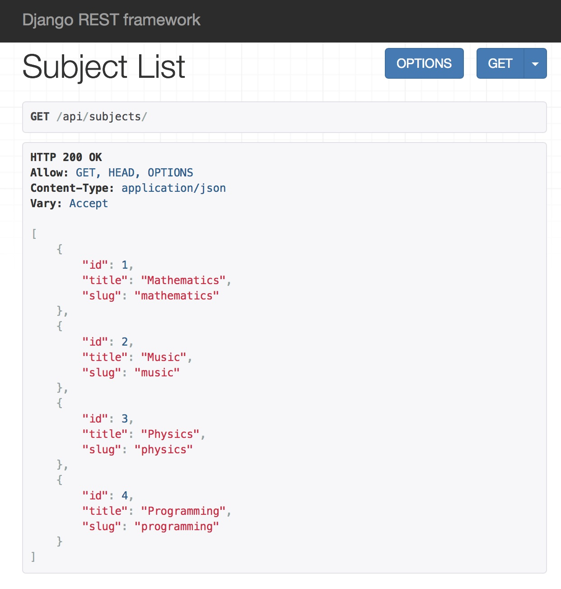

这个界面就是由之前提到的 `BrowsableAPIRenderer` 渲染器提供的。页面内显示了结果的头部信息及 API 的返回信息。还可以通过在 URL 中包含具体的 ID 来获取一个 `Subject` 对象，访问 http://127.0.0.1:8000/api/subjects/1/ ，可以发现页面只展示了一个单独的 JSON 格式的对象数据。

### 创建嵌套的序列化器

我们再为 `Course` 模型创建一个序列化器，打开 `courses/api/serializers.py` 继续编辑：

```python
from ..models import Course

class CourseSerializer(serializers.ModelSerializer):
    class Meta:
        model = Course
        fields = ['id', 'subject', 'title', 'slug', 'overview', 'created', 'owner', 'modules']
```

之后看一下 `Course` 序列化器是如何工作的，进入 Python 命令行模式输入下列命令：

```bash
>>> from rest_framework.renderers import JSONRenderer
>>> from courses.models import Course
>>> from courses.api.serializers import CourseSerializer
>>> course = Course.objects.latest('id')
>>> serializer = CourseSerializer(course)
>>> JSONRenderer().render(serializer.data)
```

这个时候可以看到查询结果里，该课程包含的模块是一个主键列表的形式，类似这样：

```bash
"modules": [6, 7, 9, 10]
```

这样的数据意义不大，我们想在结果里包含每个 `Module` 的更多信息，所以还必须给 `Module` 模型也制作一个序列化器，编辑 `serializers.py`，修改成如下：

```python
from rest_framework import serializers
from ..models import Module

class ModuleSerializer(serializers.ModelSerializer):
    class Meta:
        model = Module
        fields = ['order','title','description']


class CourseSerializer(serializers.ModelSerializer):
    modules = ModuleSerializer(many=True, read_only=True)
    class Meta:
        model = Course
        fields = ['id', 'subject', 'title', 'slug', 'overview', 'created', 'owner', 'modules']
```

首先为 `Module` 模型制作了一个序列化器，然后给 `CourseSerializer` 增加了一个 `modules` 属性，设置为 `Module` 类的序列化器，`many=True` 表示需要序列化多个对象，`read_only` 参数表示这个字段是只读的，不应该被包含在任何需要进行增删改的字段中。

重新启动 Python 命令行模式，再执行一遍上边 Python 命令行代码，使用 `JSONRenderer` 渲染序列化器实例的 data 属性，可以看到结果中关于 `modules` 的部分被嵌套的 `ModuleSerializer` 序列化成下面这样：

```bash
"modules": [
    {
        "order": 0,
        "title": "Introduction to overview",
        "description": "A brief overview about the Web Framework."
    },
    {
        "order": 1,
        "title": "Configuring Django",
        "description": "How to install Django."
    },
    ...
]
```

这样就完成了嵌套序列化的工作，关于序列化器的更多信息可以看 https://www.django-rest-framework.org/api-guide/serializers/ 。

### 创建自定义 API 视图

REST 框架提供了一个 `APIView` 视图，基于 Django 内置的 View 视图基础上增加了 RESTful API 的功能，但与 View 不同的是，`APIView` 采用了 REST 框架自定义的处理 `Request` 和 `Response` 对象的方法，并且在返回 HTTP 响应的时候处理 `APIException` 错误，而且还包含内建的认证系统来管理对视图的访问。

下边通过 `APIView` 来创建一个视图供用户选课，编辑 `courses` 应用的 `api/views.py` 文件，增加如下代码：

```python
from django.shortcuts import get_object_or_404
from rest_framework.views import APIView
from rest_framework.response import Response
from ..models import Course

class CourseEnrollView(APIView):
    def post(self, request, pk, format=None):
        course = get_object_or_404(Course, pk=pk)
        course.students.add(request.user)
        return Response({'enrolled': True})
```

这个 `CourseEnrollView` 视图管理用户选课的功能。代码解释如下:

1. 创建一个视图继承 `APIView`。
1. 在其中定义了 `post()` 方法用于处理 POST 请求，这个类不需要处理其他类型的 HTTP 请求。
1. 这个类需要接收一个 `pk` 参数，为课程的主键 `id`，用于取得该课程对象。如果找不到就返回 404 错误。
1. 添加当前用户与 `Course` 对象的多对多关系，即选课。

编辑 `api/urls.py` 文件，为新的视图配置 URL：

```python
    path('courses/<pk>/enroll/', views.CourseEnrollView.as_view(), name='course_enroll'),
```

现在理论上我们就可以发送一个 POST 请求来选课，而无需在页面中点击按钮。然而这么做需要区分用户身份，避免未认证的用户也来发送 POST 请求。下一节来看看 API 认证与权限管理是如何工作的。

### 处理身份认证

REST 框架提供了一个认证类，用于鉴别提交 HTTP 请求的用户身份。如果认证通过，REST 框架会在 `request.user` 中设置认证后的 `User` 对象，如果没有用户通过认证，则 `request` 被设置一个 Django 内置的 `AnonymousUser` 对象。

REST 框架提供如下的认证后端：

- `BasicAuthentication`：这是基础的 HTTP 认证（BA 认证），用户和密码存放在 HTTP 请求头的 `Authorization` 头部数据中，以 `Base64` 格式发送。关于 BA 认证的具体内容看这里。
- `TokenAuthentication`：这是基于 `token` 的认证，一个 `Token` 模型用于存放用户的 `token`，HTTP 请求头中的 `Authorization` 信息中存储 `token` 数据用于验证。
- `SessionAuthentication`：使用 Django 的 `session` 后端进行验证，对于前端发来的 AJAX 请求一般使用该方式验证。
- `RemoteUserAuthentication`：允许使用 web 服务器代理认证，会设置一个 `REMOTE_USER` 变量。

除此之外，还可以继承 REST 框架提供的 `BaseAuthentication` 类并且重写 `authenticate()` 方法来创建自定义的验证后端。

通过 `DEFAULT_AUTHENTICATION_CLASSES` 还可以设置认证是基于每个视图的，还是全局认证。

认证（Authentication）只解决用户身份的问题，即识别发请求的用户身份，但不会允许或阻止用户访问视图，必须通过设置用户权限来限制访问视图。

在 https://www.django-rest-framework.org/api-guide/authentication/ 可以找到所有认证相关的文档。

在视图中增加 `BasicAuthentication` 类，编辑 `api/views.py` 文件，为 `CourseEnrollView` 添加一行：

```python
from rest_framework.authentication import BasicAuthentication

class CourseEnrollView(APIView):
    authentication_classes = (BasicAuthentication,)
    # ......
```

现在视图就可以通过 HTTP 请求头的 `Authorization` 头部信息进行用户身份认证了。

### 为视图增加权限控制

REST 框架提供了一个权限系统用于控制对视图的访问。REST 框架内建的部分权限有：

- `AllowAny`：完全开放权限，不管用户认证与否，都不做任何限制。
- `IsAuthenticated`：仅允许通过认证的用户。
- `IsAuthenticatedOrReadOnly`：认证用户具有完整权限，匿名用户只读（只能使用 GET，HEAD，OPTIONS 三种 HTTP 请求种类）。
- `DjangoModelPermissions`：使用 `django.contrib.auth` 的权限管理系统。视图需要一个 `queryset` 属性，只有认证的用户加上具备访问某个数据类的权限才能够进行操作
- `DjangoObjectPermissions`：也使用 Django 权限，是基于每个对象的单独权限设置。

如果用户因为权限问题操作失败，则通常会得到下列 HTTP 响应码和错误信息：

- HTTP 401: Unauthorized
- HTTP 403：Permission denied

可以在 https://www.django-rest-framework.org/api-guide/permissions/ 中找到更多关于权限的信息。

继续编辑 `api/views.py` 文件，为 `CourseEnrollView` 添加一个属性 `permission_classes`：

```python
from rest_framework.authentication import BasicAuthentication
from rest_framework.permissions import IsAuthenticated

class CourseEnrollView(APIView):
    authentication_classes = (BasicAuthentication,)
    permission_classes = (IsAuthenticated,)
    # ......
```

我们为视图加上了 `IsAuthenticated` 权限，意味着只有认证用户可以访问该视图。现在可以尝试给这个视图发一个 POST 请求。

启动站点，然后在系统命令行里输入下列命令：

```bash
$ curl -i -X POST http://127.0.0.1:8000/api/courses/1/enroll/
HTTP/1.1 401 Unauthorized
......
{"detail":"Authentication credentials were not provided."}
```

结果得到了 401 响应，因为我们没有认证过。现在我们为请求头增加一个已经注册的用户的认证信息，将下列代码中的 `student:password` 替换成你网站中的实际用户名和密码，然后执行命令：

```bash
curl -i -X POST -u student:password http://127.0.0.1:8000/api/courses/1/enroll/
HTTP/1.1 200 OK
......
{"enrolled":true}
```

现在可以到管理后台查看数据库是否已经更新了该用户选课的数据。

### 创建视图集和路由

视图集 `Viewsets` 允许对 API 定义一系列的交互动作，并允许 REST 框架使用一个 `Router` 对象动态的建立 URL。通过使用视图集，可以避免重复编写视图逻辑。REST 框架中的视图集涵盖的经典的增删改查动作，包括 `list()`, `create()`, `retrieve()`, `update()`, `partial_update()` 和 `destroy()`。

为 `Course` 模型创建一个视图集，编辑 `api/views.py` 文件，增加如下代码：

```python
from rest_framework import viewsets
from .serializers import CourseSerializer

class CourseViewSet(viewsets.ReadOnlyModelViewSet):
    queryset = Course.objects.all()
    serializer_class = CourseSerializer
```

创建了一个视图集并继承了 `ReadOnlyModelViewSet`，`ReadOnlyModelViewSet` 提供了只读的 `list()` 和 `retrieve()` 方法，可以返回一个对象集合或者单个对象。编辑 `api/urls.py`，为视图集配置 URL：

```python
from django.urls import path, include
from rest_framework import routers
from . import views

router = routers.DefaultRouter()
router.register('courses', views.CourseViewSet)


urlpatterns = [
    # ......
    path('', include(router.urls)),
]
```

建立了一个默认的路由对象 `DefaultRouter()`，然后将 `CourseViewSet` 视图注册到路由中，使用了前缀 `courses`，现在这个 `router` 对象就可以为视图集动态的生成 URL。

打开 http://127.0.0.1:8000/api/ ，可以看到如下页面：

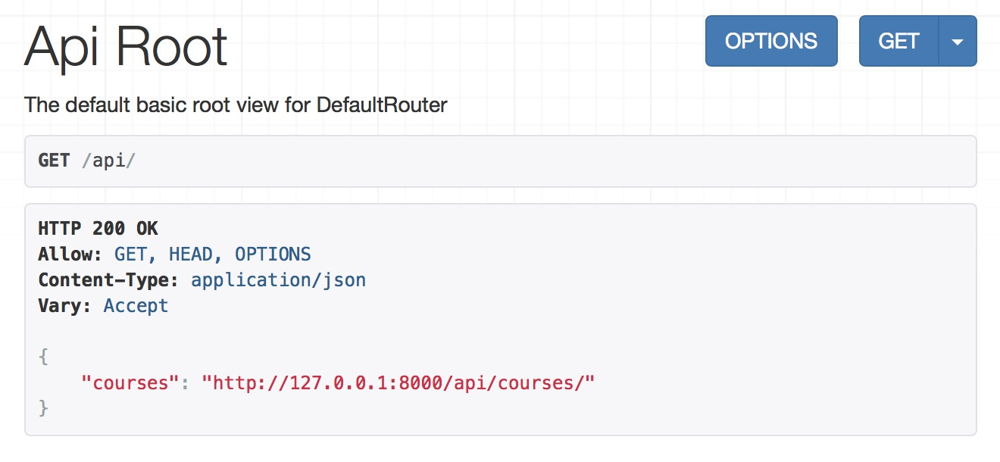

这个时候可以访问 http://127.0.0.1:8000/api/courses/ ，就可以得到 JSON 格式的课程列表。这个路径中的 `/courses/` 就是注册路由的时候使用的前缀 `courses`。

视图集的详细使用可以看 https://www.django-rest-framework.org/api-guide/viewsets/，路由的使用方法可以参考https://www.django-rest-framework.org/api-guide/routers/。

### 为视图集添加额外功能

可以为视图集添加额外功能。让我们来把 `CourseEnrollView` 变成一个自定义的视图集。编辑 `api/views.py` 文件，修改 `CourseViewSet` 为下面这样：

```python
from rest_framework.decorators import detail_route

class CourseViewSet(viewsets.ReadOnlyModelViewSet):
    queryset = Course.objects.all()
    serializer_class = CourseSerializer

    @detail_route(methods=['post'], authentication_classes=[BasicAuthentication], permission_classes=[IsAuthenticated])
    def enroll(self, request, *args, **kwargs):
        course = self.get_object()
        course.students.add(request.user)
        return Response({'enrolled': True})
```

为视图集增加了一个自定义的方法 `enroll()`，代表为视图集增加的新功能，解释如下：

1. 使用 `detail_router` 装饰器，定义了这是一个在单个对象上执行的功能。
1. 这个装饰器同时还允许添加参数，`methods` 设置为 `['post']` 表示该视图只接受 POST 请求，然后还设置了验证和权限。
1. 使用 `self.get_object()` 获取当前的 `Course` 对象。
1. 把当前的用户增加到多对多关系中（选课），返回一个自定义的成功响应。

然后编辑 `api/urls.py` 文件，去掉下边这一行，因为通过 `@detail_route` 动态配置了新的路由，这一行无需再用：

```python
    path('courses/<pk>/enroll/', views.CourseEnrollView.as_view(), name='course_enroll'),
```

然后编辑 `api/views.py`，删除 `CourseEnrollView`，因为这个类的功能现在成为视图集的一部分。

现在选课功能的 URL 由 `router` 自动生成，实际的 URL 与刚才相同，因为使用了我们自定义的函数名称 `enroll`。

### 自定义权限

我们希望只有选了某课程的学生用户才可以访问该课程的全部内容。最好的方式就是自定义一个权限，REST 框架（原书为 Django，应该为 REST）提供了一个 `BasePermission` 类允许重写下列方法：

- `has_permission()`：视图级别的权限检查。
- `has_object_permission()`：对象级别的权限检查。

这两个方法必须返回 `True` 表示具有权限或 `False` 表示不具有权限。在 `courses/api/` 目录下新建 `permissions.py` 文件，添加下列代码：

```python
from rest_framework.permissions import BasePermission

class IsEnrolled(BasePermission):
    def has_object_permission(self, request, view, obj):
        return obj.students.filter(id=request.user.id).exists()
```

这个 `IsEnrolled` 权限继承了 `BasePermission` 类然后重写了 `has_object_permission` 方法。由于这个方法是基于对象的，所以 `obj` 就是当前的课程。检查当前用户是否在已经选该课的所有用户里。之后就可以使用该权限类了。

### 序列化课程内容

现在已经把主题，课程和章节都序列化了。还必须序列化内容。`Content` 模型有一个通用外键关系，可以用于检索所有内容模型。而且我们还为所有内容模型添加了 `render()` 方法。可以使用这些关系和方法，来实现序列化。

编辑 `api/serializers.py` 文件，添加下列代码：

```python
from ..models import Content

class ItemRelatedField(serializers.RelatedField):
    def to_representation(self, value):
        return value.render()


class ContentSerializer(serializers.ModelSerializer):
    item = ItemRelatedField(read_only=True)

    class Meta:
        model = Content
        fields = ['order', 'item']
```

在这段代码里，通过继承 `RelatedField` 定义了一个特别的字段 `ItemRelatedField`，然后重写了 `to_representation()` 方法。然后定义了内容序列化器 `ContentSerializer` 并且指定与原来通用外键同名的 `item` 属性为刚定义的 `ItemRelatedField` 字段。

我们还需要另外一个用于 `Module` 模型的序列化器，其中嵌套这个 `Content` 序列化器；还需要改造 `Course` 序列化器以让其也包含内容输出，编辑 `api/serializers.py` 文件添加下列代码：

```python
class ModuleWithContentsSerializer(serializers.ModelSerializer):
    contents = ContentSerializer(many=True)

    class Meta:
        model = Module
        fields = ['order', 'title', 'description', 'contents']


class CourseWithContentsSerializer(serializers.ModelSerializer):
    modules = ModuleWithContentsSerializer(many=True)

    class Meta:
        model = Course
        fields = ['id', 'subject', 'title', 'slug', 'overview', 'created', 'owner', 'modules']
```

这其实就是一层一层从内到外嵌套序列化器，由于已经定义了 `Content` 的序列化器，就建立一个外层的 `ModuleWithContent` 序列化器，其中设置 `contents` 字段为 `Content` 序列化器，再往上一层的 `CourseWithContent` 序列化器也是类似来嵌套 `ModuleWithContent`。

再建立一个视图，模仿刚才的 `retrieve()` 行为，但是采用新的序列化器，编辑 `api/views.py` 文件，给 `CourseViewSet` 视图集添加下列代码：

```python
from .permissions import IsEnrolled
from .serializers import CourseWithContentsSerializer

class CourseViewSet(viewsets.ReadOnlyModelViewSet):
    # ...
    @detail_route(methods=['get'],
              serializer_class=CourseWithContentsSerializer,
              authentication_classes=[BasicAuthentication],
              permission_classes=[IsAuthenticated, IsEnrolled])
    def contents(self, request, *args, **kwargs):
        return self.retrieve(request, *args, **kwargs)
```

这段代码解释如下：

1. 使用 `@detail_route` 装饰器来定义该方法是针对一个单独数据对象的。
1. 该方法只接受 GET 请求。
1. 使用了 `CourseWithContentsSerializer` 这个新的序列器，用于返回包含具体内容数据的序列化后输出。
1. 添加了用户认证 `IsAuthenticated` 和自定义权限 `IsEnrolled`。
1. 采用 `ReadOnlyModelViewSet` 提供的 `retrieve()` 方法来返回 `Course` 对象。

然后打开 http://127.0.0.1:8000/api/courses/1/contents/ 。如果你的当前用户选了对应的课程，就可以看到课程，章节和内容嵌套渲染后的字符串以 JSON 的形式显示出来，类似下边这样：

```bash
{
    "order": 0,
    "title": "Introduction to Django",
    "description": "Brief introduction to the Django Web Framework.",
    "contents": [
        {
            "order": 0,
            "item": "<p>Meet Django. Django is a high-level Python Web framework...</p>"
        },
        {
            "order": 1,
            "item": "\n<iframe width=\"480\" height=\"360\" src=\"http://www.youtube.com/embed/bgV39DlmZ2U?wmode=opaque frameborder=\"0\" allowfullscreen></iframe>\n"
        }
    ]
}
```

现在我们就建立了一个简单的符合 RESTful 风格的 API，让网站自动化向外部提供数据。REST 框架还可以使用 `ModelViewSet` 来创建和编辑数据对象。关于 REST 框架中的主要内容在本章都涉及到了，如果对于框架特性还需要详细了解，可以参考 REST 框架的官方文档： https://www.django-rest-framework.org/ 。

# 上线

在上一章，为其他程序与我们的 Web 应用交互创建了 RESTful API。本章将学习如何创建生产环境让我们的网站正式上线，主要内容有：

- 配置生产环境
- 创建自定义中间件
- 实现自定义管理命令

## 创建生产环境

现在该将 Django 项目正式部署到生产环境中了。我们将按照下列步骤将站点部署到生产环境中：

- 为生产环境配置项目设置。
- 使用 `PostgreSQL` 数据库。
- 使用 `uWSGI` 和 `NGINX` 建立 web 服务器。
- 管理静态资源。
- 使用 SSL 加强站点安全管理。

### 管理用于多个环境的配置

在实际的项目中，很可能要面对不同的环境。一般至少有一个本地开发环境和一个生产环境，也可能有其他环境比如测试环境，预上线环境等。对于不同的环境，有些设置是通用的，有些则因环境而异。让我们将项目设置为可以适合不同环境，又可以保证项目结构不会被改变。

在 `educa/educa/` 目录下建立 `settings` 包，与 `settings.py` 同级，将 `settings.py` 文件重命名为 `base.py` 然后移动到 `settings` 目录中来，再创建其他文件，`setting/` 目录如下所示：

```bash
settings/
    __init__.py
    base.py
    local.py
    pro.py
```

这些文件用途如下：

- `base.py`：基本的设置文件，包含通用的设置，是原来的 `settings.py`。
- `local.py`：本地环境的自定义设置。
- `pro.py`：生产环境的自定义设置。

编辑 `settings/base.py`，找到下列这行：

```python
BASE_DIR = os.path.dirname(os.path.dirname(os.path.abspath(__file__)))
```

将其替换成下边这行：

```python
BASE_DIR =
os.path.dirname(os.path.dirname(os.path.abspath(os.path.join(__file__, os.pardir))))
```

由于我们将 `settings.py` 文件又往下级目录放了一级，必须让 `BASE_DIR` 指向正确的路径，所以使用了 `os.pardir` 指向父目录，来让最后的路径依然是原来的项目根目录。

编辑 `settings/local.py`，添加下列代码：

```python
from .base import *

DEBUG = True
DATABASES = {
    'default': {
        'ENGINE': 'django.db.backends.sqlite3',
        'NAME': os.path.join(BASE_DIR, 'db.sqlite3'),
    }
}
```

这是代表我们本地环境的配置文件。在其中导入了所有 `base.py` 中的设置内容，然后写了 `DEBUG` 和 `DATABASES` 两个设置，这两个设置会覆盖原来 `base.py` 中的设置，成为本文件中的设置。由于 `DEBUG` 设置和 `DATABASES` 设置在每个配置文件中都会修改，也可以将这两个设置从 `base.py` 中删除。

再来编辑 `settings/pro.py`，如下所示：

```python
from .base import *

DEBUG = False
ADMINS = (
    ('Antonio M', 'email@mydomain.com'),
)
ALLOWED_HOSTS = ['*']
DATABASES = {
    'default': {
    }
}
```

这是生产环境的配置文件，来详细看一下其中的内容：

- `DEBUG`：设置 `DEBUG` 为 `False` 是生产环境的强制要求。如果不关闭，会将错误跟踪和敏感配置信息泄露给所有人。
- `ADMINS`：当 `DEBUG` 设置为 `False` 的时候，如果一个视图抛出异常，所有信息会以邮件形式发送到 `ADMINS` 配置中列出的所有人。需要将其中的信息改成自己的名字和邮箱（还需要配置 SMTP 服务器）。
- `ALLOWED_HOSTS`：Django 只会向这个设置中的地址或者主机名称提供 Web 服务。这是一个安全手段。我们使用了通配符 `*` 表示可以用于所有主机名称或者 IP 地址。在稍后的配置中会更详细的作出限制。
- `DATABASES`：生产环境的数据库设置，现在留空，后边会进行该设置。由于生产环境的数据库和非生产环境的数据库一般是隔离的，甚至生产环境数据库只有处于生产环境才能访问。所以该项需要单独配置。

在需要面对多种环境时，建立一个基础配置文件并为每种环境编写单独的配置文件。用于具体环境的配置文件继承基础配置并重写与环境相关的配置即可。

由于我们现在没有把配置文件放在原来 `settings.py` 所在的位置，所以无法运行 `manage.py`，必须为其指定 `settings` 模块的所在路径，即使用 `--settings` 参数或者设置环境变量 `DJANGO_SETTINGS_MODULE` 。

打开系统命令行窗口输入：

```bash
$ export DJANGO_SETTINGS_MODULE=educa.settings.pro
```

这条命令会为当前的会话窗口设置 `DJANGO_SETTINGS_MODULE` 环境变量。如果不想每次运行 shell 都执行一遍，可以把这条命令加入到 shell 配置文件如 `.bashrc` 或者 `.bash_profile` 中。

如果不想对系统进行任何设置，那么在启动站点的时候必须加上 `--settings` 参数，如下：

```bash
$ python manage.py migrate --settings=educa.settings.pro
```

现在我们就为多环境做好了基础设置。

### 使用 PostgreSQL 数据库

在整本书中，我们大部分都使用了 Python 自带的 SQLite 数据库，只要在博客全文检索的时候推荐使用了 PostgreSQL 数据库。SQLite 轻量而且易于使用，但对于生产环境而言太过简陋，必须需要一个更强力的数据库比如 PostgreSQL 和 MySQL 或者 Oracle。PostgreSQL 的安装在第三章中已经介绍过，不再赘述。

让我们为我们的应用创建一个 PostgreSQL 用户，打开系统命令行输入如下命令：

```bash
$ su postgres
$ createuser -dP educa
```

系统会提示输入用户密码和权限。输入密码并且给予用户权限，然后使用下列命令建立一个新的数据库：

```bash
$ createdb -E utf8 -U educa educa
```

这样就建立好了一个新的数据库并且将其分配给 `educa` 用户，之后编辑 `settings/pro.py`，修改数据库的设置如下：

```python
DATABASES = {
    'default': {
        'ENGINE': 'django.db.backends.postgresql',
        'NAME': 'educa',
        'USER': 'educa',
        'PASSWORD': '********',
    }
}
```

将密码部分替换成为 educa 用户设置的密码。由于新数据库是空的，运行：

```bash
$ python manage.py migrate
```

然后创建一个超级用户：

```bash
$ python manage.py createsuperuser
```

### 部署前检查

Django 提供了一个 `check` 命令，可以在任何时候检查项目。通常检查过程包括检查所有注册的应用，输出所有错误和警告信息。如果包含 `--deploy` 参数，还会额外执行针对生产环境的检查。

打开系统终端然后输入如下命令进行检查：

```bash
$ python manage.py check --deploy
```

译者注：作者这里遗漏了配置文件的路径，应该写成 `python manage.py check --deploy --settings=educa.settings.***` ，其中 `***` 为 `base`，`local` 或 `pro`。

如果站点编写正确的话，会看到没有错误输出，但是会有一些警告信息。这说明站点通过了检查，但这些警告信息应该得到处理，以让站点更加安全。本书不会深入这里的内容，但是要记得在正式部署之前一定要进行部署前检查。

### 通过 WSGI 程序提供 Django 服务

Django 的主要部署平台就是 WSGI，WSGI 是 Web Server Gateway Interface 的简称，是基于 Python 的程序提供 Web 服务的标准格式。由于 Django 也是 Python 程序，也需要通过 WSGI 对外提供服务。

当通过 `startproject` 命令新建一个项目的时候，Django 会在项目目录内新建一个 `wsgi.py`。这个文件包含了一个 WSGI 可调用函数，为我们的 Django 应用提供了一个接口。无论是我们之前采用本机 8000 端口的开发服务器，还是正式生产环境，都需要通过这个接口。关于 WSGI 的详细知识可以看 https://wsgi.readthedocs.io/en/latest/ 及 Python 的 PEP333 。

### 安装 WSGI

直到本节之前，我们的所有开发都是在 django 在本地环境运行的开发服务器上进行的。在生产环境中，需要一个真正的 web 服务器才能部署 django 服务。

`uWSGI` 是一个非常快的 Python 应用程序 WSGI 服务器，使用 WSGI 标准与 Python 应用进行通信。`uWSGI` 把 HTTP 请求翻译成 Django 程序能够处理的格式。

安装 `uSWGI`：

```python
pip install uwsgi
```

在 pip 安装之后，会 built uWSGI（编译安装），需要一个 C 编译器，比如 GCC 或者 clang，在 linux 环境下可以输入命令：apt-get install build-essential。

如果是 MacOS X，可以通过 Homebrew 安装，执行命令：brew install uwsgi。如果在 windows 下安装，需要 Cygwin https://www.cygwin.com 。推荐在基于 UNIX 的操作系统上安装 uWSGI。

UNIX 环境下如果看到 Successfully built uwsgi 就说明成功安装了 uWSGI。关于 uWSGI 的文档可以在https://uwsgi-docs.readthedocs.io/en/latest/找到。

### 配置 uWSGI

可以通过命令行配置 uWSGI，打开系统命令行模式，进入 `educa` 项目的根目录，然后输入：

```bash
$ sudo uwsgi --module=educa.wsgi:application --env=DJANGO_SETTINGS_MODULE=educa.settings.pro --master --pidfile=/tmp/project-master.pid --http=127.0.0.1:8000 --uid=1000 --virtualenv=/home/env/educa/
```

必须需要 su 权限才可以。通过这条命令，为本机上的 uWSGI 设置了如下的内容：

1. 使用 `educa.wsgi:application` 作为调用接口。
1. 载入生产环境的设置文件。
1. 使用 virtualenv 设置的虚拟环境，注意将 `/home/env/educa/` 替换为实际的虚拟环境所在路径。如果未使用虚拟环境，该配置可以不填。

如果不是在项目目录内执行的上述命令，需要额外加一个参数指定具体的项目目录 `--chdir=/path/to/educa/`，将其中的 `/path/to/educa/` 替换成 `educa` 的项目路径。

通过浏览器访问 http://127.0.0.1:8000/ （无需启动 django 服务），可以看到站点内容显示了出来，但没有任何 CSS 样式，也无法显示图片，这是因为还没有配置 uWSGI 来提供静态文件服务。

uWSGI 允许使用一个 `.ini` 配置文件进行自定义配置，比使用命令行要方便很多。在 `educa` 项目根目录下建立：

```bash
config/
    uwsgi.ini
```

编辑 `uwsgi.ini`，添加如下代码：

```bash
[uwsgi]
# variables
projectname = educa
base = /home/projects/educa

# configuration
master = true
virtualenv = /home/env/%(projectname)
pythonpath = %(base)
chdir = %(base)
env = DJANGO_SETTINGS_MODULE=%(projectname).settings.pro
module = educa.wsgi:application
socket = /tmp/%(projectname).sock
```

在这个 `.ini` 文件里我们定义了两个变量：

- `projectname`：Django 项目的名称，是 `educa`。
- `base`：`educa` 项目的绝对路径，将其替换成实际项目路径。

上边定义的这两个变量是自定义变量，还可以定义任意其他变量，只要不和内置的名称冲突。接下来是具体设置的解释：

- `master`：表示启用主进程。
- `virtualenv`：虚拟环境地址，将其替换成实际的路径所在（不包含 bin/activate)。
- `pythonpath`：加入到 Python PATH 中的地址，一般就是项目的根目录。
- `chdir`：项目的实际地址，uWSGI 会在加载应用之前将工作目录变更到这个路径。
- `env`：环境变量，设置为 DJANGO_SETTINGS_MODULE，具体路径指向生产环境的配置文件。
- `module`：要使用的 WSGI 模块，指向项目中的 wsgi.py 中的调用函数。application 是该函数在项目中默认的命名。
- `socket`：绑定该服务的套接字。（是一个文件套接字，用于与 NGINX 通信）。

其中的 `socket` 套接字是用于和第三方路由软件进行通信，比如 NGINX。命令行模式中我们使用的 `--http 127.0.0.1:8000` 指的是让 uWSGI 自己接受 HTTP 请求并自己负责路由这些请求。我们需要把 uWSGI 作为 `socket` 启动（在 `.ini` 文件设置中并没有设置 `--http` 参数），因为我们要使用 NGINX 作为我们的 web 服务器，NGINX 通过刚才设置的文件套接字与 uWSGI 进行通信。

关于 uWSGI 的详细设置可以看 https://uwsgi-docs.readthedocs.io/en/latest/Options.html 。

现在可以通过使用配置文件来启动 uWSGI（先关闭原来运行的 uWSGI 服务）：

```bash
$ uwsgi --ini config/uwsgi.ini
```

这样运行之后，可以发现暂时无法通过浏览器访问 http://127.0.0.1:8000/ ，因为此时 uWSGI 监听文件套接字而不是 HTTP 端口，我们还需要继续完善生产环境配置。

### 配置 uWSGI

当启动一个 Web 服务的时候，很显然必须提供动态的内容服务，但也需要静态的文件服务，比如 CSS，JavaScript 文件，图像等。如果用 uWSGI 来管理静态文件，会为 HTTP 请求增加不必要的开销，所以最好在 uWSGI 之前加一个 Web 服务，比如 NGINX。

NGINX 是一个高并发，低内存占用的 Web 服务端，也具有反向代理功能，即接受一个 HTTP 请求，然后把这个请求路由给不同的后端。通常来说，你需要一个 web 服务端如 NGINX，用于快速高效的提供静态文件，然后把动态的请求转发给 uWSGI。通过使用 NGINX，还可以设置其反向代理功能从而更好的提供 web 服务。

安装 NGINX 可以使用下列命令：

```bash
sudo apt-get install nginx
```

如果使用 MacOS X，可以通过 brew install nginx 来安装。Windows 下的 NGINX 可以通过 https://nginx.org/en/download.html 下载。

译者注：安装 NGINX 后不会立刻启动，译者使用的 Centos 7.5 1804 还需要启动 NGINX 服务和开机启动：

```bash
systemctl start nginx.service
systemctl enable nginx.service
```

正常情况下在启动 NGINX 之后，直接访问本机 IP 地址，可以看到 NGINX 欢迎页面，表示基础配置成功运行，之后可以先停用 NGINX 服务，以配置生产环境。

### 生产环境

下面的图表示了我们最终配置的生产环境的结构：

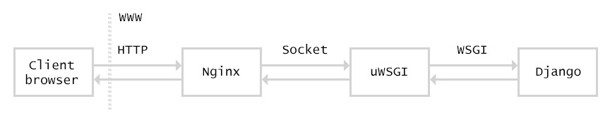

当一个浏览器发起一个 HTTP 请求的时候，发生如下事情：

1. NGINX 接收 HTTP 请求
1. 如果请求静态文件，NGINX 直接提供服务。如果请求动态页面，NGINX 通过 SOCKET 与 uWSGI 通信，将请求转交给 uWSGI 处理
1. uWSGI 将请求转交给 Django 后端进行处理，返回的响应被传递给 NGINX，NGINX 再发回给浏览器。

### 配置 NGINX

在 config/目录下创建 nginx.conf 文件，在其中添加如下代码：

```bash
# the upstream component nginx needs to connect to
upstream educa {
    server unix:///tmp/educa.sock;
}
server {
    listen 80;
    server_name www.educaproject.com educaproject.com;
    location / {
        include /etc/nginx/uwsgi_params;
        uwsgi_pass educa;
    }
}
```

这是 NGINX 的基础配置。我们建立了一个 `upstream` 名叫 `educa`，指定了 uWSGI 使用的 `socket` 名称 ，然后使用 `server` 指令，其中的设置有：

1. listen 80 表示让 NGINX 监听 80 端口。
1. 设置主机名为 www.educaproject.com 和 educaproject.com ，NGINX会为这两个主机地址提供服务。
1. 配置 `location` 参数，将所有在 `'/'` 路径下的 URL 转发给上边的 upstream educa，也就是 uWSGI 的 socket 进行处理。还把 NGINX 自带的关于和 uwsgi 协同工作的参数设置也包含进去。

NGINX 还有很多复杂的设置，文档可以参考 https://nginx.org/en/docs/ 。

NGINX 主要的设置文件位于 `/etc/nginx/nginx.conf`，该文件包含 `/etc/nginx/sites-enabled/` 下的所有配置文件。为了让 NGINX 使用我们刚才编写的配置文件，打开系统命令行窗口建立一个软连接：

```bash
sudo ln -s /home/projects/educa/config/nginx.conf /etc/nginx/sites-enabled/educa.conf
```

将其中的 `/home/projects/educa/` 替换成实际的绝对路径。注意，这里如果没有 `/sites-enabled/` 目录，要先手工建立。

如果还没有运行 uWSGI，打开系统命令行窗口，在 `educa` 项目根目录先运行 uWSGI：

```bash
$ uwsgi --ini config/uwsgi.ini
```

当前窗口会被 uWSGI 占用，再开一个命令行窗口，然后执行：

```bash
$ service nginx start
```

由于我们使用了自定义的域名，还必须修改 `/etc/hosts`，添加如下两行：

```
127.0.0.1 educaproject.com
127.0.0.1 www.educaproject.com
```

这样我们就把这两个域名都路由到本地回环地址上，由于我们是从本机访问本机，所以要更改 HOSTS，实际生产环境不必做本步修改，因为生产环境会有固定的 IP，域名和对应的 DNS 解析。

打开浏览器，输入 http://educaproject.com/ ，应该可以看到站点了，但是所有的静态文件依然没有被加载，没关系，即将完成生产环境的配置。

如果系统是 Centos 7，这里显示 502 错误，查看 `/var/log/nginx/error.log`，如果其中的错误是 `[crit] 4036#4036: *1 connect() to unix:///tmp/educa.sock failed (13: Permission denied)`，就先执行 `/usr/sbin/sestatus` 查看 SELINUX 的状态，如果为开启，就编辑 SELINUX 的设置，将其关闭，如下：

```bash
vi /etc/selinux/config

#SELINUX=enforcing
SELINUX=disabled
```

之后 reboot 重启系统才行。之后应该就可以正常显示站点了。

之后为了安全起见，到 `settings/pro.py` 中，修改 `ALLOWED_HOSTS` 设置为 NGINX 配置文件中的两个域名：

```python
ALLOWED_HOSTS = ['educaproject.com', 'www.educaproject.com']
```

现在 Django 就只为这两个主机名提供服务了。关于 `ALLOWED_HOSTS` 的更多信息可以看 https://docs.djangoproject.com/zh-hans/4.2/ref/settings/#allowed-hosts 。

### 让 NGINX 提供静态文件和媒体资源服务

NGINX 提供静态文件的速度很快。刚才我们把所有的地址转发，都交给了 uWSGI，现在要将所有的静态文件通过 NGINX 提供服务，对于我们站点来说，就是把所有的 CSS JS 文件和用户上传的媒体文件都交给 NGINX 来代理。

编辑 `settings/base.py`，增加下边一行：

```python
STATIC_ROOT = os.path.join(BASE_DIR, 'static/')
```

这行表示存放站点静态文件的地址，还记得之前学习过使用 `python manage.py collectstatic` 吗？现在就需要将所有的静态文件收集过来放在此目录中，在命令行中输入：

```bash
$ python manage.py collectstatic --settings=educa.settings.pro
160 static files copied to '/educa/static'.
```

静态文件目录设置好了，现在需要将这个目录设置到 NGINX 中，编辑 `config/nginx.conf`，在 `server` 指令后的大括号中增加下列内容：

```
location /static/ {
    alias /home/projects/educa/static/;
}
location /media/ {
    alias /home/projects/educa/media/;
}
```

将其中的 `/home/projects/educa/static/` 和 `/home/projects/educa/media/` 替换成你项目的实际 `static` 和 `media` 目录的绝对路径。这两个参数解释如下：

- `/static/`：这个路径是 Django 中设置的 `STATIC_URL`，表示当 NGINX 看到 `/static/` 的路径请求的时候，就到这个设置对应的路径中寻找所需文件。
- `/media/`：这个路径是 Django 中设置的 `MEDIA_URL` 路径，表示当 NGINX 看到 `/media/` 的路径请求的时候，就到这个设置对应的路径中寻找所需文件。

重新启动 NGINX 服务，以便让配置文件生效：

```bash
$ service nginx reload
```

在浏览器中打开 http://educaproject.com/ ，现在可以看到整个站点包含静态资源都正确的显示了。对于站点的静态文件请求，NGINX 将绕开 uWSGI，把文件直接返回给浏览器。

现在生产环境就初步配置完毕。整个站点现在可以说运行在生产环境之下了。

### 使用 SSL 安全连接

在配置完初步的生产环境之后，下一个话题是站点的安全性。Secure Sockets Layer 现在逐渐成为提供 Web 安全连接服务的规范。强烈建议对于正式的网站使用 HTTPS 协议，现在就在 NGINX 中配置 SSL 认证来让站点变得更加安全。

#### 创建一个 SSL 认证

在 `educa` 项目根目录下建立一个 ssl 目录，然后通过 `openssl` 生成我们的 SSL 证书：

```bash
$ sudo openssl req -x509 -nodes -days 365 -newkey rsa:2048 -keyout ssl/educa.key -out ssl/educa.crt
```

用这条命令生成一个 365 天有效的 2048 位的 SSL 证书，然后系统会提示输入一些信息：

```bash
Country Name (2 letter code) [AU]:
State or Province Name (full name) [Some-State]:
Locality Name (eg, city) []:
Organization Name (eg, company) [Internet Widgits Pty Ltd]:
Organizational Unit Name (eg, section) []:
Common Name (e.g. server FQDN or YOUR name) []: educaproject.com
Email Address []: email@domain.com
```

这其中最关键的是 Common Name，必须将主机域名名称输入：这里使用 educaproject.com

之后会在 `ssl/` 目录下生成两个文件，`educa.key` 是私钥，`educa.crt` 是实际的 SSL 证书。

#### 配置 NGINX 使用 SSL

编辑 `config/nginx.conf`，在 `server` 设置中加入下列内容：

```
server {
listen 80;
listen 443 ssl;
ssl_certificate /home/projects/educa/ssl/educa.crt;
ssl_certificate_key /home/projects/educa/ssl/educa.key;
server_name www.educaproject.com educaproject.com;
# ...
}
```

将其中的路径都修改为 SSL 证书所在的实际绝对路径。

这么设置之后，NGINX 将同时监听 80 端口（HTTP 协议）和 443 端口（HTTPS 协议），然后指定了 SSL 的验证信息 `ssl_certificate` 与对应的密钥 `ssl_certificate_key`。

现在重新启动 NGINX 服务，访问 https://educaproject.com/ ，会看到类似如下提示：

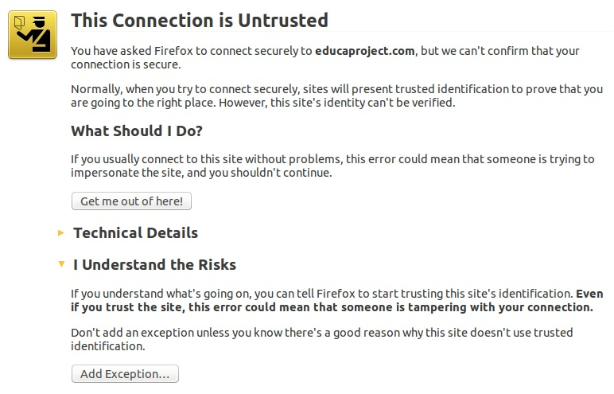

这个提示因浏览器而异。意思是警告当前站点并没有使用一个值得信任的验证方式，浏览器无法确定该站点安全与否。这是因为我们使用的 SSL 证书是由我们自行签发的，而不是从一个受信任的机构（Certification Authority）获得的证书。当我们有了实际的公开域名之后，就可以向一个受信任的证书颁发机构申请一个 SSL 证书，这样浏览器就能识别该站点的 HTTPS 认证。

如果想为实际的站点申请证书，可以使用 Linux 基金会 Linux Foundation 的 Let's Encrypt 项目。这是一个致力于免费获得和更新 SSL 证书的计划，该计划的站点在 https://letsencrypt.org/ 。

点击 "Add Exception" 按钮可以让浏览器知道可以信任该站点，这时浏览器的显示可能如下：

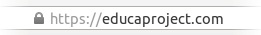

点击小锁按钮，就可以看到 SSL 的详细信息。

译者注：这里也因浏览器而异，有的浏览器依旧会提示证书不可信或者存在问题，毕竟这个证书是我们自行签发的。

#### 配置 Django 使用 SSL

Django 也有针对 SSL 的配置，编辑 `settings/pro.py`，增加下边的代码：

```python
SECURE_SSL_REDIRECT = True
CSRF_COOKIE_SECURE = True
```

这两个设置的含义如下：

- `SECURE_SSL_REDIRECT`：是否所有的 HTTP 请求都必须被重定向到 HTTPS。
- `CSRF_COOKIE_SECURE`：是否建立加密 cookie 防止 CSRF 攻击。

现在我们就配置好了一个高效的提供 Web 服务的生产环境。

## 自定义中间件

在之前我们已经了解了中间件 `MIDDLEWARE` 的设置，该设置包含项目中所有使用到的中间件。关于中间件，可以认为其是一个底层的插件系统，为在请求/响应的过程中提供钩子。每一个中间件都负责一个特定的行为，会在 HTTP 请求和响应的过程中得到执行。

注意不要添加开销非常大的中间件，因为中间件会在项目的所有请求和响应的过程中被执行。

当一个 HTTP 请求进来的时候，中间件会按照其在 `MIDDLEWARE` 设置中从上到下的顺序执行，当 HTTP 响应被生成且发送的过程中，中间件会按照设置中从下到上的顺序执行。

一个符合标准的函数可以作为一个中间件被注册在 `settings.py` 中。类似下边的函数就可以作为一个中间件：

```python


def my_middleware(get_response):
    def middleware(request):
        # 对于每个HTTP请求，在视图和之后的中间件执行之前执行的代码
        response = get_response(request)
        # 对于每个HTTP请求和响应，在视图执行之后执行的代码
        return response
    return middleware
```

一个中间件工厂函数接受一个 `get_response` 可调用对象，然后返回一个中间件函数。一个中间件接受一个请求然后返回一个响应，类似于视图。这里的 `get_response` 可以是下一个中间件，如果自己就是中间件列表中的最后一个，也可以是一个视图名称。

如果任何一个中间件在尚未调用 `get_response` 这个可调用对象之前就返回了一个响应，这个时候就会短路整个中间件链条的处理：其后的中间件不再被执行，这个响应开始从同级的中间件向上返回。

所以 `MIDDLEWARE` 设置中的中间件顺序非常重要，因为中间件依赖于上下中间件的数据进行工作。

在向 `MIDDLEWARE` 中添加一个中间件时必须注意将其放置在正确的位置，反复强调，中间件在 HTTP 请求进来的时候从上到下执行，HTTP 响应发出的时候从下到上执行。

原书在这里只是比较简单的说了一下执行顺序，详细的中间件执行顺序请参考 Django 进阶-中间件以及 https://docs.djangoproject.com/zh-hans/4.2/topics/http/middleware/ 。

### 创建二级域名中间件

我们来创建一个自定义中间件，用于通过一个自定义的二级域名来访问课程资源。例如：某个显示课程的 URL： https://educaproject.com/course/django/ ，可以通过一个二级域名 django.educaproject.com 来访问。这样用户就可以使用二级域名作为快捷方式快速访问课程，也比较容易记忆该路径。所有发往这个二级域名的请求，都会被重定向到实际的 educaproject.com/course/django/ 这个URL。

与视图，模型，表单等组件一样，中间件也可以写在项目的任何位置。推荐在应用目录内建立 `middleware.py` 文件来编写中间件。

在 `courses` 应用目录内创建 `middleware.py` 文件，并编写如下代码：

```python
from django.urls import reverse
from django.shortcuts import get_object_or_404, redirect
from .models import Course

def subdomain_course_middleware(get_response):
    """
    为课程提供二级域名
    """

    def middleware(request):
        host_parts = request.get_host().split('.')
        if len(host_parts) > 2 and host_parts[0] != 'www':
            # 通过指定的二级域名查询课程对象
            course = get_object_or_404(Course, slug=host_parts[0])
            course_url = reverse('course_detail', args=[course.slug])
            # 将二级域名请求重定向至实际的URL
            url = '{}://{}{}'.format(request.scheme, '.'.join(host_parts[1:]), course_url)
            return redirect(url)
        response = get_response(request)
        return response
    return middleware
```

当一个 HTTP 请求进来的时候，这个中间件执行如下任务：

1. 取得这个 HTTP 请求中的域名，然后将其分割成几部分；例如 `mycourse.educaproject.com` 会被分割得到一个列表 `['mycourse', 'educaproject', 'com']`。
1. 检查这个域名是否包含二级域名，判断分割后的域名是否包含多于 2 个元素。如果包含，就取出第一个元素也就是二级域名，如果这个域名不是 www，那就通过根据 slug 查询并取得该课程对象。
1. 如果找不到对应的课程，就返回 404 错误；如果找到了，就重定向到课程对象对应的规范化 URL。

编辑 `settings/base.py`，把自定义中间件添加到 `MIDDLEWARE` 设置中：

```python
MIDDLEWARE = [
    # ......
    'courses.middleware.subdomain_course_middleware',
]
```

还需要看一下 `ALLOWED_HOSTS` 中的域名设置，这里我们将其设置为可以是任何 `eduproject.com` 的二级域名：

```python
ALLOWED_HOSTS = ['.educaproject.com']
```

`ALLOWED_HOSTS` 中以一个 `.` 开始的域名，例如 `.educaproject.com`，会匹配 `educaproject.com` 及所有的 `educaproject.com` 的二级域名，比如 `course.educaproject.com` 和 `django.educaproject.com`。

### 配置 NGINX 的二级域名

编辑 `config/nginx.conf`，将以下这行：

```
server_name www.educaproject.com educaproject.com;
```

修改成：

```
server_name *.educaproject.com educaproject.com;
```

通过增加通配符设置，让 NGINX 也可以代理所有的二级域名，为了测试中间件，还必须在 `etc/hosts` 中配置相关内容，比如如果要测试二级域名 `django.educaproject.com`，需要增加一行：

```
127.0.0.1 django.educaproject.com
```

然后启动站点到 https://django.educaproject.com/ ，可以发现中间件现在将其重定向到 https://educaproject.com/course/django/ 。

## 实现自定义的管理命令

Django 允许应用向 `manage.py` 管理工具中注册自定义的管理命令。所谓管理命令就是通过 `manage.py` 使用的指令，例如，我们曾经使用在第 9 章使用过 `makemessages` 和 `compilemessages` 命令。

一个管理命令由一个 Python 模块组成，这个模块里包含一个 `Command` 类，这个 `Command` 类继承 `django.core.management.base.BaseCommand` 或者 `BaseCommand` 的子类。我们可以创建一个简单的包含参数和选项的自定义命令。

对于每个在 `INSTALLED_APPS` 内注册的应用，Django 会在应用目录下边的 `management/commands/` 目录下搜索管理命令，搜索到的每个命令模块，都会被注册成为一个同名的命令。

更多自定义管理命令的信息可以查看 https://docs.djangoproject.com/zh-hans/4.2/howto/custom-management-commands/。

我们准备来创建一个提醒学生至少选一个课程的命令。这个命令会向所有已经注册超过一定时间，但还没有选任何一门课程的学生发送一封邮件。

在 `student` 应用下建立如下的目录和文件结构：

```bash
management/
    __init__.py
    commands/
        __init__.py
        enroll_reminder.py
```

编辑 `enroll_reminder.py`，添加下列代码：

```bash
import datetime
from django.conf import settings
from django.core.management.base import BaseCommand
from django.core.mail import send_mass_mail
from django.contrib.auth.models import User
from django.db.models import Count

class Command(BaseCommand):
    help = 'Sends an e-mail reminder to users registered more than N days that are not enrolled into any courses yet'

def add_arguments(self, parser):
    parser.add_argument('--days', dest='days', type=int)

def handle(self, *args, **options):
    emails = []
    subject = 'Enroll in a course'
    date_joined = datetime.date.today() - datetime.timedelta(days=options['days'])
    users = User.objects.annotate(course_count=Count('courses_joined')).filter(course_count=0,
                                                                               date_joined__lte=date_joined)
    for user in users:
        message = "Dear {},\n\n We noticed that you didn't enroll in any courses yet. What are you waiting for?".format(
            user.first_name)
        emails.append((subject, message, settings.DEFAULT_FROM_EMAIL, [user.email]))
    send_mass_mail(emails)
    self.stdout.write('Sent {} reminders'.format(len(emails)))
```

这是 `enroll_reminder` 命令，解释如下：

1. `Command` 类继承 `BaseCommand` 类。
1. `Command` 类包含一个 `help` 属性，为命令提供帮助信息，运行 `python manage.py help enroll_reminder` 就可以看到这段信息。
1. `add_arguments()`用来设置可用的参数，这里设置了 `--days` 参数，指定其类型为整型。运行命令时这个参数用于指定天数，方便筛选出要向其发送邮件的学生。
1. `handle()`方法定义命令的实际业务逻辑。这里从命令行中获取解析后的 `days` 属性，然后查询注册时间超过该天数的用户，再通过分组计算这些用户的选课数量，从中选出未选课的用户。然后使用一个 `emails` 列表记录所有需要发送的邮件，最后通过 `send_mass_mail()` 方法发送邮件，这样可以使用一个 SMTP 链接发送大量邮件，而不用每发一次邮件就新开一个 SMTP 链接。

编写好上述代码后，打开系统命令行来运行命令：

```bash
￥ python manage.py enroll_reminder --days=20
```

如果还没有配置 SMTP 服务器，可以参考第二章中的内容。如果确实没有 SMTP 服务器，可以在 `settings.py` 中加上：

```bash
EMAIL_BACKEND = 'django.core.mail.backends.console.EmailBackend'
```

以让 Django 将邮件内容显示在控制台而不实际发送邮件。

还可以通过系统让这个命令每天早上 8 点运行，如果使用了基于 UNIX 的操作系统，可以打开系统命令行模式，输入 `crontab -e` 来编辑 `crontab`，在其中增加下边这行：

```bash
0 8 * * * python /path/to/educa/manage.py enroll_reminder --days=20 --settings=educa.settings.pro
```

将其中的 `/path/to/educa/manage.py` 替换成实际的 `manage.py` 所在的绝对路径。如果不熟悉 `cron` 的使用，可以参考 http://www.unixgeeks.org/security/newbie/unix/cron-1.html 。

如果使用的是 Windows，可以使用系统的计划任务功能，具体可以参考 https://docs.microsoft.com/zh-cn/windows/desktop/TaskSchd/task-scheduler-start-page 。

还有一个方法是使用 Celery 定期执行任务。我们在第 7 章使用过 Celery，可以使用 `Celery beat scheduler` 来建立定期执行的异步任务，具体可以参考 https://celery.readthedocs.io/en/latest/userguide/periodic-tasks.html 。

对于想通过 cron 或者 Windows 的计划任务执行的单独脚本，都可以通过自定义管理命令的方式来进行。

Django 还提供了一个使用 Python 执行管理命令的方法，可以通过 Python 代码来运行管理命令，例如：

```bash
from django.core import management
management.call_command('enroll_reminder', days=20)
```

程序在执行到这里的时候，就会去运行这个命令。现在我们就可以为自己的应用定制管理命令并且计划运行了。
