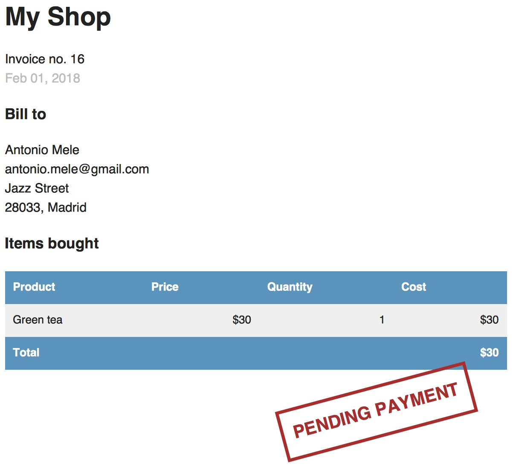

# 创建电商网站

## 创建电商网站项目

我们要创建一个电商网站项目。用户能够浏览商品品类目录，然后将具体商品加入购物车，最后还可以通过购物车生成订单。本章电商网站的如下功能：

- 创建商品品类模型并加入管理后台，创建视图展示商品品类
- 创建购物车系统，用户浏览网站的时购物车中一直保存着用户的商品
- 创建提交订单的页面
- 订单提交成功后异步发送邮件给用户

打开系统命令行窗口，创建新的项目 `myshop`，然后创建新应用 `shop`：

```bash
$ django-admin startproject myshop
$ cd myshop/
$ django-admin startapp shop
```

编辑 `settings.py` 文件，激活 `shop` 应用：

```python
INSTALLED_APPS = [
    # ...
    'shop.apps.ShopConfig',
]
```

现在应用已经激活，下一步是设计数据模型。

### 创建商品品类模型

我们的商品品类模型包含一系列商品大类，每个商品大类中包含一系列商品。每一个商品都有一个名称，可选的描述，可选的图片，价格和是否可用属性。编辑 `shop` 应用的 `models.py` 文件：

```python
from django.db import models


class Category(models.Model):
    name = models.CharField(max_length=200, db_index=True)
    slug = models.SlugField(max_length=200, db_index=True, unique=True)

    class Meta:
        ordering = ('name',)
        verbose_name = 'category'
        verbose_name_plural = 'categories'

    def __str__(self):
        return self.name


class Product(models.Model):
    category = models.ForeignKey(Category, related_name='category', on_delete=models.CASCADE)
    name = models.CharField(max_length=200, db_index=True)
    slug = models.SlugField(max_length=200, db_index=True)
    image = models.ImageField(upload_to='products/%Y/%m/%d', blank=True)
    description = models.TextField(blank=True)
    price = models.DecimalField(max_digits=10, decimal_places=2)
    available = models.BooleanField(default=True)
    created = models.DateTimeField(auto_now_add=True)
    updated = models.DateTimeField(auto_now=True)

    class Meta:
        ordering = ('name',)
        index_together = (('id', 'slug'),)

    def __str__(self):
        return self.name
```

这是我们的 `Category` 和 `Product` 模型。`Category` 包含 `name` 字段和设置为不可重复的 `slug` 字段（`unique` 同时也意味着创建索引）。`Product` 模型的字段如下：

- `category`：关联到 `Category` 模型的外键。这是一个多对一关系，一个商品必定属于一个品类，一个品类包含多个商品。
- `name`：商品名称。
- `slug`：商品简称，用于创建规范化 URL。
- `image`：可选的商品图片。
- `description`：可选的商品图片。
- `price`：该字段使用了 Python 的 `decimal.Decimal` 类，用于存储商品的金额，通过 `max_digits` 设置总位数，`decimal_places=2` 设置小数位数。
- `availble`：布尔值，表示商品是否可用，可以用于切换该商品是否可以购买。
- `created`：记录商品对象创建的时间。
- `updated`：记录商品对象最后更新的时间。

这里需要特别说明的是 `price` 字段，使用 `DecimalField`，而不是 `FloatField`，以避免小数尾差。

> 凡是涉及到金额相关的数值，使用 `DecimalField` 字段。`FloatField` 的后台使用 Python 的 `float` 类型，而 `DecimalField` 字段后台使用 Python 的 `Decimal` 类，可以避免出现浮点数的尾差。

在 `Product` 模型的 `Meta` 类中，使用 `index_together` 设置 `id` 和 `slug` 字段建立联合索引，这样在同时使用两个字段的索引时会提高效率。

由于使用了 `ImageField`，还需要安装 `Pillow` 库：

```bash
pip install Pillow
```

之后执行数据迁移程序，创建数据表。

### 将模型注册到管理后台

将我们的模型都添加到管理后台中，编辑 `shop` 应用的 `admin.py` 文件：

```python
from django.contrib import admin
from .models import Category, Product

@admin.register(Category)
class CategoryAdmin(admin.ModelAdmin):
    list_display = ['name', 'slug']
    prepopulated_fields = {'slug': ('name',)}

@admin.register(Product)
class ProductAdmin(admin.ModelAdmin):
    list_display = ['name', 'slug', 'price', 'available', 'created', 'updated']
    list_filter = ['available', 'created', 'updated']
    list_editable = ['price', 'available']
    prepopulated_fields = {'slug': ('name',)}
```

我们使用了 `prepopulated_fields` 用于让 `slug` 字段通过 `name` 字段自动生成，在之前的项目中可以看到这么做很简便。在 `ProductAdmin` 中使用 `list_editable` 设置了可以编辑的字段，这样可以一次性编辑多行而不用点开每一个对象。注意所有在 `list_editable` 中的字段必须出现在 `list_display` 中。

之后创建超级用户。打开 http://127.0.0.1:8000/admin/shop/product/add/ ，使用管理后台添加一个新的商品品类和该品类中的一些商品，页面如下：


### 创建商品品类视图

为了展示商品，我们创建一个视图，用于列出所有商品，或者根据品类显示某一品类商品，编辑 `shop` 应用的 `views.py` 文件：

```python
from django.shortcuts import render, get_object_or_404
from .models import Category, Product

def product_list(request, category_slug=None):
    category = None
    categories = Category.objects.all()
    products = Product.objects.filter(available=True)
    if category_slug:
        category = get_object_or_404(categories, slug=category_slug)
        products = products.filter(category=category)
    return render(request, 'shop/product/list.html',
                  {'category': category, 'categories': categories, 'products': products})
```

这个视图逻辑较简单，使用了 `available=True` 筛选所有可用的商品。设置了一个可选的 `category_slug` 参数用于选出特定的品类。

还需要一个展示单个商品详情的视图，继续编辑 `views.py` 文件：

```python
def product_detail(request, id, slug):
    product = get_object_or_404(Product, id=id, slug=slug, available=True)
    return render(request, 'shop/product/detail.html', {'product': product})
```

`product_detail` 视图需要 `id` 和 `slug` 两个参数来获取商品对象。只通过 `ID` 可以获得商品对象，因为 `ID` 是唯一的，这里增加了 `slug` 字段是为了对搜索引擎优化。

在创建了上述视图之后，需要为其配置 URL，在 `shop` 应用内创建 `urls.py` 文件并添加如下内容：

```python
from django.urls import path
from . import views

app_name = 'shop'

urlpatterns = [
    path('', views.product_list, name='product_list'),
    path('<slug:category_slug>/', views.product_list, name='product_list_by_category'),
    path('<int:id>/<slug:slug>/', views.product_detail, name='product_detail'),
]
```

我们为 `product_list` 视图定义了两个不同的 URL，一个名称是 `product_list`，不带任何参数，表示展示全部品类的全部商品；一个名称是 `product_list_by_category`，带参数，用于显示指定品类的商品。还为 `product_detail` 视图配置了传入 `id` 和 `slug` 参数的 URL。

这里要解释的就是 `product_list` 视图带一个默认值参数，所以默认路径进来后就是展示全部品类的页面。加上了具体某个品类，就展示那个品类的商品。详情页的 URL 使用 `id` 和 `slug` 来进行参数传递。

还需要编写项目的一级路由，编辑 `myshop` 项目的根 `urls.py` 文件：

```python
from django.contrib import admin
from django.urls import path, include

urlpatterns = [
    path('admin/', admin.site.urls),
    path('', include('shop.urls', namespace='shop')),
]
```

我们为 `shop` 应用配置了名为 `shop` 的二级路由。

由于 URL 中有参数，就需要配置 URL 反向解析，编辑 `shop` 应用的 `models.py` 文件，导入 `reverse()` 函数，然后为 `Category` 和 `Product` 模型编写 `get_absolute_url()` 方法：

```python
from django.urls import reverse

class Category(models.Model):
    # ......
    def get_absolute_url(self):
        return reverse('shop:product_list_by_category',args=[self.slug])

class Product(models.Model):
    # ......
    def get_absolute_url(self):
        return reverse('shop:product_detail',args=[self.id,self.slug])
```

这样就为模型的对象配置好了用于反向解析 URL 的方法，我们已经知道，`get_absolute_url()` 是很好的获取具体对象规范化 URL 的方法。

### 创建商品品类模板

现在需要创建模板，在 `shop` 应用下建立如下目录和文件结构：

```bash
$ tree templates
templates
└── shop
    ├── base.html
    └── product
        ├── detail.html
        └── list.html
```

像以前的项目一样，`base.html` 是母版，让其他的模板继承母版。编辑 `base.html`：

```django-html

<!DOCTYPE html>
<html>
<head>
    <meta charset="utf-8"/>
    <title>My shop</title>
    <link href="" rel="stylesheet">
</head>
<body>
    <div id="header">
        <a href="/" class="logo">My shop</a>
    </div>
    <div id="subheader">
        <div class="cart">Your cart is empty.</div>
    </div>
    <div id="content">
        
        
    </div>
</body>
</html>
```

这是这个项目的母版。其中使用的 CSS 文件可以从随书源代码中复制到 `shop` 应用的 `static/` 目录下。

然后编辑 `shop/product/list.html`：

```django-html



    {{ category.name }}Products


    <div id="sidebar">
        <h3>Categories</h3>
        <ul>
            <li class="selected">
                <a href="">All</a>
            </li>
            
                <li class="selected"
                    >
                    <a href="{{ c.get_absolute_url }}">{{ c.name }}</a>
                </li>
            
        </ul>
    </div>
    <div id="main" class="product-list">
        <h1>{{ category.name }}Products
        </h1>
        
            <div class="item">
                <a href="{{ product.get_absolute_url }}">
                    
                </a>
                <a href="{{ product.get_absolute_url }}">{{ product.name }}</a>
                <br>
                ${{ product.price }}
            </div>
        
    </div>

```

这是展示商品列表的模板，继承了 `base.html`，使用 `categories` 变量在侧边栏显示品类的列表，在页面主体部分通过 `products` 变量展示商品清单。展示所有商品和具体某一类商品都采用这个模板。如果 `Product` 对象的 `image` 字段为空，我们显示一张默认的图片，可以在随书源码中找到 `img/no_image.png`，将其拷贝到对应的目录。

由于使用了 `Imagefield`，还需要对媒体文件进行一些设置，编辑 `settings.py` 文件加入下列内容：

```python
MEDIA_URL = '/media/'
MEDIA_ROOT = os.path.join(BASE_DIR, 'media/')
```

`MEDIA_URL` 是保存用户上传的媒体文件的目录，`MEDIA_ROOT` 是存放媒体文件的目录，通过 `BASE_DIR` 变量动态建立该目录。

为了让 Django 提供静态文件服务，还必须修改 `shop` 应用的 `urls.py` 文件：

```python
from django.conf import settings
from django.conf.urls.static import static
urlpatterns = [
    # ...
]
if settings.DEBUG:
    urlpatterns += static(settings.MEDIA_URL, document_root=settings.MEDIA_ROOT)
```

注意仅在开发阶段才能如此设置。在生产环境中不能使用 Django 提供静态文件。使用管理后台增加一些商品，然后打开 http://127.0.0.1:8000/ ，可以看到如下页面：


如果没有给商品上传图片，则会显示 `no_image.png`，如下图：


然后编写商品详情页 `shop/product/detail.html`：

```django-html



    {{ product.name }}


    <div class="product-detail">
        
        <h1>{{ product.name }}</h1>
        <h2><a href="{{ product.category.get_absolute_url }}">{{ product.category }}</a></h2>
        <p class="price">${{ product.price }}</p>
        {{ product.description|linebreaks }}
    </div>

```

在模板中调用 `get_absolute_url()` 方法用于展示对应类的商品，打开 http://127.0.0.1:8000/ ，然后点击任意一个商品，详情页如下：


现在已经将商品品类和展示功能创建完毕。

## 创建购物车功能

在建立商品品类之后，下一步是创建一个购物车，让用户可以将指定的商品及数量加入购物车，而且在浏览整个网站并且下订单之前，购物车都会维持其中的信息。为此，我们需要将购物车数据存储在当前用户的 session 中。

我们将使用 Django 的 session 框架来存储购物车数据。直到用户生成订单，商品信息都存储在购 session 中，为此我们还需要为购物车和其中的商品创建一个模型。

### 使用 Django 的 session 模块

Django 提供了一个 session 模块，用于进行匿名或登录用户会话，可以为每个用户保存独立的数据。session 数据存储在服务端，除非使用基于 session 的会话引擎，否则 session 将包含 session ID。session 中间件管理具体的 session 信息，默认的 session 引擎将 session 保存在数据库内，也可以切换不同的 session 引擎。

要使用 session，需要在 `settings.py` 文件的 `MIDDLEWARE` 设置中启用 `'django.contrib.sessions.middleware.SessionMiddleware'`，这个管理 session 中间件在使用 `startproject` 命令创建项目时默认已经被启用。

这个中间件在 `request` 对象中设置了 session 属性用于访问 session 数据，类似于一个字典一样，可以存储任何可以被序列化为 JSON 的 Python 数据类型。可以像这样存入数据：

```python
request.session['foo'] = 'bar'
```

获取键对应的值：

```python
request.session.get('foo')
```

删除一个键值对：

```python
del request.session['foo']
```

可以将 `request.session` 当成字典来操作。

> 当用户登录到一个网站的时候，服务器会创建一个新的用于登录用户的 session 信息替代原来的匿名用户 session 信息，这意味着原 session 信息会丢失。如果想保存原 session 信息，需要在登录的时候将原 session 信息存为一个新的 session 数据。

### session 设置

Django 中可以配置 session 模块的一些参数，其中最重要的是 `SESSION_ENGINE` 设置，即设置 session 数据具体存储在何处。默认情况下，Django 通过 `django.contrib.session` 应用的 `Session` 模型，将 session 数据保存在数据库中的 `django_session` 数据表中。

Django 提供了如下几种存储 session 数据的方法：

- Database sessions：session 数据存放于数据库中，为默认设置，即将 session 数据存放到 `settings.py` 中的 `DATABASES` 设置中的数据库内。
- File-based sessions`：保存在一个具体的文件中
- Cached sessions：基于缓存的 session 存储，使用 Django 的缓存系统，可以通过 `CACHES` 设置缓存后端。这种情况下效率最高。
- Cached database sessions：先存到缓存再持久化到数据库中。取数据时如果缓存内无数据，再从数据库中取。
- Cookie-based sessions：基于 session 的方式，session 数据存放在 session 中。

为了提高性能，使用基于缓存的 session 是好的选择。Django 直接支持基于 `Memcached` 的缓存和如 `Redis` 的第三方缓存后端。

还有其他一系列的 session 设置，以下是一些主要的设置：

- `SESSION_COOKIE_AGE`：session 过期时间，为秒数，默认为 `1209600` 秒，即两个星期。
- `SESSION_COOKIE_DOMAIN`：默认为 `None`，设置为某个域名可以启用跨域 session。
- `SESSION_COOKIE_SECURE`：布尔值，默认为 `False`，表示是否只允许 HTTPS 连接下使用 session。
- `SESSION_EXPIRE_AT_BROWSER_CLOSE`：布尔值，默认为 `False`，表示是否一旦浏览器关闭，session 就失效。
- `SESSION_SAVE_EVERY_REQUEST`：布尔值，默认为 `False`，设置为 `True` 表示每次 HTTP 请求都会更新 session，其中的过期时间相关设置也会一起更新。

可以在 https://docs.djangoproject.com/zh-hans/4.2/ref/settings/#sessions 查看所有的 session 设置和默认值。

特别需要提的是 `SESSION_EXPIRE_AT_BROWSER_CLOSE` 设置。该设置默认为 `False`，此时 session 有效时间采用 `SESSION_COOKIE_AGE` 中的设置。

如果将 `SESSION_EXPIRE_AT_BROWSER_CLOSE` 设置为 `True`，则 session 在浏览器关闭后就失效，`SESSION_COOKIE_AGE` 设置不起作用。

还可以使用 `request.session.set_expiry()` 方法设置过期时间。

### 在 session 中存储购物车数据

我们需要创建一个简单的数据结构，可以被 JSON 序列化，用于存放购物车数据。购物车中必须包含如下内容：

- `Product` 对象的 ID。
- 商品的数量。
- 商品的单位价格。

由于商品的价格会变化，我们在将商品加入购物车的同时存储当时商品的价格，如果商品价格之后再变动，也不进行处理。

现在需要实现创建购物车和为 session 添加购物车的功能，购物车按照如下方式工作：

1. 当需要创建一个购物车的时候，先检查 session 中是否存在自定义的购物车键，如果存在说明当前用户已经使用了购物车，如果不存在，就新建一个购物车键。
1. 对于接下来的 HTTP 请求，都要重复第一步，并且从购物车中保存的商品 ID 到数据库中取得对应的 `Product` 对象数据。

编辑 `settings.py` 里新增一行：

```python
CART_SESSION_ID = 'cart'
```

这就是我们的购物车键名称，由于 session 对于每个用户都通过中间件管理，所以可以在所有用户的 session 里都使用统一的这个名称。

然后新建一个应用来管理购物车，启动系统命令行并创建新应用 `cart`：

```bash
$ python manage.py startapp cart
```

然后在 `settings.py` 中激活该应用：

```python
INSTALLED_APPS = [
    # ...
    'shop.apps.ShopConfig',
    'cart.apps.CartConfig',
]
```

在 `cart` 应用中创建 `cart.py`，添加如下代码：

```python
from decimal import Decimal
from django.conf import settings
from shop.models import Product

class Cart:

    def __init__(self, request):
        """
        初始化购物车对象
        """
        self.session = request.session
        cart = self.session.get(settings.CART_SESSION_ID)
        if not cart:
            # 向session中存入空白购物车数据
            cart = self.session[settings.CART_SESSION_ID] = {}
        self.cart =cart
```

这是我们用于管理购物车的 `Cart` 类，使用 `request` 对象进行初始化，使用 `self.session = request.session` 让类中的其他方法可以访问 session 数据。首先，使用 `self.session.get(settings.CART_SESSION_ID)` 尝试获取购物车对象。如果不存在购物车对象，通过为购物车键设置一个空白字段对象从而新建一个购物车对象。我们将使用商品 ID 作为字典中的键，其值又是一个由数量和价格构成的字典，这样可以保证不会重复生成同一个商品的购物车数据，也简化了取出购物车数据的方式。

创建将商品添加到购物车和更新数量的方法，为 `Cart` 类添加 `add()` 和 `save()` 方法：

```python
class Cart:
    # ......
    def add(self, product, quantity=1, update_quantity=False):
        """
        向购物车中增加商品或者更新购物车中的数量
        """

        product_id = str(product.id)
        if product_id not in self.cart:
            self.cart[product_id] = {'quantity': 0, 'price': str(product.price)}
        if update_quantity:
            self.cart[product_id]['quantity'] = quantity
        else:
            self.cart[product_id]['quantity'] += quantity
        self.save()

    def save(self):
        # 设置session.modified的值为True，中间件在看到这个属性的时候，就会保存session
        self.session.modified = True
```

`add()` 方法接受以下参数：

- `product`：要向购物车内添加或更新的 `product` 对象。
- `quantity`：商品数量，为整数，默认值为 1。
- `update_quantity`：布尔值，为 `True` 表示要将商品数量更新为 `quantity` 参数的值，为 `False` 表示将当前数量增加 `quantity` 参数的值。

我们把商品的 ID 转换成字符串形式然后作为购物车中商品键名，这是因为 Django 使用 JSON 序列化 session 数据，而 JSON 只允许字符串作为键名。商品价格也被从 `decimal` 类型转换为字符串，同样是为了序列化。最后，使用 `save()` 方法把购物车数据保存进 session。

`save()` 方法中修改了 `session.modified = True`，中间件通过这个判断 session 已经改变然后存储 session 数据。

我们还需要从购物车中删除商品的方法，为 `Cart` 类添加以下方法：

```python
class Cart:
    # ......
    def remove(self, product):
        """
        从购物车中删除商品
        """
        product_id = str(product.id)
        if product_id in self.cart:
            del self.cart[product_id]
            self.save()
```

`remove()` 根据 `id` 从购物车中移除对应的商品，然后调用 `save()` 方法保存 session 数据。

为了使用方便，我们会需要遍历购物车内的所有商品，用于展示等操作。为此需要在 `Cart` 类内定义 `__iter()__` 方法，生成迭代器，供将 `for` 循环使用。

```python
class Cart:
    # ......
    def __iter__(self):
        """
        遍历所有购物车中的商品并从数据库中取得商品对象
        """
        product_ids = self.cart.keys()
        # 获取购物车内的所有商品对象
        products = Product.objects.filter(id__in=product_ids)

        cart = self.cart.copy()
        for product in products:
            cart[str(product.id)]['product'] = product

        for item in cart.values():
            item['price'] = Decimal(item['price'])
            item['total_price'] = item['price'] * item['quantity']
            yield item
```

在 `__iter()__` 方法中，获取了当前购物车中所有商品的 `Product` 对象。然后浅拷贝了一份 `cart` 购物车数据，并为其中的每个商品添加了键为 `product`，值为商品对象的键值对。最后迭代所有的值，为把其中的价格转换为 `decimal` 类，增加一个 `total_price` 键来保存总价。这样我们就可以迭代购物车对象了。

还需要显示购物车中有几件商品。当执行 `len()` 方法的时候，Python 会调用对象的 `__len__()` 方法，为 Cart 类添加如下的 `__len__()` 方法：

```python
class Cart:
    # ......
    def __len__(self):
        """
        购物车内一共有几种商品
        """
        return sum(item['quantity'] for item in self.cart.values())
```

这个方法返回所有商品的数量的合计。

再编写一个计算购物车商品总价的方法：

```python
class Cart:
    # ......
    def get_total_price(self):
        return sum(Decimal(item['price']) * item['quantity'] for item in self.cart.values())
```

最后，再编写一个清空购物车的方法：

```python
class Cart:
    # ......
    def clear(self):
        del self.session[settings.CART_SESSION_ID]
        self.save()
```

现在就编写完了用于管理购物车的 `Cart` 类。

### 创建购物车视图

现在我们拥有了管理购物车的 `Cart` 类，需要创建如下的视图来添加、更新和删除购物车中的商品

- 添加商品的视图，可以控制增加或者更新商品数量
- 删除商品的视图
- 详情视图，显示购物车中的商品和总金额等信息

#### 购物车相关视图

为了向购物车内增加商品，显然需要一个表单让用户选择数量并按下添加到购物车的按钮。在 `cart` 应用中创建 `forms.py` 文件并添加如下内容：

```python
from django import forms

PRODUCT_QUANTITY_CHOICES = [(i, str(i)) for i in range(1, 21)]


class CartAddProductForm(forms.Form):
    quantity = forms.TypedChoiceField(choices=PRODUCT_QUANTITY_CHOICES, coerce=int)
    update = forms.BooleanField(required=False, initial=False, widget=forms.HiddenInput)
```

使用该表单添加商品到购物车，这个 `CartAddProductForm` 表单包含如下两个字段：

- `quantity`：限制用户选择的数量为 1-20 个。使用 `TypedChoiceField` 字段，并且设置 `coerce=int`，将输入转换为整型字段。
- `update`：用于指定当前数量是增加到原有数量（`False`）上还是替代原有数量（`True`），把这个字段设置为 `HiddenInput`，因为我们不需要用户看到这个字段。

创建向购物车中添加商品的视图，编写 `cart` 应用中的 `views.py` 文件，添加如下代码：

```python
from django.shortcuts import render, redirect, get_object_or_404
from django.views.decorators.http import require_POST
from shop.models import Product
from .cart import Cart
from .forms import CartAddProductForm

@require_POST
def cart_add(request, product_id):
    cart = Cart(request)
    product = get_object_or_404(Product, id=product_id)
    form = CartAddProductForm(request.POST)
    if form.is_valid():
        cd = form.cleaned_data
        cart.add(product=product, quantity=cd['quantity'], update_quantity=cd['update'])
    return redirect('cart:cart_detail')
```

这是添加商品的视图，使用 `@require_POST` 使该视图仅接受 POST 请求。这个视图接受商品 ID 作为参数，ID 取得商品对象之后验证表单。表单验证通过后，将商品添加到购物车，然后跳转到购物车详情页面对应的 `cart_detail` URL，稍后我们会来编写 `cart_detail` URL。

再来编写删除商品的视图，在 `cart` 应用的 `views.py` 中添加如下代码：

```python
def cart_remove(request, product_id):
    cart = Cart(request)
    product = get_object_or_404(Product, id=product_id)
    cart.remove(product)
    return redirect('cart:cart_detail')
```

删除商品视图同样接受商品 ID 作为参数，通过 ID 获取 `Product` 对象，删除成功之后跳转到 `cart_detail` URL。

还需要一个展示购物车详情的视图，继续在 `cart` 应用的 `views.py` 文件中添加下列代码：

```python
def cart_detail(request):
    cart = Cart(request)
    return render(request, 'cart/detail.html', {'cart': cart})
```

`cart_detail` 视图用来展示当前购物车中的详情。现在已经创建了添加、更新、删除及展示的视图，需要配置 URL，在 `cart` 应用里新建 `urls.py`：

```python
from django.urls import path
from . import views

app_name = 'cart'
urlpatterns = [
    path('', views.cart_detail, name='cart_detail'),
    path('add/<int:product_id>/', views.cart_add, name='cart_add'),
    path('remove/<int:product_id>/', views.cart_remove, name='cart_remove'),
]
```

然后编辑项目的根 `urls.py`，配置 URL：

```python
urlpatterns = [
    path('admin/', admin.site.urls),
    path('cart/', include('cart.urls', namespace='cart')),
    path('', include('shop.urls', namespace='shop')),
]
```

注意这一条路由需要增加在 `shop.urls` 路径之前，因为这一条比下一条的匹配路径更加严格。

#### 创建展示购物车的模板

`cart_add` 和 `cart_remove` 视图并未渲染模板，而是重定向到 `cart_detail` 视图，我们需要为编写展示购物车详情的模板。

在 cart 应用内创建如下文件目录结构：

```bash
$ tree templates
templates
└── cart
    └── detail.html
```

编辑 `cart/detail.html`，添加下列代码：

```django-html





    Your shopping cart



    <h1>Your shopping cart</h1>
    <table class="cart">
        <thead>
        <tr>
            <th>Image</th>
            <th>Product</th>
            <th>Quantity</th>
            <th>Remove</th>
            <th>Unit price</th>
            <th>Price</th>
        </tr>
        </thead>
        <tbody>
        
            
                <tr>
                    <td>
                        <a href="{{ product.get_absolute_url }}">
                            
                        </a>
                    </td>
                    <td>{{ product.name }}</td>
                    <td>{{ item.quantity }}</td>
                    <td>
                        <a href="">Remove</a>
                    </td>
                    <td class="num">${{ item.price }}</td>
                    <td class="num">${{ item.total_price }}</td>
                </tr>
            
        

            <tr class="total">
                <td>total</td>
                <td colspan="4"></td>
                <td class="num">${{ cart.get_total_price }}</td>
            </tr>
        </tbody>
    </table>
    <p class="text-right">
        <a href="" class="button light">Continue shopping</a>
        <a href="#" class="button">Checkout</a>
    </p>

```

这是展示购物车详情的模板，包含了一个表格用于展示具体商品。用户可以通过表单修改之中的数量，并将其发送至 `cart_add` 视图。还提供了一个删除链接供用户删除商品。

#### 添加商品至购物车

需要修改商品详情页，增加一个 Add to Cart 按钮。编辑 `shop` 应用的 `views.py` 文件，把 `CartAddProductForm` 添加到 `product_detail` 视图中：

```python
from cart.forms import CartAddProductForm

def product_detail(request, id, slug):
    product = get_object_or_404(Product, id=id, slug=slug, available=True)
    cart_product_form = CartAddProductForm()
    return render(request, 'shop/product/detail.html', {'product': product, 'cart_product_form': cart_product_form})
```

编辑对应的 `shop/templates/shop/product/detail.html` 模板，在展示商品价格之后添加如下内容：

```django-html
<p class="price">${{ product.price }}</p>
<form action="" method="post">
    {{ cart_product_form }}
    
    <input type="submit" value="Add to cart">
</form>
{{ product.description|linebreaks }}
```

启动站点，到 http://127.0.0.1:8000/ ，进入任意一个商品的详情页，可以看到商品详情页内增加了按钮，如下图：


选择一个数量，然后点击 Add to cart 按钮，即可购物车详情界面，如下图：


#### 更新商品数量

当用户在浏览购物车详情时，在下订单前很可能会修改购物车的中商品的数量，我们必须允许用户在购物车详情页修改数量。

编辑 `cart` 应用中的 `views.py` 文件，修改其中的 `cart_detail` 视图：

```python
def cart_detail(request):
    cart = Cart(request)
    for item in cart:
        item['update_quantity_form'] = CartAddProductForm(initial={'quantity': item['quantity'], 'update': True})
    return render(request, 'cart/detail.html', {'cart': cart})
```

这个视图为每个购物车的商品对象添加了一个 `CartAddProductForm` 对象，这个表单使用当前数量初始化，然后将 `update` 字段设置为 `True`，这样在提交表单时，当前的数字直接覆盖原数字。

编辑 `cart` 应用的 `cart/detail.html` 模板，找到下边这行

```django-html
<td>{{ item.quantity }}</td>
```

将其替换成：

```django-html
<td>
    <form action="" method="post">
        {{ item.update_quantity_form.quantity }}
        {{ item.update_quantity_form.update }}
        <input type="submit" value="Update">
        
    </form>
</td>
```

之后启动站点，到 http://127.0.0.1:8000/cart/ ，可以看到如下所示：


修改数量然后点击 Update 按钮来测试新的功能，还可以尝试从购物车中删除商品。

### 创建购物车上下文处理器

你可能在实际的电商网站中会注意到，购物车的详细情况一直显示在页面上方的导航部分，在购物车为空的时候显示特殊的为空的字样，如果购物车中有商品，则会显示数量或者其他内容。这种展示购物车的方法与之前编写的处理购物车的视图没有关系，因此我们可以通过创建一个上下文处理器，将购物车对象作为 `request` 对象的一个属性，而不用去管是不是通过视图操作。

#### 上下文处理器

Django 中的上下文管理器，就是能够接受一个 `request` 请求对象作为参数，返回一个要添加到 `request` 上下文的字典的 Python 函数。

当默认通过 `startproject` 启动一个项目的时候，`settings.py` 中的 `TEMPLATES` 设置中的 `conetext_processors` 部分，就是给模板附加上下文的上下文处理器，有这么几个：

- `django.template.context_processors.debug`：这个上下文处理器附加了布尔类型的 `debug` 变量，以及 `sql_queries` 变量，表示请求中执行的 SQL 查询。
- `django.template.context_processors.request`：这个上下文处理器设置了 `request` 变量。
- `django.contrib.auth.context_processors.auth`：这个上下文处理器设置了 `user` 变量。
- `django.contrib.messages.context_processors.messages`：这个上下文处理器设置了 `messages` 变量，用于使用消息框架。

除此之外，django 还启用了 `django.template.context_processors.csrf` 来防止跨站请求攻击。这个组件没有写在 `settings.py` 里，强制启用，无法进行设置和关闭。有关所有上下文管理器的详情请参见 https://docs.djangoproject.com/zh-hans/4.2/ref/templates/api/#built-in-template-context-processors 。

#### 将购物车设置到 request 上下文中

现在我们就来设置一个自定义上下文处理器，以在所有模板内访问购物车对象。

在 `cart` 应用内新建一个 `context_processors.py` 文件，同视图，模板以及其他内容一样，django 内的程序可以写在应用内的任何地方，但为了结构良好，将其单独写成一个文件：

```python
from .cart import Cart
def cart(request):
    return {'cart': Cart(request)}
```

Django 规定的上下文处理器，就是一个函数，接受 `request` 请求作为参数，然后返回一个字典。这个字典的键值对被 `RequestContext` 设置为所有模板都可以使用的变量及对应的值。在我们的上下文处理器中，我们使用 `request` 对象初始化了 `cart` 对象

之后在 `settings.py` 里将我们的自定义上下文处理器加到 `TEMPLATES` 设置中：

```python
TEMPLATES = [
    {
        'BACKEND': 'django.template.backends.django.DjangoTemplates',
        'DIRS': [os.path.join(BASE_DIR, 'templates')]
        ,
        'APP_DIRS': True,
        'OPTIONS': {
            'context_processors': [
                ......
                'cart.context_processors.cart'
            ],
        },
    },
]
```

定义了上下文管理器之后，只要一个模板被 `RequestContext` 渲染，上下文处理器就会被执行然后附加上变量名 `cart`。

所有使用 `RequestContext` 的请求过程中都会执行上下文处理器。对于不是每个模板都需要的变量，一般情况下首先考虑的是使用自定义模板标签，特别是涉及到数据库查询的变量，否则会极大的影响网站的效率。

修改 `base.html`，找到下面这部分：

```django-html
<div class="cart">Your cart is empty.</div>
```

将其修改成：

```django-html
<div class="cart">
    
        
            Your cart:
            <a href="">{{ total_items }} item{{ total_items|pluralize }},
            ${{ cart.get_total_price }}
            </a>
        
            Your cart is empty.
        
    
</div>
```

启动站点，到 http://127.0.0.1:8000/ ，添加一些商品到购物车，在网站的标题部分可以显示出购物车的信息：


## 生成客户订单

当用户准备对一个购物车内的商品进行结账的时候，需要生成一个订单数据保存到数据库中。订单必须保存用户信息和用户所购买的商品信息。

为了实现订单功能，新创建一个订单应用：

```bash
$ python manage.py startapp orders
```

然后在 `settings.py` 中的 `INSTALLED_APPS` 中进行激活：

```python
INSTALLED_APPS = [
    # ...
    'orders.apps.OrdersConfig',
]
```

### 创建订单模型

我们用一个模型存储订单的详情，然后再用一个模型保存订单内的商品信息，包括价格和数量。编辑 `orders` 应用的 `models.py` 文件：

```python
from django.db import models
from shop.models import Product


class Order(models.Model):
    first_name = models.CharField(max_length=50)
    last_name = models.CharField(max_length=50)
    email = models.EmailField()
    address = models.CharField(max_length=250)
    postal_code = models.CharField(max_length=20)
    city = models.CharField(max_length=100)
    created = models.DateTimeField(auto_now_add=True)
    updated = models.DateTimeField(auto_now=True)
    paid = models.BooleanField(default=False)

    class Meta:
        ordering = ('-created',)

    def __str__(self):
        return 'Order {}'.format(self.id)

    def get_total_cost(self):
        return sum(item.get_cost() for item in self.items.all())


class OrderItem(models.Model):
    order = models.ForeignKey(Order, related_name='items', on_delete=models.CASCADE)
    product = models.ForeignKey(Product, related_name='order_items', on_delete=models.CASCADE)
    price = models.DecimalField(max_digits=10, decimal_places=2)
    quantity = models.PositiveIntegerField(default=1)

    def __str__(self):
        return '{}'.format(self.id)

    def get_cost(self):
        return self.price * self.quantity
```

`Order` 模型包含一些存储用户基础信息的字段，以及一个是否支付的布尔字段 `paid`。稍后将在支付系统中使用该字段区分订单是否已经付款。还定义了一个获得总金额的方法 `get_total_cost()`，通过该方法可以获得当前订单的总金额。

`OrderItem` 存储了生成订单时候的价格和数量。然后定义了一个 `get_cost()` 方法，返回当前商品的总价。

之后执行数据迁移，过程不再赘述。

### 将订单模型加入管理后台

编辑 `orders` 应用的 `admin.py` 文件：

```python
from django.contrib import admin
from .models import Order, OrderItem


class OrderItemInline(admin.TabularInline):
    model = OrderItem
    raw_id_fields = ['product']


@admin.register(Order)
class OrderAdmin(admin.ModelAdmin):
    list_display = ['id', 'first_name', 'last_name', 'email',
                    'address', 'postal_code', 'city', 'paid',
                    'created', 'updated']
    list_filter = ['paid', 'created', 'updated']
    inlines = [OrderItemInline]
```

我们让 `OrderItem` 类继承了 `admin.TabularInline` 类，然后在 `OrderAdmin` 类中使用了 `inlines` 参数指定 `OrderItemInline`，通过该设置，可以将一个模型显示在相关联的另外一个模型的编辑页面中。

启动站点到 http://127.0.0.1:8000/admin/orders/order/add/ ，可以看到如下的页面：


### 创建客户订单视图和模板

在用户提交订单的时候，我们需要用刚创建的订单模型来保存用户当时购物车内的信息。创建一个新的订单的步骤如下：

1. 提供一个表单供用户填写。
1. 根据用户填写的内容生成一个新 `Order` 类实例，然后将购物车中的商品放入 `OrderItem` 实例中并与 `Order` 实例建立外键关系。
1. 清理全部购物车内容，然后重定向用户到一个操作成功页面。

首先利用内置表单功能建立订单表单，在 `orders` 应用中新建 `forms.py` 文件并添加如下代码：

```python
from django import forms
from .models import Order

class OrderCreateForm(forms.ModelForm):
    class Meta:
        model = Order
        fields = ['first_name', 'last_name', 'email', 'address', 'postal_code', 'city']
```

采用内置的模型表单创建对应 `order` 对象的表单，现在要建立视图来控制表单，编辑 `orders` 应用中的 `views.py`：

```python
from django.shortcuts import render
from .models import OrderItem
from .forms import OrderCreateForm
from cart.cart import Cart

def order_create(request):
    cart = Cart(request)
    if request.method == "POST":
        form = OrderCreateForm(request.POST)
        if form.is_valid():
            order = form.save()
            for item in cart:
                OrderItem.objects.create(order=order, product=item['product'], price=item['price'],
                                         quantity=item['quantity'])
            # 成功生成OrderItem之后清除购物车
            cart.clear()
            return render(request, 'orders/order/created.html', {'order': order})

    else:
        form = OrderCreateForm()
    return render(request, 'orders/order/create.html', {'cart': cart, 'form': form})
```

在这个 `order_create` 视图中，我们首先通过 `cart = Cart(request)` 获取当前购物车对象；之后根据 HTTP 请求种类的不同，视图进行以下工作：

- GET 请求：初始化空白的 `OrderCreateForm`，并且渲染 `orders/order/created.html` 页面。
- POST 请求：通过 POST 请求中的数据生成表单并且验证，验证通过之后执行 `order = form.save()` 创建新订单对象并写入数据库；然后遍历购物车的所有商品，对每一种商品创建一个 `OrderItem` 对象并存入数据库。最后清空购物车，渲染 `orders/order/created.html` 页面。

在 `orders` 应用里建立 `urls.py` 作为二级路由：

```python
from django.urls import path
from . import views

app_name = 'orders'

urlpatterns = [
    path('create/', views.order_create, name='order_create'),
]
```

配置好了 `order_create` 视图的路由，再配置 `myshop` 项目的根 `urls.py` 文件，在 `shop.urls` 之前增加下边这条：

```python
    path('orders/',include('orders.urls', namespace='orders')),
```

编辑购物车详情页 `cart/detail.html`，找到下边这行：

```django-html
<a href="#" class="button">Checkout</a>
```

将这个结账按钮的链接修改为 `order_create` 视图的 URL：

```django-html
<a href="" class="button">Checkout</a>
```

用户现在可以通过购物车详情页来提交订单，我们要为订单页制作模板，在 `orders` 应用下建立如下文件和目录结构：

```bash
$ tree templates
templates
└── orders
    └── order
        ├── create.html
        └── created.html
```

编辑确认订单的页面 `orders/order/create.html`，添加如下代码：

```django-html



Checkout



    <h1>Checkout</h1>

    <div class="order-info">
        <h3>Your order</h3>
        <ul>
            
            <li>
                {{ item.quantity }} x {{ item.product.name }}
                <span>${{ item.total_price }}</span>
            </li>
            
        </ul>
        <p>Total: ${{ cart.get_total_price }}</p>
    </div>

    <form action="." method="post" class="order-form" novalidate>
        {{ form.as_p }}
        <p><input type="submit" value="Place order"></p>
        
    </form>

```

这个模板，展示购物车内的商品和总价，之后提供空白表单用于提交订单。

再来编辑订单提交成功后跳转到的页面 `orders/order/created.html`：

```django-html



Thank you



    <h1>Thank you</h1>
    <p>Your order has been successfully completed. Your order number is <strong>{{ order.id }}</strong>.</p>

```

这是订单成功页面。启动站点，添加一些商品到购物车中，然后在购物车详情页面中点击 CHECKOUT 按钮，之后可以看到如下页面：


填写表单然后点击 Place order 按钮，订单被创建，然后重定向至创建成功页面：


现在可以到管理后台去看一看相关的信息了。

## 使用 Celery 启动异步任务

在一个视图内执行的所有操作，都会影响到响应时间。很多情况下，尤其视图中有一些非常耗时或者可能会失败，需要重试的操作，我们希望尽快给用户先返回一个响应而不是等到执行结束，而让服务器去继续异步执行这些任务。例如：很多视频分享网站允许用户上传视频，在上传成功之后服务器需花费一定时间转码，这个时候会先返回一个响应告知用户视频已经成功上传，正在进行转码，然后异步进行转码。还一个例子是向用户发送邮件。如果站点中有一个视图的操作是发送邮件，SMTP 连接很可能失败或者速度比较慢，这个时候采用异步的方式就能有效的避免阻塞。

Celery 是一个分布式任务队列，采取异步的方式同时执行大量的操作，支持实施操作和计划任务，可以方便的批量创建异步任务并且执行，也可以设定为计划执行。Celery 的文档在 http://docs.celeryproject.org/en/latest/index.html 。

### 安装 Celery

通过 `pip` 安装 Celery：

```bash
$ pip install celery
```

Celery 需要一个消息代理程序来处理外部的请求，这个代理把要处理的请求发送到 Celery worker，也就是实际处理任务的模块。所以还需要安装一个消息代理程序：

### 安装 RabbitMQ

Celery 的消息代理程序有很多选择，Redis 数据库也可以作为 Celery 的消息代理程序。这里我们使用 RabbitMQ，因为它是 Celery 官方推荐的消息代理程序。

如果是 Linux 系统，通过如下命令安装 RabbitMQ：

```bash
$ sudo apt-get install rabbitmq
```

如果使用 macOS X 或者 Windows，可以在 https://www.rabbitmq.com/download.html 下载 RabbitMQ。

安装之后使用下列命令启动 RabbitMQ 服务：

```bash
$ rabbitmq-server
Starting broker... completed with 10 plugins.
```

就说明 RabbitMQ 已经就绪，等待接受消息。

### 在项目中集成 Celery

需要为项目使用的 Celery 实例进行一些配置，在 `settings.py` 文件的相同目录下创建 `celery.py` 文件：

```python
import os
from celery import Celery

# 为celery程序设置环境为当前项目的环境
os.environ.setdefault('DJANGO_SETTINGS_MODULE', 'myshop.settings')

app = Celery('myshop')

app.config_from_object('django.conf:settings', namespace='CELERY')
app.autodiscover_tasks()
```

这段程序解释如下：

1. 导入 `DJANGO_SETTINGS_MODULE` 环境变量，为 Celery 命令行程序创造运行环境。
1. 实例化一个 `app` 对象，是一个 Celery 程序实例
1. 调用 `config_from_object()` 方法，从我们项目的设置文件中读取环境设置。`namespace` 属性指定了在我们的 `settings.py` 文件中，所有和 Celery 相关的配置都以 `CELERY` 开头，例如 `CELERY_BROKER_URL`。
1. 调用 `autodiscover_tasks()`，让 Celery 自动发现所有的异步任务。Celery 会在每个 `INSTALLED_APPS` 中列出的应用中寻找 `task.py` 文件，在里边寻找定义好的异步任务然后执行。

还需要在项目的 `__init__.py` 文件中导入 celery 模块，以让项目启动时 Celery 就运行，编辑 `myshop/__init__.py`：

```python
# import celery
from .celery import app as celery_app
```

现在就可以为应用启动异步任务了。

`CELERY_ALWAYS_EAGER` 设置可以让 Celery 在本地以同步的方式直接执行任务，而不会去把任务加到队列中。这常用来进行测试或者检查 Celery 的配置是否正确。

### 为应用添加异步任务

我们准备在用户提交订单的时候异步发送邮件。一般的做法是在应用目录下建立一个 `task` 模块专门用于编写异步任务，在 `orders` 应用下建立 `task.py` 文件，添加如下代码：

```python
from celery import task
from django.core.mail import send_mail
from .models import Order

@task
def order_created(order_id):
    """
    当一个订单创建完成后发送邮件通知给用户
    """

    order = Order.objects.get(id=order_id)
    subject = 'Order {}'.format(order.id)
    message = 'Dear {},\n\nYou have successfully placed an order. Your order id is {}.'.format(order.first_name,
                                                                                               order_id)
    mail_sent = send_mail(subject, message, 'lee0709@vip.sina.com', [order.email])
    print(mail_sent, type(mail_sent))
    return mail_sent
```

将 `order_created` 函数通过装饰器 `@task` 定义为异步任务，可以看到，只要用 `@task` 装饰就可以把一个函数变成 Celery 异步任务。这里我们给异步函数传入 `order_id`，推荐仅传入 ID，让异步任务启动的时候再去检索数据库。最后拼接好标题和正文后使用 `send_mail()` 发送邮件。

在第二章已经学习过如何发送邮件，如果没有 SMTP 服务器，在 `settings.py` 里将邮件配置为打印到控制台上：

```python
EMAIL_BACKEND = 'django.core.mail.backends.console.EmailBackend'
```

在实际应用中，除了耗时比较大的功能之外，还可以将其他容易失败需要重试的功能，即使耗时较短，也推荐设置为异步任务。

设置好了异步任务之后，还需要修改原来的视图 `order_created`，以便在订单完成的时候，调用 `order_created` 异步函数。编辑 `orders` 应用的 `views.py` 文件：

```python
from .task import order_created

def order_create(request):
    #......
    if request.method == "POST":
        #......
        if form.is_valid():
            #......
            cart.clear()
            # 启动异步任务
            order_created.delay(order.id)
        #......
```

调用 `delay()` 方法即表示异步执行该任务，任务会被加入队列然后交给执行程序执行。

启动另外一个 shell，使用如下命令启动 Celery worker：

```bash
$ celery -A myshop worker -l info
```

现在 Celery worker 已经启动并且准备处理任务。启动站点，然后添加一些商品到购物车，提交订单。在启动了 Celery worker 的窗口应该能看到类似下边的输出：

```bash
[2017-12-17 17:43:11,462: INFO/MainProcess] Received task:
orders.tasks.order_created[e990ddae-2e30-4e36-b0e4-78bbd4f2738e]
[2017-12-17 17:43:11,685: INFO/ForkPoolWorker-4] Task
orders.tasks.order_created[e990ddae-2e30-4e36-b0e4-78bbd4f2738e] succeeded in
0.22019841300789267s: 1
```

表示任务已经被执行，应该可以收到邮件了。

### 监控 Celery

如果想要监控异步任务的执行情况，可以安装 Python 的 FLower 模块：

```bash
$ pip install flower
```

之后在新的终端窗口输入：

```bash
$ celery -A myshop flower
```

之后在浏览器中打开 http://localhost:5555/dashboard，即可看到图形化监控的 Celery 情况：


可以在 https://flower.readthedocs.io/ 查看 Flower 的文档。

# 管理支付与订单

## 导出订单为 CSV 文件

有时我们想将某个模型中的数据导出为一个文件，用于在其他系统导入。常用的一种数据交换格式是 CSV（逗号分隔数据）文件。CSV 文件是一个纯文本文件，包含很多条记录。通常一行是一条记录，用特定的分隔符（一般是逗号）分隔每个字段的值。我们准备自定义管理后台，增加导出 CSV 文件的功能。

### 给管理后台增加自定义管理行为（actions)

Django 允许对管理后台的很多内容进行自定义修改。我们准备在列出具体数据的视图内增加导出 CSV 文件的功能。

一个管理行为是指如下操作：用户从管理后台列出某个模型中具体记录的页面内，使用复选框选中要操作的记录，然后从下拉菜单中选择一项操作，之后就会针对所有选中的记录执行操作。这个 action 的位置如下图所示：


创建自定义管理行为可以让管理员批量对记录进行操作。

可以通过写一个符合要求的自定义函数作为一项管理行为，这个函数要接受如下参数：

- 当前显示的 `ModelAdmin` 类。
- 当前的 `request` 对象，是一个 `HttpResponse` 实例。
- 用户选中的内容组成的 `QuerySet`。

在选中一个 action 选项然后点击旁边的 Go 按钮的时候，该函数就会被执行。

我们就准备在下拉 action 清单里增加一项导出 CSV 数据的功能，为此先来修改 `orders` 应用中的 `admin.py` 文件，将下列代码加在 `OrderAdmin` 类定义之前：

```python
import csv
import datetime
from django.http import HttpResponse

def export_to_csv(modeladmin, request, queryset):
    opts = modeladmin.model._meta
    response = HttpResponse(content_type='text/csv')
    response['Content-Disposition'] = 'attachment; filename={}.csv'.format(opts.verbose_name)
    writer = csv.writer(response)

    fields = [field for field in opts.get_fields() if not field.many_to_many and not field.one_to_many]
    writer.writerow(field.verbose_name for field in fields)

    for obj in queryset:
        data_row = []
        for field in fields:
            value = getattr(obj, field.name)
            if isinstance(value, datetime.datetime):
                value = value.strftime('%d/%m/%Y')
            data_row.append(value)
        writer.writerow(data_row)
    return response

export_to_csv.short_description = 'Export to CSV'
```

在这个函数里我们做了如下事情：

1. 创建一个 `HttpResponse` 对象，将其内容类型设置为 `text/csv`，以告诉浏览器将其视为一个 CSV 文件。还为请求头附加了 Content-Disposition 头部信息，告诉浏览器这个请求带有一个附加文件。
1. 创建一个 CSV 的 `writer` 对象，用于向 Http 响应对象 `response` 中写入 CSV 文件数据。
1. 通过 `_meta` 的 `get_fields()` 方法获取所有字段名，动态获取 `model` 的字段，排除了所有一对多和多对多字段。
1. 将字段名写入到响应的 CSV 数据中，作为第一行数据，即表头
1. 迭代 `QuerySet`，将其中每一个对象的数据写入一行中，注意特别对 `datetime` 采用了格式化功能，以转换成字符串。
1. 最后设置了该函数对象的 `short_description` 属性，该属性的值为在 action 列表中显示的功能名称。

这样我们就创建了一个通用的管理功能，可以操作任何 `ModelAdmin` 对象。

之后在 `OrderAdmin` 类中增加这个新的 `export_to_csv` 功能：

```python
class OrderAdmin(admin.ModelAdmin):
    # ...
    actions = [export_to_csv]
```

在浏览器中打开 http://127.0.0.1:8000/admin/orders/order/ 查看订单类，页面如下：


选择一些订单，然后选择上边的 Export to CSV 功能，然后点击 Go 按钮，浏览器就会下载一个 `order.csv` 文件。

使用文本编辑器打开刚下载的 CSV 文件，可以看到里边的内容类似：

```
ID,first name,last name,email,address,postal code,city,created,updated,paid,braintree id
3,Antonio,Melé,antonio.mele@gmail.com,Bank Street,WSJ11,London,25/02/2018,25/02/2018,True,2bwkx5b6
```

可以看到，实现管理功能的方法很直接。Django 中将数据输出为 CSV 的说明可以参考 https://docs.djangoproject.com/zh-hans/4.2/howto/outputting-csv/。

## 用自定义视图扩展管理后台的功能

不仅仅是配置 `ModelAdmin`，创建管理行为和覆盖内置模板，有时候可能需要对管理后台进行更多的自定义。这时你需要创建自定义的管理视图。使用管理视图，就可以实现自己想要的功能，要注意的只是自定义管理视图应该只允许管理员进行操作，同时继承内置模板以保持风格一致性。

我们这次来修改一下管理后台，增加一个自定义的功能用于显示一个订单的信息。修改 `orders` 应用中的 `views.py` 文件，增加如下内容：

```python
from django.contrib.admin.views.decorators import staff_member_required
from django.shortcuts import get_object_or_404
from .models import Order

@staff_member_required
def admin_order_detail(request, order_id):
    order = get_object_or_404(Order, id=order_id)
    return render(request, 'admin/orders/order/detail.html', {'order': order})
```

`@staff_member_required` 装饰器只允许 `is_staff` 和 `is_active` 字段同时为 `True` 的用户才能使用被装饰的视图。在这个视图中，通过传入的 id 取得对应的 `Order` 对象。

然后配置 `orders` 应用的 `urls.py` 文件，增加一条路由：

```python
    path('admin/order/<int:order_id>/', views.admin_order_detail, name='admin_order_detail')
```

然后在 `order` 应用的 `templates/` 目录下创建如下文件目录结构：

```bash
$ tree templates/admin
templates/admin
└── orders
    └── order
        └── detail.html

```

编辑这个 `detail.html`，添加下列代码：

```django-html



    <link rel="stylesheet" type="text/css" href=""/>


    Order {{ order.id }} {{ block.super }}


    <div class="breadcrumbs">
        <a href="">Home</a> ›
        <a href="">Orders</a>
        ›
        <a href="">Order {{ order.id }}</a>
        › Detail
    </div>


    <h1>Order {{ order.id }}</h1>
    <ul class="object-tools">
        <li>
            <a href="#" onclick="window.print();">Print order</a>
        </li>
    </ul>
    <table>
        <tr>
            <th>Created</th>
            <td>{{ order.created }}</td>
        </tr>
        <tr>
            <th>Customer</th>
            <td>{{ order.first_name }} {{ order.last_name }}</td>
        </tr>
        <tr>
            <th>E-mail</th>
            <td><a href="mailto:{{ order.email }}">{{ order.email }}</a></td>
        </tr>
        <tr>
            <th>Address</th>
            <td>{{ order.address }}, {{ order.postal_code }} {{ order.city }}</td>
        </tr>
        <tr>
            <th>Total amount</th>
            <td>${{ order.get_total_cost }}</td>
        </tr>
        <tr>
            <th>Status</th>
            <td>PaidPending payment</td>
        </tr>
    </table>
    <div class="module">
        <div class="tabular inline-related last-related">
            <table>
                <caption>Items bought</caption>
                <thead>
                <tr>
                    <th>Product</th>
                    <th>Price</th>
                    <th>Quantity</th>
                    <th>Total</th>
                </tr>
                </thead>
                <tbody>
                
                    <tr class="row">
                        <td>{{ item.product.name }}</td>
                        <td class="num">${{ item.price }}</td>
                        <td class="num">{{ item.quantity }}</td>
                        <td class="num">${{ item.get_cost }}</td>
                </tr>
                
                <tr class="total">
                    <td colspan="3">Total</td>
                    <td class="num">${{ order.get_total_cost }}</td>
                </tr>
                </tbody>
            </table>
        </div>
    </div>

```

这个模板用于在管理后台显示订单详情。模板继承了 `admin/base_site.html` 母版，这个母版包含 Django 管理站点的基础结构和 CSS 类，然后还加载了自定义的样式表 `admin/css/base.css`。

自定义 CSS 样式表在随书代码中，像之前的项目一样将其复制到对应目录。

我们使用的块名称都定义在母版中，在其中编写了展示订单详情的部分。

当你需要继承 Django 的内置模板时，必须了解内置模板的结构，在 https://github.com/django/django/tree/2.1/django/contrib/admin/templates/admin 可以找到内置模板的信息。

如果需要覆盖内置模板，需要将自己编写的模板命名为与原来模板相同，然后复制到 `templates` 下，设置与内置模板相同的相对路径和名称。管理后台就会优先使用当前项目下的模板。

最后，还需要再管理后台中为每个 `Order` 对象增加一个链接到我们自行编写的视图，编辑 `orders` 应用的 `admin.py` 文件，在 `OrderAdmin` 类之前增加如下代码：

```python
from django.urls import reverse
from django.utils.safestring import mark_safe

def order_detail(obj):
    return mark_safe('<a href="{}">View</a>'.format(reverse('orders:admin_order_detail', args=[obj.id])))
```

这个函数接受一个 `Order` 对象作为参数，返回一个解析后的 `admin_order_detail` 名称对应的 URL，由于 Django 默认会将 HTML 代码转义，所以加上 `mark_safe`。

使用 `mark_safe` 可以不让 HTML 代码转义。使用 `mark_safe` 的时候，确保对于用户的输入依然要进行转义，以防止跨站脚本攻击。

然后编辑 `OrderAdmin` 类来显示链接：

```python
@admin.register(Order)
class OrderAdmin(admin.ModelAdmin):
    list_display = ['id', 'first_name', 'last_name', 'email', 'address', 'postal_code', 'city', 'paid', 'created',
                    'updated', order_detail]
```

然后启动站点，访问 http://127.0.0.1:8000/admin/orders/order/ ，可以看到新增了一列：


点击任意一个订单的 `View` 链接查看详情，会进入 Django 管理后台风格的订单详情页：


## 动态生成 PDF 发票

我们现在已经实现了完整的结账和支付功能，可以为每个订单生成一个 PDF 发票。有很多 Python 库都可以用来生成 PDF，常用的是 Reportlab 库，该库也是 django 2.0 官方推荐使用的库，可以在 https://docs.djangoproject.com/zh-hans/4.2/howto/outputting-pdf/ 查看详情。

大部分情况下，PDF 文件中都要包含一些样式和格式，这个时候通过渲染后的 HTML 模板生成 PDF 更加方便。我们在 Django 中集成一个模块来按照上述方法转换 PDF。这里我们使用 WeasyPrint 库，这个库用来从 HTML 模板生成 PDF 文件。

```bash
$ pip install WeasyPrint
```

### 创建 PDF 模板

需要创建一个模板作为输入给 WeasyPrint 的数据。我们创建一个带有订单内容和 CSS 样式的模板，通过 Django 渲染，将最终生成的页面传给 WeasyPrint。

在 `orders` 应用的 `templates/orders/order/` 目录下创建 `pdf.html` 文件，添加下列代码：

```django-html
<html>
<body>
<h1>My Shop</h1>
<p>
    Invoice no. {{ order.id }}<br>
    <span class="secondary">
{{ order.created|date:"M d, Y" }}
</span>
</p>
<h3>Bill to</h3>
<p>
    {{ order.first_name }} {{ order.last_name }}<br>
    {{ order.email }}<br>
    {{ order.address }}<br>
    {{ order.postal_code }}, {{ order.city }}
</p>
<h3>Items bought</h3>
<table>
    <thead>
    <tr>
        <th>Product</th>
        <th>Price</th>
        <th>Quantity</th>
        <th>Cost</th>
    </tr>
    </thead>
    <tbody>
    
        <tr class="row">
            <td>{{ item.product.name }}</td>
            <td class="num">${{ item.price }}</td>
            <td class="num">{{ item.quantity }}</td>
            <td class="num">${{ item.get_cost }}</td>
    </tr>
    
    <tr class="total">
        <td colspan="3">Total</td>
        <td class="num">${{ order.get_total_cost }}</td>
    </tr>
    </tbody>
</table>
<span class="paidpending">
PaidPending payment
</span>
</body>
</html>
```

这个模板的内容很简单，使用一个 `<table>` 元素展示订单的用户信息和商品信息，还添加了消息显示订单是否已支付。

### 创建渲染 PDF 的视图

我们来创建在管理后台内生成订单 PDF 文件的视图，在 `orders` 应用的 `views.py` 文件内增加下列代码：

```python
from django.conf import settings
from django.http import HttpResponse
from django.template.loader import render_to_string
import weasyprint

@staff_member_required
def admin_order_pdf(request, order_id):
    order = get_object_or_404(Order, id=order_id)
    html = render_to_string('orders/order/pdf.html', {'order': order})
    response = HttpResponse(content_type='application/pdf')
    response['Content-Disposition'] = 'filename="order_{}"'.format(order.id)
    weasyprint.HTML(string=html).write_pdf(response, stylesheets=[weasyprint.CSS(settings.STATIC_ROOT + 'css/pdf.css')])
    return response
```

这是生成 PDF 文件的视图，使用了 `@staff_member_required` 装饰器使该视图只能由管理员访问。通过 ID 获取 `Order` 对象，然后使用 `render_to_string()` 方法渲染 `orders/order/pdf.html`，渲染后的模板以字符串形式保存在 html 变量中。然后创建一个新的 `HttpResponse` 对象，并为其附加 `application/pdf` 和 `Content-Disposition` 请求头信息。使用 WeasyPrint 从字符串形式的 HTML 中转换 PDF 文件并写入 `HttpResponse` 对象。这个生成的 PDF 会带有 `STATIC_ROOT` 路径下的 `css/pdf.css` 中的样式，最后返回响应。

如果发现文件缺少 CSS 样式，记得把 CSS 文件从随书目录中放入 `shop` 应用的 `static/` 目录下。

我们这里还没有配置 `STATIC_ROOT` 变量，这个变量规定了项目的静态文件存放的路径。编辑 `myshop` 项目的 `settings.py` 文件，添加下面这行：

```python
STATIC_ROOT = os.path.join(BASE_DIR, 'static/')
```

然后运行如下命令：

```bash
$ python manage.py collectstatic
120 static files copied to 'code/myshop/static'.
```

这个命令会把所有已经激活的应用下的 `static/` 目录中的文件，复制到 `STATIC_ROOT` 指定的目录中。每个应用都可以有自己的` static/` 目录存放静态文件，还可以在 `STATICFILES_DIRS` 中指定其他的静态文件路径，当执行 `collectstatic` 时，会把所有 `STATICFILES_DIRS` 目录内的文件都复制过来。如果再次执行 `collectstatic`，会提示是否需要覆盖已经存在的静态文件。

译者注：虽然将静态文件分开存放在每个应用的 `static/` 下可以正常运行开发中的站点，但在正式上线的最好统一静态文件的存放地址，以方便配置 Web 服务程序。

编辑 `orders` 应用的 `urls.py` 文件，为视图配置 URL：

```python
urlpatterns = [
    # ...
    path('admin/order/<int:order_id>/pdf/', views.admin_order_pdf, name='admin_order_pdf'),
]
```

像导出 CSV 一样，我们要在管理后台的展示页面中增加一个链接到这个视图的 URL。打开 `orders` 应用的 `admin.py` 文件，在 `OrderAdmin` 类之前增加：

```python
def order_pdf(obj):
    return mark_safe('<a href="{}">PDF</a>'.format(reverse('orders:admin_order_pdf', args=[obj.id])))

order_pdf.short_description = 'Invoice'
```

如果指定了 `short_description` 属性，Django 就会用该属性的值作为列名。

为 `OrderAdmin` 的 `list_display` 增加这个新的字段 `order_pdf`：

```python
@admin.register(Order)
class OrderAdmin(admin.ModelAdmin):
    list_display = ['id', 'first_name', 'last_name', 'email', 'address', 'postal_code', 'city', 'paid', 'created',
                    'updated', order_detail, order_pdf]
```

在浏览器中打开 http://127.0.0.1:8000/admin/orders/order/ ，可以看到新增了一列字段用于转换 PDF：


点击 PDF 链接，浏览器应该会下载一个 PDF 文件，如果是尚未支付的订单，样式如下：



已经支付的订单，则类似这样：


### 使用电子邮件发送 PDF 文件

当支付成功的时，我们发送带有 PDF 发票的邮件给用户。编辑 `payment` 应用中的 `views.py` 视图，添加如下导入语句：

```python
from django.template.loader import render_to_string
from django.core.mail import EmailMessage
from django.conf import settings
import weasyprint
from io import BytesIO
```

在 `payment_process` 视图中，`order.save()` 这行之后，以相同的缩进添加下列代码：

```python
def payment_process(request):
    # ......
    if request.method == "POST":
        # ......
        if result.is_success:
            # ......
            order.save()

            # 创建带有PDF发票的邮件
            subject = 'My Shop - Invoice no. {}'.format(order.id)
            message = 'Please, find attached the invoice for your recent purchase.'
            email = EmailMessage(subject, message, 'admin@myshop.com', [order.email])

            # 生成PDF文件
            html = render_to_string('orders/order/pdf.html', {'order': order})
            out = BytesIO()
            stylesheets = [weasyprint.CSS(settings.STATIC_ROOT + 'css/pdf.css')]
            weasyprint.HTML(string=html).write_pdf(out, stylesheets=stylesheets)

            # 附加PDF文件作为邮件附件
            email.attach('order_{}.pdf'.format(order.id), out.getvalue(), 'application/pdf')

            # 发送邮件
            email.send()

            return redirect('payment:done')
        else:
            return redirect('payment:canceled')
    else:
        # ......
```

这里使用了 `EmailMessage` 类创建一个邮件对象 email，然后将模板渲染到 html 变量中，然后通过 WeasyPrint 将其写入一个 `BytesIO` 二进制字节对象，之后使用 `attach` 方法，将这个字节对象的内容设置为 `EmailMessage` 的附件，同时设置文件类型为 PDF，最后发送邮件。

记得在 `settings.py` 中设置 SMTP 服务器，可以参考第二章。

现在，可以尝试完成一个新的付款，并且在邮箱内接收 PDF 发票。

# 扩展商店功能

## 国际化与本地化

Django 对于国际化和本地化提供了完整的支持，允许开发者将站点内容翻译成多种语言，而且可以处理本地化的时间日期数字和时区格式等本地化的显示内容。在开始之前，先需要区分一下国际化和本地化两个概念。国际化和本地化都是一种软件开发过程。国际化（Internationalization，通常缩写为 i18n），是指一个软件可以被不同的国家和地区使用，而不会局限于某种语言。本地化（Localization，缩写为 l10n）是指对国际化的软件将其进行翻译或者其他本地化适配，使之变成适合某一个国家或地区使用的软件的过程。Django 通过自身的国际化框架，可以支持超过 50 种语言。

### 国际化与本地化设置

Django 的国际化框架可以让开发者很方便的在 Python 代码和模板中标注需要翻译的字符串，这个框架依赖于 GNU gettext 开源软件来生成和管理消息文件（message file)。消息文件是一个纯文本文件，代表一种语言的翻译，存放着在站点应用中找到的部分或者所有需要翻译的字符串以及对应的某种语言的翻译，就像一个字典一样。消息文件的后缀名是 `.po`。

一旦完成翻译，可以把消息文件编译，以快速访问翻译内容，编译后的消息文件的后缀名是 `.mo`。

#### 国际化与本地化设置

Django 提供了一些国际化和本地化的设置，下边一些设置是最重要的：

- `USE_I18N`：布尔值，是否启用国际化功能，默认为 `True`。
- `USE_L10N`：布尔值，设置本地化功能是否启用，设置为 `True` 时，数字和日期将采用本地化显示。默认为 `False`。
- `USE_TZ`：布尔值，指定时间是否根据时区进行调整，当使用 `startproject` 创建项目时，默认为 `True`。
- `LANGUAGE_CODE`：项目的默认语言代码，采用标准的语言代码格式，例如 `'en-us'` 表示美国英语，`'en-gb'` 表示英国英语。这个设置需要 `USE_I18N` 设置为 `True` 才会生效。在 http://www.i18nguy.com/unicode/language-identifiers.html 可以找到语言代码清单。
- `LANGUAGES`：一个包含项目所有可用语言的元组，其中每个元素是语言代码和语言名称构成的二元组。可以在 `django.conf.global_settings` 查看所有可用的语言。这个属性可设置的值必须是 `django.conf.global_settings` 中列出的值。
- `LOCALE_PATHS`：一个目录列表，目录内存放项目的翻译文件。
- `TIME_ZONE`：字符串，代表项目所采用的时区。如果使用 `startproject` 启动项目，该值被设置为 `'UTC'`。可以按照实际情况将其设置为具体时区，如 `'Europe/Madrid'`。中国的时区是 `'Asia/Shanghai'`，大小写敏感。

以上是常用的国际化和本地化设置，完整设置请参见 https://docs.djangoproject.com/zh-hans/4.2/ref/settings/#globalization-i18n-l10n 。

#### 国际化和本地化管理命令

Django 包含了用于管理翻译的命令如下：

- `makemessages`：运行该命令，会找到项目中所有标注要翻译的字符串，建立或者更新 `locale` 目录下的 `.po` 文件，每种语言会生成单独的 `.po` 文件。
- `compilemessages`：编译所有的 `.po` 文件为 `.mo` 文件。

需要使用 GNU gettext 工具来执行上述过程，大部分 linux 发行版自带有该工具。如果在使用 mac OSX，可以通过 http://brew.sh/ 使用命令 `brew install gettext` 来安装，之后使用 `brew link gettext --force` 强制链接。对于 Windows 下的安装，参考 https://docs.djangoproject.com/zh-hans/4.2/topics/i18n/translation/#gettext-on-windows 中的步骤。

#### 如何为项目增加翻译文件

先来看一下增加翻译需要进行的流程：

1. 在 Python 代码和模板中标注出需要翻译的字符串
1. 运行 `makemessages` 命令建立消息文件
1. 在消息文件中将字符串翻译成另外一种语言，然后运行 `compilemessages` 命令编译消息文件

#### Django 如何确定当前语言

Django 使用中间件 `django.middleware.locale.LocaleMiddleware` 来检查 HTTP 请求中所使用的本地语言。这个中间件做的工作如下：

1. 如果使用 `i18_patterns`（django 特殊的一种 URL 方式，里边包含语言前缀），中间件会在请求的 URL 中寻找特定语言的前缀。
1. 如果在 URL 中没有发现语言前缀，会在 session 中寻找一个键 `LANGUAGE_SESSION_KEY`。
1. 如果 session 中没有该键，会在 cookie 中寻找一个键。可以通过 `LANGUAGE_COOKIE_NAME` 自定义该 cookie 的名称，默认是 `django_language`。
1. 如果 cookie 中未找到，找 HTTP 请求头的 `Accept-Language` 键。
1. 如果 `Accept-Language` 头部信息未指定具体语言，则使用 `LANGUAGE_CODE` 设置。

注意这个过程只有在开启了该中间件的时候才会得到完整执行，如果未开启中间件，Django 直接使用 `LANGUAGE_CODE` 中的设置。

### 为项目使用国际化进行准备

我们准备为电商网站增添各种语言的支持，增添英语和简体中文的支持。编辑 `settings.py` 文件，加入 `LANGUAGES` 设置，放在 `LANGUAGE_CODE` 的旁边：

```python
LANGUAGES = (
    ('en-us', _('English')),
    ('zh-hans', _('Simplified Chinese')),
)
```

`LANGUAGES` 设置包含两个语言代码和名称组成的元组。语言代码可以指定具体语言如 `en-us` 或 `en-gb`，也可以更模糊，如 `en`。通过这个设置，我们定义了我们的网站仅支持英语和简体中文。如果不定义 `LANGUAGES` 设置，默认支持所有 django 支持的语言。

设置 `LANGUAGE_CODE` 为如下：

```python
LANGUAGE_CODE = 'en'
```

添加 `django.middleware.locale.LocaleMiddleware` 到 `settings.py` 的中间件设置中，位置在 `SessionMiddleware` `中间件之后，CommonMiddleware` 中间件之前，因为 `LocaleMiddleware` 需要使用 session，而 `CommonMiddleware` 需要一种可用语言来解析 URL，`MIDDLEWARE` 设置成如下：

```python
MIDDLEWARE = [
    'django.middleware.security.SecurityMiddleware',
    'django.contrib.sessions.middleware.SessionMiddleware',
    'django.middleware.locale.LocaleMiddleware',
    'django.middleware.common.CommonMiddleware',
    # ...
]
```

django 中间件设置的顺序很重要，中间件会在请求上附加额外的数据，某个中间件会依赖于另外一个中间件附加的数据才能正常工作。

在 `manage.py` 文件所在的项目根目录下创建如下目录：

```bash
$ tree locale
locale
├── en
└── zh-Hans
```

`locale` 目录是用来存放消息文件的目录，编辑 `settings.py` 文件加入如下设置：

```python
LOCALE_PATH = (
    os.path.join(BASE_DIR, 'locale/'),
)
```

`LOCALE_PATH` 指定了 Django 寻找消息文件的路径，可以是一系列路径，最上边的路径优先级最高。

当使用 `makemessages` 命令的时候，消息文件会在我们创建的 `locale/` 目录中创建，如果某个应用也有 `locale/` 目录，那个应用中的翻译内容会优先在那个应用的目录中创建。

### 翻译 Python 代码中的字符串

为了翻译 Python 代码中的字符串字面量，需要使用 `django.utils.translation` 模块中的 `gettext()` 方法来标注字符串。这个方法返回翻译后的字符串，通常做法是导入该方法然后命名为一个下划线 `_` 。可以在https://docs.djangoproject.com/zh-hans/4.2/topics/i18n/translation/ 查看文档。

#### 标记字符串

标记字符串的方法如下：

```python
from django.utils.translation import gettext as _
output = _('Text to be translated.')
```

#### 惰性翻译

Django 对于所有的翻译函数都有惰性版本，后缀为 `_lazy()`。使用惰性翻译函数的时候，字符串只有被访问的时候才会进行翻译，而不是在翻译函数调用的时候。当字符串位于模块加载的时候才生成的路径中时候特别有效。

使用 `gettext_lazy()` 代替 `gettext()` 方法，只有在该字符串被访问的时候才会进行翻译，所有的翻译函数都有惰性版本。。

#### 包含变量的翻译

被标注的字符串中还可以带有占位符，以下是一个占位符的例子：

```python
from django.utils.translation import gettext as _
month = _('April')
day = '14'
output = _('Today is %(month)s %(day)s') % {'month': month, day': day}
```

通过使用占位符，可以使用字符串变量。例如，上边这个例子的英语如果是"Today is April 14"，翻译成的简体中文就是"今天是 4 月 14 日"。当需要翻译的文本中存在变量的时候，推荐使用占位符。

#### 复数的翻译

对于复数形式的翻译，可以采用 `ngettext()` 和 `ngettext_lazy()`。这两个函数根据对象的数量来翻译单数或者复数。使用例子如下：

```python
output = ngettext('there is %(count)d product', 'there are %(count)d products', count) % {'count': count}
```

现在我们了解了 Python 中翻译字面量的知识，可以来为我们的项目添加翻译功能了。

#### 为项目翻译 Python 字符串字面量

编辑 `setttings.py`，导入 `gettext_lazy()`，然后修改 `LANGUAGES` 设置：

```python
from django.utils.translation import gettext_lazy as _

LANGUAGES = (
    ('en', _('English')),
    ('zh-hans', _('Simplified Chinese')),
)
```

这里导入了 `gettext_lazy()` 并使用了别名 `_` 来避免重复导入。将显示的名称也进行了翻译，这样对于不同的语言的人来说，可以看懂并选择他自己的语言。

然后打开系统命令行窗口，输入如下命令：

```bash
$ docker compose run web django-admin makemessages --all
[+] Creating 1/0
 ✔ Container myshop-db-1  Running                                                                 0.0s
processing locale zh_Hans
processing locale en
```

然后查看项目的 `locale` 目录，可以看到如下文件和目录结构：

```bash
$ tree locale
locale
├── en
│   └── LC_MESSAGES
│       └── django.po
└── zh_Hnns
    └── LC_MESSAGES
        └── django.po
```

每个语言都生成了一个 `.po` 消息文件，使用文本编辑器打开 `zh_Hnns/LC_MESSAGES/django.po` 文件，在末尾可以看到如下内容：

```python
#: .\myshop\settings.py:107
msgid "English"
msgstr ""

#: .\myshop\settings.py:108
msgid "Simplified Chinese"
msgstr ""
```

每一部分的第一行表示在那个文件的第几行发现了需翻译的内容，每个翻译包含两个字符串：

- `msgid`：源代码中的字符串。
- `msgstr`：被翻译成的字符串，默认为空，需要手工添加。

添加好翻译之后的文件如下：

```python
#: myshop/settings.py:117
msgid "English"
msgstr "英文"

#: myshop/settings.py:118
msgid "Simplified Chinese"
msgstr "简体中文"
```

保存这个文件，之后执行命令编译消息文件：

```bash
$ docker compose run web django-admin compilemessages
[+] Creating 1/0
 ✔ Container myshop-db-1  Running                                                                 0.0s
processing file django.po in /myshop/locale/zh_Hans/LC_MESSAGES
processing file django.po in /myshop/locale/en/LC_MESSAGES
```

这表明已经编译了翻译文件，此时查看 `locale` 目录，其结构如下：

```bash
$ tree locale
locale
├── en
│   └── LC_MESSAGES
│       ├── django.mo
│       └── django.po
└── zh_Hans
    └── LC_MESSAGES
        ├── django.mo
        └── django.po
```

可以看到每种语言都生成了 `.mo` 文件。

我们已经翻译好了语言名称本身。现在我们来试着翻译一下 `Order` 模型的所有字段，修改 `orders` 应用的 `models.py` 文件：

```python
from django.utils.translation import gettext_lazy as _

class Order(models.Model):
    first_name = models.CharField(_('frist name'), max_length=50)
    last_name = models.CharField(_('last name'), max_length=50)
    email = models.EmailField(_('e-mail'), )
    address = models.CharField(_('address'), max_length=250)
    postal_code = models.CharField(_('postal code'), max_length=20)
    city = models.CharField(_('city'), max_length=100)
    ......
```

我们为每个显示出来的字段标记了翻译内容，也可以使用 `verbose_name` 属性来命名字段。在 `orders` 应用中建立如下目录：

```bash
$ tree orders/locale
orders/locale
├── en
└── zh_Hans
```

通过创建 `locale` 目录，当前应用下的翻译内容会优先保存到这个目录中，而不是保存在项目根目录下的 `locale` 目录中。这样就可以为每个应用配置独立的翻译文件。

在系统命令行中执行：

```bash
$ docker compose run web django-admin makemessages --all
[+] Creating 1/0
 ✔ Container myshop-db-1  Running                                                                 0.0s
processing locale zh_Hans
processing locale en
```

使用文本编辑器打开 `locale/zh_Hans/LC_MESSAGES/django.po`，可以看到 `Order` 模型的字段翻译，在 `msgstr` 中为对应的 `msgid` 字符串加上简体中文的翻译：

```python
#: orders/models.py:7
msgid "frist name"
msgstr "名"

#: orders/models.py:8
msgid "last name"
msgstr "姓"

#: orders/models.py:9
msgid "e-mail"
msgstr "邮箱"

#: orders/models.py:10
msgid "address"
msgstr "地址"

#: orders/models.py:11
msgid "postal code"
msgstr "邮编"

#: orders/models.py:12
msgid "city"
msgstr "城市"
```

添加完翻译之后保存文件。

除了常用的文本编辑软件，还可以考虑使用 `Poedit` 编辑翻译内容，该软件同样依赖 `gettext`，支持 Linux，Windows 和 macOS X。可以在 https://poedit.net/ 下载该软件。

下边来翻译项目使用的表单。`OrderCreateForm` 这个表单类无需翻译，因为它会自动使用 `Order` 类中我们刚刚翻译的 `verbose_name`。现在我们去翻译 `cart` 和 `coupons` 应用中的内容。

在 `cart` 应用的 `forms.py` 文件中，导入翻译函数，为 `CartAddProductForm` 类的 `quantity` 字段增加一个参数 `label`，代码如下：

```python
from django import forms
from django.utils.translation import gettext_lazy as _
PRODUCT_QUANTITY_CHOICES = [(i, str(i)) for i in range(1, 21)]

class CartAddProductForm(forms.Form):
    quantity = forms.TypedChoiceField(choices=PRODUCT_QUANTITY_CHOICES, coerce=int, label=_('Quantity'))
    update = forms.BooleanField(required=False, initial=False, widget=forms.HiddenInput)
```

### 翻译模板

Django 为翻译模板内容提供了 `` 和 `` 两个模板标签用于翻译内容，如果要启用这两个标签，需要在模板顶部加入 `` 。

#### 使用 `` 模板标签

`` 标签用来标记一个字符串，常量或者变量用于翻译。Django 内部也是该文本执行 `gettext()` 等翻译函数。标记字符串的例子是：

```django-html

```

也可以像其他标签变量一样，使用 `as` 将 翻译后的结果放入一个变量中，在其他地方使用。下面的例子使用了一个变量 `greeting`：

```django-html


<h1>{{ greeting }}</h1>
```

这个标签用于比较简单的翻译，但不能用于带占位符的文字翻译。

#### 使用模板标签

`` 标签可以标记包含常量和占位符的内容用于翻译，下边的例子展示了使用一个 `name` 变量的翻译：

```django-html
Hello {{ name }}!
```

可以使用 `with`，将具体的表达式设置为变量的值，此时在 `blocktrans` 块内部不能够再继续访问表达式和对象的属性，下面是一个使用了 `capfirst` 装饰器的例子：

```django-html

    Hello {{ name }}!

```

如果翻译内容中包含变量，使用 `` 代替 ``。

#### 翻译商店模板

编辑 `shop` 应用的 `base.html`，在其顶部加入 `i18n` 标签，然后标注如下要翻译的部分：

```django-html


<!DOCTYPE html>
<html>
<head>
    <meta charset="utf-8"/>
    <title></title>
    <link href="" rel="stylesheet">
</head>
<body>
<div id="header">
    <a href="/" class="logo"></a>
</div>
<div id="subheader">
    <div class="cart">
        
            
                :
                <a href="">
                    
                    {{ total_items }} items{{ total_items_plural }}, ${{ total_price }}
                    
                </a>
            
                
            
        
    </div>
</div>
<div id="content">
    
    
</div>
</body>
</html>
```

注意 `` 展示购物车总价部分的方法，在原来的模板中，我们使用了：

```django-html
{{ total_items }} item{{ total_items|pluralize }},
${{ cart.get_total_price }}
```

现在改用 `` 来为 `total_items|pluralize`（使用了过滤器）和 `cart.get_total_price`（访问对象的方法）创建占位符：

编辑 `shop` 应用的 `shop/product/detail.html`，紧接着 `` 标签导入 `i18n` 标签：

```django-html

```

之后找到下边这一行：

```django-html
<input type="submit" value="Add to cart">
```

将其替换成：

```django-html
<input type="submit" value="">
```

现在来翻译 `orders` 应用，编辑 `orders/order/create.html`，标记如下翻译内容：

```django-html



    



    <h1></h1>

    <div class="order-info">
        <h3></h3>
        <ul>
            
                <li>
                    {{ item.quantity }}x {{ item.product.name }}
                    <span>${{ item.total_price|floatformat:"2" }}</span>
                </li>
            
            
                <li>
                    
                        "{{ code }}" ({{ discount }}% off)
                    
                    <span>- ${{ cart.get_discount|floatformat:"2" }}</span>
                </li>
            
        </ul>
        <p>: ${{ cart.get_total_price_after_diccount|floatformat:"2" }}</p>
    </div>

    <form action="." method="post" class="order-form" novalidate>
        {{ form.as_p }}
        <p><input type="submit" value=""></p>
        
    </form>

```

到现在我们完成了如下文件的翻译：

- `shop` 应用的 `shop/product/list.html` 模板
- `orders` 应用的 `orders/order/created.html` 模板
- `cart` 应用的 `cart/detail.html` 模板

之后来更新消息文件，打开命令行窗口执行：

```bash
$ docker compose run web django-admin makemessages --all
```

此时 `myshop` 项目下的 `locale` 目录内有了对应的 `.po` 文件，而 `orders` 应用的翻译文件优先存放在应用内部的 `locale` 目录中。

编辑所有 `.po` 文件，在 `msgstr` 属性内添加简体中文翻译。你也可以直接复制随书代码内对应文件的内容。

执行命令编译消息文件：

```bash
$ docker compose run web django-admin compilemessages
[+] Creating 1/0
 ✔ Container myshop-db-1  Running                                                                 0.0s
processing file django.po in /myshop/orders/locale/zh_Hans/LC_MESSAGES
processing file django.po in /myshop/orders/locale/en/LC_MESSAGES
processing file django.po in /myshop/locale/zh_Hans/LC_MESSAGES
processing file django.po in /myshop/locale/en/LC_MESSAGES
```

针对每一个 `.po` 文件都会生成对应的 `.mo` 文件。

### 使用 Rosetta 翻译界面

Rosetta 是一个第三方应用，通过 Django 管理后台编辑所有翻译内容，让.po 文件的管理变得更加方便，先通过 pip 安装该模块：

```bash
$ pip install django-rosetta
```

之后在 `settings.py` 中激活该应用：

```python
INSTALLED_APPS = [
    # ...
    'rosetta',
]
```

然后需要为 Rosetta 配置相应的 URL，其二级路由已经配置好，修改项目根路由增加一行：

```python
urlpatterns = [
    # ...
    path('rosetta/', include('rosetta.urls')),
    path('', include('shop.urls', namespace='shop')),
]
```

这条路径也需要在 `shop.urls` 上边。

然后启动站点，使用管理员身份登录 http://127.0.0.1:8000/rosetta/ ，再转到 http://127.0.0.1:8000/rosetta/ ，点击右上的 THIRD PARTY 以列出所有的翻译文件，如下图所示：


点开 Simplified Chinese 下边的 Myshop 链接，可以看到列出了所有需要翻译的内容：


可以手工编辑需要翻译的地方，OCCURRENCES(S)栏显示了该翻译所在的文件名和行数，对于那些占位符翻译的内容，显示为这样：


Rosetta 对占位符使用了不同的背景颜色，在手工输入翻译内容的时候注意不要破坏占位符的结构，例如要翻译下边这一行：

```django-html
%(total_items)s item%(total_items_plural)s, $%(total_price)s
```

应该输入：

```django-html
%(total_items)s 项目%(total_items_plural)s, $%(total_price)s
```

结束输入的时候，点击一下 Save 即可将当前翻译的内容保存到 `.po` 文件中，当保存之后，Rosetta 会自动进行编译，所以无需执行 `compilemessages` 命令。然而要注意 Rosetta 会直接读写 `locale` 目录，注意要给予其相应的权限。

如果需要其他用户来编辑翻译内容，可以到 http://127.0.0.1:8000/admin/auth/group/add/ 新增一个用户组叫 `translators`，然后到 http://127.0.0.1:8000/admin/auth/user/ 编辑用户的权限以给予其修改翻译的权限，将该用户加入到 `translators` 用户组内。仅限超级用户和 `translators` 用户组内的用户才能使用 Rosetta。

Rosetta 的官方文档在 https://django-rosetta.readthedocs.io/en/latest/ 。

特别注意的是，当 Django 已经在生产环境运行时，如果修改和新增了翻译，在运行了 `compilemessages` 命令之后，只有重新启动 Django 才会让新的翻译生效。

### 待校对翻译 Fuzzy translations

你可能注意到了，Rosetta 页面上有一列叫做 Fuzzy。这不是 Rosetta 的功能，而是 `gettext` 提供的功能。如果将 `fuzzy` 设置为 `true`，则该条翻译不会包含在编译后的消息文件中。这个字段用来标记需要由用户进行检查的翻译内容。当 `.po` 文件更新了新的翻译字符串时，很可能一些翻译被自动标成了 `fuzzy`。这是因为：在 `gettext` 发现一些 `msgid` 被修改过的时候，`gettext` 会将其与它认为的旧有翻译进行匹配，然后标注上 `fuzzy`。看到 `fuzzy` 出现的时候，人工翻译者必须检查该条翻译，然后取消 `fuzzy`，之后再行编译。

### 国际化 URL

Django 提供两种国际化 URL 的特性：

- Language prefix in URL patterns 语言前缀 URL 模式：在 URL 的前边加上不同的语言前缀构成不同的基础 URL。
- Translated URL patterns 翻译 URL 模式：基础 URL 相同，把基础 URL 按照不同语言翻译给用户得到不同语言的 URL。

使用翻译 URL 模式的优点是对搜索引擎友好。如果采用语言前缀 URL，则必须要为每一种语言进行索引，使用翻译 URL 模式，则一条 URL 就可以匹配全部语言。下边来看一下两种模式的使用：

#### 语言前缀 URL 模式

Django 可以为不同语言在 URL 前添加前缀，例如我们的网站，英语版以 `/en/` 开头，而简体中文版以 `/zh-hans/` 开头。

要使用语言前缀 URL 模式，需要启用 `LocaleMiddleware` 中间件，用于从不同的 URL 中识别语言，在之前我们已经添加过该中间件。

我们来为 URL 模式增加前缀，现在需要修改项目的根 `urls.py` 文件：

```python
from django.conf.urls.i18n import i18n_patterns

urlpatterns = i18n_patterns(
    path('admin/', admin.site.urls),
    path('cart/', include('cart.urls', namespace='cart')),
    path('orders/', include('orders.urls', namespace='orders')),
    path('rosetta/', include('rosetta.urls')),
    path('', include('shop.urls', namespace='shop')),
)
```

可以混用未经翻译的标准 URL 与 `i18n_patterns` 类型的 URL，使部分 URL 带有语言前缀，部分不带前缀。但最好只使用翻译 URL，以避免把翻译过的 URL 匹配到未经翻译过的 URL 模式上。

现在启动站点，到 http://127.0.0.1:8000/ ，Django 的语言中间件会按照之前介绍的顺序来确定本地语言，然后重定向到带有语言前缀的 URL。现在看一下浏览器的地址栏，应该是 http://127.0.0.1:8000/en/ 。当前语言是由请求头 `Accept-Language` 所设置，或者就是 `LANGUAGE_CODE` 的设置。

#### 翻译 URL 模式

Django 支持在 URL 模式中翻译字符串。针对不同的语言，可以翻译出不同的 URL。在 `urls.py` 中，使用 `ugettext_lazy()` 来标注字符串。

编辑 `myshop` 应用的根 `urls.py`，为 `cart` 和 `orders` 应用配置 URL：

```python
from django.utils.translation import gettext_lazy as _

urlpatterns = i18n_patterns(
    path(_('admin/'), admin.site.urls),
    path(_('cart/'), include('cart.urls', namespace='cart')),
    path(_('orders/'), include('orders.urls', namespace='orders')),
    path('rosetta/', include('rosetta.urls')),
    path('', include('shop.urls', namespace='shop')),
)
```

编辑 `orders` 应用的 `urls.py` 文件，修改成如下：

```python
from django.utils.translation import gettext_lazy as _

urlpatterns = [
    path(_('create/'), views.order_create, name='order_create'),
    # ...
]
```

对于 `shop` 应用的 URL 不需要修改，因为其 URL 是动态建立的。

执行命令进行编译，更新消息文件：

```bash
$ docker compose run web django-admin makemessages --all
```

启动站点，访问 http://127.0.0.1:8000/en/rosetta/ ，点击 Simplified Chinese 下的 Myshop，可以看到出现了 URL 对应的翻译。可以点击 Untranslated 查看所有尚未翻译的字符串，然后输入翻译内容。

### 允许用户切换语言

在之前的工作中，我们配置好了英语和简体中文的翻译，应该给用户提供切换语言的选项，为此准备给网站增加一个语言选择器，列出所有支持的语言，显示为一系列链接。

编辑 `shop` 应用下的 `base.html`，找到下边这三行：

```django-html
<div id="header">
    <a href="/" class="logo"></a>
</div>
```

将其替换成：

```django-html
<div id="header">
    <a href="/" class="logo"></a>
    
    
    
    <div class="languages">
        <p>:</p>
        <ul class="languages">
            
                <li>
                    <a href="/{{ language.code }}/"
                        class="selected">
                        {{ language.name_local }}
                    </a>
                </li>
            
        </ul>
    </div>
</div>
```

这个就是我们的语言选择器，逻辑如下：

1. 页面的最上方加载 ``。
1. 使用 `` 标签用于获取当前语言。
1. 使用 `` 标签用于从 LANGUAGES 里获取所有可用的支持语言。
1. 使用 `` 是为了快速获取语言的属性而设置的变量。
1. 用循环列出了所有可支持的语言，对于当前语言设置 CSS 类为 select。

启动站点到 http://127.0.0.1:8000/ ，可以看到页面右上方出现了语言选择器，如下图：


### 使用 django-parler 翻译模型

Django 没有提供直接可用的模型翻译功能，必须采用自己的方式实现模型翻译。有一些第三方工具可以翻译模型字段，每个工具存储翻译的方式都不相同。其中一个工具叫做 django-parler，提供了高效的翻译管理，还能够与管理后台进行集成。

django-parler 的工作原理是为每个模型建立一个对应的翻译数据表，表内每条翻译记录通过外键连到翻译文字所在的模型，表内还有一个 `language` 字段，用于标记是何种语言。

#### 安装 django-parler

使用 pip 安装 django-parler：

```bash
pip install django-parler
```

在 `settings.py` 内激活该应用：

```python
INSTALLED_APPS = [
    # ...
    'parler',
]
```

继续添加下列设置：

```python
PARLER_LANGUAGES = {
    None: (
        {'code': 'en'},
        {'code': 'es'},
    ),
    'default': {
        'fallback': 'en',
        'hide_untranslated': False,
    }
}
```

该配置的含义是指定了 django-parler 的可用语言为 `en` 和 `zh-hans`，然后指定了默认语言为 `en`，然后指定 django-parler 不要隐藏未翻译的内容。

#### 翻译模型字段

我们为商品品类添加翻译。django-parler 提供一个 `TranslatableModel` 类和 `TranslatedFields` 方法来翻译模型的字段。编辑 `shop` 应用的 `models.py` 文件，添加导入语句：

```python
from parler.models import TranslatableModel, TranslatedFields
```

然后修改 `Category` 模型的 `name` 和 `slug` 字段：

```python
class Category(TranslatableModel):
    translations = TranslatedFields(
        name=models.CharField(max_length=200, db_index=True),
        slug=models.SlugField(max_length=200, db_index=True, unique=True)
    )
```

`Category` 类现在继承了 `TranslatableModel` 类，而不是原来的 `models.Model`，`name` 和 `slug` 字段被包含在了 `TranslatedFields` 包装器里。

编辑 `Product`，`name`，`slug`，`description`，和上边一样的方式：

```python
class Product(TranslatableModel):
    translations = TranslatedFields(
        name=models.CharField(max_length=200, db_index=True),
        slug=models.SlugField(max_length=200, db_index=True),
        description=models.TextField(blank=True),
    )
    category = models.ForeignKey(
        Category, related_name="products", on_delete=models.CASCADE
    )
    image = models.ImageField(upload_to="products/%Y/%m/%d", blank=True)
    price = models.DecimalField(max_digits=10, decimal_places=2)
    available = models.BooleanField(default=True)
    created = models.DateTimeField(auto_now_add=True)
    updated = models.DateTimeField(auto_now=True)
```

django-parler 通过新创建模型为其他模型提供翻译，在下图可以看到 `Product` 与其对应的翻译模型 `ProductTranslation` 之间的关系：


django-parler 生成的 `ProductTranslation` 类包含 `name`，`slug`，`description`，和一个 `language_code` 字段，还有一个外键连接到 `Product` 类，针对一个 `Product` 模型，会按照每种语言生成一个对应的 `ProductTranslation` 对象。

由于翻译的部分和原始的类是独立的两个模型，因此一些 ORM 的功能无法使用，比如不能在 `Product` 类中根据一个翻译后的字段进行排序，也不能在 `Meta` 类的 `ordering` 属性中使用翻译的字段。

所以编辑 `shop` 应用的 `models.py` 文件，注释掉 `ordering` 设置：

```python
class Category(TranslatableModel):
    # ...
    class Meta:
        # ordering = ('name',)
        verbose_name = 'category'
        verbose_name_plural = 'categories'
```

对于 `Product` 类，也要注释掉 `ordering`，还需要注释掉 `index_together`，这是因为目前的 django-parler 不支持联合索引的验证关系。如下图：

```python
class Product(TranslatableModel):
    # ...
    class Meta:
        pass
        # ordering = ('name',)
        # index_together = (('id', 'slug'),)
```

关于 django-parler 的兼容性，可以在 https://django-parler.readthedocs.io/en/latest/compatibility.html 查看。

#### 将 django-parler 集成到管理后台

django-parler 易于集成到 django 管理后台中，包含一个 `TranslatableAdmin` 类代替了原来的 `ModelAdmin` 类。

编辑 `shop` 应用的 `admin.py` 文件，导入该类：

```python
from parler.admin import TranslatableAdmin
```

修改 `CategoryAdmin` 和 `ProductAdmin` 类，使其继承 `TranslatableAdmin` 而不是 `ModelAdmin` 类，django-parler 不支持 `prepopulated_fields` 属性，但支持相同功能的 `get_prepopulated_fields()` 方法，因此将两个类修改如下：

```python
from django.contrib import admin
from .models import Category, Product
from parler.admin import TranslatableAdmin

@admin.register(Category)
class CategoryAdmin(TranslatableAdmin):
    list_display = ['name', 'slug']

    def get_prepopulated_fields(self, request, obj=None):
        return {'slug': ('name',)}


@admin.register(Product)
class ProductAdmin(TranslatableAdmin):
    list_display = ['name', 'slug', 'price', 'available', 'created', 'updated']
    list_filter = ['available', 'created', 'updated']
    list_editable = ['price', 'available']

    def get_prepopulated_fields(self, request, obj=None):
        return {'slug': ('name',)}
```

现在在管理后台内也能进行对翻译模型的管理了。现在可以执行数据迁移程序。

#### 迁移翻译模型数据

打开 shell 执行下列命令：

```python
$ docker compose run web python manage.py makemigrations shop --name "translations"
[+] Creating 1/0
 ✔ Container myshop-db-1  Running                                                                                                                                                                                    0.0s
Migrations for 'shop':
  shop/migrations/0002_translations.py
    - Change Meta options on category
    - Change Meta options on product
    - Alter index_together for product (0 constraint(s))
    - Remove field name from category
    - Remove field slug from category
    - Remove field description from product
    - Remove field name from product
    - Remove field slug from product
    - Create model ProductTranslation
    - Create model CategoryTranslation
```

django-parler 动态地创建了 `CategoryTranslation` 和 `ProductTranslation`。注意，原模型中需要翻译的字段从原模型中删除了，这意味着这几个字段的数据全都丢失了，必须启动站点后重新录入。

之后运行数据迁移：

```python
$ docker compose run web python manage.py migrate shop
[+] Creating 1/0
 ✔ Container myshop-db-1  Running                                                                                                                                                                                    0.0s
Operations to perform:
  Apply all migrations: shop
Running migrations:
  Applying shop.0002_translations... OK

```

现在数据已经和数据库同步好了。

> 注意这里使用 django 4.2 会出现 `AttributeError: type object 'Product' has no attribute '_parler_meta'` 错误，需要将 `migrations/0002_translations.py` 中的 `bases=(parler.models.TranslatedFieldsModelMixin, models.Model)` 替换为 `bases=(parler.models.TranslatableModel, models.Model)`，然后再执行数据迁移。

启动站点，访问 http://127.0.0.1:8000/en/admin/shop/category/ ，可以看到已经存在的模型失去了那些需要翻译的字段。点击一个 `category` 对象进行修改，可以看到包含了两个不同的表格，一个对应英语，一个对应简体中文，如下图所示：


为所有已存在 `category` 记录都添加名称和简称，再为其添加简体中文的名称和简称，然后点击 SAVE 按钮，确保在切换标签之前点击了 SAVE 按钮，否则数据不会被保存。

之后到 http://127.0.0.1:8000/en/admin/shop/product/ 进行同样的工作：补充每个商品的名称、简称、描述以及对应的简体中文翻译。

### 本地格式化

根据用户的国家和地区，需要以不同的格式显示日期，时间和数字。本地化格式可以通过 `settings.py` 里的 `USE_L10N` 设置为 `True` 来开启。

当 `USE_L10N` 设置为开启的时候，Django 在渲染模板的时候，会尽可能的尝试使用当前本地化的方式进行输出。可以看到我们的站点的小数点是一个圆点显示的，切换到简体中文的时候，小数点显示为一个逗号。这是通过对每种语言进行不同的格式设置实现的，对于支持的每种语言的格式，Django 都有对应的配置文件，例如针对简体中文的配置文件可以查看 https://github.com/django/django/blob/stable/4.2.x/django/conf/locale/es/formats.py 。

通常情况下，只要设置 `USE_L10N` 为 `True`，Django 就会自动应用本地化格式。然而，站点内可能有些内容并不想使用本地化格式，尤其那些标准数据例如代码或者是 JSON 字符串的内容。

Django 提供了一个 `` 模板标签，用于控制模板或者模板片段开启或关闭本地化输出。为了使用这个标签，必须在模板开头使用 `` 标签。下边是一个如何在模板中控制开启/关闭本地化输出的例子：

```django-html



    {{ value }}



    {{ value }}

```

Django 还提供了两个模板过滤器用于控制本地化，分别是 `localize` 和 `unlocailze`，用来强制让一个值开启/关闭本地化显示。用法如下：

```django-html
{{ value|localize }}
{{ value|unlocalize }}
```

除了这两个方法之外，还可以采取自定义格式文件方式，具体看 https://docs.djangoproject.com/zh-hans/4.2/topics/i18n/formatting/#creating-custom-format-files 。

### 用 django-localflavor 验证表单字段

django-localflavor 是一个第三方模块，包含一系列特别针对本地化验证的工具，比如为每个国家单独设计的表单和模型字段，对于验证某些国家的地区，电话号码，身份证，社会保险号码等非常方便。这个模块是按照 ISO 3166 国家代码标准编写的。

安装 django-localflavor：

```django-html
pip install django-localflavor
```

在 `settings.py` 中激活该应用：

```django-html
INSTALLED_APPS = [
    # ...
    'localflavor',
]
```

为了使用该模块，我们给订单增加一个美国邮编字段和对应验证，必须是一个有效的美国邮编才能建立订单。

编辑 `orders` 应用的 `forms.py` 文件，修改成如下：

```python
from localflavor.us.forms import USZipCodeField

class OrderCreateForm(forms.ModelForm):
    postal_code = USZipCodeField()
    class Meta:
        model = Order
        fields = ['first_name', 'last_name', 'email', 'address', 'postal_code', 'city']
```

从 `localflaver` 的 `us` 模块中导入 `USZipCodeField` 字段类型，将 `OrderCreateForm` 类的 `postal_code` 字段设置为该类型。

运行站点，到 http://127.0.0.1:8000/en/orders/create/ ，输入一些不符合美国邮编的邮政编码，可以看到表单的错误提示：

```
Enter a zip code in the format XXXXX or XXXXX-XXXX.
```

这只是一个针对给字段附加本地化验证的一个简单例子。localflavor 提供的组件对于将站点快速适配到某些国家非常有用。可以在 https://django-localflavor.readthedocs.io/en/latest/ 阅读 django-flavor 的官方文档。

现在就结束了所有国际化和本地化配置的工作，下一步是建立一个商品推荐系统。

## 创建商品推荐系统

商品推荐系统可以预测用户对一个商品的喜好程度或者评价高低，根据用户的行为和收集到的用户数据，选择可能和用户相关的产品推荐给用户。在电商行业，推荐系统使用的非常广泛。推荐系统可以帮助用户从浩如烟海的商品中选出自己感兴趣的商品。好的推荐系统可以增加用户粘性，对电商平台则意味着销售额的提高。

我们准备建立一个简单但是强大的商品推荐系统，用于推荐经常被一起购买的商品，这些商品基于用户过去的购买数据来给用户进行推荐。我们打算在两个页面向用户推荐商品：

首先是商品详情页。我们会在此展示一些与当前商品一起购买的商品。展示的文字类似：Users who bought this also bought X, Y, Z. 所以我们需要一个数据结构来存放所有与该商品一同购买的次数。
其次是购物车详情页。这时将不同商品与购物车中所有商品的关联购买次数进行求和再进行排名。
我们将使用 Redis 数据库记录一起购买的商品。我们在第六章已经使用过 Redis，如果还没有安装 Redis，可以参考该章节的内容。

### 根据之前的购买记录推荐商品

现在，需要根据用户加入到购物车内的商品计算排名。对于我们网站每一个被售出的商品，在 Redis 中存一个键。这个商品键对应的值是一个有序集合，就为同订单的其他商品在当前商品键对应的有序集合中的分数加 1。

当一个订单成功支付时，我们为订单每个购买的商品存储一个有序集合，这个有序集合将记录一起购买的商品分数。

安装 redis 模块：

```bash
pip install redis
```

之后在 `settings.py` 里配置 Redis：

```python
REDIS_HOST = 'localhost'
REDIS_PORT = 6379
REDIS_DB = 1
```

这是用于建立和 Redis 服务通信的设置。在 `shop` 应用目录下新建 `recommender.py` 文件，添加下列代码：

```python
import redis
from django.conf import settings
from .models import Product

# 连接到Redis
r = redis.StrictRedis(host=settings.REDIS_HOST, port=settings.REDIS_PORT, db=settings.REDIS_DB)

class Recommender:

    def get_product_key(self, product_id):
        return 'product:{}:purchased_with'.format(product_id)

    def products_bought(self, products):
        product_ids = [p.id for p in products]
        # 针对订单里的每一个商品，将其他商品在当前商品的有序集合中增加1
        for product_id in product_ids:
            for with_id in product_ids:
                if product_id != with_id:
                    r.zincrby(self.get_product_key(product_id), with_id, amount=1)
```

这个 `Recommender` 类用来存储订单购买时的相关信息和根据一个指定的对象获取相关的推荐。`get_product_key()` 方法获取一个 `Product` 对象的 `id`，然后创建对应的有序集合，其中的键看起来像这样：`product:[id]:purchased_with`。

`product_bought()` 方法接受属于同一个订单的 `Product` 对象的列表，然后做如下操作：

1. 获取所有 `Product` 对象的 ID。
1. 针对每一个 ID 遍历一次全部的 ID，跳过内外循环 ID 相同的部分，这样就针对其中每个商品都遍历了与其一同购买的商品。
1. 使用 `get_product_id()` 方法得到每个商品的 Redis 键名。例如针对 ID 为 33 的商品，返回的键名是 `product:33:purchased_with`，这个键将用于操作有序集合。
1. 在该商品对应的有序序列将同一订单内的其他商品的分数增加 1。

我们现在有了一个保存商品相关信息的方法。还需要一个方法来从 Redis 中获得推荐的商品，继续编写 `Recommender` 类，增加 `suggest_products_for()`方法：

```python
class Recommender:
    # ......
    def suggest_products_for(self, products, max_results=6):
        product_ids = [p.id for p in products]
        # 如果当前列表只有一个商品：
        if len(product_ids) == 1:
            suggestions = r.zrange(self.get_product_key(product_ids[0]), 0, -1, desc=True)[:max_results]
        else:
            # 生成一个临时的key，用于存储临时的有序集合
            flat_ids = ''.join([str(id) for id in product_ids])
            tmp_key = 'tmp_{}'.format(flat_ids)
            # 对于多个商品，取所有商品的键名构成keys列表
            keys = [self.get_product_key(id) for id in product_ids]
            # 合并有序集合到临时键
            r.zunionstore(tmp_key, keys)
            # 删除与当前列表内商品相同的键。
            r.zrem(tmp_key, *product_ids)
            # 获得排名结果
            suggestions = r.zrange(tmp_key, 0, -1, desc=True)[:max_results]
            # 删除临时键
            r.delete(tmp_key)
        # 获取关联商品并通过相关性排序
        suggested_products_ids = [int(id) for id in suggestions]
        suggested_products = list(Product.objects.filter(id__in=suggested_products_ids))
        suggested_products.sort(key=lambda x: suggested_products_ids.index(x.id))
        return suggested_products
```

`suggest_products_for()`方法接受两个参数：

- p`roducts`：表示为哪些商品进行推荐，可以包含一个或多个商品。
- `max_results`：整数值，表示最大推荐几个商品。

在这个方法里我们做了如下的事情：

1. 获取所有 `Product` 对象的 ID
1. 如果仅有一个商品，直接查询这个 `id` 对应的有序集合，按降序返回结果。为了实现查询，使用了 Redis 的 `ZRANGE` 命令。我们使用 `max_results` 属性指定返回的最大数量。
1. 如果商品数量多于 1 个，通过 ID 创建一个临时键名。
1. 通过 Redis 的 `ZUNIONSTORE` 命令合并所有商品的有序集合。`ZUNIONSTORE` 合并所有的有序集合中相同键的分数，然后将新生成的有序集合存入临时键。关于该命令可以参考 https://redis.io/commands/ZUNIONSTORE 。
1. 由于已经在当前购物车内的商品无需被推荐，因此使用 `ZREM` 命令从临时键的有序集合中删除与当前订单内商品 `id` 相同的键。
1. 从临时键中获取商品 ID，使用 `ZRANGE` 命令按照分数排序，通过 `max_results` 控制返回数量，之后删除临时键。
1. 根据 ID 获取 `Product` 对象，然后按照与取出的 ID 相同的顺序进行排列。

为了更加实用，再给 `Recommender` 类添加一个清除推荐商品的方法：

```python
class Recommender:
    # ......
    def clear_purchases(self):
        for id in Product.objects.values_list('id', flat=True):
            r.delete(self.get_product_key(id))
```

我们来测试一下推荐引擎是否正常工作。确保 Product 数据表中有一些商品信息，通过 `python manage.py shell` 进入带有 Django 项目环境的 `shell` 中：

```bash
>>> from shop.models import Product
>>> black_tea = Product.objects.get(translations__name='Black tea')
>>> red_tea = Product.objects.get(translations__name='Red tea')
>>> green_tea = Product.objects.get(translations__name='Green tea')
>>> tea_powder = Product.objects.get(translations__name='Tea powder')
```

之后增加一些测试购买数据：

```bash
>>> from shop.recommender import Recommender
>>> r = Recommender()
>>> r.products_bought([black_tea, red_tea])
>>> r.products_bought([black_tea, green_tea])
>>> r.products_bought([red_tea, black_tea, tea_powder])
>>> r.products_bought([green_tea, tea_powder])
>>> r.products_bought([black_tea, tea_powder])
>>> r.products_bought([red_tea, green_tea])
```

进行完上述操作后，我们实际为四个商品保存的有序集合是：

```bash
black_tea: red_tea (2), tea_powder (2), green_tea (1)
red_tea: black_tea (2), tea_powder (1), green_tea (1)
green_tea: black_tea (1), tea_powder (1), red_tea(1)
tea_powder: black_tea (2), red_tea (1), green_tea (1)
```

下边测试一下通过翻译字段获取推荐商品信息：

```bash
>>> from django.utils.translation import activate
>>> activate('en')
>>> r.suggest_products_for([black_tea])
[<Product: Tea powder>, <Product: Red tea>, <Product: Green tea>]
>>> r.suggest_products_for([red_tea])
[<Product: Black tea>, <Product: Tea powder>, <Product: Green tea>]
>>> r.suggest_products_for([green_tea])
[<Product: Black tea>, <Product: Tea powder>, <Product: Red tea>]
>>> r.suggest_products_for([tea_powder])
[<Product: Black tea>, <Product: Red tea>, <Product: Green tea>]
```

如果看到商品是按照它们的分数进行降序排列的，就说明引擎工作正常了。再测试一下多个商品的推荐：

```bash
>>> r.suggest_products_for([black_tea, red_tea])
[<Product: Tea powder>, <Product: Green tea>]
>>> r.suggest_products_for([green_tea, red_tea])
[<Product: Black tea>, <Product: Tea powder>]
>>> r.suggest_products_for([tea_powder, black_tea])
[<Product: Red tea>, <Product: Green tea>]
```

可以实际计算一下是否符合合并有序集合后的结果，例如针对第一条程序，`tea_powder` 的分数是 2+1，`green_tea` 的分数是 1+1 等

测试之后说明我们的推荐算法正常工作，下一步就是将该功能集成到站点中，在商品详情页和购物车清单页进行展示。先修改 `shop` 应用的 `views.py` 文件中的 `product_detail` 视图：

```python
from .recommender import Recommender

def product_detail(request, id, slug):
    language = request.LANGUAGE_CODE
    product = get_object_or_404(Product, id=id, translations__language_code=language, translations__slug=slug,
                                available=True)

    cart_product_form = CartAddProductForm()

    r = Recommender()
    recommended_products = r.suggest_products_for([product], 4)

    return render(request, 'shop/product/detail.html', {'product': product, 'cart_product_form': cart_product_form,
                                                        'recommended_products': recommended_products})
```

编辑 `shop/product/detail.html` 模板，增加下列代码到 `{{ product.description|linebreaks }}` 之后：

```django-html

    <div class="recommendations">
        <h3></h3>
        
            <div class="item">
                <a href="{{ p.get_absolute_url }}">
                    
                </a>
                <p><a href="{{ p.get_absolute_url }}">{{ p.name }}</a></p>
            </div>
        
    </div>

```

然后运行站点，点击商品进入详情页，可以看到类似下图的商品推荐：


我们还需要在购物车详情页增加推荐功能，编辑 `cart` 应用的 `views.py` 文件中的 `cart_detail` 视图：

```python
from shop.recommender import Recommender

def cart_detail(request):
    cart = Cart(request)
    for item in cart:
        item['update_quantity_form'] = CartAddProductForm(initial={'quantity': item['quantity'], 'update': True})
    coupon_apply_form = CouponApplyForm()

    r = Recommender()
    cart_products = [item['product'] for item in cart]
    recommended_products = r.suggest_products_for(cart_products, max_results=4)

    return render(request, 'cart/detail.html',
                  {'cart': cart, 'coupon_apply_form': coupon_apply_form, 'recommended_products': recommended_products})
```

然后修改对应的模板 `cart/detail.html`，在 `</table>` 之后增加下列代码：

```django-html

    <div class="recommendations cart">
        <h3></h3>
        
            <div class="item">
                <a href="{{ p.get_absolute_url }}">
                    
                </a>
                <p><a href="{{ p.get_absolute_url }}">{{ p.name }}</a></p>
            </div>
        
    </div>

```

由于上述内容使用了 ` `模板标签，不要忘记在页面上方加入 ``。

在浏览器中打开 http://127.0.0.1:8000/en/ 。将一些商品加入购物车，然后至 http://127.0.0.1:8000/en/cart/ 查看购物车详情，可以看到出现了推荐商品：


现在我们就使用 Redis 配合 Django 完成了一个推荐系统。
