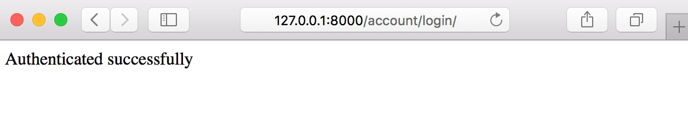

# 创建社交网站

我们将创建一个社交网站，让用户可以把网上看到的图片分享到网站来。这个社交网站包含如下功能：

- 一个供用户注册、登录、登出、修改和重置密码的用户身份验证系统，还能够让用户自行填写用户信息。
- 关注系统，让用户可以关注其他用户。
- 一个 JS 小书签工具，让用户可以将外部的图片分享（上传）到本站。
- 一个追踪系统，让用户可以看到他所关注的用户的上传内容。

## 启动社交网站项目

先创建社交网站 `bookmarks` 项目：

```bash
$ django-admin startproject bookmarks
```

然后到项目根目录内创建 `account` 应用：

```bash
$ cd bookmarks/
$ django-admin startapp account
```

然后在 `settings.py` 中的 `INSTALLED_APPS` 设置中激活该应用：

```python
INSTALLED_APPS = [
    'account.apps.AccountConfig',
    # ...
]
```

这里将我们的应用放在应用列表的最前边，原因是：我们稍后会为自己的应用编写验证系统的模板，Django 内置的验证系统自带了一套模板，如此设置可以让我们的模板覆盖其他应用中的模板设置。Django 按照 `INSTALLED_APPS` 中的顺序寻找模板。

之后执行数据迁移过程。

## 使用 Django 内置验证框架

django 提供了一个验证模块框架，具备用户验证，会话控制（`session`），权限和用户组功能并且自带一组视图，用于控制常见的用户行为如登录、登出、修改和重置密码。

验证模块框架位于 `django.contrib.auth`，也被其他 Django 的 `contrib` 库所使用。在创建超级用户的时候，就使用到了验证模块。

使用 `startproject` 命令创建一个新项目时，验证模块默认已经被设置并启用，包括 `INSTALLED_APPS` 设置中的 `django.contrib.auth` 应用，和 `MIDDLEWARE` 设置中的如下两个中间件：

- `AuthenticationMiddleware`：将用户与 HTTP 请求联系起来。
- `SessionMiddleware`：处理当前 HTTP 请求的 `session`。

中间件是一个类，在接收 HTTP 请求和发送 HTTP 响应的阶段被调用。

验证模块还包括如下数据模型：

- `User`：一个用户数数据表，包含如下主要字段：`username`，`password`，`email`，`first_name`，`last_name` 和 `is_active`。
- `Group`：一个用户组表格。
- `Permission`：存放用户和组的权限清单。

验证框架还包括默认的验证视图以及对应表单，稍后会使用到。

### 创建登录视图

从这节开始使用 Django 的验证模块，一个登录视图需要如下功能：

- 通过用户提交的表单获取用户名和密码。
- 将用户名和密码与数据库中的数据进行匹配。
- 检查用户是否处于活动状态。
- 通过在 HTTP 请求上附加 `session`，让用户进入登录状态。

首先需要创建一个登录表单，在 `account` 应用内创建 `forms.py` 文件，添加以下内容：

```python
from django import forms

class LoginForm(forms.Form):
    username = forms.CharField()
    password = forms.CharField(widget=forms.PasswordInput)
```

这是用户输入用户名和密码的表单。由于一般密码框不会明文显示，这里采用了 `widget=forms.PasswordInput`，令其在页面上显示为一个 `type="password"` 的 `input` 元素。

然后编辑 `account` 应用的 `views.py` 文件，添加如下代码：

```python
from django.shortcuts import render, HttpResponse
from django.contrib.auth import authenticate, login
from .forms import LoginForm

def user_login(request):
    if request.method == "POST":
        form = LoginForm(request.POST)
        if form.is_valid():
            cd = form.cleaned_data
            user = authenticate(request, username=cd['username'], password=cd['password'])
            if user is not None:
                if user.is_active:
                    login(request, user)
                    return HttpResponse("Authenticated successfully")
                else:
                    return HttpResponse("Disabled account")
            else:
                return HttpResponse("Invalid login")

    else:
        form = LoginForm()

    return render(request, 'account/login.html', {'form': form})
```

这是我们的登录视图，其基本逻辑是：当视图接受一个 GET 请求，通过 `form = LoginForm()` 实例化一个空白表单；如果接收到 POST 请求，则进行如下工作：

1. 通过 `form = LoginForm(request.POST)`，使用提交的数据实例化一个表单对象。
1. 通过调用 `form.is_valid()` 验证表单数据。如果未通过，则将当前表单对象展示在页面中。
1. 如果表单数据通过验证，则调用内置 `authenticate()` 方法。该方法接受 `request` 对象，`username` 和 `password` 三个参数，之后到数据库中进行匹配，如果匹配成功，会返回一个 `User` 数据对象；如果未找到匹配数据，返回 `None`。在匹配失败的情况下，视图返回一个登陆无效信息。
1. 如果用户数据成功通过匹配，则根据 `is_active` 属性检查用户是否为活动用户，这个属性是 Django 内置 `User` 模型的一个字段。如果用户不是活动用户，则返回一个消息显示不活动用户。
1. 如果用户是活动用户，则调用 `login()` 方法，在会话中设置用户信息，并且返回登录成功的消息。

> 注意区分内置的 `authenticate()` 和 `login()` 方法。`authenticate()` 仅到数据库中进行匹配并且返回 `User` 数据对象，其工作类似于进行数据库查询。而 `login()` 用于在当前会话中设置登录状态。二者必须搭配使用才能完成用户名和密码的数据验证和用户登录的功能。

现在需要为视图设置路由，在 `account` 应用下创建 `urls.py`，添加如下代码：

```python
from django.urls import path
from . import views

urlpatterns = [
    path('login/', views.user_login, name='login')，
]
```

然后编辑项目的根 `ulrs.py` 文件，导入 `include` 并且增加一行转发到 `account` 应用的二级路由配置：

```python
from django.conf.urls import path, include
from django.contrib import admin

urlpatterns = [
    path('admin/', admin.site.urls),
    path('account/', include('account.urls')),
]
```

之后需要配置模板。由于项目还没有任何模板，可以先创建一个母版，在 `account` 应用下创建如下目录和文件结构：

```bash
$ tree templates
templates
├── account
│   └── login.html
└── base.html
```

编辑 `base.html`，添加下列代码：

```django-html

<!DOCTYPE html>
<html>
<head>
    <title></title>
    <link href="" rel="stylesheet">
</head>
<body>
    <div id="header">
        <span class="logo">Bookmarks</span>
    </div>
    <div id="content">
        
        
    </div>
</body>
</html>
```

这是这个项目使用的母版。和上一个项目一样使用了 CSS 文件，你需要把 `static` 文件夹从源码复制到 `account` 应用目录下。这个母版有一个 `title` 块和一个 `content` 块用于继承。

之后编写 `account/login.html`：

```django-html


Log-in


<h1>Log-in</h1>
<p>Please, use the following form to log-in:</p>
    <form action="." method="post">
    {{ form.as_p }}
    
    <p><input type="submit" value="Log in"></p>
    </form>

```

这是供用户填写登录信息的页面，由于表单通过 Post 请求提交，所以需要 ``。

我们的站点还没有任何用户，建立一个超级用户，然后使用超级用户到 http://127.0.0.1:8000/admin/ 登录，会看到默认的管理后台：


使用管理后台添加一个用户，然后打开 http://127.0.0.1:8000/account/login/ ，可以看到如下登录界面：


填写刚创建的用户信息并故意留空表单然后提交，可以看到错误信息如下：


可能一些现代浏览器会阻止表单提交，修改模板关闭表单的浏览器验证即可。

再进行一些实验，如果输入不存在的用户名或密码，会得到无效登录的提示，如果输入了正确的信息，就会看到如下的登录成功信息：



### 使用内置验证视图

Django 内置很多视图和表单可供直接使用，上一节的登录视图就是一个很好的例子。在大多数情况下都可以使用 Django 内置的验证模块而无需自行编写。

Django 在 `django.contrib.auth.views` 中提供了如下基于类的视图供使用：

- `LoginView`：处理登录表单填写和登录功能（和我们写的功能类似）。
- `LogoutView`：退出登录。
- `PaswordChangeView`：处理一个修改密码的表单，然后修改密码。
- `PasswordChangeDoneView`：成功修改密码后执行的视图。
- `PasswordResetView`：用户选择重置密码功能执行的视图，生成一个一次性重置密码链接和对应的验证 token，然后发送邮件给用户。
- `PasswordResetDoneView`：通知用户已经发送给了他们一封邮件重置密码。
- `PasswordResetConfirmView`：用户设置新密码的页面和功能控制。
- `PasswordResetCompleteView`：成功重置密码后执行的视图。

上边的视图列表按照一般处理用户相关功能的顺序列出相关视图，在编写带有用户功能的站点时可以参考使用。这些内置视图的默认值可以被修改，比如渲染的模板位置和使用的表单等。

可以通过官方文档 https://docs.djangoproject.com/zh-hans/4.2/topics/auth/default/#all-authentication-views 了解更多内置验证视图的信息。

### 登录与登出视图

由于直接使用内置视图和内置数据模型，所以不需要编写模型与视图，来为内置登录和登出视图配置 URL，编辑 `account` 应用的 `urls.py` 文件，注释掉之前的登录方法，改成内置方法：

```python
from django.urls import path
from django.contrib.auth import views as auth_views
from . import views

urlpatterns = [
    # path('login/', views.user_login, name='login'),
    path('login/',auth_views.LoginView.as_view(redirect_authenticated_user=True),name='login'),
    path('logout/',auth_views.LogoutView.as_view(),name='logout'),
]
```

现在我们把登录和登出的 URL 导向了内置视图，然后需要为内置视图建立模板

在 `templates` 目录下新建 `registration` 目录，这个目录是内置视图默认到当前应用的模板目录里寻找具体模板的位置。

`django.contrib.admin` 模块中自带一些验证模板，用于管理后台使用。我们在 `INSTALLED_APPS` 中将 `account` 应用放到 `admin` 应用的上边，令 django 默认使用我们编写的模板。

在 `templates/registration` 目录下创建 `login.html` 并添加如下代码：

```django-html


Log-in


    <h1>Log-in</h1>
    
        <p>
        Your username and password didn't match.
        Please try again.
        </p>
    
        <p>Please, use the following form to log-in:</p>
    

    <div class="login-form">
        <form action="" method="post">
            {{ form.as_p }}
            
            <input type="hidden" name="next" value="{{ next }}">
            <p><input type="submit" value="Log-in"></p>
        </form>
    </div>


```

这个模板和刚才自行编写登录模板很类似。内置登录视图默认使用 `django.contrib.auth.forms` 里的 `AuthenticationForm` 表单，通过检查 `` 可以判断验证信息是否错误。注意我们添加了一个 `name` 属性为 `next` 的隐藏 `<input>` 元素，这是内置视图通过 Get 请求获得并记录 `next` 参数的位置，用于返回登录前的页面，例如 http://127.0.0.1:8000/account/login/?next=/account/ 。

`next` 参数必须是一个 URL 地址，如果具有这个参数，登录视图会在登录成功后将用户重定向到这个参数的 URL。

在 `registration` 目录下创建 `logged_out.html`：

```django-html



Logged out



<h1>Logged out</h1>
    <p>You have been successfully logged out. You can <a href="">log-in again</a>.</p>

```

这是用户登出之后显示的提示页面。

现在我们的站点已经可以使用用户登录和登出的功能了。现在还需要为用户制作一个登录成功后自己的首页，打开 `account` 应用的 `views.py` 文件，添加如下代码：

```python
from django.contrib.auth.decorators import login_required

@login_required
def dashboard(request):
    return render(request, 'account/dashboard.html', {'section': 'dashboard'})
```

使用 `@login_required` 装饰器，表示被装饰的视图只有在用户登录的情况下才会被执行，如果用户未登录，则会将用户重定向至 Get 请求附加的 `next` 参数指定的 URL。这样设置之后，如果用户在未登录的情况下，无法看到首页。

还定义了一个参数 `section`，可以用来追踪用户当前所在的功能板块。

现在可以创建首页对应的模板，在 `templates/account/` 目录下创建 `dashboard.html`：

```html
  Dashboard  
<h1>Dashboard</h1>
<p>Welcome to your dashboard.</p>

```

然后在 `account` 应用的 `urls.py` 里增加新视图对应的 URL：

```python
urlpatterns = [
# ...
path('', views.dashboard, name='dashboard'),
]
```

还需要在 `settings.py` 里增加如下设置：

```python
LOGIN_REDIRECT_URL = 'dashboard'
LOGIN_URL = 'login'
LOGOUT_URL = 'logout'
```

这三个设置分别表示：

- 如果没有指定 `next` 参数，登录成功后重定向的 URL。
- 用户需要登录的情况下被重定向到的 URL 地址（例如 `@login_required` 重定向到的地址）。
- 用户需要登出的时候被重定向到的 URL 地址。

这里都使用了 `path()` 方法中的 `name` 属性，以动态的返回链接。在这里也可以硬编码 URL。

总结一下我们现在做过的工作：

- 为项目添加内置登录和登出视图。
- 为两个视图编写模板并编写了首页视图和对应模板。
- 为三个视图配置了 URL。

最后需要在母版上添加登录和登出相关的展示。为了实现这个功能，必须根据当前用户是否登录，决定模板需要展示的内容。在内置函数 `LoginView` 成功执行之后，验证模块的中间件在 `HttpRequest` 对象上设置了用户对象 `User`，可以通过 `request.user` 访问用户信息。在用户未登录的情况下，`request.user` 也存在，是一个 `AnonymousUser` 类的实例。判断当前用户是否登录最好的方式就是判断 `User` 对象的 `is_authenticated` 只读属性。

编辑 `base.html`，修改 ID 为 `header` 的 `<div>` 标签：

```django-html
<div id="header">
<span class="logo">Bookmarks</span>
    
    <ul class="menu">
        <li class="selected"><a href="">My dashboard</a></li>
        <li class="selected"><a href="#">Images</a></li>
        <li class="selected"><a href="#">People</a></li>
    </ul>
    

    <span class="user">
        
        Hello {{ request.user.first_name }},{{ request.user.username }},<a href="">Logout</a>
            
            <a href="">Log-in</a>
        
    </span>

</div>
```

上边的视图只显示站点的菜单给已登录用户。还添加了了根据 `section` 的内容为 `<li>` 添加 CSS 类 `selected` 的功能，用于显示高亮当前的板块。最后对登录用户显示名称和登出链接，对未登录用户则显示登录链接。

现在启动项目，到 http://127.0.0.1:8000/account/login/ ，会看到登录页面，输入有效的用户名和密码并点击登录按钮，之后会看到如下页面：


> 如果用户已经登录同样跳转到该页面，需要设置 `LoginView.as_view` 的参数 `redirect_authenticated_user` 为 `True` 。

可以看到当前的 My dashboard 应用了 `selected` 类的 CSS 样式。当前用户的信息显示在顶部的右侧，点击登出链接，会看到如下页面：


可以看到用户已经登出，顶部的菜单栏已经不再显示，右侧的链接变为登录链接。

> 如果这里看到 Django 内置的管理站点样式的页面，检查 `settings.py` 文件中的 `INSTALLED_APPS` 设置，确保 `account` 应用在 `django.contrib.admin` 应用的上方。由于内置的视图和我们自定义的视图使用了相同的相对路径，Django 的模板加载器会使用先找到的模板。

### 修改密码视图

在用户登录之后需要允许用户修改密码，我们在项目中集成 Django 的内置修改密码相关的视图。编辑 `account` 应用的 `urls.py` 文件，添加如下两行 URL：

```python
    path('password_change/', auth_views.PasswordChangeView.as_view(), name='password_change'),
    path('password_change/done/', auth_views.PasswordChangeDoneView.as_view(), name='password_change_done'),
```

`PasswordChangeView` 视图会控制渲染修改密码的页面和表单，`PasswordChangeDoneView` 视图在成功修改密码之后显示成功消息。

之后要为两个视图创建模板，在 `templates/registration/` 目录下创建 `password_change_form.html`，添加如下代码：

```django-html



Change your password



<h1>Change your password</h1>
    <p>Use the form below to change your password.</p>
    <form action="." method="post" novalidate>
    {{ form.as_p }}
    <p><input type="submit" value="Change"></p>
    
    </form>

```

`password_change_form.html` 模板包含修改密码的表单，再在同一目录下创建 `password_change_done.html`：

```django-html



Password changed



<h1>Password changed</h1>
    <p>Your password has been successfully changed.</p>

```

`password_change_done.html` 模板包含成功创建密码后的提示消息。

启动服务，到 http://127.0.0.1:8000/account/password_change/ ，未登录时，URL 将会传递 `next` 参数，变成 http://127.0.0.1:8000/account/login/?next=/account/password_change/ ，成功登录之后可看到如下页面：


填写表单并修改密码，之后可以看到成功消息：


之后登出再登录，验证是否确实成功修改密码。

### 重置密码视图

编辑 `account` 应用的 `urls.py` 文件，添加如下对应到内置视图的 URL：

```python
path('password_reset/', auth_views.PasswordResetView.as_view(), name='password_reset'),
path('password_reset/done/', auth_views.PasswordResetDoneView.as_view(), name='password_reset_done'),
path('reset/<uidb64>/<token>/', auth_views.PasswordResetConfirmView.as_view(), name='password_reset_confirm'),
path('reset/done/', auth_views.PasswordResetCompleteView.as_view(), name='password_reset_complete'),
```

然后在 `account` 应用的 `templates/registration/` 目录下创建 `password_reset_form.html`：

```django-html



Reset your password



<h1>Forgotten your password?</h1>
    <p>Enter your e-mail address to obtain a new password.</p>
    <form action="." method="post" novalidate>
    {{ form.as_p }}
    
    <p><input type="submit" value="Send e-mail"></p>
    </form>

```

在同一目录下创建发送邮件的页面 `password_reset_email.html`，添加如下代码：

```django-html
Someone asked for password reset for email {{ email }}. Follow the link
below:
{{ protocol }}://{{ domain }}
Your username, in case you've forgotten: {{ user.get_username }}
```

这个模板用来渲染向用户发送的邮件内容。

之后在同一目录再创建 `password_reset_done.html`，表示成功发送邮件的页面：

```django-html



Reset your password



<h1>Reset your password</h1>
<p>We've emailed you instructions for setting your password.</p>
<p>If you don't receive an email, please make sure you've entered the
address you registered with.</p>

```

然后创建重置密码的页面 `password_reset_confirm.html`，这个页面是用户从邮件中打开链接后经过视图处理后返回的页面：

```django-html


Reset your password


    <h1>Reset your password</h1>
    
        <p>Please enter your new password twice:</p>
        <form action="." method="post">
            {{ form.as_p }}
            
            <p><input type="submit" value="Change my password"/></p>
        </form>
    
        <p>The password reset link was invalid, possibly because it has
            already been used. Please request a new password reset.</p>
    

```

这个页面里有一个变量 `validlink`，表示用户点击的链接是否有效，由 `PasswordResetConfirmView` 视图传入模板。如果有效就显示重置密码的表单，如果无效就显示一段文字说明链接无效。

在同一目录内建立 `password_reset_complete.html`：

```django-html

Password reset

<h1>Password set</h1>
<p>Your password has been set. You can <a href="">log in
now</a></p>

```

最后编辑 `registration/login.html`，在 `<form>` 元素之后加上如下代码，为页面增加重置密码的链接：

```django-html
<p><a href="">Forgotten your password?</a></p>
```

之后在浏览器中打开 http://127.0.0.1:8000/account/login/ ，点击 Forgotten your password？链接，会看到如下页面：


这里必须在 `settings.py` 中配置 SMTP 服务器，在第二章中已经学习过配置 STMP 服务器的设置。如果确实没有 SMTP 服务器，可以增加一行：

```python
EMAIL_BACKEND = 'django.core.mail.backends.console.EmailBackend'
```

以让 Django 将邮件内容输出到命令行窗口中。

返回浏览器，填入一个已经存在的用户的电子邮件地址，之后点 SEND E-MAIL 按钮，会看到如下页面：


此时看一下启动 Django 站点的命令行窗口，会打印如下邮件内容（或者到信箱中查看实际收到的电子邮件）：

```bash
Content-Type: text/plain; charset="utf-8"
MIME-Version: 1.0
Content-Transfer-Encoding: 7bit
Subject: Password reset on 127.0.0.1:8000
From: webmaster@localhost
To: user@domain.com
Date: Fri, 15 Dec 2017 14:35:08 -0000
Message-ID: <20150924143508.62996.55653@zenx.local>
Someone asked for password reset for email user@domain.com. Follow the link
below:
http://127.0.0.1:8000/account/reset/MQ/45f-9c3f30caafd523055fcc/
Your username, in case you've forgotten: zenx
```

这个邮件的内容就是 `password_reset_email.html` 经过渲染之后的实际内容。其中的 URL 指向视图动态生成的链接，将这个 URL 复制到浏览器中打开，会看到如下页面：


这个页面使用 `password_reset_confirm.html` 模板生成，填入一个新密码然后点击 CHANGE MY PASSWORD 按钮，Django 会用你输入的内容生成加密后的密码保存在数据库中，然后会看到如下页面：


现在就可以使用新密码登录了。这里生成的链接只能使用一次，如果反复打开该链接，会收到无效链接的错误。

我们现在已经集成了 Django 内置验证模块的主要功能，在大部分情况下，可以直接使用内置验证模块。也可以自行编写所有的验证程序。

在第一个项目中，我们提到为应用配置单独的二级路由，有助于应用的复用。现在的 `account` 应用的 `urls.py` 文件中所有配置到内置视图的 URL，可以用如下一行来代替：

```python
urlpatterns = [
    # ...
    path('', include('django.contrib.auth.urls')),
]
```

可以在 github 上看到 `django.contrib.auth.urls` 的源代码：https://github.com/django/django/blob/stable/4.2.x/django/contrib/auth/urls.py 。

## 用户注册与用户信息

已经存在的用户现在可以登录、登出、修改和重置密码了。现在需要建立一个功能让用户注册。

### 用户注册

为用户注册功能创建一个简单的视图：先建立一个供用户输入用户名、姓名和密码的表单。编辑 `account` 应用的 `forms.py` 文件，添加如下代码：

```python
from django.contrib.auth.models import User

class userRegistrationForm(forms.ModelForm):
password = forms.CharField(label='password', widget=forms.PasswordInput)
password2 = forms.CharField(label='Repeat password', widget=forms.PasswordInput)

    class Meta:
        model = User
        fields = ('username','first_name','email')

    def clean_password2(self):
        cd = self.cleaned_data
        if cd['password'] != cd['password2']:
            raise forms.ValidationError(r"Password don't match.")
        return cd['password2']
```

这里通过用户模型建立了一个模型表单，只包含 `username`，`first_name` 和 `email` 字段。这些字段会根据 `User` 模型中的设置进行验证，比如如果输入了一个已经存在的用户名，则验证不会通过，因为 `username` 字段被设置了 `unique=True`。添加了两个新的字段 `password` 和 `password2`，用于用户输入并且确认密码。定义了一个 `clean_password2()` 方法用于检查两个密码是否一致，这个方法是一个验证器方法，会在调用 `is_valid()` 方法的时候执行。可以对任意的字段采用 `clean_<fieldname>()` 方法名创建一个验证器。`Forms` 类还拥有一个 `clean()` 方法用于验证整个表单，可以方便的验证彼此相关的字段。

> 这里必须了解表单的验证顺序。`clean_password2()` 方法中使用了 `cd['password2']`；为什么验证器还没有执行完毕的时候，`cleaned_data` 中已经存在 `password2` 数据了呢？[这里](https://www.cnblogs.com/ccorz/p/5868380.html)有一篇介绍 django 验证表单顺序的文章，可以看到，在执行自定义验证器之前，已经执行了每个字段的 `clean()` 方法，这个方法仅针对字段本身的属性进行验证，只要这个通过了，`cleaned_data` 中就有了数据，之后才执行自定义验证器，最后执行 `form.clean()` 完成验证。如果过程中任意时候抛出 ` ValidationError``，cleaned_data ` 里就会只剩有效的值，`errors` 属性内就有了错误信息。

关于用户注册，Django 提供了一个位于 `django.contrib.auth.forms` 的 `UserCreationForm` 表单供使用，和我们自行编写的表单非常类似。

编辑 `account` 应用的 `views.py` 文件，添加如下代码：

```python
from .forms import LoginForm, UserRegistrationForm

def register(request):
    if request.method == "POST":
        user_form = UserRegistrationForm(request.POST)
        if user_form.is_valid():
            # 建立新数据对象但是不写入数据库
            new_user = user_form.save(commit=False)
            # 设置密码
            new_user.set_password(user_form.cleaned_data['password'])
            # 保存User对象
            new_user.save()
            return render(request, 'account/register_done.html', {'new_user': new_user})
    else:
        user_form = UserRegistrationForm()
    return render(request, 'account/register.html', {'user_form': user_form})
```

这个视图逻辑很简单，我们使用了 `set_password()` 方法设置加密后的密码。

再配置 `account` 应用的 `urls.py` 文件，添加如下的 URL 匹配:

```python
    path('register/', views.register, name='register'),
```

在 `templates/account/` 目录下创建模板 `register.html`，添加如下代码：

```django-html



Create an account



<h1>Create an account</h1>
    <p>Please, sign up using the following form：</p>
    <form action="." method="post" novalidate>
    {{ user_form.as_p }}
    
    <p><input type="submit" value="Register"></p>
    </form>

```

在同一目录下创建 `register_done.html` 模板，用于显示注册成功后的信息：

```django-html



Welcome



    <h1>Welcome {{ new_user.first_name }}!</h1>
    <p>Your account has been successfully created. Now you can <a href="">log in</a>.</p>

```

现在可以打开 http://127.0.0.1:8000/account/register/ ，看到注册界面如下：


填写表单并点击 CREATE MY ACCOUNT 按钮，如果表单正确提交，会看如下成功页面：


### 扩展用户模型

Django 内置验证模块的 `User` 模型只有非常基础的字段信息，可能需要额外的用户信息。最好的方式是建立一个用户信息模型，然后通过一对一关联字段，将用户信息模型和用户模型联系起来。

编辑 `account` 应用的 `models.py` 文件，添加以下代码：

```python
from django.db import models
from django.conf import settings


class Profile(models.Model):
    user = models.OneToOneField(settings.AUTH_USER_MODEL, on_delete=models.CASCADE)
    date_of_birth = models.DateField(blank=True, null=True)
    photo = models.ImageField(upload_to='user/%Y/%m/%d/', blank=True)

    def __str__(self):
        return "Profile for user {}".format(self.user.username)
```

为了保持代码通用性，使用 `get_user_model()` 方法来获取用户模型；当定义其他表与内置 `User` 模型的关系时使用 `settings.AUTH_USER_MODEL` 指代 `User` 模型。

这个 `Profile` 模型的 `user` 字段是一个一对一关联到用户模型的关系字段。将 `on_delete` 设置为 `CASCADE`，当用户被删除时，其对应的信息也被删除。这里还有一个图片文件字段，必须安装 Python 的 `Pillow` 库才能使用图片文件字段，在系统命令行中输入：

```bash
pip install Pillow
```

由于我们要允许用户上传图片，必须配置 Django 让其提供媒体文件服务，在 `settings.py` 中加入下列内容：

```python
MEDIA_URL = '/media/'
MEDIA_ROOT = os.path.join(BASE_DIR, 'media')
```

`MEDIA_URL` 表示存放和提供用户上传文件的 URL 路径，`MEDIA_ROOT` 表示实际媒体文件的存放目录。这里都采用相对地址动态生成 URL。

来编辑一下 `bookmarks` 项目的根 `urls.py`，修改其中的代码如下:

```python
from django.contrib import admin
from django.urls import path, include
from django.conf import settings
from django.conf.urls.static import static

urlpatterns = [
    path('admin/', admin.site.urls),
    path('account/', include('account.urls')),
]

if settings.DEBUG:
    urlpatterns += static(settings.MEDIA_URL,document_root=settings.MEDIA_ROOT)
```

这样设置后，Django 开发服务器在 `DEBUG=True` 的情况下会提供媒体文件服务。

`static()` 方法仅用于开发环境，在生产环境中，不要用 Django 提供静态文件服务（而是用 Web 服务程序比如 NGINX 等提供静态文件服务）。

建立了新的模型之后需要执行数据迁移过程。之后将新的模型加入到管理后台，编辑 `account` 应用的 `admin.py` 文件，将 `Profile` 模型注册到管理后台中：

```python
from django.contrib import admin
from .models import Profile

@admin.register(Profile)
class ProfileAdmin(admin.ModelAdmin):
    list_display = ['user', 'date_of_birth', 'photo']
```

启动站点，打开 http://127.0.0.1:8000/admin/ ，可以在管理后台中看到新增的模型：


现在需要让用户填写额外的用户信息，为此需要建立表单，编辑 `account` 应用的 `forms.py` 文件：

```python
from .models import Profile

class UserEditForm(forms.ModelForm):
    class Meta:
        model = User
        fields = ('first_name', 'last_name', 'email')

class ProfileEditForm(forms.ModelForm):
    class Meta:
        model = Profile
        fields = ('date_of_birth', 'photo')
```

这两个表单解释如下：

- `UserEditForm`：这个表单依据 `User` 类生成，让用户输入姓，名和电子邮件。
- `ProfileEditForm`：这个表单依据 `Profile` 类生成，可以让用户输入生日和上传一个头像。

之后建立视图，编辑 `account` 应用的 `views.py` 文件，导入 `Profile` 模型：

```python
from .models import Profile
```

然后在 `register` 视图的 `new_user.save()`下增加一行：

```python
Profile.objects.create(user=new_user)
```

当用户注册的时候，会自动建立一个空白的用户信息关联到用户。在之前创建的用户，则必须在管理后台中手工为其添加对应的 `Profile` 对象

还必须让用户可以编辑他们的信息，在同一个文件内添加下列代码：

```python
from .forms import LoginForm, UserRegistrationForm, UserEditForm, ProfileEditForm

@login_required
def edit(request):
    if request.method == "POST":
        user_form = UserEditForm(instance=request.user, data=request.POST)
        profile_form = ProfileEditForm(instance=request.user.profile, data=request.POST, files=request.FILES)
        if user_form.is_valid() and profile_form.is_valid():
            user_form.save()
            profile_form.save()
    else:
        user_form = UserEditForm(instance=request.user)
        profile_form = ProfileEditForm(instance=request.user.profile)

    return render(request, 'account/edit.html', {'user_form': user_form, 'profile_form': profile_form})
```

这里使用了 `@login_required` 装饰器，因为用户必须登录才能编辑自己的信息。我们使用 `UserEditForm` 表单存储内置的 `User` 类的数据，用 `ProfileEditForm` 存放 `Profile` 类的数据。然后调用 `is_valid()` 验证两个表单数据，如果全部都通过，将使用 `save()` 方法写入数据库。

> 译者注：原书没有解释 `instance` 参数。`instance` 用于指定表单类实例化为某个具体的数据对象。在这个例子里，将 `UserEditForminstance` 指定为 `request.user` `表示该对象是数据库中当前登录用户那一行的数据对象，而不是一个空白的数据对象，ProfileEditForm` 的 `instance` 属性指定为当前用户对应的 `Profile` 类中的那行数据。这里如果不指定 `instance` 参数，则变成向数据库中增加两条新记录，而不是修改原有记录。

之后编辑 `account` 应用的 `urls.py` 文件，为新视图配置 URL：

```python
    path('edit/', views.edit, name='edit'),
```

最后，在 `templates/account/` 目录下创建 `edit.html`，添加如下代码：

```django-html
{#edit.html#}



Edit your account



<h1>Edit your account</h1>
    <p>You can edit your account using the following form:</p>
    <form action="." method="post" enctype="multipart/form-data" novalidate>
    {{ user_form.as_p }}
    {{ profile_form.as_p }}
    
        <p><input type="submit" value="Save changes"></p>
    </form>

```

由于这个表单可能处理用户上传头像文件，所以必须设置 `enctype="multipart/form-data`。我们采用一个 HTML 表单同时提交 `user_form` 和 `profile_form` 表单。

启动站点，注册一个新用户，然后打开 http://127.0.0.1:8000/account/edit/ ，可以看到页面如下：


现在可以在用户登录后的首页加上修改用户信息的链接了，打开 `account/dashboard.html`，找到下边这行：

```python
<p>Welcome to your dashboard.</p>
```

将其替换为：

```python
<p>Welcome to your dashboard. You can <a href="">edit your profile</a> or <a href="">change your password</a>.</p>
```

用户现在可以通过登录后的首页修改用户信息，打开 http://127.0.0.1:8000/account/ 然后可以看到新增了修改用户信息的链接，页面如下：


#### 使用自定义的用户模型

Django 提供了使用自定义的模型替代内置 `User` 模型的方法，需要编写自定义的类继承 `AbstractUser` 类。这个 `AbstractUser` 类提供了默认的用户模型的完整实现，作为一个抽象类供其他类继承。关于模型的继承将在本书最后一个项目中学习。可以在 https://docs.djangoproject.com/zh-hans/4.2/topics/auth/customizing/#substituting-a-custom-user-model 找到关于自定义用户模型的详细信息。

使用自定义用户模型比起默认内置用户模型可以更好的满足开发需求，但需要注意的是会影响一些使用 Django 内置用户模型的第三方应用。

### 使用消息框架

当用户在我们的站点执行各种操作时，在一些关键操作可能需要通知用户其操作是否成功。Django 有一个内置消息框架可以给用户发送一次性的通知。

消息模块位于 `django.contrib.messages`，并且已经被包含在初始化的 `INSTALLED_APPS` 设置中，还有一个默认启用的中间件叫做 `django.contrib.messages.middleware.MessageMiddleware`，共同构成了消息系统。

消息框架提供了非常简单的方法向用户发送通知：默认在 `cookie` 中存储消息内容（根据 `session` 的存储设置），然后会在下一次 HTTP 请求的时候在对应的响应上附加该信息。导入消息模块并且在视图中使用很简单的语句就可以发送消息，例如：

```python
from django.contrib import messages
messages.error(request, 'Something went wrong')
```

这样就在请求上附加了一个错误信息。可以使用 `add_message()` 或如下的方法创建消息：

- `success()`：一个动作成功之后发送的消息。
- `info()`：通知性质的消息。
- `warning()`：警告性质的内容，所谓警告就是还没有失败但很可能失败的情况。
- `error()`：错误信息，通知操作失败。
- `debug()`：除错信息，给开发者展示，在生产环境中需要被移除。

在我们的站点中增加消息内容。由于消息是贯穿整个网站的，所以打算将消息显示的部分设置在母版中，编辑 `base.html`，在 ID 为 `header` 的 `<div>` 标签和 ID 为 `content` 的 `<div>` 标签之间增加下列代码：

```django-html

    <ul class="messages">
        
            <li class="{{ message.tags }}">{{ message|safe }}<a href="#" class="close">X</a></li>
        
    </ul>

```

在模板中使用了 `messages` 变量，在后文可以看到视图并未向模板传入该变量。这是因为在 `settings.py` 中的 `TEMPLATES` 设置中，`context_processors` 的设置中包含 `django.contrib.messages.context_processors.messages` 这个上下文管理器，从而为模板传入了 `messages` 变量，而无需经过视图。默认情况下可以看到还有 `debug`，`request` 和 `auth` 三个上下文处理器。其中后两个就是我们在模板中可以直接使用 `request.user` 而无需传入该变量，也无需为 `request` 对象添加 `user` 属性的原因。

之后来修改 `account` 应用的 `views.py` 文件，导入 `messages`，然后编辑 `edit` 视图：

```python
from django.contrib import messages

@login_required
def edit(request):
    if request.method == "POST":
        user_form = UserEditForm(instance=request.user, data=request.POST)
        profile_form = ProfileEditForm(instance=request.user.profile, data=request.POST, files=request.FILES)
        if user_form.is_valid() and profile_form.is_valid():
            user_form.save()
            profile_form.save()
            messages.success(request, 'Profile updated successfully')
        else:
            messages.error(request, "Error updating your profile")
    else:
        user_form = UserEditForm(instance=request.user)
        profile_form = ProfileEditForm(instance=request.user.profile)

    return render(request, 'account/edit.html', {'user_form': user_form, 'profile_form': profile_form})
```

为视图增加了两条语句，分别在成功登录之后显示成功信息，在表单验证失败的时候显示错误信息。

浏览器中打开 http://127.0.0.1:8000/account/edit/ ，编辑用户信息，之后可以看到成功信息如下：


故意填写通不过验证的数据，则可以看到错误信息如下：


关于消息框架的更多信息，可以查看官方文档：https://docs.djangoproject.com/zh-hans/4.2/ref/contrib/messages/ 。

## 创建自定义验证后端

Django 允许对不同的数据来源采用不同的验证方式。在 `settings.py` 里有一个 `AUTHENTICATION_BACKENDS` 设置列出了项目中可使用的验证后端。其默认是：

```python
    ['django.contrib.auth.backends.ModelBackend']
```

默认的 `ModelBackend` 通过 `django.contrib.auth` 后端进行验证，这对于大部分项目已经足够。然而我们也可以创建自定义的验证后端，用于满足个性化需求，比如 `LDAP` 目录或者来自于其他系统的验证。

关于自定义验证后端可以参考官方文档：https://docs.djangoproject.com/zh-hans/4.2/topics/auth/customizing/#other-authentication-sources 。

每次使用内置的 `authenticate()` 函数时，Django 会按照 `AUTHENTICATION_BACKENDS` 设置中列出的顺序，依次执行其中的验证后端进行验证工作，直到有一个验证后端返回成功为止。如果列表中的后端全部返回失败，则这个用户就不会被认证通过。

Django 提供了一个简单的规则用于编写自定义验证后端：一个验证后端必须是一个类，至少提供如下两个方法：

- `authenticate()`：参数为 `request` 和用户验证信息，如果用户验证信息有效，必须返回一个 `user` 对象，否则返回 `None`。`request` 参数必须是一个 `HttpRequest` 对象或者是 `None`。
- `get_user()`：参数为用户的 ID，返回一个 `user` 对象。

我们来编写一个采用电子邮件（而不是 `username` 字段）和密码登录的验证后端，编写验证后端就和编写一个 Python 的类没有什么区别：

```python
from django.contrib.auth.models import User


class EmailAuthBackend:
    """
    Authenticate using an e-mail address.
    """

    def authenticate(self, request, username=None, password=None):
        try:
            user = User.objects.get(email=username)
            if user.check_password(password):
                return user
            return None
        except User.DoesNotExist:
            return None

    def get_user(self, user_id):
        try:
            return User.objects.get(id=user_id)
        except User.DoesNotExist:
            return None
```

以上代码是一个简单的验证后端。`authenticate()` 方法接受 `request` 对象和 `username` 及 `password` 作为可选参数，这里可以用任何自定义的参数名称，我们使用 `username` 及 `password` 是为了可以与内置验证框架配合工作。两个方法工作流程如下：

- `authenticate()`：尝试使用电子邮件和密码获取用户对象，采用 `check_password()`方法验证加密后的密码。
- `get_user()`：通过 `user_id` 参数获取用户 ID，在会话存续 Django 会使用内置的验证后端去验证并取得 `User` 对象。

编辑 `settings.py` 文件增加：

```python
AUTHENTICATION_BACKENDS = [
    'django.contrib.auth.backends.ModelBackend',
    'account.authentication.EmailAuthBackend',
]
```

在上边的设置里，我们将自定义验证后端加到了默认验证的后边。打开 http://127.0.0.1:8000/account/login/ ，注意 Django 尝试使用所有的验证后端，所以我们现在可以使用用户名或者电子邮件来登录，填写的信息会先交给 `ModelBackend` 进行验证，如果没有得到用户对象，就会使用我们的 `EmailAuthBackend` 进行验证。

`AUTHENTICATION_BACKENDS` 中的顺序很重要，如果一个用户信息对于多个验证后端都有效，Django 会停止在第一个成功验证的后端处。

## 第三方认证登录

很多社交网站除了注册用户之外，提供了链接可以快速的通过第三方平台的用户信息进行登录，我们也可以为自己的站点添加例如 Facebook，Twitter 或 Google 的第三方认证登录功能。Python Social Auth 是一个提供第三方认证登录的模块。使用这个模块可以让用户以第三方网站的信息进行登录，而无需先注册本网站的用户。这个模块的源码在 https://github.com/python-social-auth 。

这个模块支持很多不同的 Python Web 框架，其中也包括 Django，通过以下命令安装：

```bash
pip install social-auth-app-django
```

然后将应用名 `social_django` 添加到 `settings.py` 文件的 `INSTALLED_APPS` 设置中：

```python
INSTALLED_APPS = [
    #...
    'social_django',
]
```

该应用自带了数据模型，所以需要执行数据迁移过程。执行之后可以在数据库中看到新增 `social_auth` 开头的一系列数据表。Python 的 `social auth` 模块具体支持的第三方验证服务，可以查看官方文档：https://python-social-auth.readthedocs.io/en/latest/backends/index.html#supported-backends 。

译者注：Facebook，Twitter 和 Google 的第三方验证均通过 OAuth2 认证，而且操作方式基本相同。以下仅以 Google 为例子进行翻译：

需要先把第三方认证的 URL 添加到项目中，编辑 `bookmarks` 项目的根 `urls.py`：

```python
urlpatterns = [
    path('admin/', admin.site.urls),
    path('account/', include('account.urls')),
    path('social-auth/', include('social_django.urls', namespace='social')),
]
```

一些网站的第三方验证接口不允许将验证后的地址重定向到类似 `127.0.0.1` 或者 `localhost` 这种本地地址，为了正常使用第三方验证服务，需要一个正式域名，可以通过修改 `Hosts` 文件。如果是 Linux 或 macOS X 下，可以编辑 `/etc/hosts` 加入一行：

```bash
127.0.0.1 mysite.com
```

这样会将 `mysite.com` 域名对应到本机地址。如果是 Windows 环境，可以在 `C:\Windows\System32\Drivers\etc\hosts` 找到 `hosts` 文件。

为了测试该设置是否生效，启动站点然后在浏览器中打开 http://mysite.com:8000/account/login/ ，会得到如下错误信息：


这是因为 Djanog 在 `settings.py` 中的 `ALLOWED_HOSTS` 设置中，仅允许对此处列出的域名提供服务，这是为了防止 HTTP 请求头攻击。关于该设置可以参考官方文档： https://docs.djangoproject.com/zh-hans/4.2/ref/settings/#allowed-hosts 。

编辑 `settings.py` 文件然后修改 `ALLOWED_HOSTS` 为如下：

```python
ALLOWED_HOSTS = ['mysite.com', 'localhost', '127.0.0.1']
```

在 `mysite.com` 之外，我们增加了 `localhost` 和 `127.0.0.1`，其中 `localhost` 是在 `DEBUG=True` 和 `ALLOWED_HOSTS` 留空情况下的默认值，现在就可以通过 http://mysite.com:8000/account/login/ 正常访问开发网站了。

### 使用 Google 第三方认证

Google 提供 OAuth2 认证，详细文档可以参考：https://developers.google.com/identity/protocols/OAuth2 。

为使用 Google 的第三方认证服务，将以下验证后端添加到 `settings.py` 的 `AUTHENTICATION_BACKENDS` 中：

```python
AUTHENTICATION_BACKENDS = [
    'django.contrib.auth.backends.ModelBackend',
    'account.authentication.EmailAuthBackend',
    'social_core.backends.google.GoogleOAuth2',
]
```

需要到 Google 开发者网站创建一个 API key，按照以下步骤操作：

1. 打开 https://console.developers.google.com/apis/credentials ，点击屏幕左上方 Google APIs 字样右边的选择项目，会弹出项目对话框，点击右上方的新建项目，如图所示：

   

2. 填写新建项目的信息，项目名称为 `Bookmarks`，位置可以不选，之后点击创建按钮，如下图所示：

   

3. 之后与步骤 1 中的步骤类似，点开选择项目，选中刚建立的 `Bookmarks` 项目，然后点击右下方的打开。
4. 会自动跳转到一个页面提示尚未创建 API 凭据，点击页面中的创建凭据按钮，并选择第二项 OAuth 客户端 ID，如下图所示：
   

5. 之后会进入一个界面，要求必须配置 OAuth 同意屏幕，如下图所示：

   

6. 点击右侧的配置同意屏幕按钮，之后进入到 OAuth 同意屏幕，里边有一系列设置。在应用名称中填入 `Bookmarks`，默认支持电子邮件为你自己的电子邮件地址，可以修改为其他地址，在已获授权的网域中填入 `mysite.com`，之后点击保存，如图所示：

   

7. 此时会跳转到步骤 5 的问题页面，选择网页应用，之后会被要求填写辅助信息，在名称中填写 `Bookmarks`，已获授权的重定向 URI 中填写 http://mysite.com:8000/social-auth/complete/google-oauth2/ ，如下图所示：

   v

8. 点击创建按钮，即可在页面中看到当前 API 的 ID 和密钥，如图所示：

   

9. 将 API ID 和密钥填写到 `settings.py` 文件中，增加如下两行：

   ```python
   SOCIAL_AUTH_GOOGLE_OAUTH2_KEY = 'XXX' # API ID
   SOCIAL_AUTH_GOOGLE_OAUTH2_SECRET = 'XXX' # 密钥
   ```

10. 点击确认关闭对话框，之后在左侧菜单的凭据菜单内可以回到此处查看 ID 和密钥。现在点击左侧菜单的库，会跳转到欢迎使用新版 API 库的界面，在其中找到 Google+ API，如图所示：

    

11. 点击 Google+ API，在弹出的页面中选择启用，如图所示：

    

在 Google 中的配置就全部结束了，生成了一个 OAuth2 认证的 ID 和密钥，之后我们就将采用这些信息与 Google 进行通信。

然后编辑 `account` 应用的 `registration/login.html` 模板，在 `content` 块的内部最下方增加用于进行 Google 第三方认证登录的链接：

```django-html
<div class="social">
    <ul>
        <li class="google"><a href="">Log in with Google</a></li>
    </ul>
</div>
```

打开 http://mysite.com:8000/account/login/ ，可以看到如下页面：


点击 Login with Google 按钮，使用 Google 账户登录后，就会被重定向到我们网站的登录首页。

我们现在就为项目增加了第三方认证登录功能，即使是没有在本站注册的用户，也可以快捷的进行登录了。

译者注：这里有一个小问题，就是通过第三方登录进来的用户，检查 `auth_user` 表会发现其实用户信息已经被写入到了该表里，但是 `Profile` 表没有写入对应的外键字段，导致第三方认证用户在修改用户信息时会报错。很多网站的做法是：通过第三方验证进来的用户，必须捆绑到本站已经存在的账号中。这里我们简化一下处理，当用户修改字段的 Get 请求进来时，检测 `Profile` 表中该用户的外键是不是存在，如果不存在，就新建对应该用户的 `Profile` 对象，然后再用这个数据对象返回表单实例供填写。修改后的 `edit` 视图如下：

```python
@login_required
def edit(request):
    if request.method == "POST":
        user_form = UserEditForm(instance=request.user, data=request.POST)
        profile_form = ProfileEditForm(instance=request.user.profile, data=request.POST, files=request.FILES)
        if user_form.is_valid() and profile_form.is_valid():
            user_form.save()
            profile_form.save()
            messages.success(request, 'Profile updated successfully')
        else:
            messages.error(request, "Error updating your profile")
    else:
        try:
            Profile.objects.get(user=request.user)
        except Profile.DoesNotExist:
            Profile.objects.create(user=request.user)
        user_form = UserEditForm(instance=request.user)
        profile_form = ProfileEditForm(instance=request.user.profile)

    return render(request, 'account/edit.html', {'user_form': user_form, 'profile_form': profile_form})
```

# 内容分享功能

## 创建图片分享功能

我们的站点将让用户可以收藏然后分享他们在互联网上看到的图片到本站来，为此将要做以下工作：

- 用一个数据类存放图片和相关信息
- 建立表单和视图用于处理图片上传
- 需要建立一个系统，让用户将外站图片贴到本站来。

这是一个独立与用户验证系统的新功能，为此新建一个应用 `images`：

```bash
$ django-admin startapp images
```

然后在 `settings.py` 中激活该应用：

```python
INSTALLED_APPS = [
    # ...
    'images.apps.ImagesConfig',
]
```

### 创建图片模型

编辑 `images` 应用的 `models.py` 文件，添加如下代码：

```python
from django.db import models
from django.conf import settings


class Image(models.Model):
    user = models.ForeignKey(settings.AUTH_USER_MODEL, related_name='images_created', on_delete=models.CASCADE)
    title = models.CharField(max_length=200)
    slug = models.SlugField(max_length=200,blank=True)
    url = models.URLField()
    image = models.ImageField(upload_to='images/%Y/%m/%d')
    description = models.TextField(blank=True)
    created = models.DateField(auto_now_add=True,db_index=True)

    def __str__(self):
        return self.title
```

这是我们用于存储图片的模型，来看一下具体的字段：

- `user`：这是一个连接到 `User` 模型的外键，体现了用户与图片的一对多关系，即一个用户可以上传多个图片。
- `title`：图片的名称。
- `slug`：该图片的简称，用于动态建立该图片的 URL。
- `image`：图片文件字段，用于存放图片。
- `description`：可选的关于图片的描述。
- `created`：图片分享到本站来的时间，使用了 `auto_now_add` 自动生成创建时间，并且使用了 `db_index=True` 创建索引。

> 数据库索引可以有效的提高数据库查询效率。对于频繁使用 `filter()`，`exclude()` 或者 `order_by()` 等方法的字段推荐创建字段。`ForeignKey` 和设置了 `unique=True` 的字段默认会被创建索引。还可以使用 `Meta.index_together` 创建联合索引。

这里我们需要自定义该模型的行为，重写 `Image` 模型的 `save()` 方法，使图片在保存到数据库时，自动根据 `title` 字段生成 `slug` 字段的内容。导入 `slugify()` 然后为 `Image` 模型添加一个 `save()` 方法：

```python
from django.utils.text import slugify

class Image(models.Model):
    # ......

    def save(self, *args, **kwargs):
        if not self.slug:
            self.slug = slugify(self.title)
        super(Image, self).save(*args, **kwargs)
```

在这段代码里，使用了 Django 内置的 `slugify()` 自动生成了 `slug` 字段的内容。之后调用超类的方法保存图片，这样用户无需手工输入。

### 创建多对多关系

我们将在 `Image` 模型中再添加一个外键，用于存储哪些用户喜欢该图片。由于一个用户可能喜欢多个图片，一个图片也可能被多个用户喜欢，因此图片和用户之间多对多的关系，需要修改 `Image` 模型添加如下字段：

```python
    users_like = models.ManyToManyField(settings.AUTH_USER_MODEL, related_name='images_liked', blank=True)
```

当定义了 `ManyToManyField` 多对多外键字段时，Django 会创建一张中间表，中间表分别通过外键关联到当前的模型和 `ManyToManyField()` 的第一个参数对应的模型，多对多关系可以用于任意两个有关系的模型。

与 `ForeignKey` 一样，`related_name` 属性定义了多对多字段反向查询的名称，多对多字段提供了一个多对多模型管理器用来进行查询，类似 `image.users_like.all()`，如果是从 `user` 对象查询，则类似 `user.images_liked.all()`。

之后进行 `Image` 类的数据迁移。

### 添加图片模型至管理后台

编辑 `images` 应用的 `admin.py` 文件，将 `Image` 类添加至管理后台：

```python
from django.contrib import admin
from .models import Image

@admin.register(Image)
class ImageAdmin(admin.ModelAdmin):
    list_display = ['title', 'slug', 'image', 'created']
    list_filter = ['created']
```

启动站点，打开 http://127.0.0.1:8000/admin/ ，可以看到 `Image` 已经被加入管理后台，如图所示：


## 从外站分享内容至本站

我们实现用户将外站图片分享到本站的方式是：用户提供图片的 URL，一个标题和可选的秒数，我们的站点会将该图片下载下来，建立一个对应的新 `Image` 对象，然后保存进数据库。

已经建立完了图片模型，这里我们需要建立一个表单供用户提交图片信息。在 `Images` 应用下建立 `forms.py` 文件，然后添加如下代码：

```python
from django import forms
from .models import Image

class ImageCreateForm(forms.ModelForm):
    class Meta:
        model = Image
        fields = ('title', 'url', 'description',)
        widgets = {
            'url': forms.HiddenInput, # 设置 url 属性
        }
```

这里使用了 `ModelForm` 类，基于 `Image` 模型创建了表单，仅包含 `title`，`url` 和 `description` 字段。用户无需直接在表单中输入图片 URL，我们将使用一个 JavaScript 小书签程序来从外站选择一个图片并将其 URL 作为 Get 请求的参数，然后访问我们的站点。所以我们使用了 `HiddenInput` 小插件替代了默认的 `url` 字段的设置。我们这么做是希望这个字段不被用户看到。

### 验证表单字段

为了验证这个 URL 是一个图片，需要检查 URL 中的文件名是否以 `.jpg` 或 `.jpeg` 扩展名结尾。像在之前章节那样，我们将针对 url 字段编写一个自定义验证器 `clean_url()`，这样表单对象调用 `is_valid()` 时，我们的验证器就可以修改数据或者报错。添加如下方法到 `ImageCreateForm`：

```python
    def clean_url(self):
        url = self.cleaned_data['url']
        valid_extensions = ['jpg', 'jpeg']
        extension = url.rsplit('.', 1)[1].lower()
        if extension not in valid_extensions:
            raise forms.ValidationError('The given URL does not match valid image extensions.')
        return url
```

在上边的代码中，定义了 `clean_URL()` 方法来验证 `url` 字段，该方法解释如下：

1. 从 `cleaned_data` 中获取 `url` 字段的值。
1. 将 URL 通过从右边开始的第一个 `.` 进行切分，然后取切分结果的第二个元素，也就是扩展名进行比较。如果验证失败，则抛出一个 `ValidationError` 错误。这里我们采用的验证方式比较简陋，而且仅支持 `jpg` 类型图片，你可以采用正则表达式或者其他高级方法来验证 URL 是否是一个有效的图片文件地址。
1. 除了验证 URL 之外，我们还必须在验证成功的时候将图片下载并保存到数据库中。我们可以使用处理该表单的视图来完成这个操作，但更常用的方式是重写表单的 `save()` 来实现此功能。

### 重写表单的 save() 方法

在之前已经知道，`ModelForm` 有一个 `save()` 方法，将当前的模型数据存储到数据库中并且返回该对象。这个方法还接受一个 `commit` 布尔值参数，用于确定是否实际将数据持久化到数据库中。如果 `commit=False`，则 `save()` 方法仅返回当前的数据对象，但不执行数据库写入操作。因此我们可以重写 `save()` 方法，让其下载图片之后，再将数据对象写入数据库。

添加如下导入语句到 `forms.py` 文件：

```python
from urllib import request
from django.core.files.base import ContentFile
from django.utils.text import slugify
```

之后添加下列 `save()` 方法至 `ImageCreateForm` 类中：

```python
    def save(self, force_insert=False, force_update=False, commit=True):
        image = super(ImageCreateForm, self).save(commit=False)
        image_url = self.cleaned_data['url']
        image_name = '{}.{}'.format(slugify(image.title), image_url.rsplit('.', 1)[1].lower())

        # 根据URL下载图片
        response = request.urlopen(image_url)
        image.image.save(image_name, ContentFile(response.read()), save=False)

        if commit:
            image.save()
        return image
```

我们重写了 `save()` 方法，保持与原来方法一样的默认参数设置。重写的方法工作逻辑如下：

1. 先调用父类的 `save()` 方法，使用现有表单数据建立一个新的 `image` 数据对象但不保存。
1. 从 `cleaned_data` 中获取 URL。
1. 将 `image.slug` 与扩展名拼成新的文件名。
1. 使用 Python 的 `urllib` 模块下载图片，然后使用 `image` 字段的 `save()` 方法保存到 `MEDIA` 目录中。`image` 字段的 `save()` 方法的参数之一 `ContentFile` 是下载的图片内容，这里使用了 `save=False` 防止直接将字段写入数据库。
1. 为了和原 `save()` 方法的行为保持一致，仅当 `commit=True` 的时候写入数据库。

译者注：本章到现在为止出现了模型的 `save()` 方法，表单的 `save()` 方法和 `image` 字段的 `save()` 方法，读者不要混淆。

之后来编写处理表单的视图，编辑 `images` 应用的 `views.py` 文件，添加如下代码：

```python
from django.shortcuts import render, redirect
from django.contrib.auth.decorators import login_required
from django.contrib import messages
from .forms import ImageCreateForm

@login_required
def image_create(request):
    if request.method == "POST":
        # 表单被提交
        form = ImageCreateForm(request.POST)
        if form.is_valid():
            # 表单验证通过
            cd = form.cleaned_data
            new_item = form.save(commit=False)
            # 将当前用户附加到数据对象上
            new_item.user = request.user
            new_item.save()
            messages.success(request, 'Image added successfully')
            # 重定向到新创建的数据对象的详情视图
            return redirect(new_item.get_absolute_url())
    else:
        # 根据GET请求传入的参数建立表单对象
        form = ImageCreateForm(data=request.GET)

    return render(request, 'images/image/create.html', {'section': 'images', 'form': form})
```

使用 `@login_required` 装饰器令 `image_create` 视图仅供登录后的用户使用，这个视图工作逻辑如下：：

1. 我们通过一个 Get 请求附加的参数创建表单对象，参数会带着 `url` 和 `title` 字段对应的内容。这个 Get 请求是由之后我们创建的 JavaScript 小书签程序发起的，现在，我们就假设该表单已经被初始化而且被用户确认并提交。
1. 表单提交后，如果验证通过，那么建立一个新的 `Image` 对象，但是不存入数据库。
1. 取得当前的用户，赋给 `Image` 对象的外键后进行保存，这样就可以知道该图片由哪个用户上传。
1. 将图片写入数据库。
1. 创建一个成功保存图片的消息，然后将用户重定向到规范化的图片对象的 URL，现在还没有为 `Image` 模型创建 `get_absolute_url()` 方法，稍后会进行创建。

在 `images` 应用中建立 `urls.py` 文件，添加如下代码：

```python
from django.urls import path
from . import views

app_name = 'images'

urlpatterns = [
    path('create/', views.image_create, name='create'),
]
```

然后编辑 `bookmarks` 项目的根 `urls.py` 文件，为 `images` 应用增加一条二级路由匹配：

```python
urlpatterns = [
    path('admin/', admin.site.urls),
    path('account/', include('account.urls')),
    path('social-auth/', include('social_django.urls', namespace='social')),
    path('images/', include('images.urls', namespace='images')),
]
```

最后来建立对应的模板，在 `images` 应用的目录下创建如下目录和文件结构：

```bash
$ tree templates
templates
└── images
    └── image
        └── create.html
```

然后编辑刚刚创建的 `create.html` 文件，添加如下代码：

```django-html
{# create.html #}

Bookmark an image

    <h1>Bookmark an image</h1>
    
    <form action="." method="post">
        {{ form.as_p }}
        
        <input type="submit" value="Bookmark it!">
    </form>

```

现在启动站点，输入类似 `http://127.0.0.1:8000/images/create/?title=...&url=...` 的链接，其中包含 `title` 和 `url` 两个参数，分别表示图片的名称和 URL 地址。可以使用下边这个测试地址：

http://127.0.0.1:8000/images/create/?title=%20Django%20and%20Duke&url=http://upload.wikimedia.org/wikipedia/commons/8/85/Django_Reinhardt_and_Duke_Ellington_%28Gottlieb%29.jpg

应该可以看到下面的页面：


在 `description` 内输入一些内容，然后点击 BOOKMARK IT! 按钮，一个新的 `Image` 对象会被存入数据库。由于此时 `get_absolute_url()` 方法还未编写，所以会报错如下：


此时不用担心这个错误信息，通过刚才编写的视图可以知道，执行到这里报错说明图片已经成功存入数据库，打开 http://127.0.0.1:8000/admin/images/image/ 即可看到该图片的信息，如下图所示：


### 使用 jQuery 创建小书签程序

小书签程序是一段 JavaScript 代码，可以被浏览器保存为书签，在点击该小书签时，其中的 JavaScript 代码被执行，从而实现一些功能。

一些比较知名的站点，如 Pinterest，使用小书签程序让用户可以从其他网站将内容分享到其网站上。我们建立的程序和这个小书签程序类似，让用户将图片分享到我们的站点来。

我们将使用 jQuery 建立小书签程序，jQuery 是一个得到广泛使用的 JavaScript 库，可以快速开发基于 JavaScript 的程序，可以访问其官方站点 https://jquery.com/ 了解更多信息。

用户将会这样使用我们的小书签：

1. 用户将我们网站上的一个链接拖到浏览器的书签栏中，这个链接的 `href` 属性中保存着 JS 代码，这个链接被保存到浏览器书签成为一个可点击的书签
1. 用户在其他网站上看到想分享的图片，点击这个小书签，小书签里边的程序被运行，让用户选择要分享的图片然后自动以 GET 请求访问我们的网站。

由于小书签程序保存在用户的浏览器上，在用户第一次保存后，想要更新该程序就很困难，所以一般小书签程序实际上是一个程序启动器，实际执行的程序位于我们的网站上。这就是我们创建小书签的方法解说，现在来实现：

在 `images/templates/` 目录下创建一个文件，叫做 `bookmarklet_launcher.js`，添加如下 JavaScript 代码：

```javascript
(function () {
  if (window.myBookmarklet !== undefined) {
    myBookmarklet();
  } else {
    document.body.appendChild(document.createElement("script")).src =
      "http://127.0.0.1:8000/static/js/bookmarklet.js?r=" +
      Math.floor(Math.random() * 99999999999999999999);
  }
})();
```

这段 JavaScript 代码首先检查 `myBookmarklet` 这个名称是否存在于当前环境，这样用户反复点击小书签程序也不会多次运行相同程序。如果名称不存在，就在当前的页面中增加一个 `<script>` 标签，也就是导入了我们网站的一段 JavaScript 程序并且执行。之后的 `r` 参数生成了一段随机数，目的是让浏览器每次都去请求实际的 JavaScript 文件，而不从缓存中直接读取

新增的 `<script>` 标签的 `src` 属性为 `"http://127.0.0.1:8000/static/js/bookmarklet.js?r=xxxxxxxxxxxxxxxxxxxx"`，指向我们网站自己的 JavaScript 程序文件，这样小程序每次执行的时候，都会将我们网站上的 JavaScript 程序在当前页面执行。下边我们把小程序链接加入到用户登录首页，以让用户可以将其保存成书签。

这就是一个启动器，用于加载实际上位于我们站点上的 `bookmarklet.js` 然后在当前页面运行。

编辑 `account` 应用的模板目录中的 `account/dashboard.html`，让其看起来像下边这样：

```django-html

Dashboard

    <h1>Dashboard</h1>

    
        <p>Welcome to your dashboard. You have bookmarked {{ total_images_created }} image{{ total_images_created|pluralize }}.</p>
    

    <p>Drag the following button to your bookmarks toolbar to bookmark images from other websites <a href="javascript:" class="button">Bookmark it</a></p>

    <p>You can also <a href="">edit your profile</a> or <a href="">change your password</a>.<p>

```

现在首页已经当前用户已经分享了多少图片到本站，使用了 `` 标签用于设置一个变量名给图片总数，可以避免反复查询数据库。然后包含了一个 `href` 属性是小标签启动器程序的链接，供用户将其拖动到浏览器的书签栏上。这里使用了 `include` 将 JavaScript 文件的内容导入。

译者注：这里灵活使用了 `include` 标签，可见引入的模板文件不需要是 HTML 文件，只要是文本文件即可，这里就通过该标签将 `bookmarklet_launcher.js` 文件引入，避免了在此处硬编码 JavaScript 代码。

在浏览器中打开 http://127.0.0.1:8000/account/ ，可以看到如下页面：


现在开始来编写实际执行的 JavaScript 程序，在 `images` 应用下建立如下目录和文件结构：

```bash
$ tree static
static
├── css
│   └── bookmarklet.css
└── js
    └── bookmarklet.js

```

在随书代码中可以看到 `images` 应用目录下有 `static/css/` 目录，将其中的 `css/` 目录拷贝到你的应用的 `static/` 目录下，小书签程序将要使用其中的 `bookmarklet.css` 文件。

打开刚建立的 `bookmarklet.js` 文件，添加如下代码：

```javascript
(function () {
  let jquery_version = "3.3.1";
  let site_url = "http://127.0.0.1:8000/";
  let static_url = site_url + "static/";
  let min_width = 100;
  let min_height = 100;
  function bookmarklet(msg) {
    //这里是分享图片的代码
  }

  // 检查页面是否加载了jQuery，如果没有就进行加载，尝试15次
  if (typeof window.jQuery !== "undefined") {
    bookmarklet();
  } else {
    let conflict = typeof window.$ !== "undefined";
    let script = document.createElement("script");
    script.src =
      "//ajax.googleapis.com/ajax/libs/jquery/" +
      jquery_version +
      "/jquery.min.js";
    document.head.appendChild(script);
    let attempts = 15;
    (function () {
      if (typeof window.jQuery === "undefined") {
        if (--attempts > 0) {
          window.setTimeout(arguments.callee, 250);
        } else {
          alert("An error ocurred while loading jQuery");
        }
      } else {
        bookmarklet();
      }
    })();
  }
})();
```

这是加载 jQuery 的代码。如果 jQuery 已经在当前页面加载，则会使用当前页面的 jQuery，如果没有加载，则将 jQuery 位于 google 的 CDN 地址加入到页面中。当 jQuery 被成功加载的时候，就去执行 `bookmarklet()` 函数，该函数含有实际的分享图片代码。在文件开始的地方还定义了如下几个全局变量：

- `jquery_version`：jQuery 的版本号。
- `site_url` 和 `static_url`：我们网站的地址和静态文件地址。
- `min_width` 和 `min_height`：用于控制程序寻找的最小图片宽高，小于这个宽或高的图片不会出现在供分享的清单中。

现在来编写 `bookmarklet()` 函数，编辑文件里的 `bookmarklet()` 函数的代码如下：

```javascript
function bookmarklet(msg) {
  // 加载CSS文件
  let css = jQuery("<link>");
  css.attr({
    rel: "stylesheet",
    type: "text/css",
    href:
      static_url +
      "css/bookmarklet.css?r=" +
      Math.floor(Math.random() * 99999999999999999999),
  });
  jQuery("head").append(css);

  // 加载HTML结构
  box_html =
    '<div id="bookmarklet"><a href="#" id="close">×</a><h1>Select an image to bookmark:</h1><div class="images"></div></div>';
  jQuery("body").append(box_html);

  // 关闭事件
  jQuery("#boorkmarklet #close").click(function () {
    jQuery("#bookmarklet").remove();
  });
}
```

这段代码的逻辑如下：

1. 加载 `bookmarklet.css`，使用随机数确保浏览器不从缓存中读取。
1. 加入一块 HTML 结构代码到当前页面的<body>标签中，在页面的右上方显示一个浮动的图片列表区域。
1. 加入了一个事件，用户点击新增的区域的关闭按钮时，将我们添加的 HTML 结构代码从当前页面中删除。使用 jQuery，通过父元素 ID 为 `bookmarklet` 的 `#bookmarklet` 和 `#close` 选择器定位我们的 HTML 元素。关于 jQuery 的选择器，可以参考 https://api.jquery.com/category/selectors/ 。

在加载了 HTML 结构和对应的 CSS 样式后，接下来要添加分享功能，将如下代码追加在 `bookmarklet()` 函数的内部：

```javascript
// 寻找页面内所有图片然后显示在新增的HTML结构中
jQuery.each(jQuery('img[src$="jpg"]'), function (index, image) {
  if (
    jQuery(image).width() >= min_width &&
    jQuery(image).height() >= min_height
  ) {
    image_url = jQuery(image).attr("src");
    jQuery("#bookmarklet .images").append(
      '<a href="#"></a>'
    );
  }
});
```

这段代码使用了 `img[src$="jpg"]` 选择器来选择所有 jpg 格式的 `` 元素，然后使用 `each()` 方法，对其中每个图片检查是否大于最小宽高，如果大于就将其加入到我们 HTML 结构的 `<div class="images">` 标签中。

在开始试验编写的功能之前，还必须进行最后的设置。现在 HTTPS 协议使用的很广泛，为了安全起见，浏览器一般不会允许 HTTP 协议的小书签程序运行，因此必须给我们自己的网站一个 HTTPS 地址，但是 Django 的测试服务器无法自动支持 HTTPS，为了测试小书签的功能，使用 Ngrok 可以建立一个隧道将自己的本机通过 HTTP 和 HTTPS 地址向外提供服务。

在 https://ngrok.com/download 下载 Ngrok，之后在系统命令行里运行如下命令：

```bash
./ngrok http 8000
```

Ngrok 建立一个隧道连接到本机的 8000 端口，然后为其分配一个域名，可以看到窗口里显示：

```bash
ngrok by @inconshreveable                                                                               (Ctrl+C to quit)

Session Status                online
Session Expires               7 hours, 58 minutes
Version                       2.2.8
Region                        United States (us)
Web Interface                 http://127.0.0.1:4040
Forwarding                    http://d0de3ca5.ngrok.io -> localhost:8000
Forwarding                    https://d0de3ca5.ngrok.io -> localhost:8000

Connections                   ttl     opn     rt1     rt5     p50     p90
                              0       0       0.00    0.00    0.00    0.00
```

其中的 https://d0de3ca5.ngrok.io 就是可以访问到本机 Django 服务的 HTTPS 地址，把这个地址加入到 `settings.py` 文件的的 `ALLOWED_HOSTS` 和 `CSRF_TRUSTED_ORIGINS` 里：

```python
ALLOWED_HOSTS = [
    'mysite.com',
    'localhost',
    '127.0.0.1',
    'd0de3ca5.ngrok.io'
]

CSRF_TRUSTED_ORIGINS = [
    "d0de3ca5.ngrok.io",  # 替换为你的 ngrok URL
]

```

译者注：最好按照 Ngrok 官网的教程注册一个用户再使用，否则 HTTPS 的域名很快过期，需要重新启动 Ngrok 并进行相关配置。

启动站点，然后访问这个 HTTPS 地址，应该可以看到站点的登录页面，说明 HTTPS 服务正常。

获得 HTTPS 地址之后，编辑 `bookmarklet_launcher.js` 文件，将其中的 http://127.0.0.1:8000/ 替换为新获得的 HTTPS 地址：

```javascript
(function () {
  if (window.myBookmarklet !== undefined) {
    myBookmarklet();
  } else {
    document.body.appendChild(document.createElement("script")).src =
      "https://d0de3ca5.ngrok.io/static/js/bookmarklet.js?r=" +
      Math.floor(Math.random() * 99999999999999999999);
  }
})();
```

再将 `js/bookmarklet.js` 文件中的这一行：

```javascript
let site_url = "http://127.0.0.1:8000/";
```

修改为：

```javascript
let site_url = "https://d0de3ca5.ngrok.io/";
```

然后打开 https://d0de3ca5.ngrok.io/account/ ，将页面上的 BOOKMART IT 的绿色按钮拖到浏览器的书签栏上，如图所示：


打开任意一个图片比较多的网站，点击小书签，应该可以看到屏幕右上方显示一块新区域，里边列出了当前站点可供分享的图片，如下所示：


我们希望用户点击一张图片，就可以将该图片分享到我们的网站，进入之前编写的视图对应的表单填写页面上，编辑 `js/bookmarklet.js` 文件，在 `bookmarklet()` 函数底部追加：

```javascript
// 点击图片时按照指定URL访问我们的网站
jQuery("#bookmarklet .images a").click(function (e) {
  let selected_image = jQuery(this).children("img").attr("src");
  // hide bookmarklet
  jQuery("#bookmarklet").hide();
  // open new window to submit the image
  window.open(
    site_url +
      "images/create/?url=" +
      encodeURIComponent(selected_image) +
      "&title=" +
      encodeURIComponent(jQuery("title").text()),
    "_blank"
  );
});
```

这个函数的逻辑如下：

1. 为每个图片元素绑定一个 `click()` 事件
1. 当用户点击一个图片时，设置一个变量 `selected_image`，是这个图片的 URL 地址。
1. 之后隐藏新增的 HTML 结构，使用 `selected_image` 和网站的的 `<title>` 的内容外加我们的网站地址，生成一个链接然后在新窗口中打开链接，实现 GET 请求附带参数访问我们自己的网站。

打开一个网站，然后点击小书签，在右上方出现的窗口中点击一张图片，会被重定向到我们网站的图片创建页面，如下所示：


撒花庆祝，我们实现了第一个小书签程序，然后将其集成到了我们的 Django 项目中。

⚠️ **目前测试该功能无法正常使用。**

## 创建图片详情视图

完成了图片分享并保存的功能之后，现在需要建立一个详情视图用来展示具体图片，编辑 `images` 应用的 `views.py` 文件，添加如下代码：

```python
from django.shortcuts import get_object_or_404
from .models import Image

def image_detail(request, id, slug):
    image = get_object_or_404(Image, id=id,slug=slug)
    return render(request, 'images/image/detail.html', {'section':'images','image':image})
```

这是一个简单的用于展示某个图片详情的视图，编辑 `images` 应用的 `urls.py` 文件为该视图添加一行 URL：

```python
    path('detail/<int:id>/<slug:slug>/', views.image_detail, name='detail'),
```

有过上个项目的经验，此时可以知道必须编写 `Image` 类的 `get_absolute_url()` 方法用于生成规范化链接，打开 `images` 应用的 `models.py` 文件，添加 `get_absolute_url()` 方法如下：

```python
from django.urls import reverse

class Image(models.Model):
    # ...
    def get_absolute_url(self):
        return reverse('images:detail', args=[self.id, self.slug])
```

记住在每个编写的模型中加入该方法，以快捷的生成对应的 URL。

译者注：在 django 2 里，`urls.py` 文件中使用 `include()`方法并通过 `namespace` 参数指定命名空间，还需要在对应的下一级 `urls.py` 里写上 `app_name = 'namespace'` 来设置命名空间。如果 `include()` 方法中设置了命名空间，其对应的 `urls.py` 文件中的 `app_name` 必须一致，否则会报错。如果 `include()` 方法未设置命名空间，则以 `app_name` 的设置为准。

最后就是建立模板了，在 `images` 应用的模板目录中的 `/images/image/` 路径下创建 `detail.html` 文件并添加如下代码：

```django-html
{#/templates/images/image/detail.html#}



    {{ image.title }}



    <h1>{{ image.title }}</h1>
    
    
        <div class="image-info">
            <div>
        <span class="count">
            {{ total_likes }} like{{ total_likes|pluralize }}
        </span>
            </div>
            {{ image.description|linebreaks }}
        </div>
        <div class="image-likes">
            
                <div>
                    
                    <p>{{ user.first_name }}</p>
                </div>
            
                Nobody likes this image yet.
            
        </div>
    

```

这是展示具体某个图片的模板，其中使用 `` 保存查询结果到 `total_likes` 变量中避免了查询两次数据库。然后展示图片的 `discription` 字段，之后迭代 `image.users_like.all`，显示出所有喜欢该图片的用户。

在一个模板中反复使用某一个 `QuerySet` 时，可以通过 `` 将其查询结果保存到一个变量中，避免重复查询。

译者注：`image.image.url` 和 `user.profile.photo.url`：这两个字段不是 `Image` 类中的 `url` 字段，而是在定义 `Imagefield` 字段时 `upload_to` 的路径名称。

现在可以通过小书签程序再导入一个新图片，保存成功之后，会被重定向到图片的详情页，如下所示：


## 创建图片缩略图

现在我们的图片详情页展示的是原始的图片，但是图片的尺寸可能差异很大，而且原始图片的大小可能会很大，载入时间较长。一般网站需要大量展示图片的通用做法是生成图片的缩略图然后展示缩略图。我们使用一个第三方应用 `sorl-thumbnail` 来生成缩略图。

在系统命令行中输入以下命令安装 `sorl-thumbnail`：

```bash
$ pip install sorl-thumbnail
```

然后在 `settings.py` 文件中激活该应用：

```python
INSTALLED_APPS = [
    # ...
    'sorl.thumbnail',
]
```

之后按照惯例执行数据迁移程序，可以看到数据库中增添了该应用的一个数据表。

这个模块采用了两种方法显示缩略图：一是提供了新的模板标签 `` 直接在模板内显示缩略图，二是基于 `Imagefield` 自定义的图片字段，用于在模型内设置缩略图字段。这两种方式都可以显示缩略图。

我们采用模板标签的方式。编辑 `images/image/detail.html`，找到如下这行：

```django-html

```

将其替换成下列代码：

```django-html


    <a href="{{ image.image.url }}">
        
    </a>

```

这里我们定义了个固定宽度为 300 像素的缩略图，当用户第一次打开图片详情页时，一个缩略图会被创建在静态文件夹下，页面的原图片链接会被缩略图链接所代替。启动站点然后打开某个图片详情页，可以在项目根目录的 `media/cache/` 找到该图片对应的缩略图。

`sorl-thumbnail` 可以使用很多算法生成各种缩略图。如果生成不了缩略图，在 `settings.py` 里增加一行 `THUMBNAIL_DEBUG=True`，之后在命令行窗口中可以看到 debug 信息。具体文档可以看 https://sorl-thumbnail.readthedocs.io/ 。

## 使用 jQuery 发送 AJAX 请求

现在要给站点增加 AJAX 相关的功能，AJAX 是 Asynchronous JavaScript and XML 的简称，这个技术使用一系列方式实现异步 HTTP 请求，可以从服务器异步取得数据并无需重载全部页面。不像名字里边必须采取 XML 格式，发送和收取数据可以采用 JSON，HTML 甚至纯文本。

AJAX 的相关内容可以参考在 Django 中使用 jQuery 发送 AJAX 请求和使用原生 JS 发送 AJAX 请求的方法。

我们将要给图片详情页面增加一个按钮，让用户可以点击该按钮表示喜欢该图片，之后再点击该按钮可以取消喜欢该图片。首先我们先为这个功能建立视图函数，编写 `images` 应用的 `views.py` 文件，添加如下代码：

```python
from django.http import JsonResponse
from django.views.decorators.http import require_POST

@login_required
@require_POST
def image_like(request):
    image_id = request.POST.get('id')
    action = request.POST.get('action')
    if image_id and action:
        try:
            image = Image.objects.get(id=image_id)
            if action == "like":
                image.users_like.add(request.user)
            else:
                image.users_like.remove(request.user)
            return JsonResponse({'status': 'ok'})
        except:
            pass
    return JsonResponse({'status': 'ko'})
```

这个视图使用了两个装饰器，`@login_required` 的作用是仅供已登录用户使用，`@require_POST` 的作用是让该视图仅接受 POST 请求，否则返回一个 `HttpResponseNotAllowed` 对象，即 HTTP 405 错误。Django 还提供了一个`@require_GET` 装饰器用于只接受 GET 请求，还提供了一个 `@require_http_methods` 装饰器，可以指定允许哪些类型的 HTTP 请求。

在这个视图中，我们还是用了两个 `Post.get` 取得数据：

- `image_id`：用户正在喜欢/不喜欢的图片的 ID。
- `action`：用户执行的动作，用字符串 `like` 表示喜欢，`unlike` 表示不喜欢。

这里还使用了多对多字段的管理器 `users_like` 查询图片与喜欢用户之间的关系，然后使用 `add()` 和 `remove()` 方法用于添加和去除多对多关系。`add()`方法即使传入已经存在的数据对象，也不会重复建立关系，`remove()` 即使传入不存在的对象，也不会报错。还有一个 `clear()` 方法可以快速的从关联表中全部清除多对多关系。

最后，使用了 `JsonResponse` 类，这个类的作用是将一个 HTTP 请求附加上 `application/json` 请求头，并将其中的内容序列化为 JSON 格式的字符串

编辑 `images` 应用的 `urls.py`，为该视图配置 URL：

```python
    path('like/', views.image_like, name='like'),
```

### 加载 jQuery

我们将使用 jQuery 来发送 AJAX 请求，为此需要在页面内加载 jQuery，为了可以让 jQuery 在所有的模板内都生效，将其加载代码放入 `base.html` 文件中，编辑 `account` 应用的 `base.html` 文件，在 `</body>` 之前增加下列代码：

```javascript
<script src="https://ajax.googleapis.com/ajax/libs/jquery/3.2.1/jquery.min.js"></script>
<script>
    $(document).ready(function () {
        
        
    });
</script>
```

我们从 Google CDN 中加载了 jQuery，可以直接在 https://jquery.com/ 下载 jQuery 并将其放入本应用的 `static` 文件夹内。

在引入 jQuery 之后，增加了一个 `<script>` 标签，定义了一个 `$(document).ready()`，这是一个 jQuery 方法，在 DOM 加载完毕后会执行该方法。DOM 是 Document Object Model 的简称，由浏览器在加载页面时生成，以树形结构保存当前页面的所有节点数据。这样保证了 JS 代码执行时，其要操作的对象已经全部生成。

`domready` 块，用于存放在 DOM 加载完毕后执行的 JS 代码，我们将在需要执行 JS 代码的具体模板中编写该块内容。

注意不要混淆 JavaScript 代码和 Djanog 模板标签。Django 的模板语言在服务端进行处理，转换最终的 HTML 字节流，浏览器取得 HTML 字节流创建页面和 DOM 对象，并执行 JavaScript 代码。有时候动态的生成 JavaScript 代码非常方便。

在这一章里，我们直接将 JS 代码通过模板内块的形式编写进来，这是为了教学方便。最好的方式是从静态文件中导入 `.js` 文件，以做到有效解耦 HTML 与 JS。

### AJAX 中使用 CSRF

在第二章中已经了解到 POST 请求中需要包含 `` 生成的 token 数据，以防止跨站伪造请求攻击。不过在 AJAX 中发送 CRSF token 有点不方便，所以 Django 允许在 AJAX 请求中设置一个 `X-CSRFToken` 请求头，其中包含 CSRF token 的数据。jQuery 在发送 AJAX 请求的时候设置上该请求头，就可以完成 CRSF 的发送了。

为了在 AJAX 请求中设置 CSRF token，需要做如下事情：

1. 从 csrftoken cookie 中取得 CSRF token，如果开启了 CSRF 中间件，cookie 中一直会有 CSRF token 数据
1. 将 CSRF token 数据设置在 AJAX 请求的 `X-CSRFToken` 请求头中

可以在 https://docs.djangoproject.com/zh-hans/4.2/ref/csrf/#ajax 阅读更多关于 Django 中 CSRF 与 AJAX 的信息。

修改刚刚在 `base.html` 中增加的 JS 代码部分，修改成下边这样：

```javascript
<script src="https://ajax.googleapis.com/ajax/libs/jquery/3.2.1/jquery.min.js"></script>
<script src="https://cdn.jsdelivr.net/npm/js-cookie@2/src/js.cookie.min.js"></script>
<script>
    let csrftoken = Cookies.get('csrftoken');

    function csrfSafeMethon(method) {
        // 如下的HTTP请求不需要设置CRSF信息
        return (/^(GET|HEAD|OPTIONS|TRACE)$/.test(method));
    }

    $.ajaxSetup({
        beforeSend: function (xhr, settings) {
            if (!csrfSafeMethon(settings.type) && !this.crossDomain) {
                xhr.setRequestHeader("X-CSRFToken", csrftoken);
            }
        }
    });
    $(document).ready(function () {
        
        
    });
</script>
```

以上代码解释如下：

1. 通过外部 CDN 导入了一个 JS 库 `js-cookie` —— 一个轻量级的操作 cookie 的第三方库，可以在 https://github.com/js-cookie/js-cookie 找到该库的详细信息。
1. 通过 `Cookies.get()` 方法拿到 `csrftoken` 的值
1. 创建 `csrfSafeMethod()` 函数，使用正则验证 HTTP 请求种类，GET，HEAD，OPTIONS 和 TRACE 类型的请求无需添加 CSRF 信息
1. 调用 `$.ajaxSetup()` 方法，在 AJAX 请求发送之前，为请求设置 `X-CSRFToken` 请求头信息，这个设置会影响到所有 jQuery 发送的 AJAX 请求。

这样所有的不安全的 HTTP 请求，比如 GET 或 PUT，都会被添加上 CRSF 信息。

### jQuery 发送 AJAX 请求

编辑 `images` 应用的 `images/image/detail.html` 文件，找到下边这行：

```django-html

```

将其修改成：

```django-html

```

然后修改 `<div class="image-info">` 其中的内容，如下：

```django-html
<div class="image-info">
    <div>
        <span class="count">
             <span class="total">{{ total_likes }}</span>
             like{{ total_likes|pluralize }}
        </span>
        <a href="#" data-id="{{ image.id }}" data-action="unlike" class="like button">
            
                Like
            
                Unlike
            
        </a>
    </div>
    {{ image.description|linebreaks }}
</div>
```

模板内首先通过 `` 指定了新的变量 `users_like`，用于存放所有喜欢该图片的用户，可以避免反复查询。然后显示总的喜欢该图片的人数，还包含一个按钮样式的 `<a>` 标签。这个按钮根据当前用户是否在 `users_like` 中，显示 `like` 或 `unlike`，还为 `<a>` 标签设置了两个 HTML5 自定义属性：

- `data-id`：当前页面显示图片的 ID。
- `data-action`：用户的动作，喜欢或者不喜欢，值是 `like` 或 `unlike`。

我们将把这两个 HTML5 自定义属性的值通过 AJAX 发送给 `image_like` 视图，当用户点击喜欢/不喜欢按钮的时候，我们需要在客户端做如下操作：

1. 调用 AJAX 视图，传入两个参数：`id` 和 `action`。
1. 如果 AJAX 请求成功返回，更新按钮的 `data-action` 属性为相反的操作（原来是 `like` 则更新为 `unlike`，反之亦反）。
1. 更新喜欢当前图片的用户总数。

为此来编写页面所需的 JS 代码，在 `images/image/detail.html` 中添加 `domready` 块的内容：

```django-html

$('a.like').click(function (e) {
    e.preventDefault();
    $.post('',
        {
            id: $(this).data('id'),
            action: $(this).data('action'),
        },
        function (data) {
            if (data['status'] === 'ok') {
                let previous_action = $('a.like').data('action');
                //切换 data-action 属性
                $('a.like').data('action', previous_action === 'like' ? 'unlike' : 'like');
                //切换按钮文本
                $('a.like').text(previous_action === 'like' ? 'Unlike' : 'Like');
                //更新总的喜欢人数
                let previous_likes = parseInt($('span.count.total').text());
                $('span.count.total').text(previous_action === 'like' ? previous_likes + 1 : previous_likes - 1);
            }
        }
    );
});

```

这段代码的逻辑解释如下：

1. 使用 `$('a.like')` 选择所有属于 `like` 类的 `<a>` 标签。
1. 给 `<a>` 标签绑定 `click` 事件，每次点击就发送 AJAX 请求。
1. 在事件处理函数内，使用 `e.preventDefault()` 阻止 `<a>` 的默认功能，即阻止打开新的超链接。
1. 使用 `$.post()` 发送异步的 POST 请求。jQuery 还提供了 `$.get()` 用于发送异步的 GET 请求，和一个更底层的 `$.ajax()` 方法。
1. 使用 `` 反向解析出 AJAX 的请求目标地址。
1. 创建要发送的数据字典，通过 `<a>` 标签的 `data-id` 和 `data-action` 设置 `id` 和 `action` 键值对。
1. 设置回调函数，当成功收到 AJAX 响应时执行，响应数据被包含在对象 data 中。
1. 根据 `data` 中的 `status` 判断值是否为 `ok`，如果是则切换 `data-action` 和按钮文本。
1. 根据刚才执行的结果，对总喜欢人数增加 1 或者减少 1。

译者注：原书这里的逻辑是为了让读者可以迅速看出操作结果。在多用户的环境中，不能如此简单的增减 1，因为每次执行动作后，该人数的变化未必是 1。

打开任意图片详情页，可以看到新增的总人数和按钮，如下所示：


点击一下 LIKE 按钮，可以看到如下所示：


如果再点击 UNLIKE 按钮，可以看到按钮变回 LIKE，人数也减少 1

如果提示 The 'photo' attribute has no file associated with it 错误，原书作者在这里没有讲清楚，错误原因是 `detail.html` 页面用了 `user.profile.photo.url`，但没有上传用户头像。在管理后台给每个用户上传头像，再访问任意详情图片页，就不会报错了。直接修改多对多的关系再查看这张表，就能发现显示出同样喜欢了这张图的用户头像和名称。这里如果要完善的话，应该判断用户是否上传头像，如果没有就用默认头像代替。

当编写 JavaScript 代码发送 AJAX 请求时，为了方便调试，推荐使用开发工具而不是在 Django 中编写代码。现代浏览器都带有开发工具用于调试页面和 JavaScript 代码，通常可以按 F12 或者在页面上右击选“检查”来启动开发工具。

## 创建自定义装饰器

在 AJAX 视图中使用了 `@require_POST` 装饰器以限制视图仅接受 POST 请求，这显然还不够，需要让这个视图仅接受 AJAX 请求才行。Django 对于 HTTP 请求对象提供了一个 `is_ajax()` 方法，通过 HTTP 请求头部字段 `HTTP_X_REQUESTED_WITH` HTTP 判断该请求是否是一个 `XMLHttpRequest` 对象，即一个 AJAX 请求。

我们准备自行编写一个装饰器，用于检查 HTTP 请求的 `HTTP_X_REQUESTED_WITH` 头部信息，从而限制我们的视图仅接受 AJAX 请求。Python 中的装饰器是接受一个函数为参数的函数，为参数函数附加执行额外功能而不改变原函数的功能。 如果对装饰器不太了解，可以参考 Python 官方文档：https://www.python.org/dev/peps/pep-0318/ 。

我们准备编写的装饰器是通用的，所以在 `bookmarks` 项目根目录下建立一个 `common` 包，其中的文件如下：

```bash
common/
    __init__.py
    decorators.py
```

编辑 `decorators.py` 文件，添加下列代码：

```python
from django.http import HttpResponseBadRequest


def ajax_required(func):
    def wrap(request, *args, **kwargs):
        if not request.is_ajax():
            return HttpResponseBadRequest()
        else:
            return func(request, *args, **kwargs)
    wrap.__doc__ = func.__doc__
    wrap.__name__ = func.__name__
    return wrap
```

这段代码就是自定义的 `ajax_required` 装饰器函数。其中定义了一个 `wrap` 函数，如果请求不是 AJAX 请求，就返回 `HttpResponseBadRequest` 即 HTTP 400 错误。如果是 AJAX 请求，则原来视图的功能正常执行。

然后编辑 `images` 应用的 `views.py` 文件，导入新的包然后为视图添加自定义装饰器：

```python
from common.decorators import ajax_required

@ajax_required
@login_required
@require_POST
def image_like(request):
    # ......
```

如果用浏览器直接访问 http://127.0.0.1:8000/images/like/ ，会得到 400 错误。（未添加该装饰器之前，得到的是由@require_POST 返回的 405 错误）。

> 如果你发现项目中的很多视图对同一个条件做判断，可以考虑将该判断逻辑编写为一个自定义装饰器。

## AJAX 分页

我们将制作一个图片列表页，用于列出我们网站所有的图片。这里将使用 AJAX 动态的发送图片数据，即当页面滚动到底部的时候，就会继续显示新的图片，直到全部图片都显示完毕。

为此我们将编写一个图片列表视图，同时处理普通的 HTTP 请求和 AJAX 请求。当用户一开始以 GET 请求方式访问图片列表页时，会显示第一页图片。当用户滚动到页面底部时，通过 AJAX 发送请求给该视图，返回下一页图片显示在页面底部；如此反复直到所有图片都显示完毕。

编辑 `images` 应用的 `views.py` 文件，创建一个新的视图：

```python
from django.http import HttpResponse
from django.core.paginator import Paginator, EmptyPage, PageNotAnInteger

@login_required
def image_list(request):
    images = Image.objects.all()
    paginator = Paginator(images, 8)
    page = request.GET.get('page')
    try:
        images = paginator.page(page)
    except PageNotAnInteger:
        # 如果页数不是整数，就返回第一页
        images = paginator.page(1)
    except EmptyPage:
        # 如果是不存在的页数，而且请求是AJAX请求，返回空字符串
        if request.is_ajax():
            return HttpResponse('')
        # 如果页数超范围，显示最后一页
        images = paginator.page(paginator.num_pages)
    if request.is_ajax():
        return render(request, 'images/image/list_ajax.html', {'section': 'images', 'images': images})
    return render(request, 'images/image/list.html', {'section': 'images', 'images': images})
```

在这个视图中，先查询所有图片，然后使用内置的分页功能创建 `Paginator` 对象，按照 8 个图片一页进行分组。当 HTTP 请求的页面不存在的时候捕捉 `EmptyPage` 异常，判断此时请求的种类，如果是 AJAX 请求，说明页面到了底部，返回空字符串即可。我们将结果渲染到两个不同的模板中：

- 对于 AJAX 请求，渲染 `list_ajax.html` 模板，这个模板仅包含图片内容。
- 对于普通请求，渲染 `list.html`，这个模板会继承 `base.html`，并且 `includelist_ajax.html` 模板

编辑 `images` 应用的 `urls.py` 文件，为新视图添加一行 URL：

```
    path('', views.image_list, name='list'),
```

最后来创建前述的两个模板，在 `images/image/` 模板目录下创建 `list_ajax.html`，添加如下代码：

```django-html



  <div class="image">
    <a href="{{ image.get_absolute_url }}">
      {% thumbnail image.image "300x300" crop="100%" as im %}
        <a href="{{ image.get_absolute_url }}">
          
        </a>
      
    </a>
    <div class="info">
      <a href="{{ image.get_absolute_url }}" class="title">
        {{ image.title }}
      </a>
    </div>
  </div>

```

上述模板显示图片列表，将使用这个模板渲染 AJAX 请求返回的结果。在相同目录下创建 `list.html` 文件并添加如下代码：

```django-html



Images bookmarked



<h1>Images bookmarked</h1>
<div id="image-list">

</div>

```

这个页面继承 `base.html`，同时包含了 `list_ajax.html`，这个模板中还必须包含发送 AJAX 的 JS 代码，所以继续在其中编写 `domready` 块的内容：

```django-html

let page = 1;
let empty_page = false;
let block_request = false;
$(window).scroll(
    function () {
        let margin = $(document).height() - $(window).height() - 200;
        if ($(window).scrollTop() > margin && empty_page === false && block_request === false) {
            block_request = true;
            page += 1;
            $.get("?page=" + page, function (data) {
                if (data === "") {
                    empty_page = true;
                }
                else {
                    block_request = false;
                    $('#image-list').append(data)
                }
            });
        }
    }
);

```

这段代码实现了滚动加载功能，其中的逻辑解释如下：

1. 首先创建如下变量：
   a. `page`：存储当前页数
   b. `empty_page`：判断是否已经到达页面底部。如果已经到达底部，阻止发送 AJAX 请求
   c. `block_request`：在已经发送 AJAX 请求但还未收到响应时阻止再发送 AJAX 请求
1. 使用 `$(window).scroll()` 方法监听滚动事件
1. 计算页面高度和窗口高度的差，记录在 `margin` 变量中，表示未显示的页面的高度。再减去 200 表示当滚动到离窗口底部还有 200 像素的时候发送 AJAX 请求。
1. 判断 `block_request` 和 `empty_page` 同时为 `False` 的情况下发送 AJAX 请求。
1. 发送 AJAX 请求之后将 `block_request` 设置为 `True`，避免再次发送，同时将 `page` 增加 1，下一次发送的时候就获取下一个分页结果。
1. 使用 `$.get()` 方法发送类型为 GET 的 AJAX 请求，将响应数据保存到 `data` 中，然后处理以下两种情况：
   a. 响应数据中无内容：说明视图返回了空字符串，已经没有更多的分页结果可以加载，此时将 `empty_page` 设置为 `True`，阻止后续所有 AJAX 请求发送
   b. 响应数据中有数据：说明得到了新的分页结果，将其中的内容追加到 id 属性为 `image-list` 的元素内部，页面下方增加出新的图片。

在浏览器中打开 http://127.0.0.1:8000/images/ ，可以看到如下页面（需要自行添加一些图片）：


滚动该页面到底部，确保在数据库中添加了超过 8 张图片，会看到额外的图片被加载并显示出来

最后修改 `base.html` 文件中顶部导航栏的连接，添加下列代码：

```django-html
<li class="selected">
    <a href="">Images</a>
</li>
```

现在就可以通过用户首页访问图片清单页面了。

# 追踪用户行为

## 创建关注系统

所谓关注系统，就是指用户可以关注其他用户，并且可以看到所关注用户的行为。关注关系在用户之间是多对多的关系，一个用户可以关注很多用户，也可以被很多用户关注。

### 通过中间模型创建多对多关系

在之前的章节中，通过 `ManyToManyField` 创建了多对多关系，然后让 Django 创建了数据表。对于大多数情况，直接使用多对多字段已经足够。在需要为多对多关系存储额外的信息时（比如创建多对多关系的时间字段，描述多对多关系性质的字段），可能需要自定义一个模型作为多对多关系的中间模型。

我们将创建一个中间模型用来建立用户之间的多对多关系，原因是：

- 我们将使用内置的 `User` 模型，但不想修改它。
- 想存储一个用户关注另外一个用户的时间。

在 `account` 应用的 `models.py` 中建立新 `Contact` 类：

```python
class Contact(models.Model):
    user_from = models.ForeignKey(settings.AUTH_USER_MODEL, related_name='rel_from_set', on_delete=models.CASCADE)
    user_to = models.ForeignKey(settings.AUTH_USER_MODEL, related_name='rel_to_set', on_delete=models.CASCADE)
    created = models.DateTimeField(auto_now_add=True, db_index=True)

    class Meta:
        ordering = ('-created',)

    def __str__(self):
        return '{} follows {}'.format(self.user_from, self.user_to)
```

这个 `Contact` 类将用来记录用户关注关系，包含如下字段:

- `user_from`：发起关注的用户外键。
- `user_to`：被关注的用户外键。
- `created`：该关注关系创建的时间，使用 `auto_now_add=True` 自动记录时间。

数据库对于外键会自动创建索引，这里还使用了 `db_index=True` 为 `created` 字段创建了索引。

使用 ORM 的时候，如果 `user1` 关注了 `user2`，实际操作的语句可以写成这样：

```python
user1 = User.objects.get(id=n)
user2 = User.objects.get(id=m)
Contact.objects.create(user_from=user1, user_to=user2)
```

基于 `Contact` 模型，可以通过为两个外键字段设置的名称 `rel_from_set` 和 `rel_to_set` 作为管理器名称进行查询。为了从 `User` 模型中也可以进行查询，`User` 模型应该有一个多对多关系关联到其自己，类似这样：

```python
following = models.ManyToManyField('self',
    through=Contact,
    related_name='followers',
    symmetrical=False)
```

在上边这行代码里，我们 `through=Contact` 告诉 Django 以 `Contact` 类作为中间表格建立多对多关系，这是一个 `User` 模型与自己的多对多关系，其中的 `'self'` 参数表示模型自己。

当需要在多对多关系中记录额外数据时，创建一个关联到两个模型的中间表格，然后手动指定 `ManyToManyField` 的 `through` 参数，将中间表格作为多对多关系的中间表。

如果 `User` 模型是我们自定义的模型，可以很方便的为其添加 `following` 字段，但我们不想修改 `User` 类，这里可以采用一个动态的方法为其添加字段。在 `account` 应用里的 `models.py` 里增加如下内容：

```python
from django.contrib.auth.models import User
User.add_to_class('following',
                  models.ManyToManyField('self', through=Contact, related_name='followers', symmetrical=False))
```

这里用了一个 `add_to_class()` 方法给 `User` 打了一个猴子补丁，不推荐使用该方法，会破坏原来的 `django.contrib.auth.models` 的数据模型关系，产生一个额外的迁移文件 `0013_user_following.py`，导致后续使用该 Django 环境出现问题。但是在这里使用主要考虑如下原因：

- 通过这个方法简化了查询，通过使用 `user.followers.all()` 和 `user.following.all()` 可以迅速查询。如果通过一对一关系定义在 `Profile` 模型上，查询就要复杂很多。
- 通过这种方法添加的多对多字段实际是通过 `Contact` 模型生效，不会实际修改数据库中的 `User` 数据表。
- 也无需建立自定义的 `User` 模型替换原 `User` 模型。

这里需要在此强调的是，在大部分情况下需要为内置数据模型增加额外数据时，优先通过一对一的方式如 `Profile` 模型进行扩展，将额外信息和关系字段都添加在扩展的数据上；其次是自定义新的数据模型取代原数据模型，而不是直接通过猴子补丁。否则给后续开发和测试带来很大困难。关于自定义用户模型可以参考 https://docs.djangoproject.com/zh-hans/4.2/topics/auth/customizing/#specifying-a-custom-user-model 。

这里还有一个参数是 `symmetrical=False` 对称参数，当创建一个关联到自身的多对多字段的时候，Django 默认关系是对称的，即 A 关注了 B，会自动添加 B 也关注 A 的记录，这与实际情况不符，所以必须设置为 `False`。

> 使用中间表格作为多对多关系的中间表时，一些管理器的内置方法如 `add()`，`create()`，`remove()`等无法使用，必须编写直接操作中间表的代码。

定义好中间表后，执行数据迁移过程。现在模型已经建好，我们需要建立展示用户关注关系的列表和详情视图。

### 创建用户关注关系的列表和详情视图

在 `account` 应用的 `views.py` 里添加如下内容：

```python
from django.shortcuts import get_object_or_404
from django.contrib.auth.models import User

@login_required
def user_list(request):
    users = User.objects.filter(is_active=True)
    return render(request, 'account/user/list.html', {'section': 'people', 'users': users})


@login_required
def user_detail(request, username):
    user = get_object_or_404(User, username=username, is_active=True)
    return render(request, 'account/user/detail.html', {'section': 'people', 'user': user})
```

这是两个简单的展示所有用列表户和某个具体用户信息的视图，如果用户较多，还可以为 `user_list` 添加分页功能。

`user_detail` 使用了 `get_object_or_404` 方法，如果找不到用户就会返回一个 404 错误。

编辑 `account` 应用的 `urls.py` 文件，为这两个视图配置 URL：

```python
    path('users/', views.user_list, name='user_list'),
    path('users/<username>/', views.user_detail, name='user_detail'),
```

这里我们看到，需要通过 URL 传参数给视图，需要建立规范化 URL，为模型添加 `get_absolute_url()`，除了通过自定义的方法之外，对于 `User` 这种内置的模型，还有一种方法是设置 `ABSOLUTE_URL_OVERRIDES`。

修改项目的 `settings.py` 文件：

```python
from django.urls import reverse_lazy

ABSOLUTE_URL_OVERRIDES = {
    'auth.user': lambda u: reverse_lazy('user_detail',
                                        args=[u.username])
}
```

Django 动态的为所有 `ABSOLUTE_URL_OVERRIDES` 中列出的模型添加 `get_absolute_url()` 方法，这个方法按照设置中的结果返回规范化 URL。这里通过一个匿名函数返回规范化 URL，这个匿名函数被绑定在对象上，作为调用 `get_absolute_url()` 时候实际调用的函数。

配置好了以后我们先来实验一下，打开命令行模式：

```bash
>>> from django.contrib.auth.models import User
>>> user = User.objects.latest('id')
>>> str(user.get_absolute_url())
>>>'/account/users/caidaye/'
```

可以看到解析出了地址，之后需要建立模板，在 `account` 应用的 `templates/account/` 目录下建立如下目录和文件结构：

```bash
$ tree templates/account/user
templates/account/user
├── detail.html
└── list.html

```

之后编写其中的 `list.html`：

```django-html
{#list.html#}


People

    <h1>People</h1>
    <div id="people-list">
        
            <div class="user">
                <a href="{{ user.get_absolute_url }}">
                    {% thumbnail user.profile.photo "180x180" crop="100%" as im %}
                        
                    
                </a>
                <div class="info">
                    <a href="{{ user.get_absolute_url }}" class="title">
                        {{ user.get_full_name }}
                    </a>
                </div>
            </div>
        
    </div>

```

这个模板中用一个循环列出了视图返回的所有活跃用户，分别显示每个用户的名称和头像，使用 `` 显示缩略图。

在 `base.html` 中添加这个模板的路径，作为用户关注系统的链接首页：

```django-html
<li class="selected"><a href="">People</a></li>
```

之后启动网站，到 http://127.0.0.1:8000/account/users/ 可以看到显示出了用户列表页面，示例如下：


如果无法显示缩略图，记得在 `settings.py` 中设置 `THUMBNAIL_DEBUG = True`，在命令行窗口中查看错误信息。

编写 `account/user/detail.html` 来展示具体用户：

```django-html


{{ user.get_full_name }}

    <h1>{{ user.get_full_name }}</h1>
    <div class="profile-info">
        {% thumbnail user.profile.photo "180x180" crop="100%" as im %}
            
        
    </div>
    
        <span class="count">
<span class="total">{{ total_followers }}</span>
follower{{ total_followers|pluralize }}
</span>
        <a href="#" data-id="{{ user.id }}" data-action="unfollow" class="follow button">
            
                Follow
            
                Unfollow
            
        </a>
        <div id="image-list" class="image-container">
            
        </div>
    

```

在这个详情页面，同样展示用户名称和使用 `` 展示用户头像缩略图。此外还展示了关注该用户的人数，以及提供了一个按钮供当前用户关注/取消关注该用户。和上一章类似，我们将使用 AJAX 技术来完成关注/取消关注行为，为此在 `<a>` 标签中增加了 `data-id` 和 `data-action` 属性用于保存用户 ID 和初始动作。还通过引入 `images/image/list_ajax.html` 展示了该用户上传的所有图片。

启动站点，点击某个具体的用户，可以看到用户详情页面的示例如下：


### 创建用户关注行为的 AJAX 视图

编辑 `account` 应用的 `views.py` 文件：

```python
from django.http import JsonResponse
from django.views.decorators.http import require_POST
from common.decorators import ajax_required
from .models import Contact

@ajax_required
@require_POST
@login_required
def user_follow(request):
    user_id = request.POST.get('id')
    action = request.POST.get('action')
    if user_id and action:
        try:
            user = User.objects.get(id=user_id)
            if action == "follow":
                Contact.objects.get_or_create(user_from=request.user, user_to=user)
            else:
                Contact.objects.filter(user_from=request.user, user_to=user).delete()
            return JsonResponse({'status': 'ok'})
        except User.DoesNotExist:
            return JsonResponse({'status': 'ko'})

    return JsonResponse({'status': 'ko'})
```

这个视图与之前喜欢/不喜欢图片的功能如出一辙。由于我们使用了自定义的中间表作为多对多字段中间表，无法通过 `User` 模型直接使用管理器的 `add()` 和 `remove()` 方法，因此这里直接操作 `Contact` 模型。

编辑 `account` 应用的 `urls.py` 文件，添加一行

```python
    path('users/follow/', views.user_follow, name="user_follow"),
```

注意这一行一定要在 `user_detail` 的 URL 配置之前，否则所有访问 `/users/follow/` 路径的请求都会被路由至 `user_detail` 视图。记住 Django 匹配 URL 的顺序是从上到下停在第一个匹配成功的地方。

修改 `account` 应用的 `user/detail.html`，添加发送 AJAX 请求的 JavaSCript 代码：

```django-html

$('a.follow').click(function (e) {
    e.preventDefault();
    $.post('', {
            id: $(this).data('id'),
            action: $(this).data('action')
        },
        function (data) {
            if (data['status'] === 'ok') {
                let previous_action = $('a.follow').data('action');
                // 切换 data-action 属性
                $('a.follow').data('action', previous_action === 'follow' ? 'unfollow' : 'follow');
                // 切换按钮文字
                $('a.follow').text(previous_action === 'follow' ? 'unfollow' : 'follow');
                // 更新关注人数
                let previous_followers = parseInt($('span.count .total').text());
                $('span.count .total').text(previous_action === 'follow' ? previous_followers + 1 : previous_followers - 1);
            }
        }
    );
});

```

这个函数的逻辑也和上一章的喜欢/不喜欢功能很相似。用户点击按钮时，首先将用户 ID 和行为发送至视图，根据返回的结果，相应切换行为属性和显示的文字，同时更新关注人数。尝试打开一个用户详情页面并且点击喜欢，之后可以看到显示如下：


译者注：这个函数和之前的 AJAX 函数一样，更新关注人数的逻辑比较简单粗暴，关注人数最好从数据库中取 `followers` 的总数。原书明显是为了让读者看到立竿见影的效果。

## 创建通用行为流应用

许多社交网站向其用户展示其他用户的行为流，供用户追踪其他用户最近在网站中做了什么。一个行为流是一个用户或者一组用户最近进行的所有活动的列表。例如 Facebook 界面的 News Feed 就是一个行为流。对于我们的网站来说，X 用户上传了 Y 图片或者 X 用户关注了 Y 用户，都是行为流中的一个数据。我们也准备创建一个行为流应用，让用户可以看到他们所关注的用户最近的所有活动。为了实现这个功能，我们需要建立一个模型，用于保存一个用户最近在网站上做过的所有事情，及向模型中添加行为记录的方法。

新建一个叫 `actions` 应用然后添加到 `settings.py` 里，如下所示：

```python
INSTALLED_APPS = [
    # ...
    'actions.apps.ActionsConfig',
]
```

在 `action` 应用中编辑 `models.py`：

```python
from django.db import models

class Action(models.Model):
    user = models.ForeignKey('auth.user', related_name='actions', db_index=True, on_delete=models.CASCADE)
    verb = models.CharField(max_length=255)
    created = models.DateTimeField(auto_now_add=True, db_index=True)

    class Meta:
        ordering = ('-created',)
```

上边的代码建立了一个 `Action` 模型，用于存放用户的所有行为记录，模型的字段有这些：

- `user`：进行行为的主体，即用户，采用了 `ForeignKey` 关联至内置的 `User` 模型。
- `verb`：行为的动词，描述用户进行了什么行为。
- `created`：记录用户执行行为的时间，采用 `auto_now_add=True` 自动记录创建该条数据的时间。

使用这个模型，我们目前只能记录行为的主体和行为动词，即**用户 X 关注了**...或者**用户 X 上传了**...，还缺少行为的目标对象。显然我们还需要一个外键关联到用户操作的具体对象上，这样才能够展示出类似用户 X 关注了用户 Y 这样的行为流。在之前我们已经知道，一个 `ForeignKey` 字段只能关联到一个模型，很显然无法满足我们的需求。目标对象必须可以是任意一个已经存在的模型的对象，这个时候 Django 的 content types 框架就该登场了。

### 使用 contenttypes 框架

`django.contrib.conttenttypes` 模块中提供了一个 `contenttypes` 框架，这个框架可以追踪当前项目内所有已激活的应用中的所有模型，并且提供一个通用的接口可以操作模型。

`django.contrib.conttenttypes` 同时也是一个应用，在默认设置中已经包含在 `INSTALLED_APPS` 中，其他 `contrib` 包中的程序也使用这个框架，比如内置认证模块和管理后台。

`conttenttypes` 应用中包含一个 `ContentType` 模型。这个模型的实例代表项目中一个实际的数据模型。当项目中每新建一个模型时，`ContentType` 的新实例会自动增加一个，对应该新增模型。`ContentType` 模型包含如下字段：

- `app_label`：数据模型所属的应用名称，这个来自模型内的 `Meta` 类里的 `app_label` 属性。我们的 `Image` 模型就属于 `images` 应用。
- `model`：模型的名称。
- `name`：给人类阅读的名称，这个来自模型内的 `Meta` 类的 `verbose_name` 属性。

来看一下如何使用 `ContentType` 对象，打开系统命令行窗口，可以通过指定 `app_label` 和 `model` 属性，在 `ContentType` 模型中查询得到一个具体对象：

```bash
>>> from django.contrib.contenttypes.models import ContentType
>>> image_type = ContentType.objects.get(app_label='images', model='image')
>>> image_type
<ContentType: image>
```

还可以对刚获得的 `ContentType` 对象调用 `model_class()` 方法查看类型：

```bash
>>> image_type.model_class()
<class 'images.models.Image'>
```

还可以直接通过具体的类名获取对应的 `ContentType` 对象：

```bash
>>> from images.models import Image
>>> ContentType.objects.get_for_model(Image)
<ContentType: image>
```

这是几个简单的例子，还有更多的方法可以操作，详情可以阅读官方文档：https://docs.djangoproject.com/zh-hans/4.2/ref/contrib/contenttypes/ 。

### 为模型添加通用关系

通常来说，通过获取 `ContentType` 模型的实例，就可以与整个项目中任何一个模型建立关系。为了建立通用关系，需要如下三个字段：

- 一个关联到 `ContentType` 模型的 `ForeignKey`，这会用来反映与外键所在模型关联的具体模型。
- 一个存储具体的模型的主键的字段，通常采用 `PositiveIntegerField` 字段，以匹配主键自增字段，这个字段用于从相关的具体模型中确定一个对象。
- 一个使用前两个字段，用于管理通用关系的字段，content types 框架提供了一个 `GenericForeignKey` 专门用于管理通用关系。

编辑 `actions` 应用的 `models.py` 文件：

```python
from django.db import models
from django.contrib.contenttypes.models import ContentType
from django.contrib.contenttypes.fields import GenericForeignKey


class Action(models.Model):
    user = models.ForeignKey('auth.user', related_name='actions', db_index=True, on_delete=models.CASCADE)
    verb = models.CharField(max_length=255)
    target_ct = models.ForeignKey(ContentType, blank=True, null=True, related_name='target_obj',
                                      on_delete=models.CASCADE)
    target_id = models.PositiveIntegerField(null=True, blank=True, db_index=True)
    target = GenericForeignKey('target_ct', 'target_id')
    created = models.DateTimeField(auto_now_add=True, db_index=True)

    class Meta:
        ordering = ('-created',)
```

我们将下列字段增加到了 `Action` 模型中：

- `target_ct`：一个外键字段，关联到 `ContentType` 模型。
- `target_id`：一个 `PositiveIntegerField` 字段，用于存储相关模型的主键。
- `target`：一个 `GenericForeignKey` 字段，通过组合前两个字段得到。

Django 并不会为 `GenericForeignKey` 创建数据表中的字段，只有 `target_ct` 和 `target_id` 会被写入数据表。这两个字段都设置了 `blank=True` 和 `null=True`，这样新增 `Action` 对象的时候不会强制要有关联的目标对象。

> 如果确实需要的话，建立通用关系比使用外键可以创建更灵活的关系。

创建完模型之后，执行数据迁移程序，然后将 `Action` 模型添加到管理后台中，编辑 `actions` 应用的 `admin.py` 文件：

```python
from django.contrib import admin
from .models import Action


@admin.register(Action)
class ActionAdmin(admin.ModelAdmin):
    list_display = ('user', 'verb', 'target', 'created')
    list_filter = ('created',)
    search_fields = ('verb',)
```

加入管理后台之后，打开 http://127.0.0.1:8000/admin/actions/action/add/ ，可以看到如下界面：


这里可以看到，只有 `target_id` 和 `target_ct` 出现，`GenericForeignKey` 并没有出现在表单中。`target_ct` 字段允许选择项目中的所有模型，可以使用 `limit_choices_to` 属性来限制可以选择的模型。

在 `actions` 应用中新建 `utils.py` 文件，在其中将编写一个函数用来快捷的建立新 `Action` 对象：

```python
from django.contrib.contenttypes.models import ContentType
from .models import Action

def create_action(user, verb, target=None):
    action = Action(user=user, verb=verb, target=target)
    action.save()
```

这个 `create_action()` 函数的参数有一个 `target`，就是行为所关联的目标对象，可以在任意地方导入该文件然后使用这个函数来快速为行为流添加新行为对象。

## 避免添加重复的行为

有些时候，用户可能在短期内连续点击同一类型的事件，比如取消又关注，关注再取消，如果即使保存所有的行为，会造成大量重复的数据。为了避免这种情况，需要修改一下刚刚建立的 `utils.py` 文件中的 `create_action()` 函数：

```python
import datetime
from django.utils import timezone
from django.contrib.contenttypes.models import ContentType
from .models import Action


def create_action(user, verb, target=None):
    # 检查最后一分钟内的相同动作
    now = timezone.now()
    last_minute = now - datetime.timedelta(seconds=60)
    similar_actions = Action.objects.filter(user_id=user.id, verb=verb, created__gte=last_minute)

    if target:
        target_ct = ContentType.objects.get_for_model(target)
        similar_actions = similar_actions.filter(target_ct=target_ct, target_id=target.id)

    if not similar_actions:
        # 最后一分钟内找不到相似的记录
        action = Action(user=user, verb=verb, target=target)
        action.save()
        return True
    return False
```

我们修改了 `create_action()` 函数避免在一分钟内重复保存相同的动作，并且返回一个布尔值以表示是否成功保存。这个函数的逻辑解释如下：

1. 首先，通过 `timezone.now()` 获取当前的时间，这个方法与 `datetime.datetime.now()` 相同，但是返回一个 `timezone-aware` 对象。Django 使用 `USE_TZ` 设置控制是否支持时区，使用 `startapp` 命令建立的项目默认 `USE_TZ=True`
1. 使用 `last_minute` 变量保存之前一分钟，然后获取之前一分钟到现在，当前用户进行的所有动词相同的行为。
1. 如果没有找到任何相同的行为，就直接创建 `Action` 对象，并返回 `True`，否则返回 `False`。

## 向行为流中添加行为

现在需要编辑视图，添加一些功能来创建行为流。我们将对下边的行为创建行为流：

- 任意用户上传了图片。
- 任意用户喜欢了一张图片。
- 任意用户创建账户。
- 任意用户关注其他用户。

编辑 `images` 应用的 `views.py` 文件：

```python
from actions.utils import create_action
```

在 `image_create` 视图中，在保存图片之后添加 `create_action()` 语句：

```python
new_item.save()
create_action(request.user, 'bookmarked image', new_item)
```

在 `image_like` 视图中，在将用户添加到 `users_like` 关系之后添加` create_action()` 语句：

```python
image.users_like.add(request.user)
create_action(request.user, 'likes', image)
```

编辑 `account` 应用的 `views.py` 文件，添加如下导入语句：

```python
from actions.utils import create_action
```

在 `register` 视图里，在创建 `Profile` 对象之后添加 `create_action()` 语句：

```python
Profile.objects.create(user=new_user)
create_action(new_user, 'has created an account')
```

在 `user_follow` 视图里也添加 `create_action()`：

```python
Contact.objects.get_or_create(user_from=request.user, user_to=user)
create_action(request.user, 'is following', user)
```

从上边的代码中可以看到，由于建立好了 `Aciton` 模型，可以方便的添加各种行为。

### 展示用户行为流

最后，需要展示每个用户的行为流，我们将在用户的登录后页面中展示行为流。编辑 `account` 应用的 `views.py` 文件，修改 `dashboard` 视图，如下：

```python
from actions.models import Action

@login_required
def dashboard(request):
    # 默认展示所有行为，不包含当前用户
    actions = Action.objects.exclude(user=request.user)
    following_ids = request.user.following.values_list('id', flat=True)

    if following_ids:
        # 如果当前用户有关注的用户，仅展示被关注用户的行为
        actions = actions.filter(user_id__in=following_ids)
    actions = actions[:10]
    return render(request, 'account/dashboard.html', {'section': 'dashboard', 'actions': actions})
```

在上边代码中，首先从数据库中获取除了当前用户之外的全部行为流数据。如果当前用户有关注其他用户，则在所有的行为流中筛选出属于关注用户的行为流。最后限制展示的数量为 10 条。在 `QuerySet` 中我们并没有使用 `order_by()` 方法，因为默认已经按照 `ordering=('-created')` 进行了排序。

### 优化 QuerySet 查询关联对象

现在我们每次获取一个 `Action` 对象时，都会去查询关联的 `User` 对象，然后还会去查询 `User` 对象关联的 `Profile` 对象，要查询两次。Django ORM 提供了一种简便的方法获取相关联的对象，而无需反复查询数据库。

#### 使用 select_related()

Django 提供了 `select_related()` 方法用于一对多字段查询关联对象。这个方法实际上会得到一个更加复杂的 `QuerySet`，然而却避免了反复查询关联对象。`select_related()` 方法仅能用于 `ForeignKey` 和 `OneToOneField`，其实际生成的 SQL 语句是 `JOIN` 连表查询，方法的参数则是 `SELECT` 语句之后的字段名。

为了使用 `select_related()`，修改下边这行代码：

```python
actions = actions[:10]
```

将其修改成：

```python
actions = actions.select_related('user', 'user__profile')[:10]
```

我们使用 `user__profile` 在查询中将 `Profile` 数据表进行了连表查询。如果不给 `select_related()` 传任何参数，会将所有该表外键关联的表格都进行连表操作。最好每次都指定具体要关联的表。

进行连表操作的时候注意避免不需要的额外连表，以减少查询时间。

### 使用 prefetch_related()

`select_related()` 仅能用于一对一和一对多关系，不能用于多对多（ManyToMany）和多对一关系（反向的 ForeignKey 关系）。Django 提供了 `QuerySet` 的 `prefetch_related()` 方法用于多对多和多对一关系查询，这个方法会对每个对象的关系进行一次单独查询，然后再把结果连接起来。这个方法还支持查询 `GenericRelation` 和 `GenericForeignKey` 字段。

编辑 `account` 应用的 `views.py` 文件，为 `GenericForeignKey` 增加 `prefetch_related()` 方法：

```python
    actions = actions.select_related('user', 'user__profile').prefetch_related('target')[:10]
```

现在我们就完成了优化查询的工作。

### 创建行为流模板

现在来创建展示用户行为的页面，在 `actions` 应用下创建 `templates` 目录，添加如下文件结构：

```bash
$ tree templates/actions
templates/actions
└── action
    └── detail.html

```

编辑 `actions/action/detail.html` 模板，添加如下内容：

```django-html


    <div class="action">
        <div class="images">
            
                {% thumbnail user.profile.photo "80x80" crop="100%" as im %}
                    <a href="{{ user.get_absolute_url }}">
                        
                    </a>
                
            
            
                
                    
                        {% thumbnail target.image "80x80" crop="100%" as im %}
                            <a href="{{ target.get_absolute_url }}">
                                
                            </a>
                        
                    
                
            
        </div>
        <div class="info">
            <p>
                <span class="date">{{ action.created|timesince }} ago</span>
                <br/>
                <a href="{{ user.get_absolute_url }}">
                    {{ user.first_name }}
                </a>
                {{ action.verb }}
                
                    
                        <a href="{{ target.get_absolute_url }}">{{ target }}</a>
                    
                
            </p>
        </div>
    </div>

```

这是展示 `Action` 对象的模板。首先我们使用 `` 标签存储当前用户和当前用户的 `Profile` 对象；然后如果 `Action` 对象存在关联的目标对象而且有图片，就展示这个目标对象的图片；最后，展示执行这个行为的用户的链接，动词，和目标对象。

然后编辑 `account` 应用里的 `dashboard.html`，把这个页面包含到 `content` 块的底部：

```django-html
<h2>What's happening</h2>
<div id="action-list">
    
        
    
</div>
```

启动站点，打开 http://127.0.0.1:8000/account/ ，使用已经存在的用户登录，然后进行一些行为。再更换另外一个用户登录，关注之前的用户，然后到登录后页面看一下行为流，如下图所示：


我们就建立了一个完整的行为流应用，可以方便的添加用户行为。还可以为这个页面添加之前的 AJAX 动态加载页面的效果。

## 使用 signals 非规范化数据

有些时候你可能需要非规范化数据库。非规范化（Denormalization）是一种数据库方面的名词，指通过向数据库中添加冗余数据以提高效率。非规范化只有在确实必要的情况下再考虑使用。使用非规范化数据的最大问题是如何保持非规范化数据始终更新。

我们将通过一个例子展示如何通过非规范化数据提高查询效率，缺点就是必须额外编写代码以保持数据更新。我们将非规范化 Image 模型并通过 Django 的信号功能保持数据更新。

译者注：规范化简单理解就是不会存储对象非必要的额外信息，就像我们现在为止的所有设计，来自于对象基础信息以外的额外信息（如求和，分组）都通过设计良好的表间关系和查询手段获得，而且这些基础信息都在对应的视图内得到操作和更新。非规范化是与规范化相反的手段，添加冗余数据用于提高数据库的效率。这是结构化程序设计思想中的运行时间与占用空间关系在数据库结构方面的反映。

### 使用 signal 功能

Django 提供一个信号模块，可以让 `receiver` 函数在某种动作发生的时候得到通知。信号功能在实现每当发生什么动作就执行一些代码的时候很有用，也可以创建自定义的信号用于通知其他程序

Django 在 `django.db.models.signals` 中提供了一些信号功能，其中有如下的信号：

- `pre_save` 和 `post_save`，在调用 `save()` 方法之前和之后发送信号。
- `pre_delete` 和 `post_delete`，在调用 `delete()` 方法之前和之后发送信号。
- `m2m_changed` 在多对多字段发生变动的时候发送信号。

这只是部分信号功能，完整的内置信号功能见官方文档 https://docs.djangoproject.com/zh-hans/4.2/ref/signals/ 。

举个例子来看如何使用信号功能。如果在图片列表页，想给图片按照受欢迎的程度排序，可以使用聚合函数，对喜欢该图片的用户合计总数，代码是这样：

```python
from django.db.models import Count
from images.models import Image
images_by_popularity = Image.objects.annotate(total_likes=Count('users_like')).order_by('-total_likes')
```

在性能上来说，通过合计 `users_like` 字段，生成临时表再进行排序的操作，远没有直接通过一个字段排序的效率高。我们可以直接在 `Image` 模型上增加一个字段，用于保存图片的被喜欢数合计，这样虽然使数据库非规范化，但显著的提高了查询效率。现在的问题是，如何保持这个字段始终为最新值？

先到 `images` 应用的 `models.py` 中，为 `Image` 模型增加一个字段 `total_likes`：

```python
class Image(models.Model):
    # ...
    total_likes = models.PositiveIntegerField(db_index=True, default=0)
```

`total_likes` 用来存储喜欢该图片的用户总数，这个非规范化的字段在查询和排序的时候非常简便。

在使用非规范化手段之前，还有几种方法可以提高效率，比如使用索引，优化查询和使用缓存。

添加完字段之后执行数据迁移程序。

之后需要给 `m2m_changed` 信号设置一个 `receiver` 函数，在 `images` 应用目录内新建一个 `signals.py` 文件，添加如下代码：

```python
from django.db.models.signals import m2m_changed
from django.dispatch import receiver
from .models import Image

@receiver(m2m_changed, sender=Image.users_like.through)
def users_like_changed(sender, instance, **kwargs):
    instance.total_likes = instance.users_like.count()
    instance.save()
```

首先，使用` @receiver` 装饰器，将 `users_like_changed` 函数注册为一个事件的接收 `receiver` 函数，然后将其设置为监听 `m2m_changed` 类型的信号，并且设置信号来源为 `Image.users_like.through`，这表示来自于 `Image.users_like` 字段的变动会触发该接收函数。除了如此设置之外，还可以采用 `Signal` 对象的 `connect()` 方法进行设置。

DJango 的信号是同步阻塞的，不要将信号和异步任务的概念搞混。可以将二者有效结合，让程序在收到某个信号的时候启动异步任务。

配置好 `receiver` 接收函数之后，还必须将函数导入到应用中，这样就可以在每次发送信号的时候调用函数。推荐的做法是在应用配置类的 `ready()` 方法中，导入接收函数。这就需要再了解一下应用配置类。

### 应用配置类

Django 允许为每个应用设置一个单独的应用配置类。当使用 `startapp` 命令创建一个应用时，Django 会在应用目录下创建一个 `apps.py` 文件，并在其中自动设置一个名称为“首字母大写的应用名+Config”并继承 `AppConfig` 类的应用配置类。

使用应用配置类可以存储这个应用的元数据，应用配置和提供自省功能。应用配置类的官方文档 https://docs.djangoproject.com/zh-hans/4.2/ref/applications/ 。

我们已经使用 `@receiver` 装饰器注册好了信号接收函数，这个函数应该在应用一启动的时候就可以进行调用，所以要注册在应用配置类中，其他类似的需要在应用初始化阶段就调用的功能也要注册在应用配置类中。编辑 `images` 应用的 `apps.py` 文件：

```python
from django.apps import AppConfig

class ImagesConfig(AppConfig):
    name = 'images'

    def ready(self):
        # 导入信号接收函数
        import images.signals
```

通过 `ready()` 方法导入之后，在 `images` 应用加载的时候该函数就会被导入。

启动程序，选中一张图片并点击 LIKE 按钮，然后到管理站点查看该图片，例如 http://127.0.0.1:8000/admin/images/image/1/change/ ，可以看到新增的 `total_likes` 字段。还可以看到 total_likes 字段已经得到了更新，如图所示：


现在可以用 `total_likes` 字段排序图片并且显示总数量，避免复杂的查询。看一下本章开头的查询语句：

```python
from django.db.models import Count

images_by_popularity = Image.objects.annotate(likes=Count('users_like')).order_by('-likes')
```

现在上边的查询可以改成下边这样：

```python
images_by_popularity = Image.objects.order_by('-total_likes')
```

现在这个查询的开销要比原来小很多，这是一个使用信号的例子。

**使用信号功能会让控制流变得更加难以追踪，在很多情况下，如果明确知道需要进行什么操作，无需使用信号功能。**

对于已经存在表内的对象，`total_likes` 字段中还没有任何数据，需要为所有对象设置当前的值，通过 `python manage.py shell` 进入带有当前 Django 环境的 Python 命令行，并输入下列命令：

```bash
>>>from images.models import Image
>>>for image in Image.objects.all():
>>>    image.total_likes = image.users_like.count()
>>>    image.save()
```

现在每个图片的 `total_likes` 字段已被更新。

## 使用 Redis 数据库

Redis 是一个先进的键值对数据库，可以存储多种类型的数据并提供高速存取服务。Redis 运行时的数据保存在内存中，也可以定时将数据持久化到磁盘中或者通过日志输出。Redis 相比普通的键值对存储，具有一系列强力的命令支持不同的数据格式，比如字符串、哈希值、列表、集合和有序集合，甚至是位图或 HyperLogLogs 数据。

尽管 SQL 数据库依然是保存结构化数据的最佳选择，对于迅速变化的数据、反复使用的数据和缓存需求，采用 Redis 有着独特的优势。本节来看一看如何通过 Redis 为我们的项目增加一个新功能。

### 安装 Redis

在 https://redis.io/download 下载最新的 Redis 数据库，解压 `tar.gz` 文件，进入 redis 目录，然后使用 make 命令编译安装 Redis：

```bash
$ wget https://download.redis.io/redis-stable.tar.gz
$ tar xf redis-stable.tar.gz
$ cd redis-stable
$ cd src
$ make MALLOC=libc
```

在安装完成后，在命令行中输入如下命令来初始化 Redis 服务：

```bash
$ src/redis-server
```

可以看到如下输出：

```bash
$ # Server initialized
* Ready to accept connections
```

说明 Redis 服务已经启动。Redis 默认监听 6379 端口。可以使用 `--port` 参数指定端口，例如 `redis-server --port 6655`。

保持 Redis 服务运行，新开一个系统终端窗口，启动 Redis 客户端：

```bash
src/redis-cli
```

可以看到如下提示：

```bash
127.0.0.1:6379>
```

说明已经进入 Redis 命令行模式，可以直接执行 Redis 命令，我们来试验一些命令：

译者注：Redis 官方未提供 Windows 版本，可以在 https://github.com/MicrosoftArchive/redis/releases 找到 Windows 版，安装好之后默认已经添加 Redis 服务，默认端口号和 Linux 系统一样是 6379。进入 cmd，输入 redis-cli 进入 Redis 命令行模式。

使用 SET 命令保存一个键值对：

```bash
127.0.0.1:6379> SET name "Peter"
OK
```

上边的命令创建了一个 name 键，值是字符串"Peter"。OK 表示这个键值对已被成功存储。可以使用 GET 命令取出该键值对：

```bash
127.0.0.1:6379> GET name
"Peter"
```

使用 `EXIST` 命令检测某个键是否存在，返回整数 1 表示 `True`，0 表示 `False`：

```bash
127.0.0.1:6379> EXISTS name
(integer) 1
```

使用 EXPIRE 设置一个键值对的过期秒数。还可以使用 EXPIREAT 以 UNIX 时间戳的形式设置过期时间。过期时间对于将 Redis 作为缓存时很有用：

```bash
127.0.0.1:6379> GET name
"Peter"
127.0.0.1:6379> EXPIRE name 2
(integer) 1
```

等待超过 2 秒钟，然后尝试获取该键：

```
127.0.0.1:6379> GET name
(nil)
```

(nil)说明是一个 null 响应，即没有找到该键。使用 DEL 命令可以删除键和值，如下：

```
127.0.0.1:6379> SET total 1
OK
127.0.0.1:6379> DEL total
(integer) 1
127.0.0.1:6379> GET total
(nil)
```

这是 Redis 的基础操作，Redis 对于各种数据类型有很多命令，可以在 https://redis.io/commands 查看命令列表，Redis 所有支持的数据格式在 https://redis.io/topics/data-types 。

译者注：特别要看一下 Redis 中有序集合这个数据类型，以下会使用到。

### 通过 Python 操作 Redis

同使用 PostgreSQL 一样，在 Python 安装支持该数据库的模块 `redis-py`：

```bash
$ pip install redis
```

该模块的文档可以在 https://redis-py.readthedocs.io/en/latest/ 找到。

`redis-py` 提供了两大功能模块，StrictRedis 和 Redis，功能完全一样。区别是前者只支持标准的 Redis 命令和语法，后者进行了一些扩展。我们使用严格遵循标准 Redis 命令的 StrictRedis 模块，打开 Python 命令行界面，输入以下命令：

```bash
>>> import redis
>>> r = redis.StrictRedis(host='localhost', port=6379, db=0)
```

上述命令使用本机地址和端口和数据库编号实例化数据库连接对象，在 Redis 内部，数据库的编号是一个整数，共有 0-16 号数据库，默认客户端连接到的数据库是 0 号数据库，可以通过修改 `redis.conf` 更改默认数据库。

通过 Python 存入一个键值对：

```bash
>>> r.set('foo', 'bar')
True
```

返回 `True` 表示成功存入键值对，通过 `get()` 方法取键值对：

```bash
>>> r.get('foo')
b'bar'
```

可以看到，这些方法源自同名的标准 Redis 命令。

了解 Python 中使用 Redis 之后，需要把 Redis 集成到 Django 中来。编辑 `bookmarks` 应用的 `settings.py` 文件，添加如下设置：

```python
REDIS_HOST = 'localhost'
REDIS_PORT = 6379
REDIS_DB = 0
```

这是 Redis 服务的相关设置。

### 在 Redis 中存储图片浏览次数

我们需要存储一个图片被浏览过的总数。如果我们使用 Django ORM 来实现，每次展示一个图片时，需要通过视图执行 SQL 的 UPDATE 语句并写入磁盘。如果我们使用 Redis，只需要每次对保存在内存中的一个数字增加 1，相比之下 Redis 的速度要快很多。

编辑 `images` 应用的 `views.py` 文件，在最上边的导入语句后边添加如下内容：

```python
import redis
from django.conf import settings

r = redis.StrictRedis(host=settings.REDIS_HOST, port=settings.REDIS_PORT, db=settings.REDIS_DB)
```

通过上述语句，在视图文件中实例化了一个 Redis 数据库连接对象，等待其他视图的调用。编辑 `image_detail` 视图，让其看起来如下：

```python
@login_required
def image_detail(request, id, slug):
    image = get_object_or_404(Image, id=id, slug=slug)
    # 浏览数+1
    total_views = r.incr('image:{}:views'.format(image.id))
    return render(request, 'images/image/detail.html',
                  {'section': 'images', 'image': image, 'total_views': total_views})
```

这个视图使用了 `incr` 命令，将该键对应的值增加 1。如果键不存在，会自动创建该键（初始值为 0）然后将值加 1。`incr()` 方法返回增加 1 这个操作之后的结果，也就是最新的浏览总数。然后用 `total_views` 存储浏览总数并传入模板。我们采用 Redis 的常用格式创建键名，如 `object-type:id:field`（例如 `image:33:id`)。

Redis 数据库的键常用冒号分割的字符串来创建类似于带有命名空间一样的键值，这样的键名易于阅读，而且在其名字中有共同的部分，便于对应至具体对象和查找。

编辑 `images/image/detail.html`，在 `<span class="count">` 之后追加：

```django-html
<span class="count">
    {{ total_views }} view{{ total_views|pluralize }}
</span>
```

打开一个图片的详情页面，然后按 F5 刷新几次，能够看到访问数 `* views` 不断上升，如下图所示：


现在我们就将 Redis 集成到 Django 中并用其显示数量了。

### 在 Redis 中存储排名

现在用 Redis 来实现一个更复杂一些的功能：创建一个排名，按照图片的访问量将图片进行排名。为了实现这个功能，将使用 Redis 的有序集合数据类型。有序集合是一个不重复的字符串集合，其中的每一个字符串都对应一个分数，按照分数的大小进行排序。

编辑 `images` 应用里的 `views.py` 文件，继续修改 `image_detail` 视图：

```python
@login_required
def image_detail(request, id, slug):
    image = get_object_or_404(Image, id=id, slug=slug)
    total_views = r.incr('image:{}:views'.format(image.id))
    # 在有序集合image_ranking里，把image.id的分数增加1
    r.zincrby('image_ranking', image.id, 1)
    return render(request, 'images/image/detail.html',
                  {'section': 'images', 'image': image, 'total_views': total_views})
```

使用 `zincrby` 方法创建一个 `image_ranking` 有序集合对象，在其中存储图片的 id，然后将对应的分数加 1。这样就可以在每次图片被浏览之后，更新该图片被浏览的次数以及所有图片被浏览的次数的排名。

在当前的 `views.py` 文件里创建一个新的视图用于展示图片排名：

```python
@login_required
def image_ranking(request):
    # 获得排名前十的图片ID列表
    image_ranking = r.zrange('image_ranking', 0, -1, desc=True)[:10]
    image_ranking_ids = [int(id) for id in image_ranking]
    # 取排名最高的图片然后排序
    most_viewed = list(Image.objects.filter(id__in=image_ranking_ids))
    most_viewed.sort(key=lambda x: image_ranking_ids.index(x.id))
    return render(request, 'images/image/ranking.html', {'section': 'images', 'most_viewed': most_viewed})
```

这个 `image_ranking` 视图工作逻辑如下：

1. 使用 `zrange()` 命令从有序集合中取元素，后边的两个参数表示开始和结束索引，给出 0 到-1 的范围表示取全部元素，`desc=True` 表示将这些元素降序排列。最后使用 `[:10]` 切片列表前 10 个元素。
1. 使用列表推导式，取得了键名对应的整数构成的列表，存入 `image_ranking_ids` 中。然后查询 `id` 属于该列表中的所有 `Image` 对象。由于要按照 `image_ranking_ids` 中的顺序对查询结果进行排序，所以使用 `list()` 将查询结果列表化。
1. 按照每个 `Image` 对象的 `id` 在 `image_ranking_ids` 中的顺序，对查询结果组成的列表进行排序。

在 `images/image/` 模板目录内创建 `ranking.html`，添加下列代码：

```django-html


    Images Ranking



    <h1>Images Ranking</h1>
    <ol>
        
            <li>
                <a href="{{ image.get_absolute_url }}">{{ image.title }}</a>
            </li>
        
    </ol>

```

这个页面很简单，迭代 `most_viewed` 中的每个 `Image` 对象，展示图片内容、名称和对应的详情链接。

最后为新的视图配置 URL，编辑 `images` 应用的 `urls.py` 文件，增加一行：

```python
path('ranking/', views.image_ranking, name='ranking'),
```

译者注：原书此处有误，name 参数的值设置成了 create，按作者的一贯写法，应该为'ranking'。

之后启动站点，访问不同图片的详情页，反复刷新拖杆次，然后打开 http://127.0.0.1:8000/images/ranking/ ，即可看到排名页面：


## 进一步使用 Redis

Redis 无法替代 SQL 数据库，但其使用内存存储的特性可以用来完成模型具体任务，把 Redis 加入到你的工具库里，在必要的时候就可以使用它。下边是一些适合使用 Redis 的场景：

- 计数：从我们的例子可以看出，使用 Redis 管理计数非常便捷，`incr()` 和 `incrby()` 方法可以方便的实现计数功能。
- 存储最新的项目：使用 `lpush()` 和 `rpush()` 可以向一个队列的开头和末尾追加数据，`lpop()` 和 `rpop()` 则是从队列开始和末尾弹出元素。如果操作造成队列长度改变，还可以用 `ltrim()` 保持队列长度。
- 队列：除了上边的 `pop` 和 `push` 系列方法，Redis 还提供了阻塞队列的方法
- 缓存：`expire()` 和 `expireat()` 方法让用户可以把 Redis 当做缓存来使用，还可以找到一些第三方开发的将 Redis 配置为 Django 缓存后端的模块。
- 订阅/发布：Redis 提供订阅/发布消息模式，可以向一些频道发送消息，订阅该频道的 Redis 客户端可以接受到该消息。
- 排名和排行榜：Redis 的有序集合可以方便的创建排名相关的数据。
- 实时跟踪：Redis 的高速 `I/O` 可以用在实时追踪并更新数据方面。
