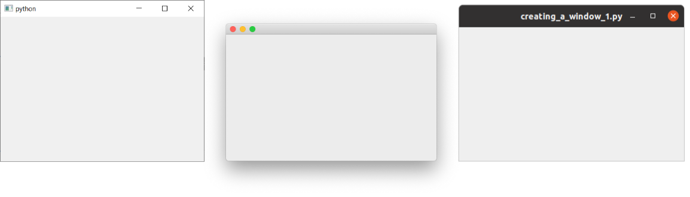
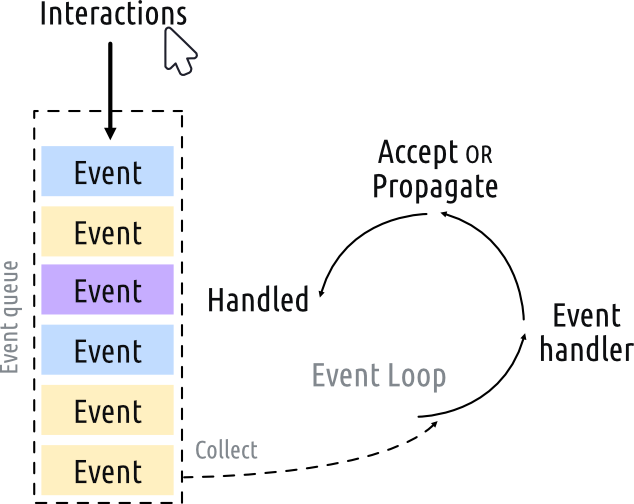
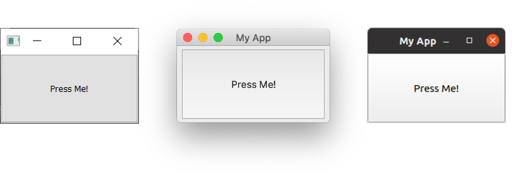
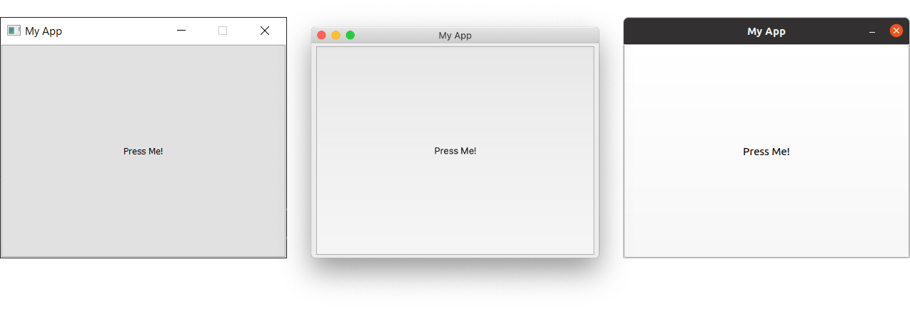

在本教程中，我们将学习如何使用 PySide 和 Python 创建桌面应用程序。首先，我们将在您的桌面上创建一系列简单的窗口，以确保 PySide 正常工作，并介绍一些基本概念。然后，我们将简要了解事件循环及其与 Python 中 GUI 编程的关系。最后，我们将了解 Qt 的 `QMainWindow`，它提供了一些有用的通用界面元素，例如工具栏和菜单。这些内容将在后续的教程中进行更详细的探讨。

### 创建一个应用程序

让我们来创建我们的第一个应用程序！首先，创建一个新的 Python 文件——您可以随意命名它（例如 `app.py`）并将其保存在一个方便访问的地方。我们将在这个文件中编写我们的简单应用。

我们将在本教程中不断编辑这个文件，您可能希望回顾代码的早期版本，所以请记得定期备份。

应用程序的源代码如下所示。请逐字输入，并注意不要出错。如果您确实搞砸了，Python 会告诉您哪里出了问题。

```python
from PySide6.QtWidgets import QApplication, QWidget

# 仅用于访问命令行参数
import sys

# 每个应用程序需要一个（且仅一个）QApplication 实例。
# 传入 sys.argv 以允许为您的应用提供命令行参数。
# 如果您确定不会使用命令行参数，QApplication([]) 也可以工作。
app = QApplication(sys.argv)

# 创建一个 Qt 控件，它将成为我们的窗口。
window = QWidget()
window.show()  # 重要！！！！窗口默认是隐藏的。

# 启动事件循环。
app.exec()

# 您的应用程序在您退出并且事件循环停止之前，
# 不会执行到这里。
```

首先，启动您的应用程序。您可以像运行任何其他 Python 脚本一样从命令行运行它，例如——

*运行它！* 您现在会看到您的窗口。Qt 会自动创建一个带有正常窗口装饰的窗口，您可以像任何窗口一样拖动和调整它的大小。

您看到的内容将取决于您运行此示例的平台。下图显示了在 Windows、macOS 和 Linux (Ubuntu) 上显示的窗口。



*我们的窗口，在 Windows、macOS 和 Linux 上的样子。*

#### 逐行解读代码

让我们逐行解读代码，以便我们确切地理解发生了什么。

首先，我们导入应用程序所需的 PySide 类。在这里，我们从 `QtWidgets` 模块中导入 `QApplication`（应用程序处理器）和 `QWidget`（一个基本的*空*GUI 控件）。

```python
from PySide6.QtWidgets import QApplication, QWidget
```

Qt 的主要模块是 `QtWidgets`、`QtGui` 和 `QtCore`。

您可以使用 `from <module> import *`，但这种全局导入在 Python 中通常不被推荐，所以我们在这里避免使用它。

接下来，我们创建一个 `QApplication` 的实例，传入 `sys.argv`，这是一个包含传递给应用程序的命令行参数的 Python `list`。

```python
app = QApplication(sys.argv)
```

如果您确定不会使用命令行参数来控制 Qt，您可以传入一个空列表，例如：

```python
app = QApplication([])
```

接下来，我们创建一个 `QWidget` 的实例，并使用变量名 `window`。

```python
window = QWidget()
window.show()
```

在 Qt 中，*所有*顶层控件都是窗口——也就是说，它们没有*父级*，也没有嵌套在另一个控件或布局中。这意味着您理论上可以使用任何您喜欢的控件来创建一个窗口。

*没有父级的*控件默认是不可见的。所以，在创建 `window` 对象之后，我们必须*总是*调用 `.show()` 来使其可见。您可以去掉 `.show()` 并运行应用，但您将无法退出它！

**什么是窗口？**
- 包含您应用程序的用户界面
- 每个应用程序至少需要一个（...但可以有多个）
- 应用程序（默认情况下）在最后一个窗口关闭时退出

最后，我们调用 `app.exec()` 来启动事件循环。

### 什么是事件循环？

在将窗口显示在屏幕上之前，有几个关于 Qt 世界中应用程序如何组织的关键概念需要介绍。如果您已经熟悉事件循环，可以安全地跳到下一节。

每个 Qt 应用程序的核心是 `QApplication` 类。每个应用程序都需要一个——且仅一个——`QApplication` 对象才能运行。这个对象持有您应用程序的*事件循环*——这是管理所有用户与 GUI 交互的核心循环。



与您的应用程序的每一次交互——无论是按键、鼠标点击还是鼠标移动——都会生成一个*事件*，该事件被放入*事件队列*中。在事件循环中，每次迭代都会检查队列，如果发现有等待的事件，该事件和控制权就会被传递给该事件的特定*事件处理器*。事件处理器处理该事件，然后将控制权交还给事件循环以等待更多事件。每个应用程序只有一个正在运行的事件循环。

**`QApplication` 类**
- `QApplication` 持有 Qt 事件循环
- 需要一个 `QApplication` 实例
- 您的应用程序在事件循环中等待，直到有操作发生
- 在任何时候只有一个事件循环

### `QMainWindow`

正如我们在上一部分发现的，在 Qt 中*任何*控件都可以是窗口。例如，如果您将 `QWidget` 替换为 `QPushButton`。在下面的例子中，您会得到一个带有一个可按按钮的窗口。

```python
import sys
from PySide6.QtWidgets import QApplication, QPushButton

app = QApplication(sys.argv)

window = QPushButton("Push Me")
window.show()

app.exec()
```

这很酷，但并不那么*有用*——您很少需要一个只包含单个控件的 UI！但是，正如我们稍后将发现的，使用*布局*将控件嵌套在其他控件中的能力意味着您可以在一个空的 `QWidget` 内部构建复杂的 UI。

但是，Qt 已经为您提供了一个解决方案——`QMainWindow`。这是一个预制的控件，提供了许多您将在应用中使用的标准窗口功能，包括工具栏、菜单、状态栏、可停靠的控件等等。我们稍后将研究这些高级功能，但现在，我们将在我们的应用程序中添加一个简单的空 `QMainWindow`。

```python
import sys
from PySide6.QtWidgets import QApplication, QMainWindow

app = QApplication(sys.argv)

window = QMainWindow()
window.show()

# 启动事件循环。
app.exec()
```

*运行它！* 您现在会看到您的主窗口。它看起来和以前完全一样！

所以我们的 `QMainWindow` 目前还不是很有趣。我们可以通过添加一些内容来解决这个问题。如果您想创建一个自定义窗口，最好的方法是子类化 `QMainWindow`，然后在 `__init__` 块中包含窗口的设置。这使得窗口的行为可以自包含。我们可以添加我们自己的 `QMainWindow` 的子类——为了简单起见，称之为 `MainWindow`。

```python
import sys

from PySide6.QtCore import QSize, Qt
from PySide6.QtWidgets import QApplication, QMainWindow, QPushButton


# 子类化 QMainWindow 来自定义您的应用程序的主窗口
class MainWindow(QMainWindow):
    def __init__(self):
        super().__init__()

        self.setWindowTitle("My App")

        button = QPushButton("Press Me!")

        # 设置窗口的中心控件。
        self.setCentralWidget(button)


app = QApplication(sys.argv)

window = MainWindow()
window.show()

app.exec()
```

在这个演示中，我们使用的是一个 `QPushButton`。核心的 Qt 控件总是从 `QtWidgets` 命名空间导入，`QMainWindow` 和 `QApplication` 类也是如此。当使用 `QMainWindow` 时，我们使用 `.setCentralWidget` 来将一个控件（这里是一个 `QPushButton`）放置在 `QMainWindow` 中——默认情况下它会占据整个窗口。我们将在布局教程中研究如何向窗口添加多个控件。

当您子类化一个 Qt 类时，您必须*总是*调用父类的 `__init__` 函数，以允许 Qt 设置该对象。

在我们的 `__init__` 块中，我们首先使用 `.setWindowTitle()` 来更改我们主窗口的标题。然后我们将我们的第一个控件——一个 `QPushButton`——添加到窗口的中间。这是 Qt 中可用的基本控件之一。在创建按钮时，您可以传入您希望按钮显示的文本。

最后，我们在窗口上调用 `.setCentralWidget()`。这是一个 `QMainWindow` 特有的函数，允许您设置位于窗口中间的控件。

*运行它！* 您会再次看到您的窗口，但这次中间有一个 `QPushButton` 控件。按下按钮不会有任何反应，我们接下来会解决这个问题。



*我们的 `QMainWindow`，在 Windows、macOS 和 Linux 上带有一个 `QPushButton`。*

我们稍后会详细介绍更多控件，但如果您迫不及待想提前了解，可以查看 [QWidget 文档](http://doc.qt.io/qt-5/widget-classes.html#basic-widget-classes)。尝试将不同的控件添加到您的窗口中！

该窗口目前可以自由调整大小——如果您用鼠标抓住任何一个角，您可以拖动并将其调整为您想要的任何大小。虽然让您的用户调整您的应用程序的大小是件好事，但有时您可能希望对最小或最大尺寸施加限制，或者将窗口锁定为固定大小。

在 Qt 中，大小是使用一个 `QSize` 对象定义的。它按顺序接受*宽度*和*高度*参数。例如，以下代码将创建一个 400x300 像素的*固定大小*窗口。

```python
import sys

from PySide6.QtCore import QSize, Qt
from PySide6.QtWidgets import QApplication, QMainWindow, QPushButton


# 子类化 QMainWindow 来自定义您的应用程序的主窗口
class MainWindow(QMainWindow):
    def __init__(self):
        super().__init__()

        self.setWindowTitle("My App")

        button = QPushButton("Press Me!")

        self.setFixedSize(QSize(400, 300))

        # 设置窗口的中心控件。
        self.setCentralWidget(button)


app = QApplication(sys.argv)

window = MainWindow()
window.show()

app.exec()
```

*运行它！* 您会看到一个固定大小的窗口——试着调整它的大小，它不会工作。



*我们的固定大小窗口，注意在 Windows 和 Linux 上最大化控件被禁用了。在 macOS 上，您可以最大化应用以填充屏幕，但中心控件不会调整大小。*

除了 `.setFixedSize()`，您还可以调用 `.setMinimumSize()` 和 `.setMaximumSize()` 来分别设置最小和最大尺寸。请您自己试验一下！

您可以在*任何*控件上使用这些尺寸方法。

在本节中，我们介绍了 `QApplication` 类、`QMainWindow` 类、事件循环，并试验了向窗口添加一个简单的控件。在下一节中，我们将看一下 Qt 为控件和窗口之间以及与您自己的代码之间进行通信所提供的机制。