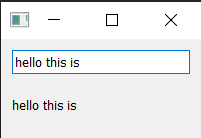

好的，作为一名专业的 Qt 编程专家，我将为您翻译以下关于 PySide 信号、槽和事件的教程。

---

到目前为止，我们已经创建了一个窗口并在其中添加了一个简单的*按钮*控件，但是这个按钮什么也做不了。这实在没什么用——当您创建 GUI 应用程序时，通常希望它们能做些什么！我们需要一种方法来连接*按下按钮*这个动作，以使其发生某些事情。在 Qt 中，这是通过*信号*和*槽*或*事件*来实现的。

### 信号 & 槽

*信号*是控件在*某些事情*发生时发出的通知。这个“某些事情”可以是任何事情，从按下按钮，到输入框的文本改变，再到窗口标题的改变。许多信号是由用户操作发起的，但这并非定律。

除了通知某事发生外，信号还可以发送数据以提供关于发生了什么的额外上下文。

您也可以创建自己的自定义信号，我们稍后将探讨这一点。

*槽*是 Qt 用来称呼信号接收者的名字。在 Python 中，您应用程序中的任何函数（或方法）都可以用作槽——只需将信号连接到它即可。如果信号发送了数据，那么接收函数也会接收到该数据。许多 Qt 控件也有自己的内置槽，这意味着您可以直接将 Qt 控件连接在一起。

让我们来看看 Qt 信号的基础知识，以及如何使用它们来连接控件以在您的应用中实现功能。

将以下应用大纲保存到一个名为`app.py`的文件中：

```python
import sys
from PySide6.QtWidgets import QApplication, QMainWindow

class MainWindow(QMainWindow):

    def __init__(self):
        super().__init__()

        self.setWindowTitle("My App")

app = QApplication(sys.argv)

window = MainWindow()
window.show()

app.exec()
```

#### `QPushButton` 信号

我们简单的应用程序目前有一个`QMainWindow`，其中一个`QPushButton`被设置为中心控件。让我们从将这个按钮连接到一个自定义的 Python 方法开始。在这里，我们创建了一个名为`the_button_was_clicked()`的简单自定义槽，它接收来自`QPushButton`对象的`clicked`信号：

```python
import sys
from PySide6.QtWidgets import QApplication, QMainWindow, QPushButton

class MainWindow(QMainWindow):
    def __init__(self):
        super().__init__()

        self.setWindowTitle("My App")

        button = QPushButton("Press Me!")
        button.setCheckable(True)
        button.clicked.connect(self.the_button_was_clicked)

        # 设置窗口的中心控件。
        self.setCentralWidget(button)

    def the_button_was_clicked(self):
        print("Clicked!")

app = QApplication(sys.argv)

window = MainWindow()
window.show()

app.exec()
```

_运行它！_ 如果您点击按钮，您会在控制台上看到文本"Clicked!"：

```
Clicked!
Clicked!
Clicked!
Clicked!
```

#### 接收数据

这是一个不错的开始！我们已经知道信号还可以发送*数据*以提供更多关于刚刚发生了什么的信息。`clicked`信号也不例外，它还提供了一个*选中*（或切换）状态。对于普通按钮，这个值总是`False`，所以我们的第一个槽忽略了这个数据。但是，我们可以让我们的按钮*可选中*，并看看效果。

在下面的例子中，我们添加了第二个槽来输出*选中状态*：

```python
class MainWindow(QMainWindow):
    def __init__(self):
        super().__init__()

        self.setWindowTitle("My App")

        button = QPushButton("Press Me!")
        button.setCheckable(True)
        button.clicked.connect(self.the_button_was_clicked)
        button.clicked.connect(self.the_button_was_toggled)

        self.setCentralWidget(button)

    def the_button_was_clicked(self):
        print("Clicked!")

    def the_button_was_toggled(self, checked):
        print("Checked?", checked)
```

_运行它！_ 如果您按下按钮，您会看到它被高亮显示为*选中*。再次按下以释放它。在控制台中查看*选中状态*：

````
Clicked!
Checked? True
Clicked!
Checked? False
Clicked!
Checked? True
Clicked!
Checked? False
Clicked!
Checked? True```

您可以将任意数量的槽连接到一个信号上，并且可以在您的槽中同时响应信号的不同版本。

#### 存储数据

通常将控件的当前*状态*存储在一个Python变量中是很有用的。这使您能够像处理任何其他Python变量一样处理这些值，而无需访问原始控件。您可以将这些值存储为单个变量，或者如果您愿意，也可以使用字典。在下一个例子中，我们将按钮的*选中*值存储在`self`上一个名为`button_is_checked`的变量中：

```python
class MainWindow(QMainWindow):
    def __init__(self):
        super().__init__()

        self.button_is_checked = True

        self.setWindowTitle("My App")

        button = QPushButton("Press Me!")
        button.setCheckable(True)
        button.clicked.connect(self.the_button_was_toggled)
        button.setChecked(self.button_is_checked)

        self.setCentralWidget(button)

    def the_button_was_toggled(self, checked):
        self.button_is_checked = checked

        print(self.button_is_checked)
````

首先，我们为我们的变量设置默认值（为`True`），然后使用默认值来设置控件的初始状态。当控件状态改变时，我们接收到信号并更新变量以匹配。

您可以在任何 PySide 控件上使用相同的模式。如果一个控件不提供发送当前状态的信号，您将需要在您的处理程序中直接从控件中检索该值。例如，在这里我们在一个*按下*的处理程序中检查选中状态：

```python
class MainWindow(QMainWindow):
    def __init__(self):
        super().__init__()

        self.button_is_checked = True

        self.setWindowTitle("My App")

        self.button = QPushButton("Press Me!")
        self.button.setCheckable(True)
        self.button.released.connect(self.the_button_was_released)
        self.button.setChecked(self.button_is_checked)

        self.setCentralWidget(self.button)

    def the_button_was_released(self):
        self.button_is_checked = self.button.isChecked()

        print(self.button_is_checked)
```

我们需要在`self`上保留对按钮的引用，以便我们可以在我们的槽中访问它。

*released*信号在按钮被释放时触发，但不发送选中状态，所以我们改用`isChecked()`在我们的处理程序中从按钮获取选中状态。

#### 改变界面

到目前为止，我们已经看到了如何接收信号并将输出打印到控制台。但是当我们点击按钮时，如何在界面中发生一些事情呢？让我们更新我们的槽方法来修改按钮，改变文本并禁用按钮，使其不再可点击。我们暂时也将*可选中*状态关闭：

```python
class MainWindow(QMainWindow):
    def __init__(self):
        super().__init__()

        self.setWindowTitle("My App")

        self.button = QPushButton("Press Me!")
        self.button.clicked.connect(self.the_button_was_clicked)

        self.setCentralWidget(self.button)

    def the_button_was_clicked(self):
        self.button.setText("You already clicked me.")
        self.button.setEnabled(False)

        # 同样改变窗口标题。
        self.setWindowTitle("My Oneshot App")
```

同样，因为我们需要能够在我们的`the_button_was_clicked`方法中访问`button`，我们在`self`上保留了对它的引用。按钮的文本通过向`setText()`传递一个字符串来改变。要禁用一个按钮，调用`setEnabled()`并传入`False`。

_运行它！_ 如果您点击按钮，文本会改变，按钮将变得不可点击。

您不仅限于改变触发信号的按钮，您可以在您的槽方法中做*任何您想做的事情*。例如，尝试在`the_button_was_clicked()`方法中添加以下一行来同时改变窗口标题：

```python
self.setWindowTitle("一个新的窗口标题")
```

大多数控件都有自己的信号——我们用于我们窗口的`QMainWindow`也不例外。在下面这个更复杂的例子中，我们将`QMainWindow`上的`windowTitleChanged`信号连接到一个自定义的槽方法。

在下面的例子中，我们将`QMainWindow`上的`windowTitleChanged`信号连接到一个方法槽`the_window_title_changed()`。这个槽也接收新的窗口标题：

````python
import sys
from random import choice

from PySide6.QtWidgets import QApplication, QMainWindow, QPushButton

window_titles = [
    "My App",
    "My App",
    "Still My App",
    "Still My App",
    "What on earth",
    "What on earth",
    "This is surprising",
    "This is surprising",
    "Something went wrong",
]

class MainWindow(QMainWindow):
    def __init__(self):
        super().__init__()

        self.n_times_clicked = 0

        self.setWindowTitle("My App")

        self.button = QPushButton("Press Me!")
        self.button.clicked.connect(self.the_button_was_clicked)

        self.windowTitleChanged.connect(self.the_window_title_changed)

        self.setCentralWidget(self.button)

    def the_button_was_clicked(self):
        print("Clicked.")
        new_window_title = choice(window_titles)
        print("Setting title:  %s" % new_window_title)
        self.setWindowTitle(new_window_title)

    def the_window_title_changed(self, window_title):
        print("Window title changed: %s" % window_title)

        if window_title == "Something went wrong":
            self.button.setDisabled(True)

app = QApplication(sys.argv)

window = MainWindow()
window.show()

app.exec()```

首先，我们设置了一个窗口标题列表——我们将使用Python内置的`random.choice()`从这个列表中随机选择一个。我们将我们的自定义槽方法`the_window_title_changed()`连接到窗口的`windowTitleChanged`信号。

当我们点击按钮时，窗口标题会随机改变。如果新的窗口标题等于"Something went wrong"，按钮将被禁用。

*运行它！* 反复点击按钮，直到标题变为"Something went wrong"，然后按钮将变为禁用状态。

这个例子中有几点需要注意。

首先，`windowTitleChanged`信号并非在设置窗口标题时*总是*被发出。该信号仅在新标题与前一个标题*不同*时才会触发。如果您多次设置相同的标题，该信号只会在第一次触发。在使用信号时，仔细检查它们触发的条件是很重要的，以避免在您的应用中感到意外。

其次，请注意我们是如何能够使用信号将事情*串联*起来的。一件事情的发生——一次按钮按下——可以触发多个其他事情的相继发生。这些后续的效果不需要知道*是什么*导致了它们，而只是作为简单规则的结果而发生。这种效果与其触发器的*解耦*是构建GUI应用程序时需要理解的关键概念之一。

在本节中，我们介绍了信号和槽。我们演示了一些简单的信号以及如何使用它们在您的应用程序中传递数据和状态。接下来，我们将看看Qt为您的应用程序提供的控件——以及它们提供的信号。

#### 将控件直接连接在一起

到目前为止，我们已经看到了将控件信号连接到Python方法的例子。当一个信号从控件发出时，我们的Python方法被调用并接收来自信号的数据。但您并非*总是*需要使用Python函数来处理信号——您也可以将Qt控件直接相互连接。

在下面的例子中，我们向窗口添加了一个`QLineEdit`控件和一个`QLabel`。在窗口的`__init__()`中，我们将我们的行编辑器的`textChanged`信号连接到`QLabel`上的`setText()`方法。现在，每当`QLineEdit`中的文本改变时，`QLabel`都会在其`setText()`方法中接收到该文本：

```python
import sys

from PySide6.QtWidgets import (
    QApplication,
    QLabel,
    QLineEdit,
    QMainWindow,
    QVBoxLayout,
    QWidget,
)

class MainWindow(QMainWindow):
    def __init__(self):
        super().__init__()

        self.setWindowTitle("My App")

        self.label = QLabel()

        self.input = QLineEdit()
        self.input.textChanged.connect(self.label.setText)

        layout = QVBoxLayout()
        layout.addWidget(self.input)
        layout.addWidget(self.label)

        container = QWidget()
        container.setLayout(layout)

        self.setCentralWidget(container)

app = QApplication(sys.argv)

window = MainWindow()
window.show()

app.exec()
````

请注意，为了将输入连接到标签，输入和标签都必须被定义。这段代码将这两个控件添加到一个布局中，并将该布局设置到窗口上。我们稍后将详细介绍布局，您现在可以忽略它。

_运行它！_ 在上面的框中输入一些文本，您会看到它立即出现在标签上。


_在输入框中输入的任何文本都会立即出现在标签上。_

大多数 Qt 控件都有可用的*槽*，您可以将任何发出与其接受的*类型*相同的信号连接到这些槽上。控件文档在“Public Slots”下列出了每个控件的槽。例如，请参阅[`QLabel`](https://doc.qt.io/qt-5/qlabel.html#public-slots)文档。

### 事件

用户与 Qt 应用程序的每一次交互都是一个*事件*。事件有很多类型，每种类型代表一种不同类型的交互。Qt 使用*事件对象*来表示这些事件，这些对象打包了关于发生了什么的信息。这些事件被传递给交互发生的控件上的特定*事件处理器*。

通过定义自定义或扩展的*事件处理器*，您可以改变您的控件响应这些事件的方式。事件处理器的定义就像任何其他方法一样，但其名称对于它们处理的事件类型是特定的。

控件接收的主要事件之一是`QMouseEvent`。`QMouseEvent`事件是为控件上的每一次鼠标移动和按钮点击而创建的。以下事件处理器可用于处理鼠标事件：

| 事件处理器                | 事件类型     |
| :------------------------ | :----------- |
| `mouseMoveEvent()`        | 鼠标移动     |
| `mousePressEvent()`       | 鼠标按钮按下 |
| `mouseReleaseEvent()`     | 鼠标按钮释放 |
| `mouseDoubleClickEvent()` | 检测到双击   |

例如，点击一个控件会导致一个`QMouseEvent`被发送到该控件的`mousePressEvent()`事件处理器。这个处理器可以使用事件对象来找出关于发生了什么的信息，例如是什么触发了事件以及它具体发生在哪里。

您可以通过子类化并重写类上的处理器方法来拦截事件。您可以选择过滤、修改或忽略事件，通过使用`super()`调用父类的函数，将它们传递给事件的正常处理器。这些可以如下添加到您的主窗口类中。在每种情况下，`e`都会接收传入的事件：

```python
import sys

from PySide6.QtWidgets import QApplication, QLabel, QMainWindow

class MainWindow(QMainWindow):
    def __init__(self):
        super().__init__()
        self.label = QLabel("Click in this window")
        self.setCentralWidget(self.label)

    def mouseMoveEvent(self, e):
        self.label.setText("mouseMoveEvent")

    def mousePressEvent(self, e):
        self.label.setText("mousePressEvent")

    def mouseReleaseEvent(self, e):
        self.label.setText("mouseReleaseEvent")

    def mouseDoubleClickEvent(self, e):
        self.label.setText("mouseDoubleClickEvent")

app = QApplication(sys.argv)

window = MainWindow()
window.show()

app.exec()
```

_运行它！_ 尝试在窗口中移动和点击（以及双击），并观察事件的出现。

您会注意到，鼠标移动事件只有在您按住按钮时才会被注册。您可以通过在窗口和标签上调用`setMouseTracking(True)`来改变这种行为。在这种情况下，`__init__()`方法可能如下所示：

```python
class MainWindow(QMainWindow):
    def __init__(self):
        super().__init__()
        self.setMouseTracking(True)
        self.label = QLabel("Click in this window")
        self.label.setMouseTracking(True)
        self.setCentralWidget(self.label)
```

我们在这里需要在标签和窗口上都使用`.setMouseTracking`，因为标签完全覆盖了窗口，否则会阻塞事件。

您可能还会注意到，在按下按钮时，按下（点击）和双击事件都会触发。只有在释放按钮时才会触发释放事件。通常，要注册用户的点击，您应该同时监视鼠标按下*和*释放。

在事件处理器内部，您可以访问一个事件对象。这个对象包含有关事件的信息，并可用于根据具体发生的情况做出不同的响应。我们接下来将看看鼠标事件对象。

#### 鼠标事件

Qt 中的所有鼠标事件都由`QMouseEvent`对象跟踪，有关事件的信息可以从以下事件方法中读取：

| 方法           | 返回                                |
| :------------- | :---------------------------------- |
| `.button()`    | 触发此事件的特定按钮                |
| `.buttons()`   | 所有鼠标按钮的状态（OR'ed 标志）    |
| `.globalPos()` | 应用程序全局位置，作为`QPoint`      |
| `.globalX()`   | 应用程序全局*水平*X 位置            |
| `.globalY()`   | 应用程序全局*垂直*Y 位置            |
| `.pos()`       | 控件相对位置，作为`QPoint`_整数_    |
| `.posF()`      | 控件相对位置，作为`QPointF`_浮点数_ |

您可以在事件处理器中使用这些方法来对不同的事件做出不同的响应，或者完全忽略它们。位置方法提供*全局*和*局部*（控件相对）的位置信息，作为`QPoint`对象，而按钮则使用`Qt.MouseButton`命名空间中的鼠标按钮类型来报告。

例如，以下代码允许我们对窗口上的左键、右键或中键点击做出不同的响应：

```python
import sys

from PySide6.QtCore import Qt
from PySide6.QtWidgets import QApplication, QLabel, QMainWindow

class MainWindow(QMainWindow):
    def __init__(self):
        super().__init__()
        self.label = QLabel("Click in this window")
        self.setCentralWidget(self.label)

    def mousePressEvent(self, e):
        if e.button() == Qt.MouseButton.LeftButton:
            # 在这里处理左键按下
            self.label.setText("mousePressEvent LEFT")

        elif e.button() == Qt.MouseButton.MiddleButton:
            # 在这里处理中键按下。
            self.label.setText("mousePressEvent MIDDLE")

        elif e.button() == Qt.MouseButton.RightButton:
            # 在这里处理右键按下。
            self.label.setText("mousePressEvent RIGHT")

    def mouseReleaseEvent(self, e):
        if e.button() == Qt.MouseButton.LeftButton:
            self.label.setText("mouseReleaseEvent LEFT")

        elif e.button() == Qt.MouseButton.MiddleButton:
            self.label.setText("mouseReleaseEvent MIDDLE")

        elif e.button() == Qt.MouseButton.RightButton:
            self.label.setText("mouseReleaseEvent RIGHT")

    def mouseDoubleClickEvent(self, e):
        if e.button() == Qt.MouseButton.LeftButton:
            self.label.setText("mouseDoubleClickEvent LEFT")

        elif e.button() == Qt.MouseButton.MiddleButton:
            self.label.setText("mouseDoubleClickEvent MIDDLE")

        elif e.button() == Qt.MouseButton.RightButton:
            self.label.setText("mouseDoubleClickEvent RIGHT")

app = QApplication(sys.argv)

window = MainWindow()
window.show()

app.exec()
```

按钮标识符在`Qt.MouseButton`命名空间中定义，如下所示：

| 标识符                        | 值（二进制） | 代表                                   |
| :---------------------------- | :----------- | :------------------------------------- |
| `Qt.MouseButton.NoButton`     | 0 (`000`)    | 没有按下按钮，或者事件与按钮按下无关。 |
| `Qt.MouseButton.LeftButton`   | 1 (`001`)    | 左键被按下                             |
| `Qt.MouseButton.RightButton`  | 2 (`010`)    | 右键被按下。                           |
| `Qt.MouseButton.MiddleButton` | 4 (`100`)    | 中键被按下。                           |

在左手鼠标上，左右按钮的位置是颠倒的，即按下最右边的按钮将返回`Qt.MouseButton.LeftButton`。这意味着您不需要在您的代码中考虑鼠标的朝向。

上下文菜单是通常在右键单击窗口时出现的小型上下文敏感菜单。Qt 支持生成这些菜单，并且控件有一个特定的事件用于触发它们。在下面的例子中，我们将在`QMainWindow`中拦截`contextMenuEvent()`。这个事件在上下文菜单*即将被*显示时触发，并被传递一个类型为`QContextMenuEvent`的单一值`event`。

要拦截该事件，我们只需用我们的同名新方法覆盖对象方法。所以，在这种情况下，我们可以在我们的`MainWindow`子类上创建一个名为`contextMenuEvent()`的方法，它将接收所有这种类型的事件：

```python
import sys

from PySide6.QtCore import Qt
from PySide6.QtGui import QAction
from PySide6.QtWidgets import QApplication, QMainWindow, QMenu

class MainWindow(QMainWindow):
    def __init__(self):
        super().__init__()

    def contextMenuEvent(self, e):
        context = QMenu(self)
        context.addAction(QAction("test 1", self))
        context.addAction(QAction("test 2", self))
        context.addAction(QAction("test 3", self))
        context.exec(e.globalPos())

app = QApplication(sys.argv)

window = MainWindow()
window.show()

app.exec()
```

如果您运行上面的代码并在窗口内右键单击，您会看到一个上下文菜单出现。您可以像平常一样在您的菜单动作上设置`triggered`槽（并重用为菜单和工具栏定义的动作）。

在将初始位置传递给`exec()`方法时，这必须是相对于定义时传入的父级。在这种情况下，我们传入`self`作为父级，所以我们可以使用全局位置。

为了完整起见，实际上还有一种基于信号的方法来创建上下文菜单：

```python
class MainWindow(QMainWindow):
    def __init__(self):
        super().__init__()
        self.show()

        self.setContextMenuPolicy(Qt.CustomContextMenu)
        self.customContextMenuRequested.connect(self.on_context_menu)

    def on_context_menu(self, pos):
        context = QMenu(self)
        context.addAction(QAction("test 1", self))
        context.addAction(QAction("test 2", self))
        context.addAction(QAction("test 3", self))
        context.exec(self.mapToGlobal(pos))
```

选择哪种方式完全取决于您。

#### 事件层次结构

在 PySide6 中，每个控件都是两个不同层次结构的一部分：Python 对象层次结构和 Qt 布局层次结构。您如何响应或忽略事件会影响您的 UI 的行为。

##### Python 继承转发

通常您可能希望拦截一个事件并对其做些什么，但仍然触发默认的事件处理行为。如果您的对象继承自一个标准控件，它很可能默认实现了合理的行为。您可以通过使用`super()`调用父类的实现来触发这一点。

这是 Python 的父类，而不是 PySide 的`parent()`类：

```python
def mousePressEvent(self, event):
    print("Mouse pressed!")
    super().mousePressEvent(event)
```

事件将继续像往常一样表现，但您添加了一些非干扰性的行为。

##### 布局转发

当您向您的应用程序添加一个控件时，它还会从布局中获得另一个*父级*。控件的父级可以通过调用`.parent()`找到。有时您会手动指定这些父级，例如对于`QMenu`或`QDialog`，通常是自动的。例如，当您向您的主窗口添加一个控件时，主窗口将成为该控件的父级。

当为与 UI 的用户交互创建事件时，这些事件被传递给 UI 中*最上层*的控件。所以，如果您在窗口上有一个按钮并点击该按钮，那么按钮将首先接收到该事件。

如果第一个控件无法处理该事件或选择不处理，那么该事件将*冒泡*到父控件，父控件将有机会处理。这种*冒泡*会一直持续到所有嵌套的控件，直到事件被处理或到达主窗口。

在您自己的事件处理器中，您可以通过调用`accept()`方法将一个事件标记为*已处理*：

```python
class CustomButton(QPushButton)
    def mousePressEvent(self, e):
        e.accept()
```

或者，您可以通过在事件对象上调用`ignore()`将其标记为*未处理*。在这种情况下，事件将继续在层次结构中冒泡：

```python
class CustomButton(QPushButton)
    def event(self, e):
        e.ignore()
```

如果您希望您的控件对事件表现为透明，您可以安全地忽略您实际上已经以某种方式响应了的事件。同样，您可以选择接受您没有响应的事件以使其静默。
