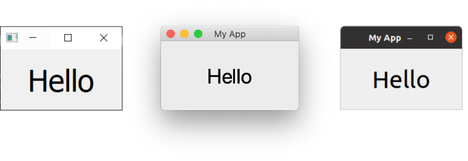
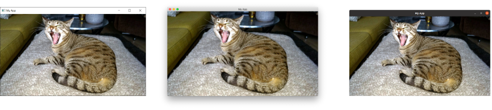
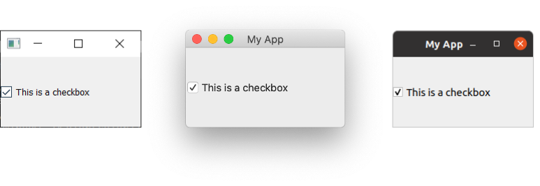
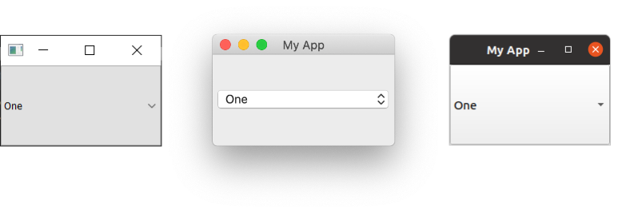
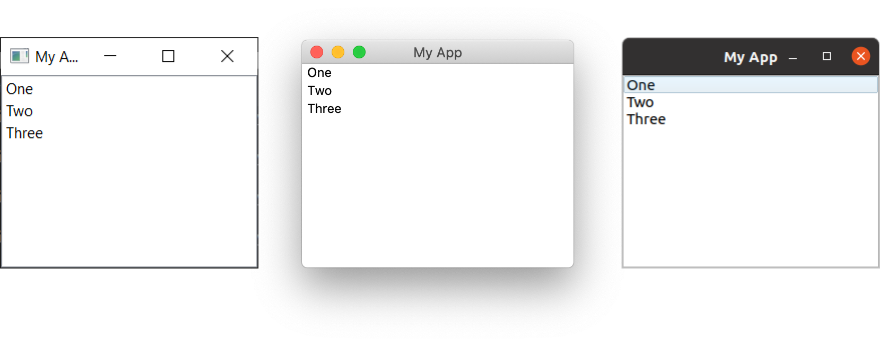
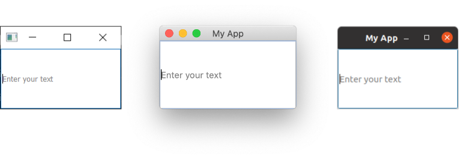
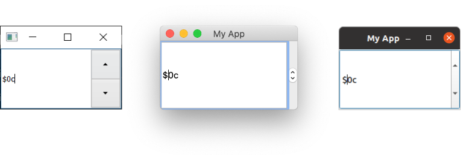
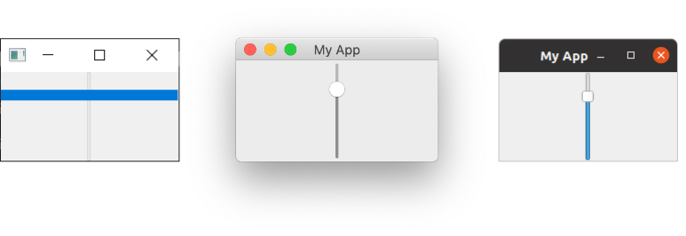
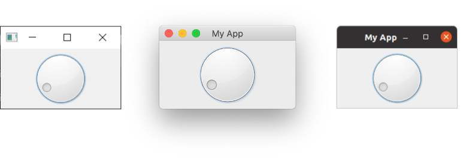

在 Qt（以及大多数用户界面）中，**widget** 是用户界面中用户可以与之交互的组件的名称。用户界面由多个部件组成，排列在窗口内。

Qt 自带了大量可用的部件，甚至允许你创建自己的自定义和定制化部件。

首先，让我们看一些最常见的 PySide 部件。以下代码创建了一系列 PySide 部件，并将它们添加到一个窗口布局中，以便你可以将它们放在一起查看：


```python
import sys

from PySide6.QtWidgets import (
    QApplication,
    QCheckBox,
    QComboBox,
    QDateEdit,
    QDateTimeEdit,
    QDial,
    QDoubleSpinBox,
    QFontComboBox,
    QLabel,
    QLCDNumber,
    QLineEdit,
    QMainWindow,
    QProgressBar,
    QPushButton,
    QRadioButton,
    QSlider,
    QSpinBox,
    QTimeEdit,
    QVBoxLayout,
    QWidget,
)

class MainWindow(QMainWindow):
    def __init__(self):
        super().__init__()

        self.setWindowTitle("Widgets App")

        layout = QVBoxLayout()
        widgets = [
            QCheckBox,
            QComboBox,
            QDateEdit,
            QDateTimeEdit,
            QDial,
            QDoubleSpinBox,
            QFontComboBox,
            QLCDNumber,
            QLabel,
            QLineEdit,
            QProgressBar,
            QPushButton,
            QRadioButton,
            QSlider,
            QSpinBox,
            QTimeEdit,
        ]

        for widget in widgets:
            layout.addWidget(widget())

        central_widget = QWidget()
        central_widget.setLayout(layout)

        self.setCentralWidget(central_widget)

app = QApplication(sys.argv)
window = MainWindow()
window.show()
app.exec()


```

**运行它！** 你会看到一个窗口出现，其中包含我们创建的所有部件。


 _Windows、Mac 和 Ubuntu Linux 上的大部件列表。_

让我们从上到下看看所有示例部件：

| 部件           | 作用                               |
| -------------- | ---------------------------------- |
| QCheckbox      | 一个复选框                         |
| QComboBox      | 一个下拉列表框                     |
| QDateEdit      | 用于编辑日期                       |
| QDateTimeEdit  | 用于编辑日期和时间                 |
| QDial          | 可旋转的拨盘                       |
| QDoubleSpinBox | 用于浮点数的数字微调框             |
| QFontComboBox  | 一个字体列表                       |
| QLCDNumber     | 一个相当丑的 LCD 显示屏            |
| QLabel         | 只是一个标签，非交互式             |
| QLineEdit      | 输入一行文本                       |
| QProgressBar   | 一个进度条                         |
| QPushButton    | 一个按钮                           |
| QRadioButton   | 一组单选按钮，只有一个项目可被激活 |
| QSlider        | 一个滑块                           |
| QSpinBox       | 一个整数微调框                     |
| QTimeEdit      | 用于编辑时间                       |

部件远不止这些，但它们不太适合放在一起展示！你可以通过查阅 Qt 文档来查看所有部件。

接下来，我们将逐步介绍一些最常用的部件，并更详细地研究它们。为了试验这些部件，我们需要一个简单的应用程序来容纳它们。将以下代码保存到一个名为 `app.py` 的文件中，并运行它以确保它能正常工作：

```python
import sys

from PySide6.QtCore import Qt
from PySide6.QtWidgets import (
    QApplication,
    QCheckBox,
    QComboBox,
    QDial,
    QDoubleSpinBox,
    QLabel,
    QLineEdit,
    QListWidget,
    QMainWindow,
    QSlider,
    QSpinBox,
)

class MainWindow(QMainWindow):
    def __init__(self):
        super().__init__()

        self.setWindowTitle("My App")

app = QApplication(sys.argv)
window = MainWindow()
window.show()
app.exec()


```

在上面的代码中，我们导入了许多 Qt 部件。现在我们将依次介绍这些部件，将它们添加到我们的应用程序中，并观察它们的行为。

`QLabel`
--------

我们将从 `QLabel` 开始我们的部件之旅，它可以说是 Qt 工具箱中最简单的部件之一。这是一个简单的单行文本，你可以将它放置在你的应用程序中。你可以在创建它时通过传入一个 `str` 来设置文本：

python

```python
label = QLabel("Hello")


```

或者，通过使用 `.setText()` 方法：

python

```python
label_1 = QLabel("1")  # 标签创建时文本为 1。
label_2.setText("2")   # 标签现在显示 2。


```

你还可以调整字体参数，例如字体大小或部件中文本的对齐方式：

python

```python
class MainWindow(QMainWindow):
    def __init__(self):
        super().__init__()

        self.setWindowTitle("My App")

        label = QLabel("Hello")
        font = label.font()
        font.setPointSize(30)
        label.setFont(font)
        label.setAlignment(
            Qt.AlignmentFlag.AlignHCenter | Qt.AlignmentFlag.AlignVCenter
        )

        self.setCentralWidget(label)
```

 

_Windows、Mac 和 Ubuntu Linux 上的 QLabel。_

**字体提示** 请注意，如果你想更改部件字体的属性，通常最好是获取*当前*字体，更新它，然后再将其应用回去。这确保了字体样式与桌面约定保持一致。

对齐方式是通过使用 `Qt.AlignmentFlag` 命名空间中的一个标志来指定的。可用的水平对齐标志有：

<table><thead><tr><th>标志</th><th>行为</th></tr></thead><tbody><tr><td><code>Qt.AlignmentFlag.AlignLeft</code></td><td>与左边缘对齐。</td></tr><tr><td><code>Qt.AlignmentFlag.AlignRight</code></td><td>与右边缘对齐。</td></tr><tr><td><code>Qt.AlignmentFlag.AlignHCenter</code></td><td>在可用空间内水平居中。</td></tr><tr><td><code>Qt.AlignmentFlag.AlignJustify</code></td><td>在可用空间内两端对齐文本。</td></tr></tbody></table>

可用的垂直对齐标志有：

<table><thead><tr><th>标志</th><th>行为</th></tr></thead><tbody><tr><td><code>Qt.AlignmentFlag.AlignTop</code></td><td>与顶部对齐。</td></tr><tr><td><code>Qt.AlignmentFlag.AlignBottom</code></td><td>与底部对齐。</td></tr><tr><td><code>Qt.AlignmentFlag.AlignVCenter</code></td><td>在可用空间内垂直居中。</td></tr></tbody></table>

你可以使用管道符（`|`）将标志组合在一起，但请注意，你一次只能使用一个垂直或水平对齐标志：


```python
align_top_left = Qt.AlignmentFlag.AlignLeft | Qt.AlignmentFlag.AlignTop
```

注意，你使用*或*管道符（`|`）来组合这两个标志（而不是 `A & B`）。这是因为这些标志是无重叠的位掩码。例如，`Qt.AlignmentFlag.AlignLeft` 的十六进制值为 `0x0001`，而 `Qt.AlignmentFlag.AlignBottom` 是 `0x0040`。通过对标志进行或运算，我们得到值 `0x0041`，代表“左下”。这个原则适用于所有其他组合式的 Qt 标志。如果这对你来说是天书，可以忽略它继续前进。只要记住使用管道操作符（`|`）就行了。

最后，还有一个简写标志可以同时在两个方向上居中：

<table><thead><tr><th>标志</th><th>行为</th></tr></thead><tbody><tr><td><code>Qt.AlignmentFlag.AlignCenter</code></td><td>水平<em>和</em>垂直居中</td></tr></tbody></table>

奇怪的是，你还可以使用 `QLabel` 通过 `.setPixmap()` 来显示图像。它接受一个 pixmap 对象，你可以通过将图像文件名传递给 `QPixmap` 类来创建该对象。

下面是一张你可以为这个例子下载的图片。

 

_猫咪 "Otje"。_

将文件放在与你的代码相同的文件夹中，然后按如下方式在你的窗口中显示它：

python

```python
widget.setPixmap(QPixmap('otje.jpg'))
```

 

_猫咪 "Otje"，显示在一个窗口中。_

多可爱的脸蛋。默认情况下，图像在保持其宽高比的同时进行缩放。如果你希望它拉伸和缩放以完全适应窗口，你可以在 `QLabel` 上设置 `.setScaledContents(True)`：

python

```python
label.setScaledContents(True)
```

`QCheckBox`
-----------

下一个要看的部件是 `QCheckBox()`，顾名思义，它向用户呈现一个可勾选的框。然而，与所有 Qt 部件一样，有许多可配置的选项来改变部件的行为：


```python
class MainWindow(QMainWindow):
    def __init__(self):
        super().__init__()

        self.setWindowTitle("My App")

        checkbox = QCheckBox()
        checkbox.setCheckState(Qt.CheckState.Checked)

        # 对于三态：widget.setCheckState(Qt.PartiallyChecked)
        # 或者：widget.setTriState(True)
        checkbox.stateChanged.connect(self.show_state)

        self.setCentralWidget(checkbox)

    def show_state(self, state):
        print(state == Qt.CheckState.Checked.value)
        print(state)
```

 

_Windows、Mac 和 Ubuntu Linux 上的 QCheckBox。_

你可以使用 `.setChecked()` 或 `.setCheckState()` 以编程方式设置复选框的状态。前者接受 `True` 或 `False`，分别代表选中或未选中。使用 `.setCheckState()`，你还需要使用 `Qt.CheckState` 命名空间指定一个特定的选中状态：

<table><thead><tr><th>标志</th><th>行为</th></tr></thead><tbody><tr><td><code>Qt.CheckState.Unchecked</code></td><td>项目未选中</td></tr><tr><td><code>Qt.CheckState.PartiallyChecked</code></td><td>项目部分选中</td></tr><tr><td><code>Qt.CheckState.Checked</code></td><td>项目已选中</td></tr></tbody></table>

支持部分选中（`Qt.CheckState.PartiallyChecked`）状态的复选框通常被称为**三态**，这意味着该部件既不是开启也不是关闭。处于此状态的复选框通常显示为灰色的复选框，并常用于子项目链接到父复选框的层级复选框排列中。

如果你将值设置为 `Qt.CheckState.PartiallyChecked`，复选框将变为三态。你也可以通过使用 `.setTriState(True)` 将复选框设置为三态，而无需将当前状态设置为部分选中。

你可能会注意到，当脚本运行时，当前状态号以 `int` 形式显示，其中选中 = `2`，未选中 = `0`，部分选中 = `1`。你不需要记住这些值，例如 `Qt.CheckState.Checked` 命名空间变量就等于 `2`。这是这些状态各自标志的值。这意味着你可以使用 `state == Qt.CheckState.Checked` 来测试状态。

`QComboBox`
-----------

`QComboBox` 部件是一个下拉列表，默认关闭，带有一个箭头来打开它。你可以从列表中选择单个项目，当前选中的项目会作为标签显示在部件上。组合框适用于从选项列表中进行选择。

你可能在文字处理应用程序中看到过组合框用于选择字体或大小。不过 Qt 实际上提供了一个专门的字体选择组合框 `QFontComboBox`。

你可以通过将一个字符串列表传递给 `.addItems()` 来向 `QComboBox` 添加项目。项目将按照它们被提供的顺序添加：

python

```python
class MainWindow(QMainWindow):
    def __init__(self):
        super().__init__()

        self.setWindowTitle("My App")

        combobox = QComboBox()
        combobox.addItems(["One", "Two", "Three"])

        # currentIndexChanged 的默认信号发送索引
        combobox.currentIndexChanged.connect(self.index_changed)

        # 同一个信号可以发送一个文本字符串
        combobox.currentTextChanged.connect(self.text_changed)

        self.setCentralWidget(combobox)

    def index_changed(self, index):  # index 是一个从 0 开始的 int
        print(index)

    def text_changed(self, text):  # text 是一个 str
        print(text)
```



 _Windows、Mac 和 Ubuntu Linux 上的 QComboBox。_

当当前选中的项目更新时，会触发 `.currentIndexChanged` 信号，默认传递所选项目在列表中的索引。还有一个 `.currentTextChanged` 信号，它提供当前选中项目的标签。这个信号通常更有用。

`QComboBox` 也可以是可编辑的，允许用户输入当前不在列表中的值，并且可以将其插入列表，或者仅仅作为值使用。要使框可编辑：


```python
combobox.setEditable(True)
```

你还可以设置一个标志来决定如何处理插入。这些标志存储在 `QComboBox` 类本身上，并在下面列出：

<table><thead><tr><th>标志</th><th>行为</th></tr></thead><tbody><tr><td><code>QComboBox.InsertPolicy.NoInsert</code></td><td>不插入</td></tr><tr><td><code>QComboBox.InsertPolicy.InsertAtTop</code></td><td>作为第一项插入</td></tr><tr><td><code>QComboBox.InsertPolicy.InsertAtCurrent</code></td><td>替换当前选中的项目</td></tr><tr><td><code>QComboBox.InsertPolicy.InsertAtBottom</code></td><td>在最后一项之后插入</td></tr><tr><td><code>QComboBox.InsertPolicy.InsertAfterCurrent</code></td><td>在当前项之后插入</td></tr><tr><td><code>QComboBox.InsertPolicy.InsertBeforeCurrent</code></td><td>在当前项之前插入</td></tr><tr><td><code>QComboBox.InsertPolicy.InsertAlphabetically</code></td><td>按字母顺序插入</td></tr></tbody></table>

要使用这些标志，请按如下方式应用该标志：

```python
combobox.setInsertPolicy(QComboBox.InsertPolicy.InsertAlphabetically)
```

你还可以使用 `.setMaxCount()` 方法限制框中允许的项目数量：

```python
combobox.setMaxCount(10)
```

要更深入地了解 `QComboBox`，请查看我的 [QComboBox 文档](https://www.pythonguis.com/docs/qcombobox/)。

接下来是 `QListWidget`。它与 `QComboBox` 非常相似，主要区别在于可用的信号和它在屏幕上的外观。这是一个带有选项列表的框，而不是下拉列表：

python

```python
class MainWindow(QMainWindow):
    def __init__(self):
        super().__init__()

        self.setWindowTitle("My App")

        listwidget = QListWidget()
        listwidget.addItems(["One", "Two", "Three"])

        # 在 QListWidget 中，项目和 str 有两个独立的信号
        listwidget.currentItemChanged.connect(self.index_changed)
        listwidget.currentTextChanged.connect(self.text_changed)

        self.setCentralWidget(listwidget)

    def index_changed(self, index):  # 不是索引，index 是一个 QListWidgetItem
        print(index.text())

    def text_changed(self, text):  # text 是一个 str
        print(text)
```

 

_Windows、Mac 和 Ubuntu Linux 上的 QListWidget。_

`QListWidget` 提供了一个 `currentItemChanged` 信号，该信号发送 `QListWidgetItem`（列表框的元素），以及一个 `currentTextChanged` 信号，该信号发送项目的文本。

`QLineEdit`
-----------

`QLineEdit` 部件是一个简单的单行文本编辑框，用户可以在其中输入内容。它们用于表单字段或没有受限有效输入列表的设置。例如，在输入电子邮件地址或计算机名称时：


```python
class MainWindow(QMainWindow):
    def __init__(self):
        super().__init__()

        self.setWindowTitle("My App")

        self.lineedit = QLineEdit()
        self.lineedit.setMaxLength(10)
        self.lineedit.setPlaceholderText("Enter your text")

        # widget.setReadOnly(True) # 取消注释此行以使其只读

        self.lineedit.returnPressed.connect(self.return_pressed)
        self.lineedit.selectionChanged.connect(self.selection_changed)
        self.lineedit.textChanged.connect(self.text_changed)
        self.lineedit.textEdited.connect(self.text_edited)

        self.setCentralWidget(self.lineedit)

    def return_pressed(self):
        print("Return pressed!")
        self.lineedit.setText("BOOM!")

    def selection_changed(self):
        print("Selection changed")
        print(self.lineedit.selectedText())

    def text_changed(self, text):
        print("Text changed...")
        print(text)

    def text_edited(self, text):
        print("Text edited...")
        print(text)


```

 

_Windows、Mac 和 Ubuntu Linux 上的 QLineEdit。_

如上述代码所示，你可以为行编辑中的文本设置最大长度。

`QLineEdit` 有许多可用于不同编辑事件的信号，包括当（用户）按下*回车*键时，以及当用户选择发生变化时。还有两个编辑信号，一个用于框中​​的文本被编辑时，另一个用于它被更改时。这里的区别在于用户编辑和程序化更改。`textEdited` 信号仅在用户编辑文本时发送。

此外，可以使用*输入掩码*来执行输入验证，以定义支持哪些字符以及它们的位置。这可以按如下方式应用于字段：


```python
lineedit.setInputMask('000.000.000.000;_')


```

以上代码将允许一系列由句点分隔的 3 位数字，因此可用于验证 IPv4 地址。

`QSpinBox` 和 `QDoubleSpinBox`
-------------------------------

`QSpinBox` 提供了一个带有箭头的小型数字输入框，用于增加和减少数值。`QSpinBox` 支持整数，而相关的部件 `QDoubleSpinBox` 支持浮点数：


```python
class MainWindow(QMainWindow):
    def __init__(self):
        super().__init__()

        self.setWindowTitle("My App")

        spinbox = QSpinBox()
        # 或: doublespinbox = QDoubleSpinBox()

        spinbox.setMinimum(-10)
        spinbox.setMaximum(3)
        # 或: doublespinbox.setRange(-10, 3)

        spinbox.setPrefix("$")
        spinbox.setSuffix("c")
        spinbox.setSingleStep(3)  # 对于 QDoubleSpinBox，可以是 0.5
        spinbox.valueChanged.connect(self.value_changed)
        spinbox.textChanged.connect(self.value_changed_str)

        self.setCentralWidget(spinbox)

    def value_changed(self, value):
        print(value)

    def value_changed_str(self, str_value):
        print(str_value)
```

运行它，你会看到一个数字输入框。该值显示前缀和后缀单位，并被限制在 +3 到 -10 的范围内。

 

_Windows、Mac 和 Ubuntu Linux 上的 QSpinBox。_

上面的演示代码展示了该部件可用的各种功能。

要设置可接受值的范围，你可以使用 `.setMinimum()` 和 `.setMaximum()`。你也可以使用 `.setRange()` 同时设置两者。支持使用前缀和后缀来注释值类型，例如，使用 `.setPrefix()` 和 `.setSuffix()` 分别添加货币标记或单位。

单击部件上的向上和向下箭头将使部件中的值增加或减少一个量，该量可以使用 `.setSingleStep()` 设置。请注意，这对部件可接受的值没有影响。

`QSpinBox` 和 `QDoubleSpinBox` 都有一个 `.valueChanged` 信号，每当它们的值被改变时就会触发。原始的 `.valueChanged` 信号发送数值（`int` 或 `float`），而 `.textChanged` 发送带有前缀和后缀字符的字符串值。

你可以选择性地禁用微调框行编辑上的文本输入，方法是将其设置为只读。设置此项后，值*只能*通过控件更改。这还有一个副作用，就是禁用了闪烁的光标：

python

```python
spinbox.lineEdit().setReadOnly(True)
```

`QSlider`
---------

`QSlider` 提供了一个滑块部件，其内部工作方式很像一个 `QDoubleSpinBox`。滑块不是以数字方式显示当前值，而是通过其手柄在部件长度上的位置来定义其值。这在提供两个极端之间的调整但不需要绝对精度时通常很有用。这类部件最常见的用途是音量控制。

还有一个额外的 `.sliderMoved` 信号，每当滑块移动位置时都会触发；还有一个 `.sliderPressed` 信号，每当滑块被点击时都会发出：


```python
class MainWindow(QMainWindow):
    def __init__(self):
        super().__init__()

        self.setWindowTitle("My App")

        slider = QSlider()

        slider.setMinimum(-10)
        slider.setMaximum(3)
        # 或: widget.setRange(-10,3)

        slider.setSingleStep(3)

        slider.valueChanged.connect(self.value_changed)
        slider.sliderMoved.connect(self.slider_position)
        slider.sliderPressed.connect(self.slider_pressed)
        slider.sliderReleased.connect(self.slider_released)

        self.setCentralWidget(slider)

    def value_changed(self, value):
        print(value)

    def slider_position(self, position):
        print("position", position)

    def slider_pressed(self):
        print("Pressed!")

    def slider_released(self):
        print("Released")


```

运行此代码，你会在屏幕上看到一个滑块部件。拖动滑块以更改其值。



_Windows、Mac 和 Ubuntu Linux 上的 QSlider。_

`QSlider` 的 `singleStep` 属性仅影响使用箭头键进行键盘导航。当我们使用鼠标与滑块交互时，`singleStep` 会被忽略，滑块可以自由移动。

你还可以在创建滑块时传入方向来构造一个垂直或水平方向的滑块。方向标志在 `Qt.Orientation` 命名空间中定义。例如：


```python
slider = QSlider(Qt.Orientation.Vertical)
```

或者：


```python
slider = QSlider(Qt.Orientation.Horizontal)
```

`QDial`
-------

最后，`QDial` 是一个可旋转的部件，其工作方式与滑块完全相同，但外观上像一个模拟拨盘。这看起来不错，但从用户界面的角度来看，并不是特别友好。然而，它们经常在音频应用程序中用作对真实世界模拟拨盘的模拟：


```python
class MainWindow(QMainWindow):
    def __init__(self):
        super().__init__()

        self.setWindowTitle("My App")

        dial = QDial()
        dial.setRange(-10, 100)
        dial.setSingleStep(1)

        dial.valueChanged.connect(self.value_changed)
        dial.sliderMoved.connect(self.dial_position)
        dial.sliderPressed.connect(self.dial_pressed)
        dial.sliderReleased.connect(self.dial_released)

        self.setCentralWidget(dial)

    def value_changed(self, value):
        print(value)

    def dial_position(self, position):
        print("position", position)

    def dial_pressed(self):
        print("Pressed!")

    def dial_released(self):
        print("Released")


```

运行此代码，你会看到一个圆形拨盘，旋转它以从范围中选择一个数字。

 

_Windows、Mac 和 Ubuntu Linux 上的 QDial。_

信号与 `QSlider` 相同，并保留相同的名称（例如 `.sliderMoved`）。

结论
----------

我们对 PySide6 应用程序中常用部件的简要介绍到此结束。要查看可用部件的完整列表，包括其所有信号和属性，请查阅 [Qt 文档](http://doc.qt.io/qt-5/)。

要更深入地了解部件，请查看我们的 [QComboBox](https://www.pythonguis.com/docs/qcombobox/) 和 [QPushButton](https://www.pythonguis.com/docs/qpushbutton/) 文档。