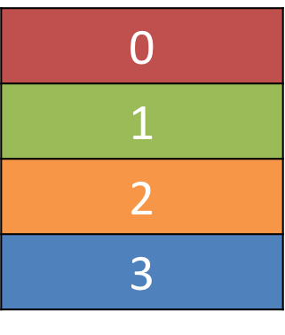
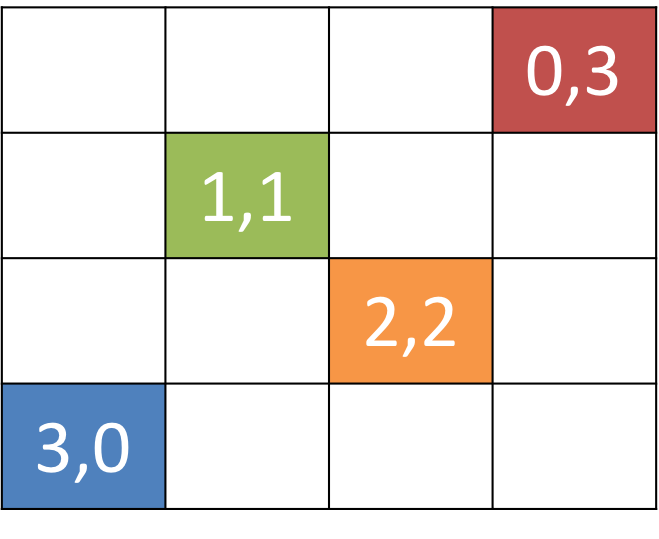
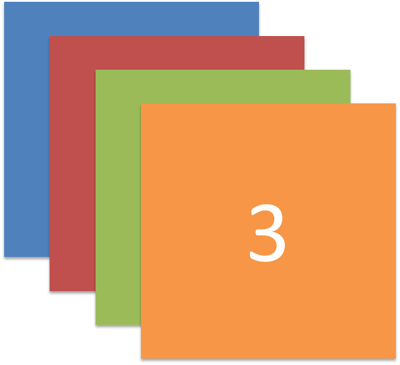
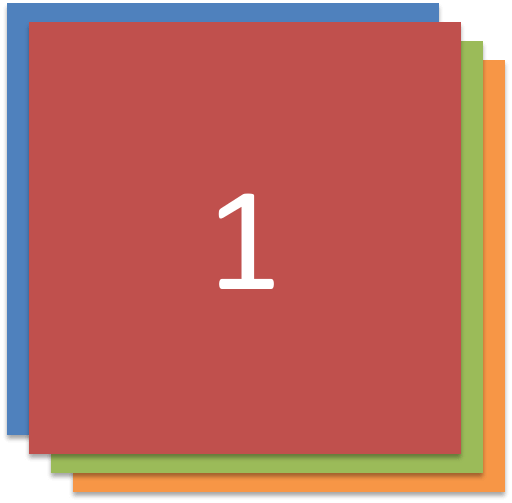
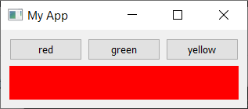
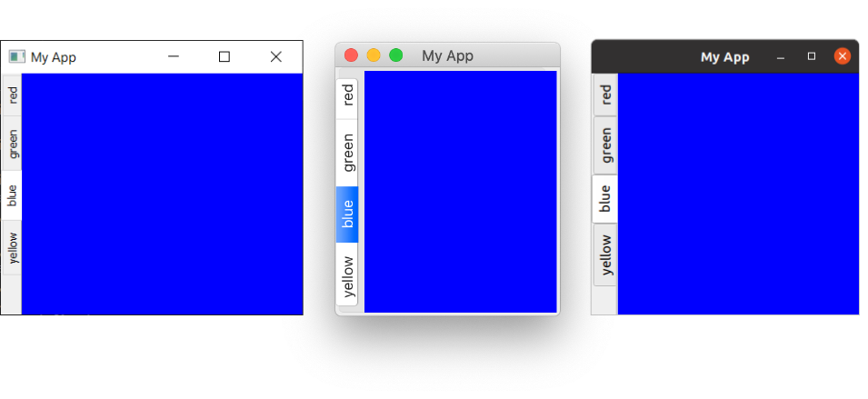

到目前为止，我们已经成功地创建了一个窗口，并向其中添加了一个部件。然而，我们通常希望向一个窗口添加多个部件，并对它们最终的位置进行一些控制。在 Qt 中，我们使用_布局_（layouts）来实现这一点。

Qt 中有 4 种基本布局，如下表所列。

<table><thead><tr><th>布局</th><th>行为</th></tr></thead><tbody><tr><td><code>QHBoxLayout</code></td><td>线性水平布局</td></tr><tr><td><code>QVBoxLayout</code></td><td>线性垂直布局</td></tr><tr><td><code>QGridLayout</code></td><td>可索引的 XxY 网格</td></tr><tr><td><code>QStackedLayout</code></td><td>一个叠一个（z 轴）堆叠</td></tr></tbody></table>

你也可以[使用 Qt Designer 以图形方式设计和布局你的界面](https://www.pythonguis.com/tutorials/qt-designer-gui-layout/)。这里我们使用代码，这样你可以理解其底层系统。

如你所见，Qt 中有三种可用的定位布局：`QVBoxLayout`、`QHBoxLayout` 和 `QGridLayout`。此外，还有 `QStackedLayout`，它允许你将部件一个叠一个地放置在同一空间内，但一次只显示一个。

在开始之前，我们需要一个简单的应用程序框架。将以下代码保存在一个名为 `app.py` 的文件中——我们将修改这个应用程序来试验不同的布局。

python

```python
import sys
from PySide6.QtWidgets import QApplication, QMainWindow, QWidget
from PySide6.QtGui import QPalette, QColor

class MainWindow(QMainWindow):

    def __init__(self):
        super().__init__()

        self.setWindowTitle("My App")


app = QApplication(sys.argv)
window = MainWindow()
window.show()
app.exec()
```

为了让布局更容易可视化，我们首先创建一个简单的自定义部件，它能显示我们选择的纯色。这将有助于区分我们添加到布局中的不同部件。创建一个名为 `layout_colorwidget.py` 的新文件，其中包含以下代码：

python

```python
from PySide6.QtGui import QColor, QPalette
from PySide6.QtWidgets import QWidget


class Color(QWidget):
    def __init__(self, color):
        super().__init__()
        self.setAutoFillBackground(True)

        palette = self.palette()
        palette.setColor(QPalette.ColorRole.Window, QColor(color))
        self.setPalette(palette)
```

将此代码作为_一个新文件_保存在与主脚本相同的文件夹中，并命名为 `layout_colorwidget.py`。然后我们就可以在下面导入它。

在这段代码中，我们子类化 `QWidget` 来创建我们自己的自定义部件 `Color`。在创建该部件时，我们接受一个参数——`color`（一个 `str`）。我们首先设置 `.setAutoFillBackground` 为 `True`，告诉部件自动用窗口颜色填充其背景。接下来，我们获取当前的调色板（默认是全局桌面调色板），并将当前的 `QPalette.Window` 颜色更改为我们传入的 `color` 值所描述的新 `QColor`。最后，我们将这个调色板应用回部件。最终结果是一个用我们在创建时指定的纯色填充的部件。

如果你觉得上述内容令人困惑，不要太担心。我们稍后会更详细地介绍自定义部件。目前，你只需要理解通过以下方式可以创建一个纯红色填充的部件就足够了：

首先，让我们通过用它来将整个窗口填充为单一颜色来测试我们新的 `Color` 部件。完成后，我们可以使用 `.setCentralWidget` 将其添加到 `QMainWindow` 中，然后我们得到一个纯红色的窗口。

python

```python
import sys

from PySide6.QtWidgets import QApplication, QMainWindow, QWidget

from layout_colorwidget import Color


class MainWindow(QMainWindow):
    def __init__(self):
        super().__init__()
        self.setWindowTitle("My App")

        widget = Color("red")
        self.setCentralWidget(widget)


app = QApplication(sys.argv)
window = MainWindow()
window.show()
app.exec()
```

**运行它！** 窗口将会出现，并完全被红色填充。注意部件是如何扩展以填充所有可用空间的。

接下来，我们将依次看看 Qt 中可用的每种布局。请注意，要将我们的布局添加到窗口中，我们将需要一个虚拟的 `QWidget` 来持有该布局。

### `QVBoxLayout` 垂直排列的部件

使用 `QVBoxLayout`，你可以将部件一个接一个地垂直排列。添加一个部件会将其添加到列的底部。

 _一个 QVBoxLayout，从上到下填充。_

让我们将我们的部件添加到一个布局中。请注意，为了将布局添加到 `QMainWindow`，我们需要将其应用到一个虚拟的 `QWidget` 上。这使我们能够使用 `.setCentralWidget` 将该部件（和布局）应用到窗口上。我们的彩色部件将自行在布局中排列，包含在窗口的 `QWidget` 内。

首先，我们需要从 `PySide6.QtWidgets` 导入 `QVBoxLayout`，然后像之前一样添加红色部件：

python

```python
class MainWindow(QMainWindow):
    def __init__(self):
        super().__init__()

        self.setWindowTitle("My App")

        layout = QVBoxLayout()

        layout.addWidget(Color('red'))

        widget = QWidget()
        widget.setLayout(layout)
        self.setCentralWidget(widget)
```

**运行它！** 注意现在红色部件周围可见的边框。这是布局的间距——我们稍后会看到如何调整它。

如果你向布局中添加更多彩色部件，你会注意到它们会按照添加的顺序垂直排列。

python

```python
class MainWindow(QMainWindow):
    def __init__(self):
        super().__init__()

        self.setWindowTitle("My App")

        layout = QVBoxLayout()

        layout.addWidget(Color('red'))
        layout.addWidget(Color('green'))
        layout.addWidget(Color('blue'))

        widget = QWidget()
        widget.setLayout(layout)
        self.setCentralWidget(widget)
```

### `QHBoxLayout` 水平排列的部件

`QHBoxLayout` 是相同的，只是方向是水平的。添加一个部件会将其添加到右侧。

 _一个 QHBoxLayout，从左到右填充。_

要使用它，我们只需将 `QVBoxLayout` 更改为 `QHBoxLayout`。现在这些盒子从左到右流动。

python

```python
class MainWindow(QMainWindow):
    def __init__(self):
        super().__init__()

        self.setWindowTitle("My App")

        layout = QHBoxLayout()

        layout.addWidget(Color('red'))
        layout.addWidget(Color('green'))
        layout.addWidget(Color('blue'))

        widget = QWidget()
        widget.setLayout(layout)
        self.setCentralWidget(widget)
```

### 嵌套布局

对于更复杂的布局，你可以使用布局上的 `.addLayout` 将布局嵌套在另一个布局中。下面我们将一个 `QVBoxLayout` 添加到主 `QHBoxLayout` 中。如果我们向 `QVBoxLayout` 添加一些部件，它们将在父布局的第一个槽中垂直排列。

python

```python
class MainWindow(QMainWindow):
    def __init__(self):
        super().__init__()

        self.setWindowTitle("My App")

        layout1 = QHBoxLayout()
        layout2 = QVBoxLayout()
        layout3 = QVBoxLayout()

        layout2.addWidget(Color('red'))
        layout2.addWidget(Color('yellow'))
        layout2.addWidget(Color('purple'))

        layout1.addLayout( layout2 )

        layout1.addWidget(Color('green'))

        layout3.addWidget(Color('red'))
        layout3.addWidget(Color('purple'))

        layout1.addLayout( layout3 )

        widget = QWidget()
        widget.setLayout(layout1)
        self.setCentralWidget(widget)
```

**运行它！** 部件应该水平排列成 3 列，其中第一列还包含 3 个垂直堆叠的部件。自己动手试试吧！

你可以使用 `.setContentMargins` 设置布局周围的间距，或使用 `.setSpacing` 设置元素之间的间距。

python

```python
layout1.setContentsMargins(0,0,0,0)
layout1.setSpacing(20)
```

以下代码展示了嵌套部件和布局边距及间距的组合。尝试调整这些数字，直到你对它们有感觉。

python

```python
class MainWindow(QMainWindow):
    def __init__(self):
        super().__init__()

        self.setWindowTitle("My App")

        layout1 = QHBoxLayout()
        layout2 = QVBoxLayout()
        layout3 = QVBoxLayout()

        layout1.setContentsMargins(0,0,0,0)
        layout1.setSpacing(20)

        layout2.addWidget(Color('red'))
        layout2.addWidget(Color('yellow'))
        layout2.addWidget(Color('purple'))

        layout1.addLayout( layout2 )

        layout1.addWidget(Color('green'))

        layout3.addWidget(Color('red'))
        layout3.addWidget(Color('purple'))

        layout1.addLayout( layout3 )

        widget = QWidget()
        widget.setLayout(layout1)
        self.setCentralWidget(widget)
```

### `QGridLayout` 部件排列在网格中

尽管 `QVBoxLayout` 和 `QHBoxLayout` 很有用，但如果你尝试用它们来布局多个元素（例如表单），你会发现很难确保不同大小的部件对齐。`QGridLayout` 就是解决这个问题的方案。

 _一个显示每个位置网格坐标的 QGridLayout。_

`QGridLayout` 允许你将项目专门放置在一个网格中。你为每个部件指定行和列的位置。你可以跳过某些元素，它们将保持为空。

`QGridLayout` 的一个有用之处在于，你不需要填充网格中的所有位置。

 _一个有未填充槽位的 QGridLayout。_

python

```python
class MainWindow(QMainWindow):
    def __init__(self):
        super().__init__()

        self.setWindowTitle("My App")

        layout = QGridLayout()

        layout.addWidget(Color('red'), 0, 0)
        layout.addWidget(Color('green'), 1, 0)
        layout.addWidget(Color('blue'), 1, 1)
        layout.addWidget(Color('purple'), 2, 1)

        widget = QWidget()
        widget.setLayout(layout)
        self.setCentralWidget(widget)
```

### `QStackedLayout` 在同一空间内的多个部件

我们将介绍的最后一个布局是 `QStackedLayout`。如前所述，这个布局允许你将元素直接一个叠一个地放置。然后你可以选择你想要显示的部件。你可以用它来在图形应用程序中绘制图层，或者模仿类似标签页的界面。注意还有一个 `QStackedWidget`，它是一个容器部件，工作方式完全相同。如果你想直接用 `.setCentralWidget` 将一个堆叠部件添加到 `QMainWindow` 中，这个会很有用。

 _QStackedLayout — 使用时只有最上面的部件可见，默认是第一个添加到布局的部件。_

 _QStackedLayout，第二个（索引为 1）部件被选中并带到前面。_

python

```python
from PySide6.QtWidgets import QStackedLayout  # 添加此导入


class MainWindow(QMainWindow):
    def __init__(self):
        super().__init__()

        self.setWindowTitle("My App")

        layout = QStackedLayout()

        layout.addWidget(Color("red"))
        layout.addWidget(Color("green"))
        layout.addWidget(Color("blue"))
        layout.addWidget(Color("yellow"))

        layout.setCurrentIndex(3)

        widget = QWidget()
        widget.setLayout(layout)
        self.setCentralWidget(widget)
```

`QStackedWidget` 正是应用程序中标签式视图的工作方式。任何时候只有一个视图（“标签页”）是可见的。你可以随时使用 `.setCurrentIndex()` 或 `.setCurrentWidget()` 来控制显示哪个部件，通过索引（部件添加的顺序）或部件本身来设置。

下面是一个简短的演示，使用 `QStackedLayout` 结合 `QPushButton` 为应用程序提供一个类似标签页的界面：

python

```python
import sys

from PySide6.QtCore import Qt
from PySide6.QtWidgets import (
    QApplication,
    QHBoxLayout,
    QLabel,
    QMainWindow,
    QPushButton,
    QStackedLayout,
    QVBoxLayout,
    QWidget,
)

from layout_colorwidget import Color


class MainWindow(QMainWindow):
    def __init__(self):
        super().__init__()

        self.setWindowTitle("My App")

        pagelayout = QVBoxLayout()
        button_layout = QHBoxLayout()
        self.stacklayout = QStackedLayout()

        pagelayout.addLayout(button_layout)
        pagelayout.addLayout(self.stacklayout)

        btn = QPushButton("red")
        btn.pressed.connect(self.activate_tab_1)
        button_layout.addWidget(btn)
        self.stacklayout.addWidget(Color("red"))

        btn = QPushButton("green")
        btn.pressed.connect(self.activate_tab_2)
        button_layout.addWidget(btn)
        self.stacklayout.addWidget(Color("green"))

        btn = QPushButton("yellow")
        btn.pressed.connect(self.activate_tab_3)
        button_layout.addWidget(btn)
        self.stacklayout.addWidget(Color("yellow"))

        widget = QWidget()
        widget.setLayout(pagelayout)
        self.setCentralWidget(widget)

    def activate_tab_1(self):
        self.stacklayout.setCurrentIndex(0)

    def activate_tab_2(self):
        self.stacklayout.setCurrentIndex(1)

    def activate_tab_3(self):
        self.stacklayout.setCurrentIndex(2)


app = QApplication(sys.argv)
window = MainWindow()
window.show()
app.exec()
```

 _一个使用 QStackedLayout 实现的自定义标签式界面。_

很方便的是，Qt 实际上提供了一个内置的 TabWidget，它开箱即用地提供了这种布局——尽管是以部件的形式。下面是使用 `QTabWidget` 重新创建的标签页演示：

python

```python
import sys

from PySide6.QtCore import Qt
from PySide6.QtWidgets import (
    QApplication,
    QLabel,
    QMainWindow,
    QPushButton,
    QTabWidget,
    QWidget,
)

from layout_colorwidget import Color


class MainWindow(QMainWindow):
    def __init__(self):
        super().__init__()

        self.setWindowTitle("My App")

        tabs = QTabWidget()
        tabs.setTabPosition(QTabWidget.West)
        tabs.setMovable(True)

        for color in ["red", "green", "blue", "yellow"]:
            tabs.addTab(Color(color), color)

        self.setCentralWidget(tabs)


app = QApplication(sys.argv)
window = MainWindow()
window.show()
app.exec()
```

 _一个使用 QTabWidget 的标签式界面。_

如你所见，它更直接一些——也更美观一些！你可以使用基本方向来设置标签页的位置，用 `.setMoveable` 切换标签页是否可移动。你会注意到 macOS 的标签栏看起来与其他系统大不相同——默认情况下，macOS 上的标签页采用_药丸_或_气泡_样式。在 macOS 上，这通常用于标签式的配置面板。对于文档，你可以开启_文档模式_以获得与其他平台上看到的类似的细长标签页。这个选项在其他平台上没有效果。

python

```python
    tabs = QTabWidget()
    tabs.setDocumentMode(True)
```

 _macOS 上处于文档模式的 QTabWidget。_

我们稍后会遇到更多这样高级的部件。

