接下来，我们将了解一些你可能在许多其他应用程序中见过的常见用户界面元素——工具栏和菜单。我们还将探讨 Qt 提供的一个巧妙的系统，用于最小化不同 UI 区域之间的重复——`QAction`。

基础应用
---------

我们将从一个简单的骨架应用程序开始本教程，我们可以对其进行自定义。将以下代码保存在一个名为 `app.py` 的文件中——此代码包含了后续步骤所需的所有导入：

python

```python
from PySide6.QtCore import QSize, Qt
from PySide6.QtGui import QAction, QIcon, QKeySequence
from PySide6.QtWidgets import (
    QApplication,
    QCheckBox,
    QLabel,
    QMainWindow,
    QStatusBar,
    QToolBar,
)

class MainWindow(QMainWindow):
    def __init__(self):
        super().__init__()
        self.setWindowTitle("My App")

app = QApplication([])
window = MainWindow()
window.show()
app.exec()
```

该文件包含了你完成本教程中示例所需的导入和基本代码。

如果你正在从 PySide2 迁移到 PySide6，请注意 `QAction` 现在通过 `QtGui` 模块可用。

工具栏是最常见的用户界面元素之一。工具栏是图标和/或文本的条，用于在应用程序中执行常见任务，而通过菜单访问这些任务会很麻烦。它们是许多应用程序中最常见的 UI 功能之一。虽然一些复杂的应用程序，特别是微软 Office 套件，已经迁移到上下文相关的“功能区”界面，但对于你将要创建的大多数应用程序来说，标准工具栏通常就足够了。

 _标准 GUI 元素_

让我们首先向我们的应用程序添加一个工具栏。

超过 **15,000 名开发者** 购买了《用 Python 和 Qt 创建 GUI 应用程序》！

#### 购买力平价

中国的开发者使用代码 DQ3JY5 购买所有书籍和课程可享受 35% 的折扣

在 Qt 中，工具栏由 `QToolBar` 类创建。首先，你创建该类的实例，然后在 `QMainWindow` 上调用 `addToolbar`。将一个字符串作为第一个参数传递给 `QToolBar` 会设置工具栏的名称，该名称将用于在 UI 中标识该工具栏：

python

```python
class MainWindow(QMainWindow):
    def __init__(self):
        super().__init__()
        self.setWindowTitle("My App")

        label = QLabel("Hello!")
        label.setAlignment(Qt.AlignmentFlag.AlignCenter)

        self.setCentralWidget(label)

        toolbar = QToolBar("My main toolbar")
        self.addToolBar(toolbar)
```

**运行它！** 你会在窗口顶部看到一个细细的灰色条。这就是你的工具栏。右键单击该名称以触发上下文菜单并关闭该栏。

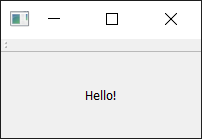 _带工具栏的窗口。_

**如何找回我的工具栏？** 不幸的是，一旦你移除了一个工具栏，就没有地方可以右键单击来重新添加它。因此，作为一般规则，你要么保持一个工具栏不可移除，要么在菜单中提供一个备用界面来打开和关闭工具栏。

我们应该让工具栏更有趣一点。我们可以只添加一个 `QPushButton` 部件，但在 Qt 中有一个更好的方法，可以为你提供一些额外的功能——那就是通过 `QAction`。`QAction` 是一个提供描述抽象用户界面的方式的类。通俗地说，这意味着你可以在一个单一的对象中定义多个界面元素，通过与该元素交互所产生的效果将它们统一起来。

例如，通常有一些功能既在工具栏中表示，也在菜单中表示——想想看像_编辑->剪切_这样的功能，它既存在于_编辑_菜单中，也作为一把剪刀的图标出现在工具栏上，还可以通过键盘快捷键 `Ctrl-X`（在 Mac 上是 `Cmd-X`）来访问。

没有 `QAction`，你就必须在多个地方定义这个功能。但有了 `QAction`，你可以定义一个单一的 `QAction`，定义触发的动作，然后将这个动作同时添加到菜单和工具栏。每个 `QAction` 都有名称、状态消息、图标和可以连接的信号（以及更多）。

在下面的代码中，你可以看到添加的第一个 `QAction`：

python

```python
class MainWindow(QMainWindow):
    def __init__(self):
        super().__init__()
        self.setWindowTitle("My App")

        label = QLabel("Hello!")
        label.setAlignment(Qt.AlignmentFlag.AlignCenter)

        self.setCentralWidget(label)

        toolbar = QToolBar("My main toolbar")
        self.addToolBar(toolbar)

        button_action = QAction("Your button", self)
        button_action.setStatusTip("This is your button")
        button_action.triggered.connect(self.toolbar_button_clicked)
        toolbar.addAction(button_action)

    def toolbar_button_clicked(self, s):
        print("click", s)
```

首先，我们创建将接收来自 `QAction` 信号的函数，这样我们就可以看到它是否在工作。接下来，我们定义 `QAction` 本身。在创建实例时，我们可以为动作传递一个标签和/或一个图标。你还必须传入任何 `QObject` 作为该动作的父对象——这里我们传入 `self` 作为我们主窗口的引用。奇怪的是，对于 `QAction`，父元素是作为最后一个参数传入的。

接下来，我们可以选择设置一个状态提示——一旦我们有了状态栏，这段文本就会显示在状态栏上。最后，我们将 `triggered` 信号连接到自定义函数。每当 `QAction` 被_触发_（或激活）时，这个信号就会被发射。

**运行它！** 你应该会看到带有你定义的标签的按钮。点击它，然后我们的自定义方法将打印 "click" 和按钮的状态。

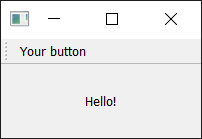 _显示我们的 `QAction` 按钮的工具栏。_

**为什么信号总是 false？** 传递的信号表示按钮是否被_选中_，由于我们的按钮是不可选中的——只是可点击的——所以它总是 false。我们很快就会展示如何让它变得可选。

接下来，我们可以添加一个状态栏。

我们通过调用 `QStatusBar` 创建一个状态栏对象，以获取一个新的状态栏对象，然后将其传入 `setStatusBar`。由于我们不需要更改状态栏的设置，我们也可以在创建它的时候就直接传入，用一行代码搞定：

python

```python
class MainWindow(QMainWindow):
    def __init__(self):
        super().__init__()
        self.setWindowTitle("My App")

        label = QLabel("Hello!")
        label.setAlignment(Qt.AlignmentFlag.AlignCenter)

        self.setCentralWidget(label)

        toolbar = QToolBar("My main toolbar")
        self.addToolBar(toolbar)

        button_action = QAction("Your button", self)
        button_action.setStatusTip("This is your button")
        button_action.triggered.connect(self.toolbar_button_clicked)
        toolbar.addAction(button_action)

        self.setStatusBar(QStatusBar(self))

    def toolbar_button_clicked(self, s):
        print("click", s)
```

**运行它！** 将你的鼠标悬停在工具栏按钮上，你会在状态栏中看到状态文本。

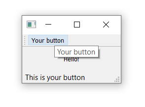 _当我们悬停在动作上时，状态栏文本会更新。_

接下来，我们将把我们的 `QAction` 变成可切换的——这样点击会打开它，再点击会关闭它。要做到这一点，我们只需在 `QAction` 对象上调用 `setCheckable(True)`：

python

```python
class MainWindow(QMainWindow):
    def __init__(self):
        super().__init__()
        self.setWindowTitle("My App")

        label = QLabel("Hello!")
        label.setAlignment(Qt.AlignmentFlag.AlignCenter)

        self.setCentralWidget(label)

        toolbar = QToolBar("My main toolbar")
        self.addToolBar(toolbar)

        button_action = QAction("Your button", self)
        button_action.setStatusTip("This is your button")
        button_action.triggered.connect(self.toolbar_button_clicked)
        button_action.setCheckable(True)
        toolbar.addAction(button_action)

        self.setStatusBar(QStatusBar(self))

    def toolbar_button_clicked(self, s):
        print("click", s)
```

**运行它！** 点击按钮，看它在选中和未选中状态之间切换。注意，我们创建的自定义槽方法现在会交替输出 `True` 和 `False`。

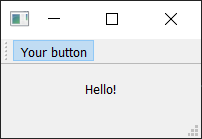 _工具栏按钮被切换为打开状态。_

还有一个 `toggled` 信号，它只在按钮被切换时才发射信号。但效果是相同的，所以它基本上是多余的。

现在看起来有点寒酸——所以让我们给按钮添加一个图标。为此，我建议你下载设计师 Yusuke Kamiyamane 的 [fugue 图标集](http://p.yusukekamiyamane.com/)。这是一套很棒的、漂亮的 16x16 图标，可以让你的应用看起来很专业。它是免费的，只需在分发你的应用程序时署名即可——当然，如果你有闲钱，我相信设计师也会很感激一些现金。

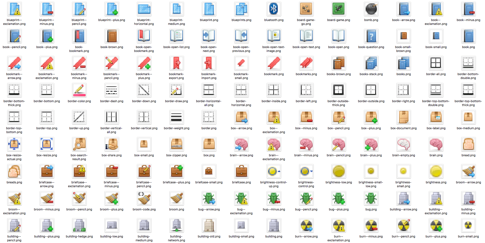 _Fugue 图标集 — Yusuke Kamiyamane_

从图标集中选择一张图片（在这里的示例中，我选择了文件 `bug.png`）并将其复制到与你的源代码相同的文件夹中。

我们可以通过将文件名传递给类来创建一个 `QIcon` 对象，例如 `QIcon("bug.png")` —— 如果你将文件放在另一个文件夹中，你需要提供一个完整的相对或绝对路径。

最后，要将图标添加到 `QAction`（也就是按钮），我们只需在创建 `QAction` 时将其作为第一个参数传入。

你还需要让工具栏知道你的图标有多大。否则，你的图标周围会有很多填充。你可以通过调用 `setIconSize()` 并传入一个 `QSize` 对象来做到这一点：

python

```python
class MainWindow(QMainWindow):
    def __init__(self):
        super().__init__()
        self.setWindowTitle("My App")

        label = QLabel("Hello!")
        label.setAlignment(Qt.AlignmentFlag.AlignCenter)

        self.setCentralWidget(label)

        toolbar = QToolBar("My main toolbar")
        toolbar.setIconSize(QSize(16, 16))
        self.addToolBar(toolbar)

        button_action = QAction(QIcon("bug.png"), "Your button", self)
        button_action.setStatusTip("This is your button")
        button_action.triggered.connect(self.toolbar_button_clicked)
        button_action.setCheckable(True)
        toolbar.addAction(button_action)

        self.setStatusBar(QStatusBar(self))

    def toolbar_button_clicked(self, s):
        print("click", s)
```

**运行它！** `QAction` 现在由一个图标表示。一切都应该和以前一样工作。

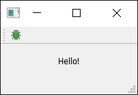 _我们带有图标的动作按钮。_

请注意，Qt 使用你操作系统的默认设置来决定是在工具栏中显示图标、文本，还是图标和文本。但你可以通过使用 `setToolButtonStyle()` 来覆盖它。这个槽接受来自 `Qt` 命名空间的以下任何标志：

<table><thead><tr><th>标志</th><th>行为</th></tr></thead><tbody><tr><td><code>Qt.ToolButtonStyle.ToolButtonIconOnly</code></td><td>仅图标，无文本</td></tr><tr><td><code>Qt.ToolButtonStyle.ToolButtonTextOnly</code></td><td>仅文本，无图标</td></tr><tr><td><code>Qt.ToolButtonStyle.ToolButtonTextBesideIcon</code></td><td>图标和文本，文本在图标旁边</td></tr><tr><td><code>Qt.ToolButtonStyle.ToolButtonTextUnderIcon</code></td><td>图标和文本，文本在图标下方</td></tr><tr><td><code>Qt.ToolButtonStyle.ToolButtonFollowStyle</code></td><td>遵循主机桌面样式</td></tr></tbody></table>

默认值是 `Qt.ToolButtonStyle.ToolButtonFollowStyle`，这意味着你的应用程序将默认遵循其运行所在的桌面的标准/全局设置。通常建议这样做，以使你的应用程序感觉尽可能地_原生_。

最后，我们可以在工具栏上添加一些其他的东西。我们将添加第二个按钮和一个复选框部件。如前所述，你几乎可以把任何部件放在这里，所以尽管发挥你的想象力：

python

```python
from PySide6.QtCore import QSize, Qt
from PySide6.QtGui import QAction, QIcon
from PySide6.QtWidgets import (
    QApplication,
    QCheckBox,
    QLabel,
    QMainWindow,
    QStatusBar,
    QToolBar,
)

class MainWindow(QMainWindow):
    def __init__(self):
        super().__init__()
        self.setWindowTitle("My App")

        label = QLabel("Hello!")
        label.setAlignment(Qt.AlignmentFlag.AlignCenter)

        self.setCentralWidget(label)

        toolbar = QToolBar("My main toolbar")
        toolbar.setIconSize(QSize(16, 16))
        self.addToolBar(toolbar)

        button_action = QAction(QIcon("bug.png"), "&Your button", self)
        button_action.setStatusTip("This is your button")
        button_action.triggered.connect(self.toolbar_button_clicked)
        button_action.setCheckable(True)
        toolbar.addAction(button_action)

        toolbar.addSeparator()

        button_action2 = QAction(QIcon("bug.png"), "Your &button2", self)
        button_action2.setStatusTip("This is your button2")
        button_action2.triggered.connect(self.toolbar_button_clicked)
        button_action2.setCheckable(True)
        toolbar.addAction(button_action2)

        toolbar.addWidget(QLabel("Hello"))
        toolbar.addWidget(QCheckBox())

        self.setStatusBar(QStatusBar(self))

    def toolbar_button_clicked(self, s):
        print("click", s)

app = QApplication([])
window = MainWindow()
window.show()
app.exec()
```

**运行它！** 现在你会看到多个按钮和一个复选框。

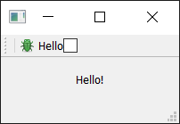 _带有一个动作和两个部件的工具栏。_

菜单是 UI 的另一个标准组成部分。通常，它们位于窗口的顶部，或者在 macOS 上位于屏幕的顶部。它们允许你访问所有标准的应用程序功能。存在一些标准的菜单——例如_文件_、_编辑_、_帮助_。菜单可以嵌套以创建功能的层次结构树，并且它们通常支持并显示用于快速访问其功能的键盘快捷键。

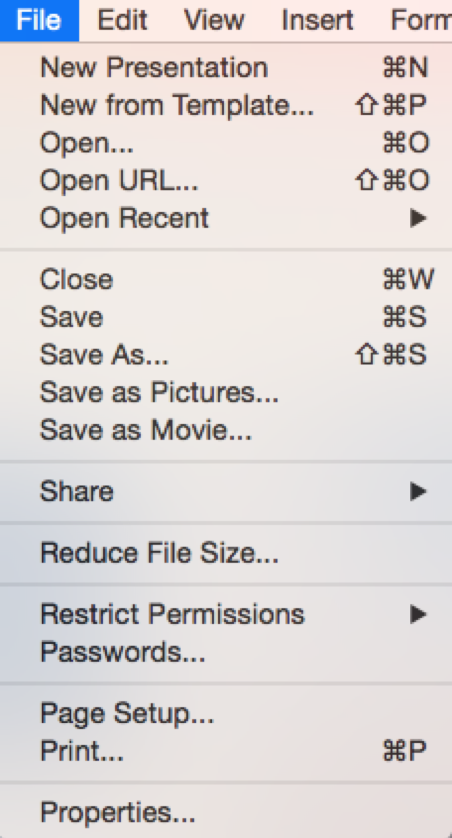 _标准 GUI 元素 - 菜单_

要创建菜单，我们创建一个菜单栏，我们在 `QMainWindow` 上调用 `menuBar()`。我们通过调用 `addMenu()` 向我们的菜单栏添加一个菜单，并传入菜单的名称。我把它命名为 `'&File'`。与号定义了一个在按下 Alt 键时跳转到此菜单的快捷键。

这在 macOS 上是不可见的。请注意，这与键盘快捷键不同——我们稍后会讲到。

这就是 `QAction` 的强大之处。我们可以重用已经存在的 `QAction` 来将相同的功能添加到菜单中。要添加一个动作，你调用 `addAction()` 并传入我们定义的一个动作：

python

```python
class MainWindow(QMainWindow):
    def __init__(self):
        super().__init__()
        self.setWindowTitle("My App")

        label = QLabel("Hello!")
        label.setAlignment(Qt.AlignmentFlag.AlignCenter)

        self.setCentralWidget(label)

        toolbar = QToolBar("My main toolbar")
        toolbar.setIconSize(QSize(16, 16))
        self.addToolBar(toolbar)

        button_action = QAction(QIcon("bug.png"), "&Your button", self)
        button_action.setStatusTip("This is your button")
        button_action.triggered.connect(self.toolbar_button_clicked)
        button_action.setCheckable(True)
        toolbar.addAction(button_action)

        toolbar.addSeparator()

        button_action2 = QAction(QIcon("bug.png"), "Your &button2", self)
        button_action2.setStatusTip("This is your button2")
        button_action2.triggered.connect(self.toolbar_button_clicked)
        button_action2.setCheckable(True)
        toolbar.addAction(button_action2)

        toolbar.addWidget(QLabel("Hello"))
        toolbar.addWidget(QCheckBox())

        self.setStatusBar(QStatusBar(self))

        menu = self.menuBar()

        file_menu = menu.addMenu("&File")
        file_menu.addAction(button_action)

    def toolbar_button_clicked(self, s):
        print("click", s)
```

**运行它！** 点击菜单中的项目，你会注意到它是可切换的——它继承了 `QAction` 的特性。

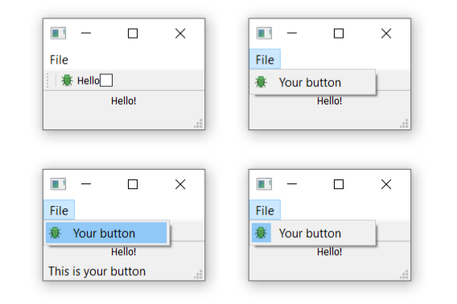 _窗口上显示的菜单——在 macOS 上，这将位于屏幕顶部。_

让我们向菜单中添加更多东西。在这里，我们将在菜单中添加一个分隔符，它将在菜单中显示为一条水平线，然后添加我们创建的第二个 `QAction`：

python

```python
class MainWindow(QMainWindow):
    def __init__(self):
        super().__init__()
        self.setWindowTitle("My App")

        label = QLabel("Hello!")
        label.setAlignment(Qt.AlignmentFlag.AlignCenter)

        self.setCentralWidget(label)

        toolbar = QToolBar("My main toolbar")
        toolbar.setIconSize(QSize(16, 16))
        self.addToolBar(toolbar)

        button_action = QAction(QIcon("bug.png"), "&Your button", self)
        button_action.setStatusTip("This is your button")
        button_action.triggered.connect(self.toolbar_button_clicked)
        button_action.setCheckable(True)
        toolbar.addAction(button_action)

        toolbar.addSeparator()

        button_action2 = QAction(QIcon("bug.png"), "Your &button2", self)
        button_action2.setStatusTip("This is your button2")
        button_action2.triggered.connect(self.toolbar_button_clicked)
        button_action2.setCheckable(True)
        toolbar.addAction(button_action2)

        toolbar.addWidget(QLabel("Hello"))
        toolbar.addWidget(QCheckBox())

        self.setStatusBar(QStatusBar(self))

        menu = self.menuBar()

        file_menu = menu.addMenu("&File")
        file_menu.addAction(button_action)
        file_menu.addSeparator()
        file_menu.addAction(button_action2)

    def toolbar_button_clicked(self, s):
        print("click", s)
```

**运行它！** 你应该会看到两个菜单项，中间有一条线。

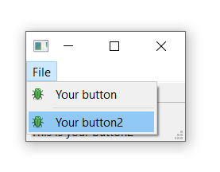 _我们的动作显示在菜单中。_

你也可以使用与号为菜单添加_加速键_，以允许在菜单打开时使用单个键跳转到某个菜单项。同样，这在 macOS 上不起作用。

要添加子菜单，你只需在父菜单上调用 `addMenu()` 来创建一个新菜单。然后你可以像往常一样向其添加动作。例如：

python

```python
class MainWindow(QMainWindow):
    def __init__(self):
        super().__init__()
        self.setWindowTitle("My App")

        label = QLabel("Hello!")
        label.setAlignment(Qt.AlignmentFlag.AlignCenter)

        self.setCentralWidget(label)

        toolbar = QToolBar("My main toolbar")
        toolbar.setIconSize(QSize(16, 16))
        self.addToolBar(toolbar)

        button_action = QAction(QIcon("bug.png"), "&Your button", self)
        button_action.setStatusTip("This is your button")
        button_action.triggered.connect(self.toolbar_button_clicked)
        button_action.setCheckable(True)
        toolbar.addAction(button_action)

        toolbar.addSeparator()

        button_action2 = QAction(QIcon("bug.png"), "Your &button2", self)
        button_action2.setStatusTip("This is your button2")
        button_action2.triggered.connect(self.toolbar_button_clicked)
        button_action2.setCheckable(True)
        toolbar.addAction(button_action2)

        toolbar.addWidget(QLabel("Hello"))
        toolbar.addWidget(QCheckBox())

        self.setStatusBar(QStatusBar(self))

        menu = self.menuBar()

        file_menu = menu.addMenu("&File")
        file_menu.addAction(button_action)
        file_menu.addSeparator()

        file_submenu = file_menu.addMenu("Submenu")
        file_submenu.addAction(button_action2)

    def toolbar_button_clicked(self, s):
        print("click", s)
```

**运行它！** 你将在_文件_菜单中看到一个嵌套菜单。

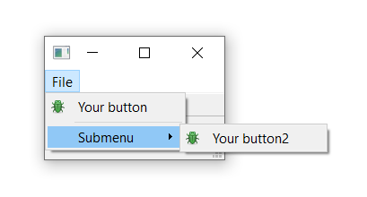 _嵌套在文件菜单中的子菜单。_

最后，我们将为 `QAction` 添加一个键盘快捷键。你通过调用 `setShortcut()` 并传入键序列来定义键盘快捷键。任何定义的键序列都会出现在菜单中。

请注意，键盘快捷键与 `QAction` 相关联，无论 `QAction` 是否被添加到菜单或工具栏，它都将起作用。

键序列可以通过多种方式定义——或者通过传入文本，使用 `Qt` 命名空间中的键名，或者使用 `QKeySequence` 命名空间中定义的键序列。尽可能使用后者，以确保与操作系统标准兼容。

下面是显示工具栏按钮和菜单的完整代码：

python

```python
from PySide6.QtCore import QSize, Qt
from PySide6.QtGui import QAction, QIcon, QKeySequence
from PySide6.QtWidgets import (
    QApplication,
    QCheckBox,
    QLabel,
    QMainWindow,
    QStatusBar,
    QToolBar,
)

class MainWindow(QMainWindow):
    def __init__(self):
        super().__init__()
        self.setWindowTitle("My App")

        label = QLabel("Hello!")

        # `Qt` 命名空间有很多属性可以自定义
        # 部件。请看: http://doc.qt.io/qt-6/qt.html
        label.setAlignment(Qt.AlignmentFlag.AlignCenter)

        # 设置窗口的中央部件。默认情况下，部件将扩展
        # 以占据窗口中的所有空间。
        self.setCentralWidget(label)

        toolbar = QToolBar("My main toolbar")
        toolbar.setIconSize(QSize(16, 16))
        self.addToolBar(toolbar)

        button_action = QAction(QIcon("bug.png"), "&Your button", self)
        button_action.setStatusTip("This is your button")
        button_action.triggered.connect(self.toolbar_button_clicked)
        button_action.setCheckable(True)
        # 你可以使用键名（例如 Ctrl+p）、
        # Qt.namespace 标识符（例如 Qt.CTRL + Qt.Key_P）
        # 或与系统无关的标识符（例如 QKeySequence.Print）来输入键盘快捷键
        button_action.setShortcut(QKeySequence("Ctrl+p"))
        toolbar.addAction(button_action)

        toolbar.addSeparator()

        button_action2 = QAction(QIcon("bug.png"), "Your &button2", self)
        button_action2.setStatusTip("This is your button2")
        button_action2.triggered.connect(self.toolbar_button_clicked)
        button_action2.setCheckable(True)
        toolbar.addAction(button_action2)

        toolbar.addWidget(QLabel("Hello"))
        toolbar.addWidget(QCheckBox())

        self.setStatusBar(QStatusBar(self))

        menu = self.menuBar()

        file_menu = menu.addMenu("&File")
        file_menu.addAction(button_action)

        file_menu.addSeparator()

        file_submenu = file_menu.addMenu("Submenu")

        file_submenu.addAction(button_action2)

    def toolbar_button_clicked(self, s):
        print("click", s)

app = QApplication([])
window = MainWindow()
window.show()
app.exec()
```

尝试使用 `QAction` 和 `QMenu` 构建你自己的菜单吧。