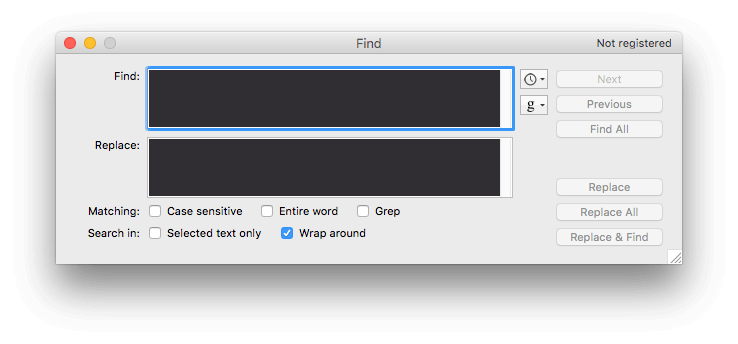
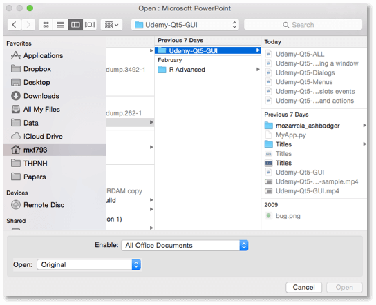
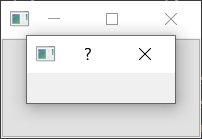
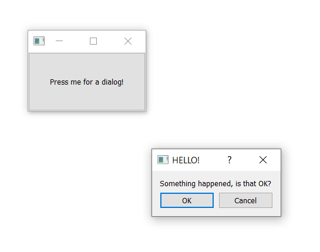
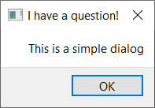
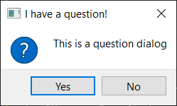
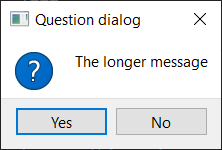
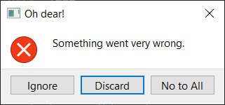

对话框是有用的 GUI 组件，它允许你与用户*交流*（这也是*对话框*这个名字的由来）。它们通常用于文件的打开/保存、设置、偏好选项，或用于那些不适合放在应用程序主界面中的功能。它们是小的*模态*（或*阻塞式*）窗口，会出现在主应用程序前面，直到它们被关闭。Qt 为最常见的用例提供了许多“特殊”的内置对话框，使你能够提供平台原生的用户体验。

 _标准 GUI 功能 — 搜索对话框_

 _标准 GUI 功能 — 文件打开对话框_

在 Qt 中，对话框由 `QDialog` 类处理。要创建一个新的对话框，只需创建一个 `QDialog` 类型的新对象，并将另一个部件（例如 `QMainWindow`）作为其父部件传入。

让我们创建自己的 `QDialog`。我们将从一个简单的骨架应用开始，其中有一个按钮连接到一个槽方法。

python

```python
import sys

from PySide6.QtWidgets import QApplication, QMainWindow, QPushButton


class MainWindow(QMainWindow):
    def __init__(self):
        super().__init__()

        self.setWindowTitle("My App")

        button = QPushButton("Press me for a dialog!")
        button.clicked.connect(self.button_clicked)
        self.setCentralWidget(button)

    def button_clicked(self, s):
        print("click", s)


app = QApplication(sys.argv)
window = MainWindow()
window.show()
app.exec()
```

在 `button_clicked` 槽中（它接收来自按钮按下的信号），我们创建对话框实例，将我们的 `QMainWindow` 实例作为父部件传入。这将使该对话框成为 `QMainWindow` 的一个*模态窗口*。这意味着该对话框将完全阻塞与父窗口的交互。

python

```python
import sys

from PySide6.QtWidgets import QApplication, QDialog, QMainWindow, QPushButton


class MainWindow(QMainWindow):
    def __init__(self):
        super().__init__()

        self.setWindowTitle("My App")

        button = QPushButton("Press me for a dialog!")
        button.clicked.connect(self.button_clicked)
        self.setCentralWidget(button)

    def button_clicked(self, s):
        print("click", s)

        dlg = QDialog(self)
        dlg.setWindowTitle("HELLO!")
        dlg.exec()


app = QApplication(sys.argv)
window = MainWindow()
window.show()
app.exec()
```

_运行它！_ 点击按钮，你会看到一个空的对话框出现。

一旦我们创建了对话框，我们使用 `exec()` 来启动它——就像我们为 `QApplication` 创建应用程序的主事件循环时所做的那样。这不是巧合：当你执行 `QDialog` 的 `exec()` 方法时，会创建一个全新的、专用于该对话框的事件循环。

`QDialog` 会完全阻塞你的应用程序执行。不要在启动一个对话框后，还期望你的应用中其他任何地方会发生任何事情。我们稍后会看到如何使用线程和进程来摆脱这个困境。

 _我们空的对话框覆盖在窗口之上。_

就像我们最初的窗口一样，这并不是很有趣。让我们通过添加一个对话框标题和一组“确定”和“取消”按钮来解决这个问题，以允许用户*接受*或*拒绝*该模态窗口。

要自定义 `QDialog`，我们可以对其进行子类化。

python

```python
class CustomDialog(QDialog):
    def __init__(self):
        super().__init__()

        self.setWindowTitle("HELLO!")

        QBtn = (
            QDialogButtonBox.Ok | QDialogButtonBox.Cancel
        )

        self.buttonBox = QDialogButtonBox(QBtn)
        self.buttonBox.accepted.connect(self.accept)
        self.buttonBox.rejected.connect(self.reject)

        layout = QVBoxLayout()
        message = QLabel("Something happened, is that OK?")
        layout.addWidget(message)
        layout.addWidget(self.buttonBox)
        self.setLayout(layout)
```

在上面的代码中，我们首先创建了 `QDialog` 的一个子类，我们称之为 `CustomDialog`。与 `QMainWindow` 一样，我们在类的 `__init__` 块中应用我们的自定义设置，这样在对象创建时我们的自定义设置就会被应用。首先，我们使用 `.setWindowTitle()` 为 `QDialog` 设置一个标题，这与我们为主窗口所做的完全相同。

下一段代码是关于创建和显示对话框按钮的。这可能比你预期的要复杂一些。然而，这是因为 Qt 在不同平台上处理对话框按钮定位方面具有灵活性。

你当然可以选择忽略这一点，并在布局中使用标准的 `QPushButton`，但这里概述的方法确保你的对话框尊重主机桌面的标准（例如，“确定”按钮在左边还是右边）。随意改变这些行为可能会让你的用户感到非常烦恼，所以我不建议这样做。

创建对话框按钮框的第一步是使用 `QDialogButtonBox` 命名空间中的属性来定义你想要显示的按钮。下面是可用的完整按钮列表：

*   `QDialogButtonBox.Ok`
*   `QDialogButtonBox.Open`
*   `QDialogButtonBox.Save`
*   `QDialogButtonBox.Cancel`
*   `QDialogButtonBox.Close`
*   `QDialogButtonBox.Discard`
*   `QDialogButtonBox.Apply`
*   `QDialogButtonBox.Reset`
*   `QDialogButtonBox.RestoreDefaults`
*   `QDialogButtonBox.Help`
*   `QDialogButtonBox.SaveAll`
*   `QDialogButtonBox.Yes`
*   `QDialogButtonBox.YesToAll`
*   `QDialogButtonBox.No`
*   `QDialogButtonBox.Abort`
*   `QDialogButtonBox.Retry`
*   `QDialogButtonBox.Ignore`
*   `QDialogButtonBox.NoButton`

这些应该足以创建你能想到的任何对话框。你可以通过使用管道符 (`|`) 将它们进行或运算来构建一行多个按钮。Qt 会根据平台标准自动处理顺序。例如，要显示一个“确定”和一个“取消”按钮，我们使用：

python

```python
buttons = QDialogButtonBox.Ok | QDialogButtonBox.Cancel
```

变量 `buttons` 现在包含一个代表这两个按钮的整数值。接下来，我们必须创建 `QDialogButtonBox` 实例来容纳这些按钮。要显示的按钮的标志作为第一个参数传入。

为了让这些按钮有任何效果，你必须将正确的 `QDialogButtonBox` 信号连接到对话框上的槽。在我们的例子中，我们将 `QDialogButtonBox` 的 `.accepted` 和 `.rejected` 信号连接到我们 `QDialog` 子类上的 `.accept()` 和 `.reject()` 处理函数。

最后，为了让 `QDialogButtonBox` 出现在我们的对话框中，我们必须将其添加到对话框的布局中。因此，与主窗口一样，我们创建一个布局，并将我们的 `QDialogButtonBox` 添加到其中（`QDialogButtonBox` 是一个部件），然后将该布局设置到我们的对话框上。

最后，我们在 `MainWindow.button_clicked` 槽中启动 `CustomDialog`。

python

```python
class MainWindow(QMainWindow):

    # ... 在 __init__ 之后添加以下方法

    def button_clicked(self, s):
        print("click", s)

        dlg = CustomDialog()
        if dlg.exec():
            print("Success!")
        else:
            print("Cancel!")
```

_运行它！_ 点击以启动对话框，你会看到一个带按钮的对话框。

 _我们带有一个标签和按钮的对话框。_

当你点击按钮启动对话框时，你可能会注意到它出现在离父窗口较远的地方——可能是在屏幕的中央。通常你希望对话框出现在它们的启动窗口之上，以便用户更容易找到它们。为此，我们需要给 Qt 一个对话框的*父窗口*。如果我们将主窗口作为父窗口传入，Qt 会将新对话框定位到对话框的中心与窗口的中心对齐的位置。

我们可以修改我们的 `CustomDialog` 类来接受一个 `parent` 参数。

python

```python
class CustomDialog(QDialog):
    def __init__(self, parent=None):
        super().__init__(parent)

        QBtn = (
            QDialogButtonBox.Ok | QDialogButtonBox.Cancel
        )

        self.buttonBox = QDialogButtonBox(QBtn)
        self.buttonBox.accepted.connect(self.accept)
        self.buttonBox.rejected.connect(self.reject)

        layout = QVBoxLayout()
        message = QLabel("Something happened, is that OK?")
        layout.addWidget(message)
        layout.addWidget(self.buttonBox)
        self.setLayout(layout)
```

我们设置了一个 `parent=None` 的默认值，这样如果我们愿意，可以省略父窗口。

然后，当我们创建 `CustomDialog` 的实例时，我们可以将主窗口作为参数传入。在我们的 `button_clicked` 方法中，`self` 就是我们的主窗口对象。

python

```python
    def button_clicked(self, s):
        print("click", s)

        dlg = CustomDialog(self)
        if dlg.exec():
            print("Success!")
        else:
            print("Cancel!")
```

_运行它！_ 点击以启动对话框，你应该会看到对话框正好在父窗口的中间弹出。

 _我们的对话框，居中于父窗口之上。_

恭喜！你已经创建了你的第一个对话框。当然，你可以继续向对话框中添加任何你喜欢的其他内容。只需像平常一样将它插入到布局中即可。

使用 `QMessageBox` 的简单消息对话框
-----------------------------------------

有许多对话框都遵循我们刚刚看到的简单模式——一条消息，以及你可以用来接受或取消对话框的按钮。虽然你可以自己构建这些对话框，但 Qt 也提供了一个名为 `QMessageBox` 的内置消息对话框类。它可以用来创建信息、警告、关于或提问对话框。

下面的例子创建了一个简单的 `QMessageBox` 并显示它。

python

```python
import sys

from PySide6.QtWidgets import QApplication, QMainWindow, QMessageBox, QPushButton


class MainWindow(QMainWindow):
    def __init__(self):
        super().__init__()

        self.setWindowTitle("My App")

        button = QPushButton("Press me for a dialog!")
        button.clicked.connect(self.button_clicked)
        self.setCentralWidget(button)

    def button_clicked(self, s):
        dlg = QMessageBox(self)
        dlg.setWindowTitle("I have a question!")
        dlg.setText("This is a simple dialog")
        button = dlg.exec()

        if button == QMessageBox.Ok:
            print("OK!")


app = QApplication(sys.argv)
window = MainWindow()
window.show()
app.exec()
```

_运行它！_ 你会看到一个带有一个*确定*按钮的简单对话框。

 _一个 QMessageBox 对话框。_

与我们已经看过的对话框按钮框一样，`QMessageBox` 上显示的按钮也是通过一组常量来配置的，这些常量可以与 `|`（按位或运算符）组合以显示多个按钮。下面是可用的完整按钮类型列表。

*   `QMessageBox.Ok`
*   `QMessageBox.Open`
*   `QMessageBox.Save`
*   `QMessageBox.Cancel`
*   `QMessageBox.Close`
*   `QMessageBox.Discard`
*   `QMessageBox.Apply`
*   `QMessageBox.Reset`
*   `QMessageBox.RestoreDefaults`
*   `QMessageBox.Help`
*   `QMessageBox.SaveAll`
*   `QMessageBox.Yes`
*   `QMessageBox.YesToAll`
*   `QMessageBox.No`
*   `QMessageBox.NoToAll`
*   `QMessageBox.Abort`
*   `QMessageBox.Retry`
*   `QMessageBox.Ignore`
*   `QMessageBox.NoButton`

你还可以通过使用以下其中之一设置图标来调整对话框上显示的图标。

<table><thead><tr><th>图标状态</th><th>描述</th></tr></thead><tbody><tr><td><code>QMessageBox.NoIcon</code></td><td>消息框没有图标。</td></tr><tr><td><code>QMessageBox.Question</code></td><td>消息正在提问。</td></tr><tr><td>`QMessageBox.Information`</td><td>消息仅供参考。</td></tr><tr><td>`QMessageBox.Warning`</td><td>消息是警告。</td></tr><tr><td>`QMessageBox.Critical`</td><td>消息表示严重问题。</td></tr></tbody></table>

例如，以下代码创建了一个带有*是*和*否*按钮的提问对话框。

python

```python
    def button_clicked(self, s):
        dlg = QMessageBox(self)
        dlg.setWindowTitle("I have a question!")
        dlg.setText("This is a question dialog")
        dlg.setStandardButtons(QMessageBox.Yes | QMessageBox.No)
        dlg.setIcon(QMessageBox.Question)
        button = dlg.exec()

        if button == QMessageBox.Yes:
            print("Yes!")
        else:
            print("No!")
```

_运行它！_ 你会看到一个带有*是*和*否*按钮的提问对话框。

 _使用 QMessageBox 创建的提问对话框。_

内置的 `QMessageBox` 对话框
------------------------------

为了让事情变得更简单，`QMessageBox` 有许多方法可以用来构建这些类型的消息对话框。这些方法如下所示——

python

```python
QMessageBox.about(parent, title, message)
QMessageBox.critical(parent, title, message)
QMessageBox.information(parent, title, message)
QMessageBox.question(parent, title, message)
QMessageBox.warning(parent, title, message)
```

`parent` 参数是该对话框将作为其子窗口的窗口。如果你从主窗口启动对话框，你可以直接传入 `self`。以下示例像之前一样创建了一个带有*是*和*否*按钮的提问对话框。

python

```python
    def button_clicked(self, s):
        button = QMessageBox.question(
            self,
            "Question dialog",
            "The longer message",
        )
        if button == QMessageBox.Yes:
            print("Yes!")
        else:
            print("No!")
```

_运行它！_ 你会看到相同的结果，这次是使用内置的 `.question()` 方法。

 _内置的提问对话框。_

请注意，我们现在不是调用 `exec()`，而是直接调用对话框方法，对话框就会被创建。每个方法的返回值是被按下的按钮。我们可以通过将返回值与按钮常量进行比较来检测按下了哪个按钮。

`information`、`question`、`warning` 和 `critical` 这四个方法还接受可选的 `buttons` 和 `defaultButton` 参数，可用于调整对话框上显示的按钮并默认选择一个。不过，通常你不会想改变这个默认设置。

python

```python
    def button_clicked(self, s):
        button = QMessageBox.critical(
            self,
            "Oh dear!",
            "Something went very wrong.",
            buttons=QMessageBox.Discard | QMessageBox.NoToAll | QMessageBox.Ignore,
            defaultButton=QMessageBox.Discard,
        )

        if button == QMessageBox.Discard:
            print("Discard!")
        elif button == QMessageBox.NoToAll:
            print("No to all!")
        else:
            print("Ignore!")
```

_运行它！_ 你会看到一个带有自定义按钮的严重错误对话框。

 _严重错误！这是一个糟糕的对话框。_

在大多数情况下，这些简单的对话框就是你所需要的全部。


