好的，这是剩余部分的中文翻译：

到目前为止，我们一直在使用 Python 代码创建应用程序。在许多情况下，这都很好用，但随着你的应用程序变得越来越大，或者界面变得越来越复杂，以编程方式定义所有部件可能会变得有些繁琐。好消息是，Qt 自带了一个图形编辑器——_Qt Designer_——它包含一个拖放式 UI 编辑器。使用 _Qt Designer_，你可以直观地定义你的 UI，然后只需在稍后连接应用程序逻辑即可。

在本教程中，我们将介绍使用 _Qt Designer_ 创建 UI 的基础知识。其原理、布局和部件都是相同的，因此你可以应用你已经学到的所有知识。你还需要你对 Python API 的了解，以便稍后连接你的应用程序逻辑。

本教程需要安装 Qt Creator。你可以从 Qt 网站下载它。转到[下载页面](https://www.qt.io/download-qt-installer-oss)并获取适合你平台的 Qt 包。在安装过程中，你可以选择只安装 Qt Creator。

打开 Qt Designer/Qt Creator，你将看到主窗口。

在 Qt Creator 中使用 Designer
----------------------------

如果你是独立使用 Qt Designer，可以跳过这一部分。

在 Qt Creator 中，可以通过左侧的选项卡访问 Designer。但是，要激活它，你首先需要开始创建一个 `.ui` 文件。

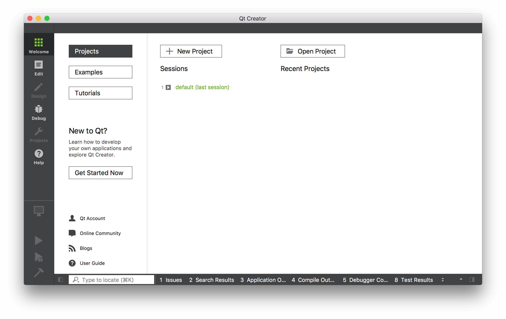 _Qt Creator 界面，左侧显示“设计”部分。_

要创建一个 `.ui` 文件，请转到 文件 -> 新建文件或项目... 在出现的窗口中，在左侧的_文件和类_下选择 _Qt_，然后在右侧选择 _Qt Designer Form_。你会注意到图标上有“ui”字样，表示你正在创建的文件类型。

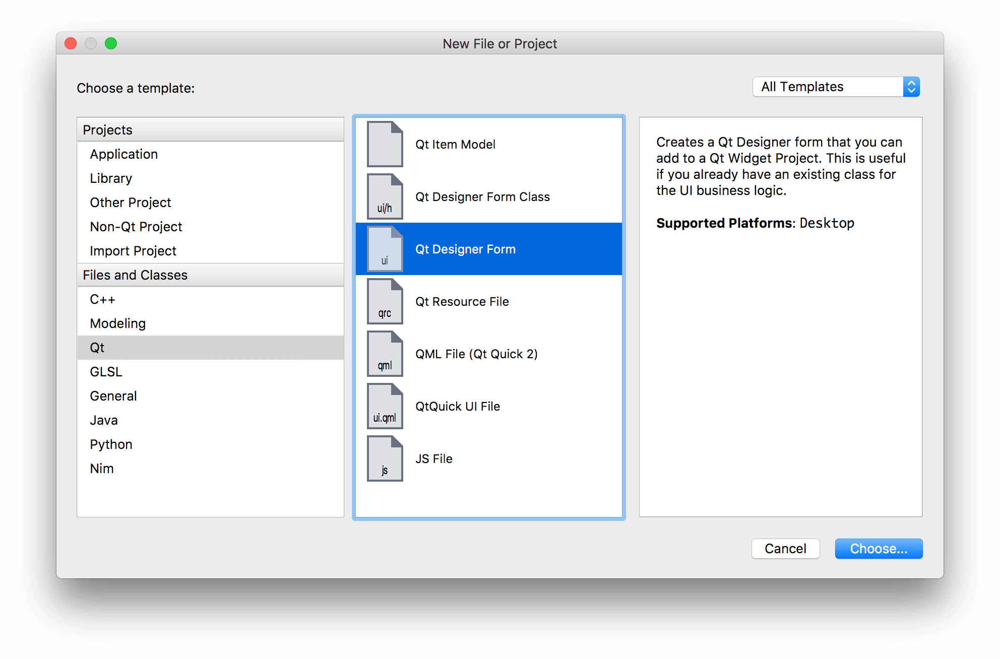 _创建一个新的 Qt .ui 文件。_

在下一步中，你将被问及要创建哪种类型的部件。如果你正在开始一个应用程序，那么_主窗口_是正确的选择。但是，你也可以为对话框、表单和自定义复合部件创建 `.ui` 文件。

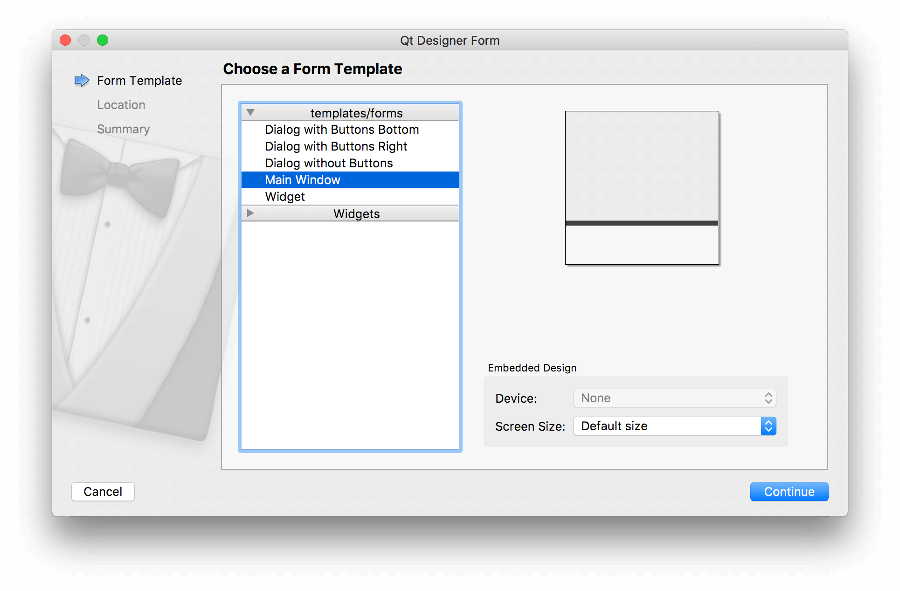 _选择要创建的部件类型，对于大多数应用程序来说，这将是主窗口。_

接下来，为你的文件选择一个文件名和保存文件夹。将你的 `.ui` 文件与你将要创建的类使用相同的名称保存，只是为了让后续的命令更简单。

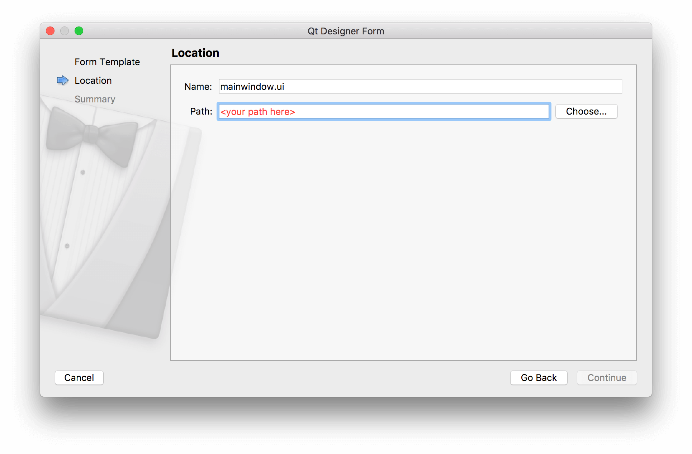 _为你的文件选择保存名称和文件夹。_

最后，如果你正在使用版本控制系统，你可以选择将文件添加到其中。可以随意跳过此步骤——它不会影响你的 UI。

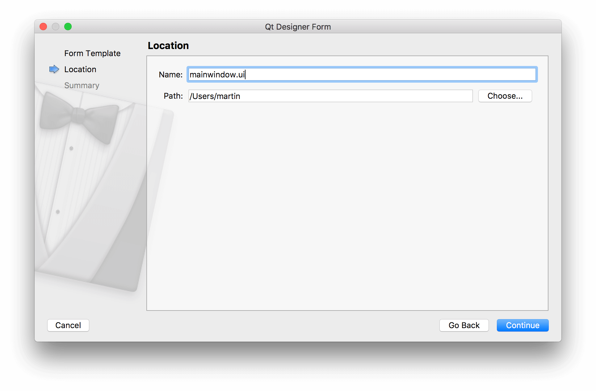 _可选择将文件添加到你的版本控制系统，例如 Git。_

布局你的主窗口
---------------------------

你将在 UI 设计器中看到你新创建的主窗口。一开始没什么可看的，只有一个代表窗口的灰色工作区，以及一个窗口菜单栏的雏形。

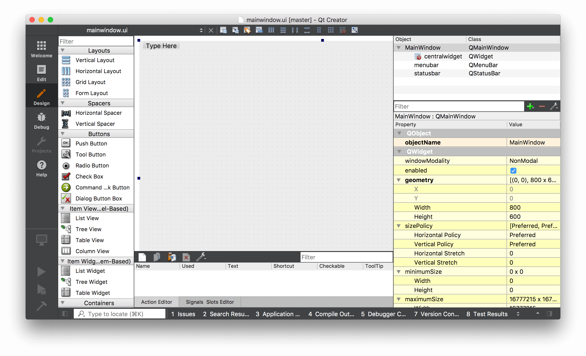 _创建的主窗口的初始视图。_

你可以通过点击窗口并拖动每个角上的蓝色手柄来调整窗口大小。

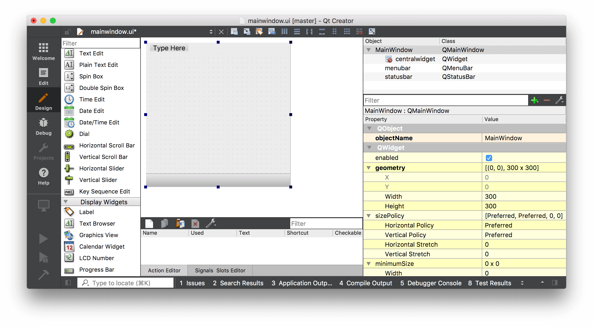 _创建的主窗口的初始视图。_

构建应用程序的第一步是向你的窗口添加一些部件。在我们的第一个应用程序中，我们学习到要为 `QMainWindow` 设置中央部件，我们需要使用 `.setCentralWidget()`。我们还看到，要使用布局添加多个部件，我们需要一个中间的 `QWidget` 来应用布局，而不是直接将布局添加到窗口中。

Qt Creator 会自动为你处理这些，尽管它并不是很明显地表现出来。

要使用布局向主窗口添加多个部件，请首先将你的部件拖到 `QMainWindow` 上。在这里，我们拖动了 3 个标签。你将它们放在哪里并不重要。

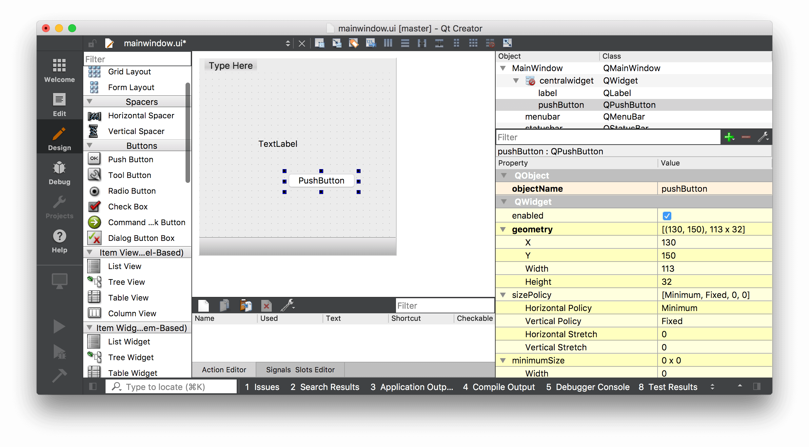 _添加了 1 个标签和 1 个按钮的主窗口。_

我们通过将 2 个部件拖到窗口上来创建了它们，使它们成为该窗口的子部件。我们现在可以应用一个布局了。

在右侧面板中找到 `QMainWindow`（它应该在最上面）。在它下面，你会看到 _centralwidget_，它代表窗口的中央部件。中央部件的图标显示了当前应用的布局。最初，它上面有一个红色的圆圈叉，表示没有激活的布局。

右键单击 `QMainWindow` 对象，然后在出现的下拉菜单中找到“布局”。

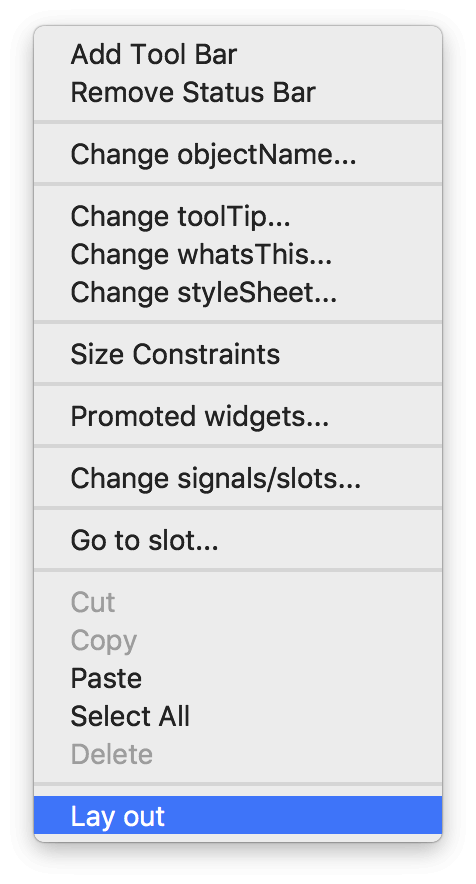 _右键单击主窗口，然后选择布局。_

《使用 PyInstaller 打包 Python GUI 应用程序的完整指南》。

#### 购买力平价

中国的开发者使用代码 DQ3JY5 购买所有书籍和课程可享受 35% 的折扣

接下来，你会看到一个可以应用于窗口的布局列表。选择_水平布局_，布局将被应用于该部件。

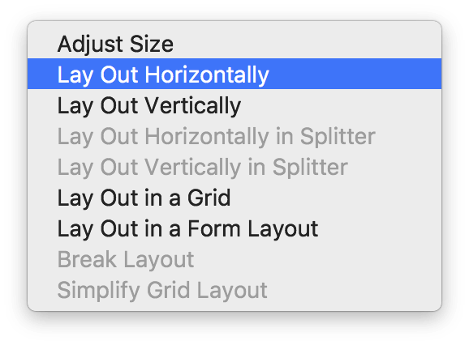 _选择要应用于主窗口的布局。_

所选的布局将应用于 `QMainWindow` 的 _centralwidget_，部件将被添加到该布局中，并根据所选的布局进行排列。请注意，在 Qt Creator 中，你实际上可以在布局中拖动和重新排序部件，或者根据需要选择不同的布局。这使得它特别适合原型设计和尝试各种东西。

 _应用于主窗口上部件的垂直布局。_

使用你生成的 .ui 文件
-----------------------------

我们创建了一个非常简单的 UI。下一步是将其导入 Python 并用它来构建一个可工作的应用程序。

首先保存你的 `.ui` 文件——默认情况下，它会保存在你创建时选择的位置，不过你也可以根据需要选择另一个位置。

`.ui` 文件是 XML 格式的。要从 Python 中使用我们的 UI，我们有两种可选的方法——

1.  使用 `.loadUI()` 方法将其加载到一个类中
2.  使用 `pyside6-uic` 工具将其转换为 Python。

这两种方法将在下面介绍。就个人而言，我更喜欢将 UI 转换为 Python 文件，以便从编程和打包的角度保持一致。

### 直接加载 .ui 文件

要在 PySide6 中加载 `.ui` 文件，我们首先创建一个 `QUiLoader` 实例，然后调用 `loader.load()` 方法来加载 UI 文件。

python

```python
import sys
from PySide6 import QtCore, QtGui, QtWidgets
from PySide6.QtUiTools import QUiLoader

loader = QUiLoader()
app = QtWidgets.QApplication(sys.argv)
window = loader.load("mainwindow.ui", None)
window.show()
app.exec()
```

`loader.load()` 方法的第二个参数是你正在创建的部件的_父部件_。

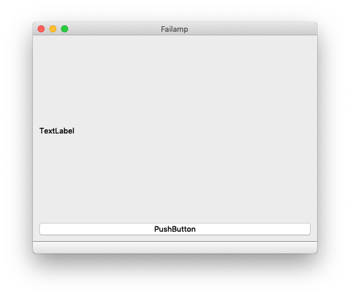 _一个在 Qt Creator 中设计的（非常）简单的 UI_

PySide6 加载器不允许你将 UI 布局应用于现有的部件。这阻止你在类的 `__init__` 块中为部件的初始化添加自定义代码。但是，你可以通过一个单独的初始化函数来解决这个问题。

python

```python
import sys
from PySide6 import QtWidgets
from PySide6.QtUiTools import QUiLoader

loader = QUiLoader()

def mainwindow_setup(w):
    w.setWindowTitle("MainWindow Title")

app = QtWidgets.QApplication(sys.argv)

window = loader.load("mainwindow.ui", None)
mainwindow_setup(window)
window.show()
app.exec()
```

你可以创建一个独立的类来处理 UI 文件的加载，创建和自定义窗口，并包含你的应用程序的任何业务逻辑。

### 将你的 .ui 文件转换为 Python

与其直接将你的 .uic 文件导入到你的应用程序中，你不如将它们转换为 Python 代码，然后像导入任何其他模块一样导入它们。要生成一个 Python 输出文件，请从命令行运行 `pyside6-uic`，传入 `.ui` 文件和输出的目标文件，并带有一个 `-o` 参数。以下命令将生成一个名为 `MainWindow.py` 的 Python 文件，其中包含我们创建的 UI。

```bash:PySide6 pyside6-uic mainwindow.ui -o MainWindow.py

python
```
你可以在编辑器中打开生成的 `MainWindow.py` 文件来看一下，但你不应该_编辑_这个文件。使用 Qt Creator 的强大之处在于能够在开发过程中编辑、调整和更新你的应用程序。对该文件所做的任何更改都将在你更新它时丢失。但是，你_可以_通过在自己的代码中导入和子类化该类来覆盖和调整你喜欢的任何内容。

导入生成的 Python 文件与导入任何其他文件一样。你可以如下导入你的类。转换工具会在 _Qt Creator_ 中定义的对象名称后面附加 `Ui_`，而这个对象就是你想要导入的。

```python
from MainWindow import Ui_MainWindow
```

要在你的应用程序中创建主窗口，像往常一样创建一个类，但要同时继承 `QMainWindow` 和你导入的 `Ui_MainWindow` 类。最后，在 `__init__` 中调用 `self.setupUi(self)` 来触发界面的设置。

python

```python
import sys
from PySide6 import QtWidgets

from MainWindow import Ui_MainWindow


class MainWindow(QtWidgets.QMainWindow, Ui_MainWindow):
    def __init__(self):
        super().__init__()
        self.setupUi(self)


app = QtWidgets.QApplication(sys.argv)

window = MainWindow()
window.show()
app.exec()
```

这会产生与之前完全相同的结果。

 _一个在 Qt Creator 中设计的（非常）简单的 UI_

就是这样。你的窗口现在已经完全设置好了。由于使用 .ui 文件抽象出了 UI 相关的代码，你可以使用相同的模式来加载你设计的任何界面。

添加应用程序逻辑
------------------------

你可以像与代码创建的部件交互一样，与通过 Qt Creator 创建的部件进行交互。为了让事情更简单，`uic` 会将所有子部件按照它们在 Qt Creator 中指定的 id 名称添加到窗口对象中。我们将在下一部分介绍如何使用这些部件。