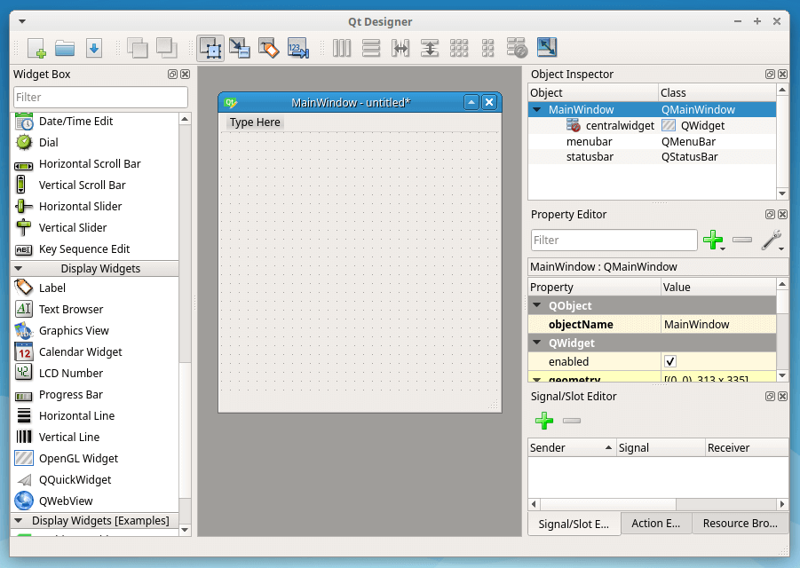
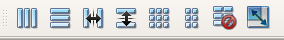
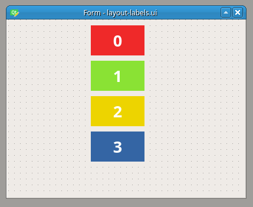

好的，这是剩余部分的中文翻译：

在布局你的 PySide6 GUI 时，将每个部件放置在窗体的正确位置可能是一项相当棘手的任务。幸运的是，Qt 提供了一套布局管理器，可以简化部件定位的过程，并允许你轻松地创建任何类型的布局。要在窗体中布局部件，你可以[在代码中创建所有内容](https://www.pythonguis.com/tutorials/pyside-layouts/)，或者你可以使用 Qt Designer 创建你的布局。在本教程中，你将学习如何使用 Qt Designer 的布局来为你的应用程序构建复杂的 GUI。

此外，我们将使用几个具有连贯布局的部件创建一个对话框示例，以巩固你的知识，并将所有内容组合成一个功能齐全的对话框，就像你在实际应用程序中创建的那样。

在 Qt Designer 中使用布局
------------------------------

[Qt Designer](https://doc.qt.io/qt-6/qtdesigner-manual.html) 是 Qt 用于设计和创建桌面应用程序图形用户界面 (GUI) 的工具。使用 Qt Designer，你可以创建窗口、对话框和窗体。它允许你通过屏幕上的窗体和基于拖放的界面来添加不同类型的部件来创建你的 GUI。

Qt Designer 的主界面如下所示 —

 _Qt Designer — 主界面_

Qt Designer 具有清晰且用户友好的界面，允许你通过将部件拖动到空窗体上来创建任何类型的 GUI。在你将所有部件放置到窗体上之后，你需要将它们放置在一个连贯的布局中。这将确保当窗体在应用程序中预览或使用时，你所有的部件都会被正确地显示和调整大小。

Qt 的布局管理器是结构化的容器，可以自动排列子部件，确保它们能很好地利用可用空间。将部件放置在布局管理器中会自动根据定义的规则对它们进行布局。Qt Designer 最有用的功能之一是能够拖放布局管理器的层次结构，以将部件排列成整洁且功能齐全的界面。

在 Qt Designer 中，你可以通过将布局应用于一组现有部件来创建布局对象。虽然将布局拖到窗体上，然后再将部件拖入布局中是*可能*的，但这可能有点麻烦。最佳实践是，首先将你需要的所有部件和间隔符拖到窗体上，然后选择相关的部件和间隔符并对它们应用布局。请按照以下步骤操作 —

1.  将部件拖放到窗体上，尽量将它们放置在它们期望的位置附近
2.  按住 `Ctrl` 键并单击它们，选择应该由给定布局管理的部件
3.  使用 Qt Designer 的工具栏、主菜单或窗体的上下文菜单应用适当的布局（水平、垂直、网格或窗体）

在你进入一个示例之前，先看看 Qt Designer 提供的与布局相关的选项 —

1.  在主工具栏上使用布局选项
2.  在主菜单上使用布局选项
3.  在窗体的上下文菜单上使用布局选项

创建布局最方便的方法是使用 Qt Designer 主工具栏的布局部分。该部分如下所示 —

 _Qt Designer — 布局工具栏_

从左到右，你会发现以下按钮 —

*   **水平布局** 将选定的部件水平排列在一起（组合键，`Ctrl+1`）。此选项使用标准的 `QHBoxLayout` 对象
*   **垂直布局** 将选定的部件垂直排列，一个在另一个下面（组合键，`Ctrl+2`）。此选项使用标准的 `QVBoxLayout` 对象
*   **在拆分器中水平布局** 使用拆分器水平排列部件（组合键，`Ctrl+3`）
*   **在拆分器中垂直布局** 使用拆分器垂直排列部件（组合键，`Ctrl+4`）
*   **在网格中布局** 将部件排列成表格状的网格（行和列）。默认情况下，每个部件占据网格的一个单元格，但你可以修改此行为，让部件跨越多个单元格（组合键，`Ctrl+5`）。此选项使用标准的 `QGridLayout` 对象
*   **在窗体布局中布局** 将选定的部件排列成两列布局。左列通常用于询问一些信息的标签，右列包括用于输入、编辑或显示该信息的部件（组合键，`Ctrl+6`）
*   **打破布局** 此键允许你打破现有的布局。一旦部件被排列在布局中，你就不能单独移动和调整它们的大小，因为它们的几何形状由布局控制。要修改单个部件，你需要打破布局，然后再重新进行（组合键 `Ctrl+0`）
*   **调整大小** 调整布局的大小以容纳所包含的部件，并确保每个部件都有足够的空间可见（组合键 `Ctrl+J`）

这些与布局相关的选项也可以通过 Qt Designer 主菜单下的 `Form` 菜单和窗体的上下文菜单获得，因此你可以选择你更喜欢的一种。

现在我们已经掌握了理论知识，我们可以将这些布局付诸实践。在接下来的几个部分中，我们将使用 Qt Designer 在我们的窗体上布局部件，并为你的桌面应用程序构建美观优雅的 GUI。但在我们开始试验 Qt 提供的不同布局管理器之前，我们首先要创建一个自定义部件来可视化布局，以便我们贯穿本教程。

如果你想跳过此步骤，可以下载下面已完成的 .ui 文件。

[layout-labels.ui](https://www.pythonguis.com/d/layout-labels.ui)

继续，启动你的 Qt Designer，然后运行以下步骤 —

1.  在 `New Form` 对话框的 `templates/forms` 选项卡中选择 `Widget`。这将创建一个新的空窗体供你操作。
2.  将你的窗体保存为 `layout-labels.ui`。
3.  在 `Widget Box` 中查找 Label 部件并将其拖到窗体上。
4.  转到 `Property Editor` 并将 `text` 属性设置为 `0`。
5.  打开 `Text Edit` 对话框并将文本颜色设置为白色。将字体大小设置为 `20` 点并对齐文本。按 `OK` 应用更改。
6.  转到 `Property Editor` 并通过选中复选框将 `autoFillBackground` 属性设置为 `True`。
7.  查找 `palette` 属性并打开 `Edit Palette` 对话框。使用 `Quick` 选项将颜色设置为红色。

如果你感到迷茫，可以看看下面的屏幕录像来实际操作这些步骤 —

在本例中，你将基于 `Widget` 模板创建一个新窗口。然后，你添加一个 Label，将其 `text` 属性设置为 `0`，并将其背景色设置为红色。

要完成此示例，请重复所有步骤以添加另外三个标签，它们的文本分别设置为 `1`、`2` 和 `3`，颜色分别设置为绿色、黄色和蓝色。你最终会得到一个如下所示的窗体：

 _Qt Designer — 带有彩色标签的窗体_

上面的截图显示了你将在接下来几个部分中使用的初始窗体。这是一个干净的窗体，上面有四个标签对象。你可以为每个标签设置一个背景色，以便在接下来的部分中更容易看到和区分它们。

### 水平布局, `QHBoxLayout`

你可以使用水平布局管理器 ([QHBoxLayout](https://doc.qt.io/qt-6/qhboxlayout.html)) 将部件排列在一行中。要在代码中创建这种布局，你需要实例化 `QHBoxLayout` 类，然后将你的部件添加到布局对象中。在 Qt Designer 中，反过来操作会更容易。

打开你的 `layout-labels.ui` 文件，首先选择你所有的标签。要做到这一点，你可以按住 `Ctrl` 键依次点击每个部件，或者你也可以在窗体内点击并用鼠标指针拖动来选择部件。

一旦你选择了部件，通过在 Qt Designer 的主工具栏中选择 `水平布局` 按钮将它们放入水平布局中。你也可以使用下面显示的上下文菜单中的 `布局->水平布局` 选项，或者你可以按 `Ctrl+1`。下面的屏幕录像将指导你完成这些步骤 —

如果布局错了，那么你可以很容易地撤销所有操作并重新开始布局。要撤销操作，你可以按 `Ctrl+z` 或使用 Qt Designer 主菜单栏中的 `编辑` 菜单。如果这不可能或不起作用，那么你可以直接使用 Qt Designer 主工具栏中的 `打破布局` 按钮来打破布局。打破布局的另一种方法是按 `Ctrl+0` 或从窗体的上下文菜单中选择 `打破布局`。

### 垂直布局, `QVBoxLayout`

你可以使用垂直布局 ([QVBoxLayout](https://doc.qt.io/qt-6/qvboxlayout.html)) 将你的部件排列成一列，一个在另一个上面。这在你创建部件组并且需要确保它们垂直对齐时非常有用。

从你原始的 `layout-labels.ui` 文件开始，第一步是选择你需要包含在垂直布局中的部件。之后，你可以点击主工具栏上的 `垂直布局` 按钮，或者你可以使用上下文菜单，或者你也可以按 `Ctrl+2`。下面的屏幕录像将指导你完成这些步骤 —

如果你仔细看屏幕录像，那么你可以看到布局对象由围绕窗体上标签的细红框表示。这个红框在预览或运行时是不可见的，它只是你在设计窗体时可以使用的指南。另外请注意，布局对象出现在对象检查器中，其属性（边距和约束）显示在属性编辑器中。

### 网格布局, `QGridLayout`

有时你需要将你的部件在同一个布局中水平和垂直地布局。为此，你可以使用网格布局管理器 ([QGridLayout](https://doc.qt.io/qt-6/qgridlayout.html))。网格布局管理器将你的部件布局在一个正方形或矩形网格中，所有部件都与它们的邻居垂直和水平对齐。这种布局可以让你在窗体上安排你的部件时拥有更多的自由度，同时保持一定程度的结构。这种排列方式可能比水平和垂直布局的嵌套排列更合适，特别是当你关心相邻行或列的对齐时。

你可以像其他布局一样，在 Qt Designer 中构建一个网格布局。第一步是选择你想用网格布局管理器布局的部件组。然后，你可以使用工具栏、上下文菜单，或者你可以按 `Ctrl+5` 来设置布局。观看下面的屏幕录像 —

在这种情况下，我们使用一个 _2 x 2_ 的网格布局来排列你窗体上的标签。请注意，要使用这种布局，你应该首先将你的部件放在窗体的行和列中，如上面的屏幕录像所示。Qt Designer 非常聪明，它会尝试让你的设计尽可能与你最初手动创建的相似。它甚至可以自动创建困难的多列排列或自动填充空单元格。

### 窗体布局, `QFormLayout`

虽然 `QGridLayout` 可用于布局带有两列输入框和标签的窗体，但 Qt 也提供了一种专门为此目的设计的布局——([QFormLayout](https://doc.qt.io/qt-6/qformlayout.html))。当你创建结构化数据输入或数据库应用程序时，这种类型的布局是理想的。左列通常会放置一些要求信息的标签。右列放置输入部件，例如行编辑 ([QLineEdit](https://doc.qt.io/qt-6/qlineedit.html))、微调框 ([QSpinBox](https://doc.qt.io/qt-6/qspinbox.html))、日期编辑 ([QDateEdit](https://doc.qt.io/qt-6/qdateedit.html))、组合框 ([QComboBox](https://doc.qt.io/qt-6/qcombobox.html)) 等。

与 QGridLayout 相比，使用此布局的优点是，当你只需要两列时，它更简单易用。下面的屏幕录像展示了它的实际操作 —

1:1 为你的 Python GUI 项目提供辅导和指导

在本例中，我们首先添加四个新标签。这些标签将包含有关你需要在第二列中输入或编辑的数据的信息。在这种情况下，第二列包含你的测试彩色标签，但通常该列将用于放置输入部件，如行编辑、微调框、组合框等。

### 分割器布局

分割器是容器对象，可将部件水平或垂直排列在两个可调整大小的面板中。使用这种布局，你可以自由调整每个面板在窗体上占用的空间量，同时保持使用的总空间不变。在 Qt 中，分割器布局由 [QSplitter](https://doc.qt.io/qt-6/qsplitter.html) 管理。

尽管分割器在技术上是一个容器部件（而不是一个布局），但 Qt Designer 将它们视为可以应用于现有部件的布局。要将一组部件放入一个分割器中，你首先像往常一样选择它们，然后通过在 Qt Designer 中使用适当的工具栏按钮、键盘快捷键或上下文菜单选项来应用分割器。看看下面的屏幕录像 —

在本例中，我们首先对你的标签应用一个水平分割器。请注意，如果你想看到分割器的实际效果，你需要启动窗体预览。你可以通过按 `Ctrl+R` 来启动窗体预览。稍后，我们对标签应用一个垂直分割器。在每种情况下，你都可以使用鼠标指针自由地调整部件的大小。

使用 Qt Designer 构建其他布局
---------------------------------------

你还可以使用 Qt Designer 的布局做更多的事情。例如，假设你需要向现有布局添加一个新部件，或者使用嵌套布局来将你的部件排列在一个复杂的 GUI 中。在接下来的几个部分中，我们将介绍如何完成其中一些任务。

### 将对象插入到现有布局中

可以通过将对象从其当前位置拖动到布局中所需的位置来将其插入到现有布局中。当一个对象被拖到布局上时，布局中会显示一个蓝色光标，以指示该对象将被放置的位置。

看看下面的屏幕录像，我们在其中将三个标签放入一个垂直布局中，然后意识到我们把蓝色标签给忘了 —

也可以在布局中移动或更改给定部件的位置。为此，只需将部件拖放到其在布局中的新位置即可。请记住跟随蓝线来正确操作。

### 嵌套布局以构建复杂的 GUI

你也可以在 Qt Designer 中将布局管理器一个嵌套在另一个里面。然后，内部布局就成为封闭布局的子布局。通过这样做，你可以迭代地创建非常复杂但结构良好的用户界面。

布局可以根据需要嵌套任意深度。例如，要创建一个在底部有一排水平按钮，在窗体上有一堆垂直对齐的其他部件的对话框，你可以为按钮使用水平布局，为其余部件使用垂直布局，然后将这些布局包装在一个垂直布局中。

回到我们的彩色标签示例，下面的屏幕录像展示了在 Qt Designer 中排列嵌套布局的过程 —

在本例中，我们首先使用水平布局将部件成对排列。然后，我们将这两个布局嵌套在第三个布局中，但这次是垂直布局。布局可以根据需要嵌套任意深度。

当你选择一个子布局时，可以通过按住 `Shift` 键并单击它来选择其父布局。这可以让你快速选择层次结构中的特定布局，否则由于每个布局管理器的边框很小，这将很难做到。

设置顶层或主布局
----------------------------------

在构建窗体时，你需要执行的最后一步是将所有布局和部件组合成一个**主布局**或**顶层布局**。这个布局位于所有其他布局和部件的层次结构的顶部。拥有一个布局至关重要，因为否则，当你调整窗口大小时，窗体上的部件不会调整大小。

要设置主布局，只需在你窗体上不包含任何部件或布局的任何地方右键单击即可。然后，你可以选择 `水平布局` 或 `垂直布局`，或者你也可以选择 `网格布局`，就像下面的屏幕录像中所示 —

在本例中，我们依次使用三种不同的布局作为我们的顶层布局。我们首先使用水平布局，然后_打破_该布局并使用垂直布局。最后我们设置一个网格布局。你为你的顶层布局选择哪个顶层布局将取决于你应用程序的具体要求。

重要的是要注意，顶层布局在对象检查器中不作为单独的对象可见。它的属性显示在主窗体的部件属性下面。另外，请注意，如果你的窗体没有布局，那么它的图标在对象检查器中会显示一个红圈。检查你是否正确设置了主布局的另一种方法是尝试调整窗体的大小，如果主布局已就位，那么你的部件应该会相应地调整大小。

当你开始构建更复杂的应用程序时，你会发现其他容器部件也需要你设置一个顶层布局，例如 [QGroupBox](https://doc.qt.io/qt-6/qgroupbox.html)、[QTabWidget](https://doc.qt.io/qt-6/qtabwidget.html)、[QToolBox](https://doc.qt.io/qt-6/qtoolbox.html) 等。要做到这一点，你可以运行你在这里看到的相同步骤，但这次你需要右键单击容器部件。

使用 Qt Designer 布局对话框
------------------------------------

作为最后一个更完整的如何使用 Qt Designer 布局的例子，我们现在要创建一个对话框来在一个数据库应用程序中输入一些信息。假设我们正在为我们的公司 Poyqote Inc. 构建一个人力资源管理软件。我们现在正在开发一个用于输入我们员工一些数据的窗体。该对话框应该为用户提供一个友好的 GUI 来输入以下数据：

*   员工姓名
*   入职日期
*   部门
*   职位
*   年薪
*   职位描述

布局这个窗体的最佳方式是什么？有很多选择，很大程度上取决于品味和实践。但在这里我们使用一个 `QFormLayout` 来将输入字段排列成两列，左边是标签，右边是输入框。创建布局的过程如下面的屏幕录像所示 —

基本对话框是使用 Qt Designer 的“底部带按钮的对话框”模板创建的。然后，我们添加一些标签和一些输入部件，包括行编辑、日期编辑、文本编辑和组合框。接下来，我们将所有这些部件放入一个窗体布局中，最后为窗体定义一个顶层或主布局。

完成的对话框 .ui 文件[可以在这里下载](https://www.pythonguis.com/documents/26/dialog-layout-example.ui)。

在 Python 中使用设计的 UI
-------------------------------

你现在可以将完成的 UI 保存到文件，然后像以前一样在 PySide 中导入并显示对话框。例如，如果你将文件保存为 `dialog.ui`，那么你可以在 Python 中像下面这样启动对话框。

python

```python
import sys
from PySide6 import QtCore, QtGui, QtWidgets
from PySide6.QtUiTools import QUiLoader

loader = QUiLoader()
app = QtWidgets.QApplication(sys.argv)
dialog = loader.load("dialog.ui", None)
dialog.show()
app.exec()
```

然而，对话框通常是从另一个窗口启动的——并且应该阻塞它等待响应。要将 UI 作为对话框启动，我们改为在其上调用 `.exec()`。由于该对话框是使用 `QDialog` 定义的，因此它继承了通常的 Qt 对话框行为，阻塞主窗口并返回按下按钮的值。

python

```python
import sys
from PySide6.QtWidgets import QApplication, QMainWindow, QPushButton
from PySide6.QtUiTools import QUiLoader

loader = QUiLoader()

class MainWindow(QMainWindow):

    def __init__(self):
        super().__init__()

        btn = QPushButton("Launch dialog")
        btn.pressed.connect(self.launch_dialog)

        self.setCentralWidget(btn)

    def launch_dialog(self):
        dialog = loader.load("dialog.ui", None)
        result = dialog.exec()
        if result:
            print("Success!")
        else:
            print("Cancelled.")

app = QApplication(sys.argv)
w = MainWindow()
w.show()
app.exec()
```

结论
----------

在创建使用 Qt 的 GUI 时，Qt Designer 是一个强大的工具。它最直接和最有用的功能之一是能够将你的部件排列在不同类型的布局中。学习如何有效地使用 Qt Designer 创建布局可以极大地提高你的生产力，尤其是在创建复杂的 GUI 时。