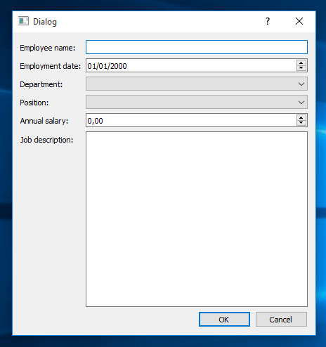
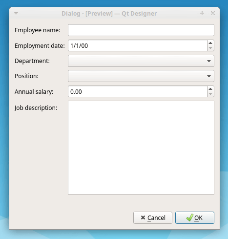

大多数 PySide GUI 应用程序都包含一个主窗口和若干个对话框。[对话框](https://www.pythonguis.com/tutorials/pyside-dialogs/)是一种小尺寸的窗口，它允许您与用户进行交互，可以通过在屏幕上显示消息，也可以用来获取用户的输入。您可以利用 [Qt Designer](https://www.pythonguis.com/tutorials/pyside-first-steps-qt-designer/) 这款工具提供的丰富选项来创建对话框。

在本教程中，我们将学习如何使用 Qt Designer 创建和自定义对话框。我们还将学习在我们的 GUI 应用程序中使用和启动对话框的两种不同方法。掌握这些知识后，我们就能够快速、轻松地为我们的应用程序添加对话框。

为了更好地理解本教程将要涵盖的主题，预先了解一些关于 [PySide 应用程序](https://www.pythonguis.com/courses/pyside-getting-started/)、[控件 (widgets)](https://www.pythonguis.com/tutorials/pyside-widgets/)、[布局 (layouts)](https://www.pythonguis.com/tutorials/pyside-layouts/) 以及[信号和槽 (signals and slots)](https://www.pythonguis.com/tutorials/pyside-signals-slots-events/) 的知识会很有帮助。

### PySide 对话框入门

在 GUI 编程中，[对话框](https://www.pythonguis.com/tutorials/pyqt-dialogs/)是提供辅助功能并允许您与用户进行通信的小尺寸窗口。一些常见的对话框示例包括：文字处理器或文本编辑器中的*打开文档*对话框，大多数 GUI 应用程序中的*设置*或*首选项*对话框，文件管理器或文本编辑器中的*搜索*对话框等等。

对话框也经常用于显示关于某个操作的错误信息或一般信息。它们还可以用来请求用户确认是否继续某个操作，或者从用户那里获取输入以用于数据库。

PySide 提供了丰富的内置对话框类集合，您可以直接在您的应用程序中使用。其中包括：

*   [QFontDialog](https://doc.qt.io/qt-6/qfontdialog.html) 用于选择字体
*   [QPrintDialog](https://doc.qt.io/qt-6/qprintdialog.html) 用于指定打印机配置
*   [QProgressDialog](https://doc.qt.io/qt-6/qprogressdialog.html) 用于为一个耗时操作的进度提供反馈
*   [QColorDialog](https://doc.qt.io/qt-6/qcolordialog.html) 用于指定颜色
*   [QInputDialog](https://doc.qt.io/qt-6/qinputdialog.html) 用于从用户处获取单个值
*   [QFileDialog](https://doc.qt.io/qt-6/qfiledialog.html) 用于选择文件或目录

此外，当没有内置对话框能够满足您需要执行的操作时，PySide 提供了 [QDialog](https://doc.qt.io/qt-6/qdialog.html) 类来创建完全自定义的对话框。

虽然我们可以使用 `QDialog` 类在 Python 代码中构建对话框，但我们也可以使用 [Qt Designer](https://www.pythonguis.com/tutorials/pyside-first-steps-qt-designer/) 在其拖放编辑器中创建自定义对话框。Qt Designer 是 [Qt](https://www.qt.io/) 的一款工具，它提供了一个用户友好的图形界面，使我们能够快速创建和设置我们的对话框和窗口。

### 使用 Qt Designer 创建对话框

您可以使用 Qt Designer 来创建和自定义您的对话框用户界面。通过 Qt Designer，您既可以使用内置模板创建对话框的 GUI，也可以完全从头开始创建一个对话框。您可以向对话框中添加控件，[在布局中排列控件](https://www.pythonguis.com/tutorials/pyside-qt-designer-gui-layout/)，设置它们的外观，为其属性提供初始值，设置它们的 Tab 键顺序，创建伙伴（buddies）以提供键盘快捷方式，以及将控件的内置信号连接到槽。

当我们使用 Qt Designer 创建对话框时，对话框的 GUI 会被存储在一个 `.ui` 文件中，这是一个 `XML` 文件，它提供了我们稍后在应用程序中构建对话框 GUI 所需的所有信息。

在接下来的几个部分中，我们将探讨如何使用 Qt Designer 创建和自定义对话框的 GUI。

#### 使用 Qt Designer 的对话框模板

当我们启动 Qt Designer 时，我们会看到应用程序的主窗口和一个名为 **New Form** 的对话框。这个对话框允许我们为想要创建的 GUI 选择一个模板。这些模板包括创建对话框、主窗口和自定义控件的选项。

在本教程中，我们只关注如何使用 Qt Designer 创建对话框。因此，我们将只介绍 Qt Designer 提供的 3 种用于创建对话框的模板：

1.  **Dialog with Buttons Bottom**：创建一个窗体（或对话框），其右下角水平排列着 `OK` 和 `Cancel` 按钮。
2.  **Dialog with Buttons Right**：创建一个窗体，其右上角垂直排列着 `OK` 和 `Cancel` 按钮。
3.  **Dialog without Buttons**：创建一个不带任何按钮的空窗体。

下面的屏幕录像展示了我们如何使用 Qt Designer 通过不同的（默认）对话框模板来创建自定义对话框：

要使用 Qt Designer 的模板创建一个对话框，我们只需从 **New Form** 对话框中选择所需的模板，然后点击 `Create` 按钮或按键盘上的 `Alt+R`。

如果您在启动 Qt Designer 时 **New Form** 对话框没有出现，那么您可以点击 Qt Designer 工具栏上的 **New** 按钮。您也可以点击主菜单选项 **File > New...** 或按键盘上的 `Ctrl+N` 组合键。

#### 添加控件和布局

控件是任何 PySide GUI 应用程序的构建基石。您可以使用控件来显示信息、获取用户输入，并为其他应被分组的控件提供容器。通过 Qt Designer，您可以将控件从 Qt Designer 的 **Widget Box** 面板拖放到您的窗体上，从而将它们添加到您的对话框和窗口中。一旦将所有必需的控件放置好，您就可以[使用 Qt 的布局来排列它们](https://www.pythonguis.com/tutorials/qt-designer-gui-layout/)。

假设您的公司正在创建一个数据库应用程序来管理员工的相关信息。您被要求添加一个新的 PySide 对话框，用于输入或更新员工的常规信息。该对话框必须包含输入以下信息的选项：*员工姓名*、*入职日期*、*部门*、*职位*、*年薪*和*职位描述*。

下面的屏幕录像展示了我们如何使用 Qt Designer 快速创建这个对话框的 GUI：

在这里，我们首先使用 **Dialog with Buttons Bottom** 模板创建一个对话框。然后，我们添加 `QLabel` 对象来提示需要输入的信息。每个字段都需要一个特定的输入控件。例如，我们为员工姓名添加一个 `QLineEdit` 对象，为入职日期添加一个 `QDateEdit` 对象，为部门和职位添加两个 `QComboBox` 对象，为年薪添加一个 `QDoubleSpinBox` 对象，以及为职位描述字段添加一个 `QTextEdit` 对象。

一旦我们将所有控件放置好，我们选中所有控件并使用一个 `QFormLayout` 对象来排列它们。最后一步是为对话框添加一个主布局。为此，我们使用一个 `QVBoxLayout` 对象，它允许我们将控件和对话框的按钮排列在一个垂直列中。就这样，我们使用 Qt Designer 创建了我们的第一个对话框。让我们将对话框的 GUI 文件保存为 `employee.ui` 以备后用。

如果您想预览您的对话框在实际运行时会是什么样子，那么您可以按 `Ctrl+R` 组合键或点击 Qt Designer 主菜单上的 **Form > Preview...** 选项。

在本节中，我们在 **Edit Widgets**（编辑控件）模式下使用 Qt Designer，这是默认模式。在此模式下，我们可以向对话框中添加控件、编辑控件属性、在对话框 GUI 上布置控件等等。要激活编辑控件模式，我们可以选择以下三个选项中的任意一个：

1.  按 `F3` 键
2.  从主菜单选择 **Edit > Edit Widgets** 选项
3.  点击 Qt Designer 工具栏上的 **Edit Widgets** 按钮

#### 设置输入控件的 Tab 键顺序

一个能够提升对话框可用性的元素是输入控件的 **Tab 键顺序**。Tab 键顺序是指当您按下 `Tab` 或 `Shift+Tab` 键时，输入控件获得焦点的顺序。默认的 Tab 键顺序是基于您将控件放置在窗体上的顺序。

例如，在我们的员工对话框中，我们将用于*年薪*的 `QDoubleSpinBox` 对象放在了用于*职位描述*的 `QTextEdit` 对象之后。如果用户按 `Tab` 键在对话框中移动，他们会注意到，当他们按 `Tab` 键想从*职位* `QComboBox` 移动到*年薪* `QDoubleSpinBox` 时，焦点却跳到了*职位描述*的 `QTextEdit` 上。这是一种令人烦恼的行为。下面的屏幕录像展示了这个问题：

请注意，当焦点在*职位* `QComboBox` 上并且用户按下 `Tab` 键时，焦点直接跳转到了*职位描述*的 `QTextEdit`，而不是像我们预期的那样跳转到*年薪*的 `QDoubleSpinBox`。

要解决这个问题，我们需要更改对话框中输入控件的 Tab 键顺序。首先，我们需要在 Qt Designer 中切换到 **Edit Tab Order**（编辑 Tab 键顺序）模式。为此，我们可以选择主菜单上的 **Edit > Edit Tab Order** 选项，或者点击工具栏上的 **Edit Tab Order** 按钮。

在编辑 Tab 键顺序模式下，窗体中的每个输入控件都会显示一个数字，该数字表示其在 Tab 键顺序链中的位置。我们可以通过按正确的顺序点击每个控件的数字来更改 Tab 键顺序。您可以在下面的屏幕录像中看到如何操作：

在这个例子中，我们通过按正确的顺序点击每个数字来更改输入控件的 Tab 键顺序。当我们选择一个数字时，它会变为红色，表示这是当前正在编辑的 Tab 键顺序位置。当我们点击另一个数字时，该数字将成为 Tab 键顺序中的第二个，依此类推。

如果出现错误，我们可以通过从窗体的上下文菜单中选择 **Restart** 来重新开始编号。要部分编辑 Tab 键顺序，我们可以在按住 `Ctrl` 键的同时选择一个数字。Tab 键顺序将从该控件开始更改。我们也可以右键单击某个数字，然后从上下文菜单中选择 **Start from Here**。

#### 定义伙伴关系 (Buddies)

在 Qt 中，“伙伴”（buddies）是相关控件之间的连接。通常是在一个 `QLabel` 控件和一个像 `QLineEdit` 或 `QComboBox` 这样的输入控件之间。这些连接允许您提供一个快捷的键盘方式，将焦点移动到指定的输入控件。通过设置伙伴关系，您将为用户提供一种在对话框和窗口中快速移动的方式，从而提高对话框的可用性。

在我们的员工对话框中，要将焦点移动到*年薪*的 `QDoubleSpinBox`，我们可以将它与*年薪*的 `QLabel` 控件设置伙伴关系。这个伙伴关系将自动提供一个形式为 `Alt+字母` 的组合键，其中 `字母` 代表标签文本中的单个字母。

在我们的*年薪* `QLabel` 中，这个字母可以是 `A` 或 `s` 或标签文本中的任何其他字母。唯一的限制是，所选字母不能与当前对话框或窗口中任何其他伙伴关系的字母冲突。

要选择一个用于伙伴关系的字母，我们需要在标签文本的该字母前放置一个和号（`&`）。通过这种方式，我们提供了用于键盘快捷方式的字母。例如，如果我们在*年薪* `QLabel` 的字母 `s` 前放置和号，那么我们将能够通过按键盘上的 `Alt+S` 快捷键来访问*年薪*的 `QDoubleSpinBox`。

一旦我们选择了要使用的字母并放置了相应的和号，我们就需要设置伙伴关系。为此，我们将激活 Qt Designer 中的 **Edit Buddies**（编辑伙伴关系）模式，可以通过从主菜单选择 **Edit > Edit Buddies** 选项或点击工具栏上的 **Edit Buddies** 按钮来实现。

要定义伙伴关系，我们将点击一个标签并将其拖动到相应的输入控件上。整个过程如下面的屏幕录像所示：

要在标签和输入控件之间创建伙伴关系，我们可以用鼠标选择一个标签并将其拖动到我们想设置为其伙伴的输入控件上。标签和输入控件将成为伙伴。从这时起，我们的用户将能够通过按 `Alt+字母` 快速将焦点移动到特定的输入控件，其中 `字母` 将是我们用来定义伙伴关系的字母。请注意，伙伴字母将带有下划线，以指示要使用的正确组合键。

#### 使用按钮框 (Button Boxes) 来布局对话框的按钮

在创建对话框时，有一套标准的按钮可供使用。尽管 Qt Designer 的模板提供了一个 `OK` 按钮和一个 `Cancel` 按钮，但在实践中，您会看到使用不同按钮的对话框，如 `Apply`、`Close`、`Yes`、`No` 等等。

在我们的员工示例中，我们使用了一个 `Cancel` 和一个 `OK` 按钮，它们从左到右按此顺序放置。这是 Linux 或 macOS 上按钮的通常顺序，但在 Windows 上则不是，其顺序应该颠倒。

如果我们希望我们的 GUI 应用程序在不同平台上看起来尽可能原生，那么我们将需要为不同的平台部署不同的对话框，仅仅是为了以该平台正确的顺序显示按钮。

幸运的是，PySide 为这个特定问题提供了一个有效的解决方案。我们可以使用 [`QDialogButtonBox`](https://doc.qt.io/qt-5/qdialogbuttonbox.html) 类，而不是直接添加 `Cancel` 和 `OK` 按钮，并根据我们的需要选择按钮。这个 PySide 类将根据底层平台的标准实践自动为我们处理按钮的顺序。

以下是我们的员工对话框在 Windows 10、Linux 和 macOS 上的外观：

 _Windows 上的按钮框_

 _Linux 上的按钮框_

 _macOS 上的按钮框_

在 Windows 上，如果您与在 Linux 或 macOS 上运行的相同对话框进行比较，会发现对话框右下角的按钮顺序是颠倒的。这是因为 Qt Designer 的对话框模板默认使用一个 `QDialogButtonBox` 对象来布局对话框上的按钮。如果您正在使用 PySide 创建跨平台的 GUI 应用程序，这是非常方便的。

我们可以通过在 Qt Designer 的 **Property Editor**（属性编辑器）中更改 `QDialogButtonBox` 对象的 `.standardButtons` 属性来选择我们想在对话框上显示的按钮。请看下面的屏幕录像：

属性编辑器允许我们设置 `QDialogButtonBox` 对象的 `.standardButtons` 属性，并选择不同的标准按钮集。请注意，当我们在 `QDialogButtonBox` 中更改按钮时，它们会根据当前平台的标准实践进行放置。

#### 连接内置的信号和槽

在 PySide 中，用户对 GUI 应用程序控件的操作被称为**事件**。当一个事件发生时，相应的控件会发出一个**信号**，让您知道事件已经发生。为了让您的应用程序具有交互性，您需要将这些信号连接到特定的**槽**。槽是作为事件响应而执行的方法。

大多数控件都实现了内置信号，当某个事件（如鼠标点击）在控件上发生时，这些信号会被发出。控件也提供了内置的槽，允许您对控件执行某些操作。例如，一个 `QTextEdit` 对象提供了一个 `.clear()` 槽，您可以将其连接到一个按钮或菜单选项，以清除该控件的内容。

您可以使用 Qt Designer 来连接这些内置的信号和槽。要在对话框中的两个控件之间建立信号和槽的连接，您首先需要切换到 Qt Designer 的 **Edit Signals/Slots**（编辑信号/槽）模式。为此，您可以按 `F4` 键，在主菜单中选择 **Edit > Edit Signals/Slots** 选项，或点击工具栏上的 **Edit Signals/Slots** 按钮。

进入编辑信号/槽模式后，用鼠标选择提供信号的控件，然后将该控件拖放到提供槽的控件上。这将启动 Qt Designer 的 **Configure Connection**（配置连接）对话框。

配置连接对话框有两个面板。在左侧面板中，您可以选择一个信号，在右侧面板中，您可以选择一个槽。然后，您需要按下 `OK` 按钮来创建连接。这将在提供信号的控件和提供槽的控件之间绘制一个箭头，表示连接已建立。此外，您将看到您刚刚连接的信号和槽的名称。

例如，假设我们有一个带有 `QTextEdit` 和 `QPushButton` 的对话框。我们需要将按钮的 `.clicked()` 信号与文本编辑器的 `.clear()` 槽连接起来，这样我们就可以通过点击按钮来清除文本编辑器的内容。请看下面的例子：

在这个例子中，我们首先切换到编辑信号/槽模式。然后，我们选择 `Clear` 按钮，将其拖放到 `QTextEdit` 对象上。这会向我们展示配置连接对话框。在这个对话框中，我们在左侧面板选择 `.clicked()` 信号，在右侧面板选择 `.clear()` 槽。当我们按下 `OK` 时，连接就建立好了。我们也可以点击 `Cancel` 按钮来取消连接操作。

连接以一个箭头显示，连接着两个控件，并带有两个标签，分别指示每个控件提供的信号和槽的名称。

要修改一个连接，您可以双击箭头或其中一个标签。这将显示配置连接对话框，您可以在其中更改连接中涉及的信号或槽。

要删除一个连接，您可以选择代表连接的箭头或标识信号和槽的标签之一，然后按 `Del` 键。

由于对话框也是控件，您可以将一个控件（比如一个按钮）的信号与对话框或窗体的槽连接起来。过程是相同的，您只需将控件拖放到窗体上，然后从配置连接对话框中配置所需的信号和槽。

最后，如果您使用 Qt Designer 的模板创建一个带有按钮框的对话框，您会注意到 `QDialogButtonBox` 对象的 `.accepted()` 信号默认连接到窗体的 `.accept()` 槽。同样，`.rejected()` 信号连接到 `reject()` 槽。因此，您的对话框从一开始就是功能齐全的。

### 在 GUI 应用程序中使用对话框

到目前为止，您已经学会了如何用 Qt Designer 创建自定义对话框，但是您如何在您的 GUI 应用程序中使用这些对话框呢？PySide 至少提供了两种方法来实现这一点。我们可以：

1.  使用名为 `pyside6-uic` 的命令行工具，根据 `.ui` 文件生成对话框 GUI 的 Python 代码。
2.  使用 `QtUiTools.QUiLoader` 类动态加载对话框 GUI 的代码。

第一种选项是最常见和广泛使用的方法，因为它在处理复杂对话框时效率更高。然而，它的缺点是每次您用 Qt Designer 修改对话框后，都必须重新生成代码。

第二种选项可能适用于您正在处理的非常小且简单的对话框，这些对话框不涉及大量的加载时间。

#### 使用 `pyside6-uic` 生成对话框的 GUI

您可以使用命令行工具 `pyside6-uic` 将您的 `.ui` 文件转换为包含构建对话框 GUI 的 Python 代码的 `.py` 文件。为此，您需要打开一个命令行或终端，并运行如下命令：

```sh:PySide6
$ pyside6-uic -o dialog.py dialog.ui
```

此命令将根据我们刚刚使用 Qt Designer 创建的 `dialog.ui` 文件生成一个名为 `dialog.py` 的 Python 模块。

让我们针对我们的员工对话框运行该命令：

```sh:PySide6
$ pyside6-uic -o employee_dlg.py employee.ui
```

此命令生成一个名为 `employee_dlg.py` 的 Python 模块。该模块包含对话框 GUI 的 Python 代码。以下是代码的一小部分：

```python
# -*- coding: utf-8 -*-

################################################################################
## Form generated from reading UI file 'dialog.ui'
##
## Created by: Qt User Interface Compiler
##
## WARNING! All changes made in this file will be lost when recompiling UI file!
################################################################################

from PySide6.QtCore import *
from PySide6.QtGui import *
from PySide6.QtWidgets import *


class Ui_Dialog(object):
    def setupUi(self, Dialog):
        if not Dialog.objectName():
            Dialog.setObjectName(u"Dialog")
        Dialog.resize(431, 431)
        self.verticalLayout = QVBoxLayout(Dialog)
        ...
```

`Ui_Dialog` 类包含了我们生成对话框 GUI 所需的所有代码。`.setupUi()` 方法包含了添加控件并将它们布局在对话框 GUI 上的代码。`retranslateUi()` 方法包含用于国际化和本地化的代码，但这个主题超出了本教程的范围。因此，我们在这里只考虑 `.setupUi()`。

让我们创建一个 [PySide 主窗口风格的应用程序](https://www.pythonguis.com/tutorials/pyside-creating-your-first-window/)，它允许我们使用这个 Python 模块来启动我们的员工对话框。代码如下：

```python
import sys
from PySide6.QtWidgets import QApplication, QDialog, QMainWindow, QPushButton
from employee_dlg import Ui_Dialog

class Window(QMainWindow):
    """主窗口。"""
    def __init__(self, parent=None):
        """初始化器。"""
        super().__init__(parent)
        # 使用一个 QPushButton 作为中心控件
        self.centralWidget = QPushButton("Employee...")
        # 将 .clicked() 信号与 .onEmployeeBtnClicked() 槽连接
        self.centralWidget.clicked.connect(self.onEmployeeBtnClicked)
        self.setCentralWidget(self.centralWidget)

    # 创建一个用于启动员工对话框的槽
    def onEmployeeBtnClicked(self):
        """启动员工对话框。"""
        dlg = EmployeeDlg(self)
        dlg.exec()


class EmployeeDlg(QDialog, Ui_Dialog):
    """员工对话框。"""
    def __init__(self, parent=None):
        super().__init__(parent)
        # 运行 .setupUi() 方法来显示 GUI
        self.setupUi(self)


# 创建应用程序
app = QApplication(sys.argv)
# 创建并显示应用程序的主窗口
w = Window()
w.show()
# 运行应用程序的主循环
app.exec()
```

我们首先从 PySide 包中导入所需的类。然后，我们从我们的 `employee_dlg` 模块中导入 `Ui_Dialog` 类。

`Window` 类将是我们应用程序的主窗口。在这种情况下，我们使用一个 `QPushButton` 作为中心控件。这意味着我们的应用程序将显示一个带有一个按钮的窗口。然后，我们将按钮的 `.clicked()` 信号与 `onEmployeeBtnClicked()` 槽连接起来。

在 `onEmployeeBtnClicked()` 内部，我们创建了一个 `EmployeeDlg` 的实例，使用我们的主窗口（`self`）作为其 `parent`，然后使用其 `.exec()` 方法启动它。

在 `EmployeeDlg` 类中，我们通过继承 `QDialog` 和 `Ui_Dialog` 类来实现我们的对话框。在 `__init__()` 方法内部，我们调用 `.setupUi()` 方法将设计的 UI 应用到我们的类中。

最后，我们通过执行以下步骤来完成应用程序：

1.  创建一个 `QApplication` 类的实例
2.  创建一个我们的 `Window` 类的实例
3.  在我们的 `Window` 对象上调用 `.show()` 方法
4.  通过调用 `app.exec()` 运行应用程序的主循环

让我们运行应用程序并点击 `Employee...` 按钮。下面是它的工作方式：

应用程序的主窗口只有一个控件，即 `Employee...` 按钮。当我们点击这个按钮时，我们的员工对话框就会出现在屏幕上。

`Employee...` 按钮文本中最后的省略号是一个常见的约定，您可以用它来指出这个按钮（或菜单选项）不会执行立即的操作，而是会启动一个对话框进行进一步处理。

尽管我们使用了一个 `QPushButton` 来启动我们的对话框，但在实际应用程序中，我们通常会将像 `onEmployeeBtnClicked()` 这样的槽连接到一个工具栏按钮、一个主菜单选项或一个上下文菜单选项。

#### 使用 `QUiLoader` 加载对话框的 GUI

您也可以选择使用 `QUiLoader` 类直接从您的 `.ui` 文件动态加载对话框的 GUI。`QUiLoader` 的 `load` 方法接收一个 `.ui` 文件作为参数，并返回一个实现了该 GUI 的 `QWidget` 子类。

例如，要动态加载我们的员工对话框，我们需要对我们的应用程序文件做一些更改。

```python
import sys
from PySide6.QtWidgets import QApplication, QMainWindow, QPushButton
from PySide6.QtUiTools import QUiLoader

loader = QUiLoader()

class Window(QMainWindow):
    """主窗口。"""
    def __init__(self, parent=None):
        """初始化器。"""
        super().__init__(parent)
        # 使用一个 QPushButton 作为中心控件
        self.centralWidget = QPushButton("Employee...")
        # 将 .clicked() 信号与 .onEmployeeBtnClicked() 槽连接
        self.centralWidget.clicked.connect(self.onEmployeeBtnClicked)
        self.setCentralWidget(self.centralWidget)

    # 创建一个用于启动员工对话框的槽
    def onEmployeeBtnClicked(self):
        """启动员工对话框。"""
        dlg = loader.load("employee.ui", self)
        dlg.exec()


# 创建应用程序
app = QApplication(sys.argv)
# 创建并显示应用程序的主窗口
w = Window()
w.show()
# 运行应用程序的主循环
app.exec()
```

现在我们不再需要通过子类化来使用对话框，而是可以直接加载 UI 对象并对其调用 `exec()`。做了这最后一次更改后，我们就完成了。我们的应用程序将按预期工作。其余代码保持不变。您现在可以自己运行该应用程序并查看结果。

这种加载对话框的方式在实践中很少使用，尽管在处理简单和小型的对话框时可能很有用。它的优点是，每次您使用 Qt Designer 修改 `.ui` 文件时，您都不需要重新生成对话框 GUI 的 Python 代码，这在某些情况下可以提高生产力和可维护性。

### 结论

在创建 PySide6 GUI 应用程序时，您通常会使用一个主窗口和若干个对话框。[对话框](https://www.pythonguis.com/tutorials/pyside-dialogs/)允许您与用户进行交流（因此得名对话框）。您可以使用对话框在屏幕上显示消息或获取用户的输入。[Qt](https://www.qt.io/) 提供了 [Qt Designer](https://www.pythonguis.com/tutorials/pyside-first-steps-qt-designer/)，用于以一种快速且高效的方式创建对话框。

在本教程中，我们介绍了如何使用 Qt Designer 创建和自定义对话框。我们还学习了在我们的 GUI 应用程序中使用和启动对话框的两种不同方法，即生成对话框的 GUI 代码或动态加载它。

有了这些知识，您将能够使用 Qt Designer 以一种快速且高效的方式为您的 GUI 应用程序创建功能齐全的对话框。