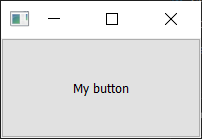
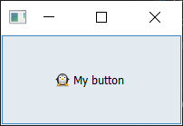
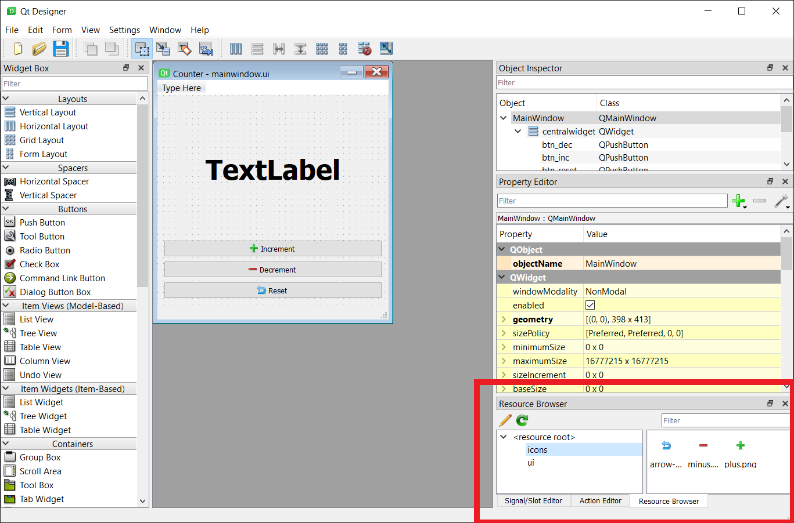
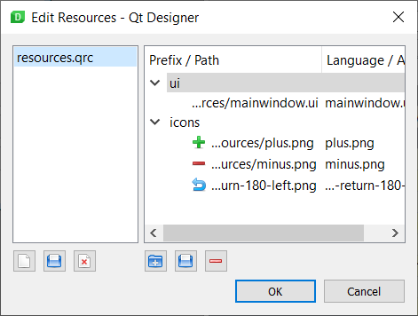
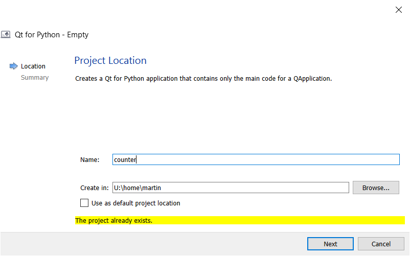
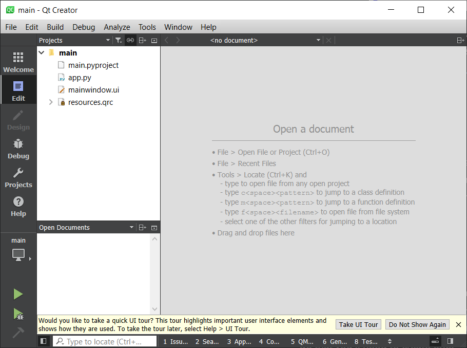
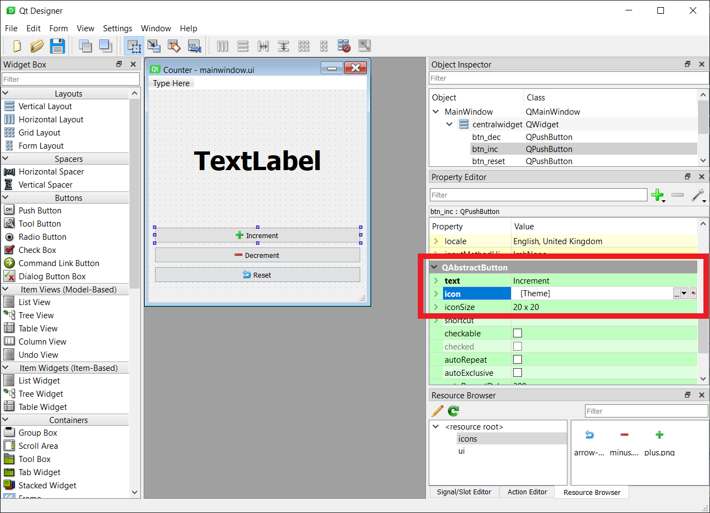
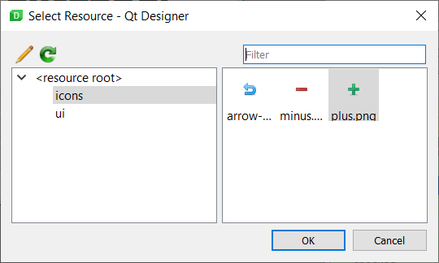

构建应用程序不仅仅是编写代码。通常，您的界面需要用于各种操作的图标，您可能希望添加插图或品牌标识，或者您的应用程序可能需要加载数据文件来预填充控件。这些*数据文件*与您应用程序的源代码是分开的，但最终需要与它一起打包和分发，才能使应用程序正常工作。

将数据文件与应用程序一起分发是问题的常见原因。如果您使用路径引用数据文件，那么除非目标计算机上存在完全相同的路径，否则您的应用程序将无法正常工作。当为跨平台（Windows、macOS 和 Linux）使用而打包应用程序时，这会变得更加棘手。幸运的是，Qt 用其*资源系统*解决了这个问题。资源被*捆绑*到 Python 文件中，这些文件可以与您的源代码一起分发，从而保证它们在其他平台上也能继续工作。您可以通过 Qt Designer 管理资源，并使用资源库在您的应用程序中加载图标（和其他数据）。

### 示例应用程序

为了演示如何使用资源系统，我们将创建一个使用两个数据文件的简单应用程序——在本例中是两个图标图像文件。但是，请记住，您可以将任何类型的数据打包为资源，包括您的应用程序所依赖的数据文件。

下面的示例显示了一个单独的按钮，按下该按钮时会更改其图标。

```python
import sys

from PySide6 import QtGui, QtWidgets

class MainWindow(QtWidgets.QMainWindow):
    def __init__(self):
        super().__init__()

        self.setWindowTitle("Hello World")
        self.button = QtWidgets.QPushButton("My button")

        icon = QtGui.QIcon("animal-penguin.png")
        self.button.setIcon(icon)
        self.button.clicked.connect(self.change_icon)

        self.setCentralWidget(self.button)

        self.show()

    def change_icon(self):
        icon = QtGui.QIcon("animal-monkey.png")
        self.button.setIcon(icon)

app = QtWidgets.QApplication(sys.argv)
w = MainWindow()
app.exec()
```

将此文件在您的计算机上保存为 `app.py`。运行它，您会看到窗口出现并带有一个按钮，但看不到任何图标。当您使用找不到的文件创建 `QIcon()` 对象时，就会发生这种情况——它们被简单地忽略了。*如果您在打包应用程序时遇到过问题，对此您会很熟悉。*


*在没有可用图标的情况下，什么也不会显示。*

下载 [animal-penguin.png](assets/)。* 再次运行该应用程序，您将看到预期的图标。


*将图标放在与脚本相同的文件夹中后，它们现在可见了。*

现在应用程序已按预期工作，我们将切换到使用 `QResource` 系统来加载这两个文件。首先，我们需要定义我们的 QRC 文件并将我们的资源添加到其中。

对于 2 个文件来说，这似乎有些小题大做，但随着您的项目越来越大，其优势会变得更加明显！

### QRC 文件

Qt 资源系统的核心是*资源文件*或 QRC。`.qrc` 文件是一个简单的 XML 文件，可以在任何文本编辑器中打开。

您也可以使用 Qt Designer 创建 QRC 文件以及添加和删除资源，我们稍后将介绍这一点。

#### 简单的 QRC 示例

下面显示了一个非常简单的资源文件，其中包含一个资源（我们可能会添加到一个按钮上的单个图标 `animal-penguin.png`）。

```xml
<!DOCTYPE RCC>
<RCC version="1.0">
    <qresource prefix="icons">
        <file alias="animal-penguin.png">animal-penguin.png</file>
        <file alias="animal-monkey.png">animal-monkey.png</file>
    </qresource>
</RCC>
```

`<file>` `</file>` 标签之间的名称是文件的路径，相对于资源文件。`alias` 是此资源在您的应用程序内部被引用的名称。您可以使用它来将图标*重命名*为在您的应用中更合乎逻辑或更简单的名称，同时保持外部原始名称不变。

例如，如果我们想在内部使用名称 `penguin.png`，我们可以将这些行更改为：

```xml
<file alias="penguin.png">animal-penguin.png</file>
<file alias="monkey.png">animal-monkey.png</file>```

这仅更改了您应用程序*内部*使用的名称，文件名保持不变。

在此标签之外是 `qresource` 标签，它指定了一个 `prefix`。这是一个*命名空间*，可用于将资源分组在一起。这实际上是一个虚拟文件夹，所有嵌套的资源都可以在其下找到。在我们当前的结构中，我们的两个图标被分组在虚拟文件夹 `icons/` 下。

将以下文件另存为 `resources.qrc`，这是我们从现在开始将使用的资源文件。

```xml
<!DOCTYPE RCC>
<RCC version="1.0">
    <qresource prefix="icons">
        <file alias="penguin.png">animal-penguin.png</file>
        <file alias="monkey.png">animal-monkey.png</file>
    </qresource>
</RCC>
```

### 使用 QRC 文件

要在您的应用程序中使用 `.qrc` 文件，您首先需要将其编译为 Python 文件。PySide 附带了一个命令行工具来完成此操作，该工具以 `.qrc` 文件作为输入，并输出一个包含已编译数据的 Python 文件。然后，可以像任何其他 Python 文件或模块一样将其导入到您的应用中。

要将我们的 `resources.qrc` 文件编译成一个名为 `resources.py` 的 Python 文件，我们可以使用 --

```bash
pyside6-rcc resources.qrc -o resources.py
```

要在我们的应用程序中使用该资源文件，我们需要做一些小的更改。首先，我们需要在应用顶部 `import resources`，以将资源加载到 Qt 资源系统中；其次，我们需要更新图标文件的路径以使用资源路径格式，如下所示：

前缀 `:/` 表示这是一个*资源路径*。第一个名称 "icons" 是*前缀*命名空间，文件名取自文件*别名*，这两者都在我们的 `resources.qrc` 文件中定义。

更新后的应用程序如下所示。

```python
import sys

from PySide6 import QtGui, QtWidgets

import resources

class MainWindow(QtWidgets.QMainWindow):
    def __init__(self):
        super().__init__()

        self.setWindowTitle("Hello World")
        self.button = QtWidgets.QPushButton("My button")

        icon = QtGui.QIcon(":/icons/penguin.png")
        self.button.setIcon(icon)
        self.button.clicked.connect(self.change_icon)

        self.setCentralWidget(self.button)

        self.show()

    def change_icon(self):
        icon = QtGui.QIcon(":/icons/monkey.png")
        self.button.setIcon(icon)


app = QtWidgets.QApplication(sys.argv)
w = MainWindow()
app.exec()
```

如果您现在运行它，它看起来会和以前完全一样，但现在图标是从 `resources.py` 这个编译好的资源文件中加载的。


*图标可见，从 QRC 文件加载。*

### Qt Designer 和 Qt Creator 中的资源

虽然直接编辑 QRC 文件来管理资源相当直接，但也可以使用 *Qt Designer* 来编辑资源库。这使您可以直观地看到所有图标（和其他数据），重新排列它们，并通过拖放进行编辑。

#### 在 Qt Designer 中添加资源

如果您使用的是独立的 Qt Designer，资源浏览器可作为一个可停靠的部件，默认情况下在右下角可见。如果资源浏览器被隐藏，您可以通过工具栏上的“View”菜单来显示它。

要添加、编辑和删除资源文件，请单击资源浏览器面板中的铅笔图标。这将打开资源编辑器。


*独立的 Qt Designer 视图*

在资源编辑器视图中，您可以通过单击左下角的文档文件夹图标（中间的图标）来打开一个现有的资源文件。


*在 Qt Designer 中编辑资源*

在左侧面板中，您还可以从您的 UI 中创建和删除资源文件。而在右侧，您可以创建新的前缀，向前缀添加文件以及删除项目。对资源文件的更改会自动保存。

#### 在 Qt Creator 中添加资源

为了能够从 Qt Creator 内部使用 Qt 资源系统添加图标，您需要有一个活动的 Qt 项目，并将您的 UI 和资源文件都添加到其中。

如果您没有设置 Qt Creator 项目，您可以在您现有的源文件夹中创建一个。Qt Creator 在覆盖任何文件之前会提示。单击“+ New”，为项目类型选择“Qt for Python - Empty”。为“Create in”选择您的源文件夹*之上*的文件夹，并提供您的源文件夹名称作为项目名称。您可以删除任何创建的文件，除了保存项目设置的 `.pyproject`。


*选择位置*

要将资源添加到您现有的项目中，请选择左侧面板上的“Edit”视图。您将在左侧面板中看到一个文件树浏览器。右键单击该文件夹并选择“Add existing files…”，然后将您现有的 `.qrc` 文件添加到项目中。


*编辑视图，显示已添加的文件*

当您在此处添加/删除内容时，UI 不会更新，这似乎是 Qt Creator 的一个 bug。如果您关闭并重新打开 Qt Creator，文件就会出现。

一旦您将 QRC 文件添加到文件列表中，您应该能够像展开文件夹一样展开该文件，并浏览其中的资源。您也可以使用此界面添加和删除资源。

#### 在 Qt Creator 和 Qt Designer 中使用资源

资源文件加载后，您将能够从设计器的属性中访问它。下面的屏幕截图显示了打开了我们的计数器应用的 Designer，并选择了 *increment* 按钮。可以通过单击小的黑色向下箭头并选择“Choose Resource…”来选择按钮的图标。


*选择位置*

出现的资源选择器窗口允许您从项目中的资源文件中选择图标以在您的 UI 中使用。


*选择位置*

以这种方式从资源文件中选择图标可确保它们始终有效，只要您编译并将已编译的资源文件与您的应用捆绑在一起即可。

### 将 QRC 文件与编译后的 UI 文件一起使用

如果您在 Qt Designer 中设计您的 UI 并将生成的 UI 文件编译为 Python，那么 UI 编译器会自动为您添加对 Qt 资源文件的*已编译*版本的导入。例如，如果您运行以下命令 --

```bash
pyside6-uic mainwindow.ui -o MainWindow.py
```

此构建过程还会将在 UI 中使用的资源的已编译版本的导入添加到 `MainWindow.py` 中，在我们的例子中是 `resources.qrc`。这意味着您不需要将资源单独导入到您的应用中。但是，我们仍然需要构建它们，并使用在 `MainWindow.py` 中用于导入的特定名称，这里是 `resources_rc`。

```bash
pyside6-rcc resources.qrc -o resources_rc.py
```

命令行工具在为资源文件添加导入时遵循 `<资源名称>_rc.py` 的模式，因此您在自己编译资源时需要遵循这个模式。如果您遇到问题，可以检查您编译的 UI 文件（例如 `MainWindow.py`）以仔细检查导入的名称。

### 何时使用 `QResource`？

您可能想知道何时（甚至*是否*）应该使用 `QResource` 系统。

主要优势在于打包和分发您的应用程序时。因为您的数据与 Python 源代码捆绑在一起，所以您消除了所有潜在的路径问题，并保证您的数据文件对您的应用是可访问的。您还可以使用 *Qt Designer* 来管理和分组应用程序的图标。当然，缺点是每当您添加/删除新资源时，都需要重新编译您的资源。

这种权衡是否值得您的项目，取决于您自己，但如果您计划将您的应用程序分发给其他人，那么它几乎总是值得的。