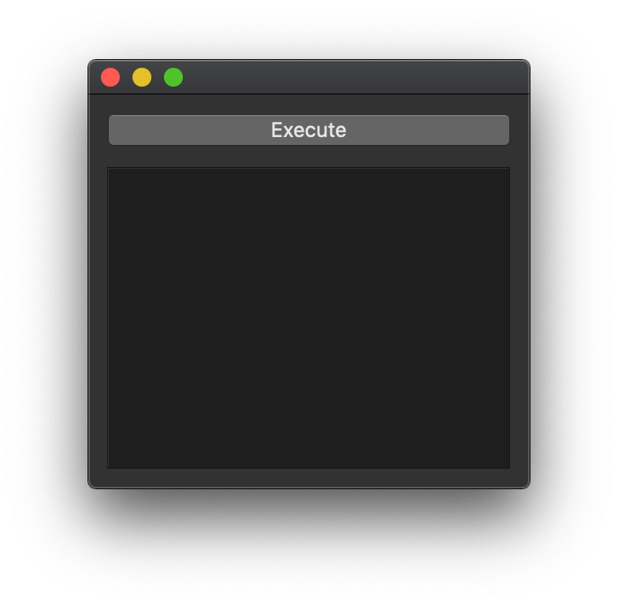
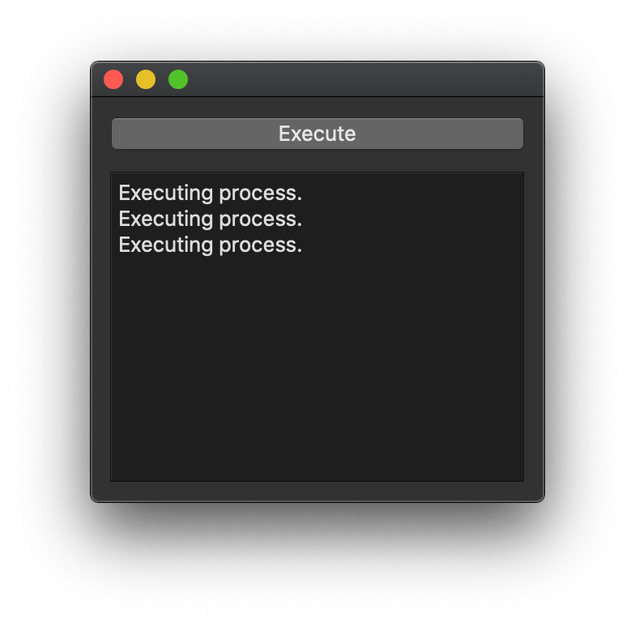
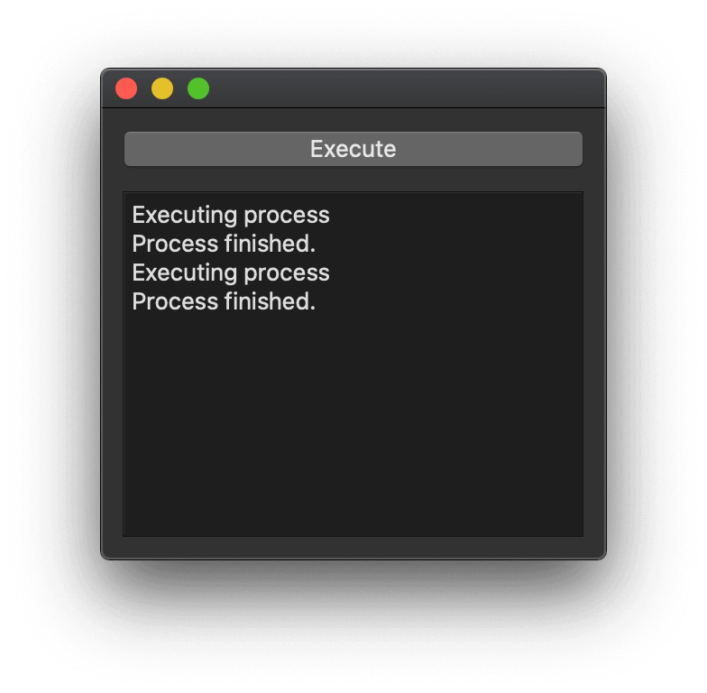
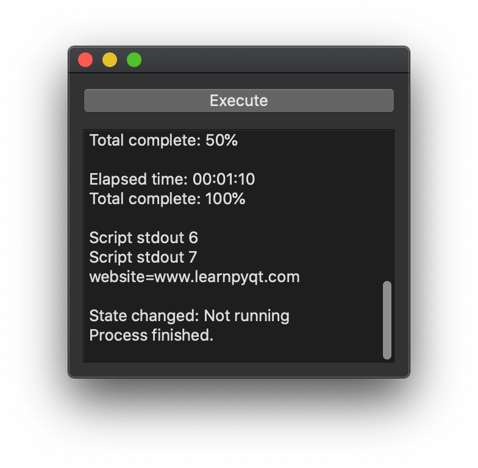
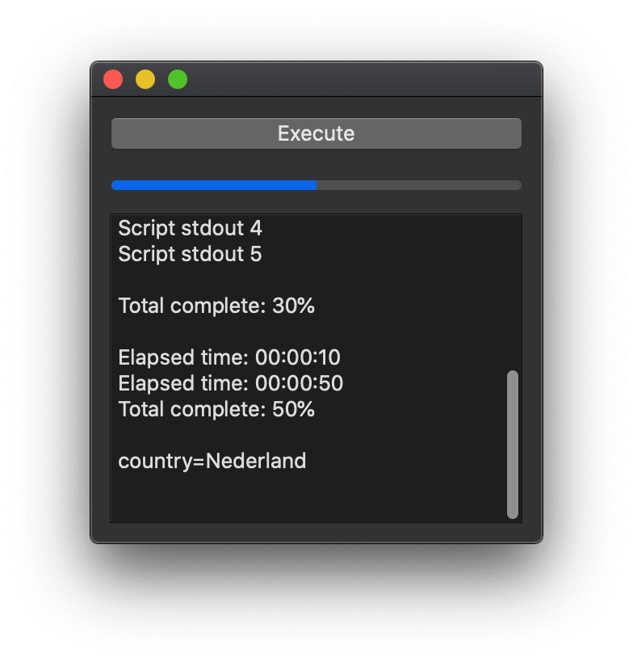
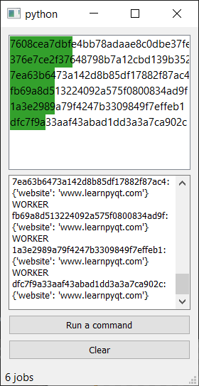

到目前为止，我们已经探讨了如何在独立的线程中运行工作，让您能够在不中断UI的情况下执行复杂任务。当使用Python库来完成任务时，这非常有效，但有时您希望运行外部应用程序，向其传递参数并获取结果。

在本教程中，我们将学习 `QProcess`，这是Qt中用于从您自己的应用内部运行外部程序的系统。

### 外部程序

为了能够测试使用 `QProcess` 运行外部程序，我们需要一个可运行的东西。为此，我们将创建一个简单的Python脚本，然后我们可以从我们的应用程序内部启动它。将以下内容放入一个文件中，并将其保存为 `dummy_script.py`。

我在这里使用Python是为了确保它能在所有平台上工作。如果您有一个现有的命令行工具想要测试，您也可以用它来代替。

不必过分关注这个脚本的内容，它只是一系列打印（流写入）语句，每次打印后都会等待半秒。这模拟了一个耗时的外部程序，该程序会定期打印出状态消息。稍后我们将看到如何从这个输出中提取数据。

```python
import sys
import time


def flush_then_wait():
    sys.stdout.flush()
    sys.stderr.flush()
    time.sleep(0.5)


sys.stdout.write("Script stdout 1\n")
sys.stdout.write("Script stdout 2\n")
sys.stdout.write("Script stdout 3\n")
sys.stderr.write("Total time: 00:05:00\n")
sys.stderr.write("Total complete: 10%\n")
flush_then_wait()

sys.stdout.write("name=Martin\n")
sys.stdout.write("Script stdout 4\n")
sys.stdout.write("Script stdout 5\n")
sys.stderr.write("Total complete: 30%\n")
flush_then_wait()

sys.stderr.write("Elapsed time: 00:00:10\n")
sys.stderr.write("Elapsed time: 00:00:50\n")
sys.stderr.write("Total complete: 50%\n")
sys.stdout.write("country=Nederland\n")
flush_then_wait()

sys.stderr.write("Elapsed time: 00:01:10\n")
sys.stderr.write("Total complete: 100%\n")
sys.stdout.write("Script stdout 6\n")
sys.stdout.write("Script stdout 7\n")
sys.stdout.write("website=www.mfitzp.com\n")
flush_then_wait()
```

现在我们有了 `dummy_script.py`，我们可以在我们的Qt应用程序中运行它了。

### 基本应用程序

为了试验通过 `QProcess` 运行程序，我们需要一个骨架应用程序。如下所示——一个带有 `QPushButton` 和 `QPlainTextEdit` 的简单窗口。按下按钮会调用我们的自定义槽 `start_process`，我们将在其中执行我们的外部进程。

```python
from PySide6.QtWidgets import (QApplication, QMainWindow, QPushButton, QPlainTextEdit,
                                QVBoxLayout, QWidget)
from PySide6.QtCore import QProcess
import sys


class MainWindow(QMainWindow):

    def __init__(self):
        super().__init__()

        self.btn = QPushButton("Execute")
        self.btn.pressed.connect(self.start_process)
        self.text = QPlainTextEdit()
        self.text.setReadOnly(True)

        l = QVBoxLayout()
        l.addWidget(self.btn)
        l.addWidget(self.text)

        w = QWidget()
        w.setLayout(l)

        self.setCentralWidget(w)

    def start_process(self):
        # 我们将在这里运行我们的进程。
        pass

app = QApplication(sys.argv)

w = MainWindow()
w.show()

app.exec()
```

确保它能工作，虽然目前没什么可看的——按下按钮也什么都不会发生。


_骨架应用程序。_

### 使用 `QProcess` 执行外部应用程序

使用 QProcess 执行外部程序相当直接。首先您创建一个 `QProcess` 对象，然后调用 `.start()`，传入要执行的命令和一个字符串参数的 `list`。

```python
p = QProcess()
p.start("<program>", [<arguments>])
```

在我们的例子中，我们用Python运行自定义的 `dummy_script.py` 脚本，所以我们的可执行文件是 `python` (或 `python3`)，我们的参数只有一个 `dummy_script.py`。

```python
p = QProcess()
p.start("python3", ['dummy_script.py'])
```

如果您正在运行另一个命令行程序，您需要为它指定参数。例如，使用 `ffmpeg` 从视频文件中提取信息。

```python
p = QProcess()
p.start("ffprobe", ['-show_format', '-show_streams', 'a.mp4'])
```

对您自己的命令行程序也使用同样的方法，记住将参数拆分成列表中的单个项目。

我们可以将 `p.start("python3", ['dummy_script.py'])` 的例子添加到我们的应用程序骨架中，如下所示。我们还添加了一个辅助方法 `message()` 来将消息写入我们UI中的文本框。

```python
from PySide6.QtWidgets import (QApplication, QMainWindow, QPushButton, QPlainTextEdit,
                                QVBoxLayout, QWidget)
from PySide6.QtCore import QProcess
import sys


class MainWindow(QMainWindow):

    def __init__(self):
        super().__init__()

        self.btn = QPushButton("Execute")
        self.btn.pressed.connect(self.start_process)
        self.text = QPlainTextEdit()
        self.text.setReadOnly(True)

        l = QVBoxLayout()
        l.addWidget(self.btn)
        l.addWidget(self.text)

        w = QWidget()
        w.setLayout(l)

        self.setCentralWidget(w)

    def message(self, s):
        self.text.appendPlainText(s)

    def start_process(self):
        self.message("Executing process.")
        self.p = QProcess()  # 在 QProcess 运行时，保留对它的引用（例如，在 self 上）。
        self.p.start("python3", ['dummy_script.py'])


app = QApplication(sys.argv)

w = MainWindow()
w.show()

app.exec()
```

请注意，您必须在创建的 `QProcess` 对象运行时保留对它的引用，例如，保存在 `self.p` 上。否则，该对象将被过早删除，您会看到一个 `QProcess: Destroyed while process ("python3") is still running.` 的错误。

如果您运行这个例子并按下按钮，什么也不会发生。外部脚本正在运行，但您看不到输出。

_显示了执行消息，但除此之外没什么别的了。_

如果您重复按下按钮，您可能会看到类似这样的消息——

```bash
QProcess: Destroyed while process ("python3") is still running.
```

这是因为如果您在*一个进程已经在运行时*按下按钮，创建新进程会替换 `self.p` 中对现有 `QProcess` 对象的引用，从而删除了它。我们可以通过在执行新进程前检查 `self.p` 的值，并连接一个*完成*信号来将其重置回 `None` 来避免这种情况，例如：

```python
from PySide6.QtWidgets import (QApplication, QMainWindow, QPushButton, QPlainTextEdit,
                                QVBoxLayout, QWidget)
from PySide6.QtCore import QProcess
import sys


class MainWindow(QMainWindow):

    def __init__(self):
        super().__init__()

        self.p = None

        self.btn = QPushButton("Execute")
        self.btn.pressed.connect(self.start_process)
        self.text = QPlainTextEdit()
        self.text.setReadOnly(True)

        l = QVBoxLayout()
        l.addWidget(self.btn)
        l.addWidget(self.text)

        w = QWidget()
        w.setLayout(l)

        self.setCentralWidget(w)

    def message(self, s):
        self.text.appendPlainText(s)

    def start_process(self):
        if self.p is None:  # 没有进程在运行。
            self.message("Executing process")
            self.p = QProcess()  # 在 QProcess 运行时，保留对它的引用（例如，在 self 上）。
            self.p.finished.connect(self.process_finished)  # 一旦完成就进行清理。
            self.p.start("python3", ['dummy_script.py'])

    def process_finished(self):
        self.message("Process finished.")
        self.p = None


app = QApplication(sys.argv)

w = MainWindow()
w.show()

app.exec()
```

现在运行这个，您可以启动进程，并且——一旦它完成——再次启动它。每次进程完成时，您都会在文本框中看到“Process finished.”的消息。


_一旦进程完成，就会显示“Process finished”消息。_

### 从 `QProcess` 获取数据

到目前为止，我们已经执行了一个外部程序，并在它开始和停止时得到了通知，但对其正在做什么一无所知。在某些情况下，这没问题，您只希望作业运行，但通常您会想要一些更详细的反馈。`QProcess` 提供了许多信号，可用于跟踪进程的进度和状态，这很有帮助。

如果您熟悉在Python中使用 `subprocess` 运行外部进程，您可能熟悉*流*。这些是类似文件的对象，您用它们从正在运行的进程中检索数据。两个标准流是*标准输出*和*标准错误*。前者接收应用程序输出的*结果*数据，而后者接收*诊断*或*错误*消息。根据您的兴趣，这两者都可能很有用——许多程序（比如我们的 `dummy_script.py`）将进度信息输出到*标准错误*流。

在Qt的世界里，同样的原则也适用。`QProcess` 对象有两个信号 `.readyReadStandardOutput` 和 `.readyReadStandardError`，用于在相应流中有数据可用时通知您。然后我们可以从进程中读取以获取最新数据。

下面是一个 `QProcess` 的设置示例，它连接了 `readyReadStandardOutput` 和 `.readyReadStandardError`，并跟踪状态变化和完成信号。

```python
p = QProcess()
p.readyReadStandardOutput.connect(self.handle_stdout)
p.readyReadStandardError.connect(self.handle_stderr)
p.stateChanged.connect(self.handle_state)
p.finished.connect(self.cleanup)
p.start("python", ["dummy_script.py"])
```

`.stateChanged` 信号在进程状态改变时触发。有效值——定义在 `QProcess.ProcessState` 枚举中——如下所示。

| 常量 | 值 | 描述 |
| :--- | :-- | :--- |
| `QProcess.NotRunning` | 0 | 进程未运行。 |
| `QProcess.Starting` | 1 | 进程正在启动，但程序尚未被调用。 |
| `QProcess.Running` | 2 | 进程正在运行，并准备好进行读写。 |

将这些放入我们的例子中，并为每个信号实现处理方法，我们得到以下完整的代码。

```python
from PySide6.QtWidgets import (QApplication, QMainWindow, QPushButton, QPlainTextEdit,
                                QVBoxLayout, QWidget)
from PySide6.QtCore import QProcess
import sys


class MainWindow(QMainWindow):

    def __init__(self):
        super().__init__()

        self.p = None

        self.btn = QPushButton("Execute")
        self.btn.pressed.connect(self.start_process)
        self.text = QPlainTextEdit()
        self.text.setReadOnly(True)

        l = QVBoxLayout()
        l.addWidget(self.btn)
        l.addWidget(self.text)

        w = QWidget()
        w.setLayout(l)

        self.setCentralWidget(w)

    def message(self, s):
        self.text.appendPlainText(s)

    def start_process(self):
        if self.p is None:  # 没有进程在运行。
            self.message("Executing process")
            self.p = QProcess()  # 在 QProcess 运行时，保留对它的引用（例如，在 self 上）。
            self.p.readyReadStandardOutput.connect(self.handle_stdout)
            self.p.readyReadStandardError.connect(self.handle_stderr)
            self.p.stateChanged.connect(self.handle_state)
            self.p.finished.connect(self.process_finished)  # 一旦完成就进行清理。
            self.p.start("python3", ['dummy_script.py'])

    def handle_stderr(self):
        data = self.p.readAllStandardError()
        stderr = bytes(data).decode("utf8")
        self.message(stderr)

    def handle_stdout(self):
        data = self.p.readAllStandardOutput()
        stdout = bytes(data).decode("utf8")
        self.message(stdout)

    def handle_state(self, state):
        states = {
            QProcess.NotRunning: 'Not running',
            QProcess.Starting: 'Starting',
            QProcess.Running: 'Running',
        }
        state_name = states[state]
        self.message(f"State changed: {state_name}")

    def process_finished(self):
        self.message("Process finished.")
        self.p = None


app = QApplication(sys.argv)

w = MainWindow()
w.show()

app.exec()
```

如果您运行这个，您会看到标准输出、标准错误、状态变化以及开始/停止消息都打印到文本框中。请注意，我们在输出前将状态转换回友好的字符串（使用一个 `dict` 来从枚举值进行映射）。


_我们自定义脚本的输出显示在文本框中。_

输出处理有点棘手，值得仔细看看。

```python
        data = self.p.readAllStandardError()
        stderr = bytes(data).decode("utf8")
        self.message(stderr)
```

这是必需的，因为 `QProcess.readAllStandardError` 和 `QProcess.readAllStandardOutput` 返回的是包装在Qt对象（QByteArray）中的字节数据。我们必须首先将其转换为Python的 `bytes()` 对象，然后将该字节流*解码*为字符串（这里使用UTF8编码）。

### 从进程输出中解析数据

目前我们只是将程序的输出转储到文本框中，但如果我们想从中提取一些特定的数据怎么办？一个常见的用例是跟踪正在运行的程序的进度，这样我们可以在它完成时显示一个进度条。

在这个例子中，我们的演示脚本 `dummy_script.py` 返回一系列字符串，包括在*标准错误*上的行，显示当前完成的进度百分比——例如 `Total complete: 50%`。我们可以处理这些行来得到进度，并将其显示在状态栏上。

在下面的例子中，我们使用一个自定义的*正则表达式*来提取这个信息。`simple_percent_parser` 函数匹配*标准错误*流的内容，并提取一个0-100之间的整数作为进度。这个值被用来更新添加到UI中的进度条。

```python
from PySide6.QtWidgets import (QApplication, QMainWindow, QPushButton, QPlainTextEdit,
                                QVBoxLayout, QWidget, QProgressBar)
from PySide6.QtCore import QProcess
import sys
import re

# 一个正则表达式，用于提取完成百分比。
progress_re = re.compile("Total complete: (\d+)%")

def simple_percent_parser(output):
    """
    使用 progress_re 正则表达式匹配行，
    返回一个表示完成百分比的整数。
    """
    m = progress_re.search(output)
    if m:
        pc_complete = m.group(1)
        return int(pc_complete)


class MainWindow(QMainWindow):

    def __init__(self):
        super().__init__()

        self.p = None

        self.btn = QPushButton("Execute")
        self.btn.pressed.connect(self.start_process)
        self.text = QPlainTextEdit()
        self.text.setReadOnly(True)

        self.progress = QProgressBar()
        self.progress.setRange(0, 100)

        l = QVBoxLayout()
        l.addWidget(self.btn)
        l.addWidget(self.progress)
        l.addWidget(self.text)

        w = QWidget()
        w.setLayout(l)

        self.setCentralWidget(w)

    def message(self, s):
        self.text.appendPlainText(s)

    def start_process(self):
        if self.p is None:  # 没有进程在运行。
            self.message("Executing process")
            self.p = QProcess()  # 在 QProcess 运行时，保留对它的引用（例如，在 self 上）。
            self.p.readyReadStandardOutput.connect(self.handle_stdout)
            self.p.readyReadStandardError.connect(self.handle_stderr)
            self.p.stateChanged.connect(self.handle_state)
            self.p.finished.connect(self.process_finished)  # 一旦完成就进行清理。
            self.p.start("python3", ['dummy_script.py'])

    def handle_stderr(self):
        data = self.p.readAllStandardError()
        stderr = bytes(data).decode("utf8")
        # 如果数据中有进度，则提取进度。
        progress = simple_percent_parser(stderr)
        if progress:
            self.progress.setValue(progress)
        self.message(stderr)

    def handle_stdout(self):
        data = self.p.readAllStandardOutput()
        stdout = bytes(data).decode("utf8")
        self.message(stdout)

    def handle_state(self, state):
        states = {
            QProcess.NotRunning: 'Not running',
            QProcess.Starting: 'Starting',
            QProcess.Running: 'Running',
        }
        state_name = states[state]
        self.message(f"State changed: {state_name}")

    def process_finished(self):
        self.message("Process finished.")
        self.p = None


app = QApplication(sys.argv)

w = MainWindow()
w.show()

app.exec()
```

如果您运行这个并启动一个进程，您会看到随着从 `dummy_script.py` 接收到进度消息，进度条会逐渐填充。


_随着脚本的完成，进度条会逐渐填充。_

这种方法对任何命令行程序都适用——在某些情况下，您可能想解析*标准输出*而不是*标准错误*，但原理是相同的。有时程序不会给您一个预先计算好的进度值，您需要发挥一点创造力。如果您喜欢挑战，可以尝试修改解析器，从 `dummy_script.py` 的*标准错误*中提取*总时间*和*已用时间*数据，并用它来计算进度条。您也可以尝试为其他命令行程序调整这个运行方式。

### 进一步的改进

在所有这些例子中，我们将进程的引用存储在 `self.p` 中，这意味着我们一次只能运行一个进程。但是您可以随心所欲地在您的应用程序旁边运行任意多个进程。如果您不需要跟踪它们的信息，您可以简单地将进程的引用存储在一个 `list` 中。

如果您同时运行多个外部程序并且*确实*想要跟踪它们的状态，您可能需要考虑创建一个*管理器*类来为您做这件事。相关的PySide书籍包含更多示例，包括一个将 `QProcess` 标准输出解析与[模型视图](https://www.pythonguis.com/courses/pyside-model-views/)结合起来的管理器，为外部进程创建一个实时的进度监视器。


_进程管理器，显示活动进程和进度_