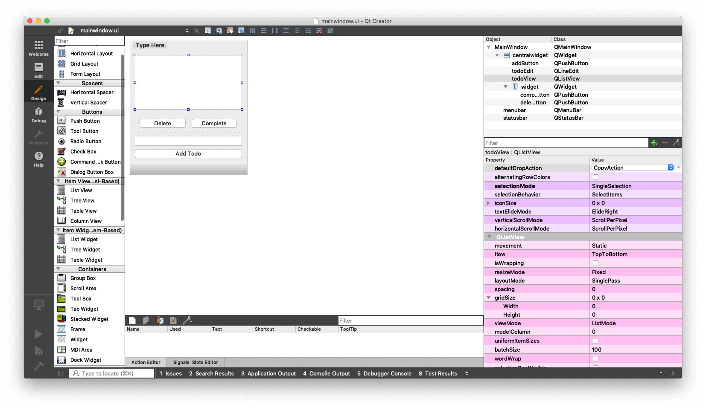
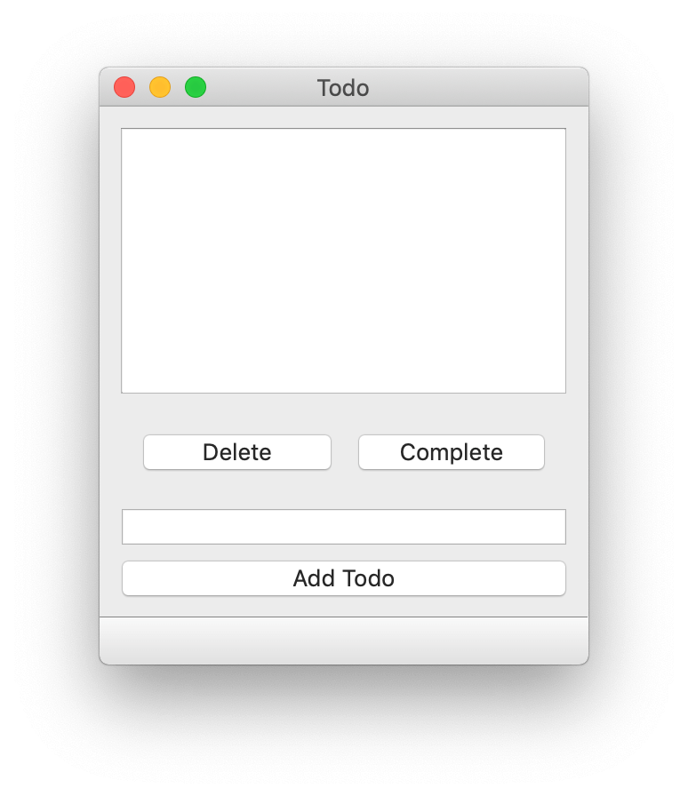
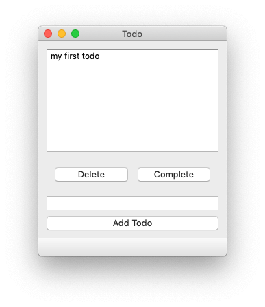
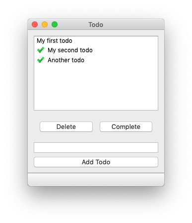

当您开始使用 PySide6 构建更复杂的应用程序时，您可能会遇到在保持控件（widgets）与数据同步方面的问题。

存储在控件中的数据（例如，一个简单的 `QListWidget`）不容易从 Python 中直接操作——进行更改需要您获取一个项目，获取其数据，然后再设置回去。对此，默认的解决方案是在 Python 中维护一个外部的数据表示，然后要么将更新同时应用到数据和控件上，要么干脆根据数据重写整个控件。这种方式很快就会变得混乱，并导致大量仅仅为了处理数据而存在的样板代码。

幸运的是，Qt 对此有一个解决方案——ModelViews。ModelViews 是标准显示控件的一种强大替代方案，它使用一个标准的模型接口与数据源进行交互——从简单的数据结构到外部数据库都可以。这将您的数据隔离开来，允许它以您喜欢的任何结构保存，而视图（view）则负责呈现和更新。

本教程将介绍 Qt ModelView 架构的关键方面，并用它来构建一个简单的桌面待办事项（Todo）应用程序。

### 模型-视图-控制器 (Model View Controller)

**模型-视图-控制器** (MVC) 是一种用于开发用户界面的架构模式，它将一个应用程序分为三个相互关联的部分。这种模式将数据的内部表示与信息如何呈现给用户以及如何从用户那里接收信息分离开来。

MVC 设计模式解耦了三个主要组件——

*   **模型 (Model)** 持有应用程序正在使用的数据结构。
*   **视图 (View)** 是向用户展示的信息的任何表示形式，无论是图形还是表格。同一数据模型允许多个视图。
*   **控制器 (Controller)** 接受用户的输入，并将其转换为对模型或视图的命令。

在 Qt 的世界里，视图和控制器之间的区别变得有些模糊。Qt 从用户那里（通过操作系统）接收输入事件，并将这些事件委托给控件（控制器）来处理。然而，控件也负责向用户呈现当前状态，这又将它们 squarely 归入视图的范畴。与其纠结于在哪里划清界限，在 Qt 的语境中，视图和控制器被合并在一起，创建了一个模型/视图控制器架构——为简单起见，称之为“模型视图 (Model View)”。

重要的是，*数据*和*它如何被呈现*之间的区别被保留了下来。

### 模型视图 (The Model View)

模型充当数据存储和视图控制器之间的接口。模型持有数据（或对数据的引用），并通过一个标准化的 API 来呈现这些数据，然后视图消费这些数据并将其呈现给用户。多个视图可以共享同一个数据模型，以完全不同的方式呈现它。

您可以为您的模型使用任何“数据存储”，例如标准的 Python 列表或字典，或者一个数据库（例如通过 SQLAlchemy）——这完全取决于您。

这两个部分的主要职责是——

1.  **模型 (model)** 存储数据或其引用，并返回单个或范围内的记录，以及相关的元数据或*显示*指令。
2.  **视图 (view)** 从模型请求数据，并在控件上显示返回的内容。

Qt 文档中对 Qt 架构有[深入的讨论](http://doc.qt.io/qt-6/model-view-programming.html)。

### 一个简单的模型视图——待办事项列表

为了演示如何在实践中使用模型视图，我们将构建一个非常简单的桌面待办事项列表实现。它将包含一个用于显示项目列表的 `QListView`，一个用于输入新项目的 `QLineEdit`，以及一组用于添加、删除或标记项目为完成的按钮。

#### UI 界面

这个简单的 UI 是使用 Qt Creator 布局并保存为 `mainwindow.ui` 的。`.ui` 文件和所有其他部分可以在下面下载。

[Todo 应用程序源代码](https://www.pythonguis.com/d/todo.zip)


*在 Qt Creator 中设计一个简单的 Todo 应用*

运行中的应用如下所示。


*运行中的 Todo GUI (目前还没有任何功能)*

界面中可用的控件被赋予了下表中显示的 ID。

| objectName | 类型 | 描述 |
| :--- | :--- | :--- |
| `todoView` | `QListView` | 当前待办事项的列表 |
| `todoEdit` | `QLineEdit` | 用于创建新待办事项的文本输入框 |
| `addButton` | `QPushButton` | 创建新的待办事项，并将其添加到列表中 |
| `deleteButton` | `QPushButton` | 删除当前选中的待办事项 |
| `completeButton` | `QPushButton` | 将当前选中的待办事项标记为完成 |

我们稍后将使用这些标识符来连接应用程序的逻辑。

#### 模型 (The Model)

我们通过子类化一个基础实现来定义我们的自定义模型，这使我们能够专注于模型中独有的部分。Qt 提供了许多不同的模型基类，包括列表、树和表格（非常适合电子表格）。

对于这个例子，我们将结果显示在一个 `QListView` 中。与之匹配的基础模型是 `QAbstractListModel`。我们的模型的概要定义如下所示。

```python
class TodoModel(QtCore.QAbstractListModel):
    def __init__(self, *args, todos=None, **kwargs):
        super().__init__(*args, **kwargs)
        self.todos = todos or []

    def data(self, index, role):
        if role == Qt.DisplayRole:
            # 数据结构见下文。
            status, text = self.todos[index.row()]
            # 只返回待办事项的文本。
            return text

    def rowCount(self, index):
        return len(self.todos)
```

`.todos` 变量是我们的数据存储，`rowCount()` 和 `data()` 这两个方法是我们必须为列表模型实现的标准模型方法。我们将在下面依次介绍它们。

##### `.todos` 列表

我们模型的数据存储是 `.todos`，一个简单的 Python 列表，我们将在其中存储 `tuple` 格式的值 `[(bool, str), (bool, str), (bool, str)]`，其中 `bool` 是给定条目的*完成*状态，`str` 是待办事项的文本。

除非通过 `todos` 关键字参数传入一个列表，否则我们在启动时将 `self.todos` 初始化为一个空列表。

`self.todos = todos or []` 会在提供的 `todos` 值为*真值*（即除了空列表、布尔值 `False` 或 `None` 之外的任何值）时将 `self.todos` 设置为该值，否则将其设置为空列表 `[]`。

要创建这个模型的一个实例，我们只需这样做——

```python
model = TodoModel()   # 创建一个空的待办事项列表
```

或者传入一个已有的列表——

```python
todos = [(False, '一个项目'), (False, '另一个项目')]
model = TodoModel(todos=todos)
```

##### `.rowCount()`

`.rowCount()` 方法由视图调用，以获取当前数据中的行数。这是视图了解它可以从数据存储中请求的最大索引（`行数 - 1`）所必需的。由于我们使用 Python 列表作为数据存储，这个方法的返回值就是列表的 `len()`。

##### `.data()`

这是您模型的核心，它处理来自视图的数据请求并返回适当的结果。它接收两个参数 `index` 和 `role`。

`index` 是视图正在请求的数据的位置/坐标，可以通过 `.row()` 和 `.column()` 两个方法访问，它们分别给出在各个维度上的位置。

对于我们的 `QListView`，列总是 0，可以忽略，但在电子表格视图的二维数据中您需要使用它。

`role` 是一个标志，指示视图正在请求的数据*类型*。这是因为 `.data()` 方法实际上比仅仅提供核心数据承担了更多的责任。它还处理样式信息、工具提示、状态栏等的请求——基本上是任何可以由数据本身提供信息的东西。

`Qt.DisplayRole` 的命名有点奇怪，但这表示*视图*在问我们“请给我用于显示的数据”。还有其他的*角色*，`data` 方法可以接收它们用于样式请求或请求“可编辑”格式的数据。

| 角色 | 值 | 描述 |
| :--- | :-- | :--- |
| `Qt.DisplayRole` | `0` | 以文本形式呈现的关键数据。（`QString`） |
| `Qt.DecorationRole` | `1` | 以图标形式呈现的装饰数据。（`QColor`, `QIcon` 或 `QPixmap`） |
| `Qt.EditRole` | `2` | 适合在编辑器中编辑的数据形式。（`QString`） |
| `Qt.ToolTipRole` | `3` | 显示在项目工具提示中的数据。（`QString`） |
| `Qt.StatusTipRole` | `4` | 显示在状态栏中的数据。（`QString`） |
| `Qt.WhatsThisRole` | `5` | 在“这是什么？”模式下为项目显示的数据。（`QString`） |
| `Qt.SizeHintRole` | `13` | 将提供给视图的项目的尺寸提示。（`QSize`） |

有关您可以接收的可用*角色*的完整列表，请参阅 [Qt ItemDataRole 文档](https://doc.qt.io/qt-5/qt.html#ItemDataRole-enum)。我们的待办事项列表将只使用 `Qt.DisplayRole` 和 `Qt.DecorationRole`。

### 基本实现

下面是加载 UI 并显示它所需的基本应用程序存根。我们将把我们的模型代码和应用程序逻辑添加到这个基础上。

```python
import sys

from PySide6 import QtCore, QtGui, QtWidgets
from PySide6.QtCore import Qt

# 假设 UI 文件被 pyside6-uic 编译成了 MainWindow_ui.py
from MainWindow_ui import Ui_MainWindow


class TodoModel(QtCore.QAbstractListModel):
    def __init__(self, todos=None):
        super().__init__()
        self.todos = todos or []

    def data(self, index, role):
        if role == Qt.DisplayRole:
            status, text = self.todos[index.row()]
            return text

    def rowCount(self, index):
        return len(self.todos)


class MainWindow(QtWidgets.QMainWindow, Ui_MainWindow):
    def __init__(self):
        super().__init__()
        self.setupUi(self)
        self.model = TodoModel()
        self.todoView.setModel(self.model)


app = QtWidgets.QApplication(sys.argv)
window = MainWindow()
window.show()
app.exec()
```

我们像之前一样定义 `TodoModel`，并初始化 `MainWindow` 对象。在 `MainWindow` 的 `__init__` 中，我们创建了待办事项模型的一个实例，并将这个模型设置到 `todoView` 上。将此文件保存为 `todo.py` 并运行它。

虽然现在还看不到太多东西，但 `QListView` 和我们的模型实际上已经在工作了——如果您添加一些默认数据，您会看到它出现在列表中。

```python
self.model = TodoModel(todos=[(False, '我的第一个待办事项')])
```


*QListView 显示硬编码的待办事项*

您可以继续像这样手动添加项目，它们会按顺序显示在 `QListView` 中。接下来，我们将实现在应用程序内部添加项目的功能。

首先，在 `MainWindow` 上创建一个名为 `add` 的新方法。这是我们的回调函数，它将负责将输入框中的当前文本作为一个新的待办事项添加进去。在 `__init__` 块的末尾，将此方法连接到 `addButton.pressed` 信号。

```python
class MainWindow(QtWidgets.QMainWindow, Ui_MainWindow):
    def __init__(self):
        super().__init__()
        self.setupUi(self)
        self.model = TodoModel()
        self.todoView.setModel(self.model)
        # 连接按钮。
        self.addButton.pressed.connect(self.add)

    def add(self):
        """
        向我们的待办事项列表添加一个项目，从 QLineEdit .todoEdit 获取文本，
        然后清空它。
        """
        text = self.todoEdit.text()
        if text: # 不要添加空字符串。
            # 通过模型访问列表。
            self.model.todos.append((False, text))
            # 触发刷新。
            self.model.layoutChanged.emit()
            # 清空输入框
            self.todoEdit.setText("")
```

在 `add` 方法中，请注意 `self.model.layoutChanged.emit()` 这一行。在这里，我们发出一个模型信号 `.layoutChanged` 来让视图知道数据的*形态*已经改变。这会触发整个视图的刷新。如果您省略这一行，待办事项仍然会被添加，但 `QListView` 不会更新。

如果只是数据被修改，但行/列的数量没有受到影响，您可以改用 `.dataChanged()` 信号。这个信号还会定义一个数据中被修改的区域（通过左上角和右下角位置），以避免重绘整个视图。

### 连接其他操作

我们现在可以连接其余按钮的信号，并添加用于执行*删除*和*完成*操作的辅助函数。我们像之前一样，在 `__init__` 块中添加按钮信号的连接。

```python
        self.addButton.pressed.connect(self.add)
        self.deleteButton.pressed.connect(self.delete)
        self.completeButton.pressed.connect(self.complete)
```

然后，按如下方式定义一个新的 `delete` 方法——

```python
    def delete(self):
        indexes = self.todoView.selectedIndexes()
        if indexes:
            # 在单选模式下，indexes 是一个包含单个项目的列表。
            index = indexes[0]
            # 删除项目并刷新。
            del self.model.todos[index.row()]
            self.model.layoutChanged.emit()
            # 清除选择（因为它不再有效）。
            self.todoView.clearSelection()
```

我们使用 `self.todoView.selectedIndexes()` 来获取索引（实际上是一个包含单个项目的列表，因为我们处于单选模式），然后使用 `.row()` 作为我们模型上待办事项列表的索引。我们使用 Python 的 `del` 操作符删除索引项，然后因为数据的形态被修改而触发一个 `layoutChanged` 信号。

最后，我们清除活动的选项，因为与它相关的项目现在可能已经越界了（如果您选择了最后一个项目）。

`complete` 方法如下所示——

```python
    def complete(self):
        indexes = self.todoView.selectedIndexes()
        if indexes:
            index = indexes[0]
            row = index.row()
            status, text = self.model.todos[row]
            self.model.todos[row] = (True, text)
            # .dataChanged 接收左上角和右下角，对于单个选择，它们是相等的。
            self.model.dataChanged.emit(index, index)
            # 清除选择。
            self.todoView.clearSelection()
```

这里使用了与删除相同的索引方式，但这次我们从模型 `.todos` 列表中获取项目，然后将状态替换为 `True`。

我们必须这样做获取-并-替换的操作，因为我们的数据是以不可修改的 Python 元组（tuple）形式存储的。

这里与标准 Qt 控件的关键区别在于，我们直接对我们的数据进行更改，并且只需要通知 Qt 发生了某些变化——更新控件状态是自动处理的。

### 使用 Qt.DecorationRole

如果您现在运行应用程序，您应该会发现添加和删除都能正常工作，但虽然完成项目的功能在工作，视图中却没有相应的指示。我们需要更新我们的模型，以便在项目完成时为视图提供一个可显示的指示器。更新后的模型如下所示。

```python
tick = QtGui.QImage('tick.png') # 假设 tick.png 在同一目录下


class TodoModel(QtCore.QAbstractListModel):
    def __init__(self, *args, todos=None, **kwargs):
        super().__init__(*args, **kwargs)
        self.todos = todos or []

    def data(self, index, role):
        if role == Qt.DisplayRole:
            _, text = self.todos[index.row()]
            return text

        if role == Qt.DecorationRole:
            status, _ = self.todos[index.row()]
            if status:
                return tick

    def rowCount(self, index):
        return len(self.todos)
```

我们使用一个勾号图标 `tick.png` 来指示已完成的项目，我们将其加载到一个名为 `tick` 的 `QImage` 对象中。在模型中，我们实现了一个 `Qt.DecorationRole` 的处理程序，它为 `status` 为 `True`（表示完成）的行返回勾号图标。

我使用的图标来自 [p.yusukekamiyamane](http://p.yusukekamiyamane.com/) 的 Fugue 图标集。

除了图标，您还可以返回一种颜色，例如 `QtGui.QColor('green')`，它将被绘制成一个实心方块。

运行该应用，您现在应该能够将项目标记为已完成。


*标记为完成的待办事项*

### 持久化数据存储

我们的待办事项应用工作得很好，但它有一个致命的缺陷——一旦您关闭应用程序，它就会忘记您的待办事项。虽然认为自己无事可做可能有助于短期的禅意，但从长远来看，这可能不是一个好主意。

解决方案是实现某种持久化数据存储。最简单的方法是使用一个简单的文件存储，我们在启动时从 JSON 或 Pickle 文件中加载项目，并在更改时写回。

为此，我们在 `MainWindow` 类上定义了两个新方法——`load` 和 `save`。它们分别从一个名为 `data.json` 的 JSON 文件中加载数据到 `self.model.todos`（如果文件存在，如果不存在则忽略错误），以及将当前的 `self.model.todos` 写出到同一个文件。

```python
    def load(self):
        try:
            with open('data.json', 'r') as f:
                self.model.todos = json.load(f)
        except Exception:
            pass

    def save(self):
        with open('data.json', 'w') as f:
            json.dump(self.model.todos, f)
```

为了持久化数据的更改，我们需要在任何修改数据的方法的末尾添加 `.save()` 处理程序，并在模型创建后的 `__init__` 块中添加 `.load()` 处理程序。

最终的代码如下所示——

```python
import json
import sys

from PySide6 import QtCore, QtGui, QtWidgets
from PySide6.QtCore import Qt

# 假设 UI 文件被 pyside6-uic 编译成了 MainWindow_ui.py
from MainWindow_ui import Ui_MainWindow

tick = QtGui.QImage("tick.png")


class TodoModel(QtCore.QAbstractListModel):
    def __init__(self, todos=None):
        super().__init__()
        self.todos = todos or []

    def data(self, index, role):
        if role == Qt.DisplayRole:
            _, text = self.todos[index.row()]
            return text

        if role == Qt.DecorationRole:
            status, _ = self.todos[index.row()]
            if status:
                return tick

    def rowCount(self, index):
        return len(self.todos)


class MainWindow(QtWidgets.QMainWindow, Ui_MainWindow):
    def __init__(self):
        super().__init__()
        self.setupUi(self)
        self.model = TodoModel()
        self.load()
        self.todoView.setModel(self.model)
        self.addButton.pressed.connect(self.add)
        self.deleteButton.pressed.connect(self.delete)
        self.completeButton.pressed.connect(self.complete)

    def add(self):
        text = self.todoEdit.text()
        if text:
            self.model.todos.append((False, text))
            self.model.layoutChanged.emit()
            self.todoEdit.setText("")
            self.save()

    def delete(self):
        indexes = self.todoView.selectedIndexes()
        if indexes:
            index = indexes[0]
            del self.model.todos[index.row()]
            self.model.layoutChanged.emit()
            self.todoView.clearSelection()
            self.save()

    def complete(self):
        indexes = self.todoView.selectedIndexes()
        if indexes:
            index = indexes[0]
            row = index.row()
            status, text = self.model.todos[row]
            self.model.todos[row] = (True, text)
            self.model.dataChanged.emit(index, index)
            self.todoView.clearSelection()
            self.save()

    def load(self):
        try:
            with open("data.json", "r") as f:
                self.model.todos = json.load(f)
        except Exception:
            pass

    def save(self):
        with open("data.json", "w") as f:
            json.dump(self.model.todos, f)


app = QtWidgets.QApplication(sys.argv)
window = MainWindow()
window.show()
app.exec()
```

如果您的应用程序中的数据有可能变得庞大或更复杂，您可能更愿意使用一个真正的数据库来存储它。在这种情况下，模型将包装数据库的接口，并直接查询它以获取要显示的数据。我将在接下来的教程中介绍如何做到这一点。