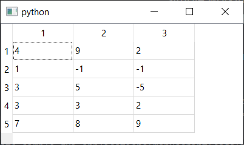
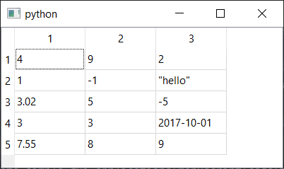
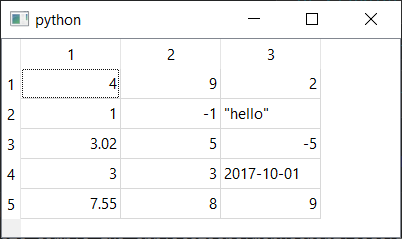
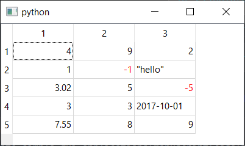
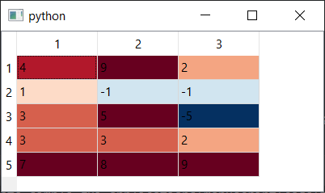
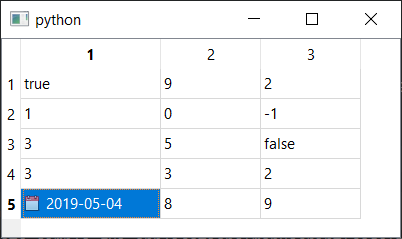
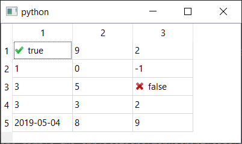
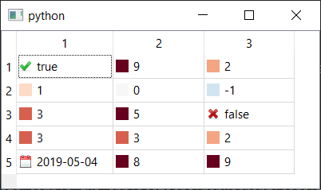
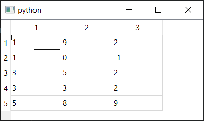
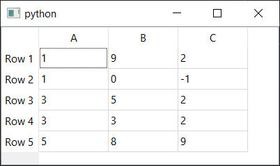

在之前的教程中，我们介绍了模型视图（Model View）架构。然而，我们只接触了其中一种模型视图——`QListView`。在Qt6中还有另外两种可用的模型视图——`QTableView`和`QTreeView`，它们使用相同的`QAbstractItemModel`（或其子类）来提供表格（类似Excel）和树状（类似文件目录浏览器）的视图。

在本教程中，我们将学习如何使用PySide中的`QTableView`，包括如何为您的数据建模、格式化显示值以及添加条件格式化。

您可以在任何数据源上使用模型视图，只要您的模型以Qt能理解的格式返回数据即可。在Python中处理表格数据为我们如何加载和使用这些数据开启了多种可能性。在这里，我们将从一个简单的嵌套`list`开始，然后转向将您的Qt应用程序与流行的*numpy*和*pandas*库集成。这将为您构建以数据为中心的应用程序提供一个坚实的基础。

### `QTableView` 简介

`QTableView`是一个Qt视图控件，它以类似电子表格的表格视图来呈现数据。与*模型视图架构*中的所有控件一样，它使用一个独立的*模型*来向视图提供数据和表示信息。模型中的数据可以根据需要进行更新，并且视图会被通知这些更改以重绘/显示这些变化。通过自定义模型，可以对数据的呈现方式进行极大的控制。

为了使用这个模型，我们需要一个基本的应用程序结构和一些虚拟数据。下面展示了一个简单的可用示例，它定义了一个使用简单嵌套列表作为数据存储的自定义模型。

我们稍后会详细讨论替代的数据结构。

```python
import sys
from PySide6 import QtCore, QtGui, QtWidgets
from PySide6.QtCore import Qt


class TableModel(QtCore.QAbstractTableModel):
    def __init__(self, data):
        super().__init__()
        self._data = data

    def data(self, index, role):
        if role == Qt.DisplayRole:
            # 嵌套列表的数据结构见下文。
            # .row() 索引外层列表，
            # .column() 索引内层子列表
            return self._data[index.row()][index.column()]

    def rowCount(self, index):
        # 外层列表的长度。
        return len(self._data)

    def columnCount(self, index):
        # 以下代码获取第一个子列表，并返回其长度
        # (仅当所有行的长度相同时才有效)
        return len(self._data[0])


class MainWindow(QtWidgets.QMainWindow):
    def __init__(self):
        super().__init__()

        self.table = QtWidgets.QTableView()

        data = [
          [4, 9, 2],
          [1, 0, 0],
          [3, 5, 0],
          [3, 3, 2],
          [7, 8, 9],
        ]

        self.model = TableModel(data)
        self.table.setModel(self.model)

        self.setCentralWidget(self.table)


app=QtWidgets.QApplication(sys.argv)
window=MainWindow()
window.show()
app.exec()
```

和我们之前的模型视图示例一样，我们创建`QTableView`控件，然后创建我们自定义模型的实例（我们已将其编写为接受数据源作为参数），然后我们在视图上设置模型。这就是我们需要做的全部——视图控件现在使用模型来获取数据，并决定如何绘制它。


*基本的QTableView示例*

### 使用嵌套`list`作为二维数据存储

对于一个表格，您需要一个二维数据结构，包含行和列。如上例所示，您可以使用嵌套的Python `list`来模拟一个简单的二维数据结构。下面我们花点时间看一下这种数据结构及其局限性——

```python
table = [
  [4, 1, 3, 3, 7],
  [9, 1, 5, 3, 8],
  [2, 1, 5, 3, 9],
]```

嵌套列表是“值的列表的列表”——一个外层列表包含多个子列表，这些子列表本身包含值。使用这种结构，要索引到单个值（或“单元格”），您必须索引两次，首先返回一个内部的`list`对象，然后再次对该`list`进行索引。

通常的安排是外层列表持有*行*，每个嵌套列表包含*列*的值。通过这种安排，当您索引时，您首先按*行*索引，然后按*列*索引——使我们的示例`table`成为一个3行5列的表格。方便的是，这与源代码中的视觉布局相匹配。

对表格的第一次索引将返回一个嵌套的子列表——

```python
row = 2
col = 4

>>> table[row]
[2, 1, 5, 3, 9]
```

然后您再次索引以返回值——

```python
>>> table[row][col]
9
```

请注意，使用这种结构，您无法轻松地返回整个*列*，而需要遍历所有行。当然，您也可以完全颠倒过来，将第一次索引作为*列*，这取决于按列访问还是按行访问对您更有用。

```python
table = [
  [4, 9, 2],
  [1, 1, 1],
  [3, 5, 5],
  [3, 3, 2],
  [7, 8, 9],
]

row = 4  # 反转
col = 2  # 反转

>>> table[col]
[3, 5, 5]

>>> table[col][row]
9
```

这种数据结构本身并不强制要求行或列的长度相等——一行可以是5个元素长，另一行可以是200个。不一致性可能导致表格视图出现意外错误。如果您正在处理大型或复杂的数据表，请参阅后面关于替代数据存储的部分。

接下来，我们将更详细地看一下我们的自定义`TableModel`，看看它是如何与这种简单的数据结构一起工作以显示值的。

### 编写自定义的 `QAbstractTableModel`

在*模型视图架构*中，模型负责提供数据和用于视图显示的表示元数据。为了在我们的数据对象和视图之间建立接口，我们需要编写自己的自定义模型，该模型理解我们数据的结构。

要编写我们的自定义模型，我们可以创建一个`QAbstractTableModel`的子类。自定义表格模型唯一*必需*的方法是`data`、`rowCount`和`columnCount`。第一个方法为表格中的给定位置返回数据（或表示信息），而后两个方法必须为数据源的维度返回一个单一的整数值。

```python
class TableModel(QtCore.QAbstractTableModel):

    def __init__(self, data):
        super().__init__()
        self._data = data

    def data(self, index, role):
        if role == Qt.DisplayRole:
            # 嵌套列表的数据结构见下文。
            # .row() 索引外层列表，
            # .column() 索引内层子列表
            return self._data[index.row()][index.column()]

    def rowCount(self, index):
        # 外层列表的长度。
        return len(self._data)

    def columnCount(self, index):
        # 以下代码获取第一个子列表，并返回其长度
        # (仅当所有行的长度相同时才有效)
        return len(self._data[0])
```

`QtCore.QAbstractTableModel`是一个*抽象基类*，意味着它没有为这些方法提供实现。如果您试图直接使用它，它将无法工作。您必须子类化它。

在`__init__`构造函数中，我们接受一个单一参数`data`，我们将其存储为实例属性`self._data`，以便我们可以从我们的方法中访问它。传入的数据结构是按引用存储的，因此任何外部更改都将在这里反映出来。

要通知模型发生了更改，您需要触发模型的`layoutChanged`信号，使用`self.model.layoutChanged.emit()`。有关更多信息，请参阅[之前的模型视图教程](https://www.pythonguis.com/tutorials/modelview-architecture/)。

`data`方法被调用时带有两个值`index`和`role`。`index`参数给出了当前正在请求信息的表格中的位置，并有两个方法`.row()`和`.column()`，分别给出*视图中*的行号和列号。在我们的示例中，数据存储为嵌套列表，行和列索引按如下方式用于索引`data[row][column]`。

视图对源数据的结构一无所知，模型的责任是在视图的*行*和*列*与您自己数据存储中的相关位置之间进行转换。

`role`参数描述了该方法在这次调用中应该返回什么*种类*的信息。为了获取要显示的数据，视图以`Qt.DisplayRole`的`role`调用此模型方法。然而，`role`可以有许多其他值，包括`Qt.BackgroundRole`、`Qt.CheckStateRole`、`Qt.DecorationRole`、`Qt.FontRole`、`Qt.TextAlignmentRole`和`Qt.ForegroundRole`，每个值都期望特定的响应值（见后文）。

`Qt.DisplayRole`实际上期望返回一个字符串，尽管其他基本的Python类型，包括`float`、`int`和`bool`，也会使用它们的默认字符串表示来显示。然而，将这些类型格式化为您想要的字符串通常是更可取的。

我们稍后将介绍如何使用这些其他角色类型，现在只需要知道您在返回要显示的数据之前*必须*检查角色类型是否为`Qt.DisplayRole`。

两个自定义方法`columnCount`和`rowCount`返回我们数据结构中的列数和行数。在我们这里使用的嵌套`list`的`list`的安排中，行数就是外层列表中的元素数量，列数是*其中一个*内层列表中的元素数量——假设它们都相等。

如果这些方法返回的值太大，您会看到越界错误；如果它们返回的值太小，您会看到表格被截断。

### 格式化数字和日期

模型为显示而返回的数据应为字符串。虽然`int`和`float`值也会使用其默认的字符串表示来显示，但复杂的Python类型则不会。要显示这些类型，或者要覆盖`float`、`int`或`bool`值的默认格式，您必须自己将它们格式化为字符串。

您可能会想通过预先将数据转换为字符串表格来做到这一点。然而，这样做会使您很难继续处理表格中的数据，无论是用于计算还是更新。

相反，您应该使用模型的`data`方法按需执行字符串转换。通过这样做，您可以继续使用原始数据，同时完全控制它如何呈现给用户——包括通过配置动态更改这一点。

下面是一个简单的自定义格式化程序，它查找我们数据表中的值，并根据数据的Python `type`以多种不同的方式显示它们。

```python
from datetime import datetime

# ... 在TableModel类中 ...
    def data(self, index, role):
        if role == Qt.DisplayRole:
            # 获取原始值
            value = self._data[index.row()][index.column()]

            # 执行按类型的检查并相应地渲染。
            if isinstance(value, datetime):
                # 将时间渲染为 YYYY-MM-DD。
                return value.strftime("%Y-%m-%d")

            if isinstance(value, float):
                # 将浮点数渲染到小数点后两位
                return "%.2f" % value

            if isinstance(value, str):
                # 用引号渲染字符串
                return '"%s"' % value

            # 默认情况 (任何未被上面捕获的类型：例如 int)
            return str(value) # 最好显式转换为字符串
```

将此与下面修改后的示例数据一起使用，以查看其效果。

```python
# 在 MainWindow 的 __init__ 方法中
        data = [
          [4, 9, 2],
          [1, -1, 'hello'],
          [3.023, 5, -5],
          [3, 3, datetime(2017,10,1)],
          [7.555, 8, 9],
        ]
```


*QTableView 数据格式化*

到目前为止，我们只研究了如何自定义数据本身的格式。然而，模型接口为您提供了对表格单元格显示的更多控制，包括颜色和图标。在下一部分，我们将研究如何使用模型来自定义`QTableView`的外观。

### 使用角色（Roles）设置样式和颜色

在数据表中使用颜色和图标来高亮单元格可以帮助数据更容易被找到和理解，或者帮助用户选择或标记感兴趣的数据。Qt允许通过在`data`方法中响应相关的*角色*来从模型中完全控制所有这些。

响应各种`role`类型时期望返回的类型如下所示。

| 角色 | 类型 |
| :--- | :--- |
| `Qt.BackgroundRole` | `QBrush` (也接受 `QColor`) |
| `Qt.CheckStateRole` | `Qt.CheckState` |
| `Qt.DecorationRole` | `QIcon`, `QPixmap`, `QColor` |
| `Qt.DisplayRole` | `QString` (也接受 `int`, `float`, `bool`) |
| `Qt.FontRole` | `QFont` |
| `Qt.SizeHintRole` | `QSize` |
| `Qt.TextAlignmentRole` | `Qt.Alignment` |
| `Qt.ForegroundRole` | `QBrush` (也接受 `QColor`) |

通过响应`role`和`index`的特定组合，我们可以修改表格中特定单元格、列或行的外观——例如，为第3列中的所有单元格设置蓝色背景。

```python
# 在 data 方法中
    if role == Qt.BackgroundRole and index.column() == 2:
        return QtGui.QColor('blue')
```

通过使用`index`来查找我们自己数据中的值，我们还可以根据我们数据中的值来自定义外观。下面我们将介绍一些更常见的用例。

#### 文本对齐

在我们之前的格式化示例中，我们使用文本格式化将`float`显示到小数点后两位。然而，在显示数字时，将它们右对齐也是常见的做法，以便于在数字列表中进行比较。这可以通过为任何数值返回`Qt.AlignRight`来响应`Qt.TextAlignmentRole`来实现。

修改后的`data`方法如下所示。我们检查`role == Qt.TextAlignmentRole`并像以前一样通过索引查找值，然后确定该值是否为数字。如果是，我们可以返回`Qt.AlignVCenter | Qt.AlignRight`以在垂直方向上居中对齐，在水平方向上右对齐。

```python
# 在 data 方法中
    if role == Qt.TextAlignmentRole:
        value = self._data[index.row()][index.column()]

        if isinstance(value, int) or isinstance(value, float):
            # 垂直居中，水平右对齐。
            return Qt.AlignVCenter | Qt.AlignRight
```

也可以进行其他对齐，包括`Qt.AlignHCenter`以水平居中对齐。您可以通过使用位或运算符 `|` (或者在某些情况下，加号 `+`) 将它们组合在一起，例如`Qt.AlignBottom | Qt.AlignRight`。


*QTableView 单元格对齐*

#### 文本颜色

如果您使用过像Excel这样的电子表格，您可能熟悉*条件格式化*的概念。这些是您可以应用于单元格（或行、或列）的规则，根据单元格的值更改其文本和背景颜色。

这有助于可视化数据，例如用红色表示负数，或用从蓝到红的渐变来高亮数字范围（例如低……高）。

首先，下面的示例实现了一个`Qt.ForegroundRole`处理程序，它检查索引单元格中的值是否为数字且小于零。如果是，则处理程序返回红色文本（前景）颜色。

```python
# 在 data 方法中
    if role == Qt.ForegroundRole:
        value = self._data[index.row()][index.column()]

        if (
            (isinstance(value, int) or isinstance(value, float))
            and value < 0
        ):
            return QtGui.QColor('red')
```

如果您将此添加到模型的data处理程序中，所有负数现在都将显示为红色。


*QTableView 文本格式化，负数显示为红色*

#### 数字范围渐变

同样的原理可以用于将渐变应用于表格中的数值，例如，高亮显示低值和高值。首先我们定义我们的颜色标度，它取自[colorbrewer2.org](http://colorbrewer2.org/#type=diverging&scheme=RdBu&n=11)。

```python
COLORS = ['#053061', '#2166ac', '#4393c3', '#92c5de', '#d1e5f0', '#f7f7f7', '#fddbc7', '#f4a582', '#d6604d', '#b2182b', '#67001f']
```

接下来我们定义我们的自定义处理程序，这次是为`Qt.BackgroundRole`。它获取给定索引处的值，检查其是否为数字，然后执行一系列操作将其约束到索引我们列表所需的0…10范围内。

```python
# 在 data 方法中
    if role == Qt.BackgroundRole:
        value = self._data[index.row()][index.column()]
        if (isinstance(value, int) or isinstance(value, float)):
            value = int(value)  # 转换为整数以便索引。

            # 限制在 -5 ... +5 范围内，然后转换为 0..10
            value = max(-5, value) # 小于 -5 的值变为 -5
            value = min(5, value)  # 大于 +5 的值变为 +5
            value = value + 5     # -5 变为 0, +5 变为 10

            return QtGui.QColor(COLORS[value])
```

这里用于将值转换为渐变的逻辑非常基础，截断了高/低值，并且没有根据数据的范围进行调整。然而，您可以根据需要进行调整，只要您的处理程序的最终结果是返回一个`QColor`或`QBrush`。


*带有数字范围颜色渐变的QTableView*

#### 图标和图像装饰

每个表格单元格包含一个小的*装饰*区域，可用于在数据旁边（左侧）显示图标、图像或纯色块。这可以用来指示数据类型，例如日历代表日期，勾号和叉号代表`bool`值，或者用于对数字范围进行更微妙的条件格式化。

下面是这些想法的一些简单实现。

##### 用图标指示bool/date数据类型

对于日期，我们将使用Python内置的`datetime`类型。首先，将以下导入添加到文件的顶部以导入此类型。

```python
from datetime import datetime
```

然后，更新数据（在`MainWindow.__init__`中设置）以添加`datetime`和`bool`（`True`或`False`值），例如。

```python
# 在 MainWindow 的 __init__ 方法中
        data = [
            [True, 9, 2],
            [1, 0, -1],
            [3, 5, False],
            [3, 3, 2],
            [datetime(2019, 5, 4), 8, 9],
        ]
```

有了这些之后，您可以更新您的模型`data`方法，以显示日期类型的图标和格式化日期，如下所示。

```python
# 在 TableModel 的 data 方法中
    def data(self, index, role):
        value = self._data[index.row()][index.column()]

        if role == Qt.DisplayRole:
            if isinstance(value, datetime):
                return value.strftime('%Y-%m-%d')
            if isinstance(value, bool):
                return "Yes" if value else "No" # 示例：将布尔值显示为文本
            return str(value)

        if role == Qt.DecorationRole:
            if isinstance(value, datetime):
                return QtGui.QIcon('calendar.png') # 确保你有这个图标文件
```


*带有指示图标的QTableView格式化日期*

以下代码显示了如何对布尔值`True`和`False`分别使用勾号和叉号。

```python
# 在 TableModel 的 data 方法的 Qt.DecorationRole 部分
        if isinstance(value, bool):
            if value:
                return QtGui.QIcon('tick.png') # 确保你有这个图标文件

            return QtGui.QIcon('cross.png') # 确保你有这个图标文件
```

您当然可以将上述内容组合在一起，或任何其他`Qt.DecorationRole`和`Qt.DisplayRole`处理程序的组合。如果您的模型变得更复杂，将每种类型分组在同一个*角色*if分支下，或者创建子方法来处理每个角色，通常会更简单。


*QTableView布尔指示器*

##### 色块

如果您为`Qt.DecorationRole`返回一个`QColor`，一个小方块的颜色将显示在单元格的左侧，在图标的位置。这与之前的`Qt.BackgroundRole`条件格式化示例相同，只是现在处理和响应的是`Qt.DecorationRole`。

```python
# 在 TableModel 的 data 方法中
    if role == Qt.DecorationRole:
        value = self._data[index.row()][index.column()]
        if (isinstance(value, int) or isinstance(value, float)):
            value = int(value)

            # 限制在 -5 ... +5 范围内，然后转换为 0..10
            value = max(-5, value)
            value = min(5, value)
            value = value + 5

            return QtGui.QColor(COLORS[value])
```

*QTableView色块装饰*

### 替代的Python数据结构

到目前为止，在我们的示例中，我们一直使用简单的嵌套Python列表来保存要显示的数据。这对于简单的数据表来说很好，但如果您正在处理大型数据表，Python中有一些更好的选择，它们还带来了额外的好处。在接下来的部分中，我们将介绍两个Python数据表库——*numpy*和*pandas*——以及如何将它们与Qt集成。

#### Numpy

*Numpy*是一个为Python提供大型多维数组或矩阵数据结构支持的库。对大型数组的高效和高性能处理使*numpy*成为科学和数学应用的理想选择。这也使得*numpy*数组成为PySide中大型、单一类型数据表的良好数据存储。

##### 使用numpy作为数据源

为了支持*numpy*数组，我们需要对模型进行一些更改，首先修改`data`方法中的索引方式，然后更改`rowCount`和`columnCount`的行数和列数计算。

标准的*numpy* API通过在同一个切片操作中传递行和列来提供对2D数组的元素级访问，例如`_data[index.row(), index.column()]`。这比像`list`的`list`示例那样分两步索引更有效率。

在*numpy*中，数组的维度可通过`.shape`获得，它返回一个依次包含每个轴维度的元组。我们通过从此元组中选择正确的项来获取每个轴的长度，例如`_data.shape[0]`获取第一个轴的大小。

以下完整示例显示了如何通过自定义模型使用Qt的`QTableView`显示*numpy*数组。

```python
import sys
from PySide6 import QtCore, QtWidgets
from PySide6.QtCore import Qt
import numpy as np


class TableModel(QtCore.QAbstractTableModel):
    def __init__(self, data):
        super().__init__()
        self._data = data

    def data(self, index, role):
        if role == Qt.DisplayRole:
            # 注意：self._data[index.row()][index.column()] 也可以工作
            value = self._data[index.row(), index.column()]
            return str(value)

    def rowCount(self, index):
        return self._data.shape[0]

    def columnCount(self, index):
        return self._data.shape[1]


class MainWindow(QtWidgets.QMainWindow):
    def __init__(self):
        super().__init__()
        self.table = QtWidgets.QTableView()
        data = np.array([
          [1, 9, 2],
          [1, 0, -1],
          [3, 5, 2],
          [3, 3, 2],
          [5, 8, 9],
        ])
        self.model = TableModel(data)
        self.table.setModel(self.model)
        self.setCentralWidget(self.table)


app=QtWidgets.QApplication(sys.argv)
window=MainWindow()
window.show()
app.exec()
```

虽然简单的Python类型如`int`和`float`无需转换为字符串即可显示，但*numpy*为其数组值使用了自己的类型（例如`numpy.int32`）。为了显示这些值，我们*必须*首先将它们转换为字符串。

*使用numpy数组的QTableView*

使用`QTableView`只能显示2D数组，但如果您有更高维度的数据结构，您可以将`QTableView`与选项卡或滚动条UI结合使用，以允许访问和显示这些更高维度。

#### Pandas

*Pandas*是一个常用于数据操作和分析的Python库。它为从各种数据源加载2D表格数据并对其进行数据分析提供了一个很好的API。通过使用*pandas*的`DataFrame`作为您的`QTableView`模型，您可以在您的应用程序中直接使用这些API来加载和分析您的数据。

##### 使用Pandas作为数据源

为使模型能与*pandas*一起工作，所做的修改相当小，需要更改`data`方法中的索引方式以及`rowCount`和`columnCount`。对`rowCount`和`columnCount`的更改与*numpy*相同，*pandas*也使用一个`_data.shape`元组来表示数据的维度。

对于索引，我们使用*pandas*的`.iloc`方法，用于索引位置——即通过列和/或行索引进行查找。这是通过将行和列传递给切片`_data.iloc[index.row(), index.column()]`来完成的。

以下完整示例显示了如何通过自定义模型使用Qt `QTableView`显示*pandas*数据帧。

```python
import sys
from PySide6 import QtCore, QtWidgets
from PySide6.QtCore import Qt
import pandas as pd


class TableModel(QtCore.QAbstractTableModel):
    def __init__(self, data):
        super().__init__()
        self._data = data

    def data(self, index, role):
        if role == Qt.DisplayRole:
            value = self._data.iloc[index.row(), index.column()]
            return str(value)

    def rowCount(self, index):
        return self._data.shape[0]

    def columnCount(self, index):
        return self._data.shape[1]

    def headerData(self, section, orientation, role):
        # section是列/行的索引。
        if role == Qt.DisplayRole:
            if orientation == Qt.Horizontal:
                return str(self._data.columns[section])

            if orientation == Qt.Vertical:
                return str(self._data.index[section])


class MainWindow(QtWidgets.QMainWindow):
    def __init__(self):
        super().__init__()
        self.table = QtWidgets.QTableView()
        data = pd.DataFrame([
          [1, 9, 2],
          [1, 0, -1],
          [3, 5, 2],
          [3, 3, 2],
          [5, 8, 9],
        ], columns=['A', 'B', 'C'], index=['Row 1', 'Row 2', 'Row 3', 'Row 4', 'Row 5'])
        self.model = TableModel(data)
        self.table.setModel(self.model)
        self.setCentralWidget(self.table)


app=QtWidgets.QApplication(sys.argv)
window=MainWindow()
window.show()
app.exec()
```

这里一个有趣的扩展是使用`QTableView`的表头来显示*pandas*的行和列标题值，这些值可以分别从`DataFrame.index`和`DataFrame.columns`中获取。


*使用pandas DataFrame的QTableView，带有列和行标题*

为此，我们需要在自定义的`headerData`方法中实现一个`Qt.DisplayRole`处理程序。该方法接收`section`（行/列的索引，0…n）、`orientation`（可以是`Qt.Horizontal`用于列标题，或`Qt.Vertical`用于行标题）和`role`（其工作方式与`data`方法相同）。

`headerData`方法也接收其他角色，可用于进一步自定义标题的外观。

### 结论

在本教程中，我们介绍了使用`QTableView`和自定义模型在您的应用程序中显示表格数据的基础知识。我们扩展了内容，演示了如何格式化数据以及用图标和颜色装饰单元格。最后，我们演示了如何将`QTableView`与*numpy*和*pandas*数据结构中的表格数据一起使用，包括显示自定义的列和行标题。