在PyQt5（同样适用于PySide）中创建自定义控件的第一步是理解位图（基于像素）的图形操作。所有标准控件都是在一个构成控件形状的矩形“画布”上将自己绘制成位图。一旦您理解了这是如何工作的，您就可以绘制任何您喜欢的控件了！

位图是*像素*的矩形网格，其中每个像素都作为多个比特单独存储。这与矢量图形形成对比，在矢量图形中，图像被存储为一系列重复形成图像的绘制指令。

在本教程中，我们将了解`QPainter`——Qt中用于执行位图图形操作的API，也是绘制您自己的控件的基础。我们将介绍一些基本的绘制操作，并最终将它们组合在一起，创建一个我们自己的小型绘图应用。

### QPainter

在Qt中，位图绘制操作是通过`QPainter`类来处理的。这是一个通用的接口，可用于在各种*表面*上绘制，例如`QPixmap`。为了便于演示，我们将使用以下应用程序存根，它负责创建我们的容器（一个`QLabel`）、创建一个pixmap画布、在容器中显示该画布，并将容器添加到主窗口中。

```python
import sys
from PySide6 import QtCore, QtGui, QtWidgets
from PySide6.QtCore import Qt


class MainWindow(QtWidgets.QMainWindow):
    def __init__(self):
        super().__init__()

        self.label = QtWidgets.QLabel()
        canvas = QtGui.QPixmap(400, 300)
        canvas.fill(Qt.GlobalColor.white)
        self.label.setPixmap(canvas)
        self.setCentralWidget(self.label)
        self.draw_something()

    def draw_something(self):
        canvas = self.label.pixmap()
        painter = QtGui.QPainter(canvas)
        painter.drawLine(10, 10, 300, 200)
        painter.end()
        self.label.setPixmap(canvas)


app = QtWidgets.QApplication(sys.argv)
window = MainWindow()
window.show()
app.exec()
```

**我们为什么使用`QLabel`来绘图？** `QLabel`控件也可以用来显示图像，它是显示`QPixmap`的最简单的可用控件。

在PySide2中，我们可以直接在标签*内部*的pixmap上绘制。然而，在PySide6中，我们需要使用`self.label.pixmap()`来*检索*pixmap，对其进行修改，*然后*将其重新应用到标签上。第二种方法在PySide2中也适用，所以我们将在下面使用它。

将此代码保存到一个文件中并运行它，您应该会看到以下内容——窗口框架内的一条黑线——

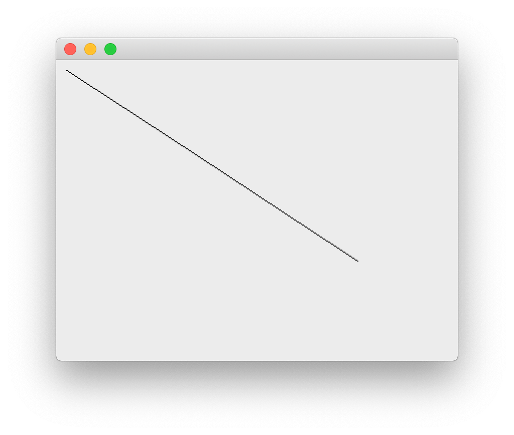
*画布上的一条黑线。*

所有的绘制都发生在`draw_something`方法中——我们创建一个`QPainter`实例，传入画布(`self.label.pixmap()`)，然后发出一个绘制线条的命令。最后，我们调用`.end()`来关闭painter并应用更改。

通常您还需要调用`.update()`来触发控件的刷新，但由于我们在应用程序窗口显示之前进行绘制，刷新无论如何都会发生。

### 绘制基本图形

`QPainter`提供了大量的方法用于在位图表面上绘制形状和线条（在Qt 5.12中有192个`QPainter`特有的非事件方法）。好消息是，这些方法中的大多数都是重载方法，它们只是调用相同基础方法的不同方式。

例如，有5个不同的`drawLine`方法，它们都绘制相同的线条，但不同之处在于如何定义要绘制的坐标。

| 方法 | 描述 |
| :--- | :--- |
| `drawLine(line)` | 绘制一个`QLine`实例 |
| `drawLine(lineF)` | 绘制一个`QLineF`实例 |
| `drawLine(x1, y1, x2, y2)` | 在x1, y1和x2, y2之间绘制一条线 (`int`) |
| `drawLine(p1, p2)` | 在p1和p2之间绘制一条线 (都是`QPoint`) |
| `drawLine(p1F, p2F)` | 在p1和p2之间绘制一条线 (都是`QPointF`) |

如果您想知道`QLine`和`QLineF`之间的区别，后者的坐标是以`float`类型指定的。如果您有作为其他计算结果的浮点数位置，这很方便，否则就不是那么有用了。

忽略F变体，我们有3种独特的方式来绘制一条线——使用一个线对象、使用两组坐标`(x1, y1), (x2, y2)`或使用两个`QPoint`对象。当您发现`QLine`本身被定义为`QLine(const QPoint & p1, const QPoint & p2)`或`QLine(int x1, int y1, int x2, int y2)`时，您会看到它们实际上是完全相同的东西。不同的调用签名只是为了方便而存在。

给定x1, y1, x2, y2坐标，两个`QPoint`对象将被定义为`QPoint(x1, y1)`和`QPoint(x2, y2)`。

去掉重复的，我们有以下绘制操作——`drawArc`, `drawChord`, `drawConvexPolygon`, `drawEllipse`,`drawLine`, `drawPath`, `drawPie`, `drawPoint`, `drawPolygon`, `drawPolyline`, `drawRect`, `drawRects`和`drawRoundedRect`。为了避免不知所措，我们首先关注基本的形状和线条，一旦我们掌握了基础知识，再回到更复杂的操作。

对于每个示例，替换您存根应用程序中的`draw_something`方法并重新运行它以查看输出。

#### drawPoint

这会在画布上的给定点绘制一个点，或*像素*。每次调用`drawPoint`都会绘制一个像素。将您的`draw_something`代码替换为以下内容。

```python
    def draw_something(self):
        canvas = self.label.pixmap()
        painter = QtGui.QPainter(canvas)
        painter.drawPoint(200, 150)
        painter.end()
        self.label.setPixmap(canvas)
```

如果您重新运行该文件，您会看到一个窗口，但这次中间有一个黑色的单点。您可能需要移动窗口才能发现它。

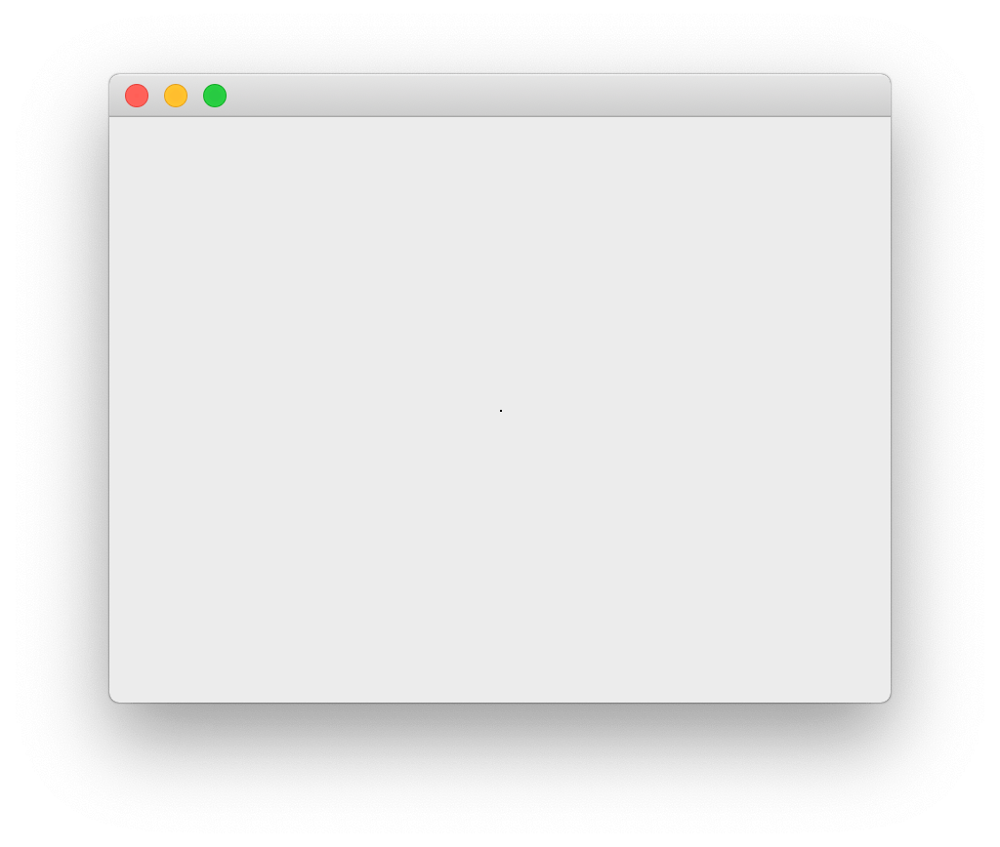
*使用QPainter绘制一个单点（像素）*

这实在没什么可看的。为了让事情更有趣，我们可以改变我们正在绘制的点的颜色和大小。在PyQt中，线条的颜色和粗细是使用QPainter上的活动*画笔*（pen）来定义的。您可以通过创建一个`QPen`实例并应用它来设置。

```python
    def draw_something(self):
        canvas = self.label.pixmap()
        painter = QtGui.QPainter(canvas)
        pen = QtGui.QPen()
        pen.setWidth(40)
        pen.setColor(QtGui.QColor('red'))
        painter.setPen(pen)
        painter.drawPoint(200, 150)
        painter.end()
        self.label.setPixmap(canvas)
```

这将产生以下稍微更有趣的结果……

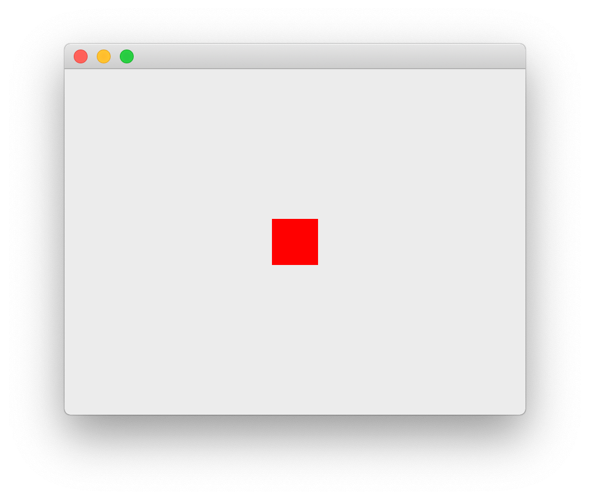
*一个大的红点。*

您可以在`QPainter`*结束*之前自由地执行多个绘制操作。在画布上绘制非常快——在这里我们随机绘制了1万个点。

```python
from random import randint  # 在文件顶部添加此导入。

# ... 在 MainWindow 类中 ...
    def draw_something(self):
        canvas = self.label.pixmap()
        painter = QtGui.QPainter(canvas)
        pen = QtGui.QPen()
        pen.setWidth(3)
        painter.setPen(pen)

        for n in range(10000):
            painter.drawPoint(
                200+randint(-100, 100),  # x
                150+randint(-100, 100)   # y
                )
        painter.end()
        self.label.setPixmap(canvas)
```

这些点是3像素宽的黑色（默认画笔）。

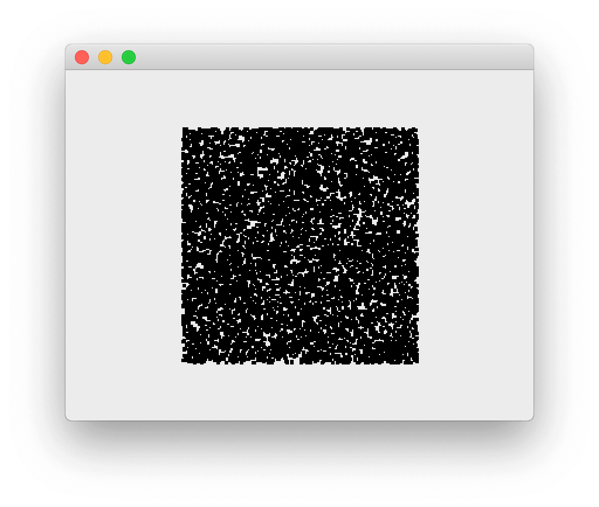
*画布上的1万个3像素宽的点*

在绘制时，您通常会希望更新当前的画笔——例如，在保持其他特性（如宽度）不变的情况下，以不同颜色绘制多个点。为了在每次都不重新创建一个新的`QPen`实例的情况下做到这一点，您可以使用`pen = painter.pen()`从`QPainter`获取当前活动的画笔。您也可以多次重新应用一个已有的画笔，每次都对其进行更改。

```python
from random import randint, choice # 在文件顶部添加此导入。

# ... 在 MainWindow 类中 ...
    def draw_something(self):
        colors = ['#FFD141', '#376F9F', '#0D1F2D', '#E9EBEF', '#EB5160']

        canvas = self.label.pixmap()
        painter = QtGui.QPainter(canvas)
        pen = QtGui.QPen()
        pen.setWidth(3)
        painter.setPen(pen)

        for n in range(10000):
            # pen = painter.pen() 您可以在这里获取活动的画笔
            pen.setColor(QtGui.QColor(choice(colors)))
            painter.setPen(pen)
            painter.drawPoint(
                200+randint(-100, 100),  # x
                150+randint(-100, 100)   # y
                )
        painter.end()
        self.label.setPixmap(canvas)
```

将产生以下输出——

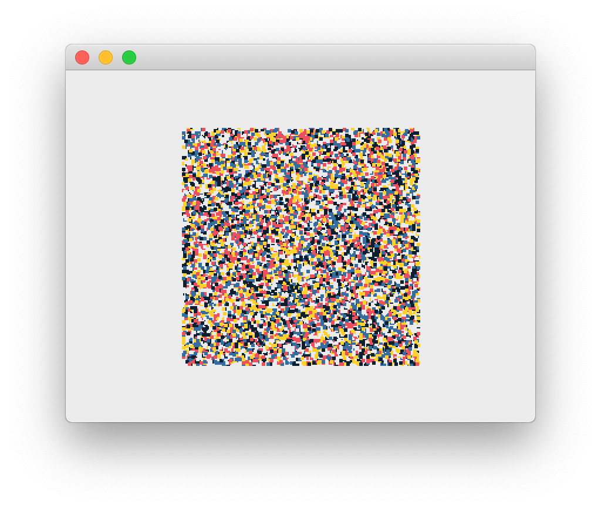
*3像素宽点的随机图案*

在`QPainter`上永远只能有一个活动的`QPen`——即当前画笔。

关于在屏幕上画点，能带来的乐趣也就这么多了，所以我们继续看看其他一些绘制操作。

#### drawLine

我们一开始已经在画布上画了一条线来测试是否一切正常。但我们没有尝试设置画笔来控制线条的外观。

```python
    def draw_something(self):
        canvas = self.label.pixmap()
        painter = QtGui.QPainter(canvas)
        pen = QtGui.QPen()
        pen.setWidth(15)
        pen.setColor(QtGui.QColor('blue'))
        painter.setPen(pen)
        painter.drawLine(
            QtCore.QPoint(100, 100),
            QtCore.QPoint(300, 200)
        )
        painter.end()
        self.label.setPixmap(canvas)
```

在这个例子中，我们还使用`QPoint`来定义要用线连接的两个点，而不是传递单独的`x1, y1, x2, y2`参数——请记住，这两种方法在功能上是相同的。

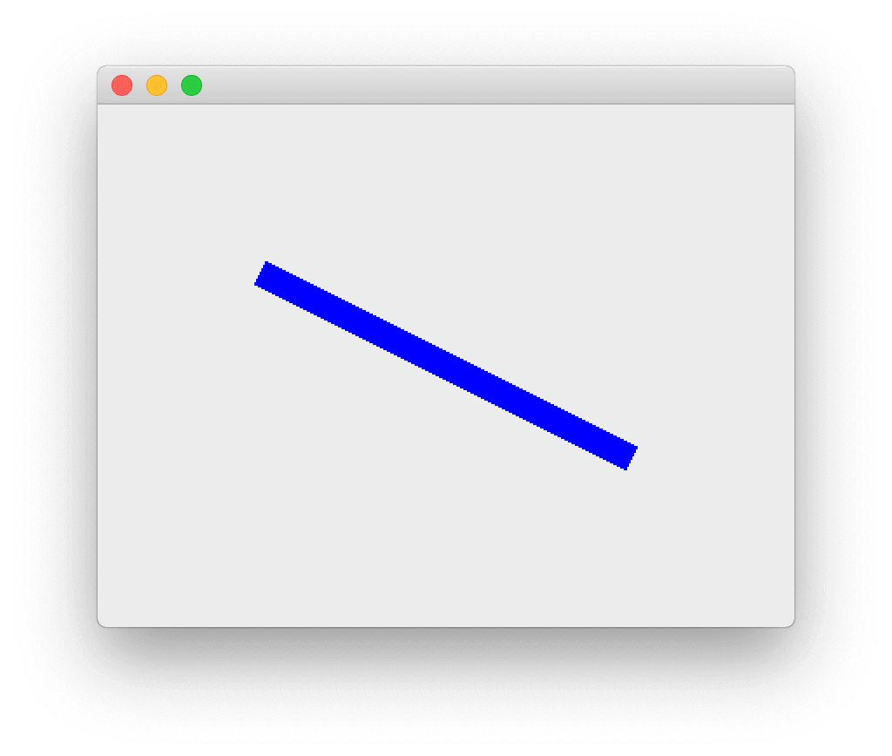
*一条粗的蓝线*

#### drawRect, drawRects 和 drawRoundedRect

这些函数都绘制矩形，由`x`, `y`坐标和矩形的`width`和`height`定义，或者由提供等效信息的`QRect`或`QRectF`实例定义。

```python
    def draw_something(self):
        canvas = self.label.pixmap()
        painter = QtGui.QPainter(canvas)
        pen = QtGui.QPen()
        pen.setWidth(3)
        pen.setColor(QtGui.QColor("#EB5160"))
        painter.setPen(pen)
        painter.drawRect(50, 50, 100, 100)
        painter.drawRect(60, 60, 150, 100)
        painter.drawRect(70, 70, 100, 150)
        painter.drawRect(80, 80, 150, 100)
        painter.drawRect(90, 90, 100, 150)
        painter.end()
        self.label.setPixmap(canvas)
```

正方形只是一个宽度和高度相同的矩形。

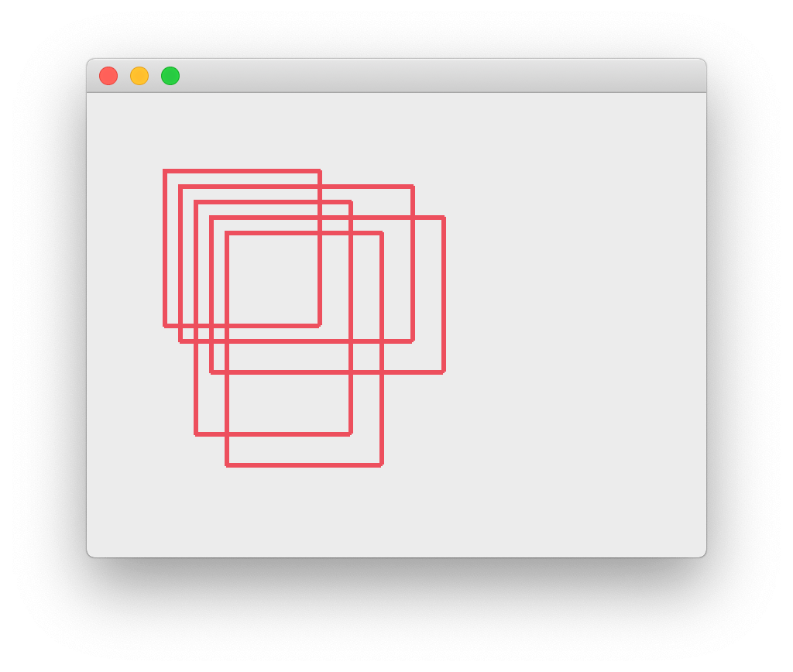
*绘制矩形*

您也可以用一个对`drawRects`的调用来替换多个对`drawRect`的调用，并传入多个`QRect`对象。这将产生完全相同的结果。

```python
painter.drawRects([
    QtCore.QRect(50, 50, 100, 100),
    QtCore.QRect(60, 60, 150, 100),
    QtCore.QRect(70, 70, 100, 150),
    QtCore.QRect(80, 80, 150, 100),
    QtCore.QRect(90, 90, 100, 150),
])
```

在PyQt中，通过设置当前活动的painter的*画刷*（brush），并将一个`QBrush`实例传递给`painter.setBrush()`，可以填充绘制的形状。下面的例子用一种带图案的黄色填充了所有矩形。

```python
    def draw_something(self):
        canvas = self.label.pixmap()
        painter = QtGui.QPainter(canvas)
        pen = QtGui.QPen()
        pen.setWidth(3)
        pen.setColor(QtGui.QColor("#376F9F"))
        painter.setPen(pen)

        brush = QtGui.QBrush()
        brush.setColor(QtGui.QColor("#FFD141"))
        brush.setStyle(Qt.BrushStyle.Dense1Pattern)
        painter.setBrush(brush)

        painter.drawRects([
            QtCore.QRect(50, 50, 100, 100),
            QtCore.QRect(60, 60, 150, 100),
            QtCore.QRect(70, 70, 100, 150),
            QtCore.QRect(80, 80, 150, 100),
            QtCore.QRect(90, 90, 100, 150),
        ])
        painter.end()
        self.label.setPixmap(canvas)```

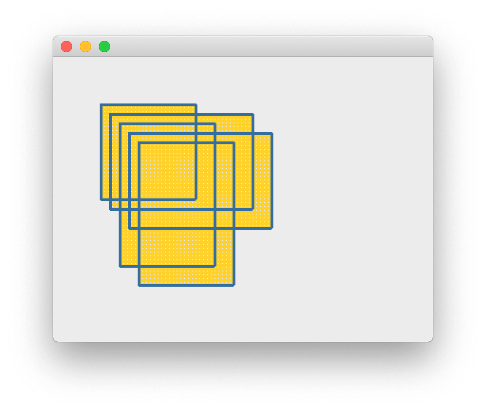
*填充的矩形*

和画笔一样，在给定的painter上永远只有一个活动的画刷，但您可以在绘制时在它们之间切换或更改它们。有[多种可用的画刷样式图案](https://doc.qt.io/qt-5/qt.html#BrushStyle-enum)。不过，您可能会比任何其他样式更多地使用`Qt.SolidPattern`。

您*必须*设置一个样式才能看到任何填充，因为默认是`Qt.NoBrush`。

`drawRoundedRect`方法绘制一个矩形，但带有圆角，因此需要两个额外的参数，用于角的x和y*半径*。

```python
    def draw_something(self):
        canvas = self.label.pixmap()
        painter = QtGui.QPainter(canvas)
        pen = QtGui.QPen()
        pen.setWidth(3)
        pen.setColor(QtGui.QColor("#376F9F"))
        painter.setPen(pen)
        painter.drawRoundedRect(40, 40, 100, 100, 10, 10)
        painter.drawRoundedRect(80, 80, 100, 100, 10, 50)
        painter.drawRoundedRect(120, 120, 100, 100, 50, 10)
        painter.drawRoundedRect(160, 160, 100, 100, 50, 50)
        painter.end()
        self.label.setPixmap(canvas)
```

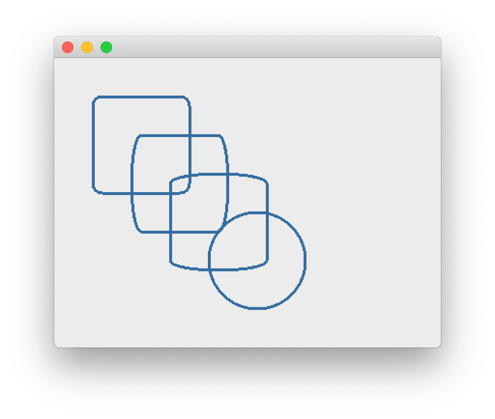
*圆角矩形。*

还有一个可选的最后一个参数，用于切换角的x和y椭圆半径是以绝对像素单位定义（`Qt.AbsoluteSize`，默认值）还是相对于矩形的大小（作为0…100的值传入）。传入`Qt.RelativeSize`以启用此功能。

#### drawEllipse

我们现在要看的最后一个基本绘制方法是`drawEllipse`，它可以用来绘制一个*椭圆*或一个*圆形*。

圆形只是一个宽度和高度相等的椭圆。

```python
    def draw_something(self):
        canvas = self.label.pixmap()
        painter = QtGui.QPainter(canvas)
        pen = QtGui.QPen()
        pen.setWidth(3)
        pen.setColor(QtGui.QColor(204,0,0))  # r, g, b
        painter.setPen(pen)

        painter.drawEllipse(10, 10, 100, 100)
        painter.drawEllipse(10, 10, 150, 200)
        painter.drawEllipse(10, 10, 200, 300)
        painter.end()
        self.label.setPixmap(canvas)
```

在这个例子中，`drawEllipse`接收4个参数，前两个是椭圆将被绘制于其中的*矩形的左上角*的x和y位置，而后两个参数分别是该矩形的宽度和高度。

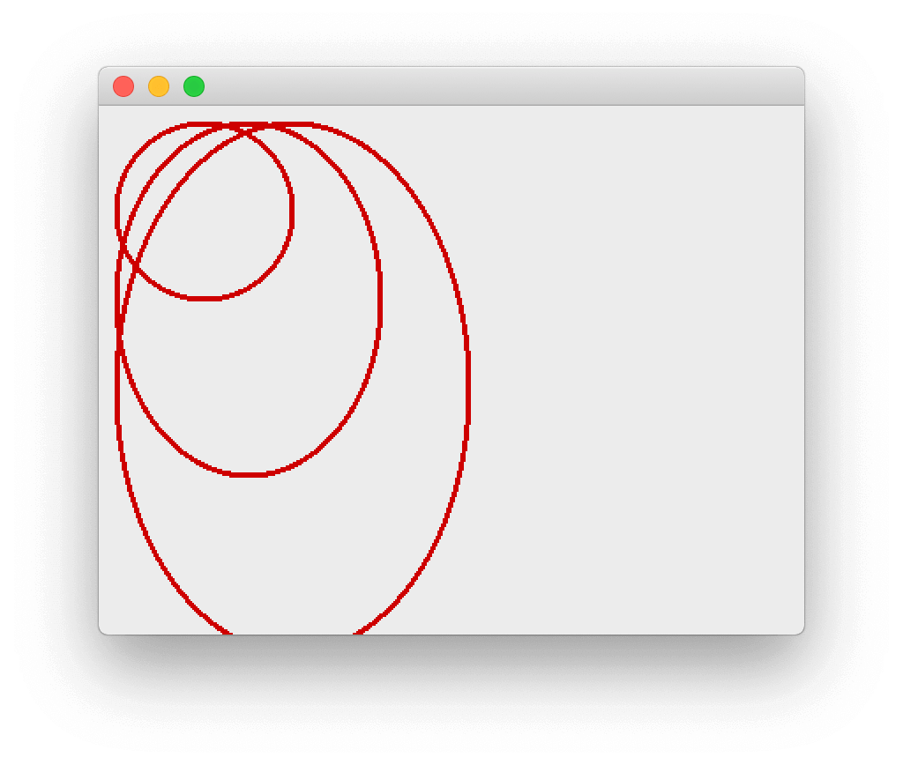
*使用x, y, 宽度, 高度或QRect绘制一个椭圆。*

您可以通过传入一个`QRect`来达到同样的效果。

还有另一种调用签名，它将*椭圆的中心*作为第一个参数，以`QPoint`或`QPointF`对象的形式提供，然后是一个x和y*半径*。下面的例子展示了它的实际应用。

```python
        painter.drawEllipse(QtCore.QPoint(100, 100), 10, 10)
        painter.drawEllipse(QtCore.QPoint(100, 100), 15, 20)
        painter.drawEllipse(QtCore.QPoint(100, 100), 20, 30)
        painter.drawEllipse(QtCore.QPoint(100, 100), 25, 40)
        painter.drawEllipse(QtCore.QPoint(100, 100), 30, 50)
        painter.drawEllipse(QtCore.QPoint(100, 100), 35, 60)
```

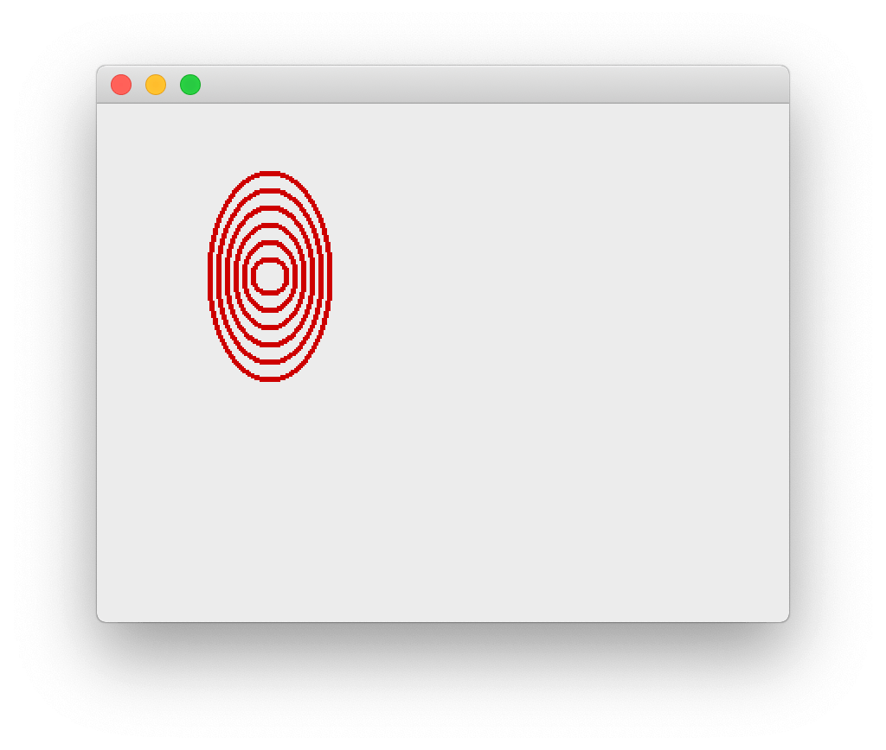
*使用点和半径绘制一个椭圆。*

您可以通过设置`QBrush`来填充椭圆，就像填充矩形一样，样式和颜色的功能都是可用的。

#### 文本

最后，我们简要地看一下`QPainter`的文本绘制方法。要控制`QPainter`上的当前字体，您可以使用`setFont`并传入一个`QFont`实例。通过这个，您可以控制您书写的文本的字体族、粗细和大小（以及其他属性）。然而，文本的颜色仍然是使用当前画笔定义的。

```python
    def draw_something(self):
        canvas = self.label.pixmap()
        painter = QtGui.QPainter(canvas)
        pen = QtGui.QPen()
        pen.setWidth(1)
        pen.setColor(QtGui.QColor('green'))
        painter.setPen(pen)

        font = QtGui.QFont()
        font.setFamily('Times')
        font.setBold(True)
        font.setPointSize(40)
        painter.setFont(font)

        painter.drawText(100, 100, 'Hello, world!')
        painter.end()
        self.label.setPixmap(canvas)```

您也可以用`QPoint`或`QPointF`指定位置。

画笔的宽度对文本的外观没有影响。

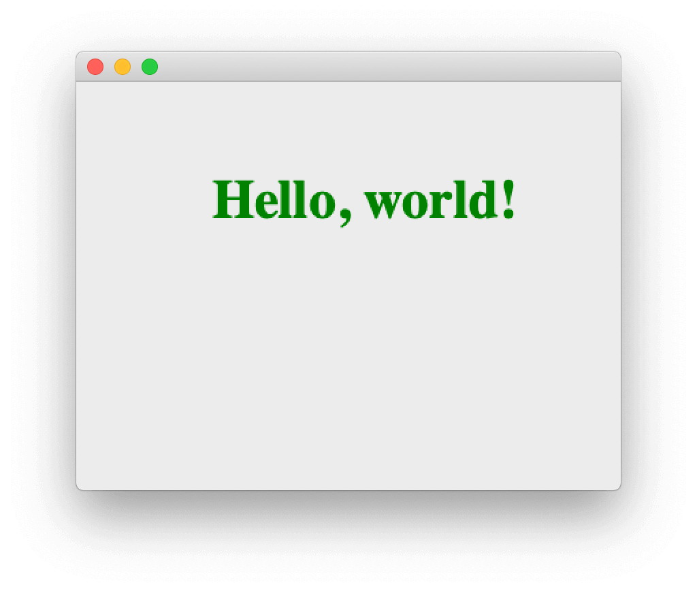
*位图文本“你好，世界”示例。*

还有一些方法用于在指定区域内绘制文本。这里的参数定义了边界框的x和y位置以及宽度和高度。超出此框的文本将被裁剪（隐藏）。第五个参数*flags*可用于控制框内文本的对齐以及其他事项。

```python
painter.drawText(100, 100, 100, 100, Qt.AlignmentFlag.AlignHCenter, 'Hello, world!')
```

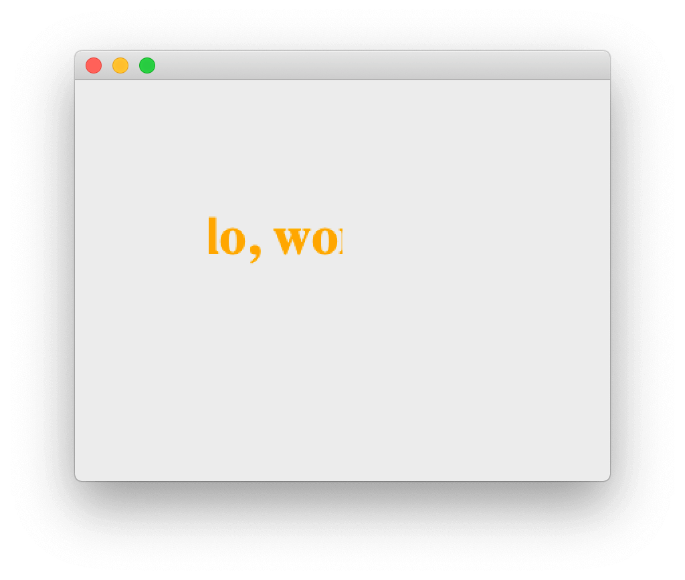
*drawText上裁剪的边界框。*

通过在painter上设置活动字体（通过`QFont`对象），您可以完全控制文本的显示。有关更多信息，请查看[QFont文档](https://doc.qt.io/archives/qt-4.8/qfont.html)。

### QPainter 的一点乐趣

内容有点沉重了，让我们休息一下，做点有趣的事情。到目前为止，我们一直在以编程方式定义要执行的绘制操作。但我们同样可以响应用户输入进行绘制——例如，允许用户在画布上随意涂鸦。在这一部分，我们将利用目前所学到的知识来构建一个基本的绘图应用。

我们可以从同样简单的应用程序大纲开始，在`MainWindow`类中添加一个`mouseMoveEvent`处理程序来代替我们的绘制方法。在这里，我们将获取用户鼠标的当前位置，并在画布上绘制一个点。

```python
import sys
from PySide6 import QtCore, QtGui, QtWidgets
from PySide6.QtCore import Qt


class MainWindow(QtWidgets.QMainWindow):
    def __init__(self):
        super().__init__()
        self.label = QtWidgets.QLabel()
        canvas = QtGui.QPixmap(400, 300)
        canvas.fill(Qt.GlobalColor.white)
        self.label.setPixmap(canvas)
        self.setCentralWidget(self.label)

    def mouseMoveEvent(self, e):
        canvas = self.label.pixmap()
        painter = QtGui.QPainter(canvas)
        # QMouseEvent.pos() 返回一个 QPoint，但 QPainter.drawPoint()
        # 可以直接使用它，或者你也可以用 e.position().x() 和 e.position().y()
        painter.drawPoint(e.position().toPoint())
        painter.end()
        self.label.setPixmap(canvas)


app = QtWidgets.QApplication(sys.argv)
window = MainWindow()
window.show()
app.exec()
```

**为什么没有点击事件？** 默认情况下，控件只有在按下鼠标按钮时才会接收鼠标移动事件，除非启用了*鼠标跟踪*。这可以使用`.setMouseTracking`方法进行配置——将其设置为`True`（默认为`False`）将持续跟踪鼠标。

如果您保存并运行此代码，您应该能够将鼠标移动到屏幕上并点击以绘制单个点。它应该看起来像这样——

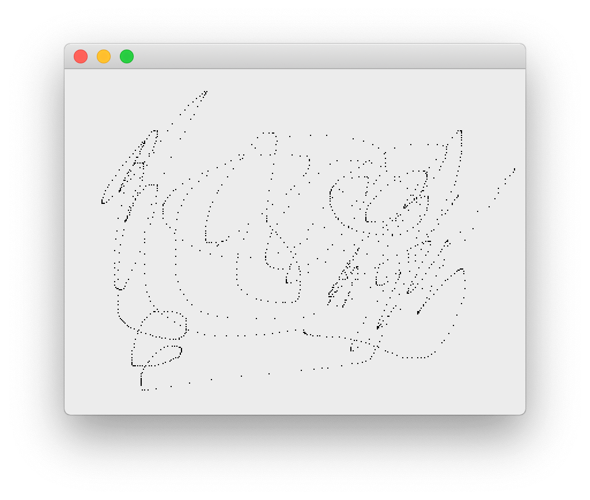
*绘制单个mouseMoveEvent点。*

这里的问题是，当您快速移动鼠标时，它实际上是在屏幕上的位置之间跳跃，而不是从一个地方平滑地移动到另一个地方。`mouseMoveEvent`会为鼠标所在的每个位置触发，但这不足以绘制一条连续的线，除非您移动得*非常慢*。

解决这个问题的方法是绘制*线条*而不是*点*。在每个事件中，我们只需从我们之前的位置（上一个`e.position().x()`和`e.position().y()`）绘制一条线到我们现在的位置（当前的`e.position().x()`和`e.position().y()`）。我们可以通过自己跟踪`last_x`和`last_y`来做到这一点。

我们还需要在释放鼠标时*忘记*最后一个位置，否则在将鼠标移动到页面上后，我们会再次从那个位置开始绘制——也就是说，我们无法断开线条。

```python
import sys
from PySide6 import QtCore, QtGui, QtWidgets
from PySide6.QtCore import Qt


class MainWindow(QtWidgets.QMainWindow):
    def __init__(self):
        super().__init__()
        self.label = QtWidgets.QLabel()
        canvas = QtGui.QPixmap(400, 300)
        canvas.fill(Qt.GlobalColor.white)
        self.label.setPixmap(canvas)
        self.setCentralWidget(self.label)
        self.last_x, self.last_y = None, None

    def mouseMoveEvent(self, e):
        if self.last_x is None: # 第一个事件。
            self.last_x = e.position().x()
            self.last_y = e.position().y()
            return # 第一次忽略。

        canvas = self.label.pixmap()
        painter = QtGui.QPainter(canvas)
        painter.drawLine(self.last_x, self.last_y, e.position().x(), e.position().y())
        painter.end()
        self.label.setPixmap(canvas)

        # 更新下一次的原点。
        self.last_x = e.position().x()
        self.last_y = e.position().y()

    def mouseReleaseEvent(self, e):
        self.last_x = None
        self.last_y = None


app = QtWidgets.QApplication(sys.argv)
window = MainWindow()
window.show()
app.exec()
```

如果您运行这个程序，您应该能够像您期望的那样在屏幕上涂鸦。

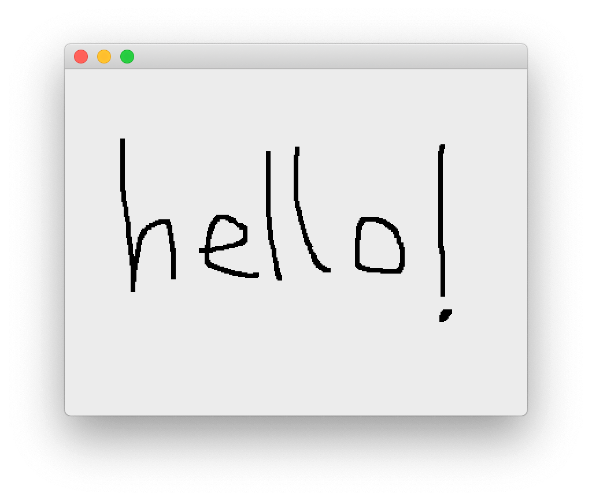
*用鼠标绘制，使用连续的线条。*

它仍然有点单调，所以让我们添加一个简单的调色板，让我们能够改变画笔的颜色。

这需要一些重新架构。到目前为止，我们一直在`QMainWindow`上使用`mouseMoveEvent`。当窗口中只有一个控件时，这没问题——只要您不将窗口调整得比控件大（您试过吗？），容器和单个嵌套控件的坐标就会对齐。然而，如果我们向布局中添加其他控件，这将不再成立——`QLabel`的坐标将与窗口有偏移，我们将在错误的位置进行绘制。

这很容易通过将鼠标处理移到`QLabel`本身来解决——它的事件坐标总是相对于自身的。我们将此封装成一个自定义的`Canvas`对象，它负责创建pixmap表面、设置x和y位置以及持有当前的画笔颜色（默认为黑色）。

这个自包含的`Canvas`是一个可以放入您自己应用中的可绘制表面。

```python
import sys
from PySide6 import QtCore, QtGui, QtWidgets
from PySide6.QtCore import Qt


class Canvas(QtWidgets.QLabel):
    def __init__(self):
        super().__init__()
        pixmap = QtGui.QPixmap(600, 300)
        pixmap.fill(Qt.GlobalColor.white)
        self.setPixmap(pixmap)
        self.last_x, self.last_y = None, None
        self.pen_color = QtGui.QColor('#000000')

    def set_pen_color(self, c):
        self.pen_color = QtGui.QColor(c)

    def mouseMoveEvent(self, e):
        if self.last_x is None: # 第一个事件。
            self.last_x = e.position().x()
            self.last_y = e.position().y()
            return # 第一次忽略。

        canvas = self.pixmap()
        painter = QtGui.QPainter(canvas)
        p = painter.pen()
        p.setWidth(4)
        p.setColor(self.pen_color)
        painter.setPen(p)
        painter.drawLine(self.last_x, self.last_y, e.position().x(), e.position().y())
        painter.end()
        self.setPixmap(canvas)

        # 更新下一次的原点。
        self.last_x = e.position().x()
        self.last_y = e.position().y()

    def mouseReleaseEvent(self, e):
        self.last_x = None
        self.last_y = None
```

对于颜色选择，我们将构建一个基于`QPushButton`的自定义控件。这个控件接受一个`color`参数，它可以是`QColor`实例、颜色名称（'red', 'black'）或十六进制值。这个颜色被设置在控件的背景上，使其易于识别。我们可以使用标准的`QPushButton.pressed`信号将其连接到任何操作。

```python
COLORS = [
    '#000000', '#141923', '#414168', '#3a7fa7', '#35e3e3', '#8fd970', '#5ebb49',
    '#458352', '#dcd37b', '#fffee5', '#ffd035', '#cc9245', '#a15c3e', '#a42f3b',
    '#f45b7a', '#c24998', '#81588d', '#bcb0c2', '#ffffff',
]


class QPaletteButton(QtWidgets.QPushButton):
    def __init__(self, color):
        super().__init__()
        self.setFixedSize(QtCore.QSize(24,24))
        self.color = color
        self.setStyleSheet("background-color: %s;" % color)
```

定义了这两个新部分后，我们只需遍历我们的颜色列表，创建一个`QPaletteButton`并传入颜色，将其pressed信号连接到画布上的`set_pen_color`处理程序（通过一个`lambda`间接传递额外的颜色数据），然后将其添加到调色板布局中。

```python
class MainWindow(QtWidgets.QMainWindow):
    def __init__(self):
        super().__init__()
        self.canvas = Canvas()
        w = QtWidgets.QWidget()
        l = QtWidgets.QVBoxLayout()
        w.setLayout(l)
        l.addWidget(self.canvas)
        palette = QtWidgets.QHBoxLayout()
        self.add_palette_buttons(palette)
        l.addLayout(palette)
        self.setCentralWidget(w)

    def add_palette_buttons(self, layout):
        for c in COLORS:
            b = QPaletteButton(c)
            b.pressed.connect(lambda c=c: self.canvas.set_pen_color(c))
            layout.addWidget(b)

# ... （Canvas 和 QPaletteButton 类的定义需要放在 MainWindow 之前）
# ... （app 的创建和执行代码）
```

这应该会给您一个功能齐全的多色绘图应用程序，您可以在画布上画线并从调色板中选择颜色。

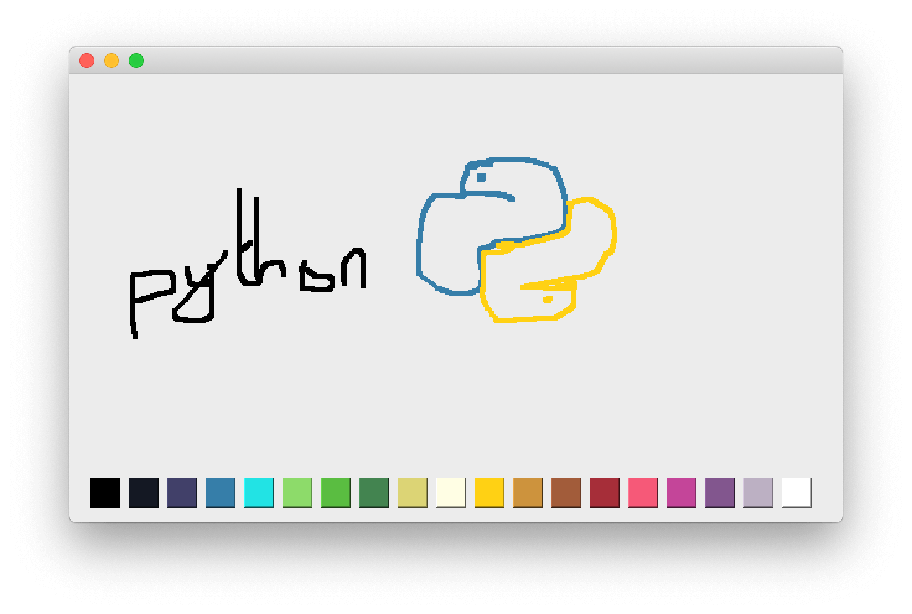
*不幸的是，它不会让你成为一个好画家。*

#### 喷漆

作为最后的乐趣，您可以将`mouseMoveEvent`替换为以下代码，以“喷漆罐”效果代替线条进行绘制。这是通过使用`random.gauss`在当前鼠标位置周围生成一系列*正态分布*的点来模拟的，我们用`drawPoint`来绘制这些点。

```python
import random # 确保导入

# ... 在 Canvas 类中 ...
    def mouseMoveEvent(self, e):
        canvas = self.pixmap()
        painter = QtGui.QPainter(canvas)
        p = painter.pen()
        p.setWidth(1)
        p.setColor(self.pen_color)
        painter.setPen(p)

        for n in range(SPRAY_PARTICLES):
            xo = random.gauss(0, SPRAY_DIAMETER)
            yo = random.gauss(0, SPRAY_DIAMETER)
            painter.drawPoint(e.position().x() + xo, e.position().y() + yo)
        
        # end() 最好在循环外调用，但为了实时反馈，每次移动都更新
        painter.end()
        self.setPixmap(canvas)
```

在您的文件顶部定义`SPRAY_PARTICLES`和`SPRAY_DIAMETER`变量，并导入`random`标准库模块。下图显示了使用以下设置时的喷漆行为：

```python
import random

SPRAY_PARTICLES = 100
SPRAY_DIAMETER = 10
```

对于喷漆罐，我们不需要跟踪前一个位置，因为我们总是在当前点周围喷漆。

如果您想要一个挑战，您可以尝试添加一个额外的按钮来在绘制和喷漆模式之间切换，或者添加一个输入来定义画笔/喷漆的直径。

这个介绍应该让您对`QPainter`能做什么有了一个很好的了解。如前所述，这个系统是所有控件绘制的基础。如果您想进一步了解，请查看控件的`.paintEvent()`方法，它接收一个`QPainter`实例，以允许控件在自身上绘制。您在这里学到的同样的方法可以在`.paintEvent()`中用来绘制一些基本的自定义控件。我们将在下一个教程中对此进行扩展。