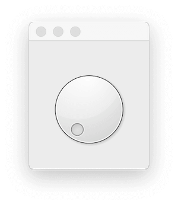
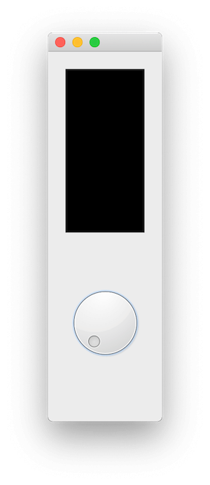
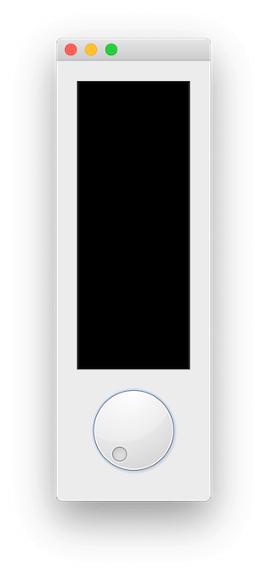
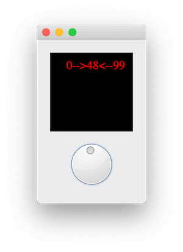
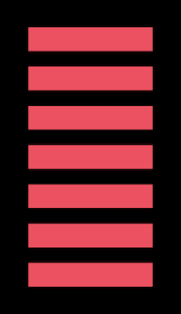
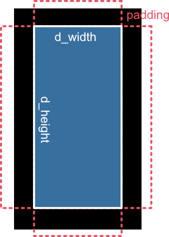
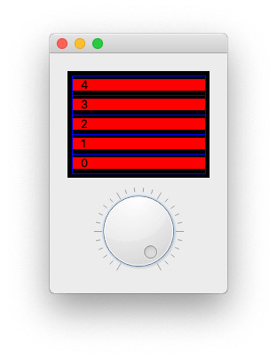
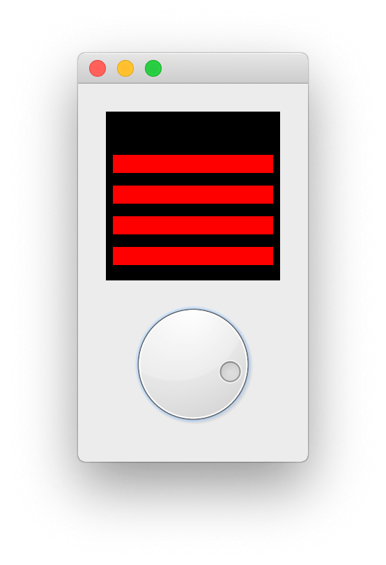
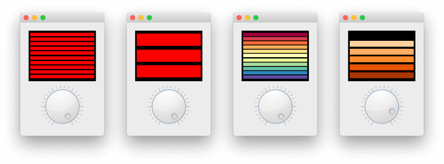
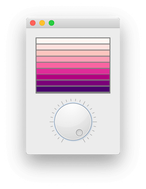

在[上一篇教程](https://www.pythonguis.com/tutorials/pyside-bitmap-graphics/)中，我们介绍了 `QPainter` 并了解了一些基本的位图绘制操作，您可以用它在 `QPainter` 的*画布*（例如 `QPixmap`）上绘制点、线、矩形和圆形。

用 `QPainter` *在画布上绘图*的这个过程，实际上是 Qt 中所有控件绘制的基础。既然您知道了如何使用 `QPainter`，您也就知道了如何绘制自己的自定义控件！

在本文中，我们将运用目前所学的知识，构建一个全新的*自定义* GUI 控件。作为一个实践案例，我们将构建下面这个控件——一个带有旋钮控制的可定制能量条（PowerBar）。


这个控件实际上是一个*复合控件*（compound widget）和*自定义绘制控件*（custom widget）的混合体，因为我们使用 Qt 内置的 `QDial` 组件作为旋钮，而能量条部分则由我们自己绘制。然后，我们将这两个部分组合到一个父控件中，它可以无缝地放置在任何应用程序中，而无需关心其内部是如何组装的。最终的控件提供了通用的 `QAbstractSlider` 接口，并增加了一些用于配置能量条显示的附加功能。

学习完这个例子后，您将能够制作属于您自己的自定义 GUI 控件——无论是组合内置控件还是完全从头绘制全新的控件。

### 入门

正如我们之前所见，复合控件其实就是应用了布局的控件，其内部包含一个以上的其他控件。这样得到的“控件”可以像其他任何控件一样使用，其内部实现可以根据需要进行隐藏或暴露。

下面给出了我们 _PowerBar_ 控件的框架代码——我们将从这个基础框架开始逐步构建我们的自定义控件。请将其保存为 `power_bar.py` 文件。

python
```python
from PySide6 import QtCore, QtGui, QtWidgets
from PySide6.QtCore import Qt


class _Bar(QtWidgets.QWidget):
    pass

class PowerBar(QtWidgets.QWidget):
    """
    自定义 Qt 控件，用于显示能量条和旋钮。
    演示复合控件和自定义绘制控件。
    """

    def __init__(self, steps=5, *args, **kwargs):
        super().__init__(*args, **kwargs)

        layout = QtWidgets.QVBoxLayout()
        self._bar = _Bar()
        layout.addWidget(self._bar)

        self._dial = QtWidgets.QDial()
        layout.addWidget(self._dial)

        self.setLayout(layout)
```

这段代码很简单，它将我们的自定义能量条定义在 `_Bar` 对象中——这里它只是一个未作任何修改的 `QWidget` 子类。而 `PowerBar` 控件（完整的控件）则使用 `QVBoxLayout` 布局将 `_Bar` 和内置的 `QDial` 组合在一起，使它们一同显示。

我们还需要一个小小的演示程序来显示这个控件。

python
```python
import sys
from PySide6 import QtCore, QtGui, QtWidgets
from power_bar import PowerBar


app = QtWidgets.QApplication(sys.argv)
volume = PowerBar()
volume.show()
app.exec()
```

我们不需要创建 `QMainWindow`，因为任何没有父对象的控件本身就是一个窗口。我们的自定义 `PowerBar` 控件会像一个普通窗口一样出现。

这就是您所需要的全部代码，只需将其保存在与前一个文件相同的文件夹下，命名为 `demo.py` 之类的即可。您可以随时运行这个文件来查看您的控件效果。现在运行它，您应该会看到类似下面的样子：


*我们的控件，一个 QDial，它上面有一个看不见的空控件（相信我）。*

如果您向下拖拽窗口，您会发现旋钮上方的空间比下方多——这部分空间被我们（目前看不见的）`_Bar` 控件占用了。

### paintEvent

`paintEvent` 事件处理器是 PySide 中所有控件绘制的核心。

控件的每一次完整或部分的重绘都是通过一个 `paintEvent` 事件来触发，控件处理该事件来绘制自身。一个 `paintEvent` 事件可能由以下原因触发：

*   调用了 [repaint()](https://doc.qt.io/qt-5/qwidget.html#repaint)() 或 [update](https://doc.qt.io/qt-5/qwidget.html#update)()
*   控件之前被遮挡，现在又重新显示出来
*   控件被调整了大小

——但它也可能因为许多其他原因而发生。重要的是，当 `paintEvent` 被触发时，您的控件必须能够重新绘制自己。

如果一个控件足够简单（就像我们这个一样），通常在*任何*事情发生时都重绘整个控件就足够了。但对于更复杂的控件，这样做效率会很低。对于这些情况，`paintEvent` 会包含需要更新的具体区域。我们将在后续更复杂的例子中利用这一点。

现在，我们先做一个非常简单的事情，就是用单一颜色填充整个控件。这将让我们看到我们正在操作的区域，以便开始绘制能量条。将以下代码添加到 `_Bar` 类中。

python
```python
    def paintEvent(self, e):
        painter = QtGui.QPainter(self)
        brush = QtGui.QBrush()
        brush.setColor(QtGui.QColor('black'))
        brush.setStyle(Qt.SolidPattern)
        rect = QtCore.QRect(0, 0, painter.device().width(), painter.device().height())
        painter.fillRect(rect, brush)
```

使用我们在上一部分介绍的绘制指令，您可以完全自定义控件的样式、外观和感觉。

### 布局与定位

现在我们可以看到 `_Bar` 控件了，接下来可以调整它的位置和大小。如果您拖动窗口的形状，您会看到两个控件都在改变形状以适应可用空间。这正是我们想要的，但是 `QDial` 在垂直方向上的伸展超出了应有的范围，并留下了本可以用于能量条的空白空间。


*将自定义控件部分填充为黑色。*

我们可以在 `_Bar` 控件上使用 `setSizePolicy` 来确保它尽可能地扩展。通过使用 `QSizePolicy.MinimumExpanding`，其提供的 `sizeHint` 将作为最小尺寸，并且控件会尽可能地扩展。

python
```python
class _Bar(QtWidgets.QWidget):

    def __init__(self, *args, **kwargs):
        super().__init__(*args, **kwargs)

        self.setSizePolicy(
            QtWidgets.QSizePolicy.MinimumExpanding,
            QtWidgets.QSizePolicy.MinimumExpanding
        )

    def sizeHint(self):
        return QtCore.QSize(40,120)
```

这仍然不*完美*，因为 `QDial` 控件的尺寸调整方式有点笨拙，但我们的能量条现在已经可以扩展以填充所有可用空间了。


*设置了 QSizePolicy.MinimumExpanding 的控件。*

定位问题解决后，我们现在可以开始定义绘制方法，在控件的上半部分（目前是黑色的）绘制我们的能量条了。

### 更新显示

我们现在已经将画布完全填充为黑色，接下来我们将使用 `QPainter` 的绘图命令在控件上真正画点东西。

在开始绘制能量条之前，我们需要做一些测试，以确保我们能够根据旋钮的值来更新显示。用下面的代码替换 `_Bar.paintEvent`。

python
```python
    def paintEvent(self, e):
        painter = QtGui.QPainter(self)

        brush = QtGui.QBrush()
        brush.setColor(QtGui.QColor('black'))
        brush.setStyle(Qt.SolidPattern)
        rect = QtCore.QRect(0, 0, painter.device().width(), painter.device().height())
        painter.fillRect(rect, brush)

        # 获取当前状态
        dial = self.parent()._dial
        vmin, vmax = dial.minimum(), dial.maximum()
        value = dial.value()

        pen = painter.pen()
        pen.setColor(QtGui.QColor('red'))
        painter.setPen(pen)

        font = painter.font()
        font.setFamily('Times')
        font.setPointSize(18)
        painter.setFont(font)

        painter.drawText(25, 25, "{}-->{}<--{}".format(vmin, value, vmax))
        painter.end()
```

这段代码像之前一样绘制了黑色背景，然后使用 `.parent()` 访问其父控件 `PowerBar`，并通过它来访问 `QDial`（通过 `_dial`）。从中我们获取了当前值，以及允许的范围最小值和最大值。最后，我们使用 painter 将这些值绘制出来，就像我们在上一部分做的那样。

> **技巧**：这里我们让 `QDial` 来处理当前值、最小值和最大值，但我们也可以自己存储这些值，并使用信号与槽机制来与旋钮保持同步。

运行这段代码，转动旋钮……什么也没发生。尽管我们定义了 `paintEvent` 处理器，但当旋钮值改变时，我们并没有触发重绘。

> **技巧**：您可以通过调整窗口大小来强制刷新，一旦您这么做，您应该就能看到文本出现了。很酷，但用户体验极差——“要想看到设置生效，请调整您的应用窗口大小！”

为了解决这个问题，我们需要将 `_Bar` 控件连接起来，使其在旋钮值变化时重绘自身。我们可以使用 `QDial.valueChanged` 信号来实现这一点，将其连接到一个自定义的槽方法，该方法调用 `.update()` —— 这会触发一次完整的重绘。

将下面的方法添加到 `_Bar` 控件中。

python
```python
    def _trigger_refresh(self):
        self.update()
```

…并将以下代码添加到父控件 `PowerBar` 的 `__init__` 代码块中。

python
```python
self._dial.valueChanged.connect(self._bar._trigger_refresh)
```

如果您现在重新运行代码，您会看到当您转动旋钮（用鼠标点击并拖动）时，显示会自动更新。当前值会以文本形式显示出来。


*以文本形式显示当前的 QDial 值。*

### 绘制能量条

现在我们的显示能够更新并显示旋钮的当前值了，我们可以开始绘制真正的能量条了。这稍微有点复杂，需要一些数学计算来确定能量条的位置，但我们会一步步地讲解，让您清楚地了解整个过程。

下面的草图展示了我们的目标——一系列的 _N_ 个方块，与控件边缘保持一定内边距，并且方块之间有间隙。


*我们这个控件的目标效果。*

#### 计算要绘制的内容

要绘制的方块数量取决于当前值——以及它在 `QDial` 配置的最小值和最大值之间的位置。我们在上面的例子中已经获取了这些信息。

python
```python
dial = self.parent()._dial
vmin, vmax = dial.minimum(), dial.maximum()
value = dial.value()
```

如果 `value` 处于 `vmin` 和 `vmax` 的中间，那么我们希望绘制一半的方块（如果我们总共有 4 个方块，就画 2 个）。如果 `value` 达到了 `vmax`，我们希望把所有方块都画出来。

为此，我们首先将 `value` 转换成一个介于 0 和 1 之间的数字，其中 `0 = vmin`，`1 = vmax`。我们先从 `value` 中减去 `vmin`，将可能的值范围调整为从零开始——即从 `vmin...vmax` 变为 `0…(vmax-vmin)`。然后用这个值除以 `vmax-vmin`（新的最大值），就得到了一个 0 到 1 之间的数字。

接下来的技巧是，将这个值（下面称为 `pc`）乘以总步数，这样就得到了一个 0 到 5 之间的数字——也就是要绘制的方块数量。

python
```python
pc = (value - vmin) / (vmax - vmin)
n_steps_to_draw = int(pc * 5)
```

我们用 `int()` 来包装结果，将其转换为整数（向下取整），以消除任何部分的方块。

更新您 `paintEvent` 中的 `drawText` 方法，让它显示这个数字。

python
```python
pc = (value - vmin) / (vmax - vmin)
n_steps_to_draw = int(pc * 5)
painter.drawText(25, 25, "{}".format(n_steps_to_draw))
```

当您转动旋钮时，现在您会看到一个 0 到 5 之间的数字。

#### 绘制方块

接下来，我们希望将这个 0…5 的数字转换成在画布上绘制的能量条数量。首先移除 `drawText` 以及字体和画笔的设置，因为我们不再需要它们了。

为了精确绘图，我们需要知道画布的大小——也就是控件的大小。我们还会在边缘添加一些内边距（padding），以便在方块边缘和黑色背景之间留出空间。

`QPainter` 中的所有度量单位都是像素。

python
```python
        padding = 5

        # 定义我们的画布
        d_height = painter.device().height() - (padding * 2)
        d_width = painter.device().width() - (padding * 2)
```

我们取高度和宽度，并分别减去 `2 * padding`——乘以 2 是因为我们同时在左侧和右侧（以及顶部和底部）都设置了内边距。这样我们就得到了最终的*活动画布*区域，存储在 `d_height` 和 `d_width` 中。


*控件画布、内边距和内部绘制区域。*

我们需要将 `d_height` 分成 5 个相等的部分，每个部分对应一个方块——我们可以简单地通过 `d_height / 5` 来计算这个高度。此外，由于我们希望方块之间有间隙，我们需要计算这个步长中有多少被间隙占据（顶部和底部，所以要除以2），又有多少是实际的方块。

（*译者注：此处为原网站广告，已省略*）

python
```python
step_size = d_height / 5
bar_height = step_size * 0.6
bar_spacer = step_size * 0.4 / 2
```

有了这些值，我们就可以在画布上绘制方块了。为此，我们使用 `range` 从 0 开始计数到要绘制的步数减 1，然后为每个方块在一个区域上绘制一个 `fillRect`。

python
```python
brush.setColor(QtGui.QColor('red'))

for n in range(5):
    rect = QtCore.QRect(
        padding,
        padding + d_height - ((n+1) * step_size) + bar_spacer,
        d_width,
        bar_height
    )
    painter.fillRect(rect, brush)
```

填充首先设置为红色画刷，但我们稍后会对其进行自定义。

用于 `fillRect` 的方块被定义为一个 `QRect` 对象，我们依次向其传递左侧 x 坐标、顶部 y 坐标、宽度和高度。

*宽度* 是完整的画布宽度减去内边距，我们之前已经计算并存储在 `d_width` 中。*左侧 x 坐标* 同样就是控件左侧的 `padding` 值（5px）。

能量条的*高度* `bar_height` 我们计算为 `step_size` 的 0.6 倍。

这就剩下了第二个参数 `d_height - ((1 + n) * step_size) + bar_spacer`，它给出了要绘制矩形的*顶部 y 坐标*。这是在我们绘制方块时唯一会改变的计算。

这里要记住一个关键事实，即 `QPainter` 中的 *y* 坐标是从顶部开始，向下递增的。这意味着在 `d_height` 处绘图将是在画布的最底部。当我们从一个点开始绘制矩形时，它是从起始位置向*右*和*下*绘制的。

要在最底部绘制一个方块，我们必须从 `d_height-step_size` 开始绘制，即向上一个方块的位置，以便留出向下绘制的空间。

在我们的能量条中，我们是依次从底部开始向上绘制方块。所以我们的第一个方块必须放在 `d_height-step_size` 处，第二个放在 `d_height-(step_size*2)` 处。我们的循环从 0 开始向上迭代，所以我们可以用下面的公式实现这一点：

python
```python
d_height - ((1 + n) * step_size)
```

最后的调整是为了考虑到我们的方块只占据了每个 `step_size` 的一部分（目前是 0.6）。我们添加一点内边距，将方块从其区域的边缘移到中间，最后再加上底部的内边距。这样就得到了最终的公式：

python
```python
padding + d_height - ((n+1) * step_size) + bar_spacer,
```

这将产生以下布局。

在下图中，当前的 `n` 值被打印在方块上，并且一个蓝色的框被画在整个 `step_size` 周围，这样您就可以看到内边距和间隙的效果。


*布局中能量条之间的间距，以及方块的绘制顺序。*

将所有这些整合在一起，我们的 `power_bar.py` 文件中的代码如下所示，运行时会生成一个带有红色方块的可工作的能量条控件。您可以来回拖动旋钮，能量条会随之上下移动。

python
```python
from PySide6 import QtCore, QtGui, QtWidgets
from PySide6.QtCore import Qt

class _Bar(QtWidgets.QWidget):

    def __init__(self, *args, **kwargs):
        super().__init__(*args, **kwargs)

        self.setSizePolicy(
            QtWidgets.QSizePolicy.MinimumExpanding,
            QtWidgets.QSizePolicy.MinimumExpanding
        )

    def sizeHint(self):
        return QtCore.QSize(40,120)

    def paintEvent(self, e):
        painter = QtGui.QPainter(self)

        brush = QtGui.QBrush()
        brush.setColor(QtGui.QColor('black'))
        brush.setStyle(Qt.SolidPattern)
        rect = QtCore.QRect(0, 0, painter.device().width(), painter.device().height())
        painter.fillRect(rect, brush)

        # 获取当前状态
        dial = self.parent()._dial
        vmin, vmax = dial.minimum(), dial.maximum()
        value = dial.value()

        padding = 5

        # 定义我们的画布
        d_height = painter.device().height() - (padding * 2)
        d_width = painter.device().width() - (padding * 2)

        # 绘制能量条
        step_size = d_height / 5
        bar_height = step_size * 0.6
        bar_spacer = step_size * 0.4 / 2

        pc = (value - vmin) / (vmax - vmin)
        n_steps_to_draw = int(pc * 5)
        brush.setColor(QtGui.QColor('red'))
        for n in range(n_steps_to_draw):
            rect = QtCore.QRect(
                padding,
                padding + d_height - ((n+1) * step_size) + bar_spacer,
                d_width,
                bar_height
            )
            painter.fillRect(rect, brush)

        painter.end()

    def _trigger_refresh(self):
        self.update()


class PowerBar(QtWidgets.QWidget):
    """
    自定义 Qt 控件，用于显示能量条和旋钮。
    演示复合控件和自定义绘制控件。
    """

    def __init__(self, steps=5, *args, **kwargs):
        super().__init__(*args, **kwargs)

        layout = QtWidgets.QVBoxLayout()
        self._bar = _Bar()
        layout.addWidget(self._bar)

        self._dial = QtWidgets.QDial()
        self._dial.valueChanged.connect(
           self._bar._trigger_refresh
        )

        layout.addWidget(self._dial)
        self.setLayout(layout)
```


*一个可工作的单色能量条。*

这已经能用了，但我们可以进一步提供更多的定制化选项，增加一些用户体验改进，并优化我们控件的API。

### 自定义能量条

我们现在有了一个由旋钮控制的可工作的能量条。但在创建控件时，如果能提供选项来配置控件的行为和样式，使其更加灵活，那就更好了。在这一部分，我们将添加方法来设置可定制的段数、颜色、内边距和间距。

我们将提供以下元素的定制化：

| 选项 | 描述 |
| :--- | :--- |
| 能量条数量 | 控件上显示的能量条数量 |
| 颜色 | 每个能量条的独立颜色 |
| 背景色 | 绘制画布的颜色（默认为黑色） |
| 内边距 (padding) | 控件边缘、能量条与画布边缘之间的空间 |
| 能量条高度 / 能量条百分比 | 能量条实体部分所占的比例（0…1）（其余部分将是相邻能量条之间的间距） |

我们可以将这些属性存储在 `_bar` 对象上，并在 `paintEvent` 方法中使用它们来改变其行为。

更新后的 `_Bar.__init__` 方法可以接受一个初始参数，该参数可以是能量条的数量（整数），也可以是能量条的颜色（一个包含 `QColor`、十六进制值或颜色名称的列表）。如果提供的是数字，所有能量条都将是红色的。如果提供的是颜色列表，能量条的数量将由颜色列表的长度决定。同时，也设置了 `self._bar_solid_percent`、`self._background_color` 和 `self._padding` 的默认值。

python
```python
class _Bar(QtWidgets.QWidget):
    clickedValue = QtCore.Signal(int)

    def __init__(self, steps, *args, **kwargs):
        super().__init__(*args, **kwargs)

        self.setSizePolicy(
            QtWidgets.QSizePolicy.MinimumExpanding,
            QtWidgets.QSizePolicy.MinimumExpanding
        )

        if isinstance(steps, list):
            # 颜色列表
            self.n_steps = len(steps)
            self.steps = steps

        elif isinstance(steps, int):
            # 整数，能量条数量，默认为红色
            self.n_steps = steps
            self.steps = ['red'] * steps

        else:
            raise TypeError('steps 必须是列表或整数')

        self._bar_solid_percent = 0.8
        self._background_color = QtGui.QColor('black')
        self._padding = 4.0  # 边缘的n像素间隙

```

同样，我们更新 `PowerBar.__init__` 来接受 `steps` 参数，并将其传递下去。

python
```python
class PowerBar(QtWidgets.QWidget):
    def __init__(self, steps=5, *args, **kwargs):
        super().__init__(*args, **kwargs)

        layout = QtWidgets.QVBoxLayout()
        self._bar = _Bar(steps)

        #...后续代码与之前相同
```

现在我们已经有了参数，可以更新 `paintEvent` 方法了。修改后的代码如下所示。

python
```python
    def paintEvent(self, e):
        painter = QtGui.QPainter(self)

        brush = QtGui.QBrush()
        brush.setColor(self._background_color)
        brush.setStyle(Qt.SolidPattern)
        rect = QtCore.QRect(0, 0, painter.device().width(), painter.device().height())
        painter.fillRect(rect, brush)

        # 获取当前状态
        dial = self.parent()._dial
        vmin, vmax = dial.minimum(), dial.maximum()
        value = dial.value()

        # 定义我们的画布
        d_height = painter.device().height() - (self._padding * 2)
        d_width = painter.device().width() - (self._padding * 2)

        # 绘制能量条
        step_size = d_height / self.n_steps
        bar_height = step_size * self._bar_solid_percent
        bar_spacer = step_size * (1 - self._bar_solid_percent) / 2

        # 根据范围内的值计算y轴停止位置
        pc = (value - vmin) / (vmax - vmin)
        n_steps_to_draw = int(pc * self.n_steps)

        for n in range(n_steps_to_draw):
            brush.setColor(QtGui.QColor(self.steps[n]))
            rect = QtCore.QRect(
                self._padding,
                self._padding + d_height - ((1 + n) * step_size) + bar_spacer,
                d_width,
                bar_height
            )
            painter.fillRect(rect, brush)

        painter.end()
```

现在您可以尝试向 `PowerBar` 的构造函数传入不同的值，例如增加能量条的数量，或者提供一个颜色列表。下面是一些例子——一个很好的十六进制调色板来源是 [Bokeh source](https://github.com/bokeh/bokeh/blob/master/bokeh/palettes.py)。

python
```python
PowerBar(10)
PowerBar(3)
PowerBar(["#5e4fa2", "#3288bd", "#66c2a5", "#abdda4", "#e6f598", "#ffffbf", "#fee08b", "#fdae61", "#f46d43", "#d53e4f", "#9e0142"])
PowerBar(["#a63603", "#e6550d", "#fd8d3c", "#fdae6b", "#fdd0a2", "#feedde"])
```


*自定义能量条的示例。*

您可以通过变量（例如 `self._bar_solid_percent`）来调整内边距设置，但提供专门的方法来设置这些会更好。

为了与从 `QDial` 继承的其他方法保持一致，我们遵循 Qt 的标准，为这些外部方法使用驼峰命名法（camelCase）。

python
```python
    def setColor(self, color):
        self._bar.steps = [color] * self._bar.n_steps
        self._bar.update()

    def setColors(self, colors):
        self._bar.n_steps = len(colors)
        self._bar.steps = colors
        self._bar.update()

    def setBarPadding(self, i):
        self._bar._padding = int(i)
        self._bar.update()

    def setBarSolidPercent(self, f):
        self._bar._bar_solid_percent = float(f)
        self._bar.update()

    def setBackgroundColor(self, color):
        self._bar._background_color = QtGui.QColor(color)
        self._bar.update()
```

在每种情况下，我们都设置了 `_bar` 对象上的私有变量，然后调用 `_bar.update()` 来触发控件的重绘。这些方法支持将颜色更改为单一颜色，或更新一个颜色列表——设置颜色列表也可以用来改变能量条的数量。

这里没有提供设置能量条数量的方法，因为这会涉及到扩展一个颜色列表，但您可以随时尝试自己添加这个功能！

下面是一个使用 25px 内边距、完全实心的能量条和灰色背景的例子。

python
```python
bar = PowerBar(["#49006a", "#7a0177", "#ae017e", "#dd3497", "#f768a1", "#fa9fb5", "#fcc5c0", "#fde0dd", "#fff7f3"])
bar.setBarPadding(2)
bar.setBarSolidPercent(0.9)
bar.setBackgroundColor('gray')
```

使用这些设置，您会得到以下结果。


*内边距为2，实体百分比为0.9，背景为灰色。*

### 添加 QAbstractSlider 接口

我们已经添加了方法来配置能量条的行为。但目前我们没有提供任何方式从我们的控件来配置标准的 `QDial` 方法——例如，设置最小值、最大值或步长。我们可以逐一为所有这些方法添加包装方法，但这很快就会变得非常繁琐。

python
```python
# 一个包装方法的例子，我们需要30多个这样的方法。
def setNotchesVisible(self, b):
    return self._dial.setNotchesVisible(b)
```

作为替代，我们可以在我们的外部控件上添加一个小小的处理器，如果方法（或属性）在我们的类上不存在，它会自动去 `QDial` 实例上查找。这样，我们既可以实现自己的方法，又能免费获得 `QAbstractSlider` 的所有功能。

下面的包装器是通过自定义 `__getattr__` 方法实现的。

python
```python
def __getattr__(self, name):
    if name in self.__dict__:
        return self[name]

    try:
        return getattr(self._dial, name)
    except AttributeError:
        raise AttributeError(
          "'{}' object has no attribute '{}'".format(self.__class__.__name__, name)
        )
```

当访问一个属性（或方法）时——例如，当我们调用 `PowerBar.setNotchesVisible(True)` 时——Python 内部会使用 `__getattr__` 从当前对象获取该属性。这个处理器通过对象字典 `self.__dict__` 来做到这一点。我们重写了这个方法来提供我们的自定义处理逻辑。

现在，当我们调用 `PowerBar.setNotchesVisible(True)` 时，这个处理器首先在我们的当前对象（一个 `PowerBar` 实例）上查找是否存在 `.setNotchesVisible`，如果存在就使用它。如果*不存在*，它就会转而调用 `self._dial` 上的 `getattr()`，并返回找到的内容。这让我们能够从自定义的 `PowerBar` 控件访问 `QDial` 的所有方法。

如果 `QDial` 也没有这个属性，并引发了 `AttributeError`，我们会捕获它，并从我们的自定义控件中重新引发它，这样错误来源就正确了。

这对于任何属性或方法都有效，包括信号。因此，标准的 `QDial` 信号，如 `.valueChanged`，也都是可用的。

### 通过能量条显示区更新

目前，您可以通过转动旋钮来更新能量条的当前值。但如果用户也可以通过点击能量条上的某个位置，或者通过上下拖动鼠标来更新值，用户体验会更好。为此，我们可以更新我们的 `_Bar` 控件来处理鼠标事件。

python
```python
class _Bar(QtWidgets.QWidget):

    clickedValue = QtCore.Signal(int)

    # ... 已有代码 ...

    def _calculate_clicked_value(self, e):
        parent = self.parent()
        vmin, vmax = parent.minimum(), parent.maximum()
        d_height = self.size().height() + (self._padding * 2)
        step_size = d_height / self.n_steps
        click_y = e.y() - self._padding - step_size / 2

        pc = (d_height - click_y) / d_height
        value = vmin + pc * (vmax - vmin)
        self.clickedValue.emit(value)

    def mouseMoveEvent(self, e):
        self._calculate_clicked_value(e)

    def mousePressEvent(self, e):
        self._calculate_clicked_value(e)
```

在 `PowerBar` 控件的 `__init__` 代码块中，我们可以连接到 `_Bar.clickedValue` 信号，并将值发送到 `self._dial.setValue`，以设置旋钮的当前值。

python
```python
# 接收来自能量条点击事件的反馈
self._bar.clickedValue.connect(self._dial.setValue)
```

如果您现在运行该控件，您将能够点击能量条区域，值会更新，并且旋钮会同步旋转。


### 最终代码

下面是我们的 PowerBar 能量条控件的完整最终代码。您可以将其保存并覆盖之前的文件（例如 `power_bar.py`），然后在您自己的任何项目中使用它，或者根据您的需求进一步定制。

python
```python
from PySide6 import QtCore, QtGui, QtWidgets
from PySide6.QtCore import Qt


class _Bar(QtWidgets.QWidget):

    clickedValue = QtCore.Signal(int)

    def __init__(self, steps, *args, **kwargs):
        super().__init__(*args, **kwargs)

        self.setSizePolicy(
            QtWidgets.QSizePolicy.MinimumExpanding,
            QtWidgets.QSizePolicy.MinimumExpanding
        )

        if isinstance(steps, list):
            # 颜色列表
            self.n_steps = len(steps)
            self.steps = steps

        elif isinstance(steps, int):
            # 整数，能量条数量，默认为红色
            self.n_steps = steps
            self.steps = ['red'] * steps

        else:
            raise TypeError('steps 必须是列表或整数')

        self._bar_solid_percent = 0.8
        self._background_color = QtGui.QColor('black')
        self._padding = 4.0  # 边缘的n像素间隙

    def paintEvent(self, e):
        painter = QtGui.QPainter(self)

        brush = QtGui.QBrush()
        brush.setColor(self._background_color)
        brush.setStyle(Qt.SolidPattern)
        rect = QtCore.QRect(0, 0, painter.device().width(), painter.device().height())
        painter.fillRect(rect, brush)

        # 获取当前状态
        parent = self.parent()
        vmin, vmax = parent.minimum(), parent.maximum()
        value = parent.value()

        # 定义我们的画布
        d_height = painter.device().height() - (self._padding * 2)
        d_width = painter.device().width() - (self._padding * 2)

        # 绘制能量条
        step_size = d_height / self.n_steps
        bar_height = step_size * self._bar_solid_percent
        bar_spacer = step_size * (1 - self._bar_solid_percent) / 2

        # 根据范围内的值计算y轴停止位置
        pc = (value - vmin) / (vmax - vmin)
        n_steps_to_draw = int(pc * self.n_steps)

        for n in range(n_steps_to_draw):
            brush.setColor(QtGui.QColor(self.steps[n]))
            rect = QtCore.QRect(
                self._padding,
                self._padding + d_height - ((1 + n) * step_size) + bar_spacer,
                d_width,
                bar_height
            )
            painter.fillRect(rect, brush)

        painter.end()

    def sizeHint(self):
        return QtCore.QSize(40, 120)

    def _trigger_refresh(self):
        self.update()

    def _calculate_clicked_value(self, e):
        parent = self.parent()
        vmin, vmax = parent.minimum(), parent.maximum()
        d_height = self.size().height() + (self._padding * 2)
        step_size = d_height / self.n_steps
        click_y = e.y() - self._padding - step_size / 2

        pc = (d_height - click_y) / d_height
        value = vmin + pc * (vmax - vmin)
        self.clickedValue.emit(value)

    def mouseMoveEvent(self, e):
        self._calculate_clicked_value(e)

    def mousePressEvent(self, e):
        self._calculate_clicked_value(e)


class PowerBar(QtWidgets.QWidget):
    """
    自定义 Qt 控件，用于显示能量条和旋钮。
    演示复合控件和自定义绘制控件。
    """

    colorChanged = QtCore.Signal()

    def __init__(self, steps=5, *args, **kwargs):
        super().__init__(*args, **kwargs)

        layout = QtWidgets.QVBoxLayout()
        self._bar = _Bar(steps)
        layout.addWidget(self._bar)

        # 创建 QDial 控件并设置默认值
        # - 我们在这个类上提供访问器来覆盖它们
        self._dial = QtWidgets.QDial()
        self._dial.setNotchesVisible(True)
        self._dial.setWrapping(False)
        self._dial.valueChanged.connect(self._bar._trigger_refresh)

        # 接收来自能量条点击事件的反馈
        self._bar.clickedValue.connect(self._dial.setValue)

        layout.addWidget(self._dial)
        self.setLayout(layout)

    def __getattr__(self, name):
        if name in self.__dict__:
            return self[name]

        return getattr(self._dial, name)

    def setColor(self, color):
        self._bar.steps = [color] * self._bar.n_steps
        self._bar.update()

    def setColors(self, colors):
        self._bar.n_steps = len(colors)
        self._bar.steps = colors
        self._bar.update()

    def setBarPadding(self, i):
        self._bar._padding = int(i)
        self._bar.update()

    def setBarSolidPercent(self, f):
        self._bar._bar_solid_percent = float(f)
        self._bar.update()

    def setBackgroundColor(self, color):
        self._bar._background_color = QtGui.QColor(color)
        self._bar.update()
```

您应该能够使用这些技术来创建您自己的自定义控件了。

想看更多自定义控件的例子吗？请查看我们的[控件库](https://www.pythonguis.com/widgets/)，其中有许多与 PySide6 兼容的控件，您可以直接将它们用于您自己的 Python 项目中。