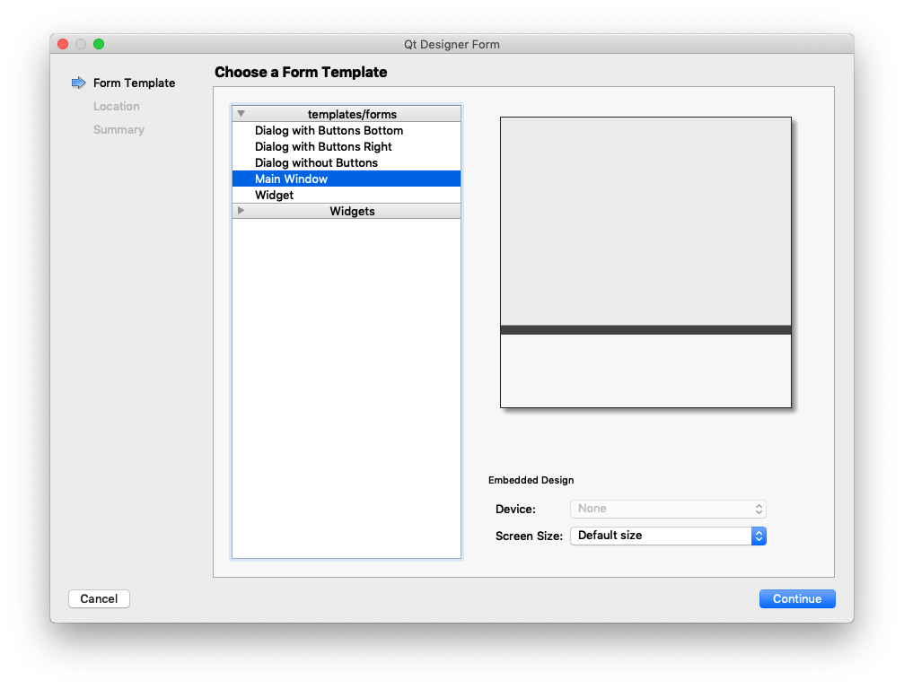
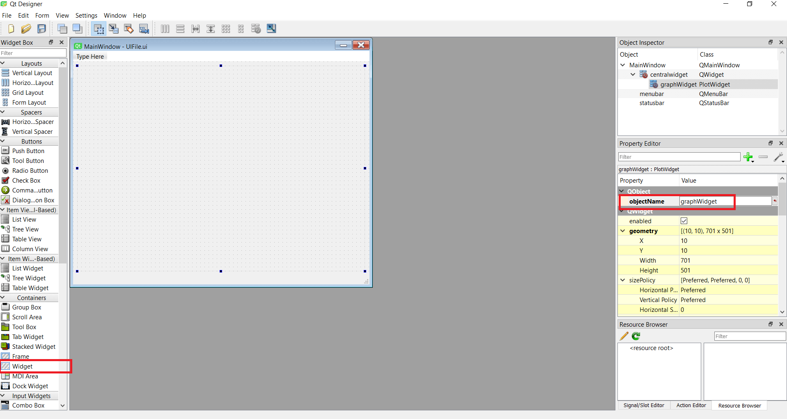
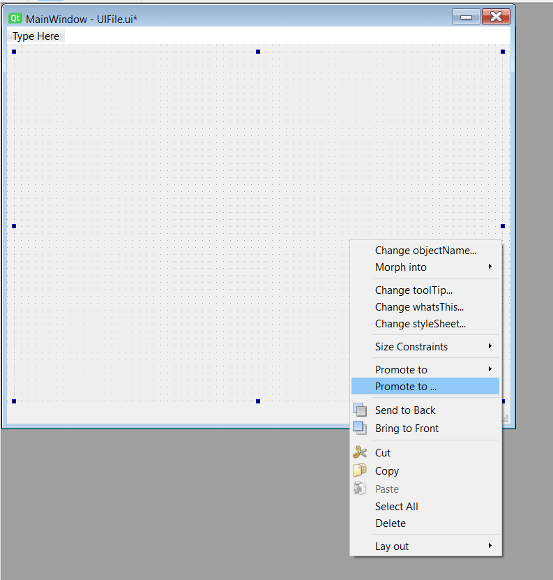
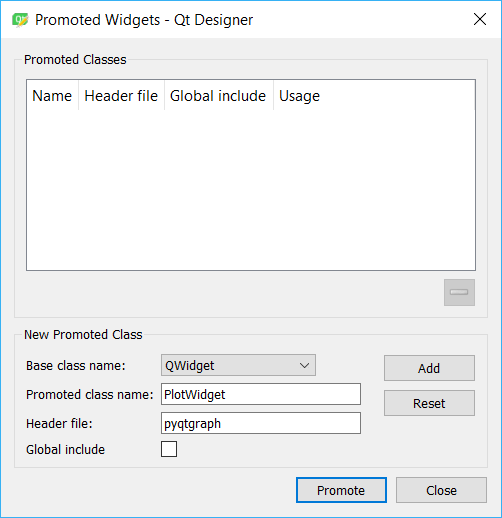
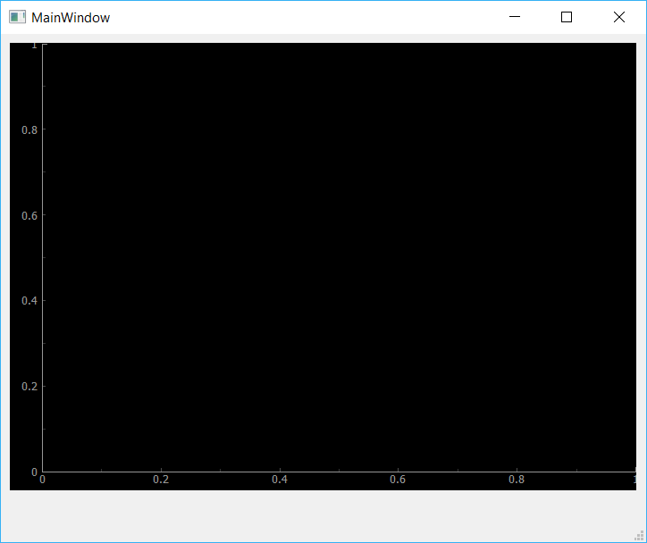
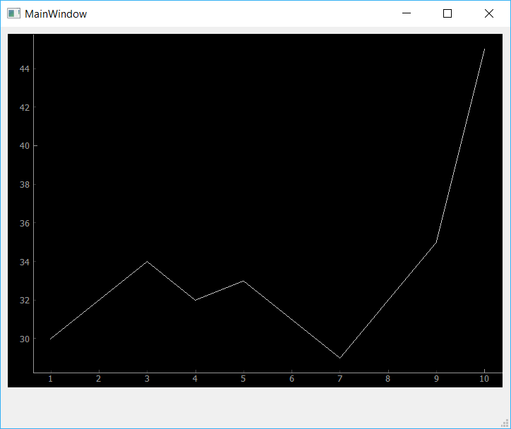

Qt Designer 是一个用于设计 PySide6 GUI 的出色工具，它允许您使用 Qt 的全部控件和布局来构建您的应用程序。然而，随着您的应用程序变得越来越复杂，您可能会发现自己需要创建自定义控件或使用 PySide6 的库（例如 *PyQtGraph*），而这些库的控件在 Designer 中是不可用的。

幸运的是，Qt Designer 支持一种机制，即使用*占位符*控件来在您的设计中表示您的自定义或外部控件。本教程将引导您完成使用占位符，从 Qt Designer 内部将一个 *PyQtGraph* 绘图添加到您的应用中的过程。

在 Qt Designer 中使用占位符的原理非常直接：

1.  像往常一样在 Qt Designer 中创建一个 UI。
2.  添加一个*占位符*控件来代表您要添加的自定义控件。
3.  在构建 UI 时，告诉 Qt 用您实际的控件替换您的占位符。

在 Qt 中，这最后一步被称为*提升*（promoting）。

如果您要添加的自定义控件是现有 Qt 控件的子类，您可能希望使用基类作为您的占位符来进行提升。例如，如果您有一个从 `QPushButton` 子类化的自定义 `MyAwesomeButton` 按钮控件，那么就使用 `QPushButton` 作为占位符，并将其提升为 `MyAwesomeButton`。这使您可以在 Qt Designer 内部访问基类的属性、事件和动作。

如果您没有一个明显的基类可以使用，那么您可以使用 `QWidget`，它是所有 Qt 控件的通用基类。

### PyQtGraph

数据科学是 Python 最受欢迎的用例之一，而构建仪表盘和分析工具是 PySide 的一个常见用例。对于所有这些，能够将绘图添加到您的 UI 中非常有用——而能够从 Qt Designer 中做到这一点则更加有用。

Python 中有许多可用的绘图库，其中 *matplotlib* 最为流行，并为 PySide 提供了一些基本支持。[PyQtGraph](http://www.pyqtgraph.org/) 是一个流行的替代品，它使用 Qt 原生的 `QGraphicsScene` 来提供快速的缩放、平移和拖放行为，使其感觉像是您应用程序的自然组成部分。

无论您是使用 *PyQtGraph* 还是 *matplotlib* 来满足您的绘图需求，这些绘图画布控件都无法从 Qt Designer 内部直接使用。在本教程中，我们将介绍在您的应用中使用这些自定义控件的过程。

如果您尚未安装 PyQtGraph，可以使用以下命令进行安装：

```bash
$ python -m pip install pyqtgraph
```

下面的说明并非 PyQtGraph 特有，您可以使用类似的方法将 [Matplotlib](https://www.pythonguis.com/tutorials/pyqt6-plotting-matplotlib/) 或任何其他自定义控件添加到您的应用中。

### Qt Designer

我们将使用 Qt Designer 创建一个简单的 UI 设计，并为我们的 PyQtGraph 控件添加一个占位符。首先，打开 Qt Designer 并像往常一样创建一个新的 `QMainWindow`。


*Qt Designer — 为控件类型选择 MainWindow*

接下来，我们需要添加*占位符*控件。由于 *PyQtGraph* 绘图控件没有合适的基类，我们将使用基本的 `QWidget` 作为我们的占位符。从左侧边栏选择 *Widget* 并将其放置在您窗口的中央。

给这个控件起个名字，比如 `graphWidget`。这只是一个在您的代码中引用该元素的标签。


*向窗口添加一个控件。将控件命名为 "graphWidget"*

右键单击该控件，并从其上下文菜单中选择*提升为*（Promote to）选项。

提升一个 `QWidget` 表示它应该被指定的子类替换，在我们的例子中，就是 PyQtGraph 的绘图控件。

一个被提升的控件可以通过右键单击并从其上下文菜单中选择*降级为*（Demote to）来恢复为其基类。

*右键单击以显示提升菜单*

您将看到一个对话框，用于指定占位符控件将要变成的自定义控件类。

*头文件*（Header file）是用于导入该类的 Python 模块的名称，这里是 `pyqtgraph`。将 `PlotWidget` 指定为要替换它的控件的类名。


*通过将类名指定为 PlotWidget 并将头文件指定为 pyqtgraph 来提升该控件。*

您为文件使用的名称无关紧要，但通常最好以您要用它创建的类来命名。

瞧！该控件现在被提升为了一个用于绘图的画布。但是您在 Qt Designer 中看不到任何变化。将该窗口保存为 `mainwindow.ui`，并放在与您的 PySide 应用相同的目录中。

有关在 Python 中使用 Qt Designer 的 `.ui` 文件的完整指南，请查看 [Qt Designer 入门](https://www.pythonguis.com/tutorials/pyside-first-steps-qt-designer/)。

### 加载 `.ui` 文件

我们现在有了包含我们 UI 定义的 `mainwindow.ui` 文件。我们可以从 Python 加载它来显示窗口和我们的自定义控件。

让我们从一个基本的应用模板开始。

```python
import sys
# 必须先导入 PySide6
from PySide6.QtWidgets import QApplication
import pyqtgraph as pg

# 使用 pyqtgraph 的辅助函数加载 UI 文件
uiclass, baseclass = pg.Qt.loadUiType("mainwindow.ui")

class MainWindow(uiclass, baseclass):
    def __init__(self):
        super().__init__()
        self.setupUi(self)

app = QApplication(sys.argv)
window = MainWindow()
window.show()
app.exec()
```

在这个例子中，我们使用 PyQtGraph 的辅助方法 `pg.Qt.loadUiType` 来加载 UI。这使我们能够访问设计好的 UI 类和基类（在本例中是 `QMainWindow`）。有了这些，我们就可以创建我们自己的自定义 `QMainWindow` 子类，以向其添加我们的绘图方法。

PyQtGraph 支持 [PyQt 和 PySide](https://pyqtgraph.readthedocs.io/en/latest/getting_started/how_to_use.html#pyqt-and-pyside)。我们可以通过在导入 `pyqtgraph` 之前导入它来手动定义要使用的库。在本教程中，我们强制 PyQtGraph 使用 PySide6。请注意，如果您使用一些像 [isort](https://pycqa.github.io/isort/) 这样的导入排序工具，那么上面的代码可能无法正常工作，因为这些工具会交换导入顺序，这意味着 PyQtGraph 将在 PySide6 之前被导入。

将上面的代码保存在与您的 `mainwindow.ui` 文件相同的文件夹中，并正常运行它：


*您的图形现在已嵌入*

您会看到一个窗口，其中的控件已转变为 PyQtGraph 绘图控件。

现在让我们创建一个方法来绘制小时与温度数据的图表：

```python
import sys
from PySide6.QtWidgets import QApplication
import pyqtgraph as pg

uiclass, baseclass = pg.Qt.loadUiType("mainwindow.ui")

class MainWindow(uiclass, baseclass):
    def __init__(self):
        super().__init__()
        self.setupUi(self)
        self.plot(
            [1, 2, 3, 4, 5, 6, 7, 8, 9, 10],  # 小时
            [30, 32, 34, 32, 33, 31, 29, 32, 35, 45],  # 温度
        )

    def plot(self, hour, temperature):
        self.graphWidget.plot(hour, temperature)

app = QApplication(sys.argv)
window = MainWindow()
window.show()
app.exec()
```

所以我们添加了 `plot()` 方法，它接受两个数组，`hour` 和 `temperature`。然后它使用 `graphWidget` 上的 `.plot()` 方法来绘制数据。

运行代码，您应该会看到以下内容。


*显示虚拟数据的自定义 PyQtGraph 控件。*

就是这样！您刚刚用 *PyQtGraph* 嵌入了您的第一个绘图。

默认的 PyQtGraph 绘图看起来不太精致。您可以尝试修改 `.plot()` 的调用来更改数据，看看绘图会如何变化。

在接下来的教程中，我们将学习如何创建更精细的 PyQtGraph 绘图，以及如何自定义您的绘图，包括线条颜色、样式和替代的绘图类型。