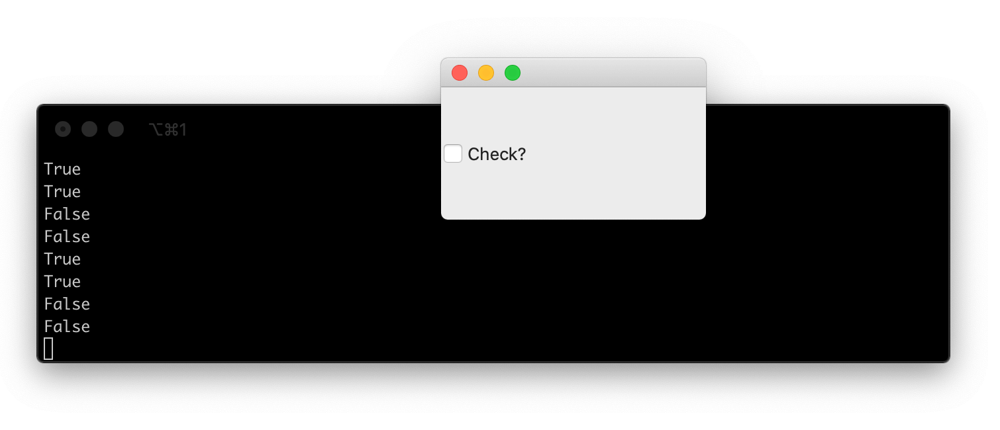

信号是Qt的一个巧妙特性，它允许您在应用程序的不同组件之间传递消息。信号被连接到*槽*，这些槽是函数（或方法），每当信号触发时就会运行。许多信号还传输数据，提供关于状态变化或触发它们的小部件的信息。接收槽可以使用这些数据来响应同一信号执行不同的操作。

然而，这里有一个限制：信号只能发出它被设计用来发出的数据。因此，例如，一个`QAction`有一个`.triggered`信号，当该特定动作被激活时就会触发。`.triggered`信号只发出一个数据——动作被触发后的*选中*状态。

对于非可选中的动作，这个值将永远是`False`。

接收函数不知道是*哪个*`QAction`触发了它，也无法接收关于它的任何其他数据。

这通常没什么问题。您可以将一个特定的动作绑定到一个独特的函数，该函数精确地执行该动作所要求的操作。然而，有时您需要*槽*函数知道的比`QAction`提供给它的更多。这可能是触发信号的对象，或者是您的槽为了执行信号的预期结果而需要的其他一些相关元数据。

这是扩展或修改Qt提供的内置信号的强大方法。

### 拦截信号

您不直接将信号连接到目标函数，而是使用一个中间函数来拦截信号，修改信号数据，然后将其转发给您真正的槽函数。

这个槽函数必须接受信号发送的值（这里是`checked`状态），然后调用*真正的*槽，并将任何额外的数据与参数一起传递。

```python
def fn(checked):
    self.handle_trigger(checked, <额外的参数>)
```

除了定义这个中间函数，您也可以使用`lambda`函数实现同样的效果。和上面一样，这接受一个单一的参数`checked`，然后调用真正的槽。

```python
lambda checked: self.handle_trigger(checked, <额外的参数>)
```

在这两个例子中，`<额外的参数>`可以替换为您想要转发给您的槽的任何内容。在下面的例子中，我们将`QAction`对象`action`转发给接收槽。

```python
action = QAction()
action.triggered.connect( lambda checked: self.handle_trigger(checked, action) )
```

我们的`handle_trigger`槽方法将接收原始的`checked`值和`QAction`对象。我们的接收槽可以看起来像这样：

```python
# 一个类方法。
def handled_trigger(self, checked, action):
    # 在这里做些什么。
```

下面是一些使用这种方法修改与`MainWindow.windowTitleChanged`信号一起发送的数据的示例。

```python
from PySide6.QtWidgets import (
    QApplication, QMainWindow
)
from PySide6.QtCore import Qt

import sys


class MainWindow(QMainWindow):

    def __init__(self):
        super().__init__()

        # 信号：每当窗口标题改变时，连接的函数将被调用。
        # 新的标题将传递给该函数。
        self.windowTitleChanged.connect(self.on_window_title_changed)

        # 信号：每当窗口标题改变时，连接的函数将被调用。
        # 新的标题被丢弃，函数在没有参数的情况下被调用。
        self.windowTitleChanged.connect(lambda x: self.on_window_title_changed_no_params())

        # 信号：每当窗口标题改变时，连接的函数将被调用。
        # 新的标题被丢弃，函数在没有参数的情况下被调用。
        # 该函数有默认参数。
        self.windowTitleChanged.connect(lambda x: self.my_custom_fn())

        # 信号：每当窗口标题改变时，连接的函数将被调用。
        # 新的标题被传递给函数并替换默认参数。
        # 额外的数据从lambda内部传递。
        self.windowTitleChanged.connect(lambda x: self.my_custom_fn(x, 25))

        # 这会设置窗口标题，从而触发所有上述信号，
        # 将新标题作为第一个参数发送给附加的函数或lambda。
        self.setWindowTitle("My Signals App")

    # 槽：这个槽接受一个字符串，例如窗口标题，并打印它
    def on_window_title_changed(self, s):
        print(s)

    # 槽：当窗口标题改变时被调用。
    def on_window_title_changed_no_params(self):
        print("Window title changed.")

    # 槽：这个槽有默认参数，可以在没有值的情况下被调用
    def my_custom_fn(self, a="HELLLO!", b=5):
        print(a, b)


app = QApplication(sys.argv)
w = MainWindow()
w.show()
app.exec()
```

`__init__`块末尾的`.setWindowTitle`调用会改变窗口标题并触发`.windowTitleChanged`信号，该信号会发出新的窗口标题作为`str`。我们附加了一系列中间槽函数（作为`lambda`函数），它们修改这个信号，然后用不同的参数调用我们的自定义槽。

运行此代码将产生以下输出。

```bash
My Signals App
Window title changed.
HELLLO! 5
My Signals App 25
```

中间函数可以像您喜欢的那样简单或复杂——除了丢弃/添加参数，您还可以执行查找来将信号*修改*为不同的值。

在下面的例子中，一个复选框信号 `Qt.CheckState.Checked` 或 `Qt.CheckState.Unchecked` 被一个中间槽修改为一个 `bool` 值。

```python
import sys

from PySide6.QtCore import Qt
from PySide6.QtWidgets import QApplication, QCheckBox, QMainWindow

class MainWindow(QMainWindow):
    def __init__(self):
        super().__init__()

        checkbox = QCheckBox("Check?")

        # 选项 1: 转换函数
        def checkstate_to_bool(state):
            if Qt.CheckState(state) == Qt.CheckState.Checked:
                return self.result(True)
            return self.result(False)

        checkbox.stateChanged.connect(checkstate_to_bool)

        # 选项 2: 字典查找
        _convert = {Qt.CheckState.Checked: True, Qt.CheckState.Unchecked: False, Qt.CheckState.PartiallyChecked: None}

        checkbox.stateChanged.connect(lambda v: self.result(_convert[Qt.CheckState(v)]))

        self.setCentralWidget(checkbox)

    # 槽：接受检查值。
    def result(self, v):
        print(v)

app = QApplication(sys.argv)
w = MainWindow()
w.show()
app.exec()
```

在这个例子中，我们以两种方式将`.stateChanged`信号连接到`result`——a) 使用一个中间函数，根据信号参数调用`.result`方法并传入`True`或`False`，以及b) 在一个中间`lambda`中使用字典查找。

运行这段代码，每次状态改变时（我们每次连接信号都会触发一次），命令行都会输出`True`或`False`。


*QCheckbox触发2个槽，带有修改后的信号数据*

### 循环中的问题

想要以这种方式连接信号的最常见原因之一是当您在循环中以编程方式构建一系列对象并连接信号时。然而，事情并不总是那么简单。

如果您试图在遍历一个变量的循环中构造被拦截的信号，并希望将循环变量传递给接收槽，您会遇到一个问题。例如，在下面的代码中，我们创建了一系列按钮，并使用一个中间函数将按钮的*值*（0-9）与按下信号一起传递。

```python
from PySide6.QtWidgets import (
    QApplication, QMainWindow, QPushButton,
    QWidget, QLabel, QVBoxLayout, QHBoxLayout
)
from PySide6.QtGui import QAction

import sys


class Window(QWidget):

    def __init__(self):
        super().__init__()

        v = QVBoxLayout()
        h = QHBoxLayout()

        for a in range(10):
            button = QPushButton(str(a))
            button.pressed.connect(
                lambda: self.button_pressed(a)
            )
            h.addWidget(button)

        v.addLayout(h)
        self.label = QLabel("")
        v.addWidget(self.label)
        self.setLayout(v)

    def button_pressed(self, n):
        self.label.setText(str(n))


app = QApplication(sys.argv)
w = Window()
w.show()
app.exec()
```

如果您运行这个，您会看到问题——无论您点击哪个按钮，您都会在标签上看到相同的数字（9）。为什么是9？这是循环的最后一个值。

问题在于`lambda: self.button_pressed(a)`这一行，我们在这里将`a`传递给最终的`button_pressed`槽。在这种情况下，`a`被绑定到了循环变量本身。

```python
for a in range(10):
    # .. 省略 ...
    button.pressed.connect(
        lambda: self.button_pressed(a)
    )
    # .. 省略 ...
```

我们传递的不是创建按钮时`a`的*值*，而是信号触发时`a`的任何值。由于信号在循环完成后才会触发——我们在UI创建后与之交互——所以*每个*信号的`a`的值都是`a`在循环中的最后一个值：9。

所以点击任何一个按钮都会向`button_pressed`发送9。

解决方案是将值作为（重新）命名的参数传入。这将参数绑定到循环中该点的`a`的*值*，创建一个新的、未连接的变量。循环继续，但绑定的变量不会被改变。

这确保了无论何时调用它，都会使用正确的值。

```python
lambda val=a: self.button_pressed(val)
```

您*不必*重命名变量，您也可以选择对绑定的值使用相同的名称。

```python
lambda a=a: self.button_pressed(a)
```

重要的是使用*命名参数*。将其放入一个循环中，它将如下所示：

```python
for a in range(10):
    button = QPushButton(str(a))
    button.pressed.connect(
        lambda val=a: self.button_pressed(val)
    )
```

现在运行这个，您将看到预期的行为——标签会更新为与按下的按钮相匹配的数字。

可行的代码如下：

```python
from PySide6.QtWidgets import (
    QApplication, QMainWindow, QPushButton,
    QWidget, QLabel, QVBoxLayout, QHBoxLayout
)
from PySide6.QtGui import QAction

import sys


class Window(QWidget):

    def __init__(self):
        super().__init__()

        v = QVBoxLayout()
        h = QHBoxLayout()

        for a in range(10):
            button = QPushButton(str(a))
            button.pressed.connect(
                lambda val=a: self.button_pressed(val)
            )
            h.addWidget(button)

        v.addLayout(h)
        self.label = QLabel("")
        v.addWidget(self.label)
        self.setLayout(v)

    def button_pressed(self, n):
        self.label.setText(str(n))


app = QApplication(sys.argv)
w = Window()
w.show()
app.exec()
```