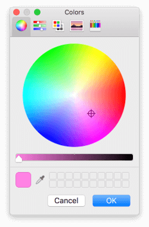

系统托盘应用程序（或菜单栏应用程序）对于通过少量点击即可访问常用功能或信息非常有用。对于完整的桌面应用程序来说，它们是一种无需打开整个窗口即可控制应用的便捷快捷方式。

Qt 提供了一个简单的接口，用于构建跨平台的系统托盘（Windows）或菜单栏（macOS）应用程序。

### 最简示例

以下是一个在工具栏/系统托盘中显示带有菜单的图标的最简工作示例。菜单中的操作尚未连接，因此目前没有任何作用。

```python
from PySide6.QtGui import QIcon, QAction
from PySide6.QtWidgets import QApplication, QSystemTrayIcon, QMenu

app = QApplication([])
app.setQuitOnLastWindowClosed(False)

# 创建图标
icon = QIcon("icon.png") # 您需要一个名为 icon.png 的图标文件

# 创建托盘图标
tray = QSystemTrayIcon()
tray.setIcon(icon)
tray.setVisible(True)

# 创建菜单
menu = QMenu()
action = QAction("一个菜单项")
menu.addAction(action)

# 在菜单中添加一个“退出”选项
quit_action = QAction("退出")
quit_action.triggered.connect(app.quit)
menu.addAction(quit_action)

# 将菜单添加到托盘图标
tray.setContextMenu(menu)

app.exec()
```

您会注意到这里没有 `QMainWindow`，这仅仅是因为我们实际上没有任何窗口要显示。您可以像往常一样创建一个窗口，而不会影响系统托盘图标的行为。

这个示例需要一个图标——我推荐使用 [fugue icon set](http://p.yusukekamiyamane.com/)。

在 Qt 中，默认行为是在所有活动窗口都关闭后关闭应用程序。这不会影响这个小示例，但在您确实创建了窗口然后关闭它们的应用程序中会成为一个问题。设置 `app.setQuitOnLastWindowClosed(False)` 可以阻止这种情况，并确保您的应用程序持续运行。

提供的图标会显示在工具栏中（您可以在左侧看到它）。


*显示在菜单栏上的系统托盘图标*

点击图标会显示添加的菜单。

*展开菜单的系统托盘图标*

这个应用程序目前还什么都做不了，所以在下一部分，我们将扩展这个示例来创建一个迷你颜色选择器。

### 颜色托盘

以下是一个更完整的工作示例，它使用 Qt 内置的 `QColorDialog` 来提供一个可通过工具栏访问的颜色选择器。菜单让您可以选择以 HTML 格式的 `#RRGGBB`、`rgb(R,G,B)` 或 `hsv(H,S,V)` 来获取选中的颜色。

```python
import sys
from PySide6.QtGui import QIcon, QAction
from PySide6.QtWidgets import QApplication, QColorDialog, QSystemTrayIcon, QMenu

app = QApplication(sys.argv)
app.setQuitOnLastWindowClosed(False)

# 创建图标
icon = QIcon("color.png") # 您需要一个名为 color.png 的图标文件

clipboard = QApplication.clipboard()
dialog = QColorDialog()

def copy_color_hex():
    if dialog.exec():
        color = dialog.currentColor()
        clipboard.setText(color.name())

def copy_color_rgb():
    if dialog.exec():
        color = dialog.currentColor()
        clipboard.setText("rgb(%d, %d, %d)" % (
            color.red(), color.green(), color.blue()
        ))

def copy_color_hsv():
    if dialog.exec():
        color = dialog.currentColor()
        clipboard.setText("hsv(%d, %d, %d)" % (
            color.hue(), color.saturation(), color.value()
        ))

# 创建托盘图标
tray = QSystemTrayIcon()
tray.setIcon(icon)
tray.setVisible(True)

# 创建菜单
menu = QMenu()
action1 = QAction("Hex")
action1.triggered.connect(copy_color_hex)
menu.addAction(action1)

action2 = QAction("RGB")
action2.triggered.connect(copy_color_rgb)
menu.addAction(action2)

action3 = QAction("HSV")
action3.triggered.connect(copy_color_hsv)
menu.addAction(action3)

quit_action = QAction("退出")
quit_action.triggered.connect(app.quit)
menu.addAction(quit_action)

# 将菜单添加到托盘图标
tray.setContextMenu(menu)

app.exec()
```

和前面的示例一样，这个示例也没有 `QMainWindow`。菜单的创建方式和之前一样，但为不同的输出格式添加了 3 个操作。每个操作都连接到一个代表其格式的特定处理函数。每个处理函数都会显示一个对话框，如果选中了颜色，就会以给定的格式将该颜色复制到剪贴板。

和之前一样，图标会出现在工具栏中。


*Mac 菜单栏上的颜色选择器图标（左侧）*

点击图标会显示一个菜单，您可以从中选择想要返回的图像格式。

*返回所选颜色的选项（hex、RGB 或 HSV）*

一旦您选择了格式，您将看到标准的 Qt 颜色选择器窗口。


*PySide 提供了对系统对话框的访问，例如这个 Mac 颜色选择器*

选择您想要的颜色并点击确定。所选的颜色将以请求的格式被复制到剪贴板。可用的格式将产生以下输出：

```python
#a2b3cc             # 范围 00-FF
rgb(25, 28, 29)     # 范围 0-255
hsv(199, 14, 93)    # h 范围 0-359, s,v 范围 0-255
```
*(译者注：原文中HSV值的范围有误，根据Qt文档，hue()返回0-359，saturation()和value()返回0-255)*

### 改进建议

一个简单而不错的改进是，让先前选择的颜色可以被再次以其他格式复制。您可以通过存储现有菜单中的颜色结果值来实现这一点。然后添加另外 3 个选项，这些选项（在菜单上）显示它们的返回值——点击这些选项只会将该值复制到剪贴板。