如果你创建的桌面应用无法与他人分享——无论是商业发布、在线分享，还是仅仅送给朋友——那将索然无味。分享你的应用能让其他人从你的辛勤工作中受益！

好消息是，有一些工具可以帮助你处理你的Python应用程序，并且它们与使用PySide6构建的应用配合得很好。在本教程中，我们将探讨最流行的Python应用程序打包工具：_PyInstaller_。

本教程分为一系列步骤，使用 _PyInstaller_ 将一个简单的PySide6应用开始，逐步构建到更复杂的应用，并最终生成可分发的macOS应用包（app bundle）。你可以选择完整地学习本教程，或者直接跳到与你自己的项目最相关的部分。

最后，我们将构建一个macOS*磁盘映像*（Disk Image），这是在macOS上分发应用程序的常规方法。

> **重要提示**
>
> 请务必在目标系统上编译你的应用。也就是说，如果你想创建一个Mac的 `.app` 文件，你需要在Mac上操作；要创建EXE文件，则需要使用Windows。

[
*用于macOS的示例磁盘映像安装程序*

如果你等不及了，可以先下载[用于macOS的示例磁盘映像](https://downloads.pythonguis.com/DemoAppMacOS.dmg)。

### 环境要求

_PyInstaller_ 对PySide6提供了开箱即用的支持。在撰写本文时，当前版本的 _PyInstaller_ 与Python 3.6+兼容。无论你正在开发什么项目，你应该都能够打包你的应用。

你可以使用 `pip` 来安装 _PyInstaller_。

bash
```bash
pip3 install PyInstaller
```

如果你在打包应用时遇到问题，你的第一步应该*总是*将你的 _PyInstaller_ 和 _hooks包_ 更新到最新版本，使用以下命令：

bash
```bash
pip3 install --upgrade PyInstaller pyinstaller-hooks-contrib
```

_hooks_ 模块包含了 _PyInstaller_ 针对特定包的打包指令，它会定期更新。

#### 在虚拟环境中安装（可选）

你也可以选择在虚拟环境（或你的应用程序的虚拟环境）中安装PySide6和 _PyInstaller_，以保持你的全局环境整洁。

bash
```bash
python3 -m venv packenv
```

创建完成后，通过在命令行中运行以下命令来激活虚拟环境：
(*译者注：原文此处为Windows命令，已更正为macOS命令*)

bash
```bash
source packenv/bin/activate
```

最后，安装所需的库。对于PySide6，你可以使用：

python
```python
pip3 install PySide6 PyInstaller
```

### 入门

一个好习惯是*从项目一开始*就着手打包你的应用程序，这样你可以在开发过程中随时确认打包功能是否正常。在你添加额外的依赖项时，这一点尤其重要。如果等到最后才考虑打包，那么调试问题究竟*出在哪里*可能会变得非常困难。

在这个例子中，我们将从一个简单的骨架应用开始，它本身并没有什么有趣的功能。一旦我们掌握了基本的打包流程，我们将扩展该应用，以包含图标和数据文件。我们会边做边验证构建过程。

首先，为你的应用程序创建一个新文件夹，然后在一个名为 `app.py` 的文件中添加以下骨架应用。你也可以[下载源代码及相关文件](https://downloads.pythonguis.com/DemoAppPyInstaller.zip)。

python
```python
from PySide6 import QtWidgets
import sys

class MainWindow(QtWidgets.QMainWindow):
    def __init__(self):
        super().__init__()

        self.setWindowTitle("Hello World")
        l = QtWidgets.QLabel("My simple app.")
        l.setMargin(10)
        self.setCentralWidget(l)
        self.show()

if __name__ == '__main__':
    app = QtWidgets.QApplication(sys.argv)
    w = MainWindow()
    app.exec()
```

这是一个基本的骨架应用程序，它创建了一个自定义的 `QMainWindow` 并在其中添加了一个简单的控件 `QLabel`。你可以如下运行这个应用。

这应该会产生如下窗口（在macOS上）。

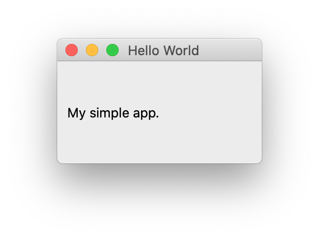
*PySide6中的简单骨架应用*

### 构建一个基础应用

现在我们有了简单的应用程序骨架，我们可以进行第一次构建测试，以确保一切正常。

打开你的终端并导航到包含你项目的文件夹。现在你可以运行以下命令来执行 _PyInstaller_ 构建。

python
```python
pyinstaller --windowed app.py
```

`--windowed` 标志是必需的，它告诉PyInstaller构建一个macOS的 `.app` 应用包。

你会看到一系列输出信息，提供了关于 _PyInstaller_ 正在做什么的调试信息。这些信息对于调试构建问题很有用，但通常可以忽略。下面是我在我的系统上运行该命令时得到的输出。

bash
```bash
martin@MacBook-Pro pyside6 % pyinstaller --windowed app.py
74 INFO: PyInstaller: 4.8
74 INFO: Python: 3.9.9
# ... (大量日志输出) ...
16049 INFO: Building BUNDLE BUNDLE-00.toc completed successfully.
```

如果你查看你的文件夹，你会发现现在多了两个新文件夹 `dist` 和 `build`。

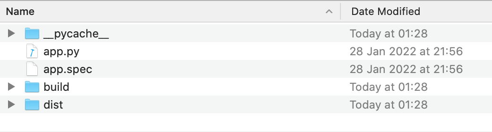
*PyInstaller创建的build和dist文件夹*

下面是一个简化的文件夹内容列表，显示了 `build` 和 `dist` 文件夹。

bash
```bash
.
├── app.py
├── app.spec
├── build
│   └── app
│       ├── ...
└── dist
    ├── app
    │   ├── libcrypto.1.1.dylib
    │   ├── PySide6
    │   ...
    └── app.app
```

`build` 文件夹被 _PyInstaller_ 用来收集和准备要打包的文件，它包含了分析结果和一些额外的日志。在大多数情况下，你可以忽略这个文件夹的内容，除非你在调试问题。

`dist`（"distribution"的缩写）文件夹包含了要分发的文件。这包括你的应用程序（打包成一个可执行文件）、任何相关的库（例如PySide6）以及二进制 `.so` 文件。

由于我们上面提供了 `--windowed` 标志，PyInstaller实际上为我们创建了*两种*构建产物。文件夹 `app` 是一个包含了运行你的应用所需一切的简单文件夹。PyInstaller还创建了一个应用包 `app.app`，这通常是你分发给用户的形式。

`app` 文件夹是一个有用的调试工具，因为你可以轻松地看到库和其他打包的数据文件。

你现在可以自己尝试运行你的应用，可以通过双击应用包，或者通过运行 `dist` 文件夹中的可执行文件。无论哪种方式，稍等片刻，你将看到你熟悉的应用程序窗口弹出，如下所示。


*打包后运行的简单应用*

在你的Python文件所在的同一文件夹中，除了 `build` 和 `dist` 文件夹，_PyInstaller_ 还会创建一个 `.spec` 文件。在下一节中，我们将看看这个文件是什么以及它有什么作用。

### Spec 文件

`.spec` 文件包含了 _PyInstaller_ 用来打包你的应用的构建配置和指令。每个 _PyInstaller_ 项目都有一个 `.spec` 文件，它是根据你运行 `pyinstaller` 时传递的命令行选项生成的。

当我们用我们的脚本运行 `pyinstaller` 时，除了Python应用程序的文件名和 `--windowed` 标志外，我们没有传递任何其他参数。这意味着我们的spec文件目前只包含默认配置。如果你打开它，你会看到类似下面的内容。

python
```python
# -*- mode: python ; coding: utf-8 -*-

block_cipher = None

a = Analysis(['app.py'],
             # ...
             )
pyz = PYZ(a.pure, a.zipped_data,
             cipher=block_cipher)
exe = EXE(pyz,
          a.scripts,
          # ...
          console=False,
          # ...
          )
coll = COLLECT(exe,
               a.binaries,
               # ...
               )
app = BUNDLE(coll,
             name='app.app',
             icon=None,
             bundle_identifier=None)
```

首先要注意的是，这是一个Python文件，这意味着你可以编辑它并使用Python代码来计算设置值。这对于复杂的构建尤其有用，例如当你针对不同平台并希望有条件地定义要捆绑的额外库或依赖项时。

因为我们使用了 `--windowed` 命令行标志，`EXE(console=)` 属性被设置为 `False`。如果这是 `True`，当你的应用启动时会显示一个控制台窗口——这通常不是GUI应用程序想要的。

一旦生成了 `.spec` 文件，你可以将它而不是你的脚本传递给 `pyinstaller` 来重复之前的构建过程。现在运行它来重新构建你的可执行文件。

```bash
pyinstaller app.spec
```

生成的构建将与用于生成 `.spec` 文件的构建完全相同（假设你没有做任何更改）。对于许多 _PyInstaller_ 的配置更改，你可以选择传递命令行参数，或者修改你现有的 `.spec` 文件。选择哪种方式取决于你。

### 调整构建

到目前为止，我们已经为一个非常基础的应用程序创建了一个简单的首次构建。现在我们将看一些 _PyInstaller_ 提供的最有用的选项来调整我们的构建。然后我们将继续看如何构建更复杂的应用程序。

#### 为你的应用命名

最简单的更改之一是为你的应用程序提供一个合适的“名称”。默认情况下，应用程序会采用你的源文件名（不含扩展名），例如 `main` 或 `app`。这通常不是你想要的。

你可以通过编辑 `.spec` 文件，在 `EXE`、`COLLECT` 和 `BUNDLE` 块下添加一个 `name=` 来为 _PyInstaller_ 提供一个更好听的名字用于应用（和 `dist` 文件夹）。

python
```python
exe = EXE(pyz,
          # ...
          name='Hello World',
          # ...
         )
coll = COLLECT(exe,
               # ...
               name='Hello World')
app = BUNDLE(coll,
             name='Hello World.app',
             icon=None,
             bundle_identifier=None)
```

`EXE` 下的名称是*可执行文件*的名称，`BUNDLE` 下的名称是应用包的名称。

或者，你可以重新运行 `pyinstaller` 命令，并与你的 `app.py` 脚本一起传递 `-n` 或 `--name` 配置标志。

bash
```bash
pyinstaller -n "Hello World" --windowed app.py
# 或者
pyinstaller --name "Hello World" --windowed app.py
```

最终的应用文件将被命名为 `Hello World.app`，而解包的构建产物将放置在 `dist/Hello World/` 文件夹中。

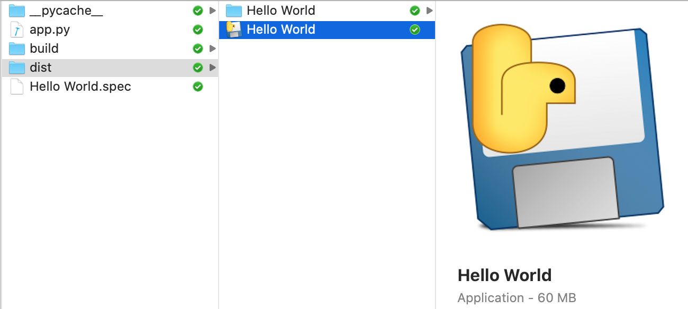
*具有自定义名称 "Hello World" 的应用程序*

`.spec` 文件的名称取自命令行中传递的名称，所以这*也*会为你创建一个新的spec文件，名为 `Hello World.spec`，位于你的根文件夹中。

> **提示**
>
> 确保你删除了旧的 `app.spec` 文件，以避免混淆，编辑了错误的文件。

#### 应用程序图标

默认情况下，_PyInstaller_ 生成的应用包带有以下图标。


*应用包上的默认PyInstaller应用程序图标*

你可能会想自定义这个图标，使你的应用程序更具辨识度。这可以通过传递 `--icon` 命令行参数，或编辑你的 `.spec` 文件中 `BUNDLE` 部分的 `icon=` 参数来轻松完成。对于macOS应用包，你需要提供一个 `.icns` 文件。

python
```python
app = BUNDLE(coll,
             name='Hello World.app',
             icon='Hello World.icns',
             bundle_identifier=None)
```

> **提示**
>
> 要从图像创建macOS图标，你可以使用 [image2icon 工具](https://apps.apple.com/us/app/image2icon-make-your-own-icons/id992115977)。

如果你现在重新运行构建（通过使用命令行参数，或者使用你修改过的 `.spec` 文件运行），你会看到指定的图标文件现在已经设置在你应用程序的应用包上。

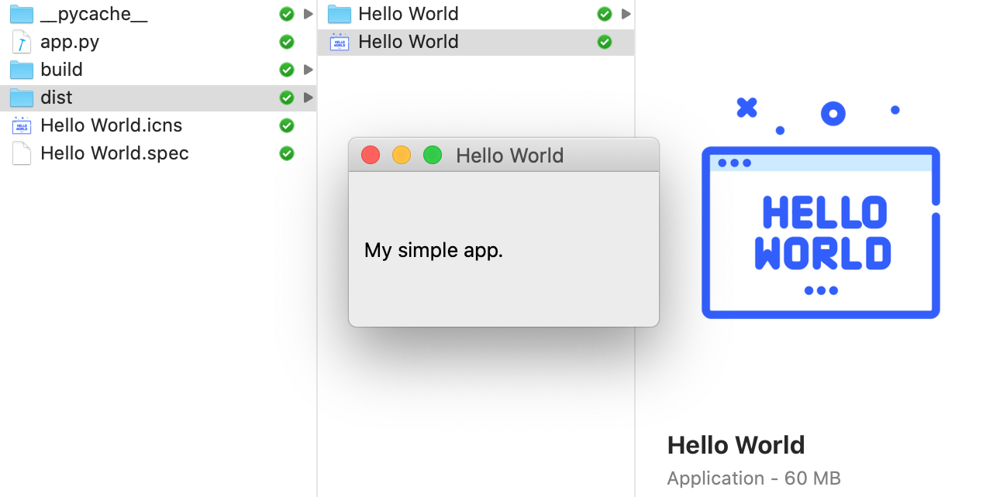
*应用包上的自定义应用程序图标*

在macOS上，应用程序图标取自应用包。如果你重新打包你的应用并运行该包，你会在程序坞（Dock）中看到你的应用图标！

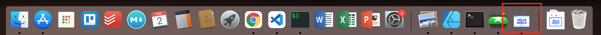
*程序坞上的自定义应用程序图标*

### 数据文件和资源

到目前为止，我们的应用程序只包含一个Python文件，没有任何依赖。大多数真实世界的应用程序要复杂一些，通常会附带相关的数据文件，如图标或UI设计文件。在本节中，我们将看看如何使用PyInstaller来实现这一点，从单个文件开始，然后捆绑完整的资源文件夹。

首先，让我们用更多的按钮来更新我们的应用，并为每个按钮添加图标。

python
```python
from PySide6.QtWidgets import QMainWindow, QApplication, QLabel, QVBoxLayout, QPushButton, QWidget
from PySide6.QtGui import QIcon
import sys

class MainWindow(QMainWindow):
    def __init__(self):
        super().__init__()

        self.setWindowTitle("Hello World")
        layout = QVBoxLayout()
        label = QLabel("My simple app.")
        label.setMargin(10)
        layout.addWidget(label)

        button1 = QPushButton("Hide")
        button1.setIcon(QIcon("icons/hand.png"))
        button1.pressed.connect(self.lower)
        layout.addWidget(button1)

        button2 = QPushButton("Close")
        button2.setIcon(QIcon("icons/lightning.png"))
        button2.pressed.connect(self.close)
        layout.addWidget(button2)

        container = QWidget()
        container.setLayout(layout)

        self.setCentralWidget(container)
        self.show()

if __name__ == '__main__':
    app = QApplication(sys.argv)
    w = MainWindow()
    app.exec()
```

在这个脚本所在的文件夹中，添加一个名为 `icons` 的文件夹，其中包含两个PNG格式的图标，`hand.png` 和 `lightning.png`。你可以自己创建这些，或者从本教程的[源代码下载](https://downloads.pythonguis.com/DemoAppPyInstaller.zip)中获取。

现在运行该脚本，你会看到一个显示两个带图标按钮的窗口。

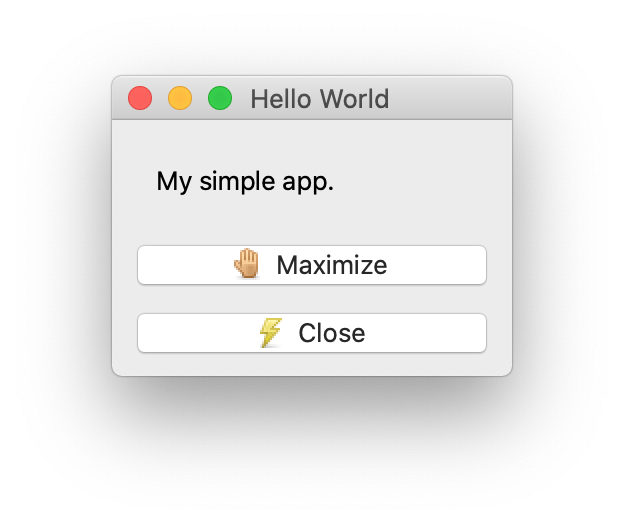
*带有两个带图标按钮的窗口。*

即使你*没有*看到图标，也请继续阅读！

#### 处理相对路径

这里有一个陷阱，可能不会立即显现出来。为了演示它，打开一个shell并切换到我们脚本所在的文件夹。用以下命令运行它：

```bash
python3 app.py
```

如果图标在正确的位置，你应该能看到它们。现在切换到父文件夹，并再次尝试运行你的脚本（将 `<folder>` 更改为你的脚本所在的文件夹名称）。

bash
```bash
cd ..
python3 <folder>/app.py
```

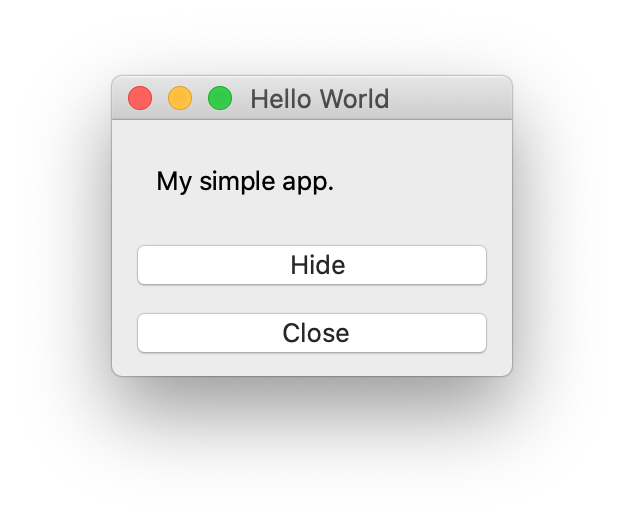
*带有两个按钮但图标缺失的窗口。*

图标*没有*出现。发生了什么？

我们正在使用*相对*路径来引用我们的数据文件。这些路径是相对于*当前工作目录*——而不是你的脚本所在的文件夹。所以如果你从其他地方运行脚本，它将无法找到文件。

> **提示**
>
> 图标不显示的一个常见原因是在IDE中运行示例，IDE使用项目根目录作为当前工作目录。

在应用打包之前，这是一个小问题，但一旦它被安装，它将以根目录 `/` 作为其*当前工作目录*来启动——你的应用将找不到任何东西。在继续之前，我们需要解决这个问题，我们可以通过使我们的路径相对于*我们的应用程序文件夹*来做到这一点。

在下面更新的代码中，我们定义了一个新变量 `basedir`，使用 `os.path.dirname` 来获取包含当前Python文件完整路径的 `__file__` 变量所在的文件夹。然后我们使用它通过 `os.path.join()` 来构建图标的相对路径。

因为我们的 `app.py` 文件在文件夹的根目录，所有其他路径都相对于它。

python
```python
from PySide6.QtWidgets import QMainWindow, QApplication, QLabel, QVBoxLayout, QPushButton, QWidget
from PySide6.QtGui import QIcon
import sys, os

basedir = os.path.dirname(__file__)

class MainWindow(QMainWindow):
    def __init__(self):
        super().__init__()
        # ...
        button1 = QPushButton("Hide")
        button1.setIcon(QIcon(os.path.join(basedir, "icons", "hand.png")))
        # ...
        button2 = QPushButton("Close")
        button2.setIcon(QIcon(os.path.join(basedir, "icons", "lightning.png")))
        # ...

if __name__ == '__main__':
    app = QApplication(sys.argv)
    w = MainWindow()
    app.exec()
```

再次尝试从父文件夹运行你的应用——你会发现无论你从哪里启动应用，按钮上的图标现在都能按预期出现。

#### 打包图标

现在我们的应用程序显示了图标，并且无论从哪里启动都能正常工作。再次用 `pyinstaller "Hello World.spec"` 打包应用程序，然后像以前一样尝试从 `dist` 文件夹运行它。你会注意到图标又不见了。


*带有两个按钮但图标缺失的窗口。*

现在的问题是图标没有被复制到 `dist/Hello World` 文件夹中——去看看吧。我们的脚本期望图标在相对于它的特定位置，如果不在，就不会显示任何东西。

这个原则同样适用于你与应用程序一起打包的任何其他数据文件，包括Qt Designer UI文件、设置文件或源数据。你需要确保在打包后，相对路径结构被复制。

#### 使用PyInstaller捆绑数据文件

为了让应用程序在打包后继续工作，它所依赖的文件需要在相同的相对位置。

要将数据文件放入 `dist` 文件夹，我们可以指示 _PyInstaller_ 将它们复制过去。_PyInstaller_ 接受一个要复制的单个路径列表，以及一个相对于 `dist/<app name>` 文件夹的路径，它应该将文件复制*到*那里。与其他选项一样，这可以通过命令行参数或在 `.spec` 文件中指定。

在命令行上指定的文件使用 `--add-data` 添加，传递源文件和目标文件夹，用冒号 `:` 分隔。

> **提示**
>
> 路径分隔符是平台相关的：Linux或Mac使用 `:`，在Windows上使用 `;`。

bash
```bash
pyinstaller --windowed --add-data "icons/hand.png:icons" --add-data "icons/lightning.png:icons" app.py
```

这里我们指定的目标位置是 `icons`。该路径是相对于我们应用程序在 `dist` 中的根文件夹的——在我们当前的应用中是 `dist/Hello World`。路径 `icons` 意味着在这个位置下的一个名为 `icons` 的文件夹，即 `dist/Hello World/icons`。正好把我们的图标放在我们的应用程序期望找到它们的地方！

你也可以通过spec文件的 `Analysis` 部分中的 `datas` 列表来指定数据文件，如下所示。

python
```python
a = Analysis(['app.py'],
             # ...
             datas=[('icons/hand.png', 'icons'), ('icons/lightning.png', 'icons')],
             # ...
             )
```

然后用以下命令从 `.spec` 文件重新构建：

bash
```bash
pyinstaller "Hello World.spec"
```

在这两种情况下，我们都告诉 _PyInstaller_ 将指定的文件复制到输出文件夹中的 `./icons/` 位置，即 `dist/Hello World/icons`。如果你运行构建，你应该会看到你的 `.png` 文件现在在 `dist` 输出文件夹中，位于一个名为 `icons` 的文件夹下。

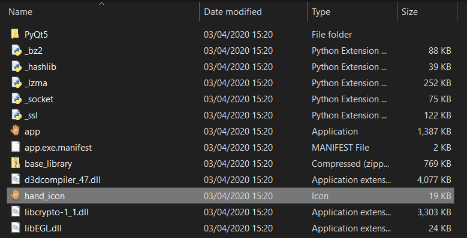
*图标文件被复制到dist文件夹*

如果你从 `dist` 运行你的应用，你现在应该能按预期在你的窗口中看到图标了！


*带有两个按钮和图标的窗口，终于成功了！*

#### 捆绑数据文件夹

通常你会有多个数据文件想要包含在打包文件中。最新版本的PyInstaller允许你像捆绑文件一样捆绑文件夹，并保持子文件夹结构。

让我们更新我们的配置，一次性捆绑我们的 `icons` 文件夹，这样即使我们将来添加更多图标，它也能继续工作。

要将 `icons` 文件夹复制到我们构建的应用程序中，我们只需要将该文件夹添加到我们 `.spec` 文件的 `Analysis` 块中。与单个文件一样，我们将其添加为一个元组，包含源路径（从我们的项目文件夹）和目标文件夹（在最终的 `dist` 文件夹下）。

python
```python
# ...
a = Analysis(['app.py'],
             # ...
             datas=[('icons', 'icons')],   # 元组是(源文件夹, 目标文件夹)
             # ...
             )
# ...
```

如果你使用这个spec文件运行构建，你会看到 `icons` 文件夹被复制到 `dist/Hello World` 文件夹中。如果你从该文件夹运行应用程序，图标将按预期显示——相对路径在新位置仍然正确。

> **提示**
>
> 或者，你可以使用Qt的QResource架构来捆绑你的数据文件。更多信息请参见[我们的教程](https://www.pythonguis.com/tutorials/qresource-system/)。

### 将应用包构建成磁盘映像

到目前为止，我们已经使用 _PyInstaller_ 将应用程序捆绑成macOS应用，并附带了相关的数据文件。这个捆绑过程的输出是一个文件夹和一个名为 `Hello World.app` 的macOS应用包。

如果你尝试分发这个应用包，你会发现一个问题：应用包实际上只是一个特殊的文件夹。虽然macOS将其显示为一个应用程序，但如果你尝试分享它，你实际上是在分享数百个单独的文件。要正确地分发应用，我们需要某种方法将其打包成单个文件。

最*简单*的方法是使用 `.zip` 文件。你可以将文件夹*压缩*成zip文件，然后把它交给别人在他们自己的电脑上解压，给他们一个完整的应用包，他们可以复制到他们的*应用程序*文件夹中。

然而，如果你以前安装过macOS应用程序，你就会知道这不是*通常*的做法。通常你会得到一个*磁盘映像* `.dmg` 文件，打开后会显示应用包和一个指向你的*应用程序*文件夹的链接。要安装应用，你只需将其拖到目标位置即可。

为了让我们的应用看起来尽可能专业，我们应该模仿这种预期的行为。接下来我们将看看如何将我们的应用包打包成一个macOS*磁盘映像*。

#### 确保构建已准备好

如果你一直跟着教程做到这里，你的应用应该已经在 `/dist` 文件夹中准备好了。如果没有，或者你的无法工作，你也可以下载[本教程的源代码文件](https://downloads.pythonguis.com/DemoAppPyInstaller.zip)，其中包含一个示例 `.spec` 文件。如上所述，你可以使用提供的 `Hello World.spec` 文件运行相同的构建。

bash
```bash
pyinstaller "Hello World.spec"
```

这将把所有东西打包成一个带有自定义图标的应用包，放在 `dist/` 文件夹中。运行该应用包以确保所有东西都已正确捆绑，你应该会看到与之前一样的带有图标的窗口。


*带有两个图标和一个按钮的窗口。*

#### 创建一个*磁盘映像*

现在我们已经成功捆绑了我们的应用程序，接下来我们将看看如何利用我们的应用包来创建一个用于分发的macOS*磁盘映像*。

为了创建我们的*磁盘映像*，我们将使用 [create-dmg](https://github.com/create-dmg/create-dmg) 工具。这是一个命令行工具，提供了一种简单的方法来自动构建磁盘映像。如果你正在使用Homebrew，你可以用以下命令安装create-dmg。

bash
```bash
brew install create-dmg
```

...否则，请参阅[Github仓库](https://github.com/create-dmg/create-dmg)获取安装说明。

`create-dmg` 工具有*很多*选项，但下面是最有用的一些。

bash
```bash
create-dmg --help
create-dmg 1.0.9

创建一个精美的DMG文件。

用法:  create-dmg [选项] <输出名.dmg> <源文件夹>

<源文件夹>的所有内容都将被复制到磁盘映像中。

选项:
  --volname <名称>
      设置卷名（显示在访达侧边栏和窗口标题中）
  --volicon <图标.icns>
      设置卷图标
  --background <图片.png>
      设置文件夹背景图片（提供png、gif或jpg）
  --window-pos <x> <y>
      设置文件夹窗口的位置
  --window-size <宽度> <高度>
      设置文件夹窗口的大小
  --text-size <文本大小>
      设置窗口文本大小（10-16）
  --icon-size <图标大小>
      设置窗口图标大小（最大128）
  --icon 文件名 <x> <y>
      设置文件图标的位置
  --hide-extension <文件名>
      隐藏文件的扩展名
  --app-drop-link <x> <y>
      在位置x,y创建一个到“应用程序”的拖放链接
  --no-internet-enable
      禁用自动挂载和复制
  --add-file <目标名> <文件>|<文件夹> <x> <y>
      添加额外的文件或文件夹（可多次使用）
  -h, --help
        显示此帮助屏幕
```

最重要的一点是，该命令需要一个 `<源文件夹>`，并且该文件夹的所有内容都将被复制到*磁盘映像*中。所以要构建映像，我们首先需要将我们的应用包单独放在一个文件夹里。

我建议创建一个shell脚本，而不是每次都手动操作。这能确保构建是可复现的，并且使配置更容易。

下面是一个用于从我们的应用创建*磁盘映像*的可工作脚本。它创建了一个临时文件夹 `dist/dmg`，我们将在其中放置我们想要放入*磁盘映像*的东西——在我们的例子中，这只是应用包，但如果你愿意，也可以添加其他文件。然后我们确保该文件夹是空的（以防它还包含上次运行的文件）。我们将我们的应用包复制到该文件夹中，最后检查 `dist` 中是否已经有 `.dmg` 文件，如果有，也将其删除。然后我们就可以运行 `create-dmg` 工具了。

bash
```bash
#!/bin/sh
# 创建一个文件夹（名为dmg）来准备我们的DMG（如果它还不存在）。
mkdir -p dist/dmg
# 清空dmg文件夹。
rm -r dist/dmg/*
# 将应用包复制到dmg文件夹。
cp -r "dist/Hello World.app" dist/dmg
# 如果DMG已经存在，则删除它。
test -f "dist/Hello World.dmg" && rm "dist/Hello World.dmg"
create-dmg \
  --volname "Hello World" \
  --volicon "Hello World.icns" \
  --window-pos 200 120 \
  --window-size 600 300 \
  --icon-size 100 \
  --icon "Hello World.app" 175 120 \
  --hide-extension "Hello World.app" \
  --app-drop-link 425 120 \
  "dist/Hello World.dmg" \
  "dist/dmg/"
```

我们传递给 `create-dmg` 的选项设置了*磁盘映像*窗口打开时的尺寸，以及其中图标的位置。

将这个shell脚本保存在你项目的根目录下，例如命名为 `builddmg.sh`。为了让它能够运行，你需要用以下命令设置*可执行位*。

```bash
chmod +x builddmg.sh
```

这样，你现在就可以用以下命令为你的Hello World应用构建一个*磁盘映像*了。

```bash
./builddmg.sh
```

这将需要几秒钟的时间来运行，并产生相当多的输出。

bash
```bash
 No such file or directory
Creating disk image...
...
Disk image done
```

在构建时，*磁盘映像*会弹出。先别太激动，它还在构建中。等待脚本完成，你会在 `dist/` 文件夹中找到完成的 `.dmg` 文件。

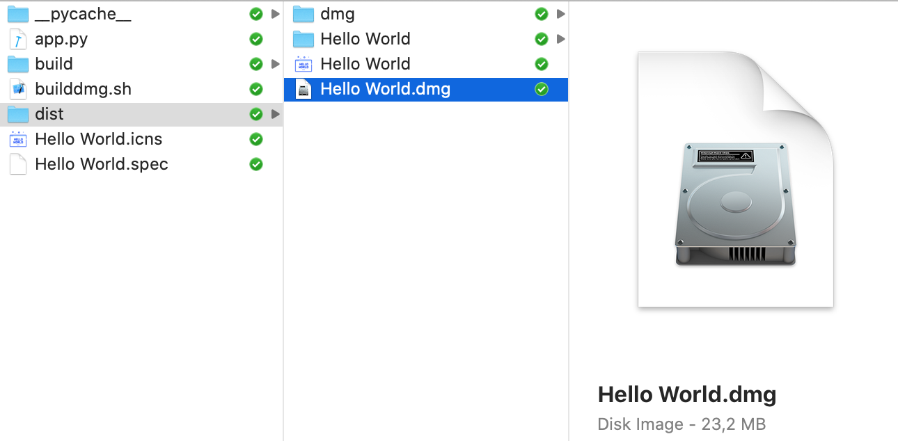
*在dist文件夹中创建的磁盘映像*

#### 运行安装程序

双击*磁盘映像*打开它，你会看到通常的macOS安装视图。点击并将你的应用拖到 `Applications` 文件夹以安装它。

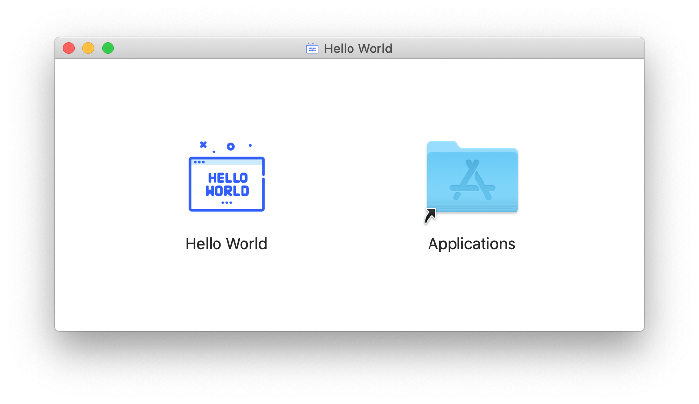
*磁盘映像包含应用包和到应用程序文件夹的快捷方式*

如果你打开*启动台*（Launchpad，按F4键），你会看到你的应用已安装。如果你的应用很多，你可以通过输入“Hello”来搜索它。

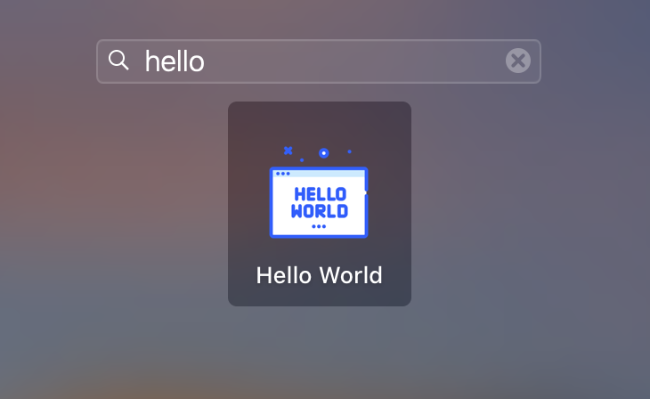
*在macOS上安装的应用*

### 重复构建

现在你已经设置好了一切，你可以随时通过在命令行中运行这两个命令来为你的应用程序创建一个新的应用包和*磁盘映像*。

bash
```bash
pyinstaller "Hello World.spec"
./builddmg.sh
```

就是这么简单！

### 总结

在本教程中，我们介绍了如何使用 _PyInstaller_ 将你的PySide6应用程序构建成一个macOS应用包，包括将数据文件与你的代码一起添加。然后我们逐步介绍了创建*磁盘映像*以将你的应用分发给他人的过程。遵循这些步骤，你应该能够打包你自己的应用程序并让其他人使用。

要全面了解所有 _PyInstaller_ 捆绑选项，请查看[PyInstaller使用文档](https://pyinstaller.readthedocs.io/en/stable/usage.html)。
