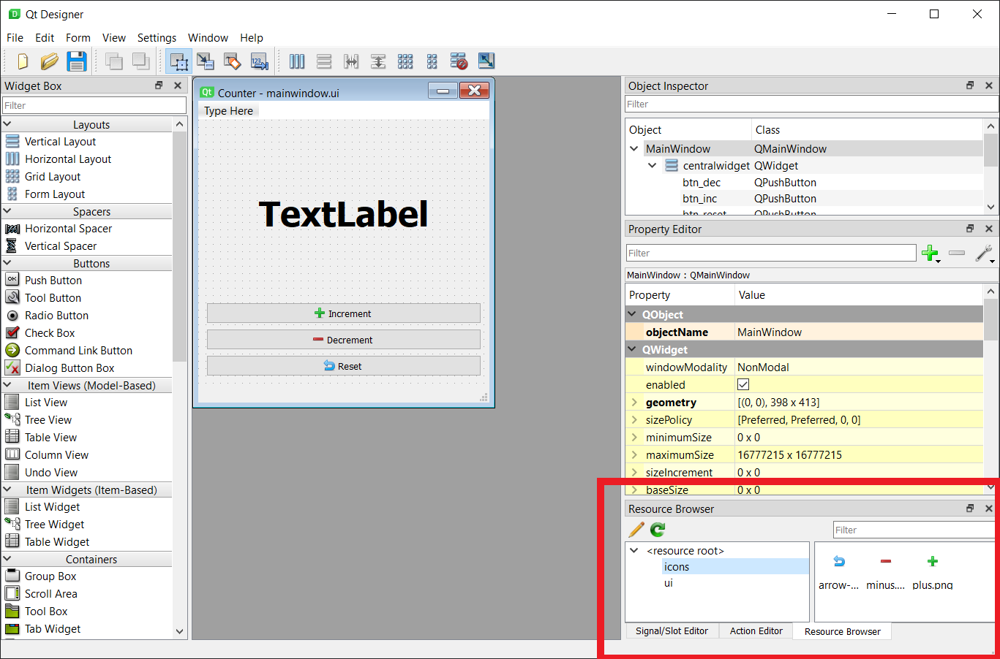
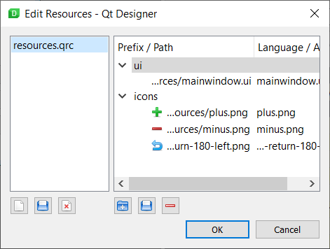
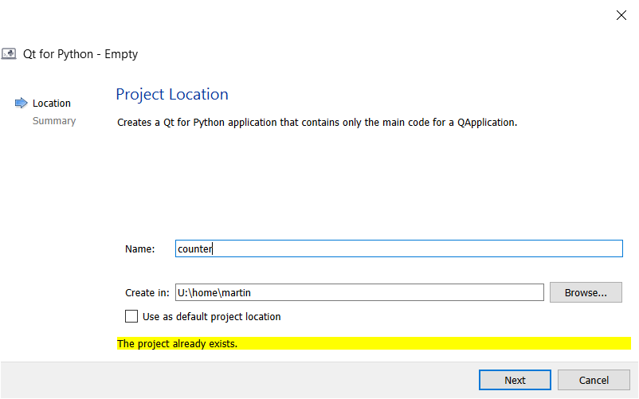

使用 *PyInstaller* 捆绑数据文件通常效果很好。然而，在使用相对路径时可能会出现问题，特别是在捆绑跨平台应用程序时，因为不同的系统对处理数据文件有不同的标准。如果您遇到这些问题，它们可能相当难以调试。

幸运的是，Qt 凭借其*资源系统*解决了这个问题。既然我们使用 Qt 来构建我们的 GUI，我们就可以利用 Qt 资源在我们的应用程序中捆绑、识别和加载资源。最终捆绑的数据会作为 Python 代码包含在您的应用程序中，因此 *PyInstaller* 会自动识别它，我们也可以确信它会出现在正确的位置。

在本节中，我们将学习如何使用 Qt 资源系统将文件与我们的应用程序捆绑在一起。

### QRC 文件

Qt 资源系统的核心是*资源文件*，即 QRC 文件。`.qrc` 文件是一个简单的 XML 文件，可以用任何文本编辑器打开和编辑。

您也可以使用 Qt Designer 创建 QRC 文件以及添加和删除资源，我们稍后将介绍这一点。

#### 简单的 QRC 示例

下面显示了一个非常简单的资源文件，其中包含一个资源（我们的应用程序图标）。

```xml
<!DOCTYPE RCC>
<RCC version="1.0">
    <qresource prefix="icons">
        <file alias="hand_icon.ico">hand_icon.ico</file>
    </qresource>
</RCC>
```

`<file>` `</file>` 标签之间的名称是文件的路径，相对于资源文件。`alias` 是此资源在您的应用程序内部被引用的名称。您可以使用它来将图标*重命名*为在您的应用中更合乎逻辑或更简单的名称，同时保持外部原始名称不变。

例如，如果我们想在内部使用名称 `application_icon.ico`，我们可以将这行代码更改为：

```xml
<file alias="application_icon.ico">hand_icon.ico</file>
```

这仅更改了您应用程序*内部*使用的名称，文件名保持不变。

此标签之外是 `qresource` 标签，它指定了一个 `prefix`。这是一个*命名空间*，可用于将资源分组在一起。这实际上是一个虚拟文件夹，所有嵌套的资源都可以在其下找到。

#### 使用 QRC 文件

要在您的应用程序中使用 `.qrc` 文件，您首先需要将其编译为 Python 文件。PySide6 附带了一个命令行工具来完成此操作，该工具以 `.qrc` 文件作为输入，并输出一个包含已编译数据的 Python 文件。然后，可以像任何其他 Python 文件或模块一样将其导入到您的应用中。

要将我们的 `resources.qrc` 文件编译成一个名为 `resources.py` 的 Python 文件，我们可以使用

```bash
pyside6-rcc resources.qrc -o resources.py
```

要在我们的应用程序中使用该资源文件，我们需要做一些小的更改。首先，我们需要在应用顶部 `import resources`，以将资源加载到 Qt 资源系统中；其次，我们需要更新图标文件的路径以使用资源路径格式，如下所示：

```python
app.setWindowIcon(QtGui.QIcon(':/icons/hand_icon.ico'))
```

前缀 `:/` 表示这是一个*资源路径*。第一个名称 "icons" 是*前缀*命名空间，文件名取自文件*别名*，这两者都在我们的 `resources.qrc` 文件中定义。

更新后的应用程序如下所示。

```python
from PySide6 import QtWidgets, QtGui

# Windows 特有的代码，用于在任务栏显示正确的应用图标
try:
    from ctypes import windll
    myappid = 'mycompany.myproduct.subproduct.version'
    windll.shell32.SetCurrentProcessExplicitAppUserModelID(myappid)
except ImportError:
    pass


import sys
import resources  # 导入编译后的资源文件。

class MainWindow(QtWidgets.QMainWindow):

    def __init__(self, *args, **kwargs):
        super().__init__(*args, **kwargs)

        self.setWindowTitle("Hello World")
        l = QtWidgets.QLabel("My simple app.")
        l.setMargin(10)
        self.setCentralWidget(l)

        self.show()

if __name__ == '__main__':
    app = QtWidgets.QApplication(sys.argv)
    # 使用资源路径设置窗口图标
    app.setWindowIcon(QtGui.QIcon(':/icons/hand_icon.ico'))
    w = MainWindow()
    app.exec()
```

您可以按如下方式运行构建，

```bash
pyinstaller --windowed --icon=hand_icon.ico app.py
```

或者使用您现有的 `.spec` 文件重新运行它。

如果您在 `dist` 目录中运行生成的应用程序，您应该会看到图标按预期工作。


*任务栏上显示的手形图标*

这种方法的优点是您的数据文件被保证会被捆绑，因为它们被视为代码——*PyInstaller* 通过您源代码中的导入找到它们。您也无需担心数据文件的平台特定位置。您只需要注意在每次从项目中添加或删除数据文件时重建 `resources.py` 文件。

当然，这种方法不适用于任何您希望最终用户可读或可编辑的文件。然而，没有什么能阻止您根据需要将这种方法与之前的方法结合使用。

### 构建示例：捆绑 Qt Designer UI 和图标

我们现在已经成功地构建了一个依赖单个外部图标文件的简单应用。现在来点更实际的！

在复杂的 Qt 应用程序中，通常使用 Qt Designer 来定义 UI，包括按钮和菜单上的图标。我们如何将 UI 文件与我们的应用程序一起分发，并确保链接的图标能按预期工作？

下面是一个我们将用来演示这一点的演示应用程序的 UI。该应用是一个简单的计数器，允许您通过单击相应的按钮来增加、减少或重置计数器。您也可以[下载源代码和相关文件](https://downloads.pythonguis.com/counter-pyinstaller-windows.zip)。


*在 Qt Designer 中创建的计数器 UI*

该 UI 由一个 `QMainWindow` 组成，其中包含一个垂直布局，其中有一个 `QLabel` 和 3 个 `QPushButton` 控件。按钮分别有“Increment”、“Decrement”和“Reset”标签，以及来自 [p.yusukekamiyamane 的 Fugue 图标集](https://p.yusukekamiyamane.com/)的图标。应用程序图标是来自 [Freepik](https://www.flaticon.com/authors/freepik/) 的免费图标。

该 UI 是如本[教程](https://www.pythonguis.com/tutorials/first-steps-qt-designer/)中所述在 Qt Designer 中创建的。

#### 资源

该项目中的图标是在 Qt Designer 中添加到按钮上的。这样做时，您有两个选择——

1.  将图标作为文件添加，并确保在安装后图标的相对路径位置保持不变（不总是可能，或有趣）
2.  使用 Qt 资源系统添加图标

在这里我们使用方法 (2)，因为它更不容易出错。

在您的 UI 中使用 Qt 资源的方法因您使用的是 Qt Creator 还是独立的 Qt Designer 而异。步骤如下所述。

##### 在 Qt Designer 中添加资源 (首选)

如果您使用的是独立的 Qt Designer，资源浏览器可作为一个可停靠的部件，默认情况下在右下角可见。如果资源浏览器被隐藏，您可以通过工具栏上的“View”菜单来显示它。

要添加、编辑和删除资源文件，请单击资源浏览器面板中的铅笔图标。这将打开资源编辑器。


*Qt Designer 资源浏览器*

在资源编辑器视图中，您可以通过单击左下角的文档文件夹图标（中间的图标）来打开一个现有的资源文件。


*Qt Designer 资源编辑器*

在上面的截图中，我们将 `.ui` 文件包含在了 QResource 捆绑包中，但我建议您将 UI 文件编译为 Python（见下文）。

在左侧面板中，您还可以从您的 UI 中创建和删除资源文件。而在右侧，您可以创建新的前缀，向前缀添加文件以及删除项目。对资源文件的更改会自动保存。

##### 在 Qt Creator 中添加资源

为了能够从 Qt Creator 内部使用 Qt 资源系统添加图标，您需要有一个活动的 Qt 项目，并将您的 UI 和资源文件都添加到其中。

如果您没有设置 Qt Creator 项目，您可以在您现有的源文件夹中创建一个。Qt Creator 在覆盖任何文件之前会提示。单击“+ New”，为项目类型选择“Qt for Python - Empty”。为“Create in”选择您的源文件夹*之上*的文件夹，并提供您的源文件夹名称作为项目名称。您可以删除任何创建的文件，除了保存项目设置的 `.pyproject`。


*当在现有文件夹中创建新的 Qt Creator 项目时，将显示此消息*

要将资源添加到您现有的项目中，请选择左侧面板上的“Edit”视图。您将在左侧面板中看到一个文件树浏览器。右键单击该文件夹并选择“Add existing files…”，然后将您现有的 `.qrc` 文件添加到项目中。


*Qt Creator “Edit” 视图，显示项目中的文件列表*

当您在此处添加/删除内容时，UI 不会更新，这似乎是 Qt Creator 的一个 bug。如果您关闭并重新打开 Qt Creator，文件就会出现。

一旦您将 QRC 文件添加到文件列表中，您应该能够像展开文件夹一样展开该文件，并浏览其中的资源。您也可以使用此界面添加和删除资源。

##### 在 Qt Creator 和 Qt Designer 中使用资源

资源文件加载后，您将能够从设计器的属性中访问它。下面的屏幕截图显示了打开了我们的计数器应用的 Designer，并选择了 *increment* 按钮。可以通过单击小的黑色向下箭头并选择“Choose Resource…”来选择按钮的图标。


*在 Qt Designer (或 Qt Creator) 中为按钮设置图标*

出现的资源选择器窗口允许您从项目中的资源文件中选择图标以在您的 UI 中使用。


*在 Qt Designer 资源对话框中选择资源*

以这种方式从资源文件中选择图标可确保它们始终有效，只要您编译并将已编译的资源文件与您的应用捆绑在一起即可。

##### 编译 UI 文件

使用资源捆绑您的 UI 的最简单方法是将它们编译为 Python 文件。生成的 Python 文件将由 PyInstaller 自动打包（一旦它被导入），并且它本身也会自动加载相关的资源文件。

```bash
pyside6-uic mainwindow.ui -o MainWindow.py
```

#### 完成的应用

下面是我们更新后的 `app.py`，它加载 `mainwindow.ui` 文件并定义了 3 个自定义槽来增加、减少和重置数字。这些槽连接到 UI 中定义的控件的信号（分别为 3 个按钮的 `btn_inc`、`btn_dec` 和 `btn_reset`）以及一个更新显示数字的方法（`QLabel` 的 `label`）。

```python
from PySide6 import QtWidgets, QtCore, QtGui
import sys
# 导入编译后的 UI 类
from MainWindow import Ui_MainWindow

try:
    from ctypes import windll
    myappid = 'mycompany.myproduct.subproduct.version'
    windll.shell32.SetCurrentProcessExplicitAppUserModelID(myappid)
except ImportError:
    pass


class MainWindow(QtWidgets.QMainWindow, Ui_MainWindow):
    def __init__(self, *args, **kwargs):
        super().__init__(*args, **kwargs)

        # 加载 UI
        self.setupUi(self)

        # 设置计数器的值
        self.counter = 0
        self.update_counter()

        # 绑定事件
        self.btn_inc.clicked.connect(self.inc)
        self.btn_dec.clicked.connect(self.dec)
        self.btn_reset.clicked.connect(self.reset)

    def update_counter(self):
        self.label.setText(str(self.counter))

    def inc(self):
        self.counter += 1
        self.update_counter()

    def dec(self):
        self.counter -= 1
        self.update_counter()

    def reset(self):
        self.counter = 0
        self.update_counter()


if __name__ == '__main__':
    app = QtWidgets.QApplication(sys.argv)
    # 假设你的 .qrc 文件中有一个别名为 counter.ico 的图标
    app.setWindowIcon(QtGui.QIcon(':/icons/counter.ico'))
    main = MainWindow()
    main.show()
    sys.exit(app.exec())
```

如果您对 `resources.qrc` 文件做了任何更改，或者尚未编译它，请现在使用 `pyside6-rcc resources.qrc -o resources.py` 进行编译。

如果您运行这个应用程序，您应该会看到以下窗口。


*计数器应用，所有图标都显示了*

我们将像以前一样使用命令行执行初始构建并为我们生成一个 `.spec` 文件来构建我们的应用。我们可以在将来使用该 `.spec` 文件来重复构建。

```bash
pyinstaller --windowed --icon=resources/counter.ico app.py
```

*PyInstaller* 将分析我们的 `app.py` 文件，将所有必要的依赖项，包括我们编译的 `resources.py` 和 `MainWindow.py`，捆绑到 `dist` 文件夹中。

构建过程完成后，打开 `dist` 文件夹并运行应用程序。您应该会发现它能正常工作，所有图标——从应用程序本身，到嵌入在我们 UI 文件中的图标——都按预期工作。


*计数器应用，所有图标都显示了*

这显示了使用这种方法的优势——如果您的应用程序在捆绑前能正常工作，您可以相当确信它在捆绑后仍能继续工作。