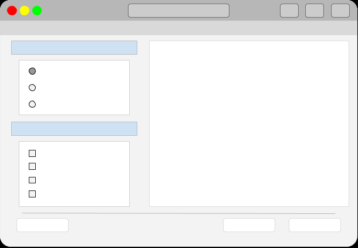
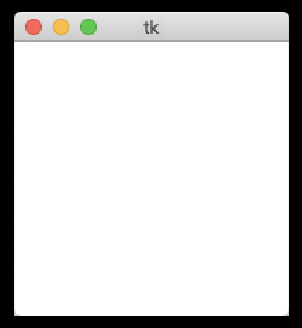
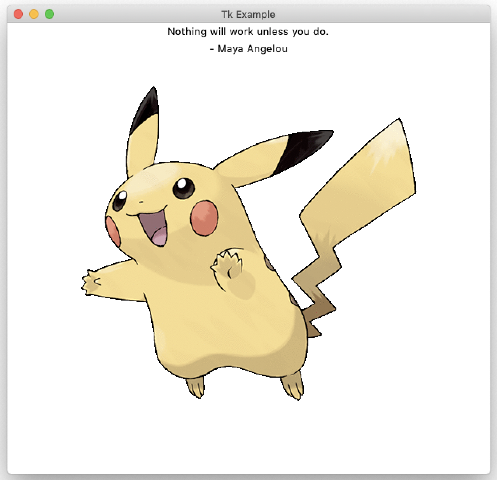

你每天都在电脑上看到各种窗口，但你是否想过如何制作一个属于自己的窗口呢？在本教程中，我们将开始使用 Tkinter 和 Python 来制作我们自己的窗口，即图形用户界面（GUI）。

一个 GUI 的大致样貌如下：



*桌面 GUI 示例*

### 什么是 GUI？

与计算机交互最常见的方式是使用图形用户界面（GUI）。这些带有按钮、图标和菜单的矩形窗口是一种直观的完成工作的方式。

在本教程中，我们将专注于使用 Python 和 Tkinter 构建我们自己的 GUI。我们将从回顾一些基础知识开始，包括创建一个窗口以及学习如何显示图像和文本。掌握了这些知识后，你就可以为创建基本的 GUI 应用程序构思自己的想法了。

### 什么是 Tkinter？

Tkinter 是 Python 的默认 GUI 包，已包含在标准库中。它是在开源的 [Tcl/Tk](https://www.tcl.tk/) 控件工具包之上的一个面向对象的层。使用它并不需要你了解 Tcl/Tk。

虽然市面上有功能更完善的 GUI 框架（例如 Qt），但对于小型项目和初学者项目来说，Tkinter 仍然很受欢迎，因为它简单且随时可用。如果你只是想尝试一下 GUI 编程，那么从这里开始是个不错的选择。


### 我们如何创建一个窗口？

让我们从基础开始：用 Tkinter 创建一个窗口。首先，创建一个名为 `app.py` 的新文件，然后添加以下代码：


```python
import tkinter as tk

root = tk.Tk()
root.mainloop()
```

第一行导入了 `tkinter` 包，并使用缩写 `tk` 以便后续少打一些字。首先，我们通过调用 `tk.Tk()` 创建了 `root` 控件对象。`root` 控件是应用的主窗口或父窗口。它必须在任何其他窗口之前创建，并且只能有一个 `root` 窗口。

最后一行运行了应用的主*事件循环*。它处理鼠标和键盘输入，并与操作系统进行通信。就这样！

像运行其他任何脚本一样，使用 `python` 运行这个脚本。

你会在屏幕上看到一个如下所示的窗口：



*一个小而空的空白窗口*

我们在桌面上拥有了第一个窗口。接下来，让我们看一些可以做的调整，比如添加标题、更改背景颜色以及设置窗口的大小：

python
```python
import tkinter as tk

root = tk.Tk()

# 设置一些窗口属性
root.title("Tk Example")
root.configure(background="yellow")
root.minsize(200, 200)
root.maxsize(500, 500)
root.geometry("300x300+50+50")

root.mainloop()
```

在这里，我们将窗口的标题更改为 `"Tk Example"`。我们还使用 `configure()` 方法将背景颜色更改为 `"yellow"`。然后，我们调整了窗口的大小，设置了窗口的最小尺寸和最大尺寸。

最后，我们来谈谈 `geometry()`。这个方法允许我们在首次运行程序时定义窗口的几何布局——这是 Tkinter 中对尺寸和形状的术语。该方法接受一个字符串，由窗口的宽度和高度以及屏幕上的 `x` 和 `y` 坐标组成。如果未提供 `x` 和 `y` 坐标，那么窗口将出现在屏幕的左上角。

### 我们如何在标签（Label）中显示文本？

在 Tkinter 中，**控件 (widget)** 是指用户可以与之交互的 UI 组件的名称。用户界面由多个控件组成，排列在一个窗口内。**标签 (Label)** 是最基本的控件之一。你可以用它们来显示文本或图像。

让我们更新我们的例子，在窗口中添加一个标签。

python
```python
import tkinter as tk

root = tk.Tk()
root.title("Tk Example")
root.minsize(200, 200)
root.geometry("300x300+50+50")

# 创建两个标签
tk.Label(root, text="Nothing will work unless you do.").pack()
tk.Label(root, text="- Maya Angelou").pack()

root.mainloop()
```

前几行代码现在已经很熟悉了，它们设置了窗口的标题、大小和几何布局。但现在我们创建了两个 `Label` 控件来显示文本。第一个参数是我们的 `root` 窗口，后面跟着我们想要显示的文本。

通过传入 `root`，我们告诉 Tkinter 这些标签属于主窗口——主窗口是它们的*父对象*。请注意，在创建标签后，我们对其调用了 `.pack()`。`.pack()` 方法是一个几何管理器，用于将控件打包或放置到当前窗口上。如果我们调整窗口大小，标签将保持在窗口的顶部中心位置。

如果你更喜欢，也可以写成如下形式——将标签对象赋给一个变量 `label1`，然后对该变量调用 `.pack()`。

python
```python
label1 = tk.Label(root, text="Nothing will work unless you do.")
label1.pack()
```

你也可以使用标签来显示图像。在 Tkinter 中有几种加载图像的方式。在这个例子中，我们将使用 `PhotoImage` 类：

python
```python
import tkinter as tk

root = tk.Tk()
root.title("Tk Example")
root.minsize(200, 200)
root.geometry("300x300+50+50")

# 创建两个标签
tk.Label(root, text="Nothing will work unless you do.").pack()
tk.Label(root, text="- Maya Angelou").pack()

# 显示一个图像
image = tk.PhotoImage(file="025.gif")
tk.Label(root, image=image).pack()

root.mainloop()
```

在这里，我们使用 `PhotoImage` 类来加载我们想要使用的图像文件。你可以将自己的图像文件路径传递给 `PhotoImage`。

然后，我们实例化 `Label` 类，并使用 `image` 参数来指定我们想要显示的图像路径。`PhotoImage` 类可以加载 GIF、PGM、PPM 和 PNG 格式的图像。对于其他图像格式，你可以使用 [Pillow](https://python-pillow.org/) 库。

现在你的窗口会是这个样子：



*带有文本和图像的窗口。*

### 总结

在本教程中，你学习了如何创建一个窗口，并使用 Tkinter 中的 `Label` 控件添加文本和图像。

学以致用非常重要。花些时间尝试一下窗口的几何布局，或者在标签上显示不同的图像和文本。