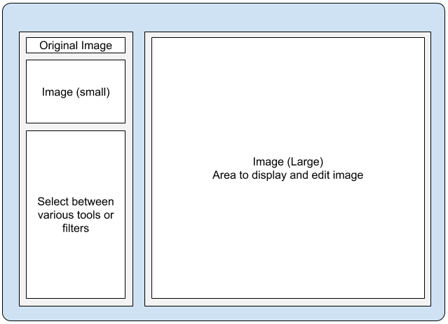

在创建 GUI 应用程序时，控件的布局或排列至关重要。布局应用程序涉及到为窗口上的控件确定一个合理的排布，以构建一个直观且用户友好的 GUI。在本教程中，你将学习如何使用 Python 中 Tkinter 的 `Frame` 控件来创建一个结构良好的布局。

### 规划应用的 GUI 布局

当你用 Tkinter 开始一个新的 GUI 项目时，最好的做法是为应用窗口上的图形组件的组织制定一个好的计划。在本教程中，你将创建一个用于管理图像的 Tkinter 应用。为了布局其 GUI，你将使用 `Frame` 控件和 [`grid`](https://www.pythonguis.com/tutorials/create-ui-with-tkinter-grid-layout-manager/) 几何管理器。

下面是一张勾勒出 GUI 布局的示意图：



*图像编辑器规划的 GUI 设计草图*

右侧的大区域将显示目标图像。在 GUI 的左上方，一个小标签将让你随时查看原始图像的样子以供参考。在其下方，有一些用于编辑图像的基本选项。

Tkinter 的 `Frame` 控件可以让你快速组织 GUI。Frame（框架）就像父窗口内的盒子或迷你窗口。要在 Tkinter 窗口中排列一个框架，你可以根据需要使用任何可用的几何管理器：`pack`、`grid` 或 `place`。

这里有一个快速的例子，你将一个框架放置在一个蓝色背景的窗口上，这样你就可以区分出这个框架：

python
```python
import tkinter as tk

root = tk.Tk()
root.title("Frame Demo")
root.config(bg="skyblue")

# 创建 Frame 控件
frame = tk.Frame(root, width=200, height=200)
frame.pack(padx=10, pady=10)

root.mainloop()
```

在这里，我们导入 `tkinter` 并命名为 `tk`，然后设置了 `root` 窗口。接着，我们创建了一个 `Frame` 的实例。为此，我们指定了 `width` 和 `height` 为 `200` 像素。`root` 窗口有一个天蓝色的背景，这让你能看到白色的新框架。你也可以将 `Frame` 控件的颜色更改为你需要的任何颜色。

接下来，我们使用 `pack` 几何管理器将 `frame` 放置在主窗口中，并在 `x` 和 `y` 两个方向上都设置了 `10` 像素的内边距。

去运行这个演示应用吧。你会得到一个看起来像下面这样的窗口：


*一个带有蓝色背景和白色框架的 Tkinter 窗口*

就是这样！你已经使用 `pack` 几何管理器创建并向一个 Tkinter 应用添加了一个空框架。

### 创建嵌套框架

现在，让我们快速看一下如何在一个框架内添加另一个框架：

python
```python
import tkinter as tk

root = tk.Tk()
root.title("Nested Frames")
root.config(bg="skyblue")

frame = tk.Frame(root, width=200, height=200)
frame.pack(padx=10, pady=10)

nested_frame = tk.Frame(frame, width=190, height=190, bg="red")
nested_frame.pack(padx=10, pady=10)

root.mainloop()
```


*一个嵌套在另一个框架内的 Tkinter 框架*

要在一个框架内嵌套另一个框架，你需要将外部框架设置为内部框架的父控件或主控件。在这个例子中，你将内部框架的背景颜色设置为红色，这样你就可以将它与白色的外部框架区分开来。

### 使用 `Frame` 创建 GUI 布局

在本节中，我们将使用 `Frame` 类来创建一个更精细的 GUI 布局。我们将为一个基础的图像编辑器应用创建一个 GUI。该应用的 GUI 将会是这个样子：


*一个基于 Tkinter 框架的 GUI 布局的图像编辑器*

下面是使用 Tkinter 中的 `Frame` 实现这个布局的代码：

python
```python
import tkinter as tk
from tkinter import ttk

root = tk.Tk()
root.title("Image Editor")

image = tk.PhotoImage(file="forest.png")

# 工具框架
tools_frame = tk.Frame(root, width=200, height=400, bg="skyblue")
tools_frame.pack(padx=5, pady=5, side=tk.LEFT, fill=tk.Y)
tk.Label(
    tools_frame,
    text="Original Image",
    bg="skyblue",
).pack(padx=5, pady=5)
thumbnail_image = image.subsample(5, 5)
tk.Label(tools_frame, image=thumbnail_image).pack(padx=5, pady=5)

# 工具和滤镜选项卡
notebook = ttk.Notebook(tools_frame)
notebook.pack(expand=True, fill="both")

tools_tab = tk.Frame(notebook, bg="lightblue")
tools_var = tk.StringVar(value="None")
for tool in ["Resizing", "Rotating"]:
    tk.Radiobutton(
        tools_tab,
        text=tool,
        variable=tools_var,
        value=tool,
        bg="lightblue",
    ).pack(anchor="w", padx=20, pady=5)

filters_tab = tk.Frame(notebook, bg="lightgreen")
filters_var = tk.StringVar(value="None")
for filter in ["Blurring", "Sharpening"]:
    tk.Radiobutton(
        filters_tab,
        text=filter,
        variable=filters_var,
        value=filter,
        bg="lightgreen",
    ).pack(anchor="w", padx=20, pady=5)

notebook.add(tools_tab, text="Tools")
notebook.add(filters_tab, text="Filters")

# 图像框架
image_frame = tk.Frame(root, width=400, height=400, bg="grey")
image_frame.pack(padx=5, pady=5, side=tk.RIGHT)
display_image = image.subsample(2, 2)
tk.Label(
    image_frame,
    text="Edited Image",
    bg="grey",
    fg="white",
).pack(padx=5, pady=5)
tk.Label(image_frame, image=display_image).pack(padx=5, pady=5)

root.mainloop()
```

在这个例子中，我们使用 Tkinter 为一个基础的图像编辑器创建了一个 GUI。代码利用 `Frame` 控件将 GUI 布局分为两个主要部分。`tools_frame` 部分存放图像编辑工具和滤镜。`image_frame` 部分显示编辑后的图像。

窗口左侧的 `tools_frame` 框架（`side=tk.LEFT`）作为一个垂直容器，用于存放工具和滤镜。它包含一个用于显示原始图像的标签和一个用于选项卡的 `Notebook` 控件。在 Notebook 内部，你使用了另外两个 `Frame` 控件，`tools_tab` 和 `filters_tab`，来对相关的单选按钮进行分组。工具选项卡包含像 `"Resizing"`（调整大小）和 `"Rotating"`（旋转）这样的选项，而滤镜选项卡则包括 `"Blurring"`（模糊）和 `"Sharpening"`（锐化）。

右侧的 `image_frame` 框架（`side=tk.RIGHT`）显示编辑后的图像。它包含一个通用标题的标签和另一个用于目标图像的标签。

通过将这个框架与 `tools_frame` 框架并排放置，布局在视觉上将工作区分成了两个区域：一个用于与工具和滤镜交互，另一个用于查看图像。

### 总结

我们已经学到，使用 `Frame` 控件是为 GUI 应用定义一个功能性布局的好方法。在创建布局时，我们应该决定使用哪个几何管理器。在 Tkinter 中，我们有 `pack`、`grid` 或 `place` 几何管理器。你也可以根据需要组合使用它们。

`Frame` 控件充当一个容器，让我们能够将相关的控件组合在一起，并控制它们的排列。它是用 Tkinter 创建组织良好的 GUI 的一个绝佳工具。