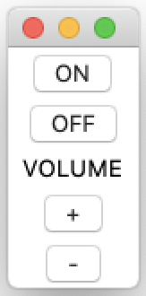
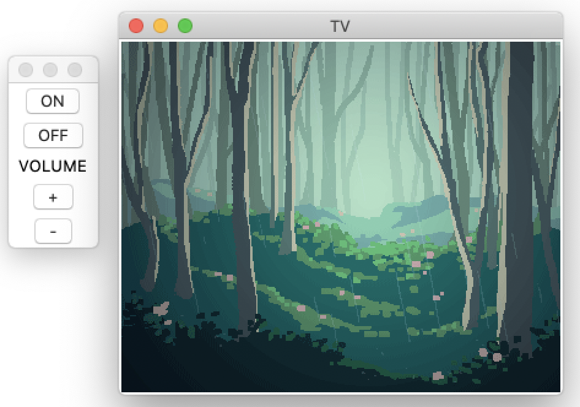
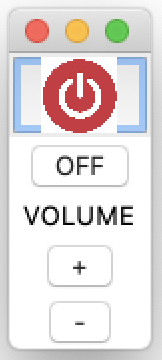

在物理设备中，我们通过按下按钮来直接执行操作。例如，按下电视遥控器上的“ON”按钮会打开电视。电梯里的按钮？按下楼层数字即可到达该楼层。当我们按下按钮时，我们期望*某件事*会发生。在图形用户界面中，按钮的使用方式是相同的。点击此窗口顶角的 `X` 按钮（在 macOS 上是红色圆点），您就会关闭它。

在本教程中，我们将学习如何使用 `Button` 控件在我们的 Tkinter 应用程序中利用按钮。读完本教程后，您将能够在您的 Tkinter GUI 中包含按钮，将这些按钮连接到 Python 函数以实现功能，并学习如何自定义它们以适应您的项目。


*让我们按下那个按钮！*

Tkinter 中的按钮正如预期那样工作：您按下一个按钮来执行某个动作。在 Tkinter 中，按钮执行的动作由 Python 函数或方法来处理。首先，让我们构建一个包含一些按钮的简单界面，然后我们再开始添加功能。

我们可以使用 `Button` 类，通过以下代码创建一个极简的电视遥控器：

```python
import tkinter as tk

# 创建主窗口
root = tk.Tk()

# 创建一个电视遥控器 UI
turn_on = tk.Button(root, text="ON")
turn_on.pack()

# 此处的 command 参数类似于 Qt 中的 a.triggered.connect(app.quit)
turn_off = tk.Button(root, text="OFF", command=root.destroy)
turn_off.pack()

volume = tk.Label(root, text="VOLUME")
volume.pack()

vol_up = tk.Button(root, text="+")
vol_up.pack()

vol_down = tk.Button(root, text="-")
vol_down.pack()

# 启动 Tkinter 的事件循环，相当于 Qt 的 app.exec()
root.mainloop()
```

在这个例子中，我们创建了四个按钮和一个标签。我们在代码中创建它们的顺序，就是它们将出现在窗口上的顺序。我们使用 `Button` 类创建了 `turn_on` 按钮。

第一个参数是主窗口 `root`，第二个参数是我们想要在按钮上显示的文本，对于第一个按钮是 `"ON"`。然后，我们使用 `pack` 几何管理器将按钮显示在 `root` 窗口中。

我们以类似的方式创建了 `turn_off`、`vol_up` 和 `vol_down` 按钮，并用 `pack()` 将它们放置好。这些按钮中只有一个，即 `turn_off`，会执行操作，因为我们使用了 `command` 关键字参数，使该按钮调用 `root.destroy()`，这会立即关闭 `root` 窗口。



*电视遥控器 UI*

如果您正在开发自己的 GUI，并且有一些按钮暂时还不需要执行任何操作，有一种方法可以使按钮变为非活动状态。只需添加 `state=tk.DISABLED` 作为参数之一，该按钮就无法被点击了。这类似于 Qt 控件的 `setEnabled(False)`。

接下来，我们将为每个按钮添加功能，并学习如何改变它们的外观。

### 让按钮在点击时执行操作

上面，我们有三个按钮暂时还不起作用。让我们从创建一个函数开始，然后设置一个按钮来调用它：

```python
import tkinter as tk

# 创建主窗口
root = tk.Tk()

def volume_up():
    print("音量增加 +1")

# 创建音量增加按钮
# 'command' 参数指定了点击时要调用的函数
vol_up = tk.Button(root, text="+", command=volume_up)
vol_up.pack()

root.mainloop()
```

每当窗口中的 `vol_up` 按钮被点击时，`volume_up()` 函数就会被调用。这在概念上与 Qt 的信号与槽机制非常相似，其中按钮的 `clicked` 信号会连接到一个槽（一个 Python 函数或方法）。

现在我们对如何使用 `Button` 控件有了基本的了解，下一步是为我们的电视遥控器添加更多功能。当 `turn_on` 按钮被点击时，让我们创建一个新窗口来打开并显示一张图片。对于 `vol_down`，为了简单起见，我们也让它打印一条消息。以下代码展示了这一点，每个按钮都有一个 `command` 参数：

```python
import tkinter as tk

root = tk.Tk()
# Tkinter 的 PhotoImage 对 GIF 格式有很好的支持
image = tk.PhotoImage(file="rain.gif")

def turn_tv_on():
    # Toplevel 创建一个新窗口，类似于 Qt 中的 QWidget 或 QDialog
    window = tk.Toplevel(root)
    window.title("TV")
    original_image = tk.Label(window, image=image)
    original_image.pack()

def volume_up():
    print("音量增加 +1")

def volume_down():
    print("音量减少 -1")

turn_on = tk.Button(root, text="ON", command=turn_tv_on)
turn_on.pack()

turn_off = tk.Button(root, text="OFF", command=root.destroy)
turn_off.pack()

volume = tk.Label(root, text="VOLUME")
volume.pack()

vol_up = tk.Button(root, text="+", command=volume_up)
vol_up.pack()

vol_down = tk.Button(root, text="-", command=volume_down)
vol_down.pack()

root.mainloop()
```

现在，我们有两个函数来控制音量，一个函数来打开电视。下一步是将适当的函数传递给我们按钮的 `command` 参数。以下是当我们点击 *ON* 按钮时发生的情况：


*通过点击按钮“打开”电视窗口*

当音量按钮被点击时，终端将显示以下输出：

**终端输出**
```
音量增加 +1
音量减少 -1
```
这个技巧对于测试您的按钮是否正常工作或从函数调用中获取反馈非常有用。

### 探索其他按钮参数

`Button` 类还有一些其他的选项。让我们看一些更常用的。许多这些参数可以帮助您创建外观漂亮或与我们 GUI 风格完美融合的按钮。

>  `tkinter.ttk` 模块提供了 Tkinter 基本控件的主题化版本，它们通常看起来更现代化，更接近操作系统的原生外观。这类似于 Qt 中使用不同的样式（如 "Fusion", "Windows"）来改变应用程序的整体观感。

以下是一些最常用于创建按钮的参数：

1.  `activebackground` 和 `activeforeground`: 设置当光标悬停在按钮上时的背景色和前景色。
2.  `bd`: 设置按钮边框的宽度（以像素为单位）。
3.  `bg` 和 `fg`: 设置背景色和前景色。
4.  `font`: 定义用于按钮文本的字体。
5.  `height` 和 `width`: 设置按钮的高度和宽度。
6.  `image`: 在按钮上显示一个图像，可以替代文本或与文本一起显示。

### 在按钮上显示图像

最后，让我们展示如何在按钮上添加图像。修改上面 `"ON"` 按钮的代码，以下代码将在按钮上显示一个图像而不是文本。

```python
# 加载图像文件
photo = tk.PhotoImage(file="on-button.gif")
# 使用 subsample 进行缩放 (例如，缩小10倍)
photo = photo.subsample(10, 10)

# 创建按钮时使用 image 参数
turn_on = tk.Button(root, image=photo, command=turn_tv_on)
turn_on.pack()
```

在这里，我们使用 `PhotoImage` 加载图像。然后，我们使用 `subsample()` 方法调整图像大小。最后，我们移除了早先的 `text="ON"` 参数，并添加了 `image=photo`。

我们的 GUI 现在看起来会是这样：


*带有图像的 ON 按钮*

### 总结

在本教程中，您学习了如何在 Tkinter 应用程序中创建按钮。您已将这些按钮添加到您的 UI 中，然后将它们连接到处理函数以实现功能。您还学习了如何通过添加图像来自定义按钮的外观。现在，您应该能够将功能性按钮添加到您自己的应用程序中了。