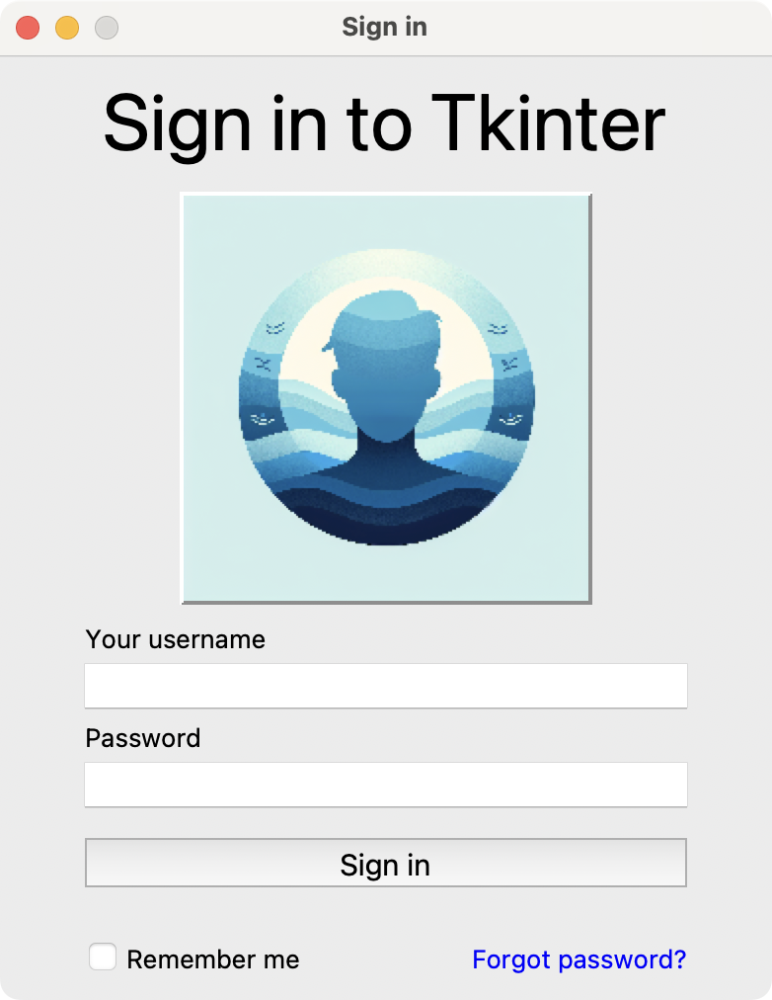

当我们创建图形用户界面（GUI）时，我们需要一种方法来在窗口上排列控件（widgets）。使用它们的相对位置来放置控件可能很繁琐，并且难以正确实现。我们需要计算每个控件相对于其他控件的位置来构建GUI。不幸的是，每次我们调整窗口大小时，都必须重新计算位置。

在Tkinter中，我们可以使用**几何管理器**优雅地解决这个问题。Tkinter有一些有用的几何管理器，包括`pack`、`place`和`grid`。它们中的每一个都允许我们以不同的方式排列控件。

> 这段描述准确地指出了手动计算控件位置的痛点，这也是所有现代GUI框架（包括Qt）都提供高级布局管理器的原因。在Qt中，我们有`QVBoxLayout`、`QHBoxLayout`、`QGridLayout`和`QFormLayout`等，它们的功能和理念与Tkinter的`pack`、`grid`等是相通的，都是为了实现动态、自适应的布局。

### `pack` 几何管理器

`pack`几何管理器将每个单独的控件变成一个称为**包裹（parcel）**的矩形区域。每个控件都有自己的大小，`pack`允许您将它们全部垂直或水平地排列在一起。

每个控件都有自己的大小，您可以更改它以更好地满足您的需求。一旦您确定了控件的期望大小，`pack`管理器就会将其排列在窗口中。

默认情况下，`pack`几何管理器将控件垂直地堆叠在一起。您也可以通过将`side`参数更改为`"left"`、`"right"`或等效的常量`tkinter.LEFT`和`tkinter.RIGHT`来实现水平布局。您还可以更改控件的高度、宽度和位置。

> `pack`的行为方式非常类似于Qt中的`QVBoxLayout`（垂直堆叠）和`QHBoxLayout`（水平堆叠）的组合。通过设置`side`参数，可以在一个方向上添加控件，直到空间被填满或遇到另一个方向的控件。Qt的布局管理器通常更具结构性，您会将控件添加到一个特定的布局对象中，而不是直接在控件上调用布局方法。

下面列出了`pack`管理器一些更有用的参数：

*   `side`: 指定控件在窗口中的大致位置。其可能的值是`"top"` (默认), `"bottom"`, `"left"`, `"right"`。
*   `fill`: 定义您希望控件在父窗口中填充的方向。它可以是`"x"`或`"y"`方向，或`"both"`。
*   `padx`, `pady`: 表示围绕控件作为内边距的像素数。
*   `ipadx`, `ipady`: 定义控件内部的水平或垂直内边距。
*   `expand`: 如果设置为`True`，当父窗口扩展时，控件会伸展。
*   `anchor`: 定义控件在父控件中的放置位置。它可以是`"n"` (北), `"s"` (南), `"e"` (东), `"w"` (西), 或它们的某种组合。默认值是`"center"`。

### 一个使用 `pack` 的演示GUI

`pack`几何管理器对于不同类型的GUI都很有用。下面是一个如何创建GUI并使用`pack`在窗口中排列控件的快速示例：

```python
import tkinter as tk

root = tk.Tk()
root.title("Pack几何管理器")
root.geometry("340x100")

# 默认 side="top"
tk.Button(root, text="顶部的按钮!").pack()

tk.Label(root, text="你好, 左边!").pack(side="left")
tk.Label(root, text="你好, 右边!").pack(side="right")

tk.Checkbutton(
    root,
    text="一个在底部的选项!",
).pack(side=tk.BOTTOM)

root.mainloop()
```

在这个例子中，我们首先将`tkinter`导入为`tk`。然后，我们构建一个带有一个主窗口的应用，该窗口有一个标题和固定的大小`(340x100)`。

接下来，我们使用pack几何管理器在指定位置排列控件。一个带有文本`"顶部的按钮!"`的按钮默认出现在顶部，后面跟着两个标签：`"你好, 左边!"`对齐到左边，`"你好, 右边!"`对齐到右边。

在窗口的底部，我们有一个标记为`"一个在底部的选项!"`的复选按钮，使用`side=tk.BOTTOM`放置。程序通过`mainloop()`运行，看起来如下所示：


*在Tkinter中使用pack几何管理器的演示GUI*

> 这个例子很好地展示了`pack`的基本用法。需要注意的是，`pack`的布局行为是相对于已打包控件的剩余空间。首先打包的`Top Button`占据了顶部空间，然后`Hello, Left!`占据了剩余空间的左侧，`Hello, Right!`占据了再剩余空间的右侧，最后`Checkbutton`占据了最底部。这种“蚕食”剩余空间的方式有时会导致布局结果不直观，这也是为什么对于更复杂的网格状布局，`grid`（或Qt中的`QGridLayout`）通常是更好的选择。

### 一个使用 `pack` 的登录表单

现在来看一个更实际的例子。假设您需要创建一个登录对话框。该对话框的GUI应该看起来像下面这样：



*使用Tkinter的pack几何管理器创建的登录表单*

现在让我们来看一下登录UI的代码：

```python
import tkinter as tk
from tkinter import messagebox

root = tk.Tk()
root.title("登录")
# 禁止窗口大小调整，类似于 Qt 的 setFixedSize()
root.resizable(False, False)

tk.Label(
    root,
    text="登录到Tkinter",
    font=("Helvetica", 20), # 字体设置
).pack(ipady=5, fill="x") # ipady增加内部垂直填充，fill="x"水平填充

# 使用PhotoImage加载图像，subsample进行缩放
# 假设 "profile.png" 文件存在于脚本目录
try:
    image = tk.PhotoImage(file="profile.png").subsample(5, 5)
    tk.Label(
        root,
        image=image,
        relief=tk.RAISED, # 边框样式
    ).pack(pady=5)
except tk.TclError:
    # 如果图片文件不存在，则不显示图片
    pass

def check_input():
    secret_username = "username"
    secret_password = "password"
    username = username_entry.get()
    password = password_entry.get()
    if username == secret_username and password == secret_password:
        messagebox.showinfo("信息", "用户已登录!")
    else:
        messagebox.showerror("错误", "无效的用户名或密码")

# 用户名和密码输入
tk.Label(root, text="您的用户名").pack(anchor="w", padx=30)
username_entry = tk.Entry(root)
username_entry.pack()
tk.Label(root, text="密码").pack(anchor="w", padx=30)
# Entry的show="*"可以隐藏密码输入，类似于QLineEdit的setEchoMode
password_entry = tk.Entry(root, show="*")
password_entry.pack()

# 登录按钮
tk.Button(
    root,
    text="登录",
    command=check_input,
    width=18,
).pack(pady=10, padx=30, fill="x")

# “记住我”和“忘记密码”
tk.Checkbutton(
    root,
    text="记住我",
    command=lambda: print("复选框起作用了。"),
).pack(side="left", padx=20, pady=5)
tk.Label(
    root,
    text="忘记密码?",
    fg="blue",
    cursor="hand2", # 鼠标悬停时变为手形光标
).pack(side="right", padx=20, pady=5)

root.mainloop()
```

在这个例子中，您为一个登录表单创建了一个图形用户界面。`pack`几何管理器被用来组织控件。它根据控件创建的顺序相对地在窗口中排列它们。

在第一个`Label`控件中，`pack`方法使用了`ipady`和`fill`参数来添加垂直内部填充并水平拉伸该控件(`fill="x"`)。类似地，第二个`Label`控件显示一张个人资料图片，其中`pady=5`在其周围添加了垂直间距。

对于用户名和密码字段，`pack`将标签和输入控件以简单的垂直堆叠方式排列。每个标签都通过`anchor="w"`和`padx=30`向左对齐，这从窗口左边缘添加了水平填充。相应的`Entry`控件直接打包在其标签下方，没有额外的参数。

*登录*按钮打包时带有`pady=10`和`padx=30`以添加间距，而`fill="x"`确保它水平拉伸以匹配窗口的宽度。

底部部分包含一个`Checkbutton`（`"记住我"`）和一个`Label`（`"忘记密码?"`）。`pack`几何管理器使用`side="left"`和`side="right"`将这些控件水平地放置在窗口的相对两侧。

> 这个例子展示了如何通过混合垂直和水平的`pack`来创建更复杂的布局。注意到最后的`Checkbutton`和`Label`是如何被放置在底部的同一行上的。这是因为在它们之前的控件都是垂直堆叠的，当遇到`side="left"`时，`pack`开始在剩余的底部空间内从左到右填充。在Qt中，我们会使用一个`QHBoxLayout`来包含这两个控件，然后再将这个水平布局添加到主窗口的垂直布局中，这样结构会更清晰。尽管如此，对于这个相对简单的表单，`pack`的表现还是相当不错的。

### 总结

在本教程中，我们学习了如何使用`pack`几何管理器在基于Tkinter的GUI中排列控件。

首先，我们看了一些可以帮助我们操纵GUI几何或布局的`pack()`参数。然后，我们构建了一个通用的GUI来帮助我们练习在Tkinter中使用`pack`进行几何管理的概念。

最后，我们使用`pack`几何管理器来排列控件并构建GUI，创建了一个登录表单。