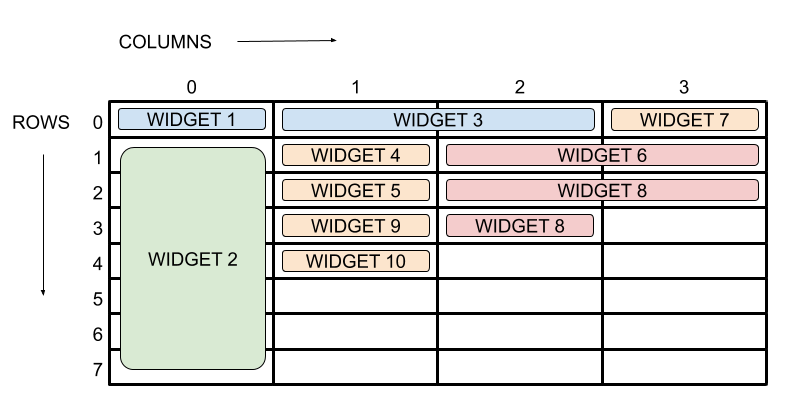
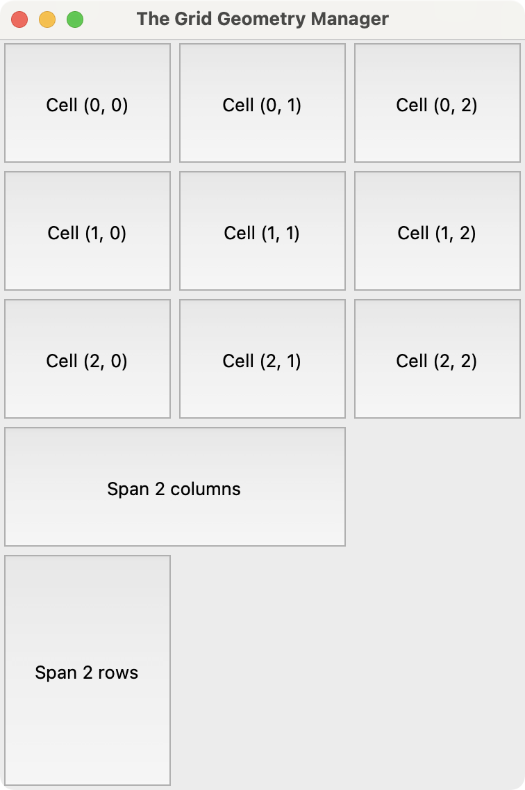
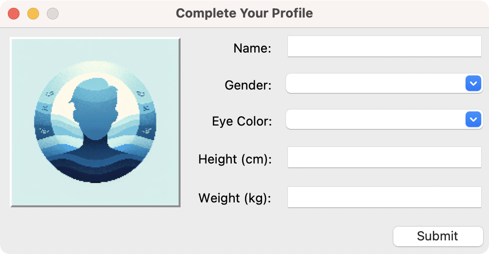

在本教程中，我们将探讨如何在 Tkinter 中使用 `grid` 几何管理器来排列控件。

在类似的其他教程中，我们讨论了使用其他几何管理器设计 GUI 布局的方法。请查阅以下教程以了解更多信息：

*   [使用 Tkinter 的 Pack 创建 UI](https://www.pythonguis.com/tutorials/create-ui-with-tkinter-pack-layout-manager/)
*   [何时使用 Pack、Place 或 Grid](https://www.pythonguis.com/faq/pack-place-and-grid-in-tkinter/)

因此，在本教程中，我们将直接进入更多使用 Tkinter 和 `grid` 几何管理器设计 GUI 的示例。

### `grid` 几何管理器

使用 `grid` 几何管理器的工作方式就像一个矩阵，有行和列。左上角的单元格其行索引为 `0`，列索引为 `0`。如果向右移动，你将得到单元格 `(0, 1)`、`(0, 2)` 等。如果向下移动，你将得到单元格 `(1, 0)`、`(2, 0)` 等。

请看下面的图示以获得一个直观的例子：



*Tkinter 中的 grid 几何管理器*

你可以通过指定控件的行和列索引来将其放置在单元格内。现在，让我们来研究一些可以帮助你使用 `grid` 几何管理器排列控件的主要参数：

*   `row`, `column`: 指定放置给定控件的行和列索引
*   `columnspan`, `rowspan`: 指定一个控件将占据多少列或多少行
*   `padx`, `pady`: 定义水平或垂直方向的外部填充像素数
*   `ipadx`, `ipady`: 指定用于内部填充的像素数
*   `sticky`: 指定控件将*粘附*到单元格的哪一侧

`sticky` 参数可以取 `S`、`N`、`E` 或 `W`，分别代表南、北、东、西。它也可以是它们的组合，如 `NW`、`NE`、`SW` 或 `SE`。如果你使用 `W+E+N+S`，那么控件将填满整个单元格。默认行为是将控件居中放置在单元格内。

### 一个使用 `grid` 的演示 GUI

下面是一个快速示例，演示了如何使用 Tkinter 中的 `grid` 几何管理器来布局一个窗口。在下面的 GUI 中，我们组合了 `Button` 控件来展示 `grid` 的一些特性：



*在 Tkinter 中使用 grid 几何管理器的演示 GUI*

让我们看看代码是什么样子的：


```python
import tkinter as tk

root = tk.Tk()
root.title("The Grid Geometry Manager")

for row in range(3):
    for col in range(3):
        tk.Button(
            root,
            text=f"Cell ({row}, {col})",
            width=10,
            height=5,
        ).grid(row=row, column=col)

tk.Button(root, text="Span 2 columns", height=5).grid(
    row=3,
    column=0,
    columnspan=2,
    sticky="ew",
)
tk.Button(root, text="Span 2 rows", width=10, height=10).grid(
    row=4,
    column=0,
    rowspan=2,
    sticky="ns",
)

root.mainloop()
```

在这个例子中，我们首先运行循环来创建一个 3x3 的按钮网格。外部循环定义了行索引，而内部循环定义了列索引。

接下来，我们创建了一个跨越两列的按钮和另一个跨越两行的按钮。为此，我们分别使用了 `columnspan` 和 `rowspan` 参数。

### 一个使用 `grid` 的个人资料表单

现在是时候来看一个更实际的例子了。假设你需要创建一个对话框来收集系统中已注册用户的个人信息。该对话框的 GUI 应该看起来像下面这样：



*在 Tkinter 中使用 grid 几何管理器的个人资料表单*

这个 GUI 使用了 `Label`、`Entry` 和 `Menu` (Combobox) 控件。为了排列这些控件并构建表单布局，你将使用 `grid` 几何管理器：

python
```python
import tkinter as tk
from tkinter import ttk

root = tk.Tk()
root.title("Complete Your Profile")
root.resizable(False, False)

# 个人资料图片
image = tk.PhotoImage(file="profile.png").subsample(6, 6)
tk.Label(
    root,
    image=image,
    relief=tk.RAISED,
).grid(row=0, column=0, rowspan=5, padx=10, pady=10)

# 姓名栏
tk.Label(
    root,
    text="Name:",
).grid(row=0, column=1, padx=5, pady=5, sticky=tk.E)
name = ttk.Entry(root)
name.grid(row=0, column=2, padx=5, pady=5, ipadx=5)

# 性别栏
tk.Label(
    root,
    text="Gender:",
).grid(row=1, column=1, padx=5, pady=5, sticky=tk.E)
gender = ttk.Combobox(
    root,
    values=["Male", "Female", "Other"],
    state="readonly",
)
gender.grid(row=1, column=2, padx=5, pady=5)

# 眼睛颜色栏
tk.Label(
    root,
    text="Eye Color:",
).grid(row=2, column=1, padx=5, pady=5, sticky=tk.E)
eye_color = ttk.Combobox(
    root,
    values=["Brown", "Green", "Blue", "Black", "Other"],
    state="readonly",
)
eye_color.grid(row=2, column=2, padx=5, pady=5)

# 身高栏
tk.Label(
    root,
    text="Height (cm):",
).grid(row=3, column=1, padx=5, pady=5, sticky=tk.E)
height = ttk.Entry(root)
height.grid(row=3, column=2, padx=5, pady=5, ipadx=5)

# 体重栏
tk.Label(
    root,
    text="Weight (kg):",
).grid(row=4, column=1, padx=5, pady=5, sticky=tk.E)
weight = ttk.Entry(root)
weight.grid(row=4, column=2, padx=5, pady=5, ipadx=5)

# 提交按钮
submit = ttk.Button(
    root,
    text="Submit",
)
submit.grid(row=5, column=2, padx=5, pady=5, sticky=tk.E)

root.mainloop()
```

在这段代码中，我们为一个个人资料表单创建了一个基础的 GUI，允许用户输入他们的姓名、性别、眼睛颜色、身高和体重。

这段代码中的第一个控件是一个带有占位符个人资料图片的标签。为了创建这个图像，我们使用了 `tk.PhotoImage`，它加载了名为 `profile.png` 的图像文件。然后，我们将这个标签放置在网格的第一行（`row=0`）和第一列（`column=0`）。该标签跨越了 `5` 行，以便在其右侧容纳表单的其余元素。

接下来，我们在第一行第二列创建了一个文本为 `"Name:"` 的标签，通过设置 `sticky` 为 `tk.E` 将其向右对齐。`name` 输入框为用户的姓名提供了一个输入字段。我们将 `name` 输入框放置在网格的第一行第三列。

然后，在第二行，我们有一个 `"Gender"` 的标签。在这个标签的右侧，我们有一个组合框（combo box），它提供了一个性别选项的下拉列表。`grid` 几何管理器将性别下拉列表放置在第二行第三列。

我们为眼睛颜色、身高和体重字段创建了类似的控件组合。我们使用 `grid` 几何管理器将每个控件放置在正确的单元格中。

最后，我们添加了一个*提交*按钮，我们将其放置在第六行第三列，并用 `sticky=tk.E` 将其向右对齐。

### 总结

在本教程中，我们学习了如何使用 `grid` 几何管理器来排列基于 Tkinter 的 GUI 中的控件。

首先，我们看了一些 `grid()` 的参数，这些参数可以帮助我们操纵 GUI 的几何形状或布局。然后，我们构建了一个通用的 GUI 来帮助我们练习在 Tkinter 中使用 `grid` 进行几何管理的概念。

最后，我们使用 `grid` 几何管理器创建了一个更真实的表单，用于排列控件和构建 GUI。