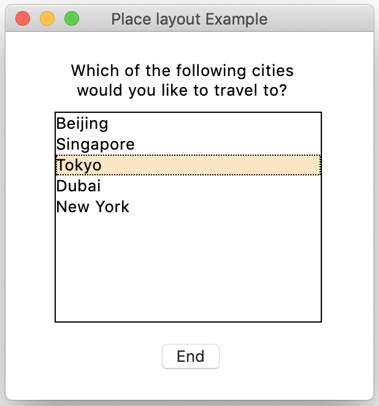

在本教程中，我们将探讨 Tkinter 的 `place` 几何管理器如何帮助你布局 GUI 应用程序的界面。

在之前的教程中，我们已经介绍了 Tkinter 的 [pack](https://www.pythonguis.com/tutorials/create-ui-with-tkinter-pack-layout-manager/) 和 [grid](https://www.pythonguis.com/tutorials/create-ui-with-tkinter-grid-layout-manager/) 几何管理器，并展示了如何使用它们来布局大多数用户界面。在本教程中，我们将探讨 Tkinter 提供的最后一个几何管理器：`place`。

> 如果你对使用哪个布局管理器感到困惑，可以查阅我们关于 [`pack`、`place` 和 `grid` 之间差异的指南](https://www.pythonguis.com/faq/pack-place-and-grid-in-tkinter/)。

### `place` 几何管理器

`place` 几何管理器允许你对控件的排列拥有绝对的控制权。使用 `place`，你可以指定控件的大小，以及在父窗口中排列它的精确 x 和 y 坐标。`place` 管理器对于在一个简单的对话框窗口中将按钮或其他较小控件组合在一起非常有用。

下面列出了一些你可以使用的参数：

*   `in_`: 指定控件所在的父窗口
*   `x`, `y`: 指定控件在父窗口中的具体 x 和 y 坐标值
*   `relx`, `rely`: 相对于父控件大小的水平和垂直偏移量，取值范围在 `0.0` 到 `1.0` 之间
*   `relwidth`, `relheight`: 设置控件相对于父控件大小的高度和宽度，取值范围在 `0.0` 到 `1.0` 之间
*   `anchor`: 定义控件在父控件中的放置位置，通过 `'n'`, `'s'`, `'e'`, `'w'` 或它们的某种组合来指定。默认值为 `'center'`

### 一个使用 `place` 的演示 GUI

让我们看一个快速的例子，展示如何使用 `place` 几何管理器在对话框上布局控件。下面，我们创建了一个应用，它向用户提问并允许他们从一个 `Listbox` 中选择一个选项：

python
```python
import tkinter as tk

root = tk.Tk()
root.title("Place layout Example")
root.geometry("300x300+50+100")

def display_selection(event):
    selection = cities_listbox.curselection()
    print(cities_listbox.get(selection))

# 用于显示问题的标签
tk.Label(
    root,
    text="Which of the following cities would you like to travel to?",
    wraplength=200,
).place(x=50, y=20)

# 用于显示城市的列表框
cities_listbox = tk.Listbox(root, selectmode=tk.BROWSE, width=24)
cities_listbox.place(x=40, y=65)
cities = ["Beijing", "Singapore", "Tokyo", "Dubai", "New York"]
for city in cities:
    cities_listbox.insert(tk.END, city)

# 绑定列表框的选择事件
cities_listbox.bind("<<ListboxSelect>>", display_selection)

# 用于关闭应用的按钮
end_button = tk.Button(root, text="End", command=quit)
end_button.place(x=125, y=250)

root.mainloop()
```

上面的代码将产生以下 GUI：



*使用 place 几何管理器的 Tkinter GUI 窗口*

这个 GUI 应用程序本身非常精简，由一个标签、一个列表框和一个按钮组成。上面的例子展示了如何通过 `place` 几何管理器的 `x` 和 `y` 参数来实现绝对定位。


虽然 `place` 看起来是创建 UI 布局的一种更简单的方法，但它也意味着当你的 UI 增长和变化时，你需要手动调整位置。因此，请谨慎使用它。对于复杂的 UI，通常最好使用自动化的 `pack` 和 `grid` 布局来代替。

### 总结

在本文中，你学习了在基于 Tkinter 的 GUI 应用程序中使用 `place` 进行几何管理的基础知识。虽然这个几何管理器在处理复杂 UI 时可能会变得棘手，但当你想要更精确地控制控件在窗口或简单对话框中的位置时，它非常有用。