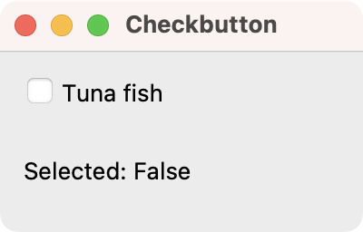
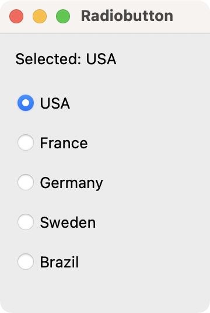
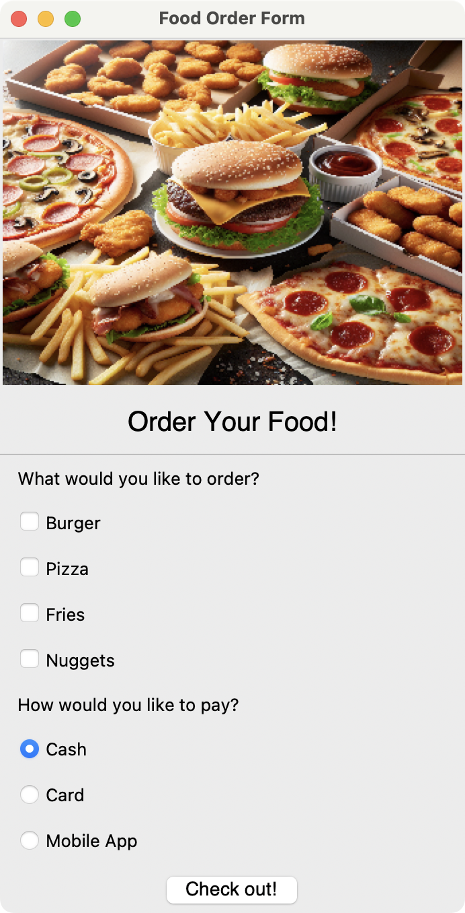

在之前的教程中，我们迈出了使用Tkinter构建应用的第一步，创建了窗口并添加了简单的标签和按钮控件。我们还研究了用于在窗口中布局控件的几何管理器。

在本教程中，我们将重点关注另外两个常用的Tkinter控件——`Checkbutton`（复选框）和`Radiobutton`（单选按钮）。这些输入控件是可点击的，您可以用它们来向用户呈现可供选择的选项。复选框允许您选择多个选项，而单选按钮则只允许选择一个唯一的选项。

### Checkbutton（复选框）

复选框（Checkbuttons，也叫checkboxes）是简单的控件，用户可以勾选和取消勾选。它们通常用于在设置面板中开启或关闭功能（或行为），或者从一个选项列表中选择项目。当被勾选时，复选框被认为是“开”状态，未勾选时则是“关”状态。不同的复选框应该彼此独立地工作，尽管有时您可能希望根据另一个复选框的状态来启用/禁用某些复选框。

> 这与Qt中的`QCheckBox`控件完全相同。`QCheckBox`也用于提供一个可以被用户勾选或取消勾选的选项。它们同样是独立的，可以通过信号与槽机制来影响其他控件的状态。

当`Checkbutton`控件的状态被切换时，它可以通过`command`参数调用方法或函数。`Checkbutton`的当前状态存储在一个外部的控制变量中。控制变量是使用Tkinter的变量类创建的，例如`IntVar`、`DoubleVar`、`BooleanVar`和`StringVar`。链接的控制变量将被更新以反映控件中的任何更改。

> 这是Tkinter和Qt在处理控件状态时的一个显著区别。Tkinter严重依赖于这些特殊的`tk.Variable`子类来同步控件的状态和程序中的数据。而在Qt中，状态通常是控件自身的属性（例如，`QCheckBox`的`isChecked()`方法），您可以通过信号（如`stateChanged`）来响应状态变化，或者在需要时直接查询控件的状态。Qt的方式通常被认为更加面向对象和直观。

让我们来看一个设置`Checkbutton`控件的基本应用：

```python
import tkinter as tk

root = tk.Tk()
root.title("复选框")
root.geometry("200x100")

def select_items():
    # .config() 用于更新控件的属性
    label.config(text=f"已选择: {bool(variable.get())}")

# 创建一个整型变量来存储复选框的状态
variable = tk.IntVar()
item = tk.Checkbutton(
    root,
    text="金枪鱼",
    command=select_items,
    variable=variable,
)
item.pack(anchor="w", padx=10, pady=10)

label = tk.Label(root, text="已选择: False")
label.pack(
    anchor="w",
    padx=10,
    pady=10,
)

root.mainloop()
```

在这个例子中，主窗口包含一个标记为`"金枪鱼"`的`Checkbutton`和一个显示复选框是否被选中的`Label`。`Checkbutton`的状态被链接到一个`tk.IntVar`变量，当按钮被勾选时，该变量存储`1`，未勾选时存储`0`。

当您勾选和取消勾选该复选框时，`select_items()`函数被调用，根据变量的值更新`Label`以显示选择状态（`True`或`False`）。

将代码保存为`app.py`并像运行任何其他Python脚本一样运行它。

您将看到以下窗口：



*显示一个复选框的Tkinter演示应用*

### Radiobutton（单选按钮）

`Checkbutton`控件用于选择多个选项，而`Radiobutton`控件则用于从多个选项中挑选一个。

> 这与Qt中的`QRadioButton`控件完全一致。`QRadioButton`也用于提供一组互斥的选项。

为了实现一组单选按钮之间的互斥性，它们必须共享同一个变量。这意味着当组中的一个单选按钮被选中时，任何其他被选中的控件将被取消选中。

> 在Qt中，为了实现互斥，通常会将一组`QRadioButton`添加到一个`QButtonGroup`对象中，或者将它们放置在同一个父容器（如`QGroupBox`）内。Qt会自动处理它们之间的互斥逻辑，无需手动共享变量，这使得代码结构更清晰。

以下是一个演示如何使用`Radiobutton`控件的示例：

```python
import tkinter as tk

root = tk.Tk()
root.title("单选按钮")
root.geometry("180x240")

countries = ["美国", "法国", "德国", "瑞典", "巴西"]

label = tk.Label(
    root,
    text=f"已选择: {countries[0]}",
)
label.pack(anchor="w", padx=10, pady=10)

def selection():
    label.config(text=f"已选择: {variable.get()}")

# 创建一个字符串变量，并设置初始值
variable = tk.StringVar(root, f"{countries[0]}")

for country in countries:
    tk.Radiobutton(
        root,
        text=country,
        variable=variable, # 共享同一个变量
        value=country,     # 每个按钮代表一个唯一的值
        command=selection,
    ).pack(anchor="w", padx=10, pady=5)

root.mainloop()
```

在这段代码中，我们创建了一个`Label`来显示当前选中的国家，初始化为`"美国"`。一个`StringVar`变量存储了从国家列表中选中的值。

然后，您启动一个循环，为每个国家生成一个`Radiobutton`控件，将其`value`绑定到相应的国家名称。当您选择一个给定的`Radiobutton`时，`selection()`函数会更新`Label`以显示新的选择。

您可以在下面的截图中看到单选按钮组的外观：



*显示一个单选按钮组的Tkinter演示应用*

正如您所见，创建单选按钮的过程与复选框相似。然而，我们需要一个额外的参数`value`与每个单独的单选按钮相关联。如果您需要创建一堆单选按钮控件，可以尝试使用`for`循环来实例化它们。

### 构建一个食物订购GUI演示

现在让我们编写一个结合了`Checkbutton`和`Radiobutton`控件的示例，来创建一个食物订购表单，它看起来会像下面这样：



*食物订购表单*

这是我们演示应用的代码：

```python
import tkinter as tk
from tkinter import messagebox, ttk

class FoodOrderingApp(tk.Tk):
    def __init__(self):
        super().__init__()
        self.title("食物订购表单")
        self.foods_list = ["汉堡", "披萨", "薯条", "鸡块"]
        self.payment_methods = ["现金", "银行卡", "移动支付"]
        self.setup_header()
        self.setup_foods()
        self.setup_payment()

    def setup_header(self):
        # 假设 "food.png" 存在
        try:
            self.image = tk.PhotoImage(file="food.png").subsample(3, 4)
            tk.Label(self, image=self.image).pack()
        except tk.TclError:
            pass
        tk.Label(
            self,
            text="订购您的食物!",
            font=("Helvetica", 20),
            bd=10,
        ).pack()
        line = ttk.Separator(self, orient=tk.HORIZONTAL)
        line.pack(fill="x")
        order_label = tk.Label(self, text="您想点什么?")
        order_label.pack(anchor="w", padx=10, pady=5)

    def setup_foods(self):
        for food_item in self.foods_list:
            var = tk.IntVar()
            # 动态地将控件和其变量存储为实例属性
            # 这是一种不太常见的做法，通常会使用字典来存储
            self.__dict__[food_item] = tk.Checkbutton(
                self, text=food_item, variable=var
            )
            self.__dict__[food_item].var = var # 将变量附加到控件上
            self.__dict__[food_item].pack(anchor="w", padx=10, pady=5)

    def setup_payment(self):
        payment_label = tk.Label(
            self,
            text="您想如何支付?",
        )
        payment_label.pack(anchor="w", padx=10, pady=5)

        self.var = tk.IntVar()
        self.var.set(0) # 默认选中第一个

        for value, method in enumerate(self.payment_methods):
            tk.Radiobutton(
                self,
                text=method,
                variable=self.var,
                value=value, # value是整数索引
            ).pack(anchor="w", padx=10, pady=5)

        next_button = tk.Button(
            self,
            text="结账!",
            command=self.print_results,
            font=("Helvetica", 14),
        )
        next_button.pack(padx=10, pady=5)

    def print_results(self):
        msg = ""
        for food_name in self.foods_list:
            food_button = getattr(self, food_name)
            if food_button.var.get() == 1:
                msg += f"已选项目: {food_button['text']}\n"

        index = self.var.get()
        msg += f"支付方式: {self.payment_methods[index]}"
        messagebox.showinfo("订单摘要", msg)

if __name__ == "__main__":
    app = FoodOrderingApp()
    app.mainloop()
```

在这个例子中，我们使用`Checkbutton`控件来允许用户从一个预定义的食物列表中选择多个食物项目。每个`Checkbutton`都链接到一个`IntVar`变量，以跟踪其选择状态（`1`表示选中，`0`表示未选中）。我们将复选框垂直显示，向左对齐(`anchor="w"`)，并带有内边距以增加间距(`padx=10, pady=5`)。

`Radiobutton`控件使用户能够从一系列可能性中选择单一的支付方式。`Radiobutton`控件被链接到一个共享的`IntVar`变量(`self.var`)。这确保了在任何时候只有一个按钮可以被激活，反映了支付选项的互斥性质。`Radiobutton`控件也以垂直方式打包，带有内边距并向左对齐，以保持布局的一致性。

当用户点击*结账!*按钮时，`print_results()`方法被调用，收集所选的项目和选择的支付方式。然后结果会显示在一个`messagebox`中供用户确认。

### 总结

在本教程中，我们快速了解了`Checkbutton`和`Radiobutton`控件。这两种类型的控件对于允许用户从一组选项中进行选择非常有用。当用户需要选择多个选项时使用复选框，而当用户只需要从多个选项中选择一个时使用单选按钮。

您现在将能够向您自己的应用程序中添加可选择的选项了。