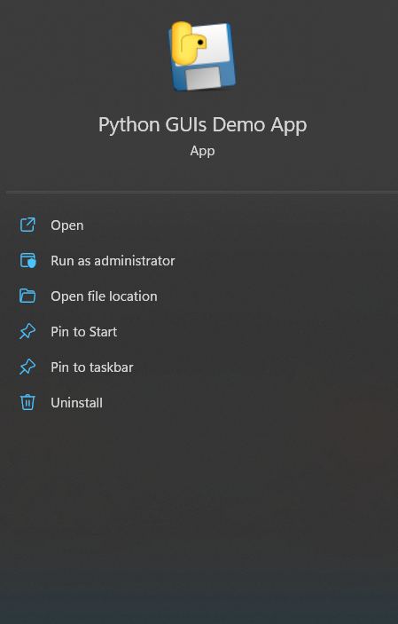

如果你创建的桌面应用无法与他人分享——无论是商业发布、在线分享，还是仅仅送给朋友——那将索然无味。分享你的应用能让其他人从你的辛勤工作中受益！

好消息是，有一些工具可以帮助你处理你的Python应用程序，并且它们与使用Tkinter构建的应用配合得很好。在本教程中，我们将探讨最流行的Python应用程序打包工具：_PyInstaller_。

本教程分为一系列步骤，使用 _PyInstaller_ 将一个简单的Tkinter应用开始，逐步构建到越来越复杂的应用，并最终在Windows上生成可分发的EXE文件。你可以选择完整地学习本教程，或者直接跳到与你自己的项目最相关的示例部分。

最后，我们将使用 _InstallForge_ 来创建一个可分发的Windows安装程序。

> **重要提示**
>
> 请务必在目标系统上编译你的应用。也就是说，如果你想创建一个Mac的 `.app` 文件，你需要在Mac上操作；要创建EXE文件，则需要使用Windows。

[

*示例Windows安装程序*

如果你等不及了，可以先下载[示例Windows安装程序](https://downloads.pythonguis.com/DemoTkinterInstallforge.exe)。


### 环境要求

_PyInstaller_ 对Tkinter提供了开箱即用的支持。在撰写本文时，当前版本的 _PyInstaller_ 与Python 3.6+兼容。无论你正在开发什么项目，你应该都能够打包你的应用。

你可以使用 `pip` 来安装 _PyInstaller_。

bash
```bash
pip3 install PyInstaller
```

如果你在打包应用时遇到问题，你的第一步应该*总是*将你的 _PyInstaller_ 和 _hooks包_ 更新到最新版本，使用以下命令：

bash
```bash
pip3 install --upgrade PyInstaller pyinstaller-hooks-contrib
```

_hooks_ 模块包含了 _PyInstaller_ 针对特定包的打包指令，它会定期更新。

#### 在虚拟环境中安装（可选）

你也可以选择在虚拟环境（或你的应用程序的虚拟环境）中安装 _PyInstaller_，以保持你的全局环境整洁。

bash
```bash
python3 -m venv packenv
```

创建完成后，通过在命令行中运行以下命令来激活虚拟环境：

bash
```bash
call packenv\scripts\activate.bat
```

最后，安装所需的库。

python
```python
pip3 install PyInstaller
```

### 入门

一个好习惯是*从项目一开始*就着手打包你的应用程序，这样你可以在开发过程中随时确认打包功能是否正常。在你添加额外的依赖项时，这一点尤其重要。如果等到最后才考虑打包，那么调试问题究竟*出在哪里*可能会变得非常困难。

在这个例子中，我们将从一个简单的骨架应用开始，它本身并没有什么有趣的功能。一旦我们掌握了基本的打包流程，我们将扩展该应用，以包含图标和数据文件。我们会边做边验证构建过程。

首先，为你的应用程序创建一个新文件夹，然后在一个名为 `app.py` 的文件中添加以下骨架应用。你也可以[下载源代码及相关文件](https://downloads.pythonguis.com/DemoGUIPyInstaller.zip)。

python
```python
import tkinter as tk

window = tk.Tk()
window.title("Hello World")

def handle_button_press(event):
    window.destroy()

button = tk.Button(text="My simple app.")
button.bind("<Button-1>", handle_button_press)
button.pack()

# 启动事件循环
window.mainloop()
```

这是一个基本的骨架应用程序，它创建了一个窗口并在其中添加了一个简单的按钮。你可以如下运行这个应用。

这应该会产生如下窗口（在Windows 11上）。


*Tkinter中的简单骨架应用*

### 构建一个基础应用

现在我们有了简单的应用程序骨架，我们可以进行第一次构建测试，以确保一切正常。

打开你的终端（命令提示符）并导航到包含你项目的文件夹。现在你可以运行以下命令来执行 _PyInstaller_ 构建。

```bash
pyinstaller app.py
```

你会看到一系列输出信息，提供了关于 _PyInstaller_ 正在做什么的调试信息。这些信息对于调试构建问题很有用，但通常可以忽略。下面是我在Windows 11上运行该命令时得到的输出。

bash
```bash
C:\Users\Martin\pyinstaller\tkinter\basic>pyinstaller app.py
335 INFO: PyInstaller: 4.7
335 INFO: Python: 3.7.6
# ... (大量日志输出) ...
15439 INFO: Building COLLECT COLLECT-00.toc completed successfully.
```

如果你查看你的文件夹，你会发现现在多了两个新文件夹 `dist` 和 `build`。


*PyInstaller创建的build和dist文件夹*

下面是一个简化的文件夹内容列表，显示了 `build` 和 `dist` 文件夹。

bash
```bash
.
├── app.py
├── app.spec
├── build
│   └── app
│       ├── ...
└── dist
    └── app
        ├── tcl
        ├── tk
        ├── app.exe
        ...
```

`build` 文件夹被 _PyInstaller_ 用来收集和准备要打包的文件，它包含了分析结果和一些额外的日志。在大多数情况下，你可以忽略这个文件夹的内容，除非你在调试问题。

`dist`（"distribution"的缩写）文件夹包含了要分发的文件。这包括你的应用程序（打包成一个可执行文件）、任何相关的库以及二进制 `.dll` 文件。

运行你的应用程序所需的一切都将在这个文件夹里，这意味着你可以将这个文件夹“分发”给其他人来运行你的应用。

你现在可以自己尝试运行你的应用，通过执行 `dist` 文件夹中的可执行文件 `app.exe`。稍等片刻，你将看到你熟悉的应用程序窗口弹出，如下所示。


*打包后运行的简单应用*

你可能还会注意到在你的应用程序运行时会弹出一个控制台/终端窗口。我们稍后会介绍如何禁止它出现。

在你的Python文件所在的同一文件夹中，除了 `build` 和 `dist` 文件夹，_PyInstaller_ 还会创建一个 `.spec` 文件。在下一节中，我们将看看这个文件是什么以及它有什么作用。

### Spec 文件

`.spec` 文件包含了 _PyInstaller_ 用来打包你的应用的构建配置和指令。每个 _PyInstaller_ 项目都有一个 `.spec` 文件，它是根据你运行 `pyinstaller` 时传递的命令行选项生成的。

当我们用我们的脚本运行 `pyinstaller` 时，除了Python应用程序的文件名外，我们没有传递任何其他参数。这意味着我们的spec文件目前只包含默认配置。如果你打开它，你会看到类似下面的内容。

python
```python
# -*- mode: python ; coding: utf-8 -*-

block_cipher = None

a = Analysis(['app.py'],
             pathex=[],
             # ...
             )
pyz = PYZ(a.pure, a.zipped_data,
             cipher=block_cipher)
exe = EXE(pyz,
          a.scripts,
          [],
          # ...
          console=True )
coll = COLLECT(exe,
               a.binaries,
               # ...
               )
```

首先要注意的是，这是一个Python文件，这意味着你可以编辑它并使用Python代码来计算设置值。这对于复杂的构建尤其有用，例如当你针对不同平台并希望有条件地定义要捆绑的额外库或依赖项时。

> **提示**
>
> 在Windows上生成的 `.spec` 文件路径分隔符是 `\\`。如果你想在macOS上使用同一个 `.spec` 文件，你需要将分隔符改为 `/`。幸运的是，`/` 在Windows上也同样有效。

一旦生成了 `.spec` 文件，你可以将它而不是你的脚本传递给 `pyinstaller` 来重复之前的构建过程。现在运行它来重新构建你的可执行文件。

```bash
pyinstaller app.spec
```

生成的构建将与用于生成 `.spec` 文件的构建完全相同（假设你没有做任何更改）。对于许多 _PyInstaller_ 的配置更改，你可以选择传递命令行参数，或者修改你现有的 `.spec` 文件。选择哪种方式取决于你。

### 调整构建

到目前为止，我们已经为一个非常基础的应用程序创建了一个简单的首次构建。现在我们将看一些 _PyInstaller_ 提供的最有用的选项来调整我们的构建。然后我们将继续看如何构建更复杂的应用程序。

#### 为你的应用命名

最简单的更改之一是为你的应用程序提供一个合适的“名称”。默认情况下，应用程序会采用你的源文件名（不含扩展名），例如 `main` 或 `app`。这通常不是你想要的。

你可以通过编辑 `.spec` 文件，在 `EXE` 部分下添加一个 `name=` 来为 _PyInstaller_ 提供一个更好听的名字用于可执行文件（和 `dist` 文件夹）。

python
```python
exe = EXE(pyz,
          # ...
          name='Hello World',
          # ...
         )
```

或者，你可以重新运行 `pyinstaller` 命令，并与你的 `app.py` 脚本一起传递 `-n` 或 `--name` 配置标志。

bash
```bash
pyinstaller -n "Hello World" app.py
# 或者
pyinstaller --name "Hello World" app.py
```

最终的EXE文件将被命名为 `Hello World.exe` 并放置在 `dist\Hello World\` 文件夹中。


*具有自定义名称 "Hello World" 的应用程序*

`.spec` 文件的名称取自命令行中传递的名称，所以这*也*会为你创建一个新的spec文件，名为 `Hello World.spec`，位于你的根文件夹中。

#### 隐藏控制台窗口

当你运行打包好的应用程序时，你会注意到一个控制台窗口在后台运行。如果你试图关闭这个控制台窗口，你的应用程序也会关闭。在GUI应用程序中，你几乎永远不希望出现这个窗口，而 _PyInstaller_ 提供了一种简单的方法来关闭它。


*应用程序在后台有终端运行*

你可以通过以下两种方式之一来解决这个问题。首先，你可以编辑之前创建的 `.spec` 文件，在 `EXE` 块下设置 `console=False`，如下所示。

python
```python
exe = EXE(pyz,
          # ...
          console=False  # False = 不显示控制台
         )
```

或者，你可以重新运行 `pyinstaller` 命令，并与你的 `app.py` 脚本一起传递 `-w`、`--noconsole` 或 `--windowed` 配置标志。

bash
```bash
pyinstaller -w app.py
# 或者
pyinstaller --windowed app.py
# 或者
pyinstaller --noconsole app.py
```

这些选项之间没有任何区别。

> **注意**
>
> 重新运行 `pyinstaller` 会重新生成 `.spec` 文件。如果你对这个文件做过任何其他更改，这些更改将会丢失。

#### 单文件构建

在Windows上，_PyInstaller_ 能够创建一个单文件构建，即一个包含你所有代码、库和数据文件的EXE文件。这对于分享简单的应用程序可能是一种方便的方式，因为你不需要提供安装程序或压缩一个文件夹。

要指定单文件构建，请在命令行中提供 `--onefile` 标志。

bash
```bash
pyinstaller --onefile app.py
```

请注意，虽然单文件构建更易于分发，但它的启动速度比普通构建的应用要慢。这是因为每次运行时都必须创建一个临时文件夹来解压可执行文件的内容。这种权衡是否值得为了你的应用便利性，由你来决定！

> **提示**
>
> 使用 `--onefile` 选项会对 `.spec` 文件进行相当多的更改。你*可以*手动进行这些更改，但在首次创建 `.spec` 文件时使用命令行开关要简单得多。

由于调试单文件应用要困难得多，你应该在创建单文件包之前，确保所有功能在普通构建中都能正常工作。为了清晰起见，本教程将继续使用基于文件夹的构建。

#### 设置应用程序图标

默认情况下，_PyInstaller_ 生成的EXE文件带有以下图标。


*app.exe上的默认PyInstaller应用程序图标*

你可能会想自定义这个图标，使你的应用程序更具辨识度。这可以通过使用 `--icon=<文件名>` 命令行开关轻松完成。在Windows上，图标应提供为 `.ico` 文件。

bash
```bash
pyinstaller --windowed --icon=icon.ico app.py
```

> **提示**
>
> [IcoFx的便携版](https://portableapps.com/apps/graphics_pictures/icofx_portable)是在Windows上创建图标的一个很好的免费工具。

或者，通过向你的 `.spec` 文件添加 `icon=` 参数。

python
```python
exe = EXE(pyz,
          # ...
          console=False,
          icon='icon.ico')
```

如果你现在重新运行构建（通过使用命令行参数，或者使用你修改过的 `.spec` 文件运行），你会看到指定的图标文件现在已经设置在你应用程序的EXE文件上。


*app.exe上的自定义应用程序图标（一只手）*

然而，如果你运行你的应用程序，你可能会感到失望。


*自定义EXE图标未应用于窗口*

指定的图标没有显示在窗口上，它也不会出现在你的任务栏上。

为什么不呢？因为窗口使用的图标不是由可执行文件中的图标决定的，而是由应用程序本身决定的。要在我们的窗口上显示图标，我们需要稍微修改一下我们的简单应用程序，添加一个对 `window.iconbitmap()` 的调用。

python
```python
import tkinter as tk

window = tk.Tk()
window.title("Hello World")

# ...

# 启动事件循环
window.iconbitmap("icon.ico")
window.mainloop()
```

在这里，我们向 `window` 实例添加了 `.iconbitmap` 调用。这定义了用于我们应用程序窗口的图标。

如果你运行上面的应用程序，你现在应该能看到图标出现在窗口上。


*显示自定义图标的窗口*

即使你*没有*看到图标，也请继续阅读！

#### 处理相对路径

这里有一个陷阱，可能不会立即显现出来。为了演示它，打开一个shell并切换到我们脚本所在的文件夹。用以下命令运行它：

```bash
python3 app.py
```

如果图标在正确的位置，你应该能看到它们。现在切换到父文件夹，并再次尝试运行你的脚本（将 `<folder>` 更改为你的脚本所在的文件夹名称）。

bash
```bash
cd ..
python3 <folder>/app.py
```


*图标丢失的窗口。*

图标*没有*出现。发生了什么？

我们正在使用*相对*路径来引用我们的数据文件。这些路径是相对于*当前工作目录*——而不是你的脚本所在的文件夹。所以如果你从其他地方运行脚本，它将无法找到文件。

> **提示**
>
> 图标不显示的一个常见原因是在IDE中运行示例，IDE使用项目根目录作为当前工作目录。

在应用打包之前，这是一个小问题，但一旦它被安装，你不知道它运行时*当前工作目录*会是什么——如果目录不对，你的应用将找不到任何东西。在继续之前，我们需要解决这个问题，我们可以通过使我们的路径相对于*我们的应用程序文件夹*来做到这一点。

在下面更新的代码中，我们定义了一个新变量 `basedir`，使用 `os.path.dirname` 来获取包含当前Python文件完整路径的 `__file__` 变量所在的文件夹。然后我们使用它通过 `os.path.join()` 来构建图标的相对路径。

因为我们的 `app.py` 文件在文件夹的根目录，所有其他路径都相对于它。

python
```python
import os
import tkinter as tk

basedir = os.path.dirname(__file__)

window = tk.Tk()
window.title("Hello World")

def handle_button_press(event):
    window.destroy()

button_icon = tk.PhotoImage(file=os.path.join(basedir, "icon.png"))
button = tk.Button(text="My simple app.", image=button_icon)
button.bind("<Button-1>", handle_button_press)
button.pack()

# 设置窗口图标
window.iconbitmap(os.path.join(basedir, "icon.ico"))

window.mainloop()
```

再次尝试从父文件夹运行你的应用——你会发现无论你从哪里启动应用，图标现在都能按预期出现。

#### 任务栏图标

不幸的是，即使图标显示在窗口上，它可能仍然不会显示在任务栏上。

如果你的显示了，那很好！但当你分发你的应用程序时，它可能无法正常工作，所以无论如何，最好还是遵循接下来的步骤。


*自定义图标未显示在任务栏上*

我们需要做的最后调整，以使图标显示在任务栏上，是在我们的Python文件顶部添加一些神秘的咒语。

当你运行你的应用程序时，Windows会查看可执行文件并尝试猜测它属于哪个“应用程序组”。默认情况下，任何Python脚本（包括你的应用程序）都被归类到同一个“Python”组下，因此会显示Python图标。为了阻止这种情况，我们需要为Windows提供一个不同的应用程序标识符。

下面的代码通过调用 `ctypes.windll.shell32.SetCurrentProcessExplicitAppUserModelID()` 并使用一个自定义的应用程序ID来做到这一点。

python
```python
import os
import tkinter as tk

basedir = os.path.dirname(__file__)

try:
    from ctypes import windll  # 只在Windows上存在

    myappid = "mycompany.myproduct.subproduct.version"
    windll.shell32.SetCurrentProcessExplicitAppUserModelID(myappid)
except ImportError:
    pass

window = tk.Tk()
# ...后续代码
```

上面的列表显示了一个通用的 `mycompany.myproduct.subproduct.version` 字符串，但你*应该*更改它以反映你实际的应用程序。你在这里放什么内容其实关系不大，但惯例是使用反向域名表示法，如 `com.mycompany` 作为公司标识符。

将此添加到你的脚本后，运行它现在应该可以在你的窗口和任务栏上显示图标了。最后一步是确保这个图标被正确地打包到你的应用程序中，并且在从 `dist` 文件夹运行时继续显示。

试试看，它不会成功。

问题是我们的应用程序现在依赖于一个*外部数据文件*（图标文件），它不是我们源代码的一部分。为了让我们的应用程序工作，我们现在需要将这个数据文件与它一起分发。_PyInstaller_ 可以为我们做到这一点，但我们需要告诉它我们想包含什么，以及把它放在输出的什么位置。

在下一节中，我们将看看可用于管理与你的应用相关的数据文件的选项。

### 数据文件和资源

到目前为止，我们成功地构建了一个没有外部依赖的简单应用。然而，一旦我们需要加载一个外部文件（在本例中是一个图标），我们就遇到了问题。该文件没有被复制到我们的 `dist` 文件夹中，因此无法加载。

在本节中，我们将探讨我们可以用来将外部资源（如图标）与我们的应用程序捆绑在一起的选项。

#### 使用PyInstaller捆绑数据文件

将这些数据文件放入 `dist` 文件夹的最简单方法就是告诉 _PyInstaller_ 将它们复制过去。_PyInstaller_ 接受一个要复制的单个文件路径列表，以及一个相对于 `dist/<app name>` 文件夹的路径，它应该将文件复制*到*那里。

与其他选项一样，这可以通过命令行参数 `--add-data` 来指定。

bash
```bash
pyinstaller --windowed --icon=icon.ico --add-data="icon.ico;." app.py
```

> **提示**
>
> 你可以多次提供 `--add-data`。注意路径分隔符是平台相关的，Windows上使用 `;`，而在Linux或Mac上使用 `:`。

或者通过spec文件的 `Analysis` 部分中的 `datas` 列表，如下所示。

python
```python
a = Analysis(['app.py'],
             # ...
             datas=[('icon.ico', '.')],
             # ...
             )
```

然后在命令行执行 `.spec` 文件构建：

```bash
pyinstaller app.spec
```

在这两种情况下，我们都告诉 _PyInstaller_ 将指定的文件 `icon.ico` 复制到 `.` 位置，也就是输出文件夹 `dist`。如果我们愿意，我们也可以在这里指定其他位置。在命令行上，源和目标由路径分隔符 `;` 分隔，而在 `.spec` 文件中，这些值以一个包含两个字符串的元组（2-tuple）形式提供。

运行构建，你会看到你的 `.ico` 文件现在在输出文件夹 `dist` 中，准备好与你的应用程序一起分发。如果你从 `dist` 运行你的应用，你现在应该能按预期在窗口和任务栏上看到图标。


*任务栏上显示的手形图标*

> **提示**
>
> 文件必须在你的应用中使用*相对路径*加载，并且它相对于EXE文件的位置必须与它相对于 `.py` 文件的位置相同，这样才能工作。

如果你的图标看起来模糊，那意味着你的 `.ico` 文件中没有足够大的图标变体。一个 `.ico` 文件可以包含多个不同大小的图标。理想情况下，你应该包含16x16、32x32、48x48和256x256像素尺寸，尽管较少的尺寸也能工作。

#### 捆绑数据文件夹

通常你会有多个数据文件想要包含在打包文件中。最新版本的PyInstaller允许你像捆绑文件一样捆绑文件夹，并保持子文件夹结构。例如，让我们扩展我们的应用，添加一些额外的图标，并将它们放在一个文件夹下。

python
```python
import os
import tkinter as tk

basedir = os.path.dirname(__file__)

try:
    from ctypes import windll  # 只在Windows上存在

    myappid = "mycompany.myproduct.subproduct.version"
    windll.shell32.SetCurrentProcessExplicitAppUserModelID(myappid)
except ImportError:
    pass

window = tk.Tk()
window.title("Hello World")

label = tk.Label(text="My simple app.")
label.pack()

def handle_button_press(event):
    window.destroy()

button_close_icon = tk.PhotoImage(
    file=os.path.join(basedir, "icons", "lightning.png")
)
button_close = tk.Button(
    text="Close",
    image=button_close_icon,
)
button_close.bind("<Button-1>", handle_button_press)
button_close.pack()

button_maximimize_icon = tk.PhotoImage(
    file=os.path.join(basedir, "icons", "uparrow.png")
)
button_maximize = tk.Button(
    text="Maximize",
    image=button_maximimize_icon,
)
button_maximize.bind("<Button-1>", handle_button_press)
button_maximize.pack()

# 设置窗口图标
window.iconbitmap(os.path.join(basedir, "icons", "icon.ico"))

# 启动事件循环
window.mainloop()
```

图标（PNG文件和用于Windows文件图标的ICO文件）存储在一个名为'icons'的子文件夹下。

bash
```bash
.
├── app.py
└── icons
    ├── icon.png
    ├── ...
    └── icon.ico
```

如果你运行这个，你会看到以下窗口，带有一个窗口图标和一个按钮图标。


*带有两个带图标按钮的窗口。*

> **提示**
>
> 路径使用的是Unix的正斜杠 `/` 约定，因此它们是跨平台的，也适用于macOS。如果你只为Windows开发，你可以使用 `\\`。

要将 `icons` 文件夹复制到我们构建的应用程序中，我们只需要将该文件夹添加到我们 `.spec` 文件的 `Analysis` 块中。与单个文件一样，我们将其添加为一个元组，包含源路径（从我们的项目文件夹）和目标文件夹（在最终的 `dist` 文件夹下）。

python
```python
a = Analysis(['app.py'],
             # ...
             datas=[('icons', 'icons')],   # 元组是(源文件夹, 目标文件夹)
             # ...
             )
```

如果你使用这个spec文件运行构建，你会看到 `icons` 文件夹被复制到 `dist` 文件夹中。如果你从该文件夹运行应用程序，图标将按预期显示——相对路径在新位置仍然正确。

### 使用InstallForge构建Windows安装程序

到目前为止，我们已经使用 _PyInstaller_ 来捆绑用于分发的应用程序及其相关的数据文件。这个捆绑过程的输出是一个名为 `dist` 的文件夹，其中包含我们应用程序运行所需的所有文件。

虽然你可以将这个文件夹作为ZIP文件与你的用户分享，但这并不是最佳的用户体验。桌面应用程序通常通过*安装程序*来分发，安装程序负责将可执行文件（以及任何其他文件）放置在正确的位置，添加*开始菜单*快捷方式等。

现在我们已经成功捆绑了我们的应用程序，接下来我们将看看如何利用我们的 `dist` 文件夹来创建一个Windows安装程序。

#### 确保构建已准备好

如果你一直跟着教程做到这里，你的应用应该已经在 `/dist` 文件夹中准备好了。如果没有，或者你的无法工作，你也可以下载[本教程的源代码文件](https://downloads.pythonguis.com/DemoGUIPyInstaller.zip)，其中包含一个示例 `.spec` 文件。如上所述，你可以使用提供的 `app.spec` 文件运行相同的构建。

这将把所有东西打包好，准备在 `dist/app` 文件夹中分发。运行可执行文件 `app.exe` 以确保所有东西都已正确捆绑，你应该会看到与之前一样的带有图标的窗口。


*带有两个图标和一个按钮的窗口。*

`.spec` 文件中的 `EXE` 部分有一个 `name` 参数，你可以在那里指定最终EXE文件的名称。你可能想把它改成你的应用程序的名称。

#### 创建一个安装程序

现在我们已经成功捆绑了我们的应用程序，接下来我们将看看如何利用我们的 `dist` 文件夹来创建一个功能齐全的Windows安装程序。

为了创建我们的安装程序，我们将使用一个名为 [InstallForge](https://installforge.net/) 的工具。InstallForge是免费的，你可以从[这个页面](https://installforge.net/download/)下载安装程序。

我们现在将逐步介绍使用 _InstallForge_ 创建安装程序的基本步骤。如果你等不及了，可以在这里下载[完成的Installforge安装程序](https://downloads.pythonguis.com/DemoTkinterInstallforge.exe)。

##### 常规 (General)

当你第一次运行 _InstallForge_ 时，你会看到这个“常规”选项卡。在这里你可以输入关于你的应用程序的基本信息，包括名称、程序版本、公司和网站。


*InstallForge初始视图，显示常规设置*

你还可以为安装程序选择目标平台，从各种可用的Windows版本中选择。对于桌面应用程序，你目前*可能*只想针对Windows 7、8和10。

##### 安装 (Setup)

点击左侧边栏打开“安装”下的“文件”页面。在这里你可以指定要捆绑在安装程序中的文件。

使用“添加文件…”并选择 _PyInstaller_ 生成的 `dist/app` 文件夹中的*所有文件*。弹出的文件浏览器允许多文件选择，所以你可以一次性添加所有文件，但是你需要单独添加文件夹。点击“添加文件夹…”并添加 `dist/app` 下的任何文件夹，例如 `icons` 文件夹。


*InstallForge文件视图，添加所有要打包的文件和文件夹*

完成后，滚动列表到底部，确保文件夹被列为要包含的内容。你希望 `dist/app` *下面*的所有文件和文件夹都在，但 `dist/app` 文件夹本身*不应该*被列出。

默认安装路径可以保持不变。尖括号之间的值，例如 `<company>`，是变量，会被自动填充。

接下来，允许你的用户卸载你的应用程序是很好的。尽管它无疑很棒，但他们可能希望在未来的某个时候移除它。你可以在“卸载”选项卡下做到这一点，只需勾选复选框即可。这也会使应用程序出现在“添加或删除程序”中。


*InstallForge为你的应用添加卸载程序*

##### 对话框 (Dialogs)

“对话框”部分可以用来向用户显示自定义消息、启动画面或许可信息。“完成”选项卡让你控制安装程序完成后发生什么，在这里给用户一个*选项*来运行你的程序是很有帮助的。

要做到这一点，你需要勾选“运行程序”旁边的框，并将你自己的应用程序EXE添加到框中。由于 `<installpath>\` 已经指定，我们只需添加 `app.exe`。


*InstallForge配置在安装完成后可选地运行程序*

##### 系统 (System)

在“系统”下选择“快捷方式”打开快捷方式编辑器。在这里你可以为开始菜单和桌面指定快捷方式，如果你愿意的话。


*InstallForge配置开始菜单和桌面的快捷方式*

点击“添加…”为你的应用程序添加新的快捷方式。在开始菜单和桌面快捷方式之间进行选择，并填写名称和目标文件。这是你的应用程序EXE安装后最终的路径。由于 `<installpath>\` 已经指定，你只需将你的应用程序的EXE名称附加到末尾，这里是 `app.exe`。


*InstallForge，添加一个快捷方式*

##### 构建 (Build)

基本设置完成后，你现在可以构建你的安装程序了。

此时你可以保存你的 _InstallForge_ 项目，以便将来可以从相同的设置重新构建安装程序。

点击底部的“构建”部分打开构建面板。


*InstallForge，准备构建*

点击大图标按钮开始构建过程。如果你还没有指定安装文件的位置，你会被提示指定一个。这是你希望*完成的安装程序*保存的位置。

**不要**把它保存在你的 `dist` 文件夹中。

构建过程将开始，收集并压缩文件到安装程序中。


*InstallForge，构建完成*

完成后，你会被提示运行安装程序。这完全是可选的，但是一个方便的方法来检查它是否工作。

##### 运行安装程序

安装程序本身应该不会有任何意外，会按预期工作。根据在 _InstallForge_ 中选择的选项，你可能会有额外的面板或选项。


*InstallForge，运行生成的安装程序*

逐步完成安装程序直到完成。你可以选择从安装程序的最后一页运行应用程序，或者你可以在你的开始菜单中找到它。



*我们的演示应用在Windows 11的开始菜单中*

### 总结

在本教程中，我们介绍了如何使用 _PyInstaller_ 将你的Tkinter应用程序构建成一个可分发的EXE，包括将数据文件与你的代码一起添加。然后我们逐步介绍了使用InstallForge将应用程序构建成Windows安装程序的过程。遵循这些步骤，你应该能够打包你自己的应用程序并让其他人使用。

要全面了解所有 _PyInstaller_ 捆绑选项，请查看[PyInstaller使用文档](https://pyinstaller.readthedocs.io/en/stable/usage.html)。