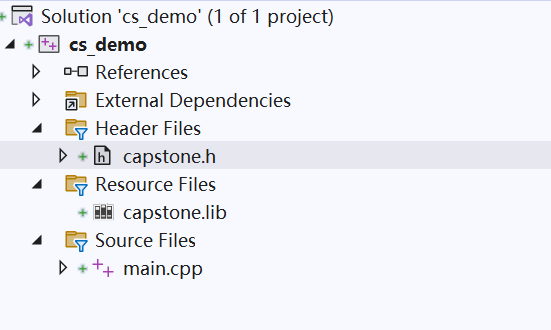

# Capstone-Engine API Documentation

| Version | 6.0 |
| ------- | --- |

**Official API document by [kabeor](https://github.com/kabeor)**

[Capstone Engine](https://github.com/capstone-engine/capstone)是一个支持多种硬件架构的二进制反汇编引擎。

## 开发准备

Capstone 官网： http://www.capstone-engine.org

### 自行编译 lib 和 dll 方法

下载源码:

```bash
git clone https://github.com/capstone-engine/capstone.git
```

文件结构如下：

```
   .                <- 主要引擎core engine + README + 编译文档COMPILE.TXT 等
├── arch            <- 各语言反编译支持的代码实现
│   ├── AArch64     <- ARM64 (aka ARMv8) 引擎
│   ├── ARM         <- ARM 引擎
│   ├── EVM         <- Ethereum 引擎
│   ├── M680X       <- M680X 引擎
│   ├── M68K        <- M68K 引擎
|   ├── MOS65XX     <- MOS65XX 引擎
│   ├── Mips        <- Mips 引擎
│   ├── PowerPC     <- PowerPC 引擎
│   ├── Sparc       <- Sparc 引擎
│   ├── SystemZ     <- SystemZ 引擎
│   ├── TMS320C64x  <- TMS320C64x 引擎
│   ├── X86         <- X86 引擎
│   └── XCore       <- XCore 引擎
├── bindings        <- 绑定
│   ├── java        <- Java 绑定 + 测试代码
│   ├── ocaml       <- Ocaml 绑定 + 测试代码
│   ├── powershell  <- powershell 绑定 + 测试代码
│   ├── python      <- python 绑定 + 测试代码
│   └── vb6         <- vb6 绑定 + 测试代码
├── contrib         <- 社区代码
├── cstool          <- Cstool 检测工具源码
├── docs            <- 文档，主要是capstone的实现思路
├── include         <- C头文件
├── msvc            <- Microsoft Visual Studio 支持（Windows）
├── packages        <- Linux/OSX/BSD包
├── suite           <- 项目开发所需工具
├── tests           <- C语言测试用例
├── windows         <- Windows 支持(Windows内核驱动编译)
├── windowsce       <- Windows CE 支持
└── xcode           <- Xcode 支持 (MacOSX 编译)
```

进入源码目录，使用下列命令进行编译：

```bash
$ cmake.exe -B build
$ cmake.exe --build build --config Release # For debug build change "Release" to "Debug"
```

编译后会在当前文件夹 `build/Release` 目录下生成 capstone.lib 静态编译库，这样就可以开始使用 Capstone 进行开发了。

如果不想自己编译，官方也提供了官方编译版本

Win32： https://github.com/capstone-engine/capstone/releases/download/4.0.2/capstone-4.0.2-win32.zip

Win64： https://github.com/capstone-engine/capstone/releases/download/4.0.2/capstone-4.0.2-win64.zip

选 x32 或 x64 将影响后面开发的位数

### 引擎调用测试

新建一个 VS 项目，将 `capstone\include\capstone` 中的头文件以及编译好的 lib 文件全部拷贝到新建项目的主目录下


在 VS 解决方案中，头文件添加现有项 `capstone.h`，资源文件中添加 `capstone.lib`，重新生成解决方案。



那么现在来测试一下我们自己的 capstone 引擎吧。

`main.cpp` 中写入如下代码：

```c++
#include <iostream>
#include "capstone/capstone.h"
using namespace std;

int main(int argc, char* argv[]) {
	csh handle;
	cs_insn* insn;
	size_t count;
	unsigned char opcodes[13] = {
		0x09, 0xA1, 0x40, 0xA9,  // LDP X9, X8, [X8,#8]
		0x29, 0x01, 0x13, 0x8B,  // ADD X9, X9, X19
		0x28, 0x01, 0x08, 0xCB	 // SUB X8, X9, X8
	};

	if (cs_open(CS_ARCH_AARCH64, CS_MODE_ARM, &handle)) {
		printf("ERROR: Failed to initialize engine!\n");
		return -1;
	}

	count = cs_disasm(handle, (unsigned char*)opcodes, sizeof(opcodes), 0x1000, 0, &insn);
	if (count) {
		for (int i = 0; i < count; i++) {
			printf("0x%""Ix"":\t%s\t\t%s\n", insn[i].address, insn[i].mnemonic, insn[i].op_str);
		}
		cs_free(insn, count);
	}
	else
		printf("ERROR: Failed to disassemble given code!\n");

	cs_close(&handle);
	return 0;
}
```

运行结果

```bash
0x1000: ldp             x9, x8, [x8, #8]
0x1004: add             x9, x9, x19
0x1008: sub             x8, x9, x8
```

## 数据类型

### csh

用于生成调用 capstone API 的句柄。

```cpp
// Handle using with all API
typedef size_t csh;
```

### cs_arch

架构选择。

<details><summary> Code </summary>

```cpp
/// 架构类型
typedef enum cs_arch {
	CS_ARCH_ARM = 0,	///< ARM 架构 (包括 Thumb, Thumb-2)
#ifdef CAPSTONE_AARCH64_COMPAT_HEADER
	CS_ARCH_ARM64 = 1,	///< ARM64
#else
	CS_ARCH_AARCH64 = 1,	///< AArch64
#endif
#ifdef CAPSTONE_SYSTEMZ_COMPAT_HEADER
	CS_ARCH_SYSZ = 2,	///< SystemZ 架构
#else
	CS_ARCH_SYSTEMZ = 2,	///< SystemZ 架构
#endif
	CS_ARCH_MIPS,		///< Mips 架构
	CS_ARCH_X86,		///< X86 架构 (包括 x86 & x86-64)
	CS_ARCH_PPC,		///< PowerPC 架构
	CS_ARCH_SPARC,		///< Sparc 架构
	CS_ARCH_XCORE,		///< XCore 架构
	CS_ARCH_M68K,		///< 68K 架构
	CS_ARCH_TMS320C64X,	///< TMS320C64x 架构
	CS_ARCH_M680X,		///< 680X 架构
	CS_ARCH_EVM,		///< 以太坊架构
	CS_ARCH_MOS65XX,	///< MOS65XX 架构 (包括 MOS6502)
	CS_ARCH_WASM,		///< WebAssembly 架构
	CS_ARCH_BPF,		///< Berkeley Packet Filter 架构 (包括 eBPF)
	CS_ARCH_RISCV,          ///< RISCV 架构
	CS_ARCH_SH,             ///< SH 架构
	CS_ARCH_TRICORE,	///< TriCore 架构
	CS_ARCH_ALPHA, 		///< Alpha 架构
	CS_ARCH_HPPA, 		///< HPPA 架构
	CS_ARCH_LOONGARCH, 	///< LoongArch 架构
	CS_ARCH_XTENSA, 	///< Xtensa 架构
	CS_ARCH_ARC, 	    ///< ARC 架构
	CS_ARCH_MAX,
	CS_ARCH_ALL = 0xFFFF, // 所有架构 - 用于 cs_support()
} cs_arch;
```

</details>

> API 中 `cs_arch` 参数填入枚举内容，如 API 中 `cs_open(cs_arch arch, cs_mode mode, csh *handle);` 第一个参数填 `CS_ARCH_AARCH64` 则支持 ARM64 架构。

### cs_mode

模式选择。

<details><summary> Code </summary>

```cpp
/// 模式类型
typedef enum cs_mode {
	CS_MODE_LITTLE_ENDIAN = 0,	///< 小端模式 (默认模式)
	CS_MODE_ARM = 0,	///< 32位 ARM
	CS_MODE_16 = 1 << 1,	///< 16位模式 (X86)
	CS_MODE_32 = 1 << 2,	///< 32位模式 (X86)
	CS_MODE_64 = 1 << 3,	///< 64位模式 (X86, PPC)
	// ARM
	CS_MODE_THUMB = 1 << 4,	///< ARM 的 Thumb 模式，包括 Thumb-2
	CS_MODE_MCLASS = 1 << 5,	///< ARM 的 Cortex-M 系列
	CS_MODE_V8 = 1 << 6,	///< ARMv8 A32 编码，用于 ARM
	// AArch64
	CS_MODE_APPLE_PROPRIETARY = 1 << CS_MODE_VENDOR_AARCH64_BIT0, ///< 启用 Apple 专有的 AArch64 指令，如 AMX、MUL53 等。
	// SPARC
	CS_MODE_V9 = 1 << 4, ///< SparcV9 模式 (Sparc)
	// PPC
	CS_MODE_QPX = 1 << 4, ///< Quad Processing eXtensions 模式 (PPC)
	CS_MODE_SPE = 1 << 5, ///< Signal Processing Engine 模式 (PPC)
	CS_MODE_BOOKE = 1 << 6, ///< Book-E 模式 (PPC)
	CS_MODE_PS = 1 << 7, ///< Paired-singles 模式 (PPC)
	CS_MODE_AIX_OS = 1 << 8, ///< PowerPC AIX-OS
	CS_MODE_PWR7 = 1 << 9, ///< Power 7
	CS_MODE_PWR8 = 1 << 10, ///< Power 8
	CS_MODE_PWR9 = 1 << 11, ///< Power 9
	CS_MODE_PWR10 = 1 << 12, ///< Power 10
	CS_MODE_PPC_ISA_FUTURE = 1 << 13, ///< Power ISA Future
	CS_MODE_MODERN_AIX_AS = 1 << 14, ///< 使用现代汇编的 PowerPC AIX-OS
	CS_MODE_MSYNC = 1 << 15, ///< PowerPC 只有 msync 指令而不是 sync。暗示 BOOKE
	CS_MODE_M68K_000 = 1 << 1, ///< M68K 68000 模式
	CS_MODE_M68K_010 = 1 << 2, ///< M68K 68010 模式
	CS_MODE_M68K_020 = 1 << 3, ///< M68K 68020 模式
	CS_MODE_M68K_030 = 1 << 4, ///< M68K 68030 模式
	CS_MODE_M68K_040 = 1 << 5, ///< M68K 68040 模式
	CS_MODE_M68K_060 = 1 << 6, ///< M68K 68060 模式
	CS_MODE_BIG_ENDIAN = 1U << 31, ///< 大端模式
	CS_MODE_MIPS16 = CS_MODE_16, ///< 通用 mips16
	CS_MODE_MIPS32 = CS_MODE_32, ///< 通用 mips32
	CS_MODE_MIPS64 = CS_MODE_64, ///< 通用 mips64
	CS_MODE_MICRO = 1 << 4, ///< microMips
	CS_MODE_MIPS1 = 1 << 5, ///< Mips I ISA 支持
	CS_MODE_MIPS2 = 1 << 6, ///< Mips II ISA 支持
	CS_MODE_MIPS32R2 = 1 << 7, ///< Mips32r2 ISA 支持
	CS_MODE_MIPS32R3 = 1 << 8, ///< Mips32r3 ISA 支持
	CS_MODE_MIPS32R5 = 1 << 9, ///< Mips32r5 ISA 支持
	CS_MODE_MIPS32R6 = 1 << 10, ///< Mips32r6 ISA 支持
	CS_MODE_MIPS3 = 1 << 11, ///< MIPS III ISA 支持
	CS_MODE_MIPS4 = 1 << 12, ///< MIPS IV ISA 支持
	CS_MODE_MIPS5 = 1 << 13, ///< MIPS V ISA 支持
	CS_MODE_MIPS64R2 = 1 << 14, ///< Mips64r2 ISA 支持
	CS_MODE_MIPS64R3 = 1 << 15, ///< Mips64r3 ISA 支持
	CS_MODE_MIPS64R5 = 1 << 16, ///< Mips64r5 ISA 支持
	CS_MODE_MIPS64R6 = 1 << 17, ///< Mips64r6 ISA 支持
	CS_MODE_OCTEON = 1 << 18, ///< Octeon cnMIPS 支持
	CS_MODE_OCTEONP = 1 << 19, ///< Octeon+ cnMIPS 支持
	CS_MODE_NANOMIPS = 1 << 20, ///< 通用 nanomips
	CS_MODE_NMS1 = ((1 << 21) | CS_MODE_NANOMIPS), ///< nanoMips NMS1
	CS_MODE_I7200 = ((1 << 22) | CS_MODE_NANOMIPS), ///< nanoMips I7200
	CS_MODE_MIPS_NOFLOAT = 1 << 23, ///< 禁用浮点操作
	CS_MODE_MIPS_PTR64 = 1 << 24, ///< Mips 指针为 64 位
	CS_MODE_MICRO32R3 = (CS_MODE_MICRO | CS_MODE_MIPS32R3), ///< microMips32r3
	CS_MODE_MICRO32R6 = (CS_MODE_MICRO | CS_MODE_MIPS32R6), ///< microMips32r6
	CS_MODE_M680X_6301 = 1 << 1, ///< M680X Hitachi 6301,6303 模式
	CS_MODE_M680X_6309 = 1 << 2, ///< M680X Hitachi 6309 模式
	CS_MODE_M680X_6800 = 1 << 3, ///< M680X Motorola 6800,6802 模式
	CS_MODE_M680X_6801 = 1 << 4, ///< M680X Motorola 6801,6803 模式
	CS_MODE_M680X_6805 = 1 << 5, ///< M680X Motorola/Freescale 6805 模式
	CS_MODE_M680X_6808 = 1 << 6, ///< M680X Motorola/Freescale/NXP 68HC08 模式
	CS_MODE_M680X_6809 = 1 << 7, ///< M680X Motorola 6809 模式
	CS_MODE_M680X_6811 = 1 << 8, ///< M680X Motorola/Freescale/NXP 68HC11 模式
	CS_MODE_M680X_CPU12 = 1 << 9, ///< M680X Motorola/Freescale/NXP CPU12
							///< 用于 M68HC12/HCS12
	CS_MODE_M680X_HCS08 = 1 << 10, ///< M680X Freescale/NXP HCS08 模式
	CS_MODE_BPF_CLASSIC = 0,	///< 经典 BPF 模式 (默认)
	CS_MODE_BPF_EXTENDED = 1 << 0,	///< 扩展 BPF 模式
	CS_MODE_RISCV32  = 1 << 0,        ///< RISCV RV32G
	CS_MODE_RISCV64  = 1 << 1,        ///< RISCV RV64G
	CS_MODE_RISCVC   = 1 << 2,        ///< RISCV 压缩指令模式
	CS_MODE_MOS65XX_6502 = 1 << 1, ///< MOS65XXX MOS 6502
	CS_MODE_MOS65XX_65C02 = 1 << 2, ///< MOS65XXX WDC 65c02
	CS_MODE_MOS65XX_W65C02 = 1 << 3, ///< MOS65XXX WDC W65c02
	CS_MODE_MOS65XX_65816 = 1 << 4, ///< MOS65XXX WDC 65816, 8位 m/x
	CS_MODE_MOS65XX_65816_LONG_M = (1 << 5), ///< MOS65XXX WDC 65816, 16位 m, 8位 x
	CS_MODE_MOS65XX_65816_LONG_X = (1 << 6), ///< MOS65XXX WDC 65816, 8位 m, 16位 x
	CS_MODE_MOS65XX_65816_LONG_MX = CS_MODE_MOS65XX_65816_LONG_M | CS_MODE_MOS65XX_65816_LONG_X,
	CS_MODE_SH2 = 1 << 1,    ///< SH2
	CS_MODE_SH2A = 1 << 2,   ///< SH2A
	CS_MODE_SH3 = 1 << 3,    ///< SH3
	CS_MODE_SH4 = 1 << 4,    ///< SH4
	CS_MODE_SH4A = 1 << 5,   ///< SH4A
	CS_MODE_SHFPU = 1 << 6,  ///< 带 FPU
	CS_MODE_SHDSP = 1 << 7,  ///< 带 DSP
	CS_MODE_TRICORE_110 = 1 << 1, ///< Tricore 1.1
	CS_MODE_TRICORE_120 = 1 << 2, ///< Tricore 1.2
	CS_MODE_TRICORE_130 = 1 << 3, ///< Tricore 1.3
	CS_MODE_TRICORE_131 = 1 << 4, ///< Tricore 1.3.1
	CS_MODE_TRICORE_160 = 1 << 5, ///< Tricore 1.6
	CS_MODE_TRICORE_161 = 1 << 6, ///< Tricore 1.6.1
	CS_MODE_TRICORE_162 = 1 << 7, ///< Tricore 1.6.2
	CS_MODE_TRICORE_180 = 1 << 8, ///< Tricore 1.8.0
	CS_MODE_HPPA_11 = 1 << 1, ///< HPPA 1.1
	CS_MODE_HPPA_20 = 1 << 2, ///< HPPA 2.0
	CS_MODE_HPPA_20W = CS_MODE_HPPA_20 | (1 << 3), ///< HPPA 2.0 wide
	CS_MODE_LOONGARCH32  = 1 << 0,        ///< LoongArch32
	CS_MODE_LOONGARCH64  = 1 << 1,        ///< LoongArch64
	CS_MODE_SYSTEMZ_ARCH8 = 1 << 1, ///< 启用 ARCH8 处理器的特性
	CS_MODE_SYSTEMZ_ARCH9 = 1 << 2, ///< 启用 ARCH9 处理器的特性
	CS_MODE_SYSTEMZ_ARCH10 = 1 << 3, ///< 启用 ARCH10 处理器的特性
	CS_MODE_SYSTEMZ_ARCH11 = 1 << 4, ///< 启用 ARCH11 处理器的特性
	CS_MODE_SYSTEMZ_ARCH12 = 1 << 5, ///< 启用 ARCH12 处理器的特性
	CS_MODE_SYSTEMZ_ARCH13 = 1 << 6, ///< 启用 ARCH13 处理器的特性
	CS_MODE_SYSTEMZ_ARCH14 = 1 << 7, ///< 启用 ARCH14 处理器的特性
	CS_MODE_SYSTEMZ_Z10 = 1 << 8, ///< 启用 Z10 处理器的特性
	CS_MODE_SYSTEMZ_Z196 = 1 << 9, ///< 启用 Z196 处理器的特性
	CS_MODE_SYSTEMZ_ZEC12 = 1 << 10, ///< 启用 ZEC12 处理器的特性
	CS_MODE_SYSTEMZ_Z13 = 1 << 11, ///< 启用 Z13 处理器的特性
	CS_MODE_SYSTEMZ_Z14 = 1 << 12, ///< 启用 Z14 处理器的特性
	CS_MODE_SYSTEMZ_Z15 = 1 << 13, ///< 启用 Z15 处理器的特性
	CS_MODE_SYSTEMZ_Z16 = 1 << 14, ///< 启用 Z16 处理器的特性
	CS_MODE_SYSTEMZ_GENERIC = 1 << 15, ///< 启用通用处理器的特性
	CS_MODE_XTENSA_ESP32 = 1 << 1,	 ///< Xtensa ESP32
	CS_MODE_XTENSA_ESP32S2 = 1 << 2, ///< Xtensa ESP32S2
	CS_MODE_XTENSA_ESP8266 = 1 << 3, ///< Xtensa ESP328266
} cs_mode;
```

</details>

> API 中 `cs_mode` 参数填入枚举内容，如 API 中 `cs_open(cs_arch arch, cs_mode mode, csh *handle);`第二个参数填 `CS_MODE_ARM` 则支持 ARM 模式。

### cs_opt_mem

内存操作。

<details><summary> Code </summary>

```cpp
struct cs_opt_mem {
	cs_malloc_t malloc;
	cs_calloc_t calloc;
	cs_realloc_t realloc;
	cs_free_t free;
	cs_vsnprintf_t vsnprintf;
} cs_opt_mem;
```

</details>

> 可使用用户自定义的 `malloc/calloc/realloc/free/vsnprintf()` 函数，默认使用系统自带 `malloc()`, `calloc()`, `realloc()`, `free()` 和 `vsnprintf()`。

### cs_opt_mnem

自定义助记符。

<details><summary> Code </summary>

```cpp
/// 为具有替代名称的指令自定义助记符。
/// 要将现有自定义指令重置为其默认助记符，
/// 请再次调用 cs_option(CS_OPT_MNEMONIC)，使用相同的 @id 并将 @mnemonic 设置为 NULL。
typedef struct cs_opt_mnem {
	/// 要自定义的指令的 ID。
	unsigned int id;
	/// 自定义的指令助记符。
	const char *mnemonic;
} cs_opt_mnem;
```

</details>

### cs_opt_type

反编译的运行时选项。

<details><summary> Code </summary>

```cpp
/// 反汇编引擎的运行时选项
typedef enum cs_opt_type {
	CS_OPT_INVALID = 0, ///< 未指定选项
	CS_OPT_SYNTAX,	    ///< 汇编输出语法
	CS_OPT_DETAIL,	    ///< 将指令结构分解为详细信息
	CS_OPT_MODE,	    ///< 运行时更改引擎模式
	CS_OPT_MEM,	    ///< 用户定义的动态内存相关函数
	CS_OPT_SKIPDATA, ///< 反汇编时跳过数据。引擎将处于 SKIPDATA 模式。
	CS_OPT_SKIPDATA_SETUP, ///< 为 SKIPDATA 选项设置用户定义的函数
	CS_OPT_MNEMONIC,       ///< 自定义指令助记符
	CS_OPT_UNSIGNED,       ///< 以无符号形式打印立即数操作数
	CS_OPT_ONLY_OFFSET_BRANCH, ///< ARM, PPC, AArch64: 不将分支立即数值添加到 PC。
	CS_OPT_LITBASE, ///< Xtensa, 设置 LITBASE 值。LITBASE 默认设置为 0。
} cs_opt_type;
```

</details>

> API `cs_option(csh handle, cs_opt_type type, size_t value);` 中第二个参数。

### cs_opt_value

运行时选项值(与 `cs_opt_type` 关联)。

<details><summary> Code </summary>

```cpp
/// 运行时选项值 (与上面的选项类型相关联)
typedef enum cs_opt_value {
	CS_OPT_OFF = 0,  ///< 关闭选项 - CS_OPT_DETAIL, CS_OPT_SKIPDATA, CS_OPT_UNSIGNED 的默认值。
	CS_OPT_ON = 1 << 0, ///< 打开选项 (CS_OPT_DETAIL, CS_OPT_SKIPDATA)。
	CS_OPT_SYNTAX_DEFAULT = 1 << 1, ///< 默认汇编语法 (CS_OPT_SYNTAX)。
	CS_OPT_SYNTAX_INTEL = 1 << 2, ///< X86 Intel 汇编语法 - X86 上的默认值 (CS_OPT_SYNTAX)。
	CS_OPT_SYNTAX_ATT = 1 << 3,   ///< X86 ATT 汇编语法 (CS_OPT_SYNTAX)。
	CS_OPT_SYNTAX_NOREGNAME = 1 << 4, ///< 仅用数字打印寄存器名称 (CS_OPT_SYNTAX)
	CS_OPT_SYNTAX_MASM = 1 << 5, ///< X86 Intel Masm 语法 (CS_OPT_SYNTAX)。
	CS_OPT_SYNTAX_MOTOROLA = 1 << 6, ///< MOS65XX 使用 $ 作为十六进制前缀
	CS_OPT_SYNTAX_CS_REG_ALIAS = 1 << 7, ///< 打印 LLVM 中未定义的常见寄存器别名 (ARM: r9 = sb 等)
	CS_OPT_SYNTAX_PERCENT = 1 << 8, ///< 在 PPC 寄存器前打印 %。
	CS_OPT_SYNTAX_NO_DOLLAR = 1 << 9, ///< 不在 Mips, LoongArch 寄存器前打印 $。
	CS_OPT_DETAIL_REAL = 1 << 1, ///< 如果启用，则始终设置真实的指令详细信息。即使指令是别名。
} cs_opt_value;
```

</details>

> API `cs_option(csh handle, cs_opt_type type, size_t value);` 中第三个参数。

### cs_op_type

通用指令操作数类型，在所有架构中保持一致。

<details><summary> Code </summary>

```cpp
/// 通用指令操作数类型 - 在所有架构中保持一致。
typedef enum cs_op_type {
	CS_OP_INVALID = 0, ///< 未初始化/无效的操作数。
	CS_OP_REG = 1,	   ///< 寄存器操作数。
	CS_OP_IMM = 2,	   ///< 立即数操作数。
	CS_OP_FP = 3,	   ///< 浮点操作数。
	CS_OP_PRED = 4,	   ///< 谓词操作数。
	CS_OP_RESERVED_5 = 5, ///< 保留
	CS_OP_RESERVED_6 = 6, ///< 保留
	CS_OP_RESERVED_7 = 7, ///< 保留
	CS_OP_RESERVED_8 = 8, ///< 保留
	CS_OP_RESERVED_9 = 9, ///< 保留
	CS_OP_RESERVED_10 = 10, ///< 保留
	CS_OP_RESERVED_11 = 11, ///< 保留
	CS_OP_RESERVED_12 = 12, ///< 保留
	CS_OP_RESERVED_13 = 13, ///< 保留
	CS_OP_RESERVED_14 = 14, ///< 保留
	CS_OP_RESERVED_15 = 15, ///< 保留
	CS_OP_SPECIAL = 0x10, ///< 来自架构的特殊操作数
	CS_OP_BOUND = 0x40, ///< 操作数与前一个操作数相关联。AArch64 用于 SME 操作数。
	CS_OP_MEM = 0x80, ///< 内存操作数。可以与另一个操作数类型进行或运算。
	CS_OP_MEM_REG = CS_OP_MEM | CS_OP_REG,	   ///< 内存引用寄存器操作数。
	CS_OP_MEM_IMM = CS_OP_MEM | CS_OP_IMM,	   ///< 内存引用立即数操作数。

} cs_op_type;
```

</details>

> 目前开放的 API 中未调用。

### cs_ac_type

通用指令操作数访问类型，在所有架构中保持一致。

可以组合访问类型，例如：`CS_AC_READ | CS_AC_WRITE`。

<details><summary> Code </summary>

```cpp
/// 通用指令操作数访问类型 - 在所有架构中保持一致。
/// 可以组合访问类型，例如：CS_AC_READ | CS_AC_WRITE
typedef enum cs_ac_type {
	CS_AC_INVALID = 0,    ///< 未初始化/无效的访问类型。
	CS_AC_READ = 1 << 0,  ///< 从内存或寄存器读取操作数。
	CS_AC_WRITE = 1 << 1, ///< 将操作数写入内存或寄存器。
	CS_AC_READ_WRITE =
		CS_AC_READ |
		CS_AC_WRITE, ///< 操作数从内存或寄存器读取和写入。
} cs_ac_type;
```

</details>

> 目前开放的 API 中未调用。

### cs_group_type

通用指令组，在所有架构中保持一致。

<details><summary> Code </summary>

```cpp
/// 通用指令组 - 在所有架构中保持一致。
typedef enum cs_group_type {
	CS_GRP_INVALID = 0,  ///< 未初始化/无效组。
	CS_GRP_JUMP,    ///< 所有跳转指令 (条件+直接+间接跳转)
	CS_GRP_CALL,    ///< 所有调用指令
	CS_GRP_RET,     ///< 所有返回指令
	CS_GRP_INT,     ///< 所有中断指令 (int+syscall)
	CS_GRP_IRET,    ///< 所有中断返回指令
	CS_GRP_PRIVILEGE,    ///< 所有特权指令
	CS_GRP_BRANCH_RELATIVE, ///< 所有相对分支指令
} cs_group_type;
```

</details>

> 目前开放的 API 中未调用。

### cs_opt_skipdata

用户自定义设置 `SKIPDATA` 选项。

<details><summary> Code </summary>

```cpp
/// SKIPDATA 选项的用户自定义设置
typedef struct cs_opt_skipdata {
	/// Capstone 将要跳过的数据视为特殊的“指令”。
	/// 用户可以在此处指定此指令的“助记符”字符串。
	/// 默认情况下 (如果 @mnemonic 为 NULL)，Capstone 使用 ".byte"。
	const char *mnemonic;

	/// 当 Capstone 遇到数据时要调用的用户定义回调函数。
	/// 如果此回调的返回值是正数 (>0)，Capstone
	/// 将精确跳过该字节数并继续。否则，如果
	/// 回调返回 0，Capstone 将停止反汇编并立即
	/// 从 cs_disasm() 返回。
	/// 注意：如果此回调指针为 NULL，Capstone 将跳过一定数量的
	/// 字节，具体取决于架构，如下所示：
	/// Arm:       2 字节 (Thumb 模式) 或 4 字节。
	/// AArch64:   4 字节。
	/// Mips:      4 字节。
	/// M680x:     1 字节。
	/// PowerPC:   4 字节。
	/// Sparc:     4 字节。
	/// SystemZ:   2 字节。
	/// X86:       1 字节。
	/// XCore:     2 字节。
	/// EVM:       1 字节。
	/// RISCV:     4 字节。
	/// WASM:      1 字节。
	/// MOS65XX:   1 字节。
	/// BPF:       8 字节。
	/// TriCore:   2 字节。
	/// LoongArch: 4 字节。
	/// ARC: 	   2 字节。
	cs_skipdata_cb_t callback; 	// 默认值为 NULL

	/// 要传递给 @callback 函数指针的用户定义数据。
	void *user_data;
} cs_opt_skipdata;
```

</details>

> 目前开放的 API 中未调用。

### cs_detail

注意:只有当 `CS_OPT_DETAIL = CS_OPT_ON` 时，`cs_detail` 中的所有信息才可用。

在 `arch/ARCH/ARCHDisassembler.c` 的 `ARCH_getInstruction` 中初始化为 `memset(., 0, offsetof(cs_detail, ARCH)+sizeof(cs_ARCH))` 。

如果 `cs_detail` 发生了变化，特别是在 `union` 之后添加了字段，那么相应地更新 `arch/arch/archdisassembly.c` 。

<details><summary> Code </summary>

```cpp
/// 注意：cs_detail 中的所有信息仅在 CS_OPT_DETAIL = CS_OPT_ON 时可用
/// 在 arch/ARCH/ARCHDisassembler.c 中的 ARCH_getInstruction 中
/// 初始化为 memset(., 0, offsetof(cs_detail, ARCH)+sizeof(cs_ARCH))
/// 如果 cs_detail 发生更改，特别是如果在联合体之后添加了字段，
/// 则相应地更新 arch/ARCH/ARCHDisassembler.c
typedef struct cs_detail {
	uint16_t regs_read
		[MAX_IMPL_R_REGS]; ///< 此指令读取的隐式寄存器列表
	uint8_t regs_read_count; ///< 此指令读取的隐式寄存器数量

	uint16_t regs_write
		[MAX_IMPL_W_REGS]; ///< 此指令修改的隐式寄存器列表
	uint8_t regs_write_count; ///< 此指令修改的隐式寄存器数量

	uint8_t groups[MAX_NUM_GROUPS]; ///< 此指令所属的组列表
	uint8_t groups_count; ///< 此指令所属的组数量

	bool writeback;	      ///< 指令具有写回操作数。

	///特定于架构的指令信息
	union {
		cs_x86 x86;     ///< X86 架构，包括 16 位、32 位和 64 位模式
#ifdef CAPSTONE_AARCH64_COMPAT_HEADER
		cs_arm64 arm64;
#else
		cs_aarch64 aarch64; ///< AArch64 架构 (又名 ARM64)
#endif

#ifdef CAPSTONE_SYSTEMZ_COMPAT_HEADER
		cs_sysz sysz;   ///< SystemZ 架构
#else
		cs_systemz systemz; ///< SystemZ 架构 (又名 SysZ)
#endif
		cs_arm arm;     ///< ARM 架构 (包括 Thumb/Thumb2)
		cs_m68k m68k;   ///< M68K 架构
		cs_mips mips;   ///< MIPS 架构
		cs_ppc ppc;	    ///< PowerPC 架构
		cs_sparc sparc; ///< Sparc 架构
		cs_xcore xcore; ///< XCore 架构
		cs_tms320c64x tms320c64x;  ///< TMS320C64x 架构
		cs_m680x m680x; ///< M680X 架构
		cs_evm evm;	    ///< 以太坊架构
		cs_mos65xx mos65xx;	///< MOS65XX 架构 (包括 MOS6502)
		cs_wasm wasm;	///< Web Assembly 架构
		cs_bpf bpf;	///< Berkeley Packet Filter 架构 (包括 eBPF)
		cs_riscv riscv; ///< RISCV 架构
		cs_sh sh;        ///< SH 架构
		cs_tricore tricore; ///< TriCore 架构
		cs_alpha alpha; ///< Alpha 架构
		cs_hppa hppa; ///< HPPA 架构
		cs_loongarch loongarch; ///< LoongArch 架构
		cs_xtensa xtensa; ///< Xtensa 架构
		cs_arc arc; ///< ARC 架构
	};
} cs_detail;
```

</details>

### cs_insn

指令的详细信息。

<details><summary> Code </summary>

```cpp
/// 反汇编指令的详细信息
typedef struct cs_insn {
	/// 指令 ID (基本上是指令助记符的数字 ID)
	/// 在相应架构的头文件（例如 ARM 的 arm.h 中的 'arm_insn'，
	/// X86 的 x86.h 中的 'x86_insn' 等）中查找指令 ID。
	/// 即使 CS_OPT_DETAIL = CS_OPT_OFF，此信息也可用。
	/// 注意：在 Skipdata 模式下，“数据”指令的此 ID 字段为 0。
	unsigned int id;

	/// 如果此指令是别名指令，则此成员设置为别名 ID。
	/// 否则设置为 <ARCH>_INS_INVALID。
	/// -- 仅受自动同步架构支持 --
	uint64_t alias_id;

	/// 此指令的地址 (EIP)
	/// 即使 CS_OPT_DETAIL = CS_OPT_OFF，此信息也可用。
	uint64_t address;

	/// 此指令的大小
	/// 即使 CS_OPT_DETAIL = CS_OPT_OFF，此信息也可用。
	uint16_t size;

	/// 此指令的机器字节码，字节数由上面的 @size 指示。
	/// 即使 CS_OPT_DETAIL = CS_OPT_OFF，此信息也可用。
	uint8_t bytes[24];

	/// 指令助记符的 ASCII 文本
	/// 即使 CS_OPT_DETAIL = CS_OPT_OFF，此信息也可用。
	char mnemonic[CS_MNEMONIC_SIZE];

	/// 指令操作数的 ASCII 文本
	/// 即使 CS_OPT_DETAIL = CS_OPT_OFF，此信息也可用。
	char op_str[160];

	/// True: 此指令是别名。
	/// False: 否则。
	/// -- 仅受自动同步架构支持 --
	bool is_alias;

	/// True: 操作数是别名指令的操作数。
	/// False: 详细操作数来自真实指令。
	bool usesAliasDetails;

	/// 指向 cs_detail 的指针。
	/// 注意：detail 指针仅在同时满足以下两个要求时有效：
	/// (1) CS_OP_DETAIL = CS_OPT_ON
	/// (2) 引擎未处于 Skipdata 模式 (CS_OP_SKIPDATA 选项设置为 CS_OPT_ON)
	///
	/// 注意 2：当处于 Skipdata 模式或详细信息模式关闭时，即使此指针
	///     不为 NULL，其内容仍然无关紧要。
	cs_detail *detail;
} cs_insn;
```

</details>

### cs_err

Capstone API 遇到的各类型的错误时 `cs_errno()` 的返回值。

<details><summary> Code </summary>

```cpp
/// Capstone API 遇到的所有错误类型。
/// 这些是 cs_errno() 返回的值。
typedef enum cs_err {
	CS_ERR_OK = 0,   ///< 无错误：一切正常
	CS_ERR_MEM,      ///< 内存不足错误：cs_open(), cs_disasm(), cs_disasm_iter()
	CS_ERR_ARCH,     ///< 不支持的架构：cs_open()
	CS_ERR_HANDLE,   ///< 无效句柄：cs_op_count(), cs_op_index()
	CS_ERR_CSH,      ///< 无效的 csh 参数：cs_close(), cs_errno(), cs_option()
	CS_ERR_MODE,     ///< 无效/不支持的模式：cs_open()
	CS_ERR_OPTION,   ///< 无效/不支持的选项：cs_option()
	CS_ERR_DETAIL,   ///< 由于详细信息选项关闭，信息不可用
	CS_ERR_MEMSETUP, ///< 动态内存管理未初始化 (参见 CS_OPT_MEM)
	CS_ERR_VERSION,  ///< 不支持的版本 (绑定)
	CS_ERR_DIET,     ///< 在“精简”引擎中访问无关数据
	CS_ERR_SKIPDATA, ///< 在 SKIPDATA 模式下访问“数据”指令的无关数据
	CS_ERR_X86_ATT,  ///< 不支持 X86 AT&T 语法 (编译时选择退出)
	CS_ERR_X86_INTEL, ///< 不支持 X86 Intel 语法 (编译时选择退出)
	CS_ERR_X86_MASM, ///< 不支持 X86 Masm 语法 (编译时选择退出)
} cs_err;
```

</details>

## API

### cs_version

```cpp
unsigned int CAPSTONE_API cs_version(int *major, int *minor);

返回组合的 API 版本以及主版本号和次版本号。

@major: API 版本的主版本号
@minor: API 版本的次版本号

@return 十六进制数 (major << 8 | minor)，它同时编码了主版本和次版本。
	注意：此返回值可以与使用宏 CS_MAKE_VERSION 创建的版本号进行比较。

例如，第二个 API 版本将在 @major 中返回 1，在 @minor 中返回 1。
返回值将是 0x0101。

注意：如果您只关心返回值，而不关心主版本和次版本值，
请将 @major 和 @minor 参数都设置为 NULL。
```

该版本定义于 `cs.c` 中，编译后不可更改，不接受自定义版本

<details><summary> 源码实现 </summary>

```cpp
// Capstone API version
#define CS_API_MAJOR 6
#define CS_API_MINOR 0

CAPSTONE_EXPORT
unsigned int CAPSTONE_API cs_version(int *major, int *minor)
{
	if (major != NULL && minor != NULL) {
		*major = CS_API_MAJOR;
		*minor = CS_API_MINOR;
	}

	return (CS_API_MAJOR << 8) + CS_API_MINOR;
}
```

</details>

示例:

```c
#include <stdio.h>
#include <stdlib.h>

#include "platform.h"
#include "capstone.h"

int main()
{
	int version = cs_version(NULL, NULL);
	printf("0x%X", version);
	return 0;
}
```

输出：

```bash
0x600
```

### cs_support

```cpp
bool CAPSTONE_API cs_support(int query);

此 API 可用于查询此库支持的架构，
或检查库是否使用 'diet' 选项编译 (或在 'diet' 模式下调用)。

要检查此库是否支持特定架构，请将 @query 设置为架构模式 (CS_ARCH_* 值)。
要验证此库是否支持所有架构，请使用 CS_ARCH_ALL。

要检查此库是否处于 'diet' 模式，请将 @query 设置为 CS_SUPPORT_DIET。

@return 如果此库支持给定架构或处于 'diet' 模式，则返回 True。
```

<details><summary> 源码实现 </summary>

```cpp
bool CAPSTONE_API cs_support(int query)
{
	if (query == CS_ARCH_ALL)
		return all_arch == ((1 << CS_ARCH_ARM) | (1 << CS_ARCH_ARM64) |
				(1 << CS_ARCH_MIPS) | (1 << CS_ARCH_X86) |
				(1 << CS_ARCH_PPC) | (1 << CS_ARCH_SPARC) |
				(1 << CS_ARCH_SYSZ) | (1 << CS_ARCH_XCORE) |
				(1 << CS_ARCH_M68K) | (1 << CS_ARCH_TMS320C64X) |
				(1 << CS_ARCH_M680X) | (1 << CS_ARCH_EVM));

	if ((unsigned int)query < CS_ARCH_MAX)
		return all_arch & (1 << query);

	if (query == CS_SUPPORT_DIET) {
#ifdef CAPSTONE_DIET
		return true;
#else
		return false;
#endif
	}

	if (query == CS_SUPPORT_X86_REDUCE) {
#if defined(CAPSTONE_HAS_X86) && defined(CAPSTONE_X86_REDUCE)
		return true;
#else
		return false;
#endif
	}

	// unsupported query
	return false;
}
```

</details>

示例：

```cpp
#include <iostream>
#include "capstone/capstone.h"
using namespace std;

int main() {
	bool is_support = false;
	// 是否支持所有架构
	is_support = cs_support(CS_ARCH_ALL);
	printf("is_support CS_ARCH_ALL : %d\n", is_support);
	// 是否支持 ARM64 架构
	is_support = cs_support(CS_ARCH_AARCH64);
	printf("is_support CS_ARCH_AARCH64 : %d\n", is_support);
	// 是否处于 DIET 编译模式
	is_support = cs_support(CS_SUPPORT_DIET);
	printf("is_support CS_SUPPORT_DIET : %d\n", is_support);
	return 0;
}
```

输出：

```bash
is_support CS_ARCH_ALL : 1
is_support CS_ARCH_AARCH64 : 1
is_support CS_SUPPORT_DIET : 0
```

### cs_malloc_t

```cpp
typedef void* (CAPSTONE_API *cs_malloc_t)(size_t size);
```

cs 的动态内存分配。

```cpp
struct cs_opt_mem {
	cs_malloc_t malloc;
	cs_calloc_t calloc;
	cs_realloc_t realloc;
	cs_free_t free;
	cs_vsnprintf_t vsnprintf;
} cs_opt_mem;
```

在用户模式下，`cs_mem_malloc` 默认使用系统 `malloc` 。

Windows driver 模式下，`cs_malloc_t cs_mem_malloc = cs_winkernel_malloc;`

`cs_winkernel_malloc` 定义于 `windows\winkernel_mm.c`,

<details><summary> 源码实现 </summary>

```cpp
void * CAPSTONE_API cs_winkernel_malloc(size_t size)
{
	// 长度不能分配为0
	NT_ASSERT(size);

	// FP; NonPagedPool用于支持 Windows 7
#pragma prefast(suppress : 30030)		// 分配可执行的POOL_TYPE内存
	size_t number_of_bytes = 0;
	CS_WINKERNEL_MEMBLOCK *block = NULL;
	// 特定的值能造成溢出
	// 如果value中的和超出或低于类型容量，函数将返回NULL。
	if (!NT_SUCCESS(RtlSizeTAdd(size, sizeof(CS_WINKERNEL_MEMBLOCK), &number_of_bytes))) {
		return NULL;
	}
	block = (CS_WINKERNEL_MEMBLOCK *)ExAllocatePoolWithTag(
			NonPagedPool, number_of_bytes, CS_WINKERNEL_POOL_TAG);
	if (!block) {
		return NULL;
	}
	block->size = size;

	return block->data;
}
```

</details>

> OSX kernel 模式下，`cs_malloc_t cs_mem_malloc = kern_os_malloc;`，这里暂且不探讨。

### cs_calloc_t

```cpp
typedef void* (CAPSTONE_API *cs_calloc_t)(size_t nmemb, size_t size);
```

cs 申请内存并初始化。

用于`struct cs_opt_mem`，定义于 `cs.c`

用户模式： `cs_calloc_t cs_mem_calloc = calloc;`,使用系统 `calloc` 。

Windows driver 模式： `cs_calloc_t cs_mem_calloc = cs_winkernel_calloc;`

<details><summary> 源码实现 </summary>

```cpp
void * CAPSTONE_API cs_winkernel_calloc(size_t n, size_t size)
{
	size_t total = n * size;

	void *new_ptr = cs_winkernel_malloc(total);
	if (!new_ptr) {
		return NULL;
	}

	return RtlFillMemory(new_ptr, total, 0);
}
```

</details>

> OSX kernel 模式： `cs_calloc_t cs_mem_calloc = cs_kern_os_calloc;` 直接调用 kern_os_malloc

### cs_realloc_t

```cpp
typedef void* (CAPSTONE_API *cs_realloc_t)(void *ptr, size_t size);
```

cs 重新分配内存

用于`struct cs_opt_mem`，定义于 cs.c

用户模式： `cs_realloc_t cs_mem_realloc = realloc;`,调用系统 realloc

Windows driver 模式： `cs_realloc_t cs_mem_realloc = cs_winkernel_realloc;`

<details><summary> 源码实现 </summary>

```cpp
void * CAPSTONE_API cs_winkernel_realloc(void *ptr, size_t size)
{
	void *new_ptr = NULL;
	size_t current_size = 0;
	size_t smaller_size = 0;

	if (!ptr) {
		return cs_winkernel_malloc(size);
	}

	new_ptr = cs_winkernel_malloc(size);
	if (!new_ptr) {
		return NULL;
	}

	current_size = CONTAINING_RECORD(ptr, CS_WINKERNEL_MEMBLOCK, data)->size;
	smaller_size = (current_size < size) ? current_size : size;
	RtlCopyMemory(new_ptr, ptr, smaller_size);
	cs_winkernel_free(ptr);

	return new_ptr;
}
```

</details>

> OSX kernel 模式： `cs_realloc_t cs_mem_realloc = kern_os_realloc;`

### cs_free_t

```cpp
typedef void (CAPSTONE_API *cs_free_t)(void *ptr);
```

cs 释放内存

用于`struct cs_opt_mem`，定义于 `cs.c`

用户模式： `cs_free_t cs_mem_free = free;`,调用系统 `free`

Windows driver 模式： `cs_free_t cs_mem_free = cs_winkernel_free;`

<details><summary> 源码实现 </summary>

```cpp
void CAPSTONE_API cs_winkernel_free(void *ptr)
{
	if (ptr) {
		ExFreePoolWithTag(CONTAINING_RECORD(ptr, CS_WINKERNEL_MEMBLOCK, data), CS_WINKERNEL_POOL_TAG);
	}
}
```

</details>

> OSX kernel 模式： `cs_free_t cs_mem_free = kern_os_free;`

### cs_vsnprintf_t

```cpp
typedef int (CAPSTONE_API *cs_vsnprintf_t)(char *str, size_t size, const char *format, va_list ap);
```

按 `size` 大小输出到字符串 `str` 中

如果系统为 wince，将使用 `_vsnprintf` 函数

`vsnprintf()` 和 `_vsnprintf()` 对于驱动程序都是可用的，但是它们有一些不同

在需要返回值和设置空终止符时应使用 `vsnprintf()`

Windows driver 模式： `cs_vsnprintf_t cs_vsnprintf = cs_winkernel_vsnprintf;`

<details><summary> 源码实现 </summary>

```cpp
int CAPSTONE_API cs_winkernel_vsnprintf(char *buffer, size_t count, const char *format, va_list argptr)
{
	int result = _vsnprintf(buffer, count, format, argptr);

	    // _vsnprintf()在字符串被截断时返回-1，在整个字符串被存储但“buffer”末尾没有“\0”时返回“count”。在这两种情况下，都需要手动添加空终止符。
	if (result == -1 || (size_t)result == count) {
		buffer[count - 1] = '\0';
	}

	if (result == -1) {
		// 在返回-1时，函数必须获取并返回一些本来要写入的字符。因此，通过重试使用temp buffer进行相同的转换，这个缓冲区就可能足够大来完成格式化，并且获得很多本应写入的字符。
		char* tmp = cs_winkernel_malloc(0x1000);
		if (!tmp) {
			return result;
		}

		result = _vsnprintf(tmp, 0x1000, format, argptr);
		NT_ASSERT(result != -1);
		cs_winkernel_free(tmp);
	}

	return result;
}
```

</details>

> OSX kernel 模式： `cs_vsnprintf_t cs_vsnprintf = vsnprintf;`，使用默认 vsnprintf

### cs_skipdata_cb_t

```cpp
typedef size_t (CAPSTONE_API *cs_skipdata_cb_t)(const uint8_t *code, size_t code_size, size_t offset, void *user_data);

 SKIPDATA 选项的用户定义回调函数。
 有关演示此 API 的示例代码，请参见 tests/integration/test_skipdata.c。

 @code: 包含要反汇编的代码的输入缓冲区。
        这与传递给 cs_disasm() 的缓冲区相同。
 @code_size: 上述 @code 缓冲区的大小 (以字节为单位)。
 @offset: 当前正在检查的字节在上述输入缓冲区 @code 中的位置。
 @user_data: 通过 cs_opt_skipdata 结构中的 @user_data 字段传递给 cs_option() 的用户数据。

 @return: 返回要跳过的字节数，如果为 0 则立即停止反汇编。
```

`cs_skipdata_cb_t` 在`struct cs_opt_skipdata`中调用

示例：

```cpp
#include <stdio.h>
#include <stdlib.h>
#include "capstone/capstone.h"
#include "capstone/platform.h"

struct platform {
	cs_arch arch;
	cs_mode mode;
	unsigned char* code;
	size_t size;
	const char* comment;
	cs_opt_type opt_type;
	cs_opt_value opt_value;
	cs_opt_type opt_skipdata;
	size_t skipdata;
};
void print_string_hex(unsigned char* str, size_t len){
	unsigned char* c;

	printf("Code: ");
	for (c = str; c < str + len; c++) {
		printf("0x%02x ", *c & 0xff);
	}
	printf("\n");
}

int main()
{
	const char x86_code[] = "\x8d\x4c\x32\x08\x01\xd8\x81\xc6\x34\x12\x00\x00\x00\x91\x92";
	cs_opt_skipdata skipdata = {
		// 把默认 "data" 描述符从 ".byte" 重命名为 "db"
		"db",
	};
	struct platform platforms[] = {
		{
		CS_ARCH_X86,
		CS_MODE_32,
		(unsigned char*)x86_code,
		sizeof(x86_code) - 1,
		"X86 32 (Intel syntax) - Skip data",
		},{
			CS_ARCH_X86,
			CS_MODE_32,
			(unsigned char*)x86_code,
			sizeof(x86_code) - 1,
			"X86 32 (Intel syntax) - Skip data with custom mnemonic",
			CS_OPT_INVALID,
			CS_OPT_OFF,
			CS_OPT_SKIPDATA_SETUP,
			(size_t)&skipdata,
		}
	};
	csh handle;
	uint64_t address = 0x1000;
	cs_insn* insn;
	cs_err err;
	int i;
	size_t count;

	for (i = 0; i < sizeof(platforms) / sizeof(platforms[0]); i++) {
		printf("****************\n");
		printf("Platform: %s\n", platforms[i].comment);
		err = cs_open(platforms[i].arch, platforms[i].mode, &handle);
		if (err) {
			printf("Failed on cs_open() with error returned: %u\n", err);
			abort();
		}

		if (platforms[i].opt_type)
			cs_option(handle, platforms[i].opt_type, platforms[i].opt_value);

		// 开启 skipdata 模式。
		cs_option(handle, CS_OPT_SKIPDATA, CS_OPT_ON);
		cs_option(handle, platforms[i].opt_skipdata, platforms[i].skipdata);

		count = cs_disasm(handle, platforms[i].code, platforms[i].size, address, 0, &insn);
		if (count) {
			size_t j;

			print_string_hex(platforms[i].code, platforms[i].size);
			printf("Disasm:\n");

			for (j = 0; j < count; j++) {
				// 输出汇编指令
				printf("0x%" PRIx64 ":\t%s\t\t%s\n",
					insn[j].address, insn[j].mnemonic, insn[j].op_str);
			}

			// 最后一行代码后打印偏移
			printf("0x%" PRIx64 ":\n", insn[j - 1].address + insn[j - 1].size);

			// 释放 cs_disasm() 申请的内存
			cs_free(insn, count);
		}
		else {
			printf("****************\n");
			printf("Platform: %s\n", platforms[i].comment);
			print_string_hex(platforms[i].code, platforms[i].size);
			printf("ERROR: Failed to disasm given code!\n");
			abort();
		}

		printf("\n");

		cs_close(&handle);
	}
	return 0;
}
```

运行结果如下，默认的 `.byte` 数据类型被改为 `db` 描述符。

```bash
****************
Platform: X86 32 (Intel syntax) - Skip data
Code: 0x8d 0x4c 0x32 0x08 0x01 0xd8 0x81 0xc6 0x34 0x12 0x00 0x00 0x00 0x91 0x92
Disasm:
0x1000: lea             ecx, [edx + esi + 8]
0x1004: add             eax, ebx
0x1006: add             esi, 0x1234
0x100c: .byte           0x00
0x100d: xchg            ecx, eax
0x100e: xchg            edx, eax
0x100f:

****************
Platform: X86 32 (Intel syntax) - Skip data with custom mnemonic
Code: 0x8d 0x4c 0x32 0x08 0x01 0xd8 0x81 0xc6 0x34 0x12 0x00 0x00 0x00 0x91 0x92
Disasm:
0x1000: lea             ecx, [edx + esi + 8]
0x1004: add             eax, ebx
0x1006: add             esi, 0x1234
0x100c: db              0x00
0x100d: xchg            ecx, eax
0x100e: xchg            edx, eax
0x100f:
```

### cs_open

```cpp
cs_err CAPSTONE_API cs_open(cs_arch arch, cs_mode mode, csh *handle);

 初始化 CS 句柄：在使用 CS 之前必须执行此操作。

 @arch: 架构类型 (CS_ARCH_*)
 @mode: 硬件模式。这是 CS_MODE_* 的组合
 @handle: 指向句柄的指针，将在返回时更新

 @return 成功时返回 CS_ERR_OK，失败时返回其他值 (有关详细错误，请参阅 cs_err 枚举)。
```

<details><summary> 源码实现 </summary>

```cpp
cs_err CAPSTONE_API cs_open(cs_arch arch, cs_mode mode, csh *handle)
{
	cs_err err;
	struct cs_struct *ud;
	if (!cs_mem_malloc || !cs_mem_calloc || !cs_mem_realloc || !cs_mem_free || !cs_vsnprintf)
		// Error: 使用cs_open()前, 必须使用cs_option(CS_OPT_MEM)进行动态内存管理的初始化
		return CS_ERR_MEMSETUP;

	if (arch < CS_ARCH_MAX && cs_arch_init[arch]) {
		// 验证架构是否使用，方式：架构在枚举中且可初始化
		if (mode & cs_arch_disallowed_mode_mask[arch]) {
			*handle = 0;
			return CS_ERR_MODE;
		}

		ud = cs_mem_calloc(1, sizeof(*ud));
		if (!ud) {
			// 内存不足
			return CS_ERR_MEM;
		}

		ud->errnum = CS_ERR_OK;
		ud->arch = arch;
		ud->mode = mode;
		// 默认情况指令不打开detail模式
		ud->detail = CS_OPT_OFF;

		// 默认skipdata设置
		ud->skipdata_setup.mnemonic = SKIPDATA_MNEM;

		err = cs_arch_init[ud->arch](ud);
		if (err) {
			cs_mem_free(ud);
			*handle = 0;
			return err;
		}

		*handle = (uintptr_t)ud;

		return CS_ERR_OK;
	} else {
		*handle = 0;
		return CS_ERR_ARCH;
	}
}
```

其中，`cs_struct` 结构体包含更多细节设定，如下

```cpp
struct cs_struct {
	cs_arch arch;
	cs_mode mode;
	Printer_t printer;	// 打印asm
	void *printer_info; // 打印信息
	Disasm_t disasm;	// 反编译
	void *getinsn_info; // 打印辅助信息
	GetName_t reg_name;
	GetName_t insn_name;
	GetName_t group_name;
	GetID_t insn_id;
	PostPrinter_t post_printer;
	cs_err errnum;
	ARM_ITStatus ITBlock;	// ARM特殊选项
	cs_opt_value detail, imm_unsigned;
	int syntax;	//ARM, Mips & PPC等架构的基本asm语法打印
	bool doing_mem;	// 在InstPrinter代码中处理内存操作数
	unsigned short *insn_cache;	//为mapping.c建立缓存索引
	GetRegisterName_t get_regname;
	bool skipdata;	// 如果反编译时要跳过数据，该项设置为True
	uint8_t skipdata_size;	//要跳过bytes的数量
	cs_opt_skipdata skipdata_setup;	// 自定义skipdata设置
	const uint8_t *regsize_map;	//映射register大小 (目前仅支持x86)
	GetRegisterAccess_t reg_access;
	struct insn_mnem *mnem_list;	// 自定义指令助记符的链接list
};
```

</details>

示例参考 [引擎调用测试](#引擎调用测试) 。

### cs_close

```cpp
cs_err CAPSTONE_API cs_close(csh *handle);

 关闭 CS 句柄：不再使用时必须执行此操作以释放句柄。
 注意：只有在不再使用 Capstone 时才应调用此函数，
 甚至不能访问 cs_insn 数组。原因是此 API 会释放一些
 缓存的内存，因此在 cs_close() 之后访问任何 Capstone API 都可能导致
 应用程序崩溃。

 实际上，此 API 通过将 @handle 的值清零 (即 *handle = 0) 来使其无效。

 @handle: 指向 cs_open() 返回的句柄的指针

 @return 成功时返回 CS_ERR_OK，失败时返回其他值 (有关详细错误，请参阅 cs_err 枚举)。
```

<details><summary> 源码实现 </summary>

```cpp
cs_err CAPSTONE_API cs_close(csh *handle)
{
	struct cs_struct *ud;
	struct insn_mnem *next, *tmp;

	if (*handle == 0)
		// 句柄不可用
		return CS_ERR_CSH;

	ud = (struct cs_struct *)(*handle);

	if (ud->printer_info)
		cs_mem_free(ud->printer_info);

	// 释放自定义助记符的链接list
	tmp = ud->mnem_list;
	while(tmp) {
		next = tmp->next;
		cs_mem_free(tmp);
		tmp = next;
	}

	cs_mem_free(ud->insn_cache);

	memset(ud, 0, sizeof(*ud));
	cs_mem_free(ud);

	// handle值设置为0，保证这个句柄在cs_close()释放后不可使用
	*handle = 0;

	return CS_ERR_OK;
}
```

</details>

示例参考 [引擎调用测试](#引擎调用测试) 。

### cs_option

```cpp
cs_err CAPSTONE_API cs_option(csh handle, cs_opt_type type, size_t value);

 运行时设置反汇编引擎的选项

 @handle: cs_open() 返回的句柄
 @type: 要设置的选项类型
 @value: 与 @type 对应的选项值

 @return: 成功时返回 CS_ERR_OK，失败时返回其他值。
 有关详细错误，请参阅 cs_err 枚举。

 注意：对于 CS_OPT_MEM，句柄的值可以是任何值，
 因此 cs_option(handle, CS_OPT_MEM, value) 可以 (即必须) 在
 cs_open() 之前调用。
```

<details><summary> 源码实现 </summary>

```cpp
cs_err CAPSTONE_API cs_option(csh ud, cs_opt_type type, size_t value)
{
	struct cs_struct *handle;
	cs_opt_mnem *opt;

	// 支持在所有API前支持 (even cs_open())
	if (type == CS_OPT_MEM) {
		cs_opt_mem *mem = (cs_opt_mem *)value;

		cs_mem_malloc = mem->malloc;
		cs_mem_calloc = mem->calloc;
		cs_mem_realloc = mem->realloc;
		cs_mem_free = mem->free;
		cs_vsnprintf = mem->vsnprintf;

		return CS_ERR_OK;
	}

	handle = (struct cs_struct *)(uintptr_t)ud;
	if (!handle)
		return CS_ERR_CSH;

	switch(type) {
		default:
			break;

		case CS_OPT_UNSIGNED:
			handle->imm_unsigned = (cs_opt_value)value;
			return CS_ERR_OK;

		case CS_OPT_DETAIL:
			handle->detail = (cs_opt_value)value;
			return CS_ERR_OK;

		case CS_OPT_SKIPDATA:
			handle->skipdata = (value == CS_OPT_ON);
			if (handle->skipdata) {
				if (handle->skipdata_size == 0) {
					handle->skipdata_size = skipdata_size(handle);
				}
			}
			return CS_ERR_OK;

		case CS_OPT_SKIPDATA_SETUP:
			if (value)
				handle->skipdata_setup = *((cs_opt_skipdata *)value);
			return CS_ERR_OK;

		case CS_OPT_MNEMONIC:
			opt = (cs_opt_mnem *)value;
			if (opt->id) {
				if (opt->mnemonic) {
					struct insn_mnem *tmp;

					// 添加新指令或替换现有指令
					// 查看当前insn释放在list中
					tmp = handle->mnem_list;
					while(tmp) {
						if (tmp->insn.id == opt->id) {
							// f找到指令，替换助记符
							(void)strncpy(tmp->insn.mnemonic, opt->mnemonic, sizeof(tmp->insn.mnemonic) - 1);
							tmp->insn.mnemonic[sizeof(tmp->insn.mnemonic) - 1] = '\0';
							break;
						}
						tmp = tmp->next;
					}

					// 2. 如果没有就添加这条指令
					if (!tmp) {
						tmp = cs_mem_malloc(sizeof(*tmp));
						tmp->insn.id = opt->id;
						(void)strncpy(tmp->insn.mnemonic, opt->mnemonic, sizeof(tmp->insn.mnemonic) - 1);
						tmp->insn.mnemonic[sizeof(tmp->insn.mnemonic) - 1] = '\0';
						// 新指令放在list最前面
						tmp->next = handle->mnem_list;
						handle->mnem_list = tmp;
					}
					return CS_ERR_OK;
				} else {
					struct insn_mnem *prev, *tmp;

					tmp = handle->mnem_list;
					prev = tmp;
					while(tmp) {
						if (tmp->insn.id == opt->id) {
							// 删除指令
							if (tmp == prev) {
								handle->mnem_list = tmp->next;
							} else {
								prev->next = tmp->next;
							}
							cs_mem_free(tmp);
							break;
						}
						prev = tmp;
						tmp = tmp->next;
					}
				}
			}
			return CS_ERR_OK;

		case CS_OPT_MODE:
			// 验证所请求的模式是否有效
			if (value & cs_arch_disallowed_mode_mask[handle->arch]) {
				return CS_ERR_OPTION;
			}
			break;
	}

	return cs_arch_option[handle->arch](handle, type, value);
}
```

</details>

示例，更改反汇编后显示的语法。

```cpp
#include <iostream>
#include <stdio.h>
#include "capstone/capstone.h"

using namespace std;


int main(void)
{
	const char code[] = "\x55\x48\x8b\x05\xb8\x13\x00\x00";
	csh handle;
	cs_insn* insn;
	size_t count;
	cs_open(CS_ARCH_X86, CS_MODE_64, &handle); // check error
	// 以 AT&T 语法显示
	cs_option(handle, CS_OPT_SYNTAX, CS_OPT_SYNTAX_ATT);
	count = cs_disasm(handle, (unsigned char*)code, sizeof(code) - 1, 0x1000, 0, &insn);
	if (count){
		for (int i = 0; i < count; i++){
			printf("0x%""Ix"":\t%s\t\t%s\n", insn[i].address, insn[i].mnemonic, insn[i].op_str);
		}
		cs_free(insn, count);
	}
	else {
		printf("ERROR: Failed to disassemble given code!\n");
	}
	cs_close(&handle);
	return 0;
}
```

输出

```bash
0x1000: pushq           %rbp
0x1001: movq            0x13b8(%rip), %rax
```

### cs_errno

```cpp
cs_err CAPSTONE_API cs_errno(csh handle);

 当某些 API 函数失败时，报告最后一个错误号。
 与 glibc 的 errno 类似，cs_errno 一旦被访问，可能不会保留其旧值。

 @handle: cs_open() 返回的句柄

 @return: cs_err 枚举类型的错误代码 (CS_ERR_*, 见上文)
```

示例，判断到句柄不存在直接返回 `CS_ERR_CSH` 。

```cpp
#include <iostream>
#include <stdio.h>

#include "capstone.h"
#include "platform.h"

using namespace std;

#define CODE "\x55\x48\x8b\x05\xb8\x13\x00\x00"

int main(void)
{
	csh handle = 0;
	cs_err err = cs_errno(handle);
	printf("errno: %d\n", err);
	return 0;
}
```

</details>

输出，错误码 4 即 `CS_ERR_CSH` 。

```bash
errno: 4
error msg: Invalid csh (CS_ERR_CSH)
```

### cs_strerror

```cpp
const char * CAPSTONE_API cs_strerror(cs_err code);

 返回描述给定错误代码的字符串。

 @code: 错误代码 (参见上面的 CS_ERR_*)

 @return: 返回一个指向描述参数 @code 中传递的错误代码的字符串的指针。
```

<details><summary> 源码实现 </summary>

```cpp
const char * CAPSTONE_API cs_strerror(cs_err code)
{
	switch(code) {
		default:
			return "Unknown error code";
		case CS_ERR_OK:
			return "OK (CS_ERR_OK)";
		case CS_ERR_MEM:
			return "Out of memory (CS_ERR_MEM)";
		case CS_ERR_ARCH:
			return "Invalid/unsupported architecture(CS_ERR_ARCH)";
		case CS_ERR_HANDLE:
			return "Invalid handle (CS_ERR_HANDLE)";
		case CS_ERR_CSH:
			return "Invalid csh (CS_ERR_CSH)";
		case CS_ERR_MODE:
			return "Invalid mode (CS_ERR_MODE)";
		case CS_ERR_OPTION:
			return "Invalid option (CS_ERR_OPTION)";
		case CS_ERR_DETAIL:
			return "Details are unavailable (CS_ERR_DETAIL)";
		case CS_ERR_MEMSETUP:
			return "Dynamic memory management uninitialized (CS_ERR_MEMSETUP)";
		case CS_ERR_VERSION:
			return "Different API version between core & binding (CS_ERR_VERSION)";
		case CS_ERR_DIET:
			return "Information irrelevant in diet engine (CS_ERR_DIET)";
		case CS_ERR_SKIPDATA:
			return "Information irrelevant for 'data' instruction in SKIPDATA mode (CS_ERR_SKIPDATA)";
		case CS_ERR_X86_ATT:
			return "AT&T syntax is unavailable (CS_ERR_X86_ATT)";
		case CS_ERR_X86_INTEL:
			return "INTEL syntax is unavailable (CS_ERR_X86_INTEL)";
		case CS_ERR_X86_MASM:
			return "MASM syntax is unavailable (CS_ERR_X86_MASM)";
	}
}
```

</details>

示例参考 [cs_errno](#cs_errno) 。

### cs_disasm

```cpp
size_t CAPSTONE_API cs_disasm(csh handle,
		const uint8_t *code, size_t code_size,
		uint64_t address,
		size_t count,
		cs_insn **insn);

 反汇编二进制代码，给定代码缓冲区、大小、地址和要解码的指令数。
 此 API 动态分配内存以包含反汇编的指令。
 结果指令将放入 @*insn 中。

 注意 1：此 API 将自动确定包含 @insn 中输出的反汇编指令所需的内存。

 注意 2：调用者必须自行释放分配的内存以避免内存泄漏。

 注意 3：对于内存稀缺且需要动态分配的系统，例如
 操作系统内核或固件，API cs_disasm_iter() 可能比 cs_disasm() 是更好的选择。
 原因是使用 cs_disasm() 时，基于有限的可用内存，我们必须预先计算
 要反汇编多少条指令，这会使事情复杂化。对于 @count=0 的情况尤其麻烦，
 此时 cs_disasm() 会不受控制地运行 (直到输入缓冲区的末尾，或者
 当它遇到无效指令时)。

 @handle: cs_open() 返回的句柄
 @code: 包含要反汇编的原始二进制代码的缓冲区。
 @code_size: 上述代码缓冲区的大小。
 @address: 给定原始代码缓冲区中第一条指令的地址。
 @insn: 此 API 填充的指令数组。
	   注意：@insn 将由此函数分配，并应使用 cs_free() API 释放。
 @count: 要反汇编的指令数，或 0 表示获取所有指令。

 @return: 成功反汇编的指令数，
 或如果此函数未能反汇编给定代码，则返回 0。

 失败时，调用 cs_errno() 获取错误代码。
```

<details><summary> 源码实现 </summary>

```cpp
size_t CAPSTONE_API cs_disasm(csh ud, const uint8_t *buffer, size_t size, uint64_t offset, size_t count, cs_insn **insn)
{
	struct cs_struct *handle;
	MCInst mci;
	uint16_t insn_size;
	size_t c = 0, i;
	unsigned int f = 0;	// 缓存中下一条指令的索引
	cs_insn *insn_cache;	// 缓存反汇编后的指令
	void *total = NULL;
	size_t total_size = 0;	//所有insn的输出缓冲区的总大小
	bool r;
	void *tmp;
	size_t skipdata_bytes;
	uint64_t offset_org; // 保存缓冲区的所有原始信息
	size_t size_org;
	const uint8_t *buffer_org;
	unsigned int cache_size = INSN_CACHE_SIZE;
	size_t next_offset;

	handle = (struct cs_struct *)(uintptr_t)ud;
	if (!handle) {
		// 修复方式:
		// handle->errnum = CS_ERR_HANDLE;
		return 0;
	}

	handle->errnum = CS_ERR_OK;

	// 重设ARM架构的IT block
	if (handle->arch == CS_ARCH_ARM)
		handle->ITBlock.size = 0;

#ifdef CAPSTONE_USE_SYS_DYN_MEM
	if (count > 0 && count <= INSN_CACHE_SIZE)
		cache_size = (unsigned int) count;
#endif

	// 保存SKIPDATA原始偏移量
	buffer_org = buffer;
	offset_org = offset;
	size_org = size;

	total_size = sizeof(cs_insn) * cache_size;
	total = cs_mem_malloc(total_size);
	if (total == NULL) {
		// 内存不足
		handle->errnum = CS_ERR_MEM;
		return 0;
	}

	insn_cache = total;

	while (size > 0) {
		MCInst_Init(&mci);
		mci.csh = handle;

		mci.address = offset;

		if (handle->detail) {
			//给detail指针分配内存
			insn_cache->detail = cs_mem_malloc(sizeof(cs_detail));
		} else {
			insn_cache->detail = NULL;
		}

		// 为non-detailed模式保存所有信息
		mci.flat_insn = insn_cache;
		mci.flat_insn->address = offset;
#ifdef CAPSTONE_DIET
		//mnemonic & op_str0填充
		mci.flat_insn->mnemonic[0] = '\0';
		mci.flat_insn->op_str[0] = '\0';
#endif

		r = handle->disasm(ud, buffer, size, &mci, &insn_size, offset, handle->getinsn_info);
		if (r) {
			SStream ss;
			SStream_Init(&ss);

			mci.flat_insn->size = insn_size;

			//将内部指令操作码映射到公共insn ID
			handle->insn_id(handle, insn_cache, mci.Opcode);

			handle->printer(&mci, &ss, handle->printer_info);
			fill_insn(handle, insn_cache, ss.buffer, &mci, handle->post_printer, buffer);

			// 调整opcode (X86)
			if (handle->arch == CS_ARCH_X86)
				insn_cache->id += mci.popcode_adjust;

			next_offset = insn_size;
		} else	{
			// 遇到中断指令

			// 为detail指针释放内存
			if (handle->detail) {
				cs_mem_free(insn_cache->detail);
			}

			if (!handle->skipdata || handle->skipdata_size > size)
				break;

			if (handle->skipdata_setup.callback) {
				skipdata_bytes = handle->skipdata_setup.callback(buffer_org, size_org,
						(size_t)(offset - offset_org), handle->skipdata_setup.user_data);
				if (skipdata_bytes > size)
					break;

				if (!skipdata_bytes)
					break;
			} else
				skipdata_bytes = handle->skipdata_size;

			insn_cache->id = 0;
			insn_cache->address = offset;
			insn_cache->size = (uint16_t)skipdata_bytes;
			memcpy(insn_cache->bytes, buffer, skipdata_bytes);
#ifdef CAPSTONE_DIET
			insn_cache->mnemonic[0] = '\0';
			insn_cache->op_str[0] = '\0';
#else
			strncpy(insn_cache->mnemonic, handle->skipdata_setup.mnemonic,
					sizeof(insn_cache->mnemonic) - 1);
			skipdata_opstr(insn_cache->op_str, buffer, skipdata_bytes);
#endif
			insn_cache->detail = NULL;

			next_offset = skipdata_bytes;
		}

		// 一条新指令进入缓存
		f++;

		// 反汇编了一条指令
		c++;
		if (count > 0 && c == count)
			break;

		if (f == cache_size) {
			cache_size = cache_size * 8 / 5;
			total_size += (sizeof(cs_insn) * cache_size);
			tmp = cs_mem_realloc(total, total_size);
			if (tmp == NULL) {	//内存不足
				if (handle->detail) {
					insn_cache = (cs_insn *)total;
					for (i = 0; i < c; i++, insn_cache++)
						cs_mem_free(insn_cache->detail);
				}

				cs_mem_free(total);
				*insn = NULL;
				handle->errnum = CS_ERR_MEM;
				return 0;
			}

			total = tmp;
			//在最后一条指令之后继续填充缓存
			insn_cache = (cs_insn *)((char *)total + sizeof(cs_insn) * c);

			// 将f重置为0，从一开始就填入缓存
			f = 0;
		} else
			insn_cache++;

		buffer += next_offset;
		size -= next_offset;
		offset += next_offset;
	}

	if (!c) {
		//未反汇编任何指令
		cs_mem_free(total);
		total = NULL;
	} else if (f != cache_size) {
		// 没有完全使用最后一个缓存，缩小大小
		tmp = cs_mem_realloc(total, total_size - (cache_size - f) * sizeof(*insn_cache));
		if (tmp == NULL) {	// 内存不足
			// 释放所有detail指针
			if (handle->detail) {
				insn_cache = (cs_insn *)total;
				for (i = 0; i < c; i++, insn_cache++)
					cs_mem_free(insn_cache->detail);
			}

			cs_mem_free(total);
			*insn = NULL;

			handle->errnum = CS_ERR_MEM;
			return 0;
		}

		total = tmp;
	}

	*insn = total;

	return c;
}
```

</details>

示例参考 [引擎调用测试](#引擎调用测试) 。

### cs_free

```cpp
void CAPSTONE_API cs_free(cs_insn *insn, size_t count);

 释放由 cs_malloc() 或 cs_disasm() (参数 @insn) 分配的内存。

 @insn: cs_disasm() 或 cs_malloc() 中 @insn 参数返回的指针。
 @count: cs_disasm() 返回的 cs_insn 结构的数量，或 1
     以释放由 cs_malloc() 分配的内存。
```

<details><summary> 源码实现 </summary>

```cpp
void CAPSTONE_API cs_free(cs_insn *insn, size_t count)
{
	size_t i;

	// free 所有 detail 指针
	for (i = 0; i < count; i++)
		cs_mem_free(insn[i].detail);

	cs_mem_free(insn);
}
```

直接调用 `cs_mem_free`,也就是默认的 `free`。

</details>

示例参考 [引擎调用测试](#引擎调用测试) 。

### cs_malloc

```cpp
cs_insn * CAPSTONE_API cs_malloc(csh handle);

 为 cs_disasm_iter() 使用的 1 条指令分配内存。

 @handle: cs_open() 返回的句柄

 注意：不再使用时，您可以使用 cs_free(insn, 1) 回收为此指令分配的内存。
```

<details><summary> 源码实现 </summary>

```cpp
cs_insn * CAPSTONE_API cs_malloc(csh ud)
{
	cs_insn *insn;
	struct cs_struct *handle = (struct cs_struct *)(uintptr_t)ud;

	insn = cs_mem_malloc(sizeof(cs_insn));
	if (!insn) {
		// insufficient memory
		handle->errnum = CS_ERR_MEM;
		return NULL;
	} else {
		if (handle->detail) {
			// allocate memory for @detail pointer
			insn->detail = cs_mem_malloc(sizeof(cs_detail));
			if (insn->detail == NULL) {	// insufficient memory
				cs_mem_free(insn);
				handle->errnum = CS_ERR_MEM;
				return NULL;
			}
		} else
			insn->detail = NULL;
	}

	return insn;
}
```

</details>

当这条指令所占的内存不再使用时，使用 `cs_free(insn, 1)` 释放，示例在下面 `cs_disasm_iter` 处。

### cs_disasm_iter

```cpp
bool CAPSTONE_API cs_disasm_iter(csh handle,
	const uint8_t **code, size_t *size,
	uint64_t *address, cs_insn *insn);

 快速 API，用于反汇编二进制代码，给定代码缓冲区、大小、地址和要解码的指令数。
 此 API 将结果指令放入 @insn 中的给定缓存中。
 有关演示此 API 的示例代码，请参见 tests/test_iter.c。

 注意 1：此 API 将更新 @code、@size 和 @address 以指向输入缓冲区中的下一条指令。
 因此，在循环中使用 cs_disasm_iter() 可以方便地快速迭代所有指令。
 虽然一次解码一条指令也可以通过 cs_disasm(count=1) 实现，
 但一些基准测试表明，cs_disasm_iter() 在随机输入上的速度可以快 30%。

 注意 2：@insn 中的缓存可以使用 cs_malloc() API 创建。

 注意 3：对于内存稀缺且需要动态分配的系统，例如
 操作系统内核或固件，建议使用此 API 而不是 cs_disasm()，
后者根据要反汇编的指令数量分配内存。
 原因是使用 cs_disasm() 时，基于有限的可用内存，
 我们必须预先计算要反汇编多少条指令，这会使事情复杂化。
 对于 @count=0 的情况尤其麻烦，此时 cs_disasm() 会不受控制地运行
 (直到输入缓冲区的末尾，或者当它遇到无效指令时)。

 @handle: cs_open() 返回的句柄
 @code: 包含要反汇编的原始二进制代码的缓冲区
 @size: 上述代码的大小
 @address: 给定原始代码缓冲区中第一条指令的地址
 @insn: 指向此 API 将填充的指令的指针。

 @return: 如果此 API 成功解码 1 条指令，则为 true，否则为 false。

 失败时，调用 cs_errno() 获取错误代码。
```

<details><summary> 代码实现，在 `cs_disasm` 基础上使用动态内存分配 </summary>

```cpp
bool CAPSTONE_API cs_disasm_iter(csh ud, const uint8_t **code, size_t *size,
		uint64_t *address, cs_insn *insn)
{
	struct cs_struct *handle;
	uint16_t insn_size;
	MCInst mci;
	bool r;

	handle = (struct cs_struct *)(uintptr_t)ud;
	if (!handle) {
		return false;
	}

	handle->errnum = CS_ERR_OK;

	MCInst_Init(&mci);
	mci.csh = handle;

	mci.address = *address;

	// 为无detail模式保存相关信息
	mci.flat_insn = insn;
	mci.flat_insn->address = *address;
#ifdef CAPSTONE_DIET
	mci.flat_insn->mnemonic[0] = '\0';
	mci.flat_insn->op_str[0] = '\0';
#endif

	r = handle->disasm(ud, *code, *size, &mci, &insn_size, *address, handle->getinsn_info);
	if (r) {
		SStream ss;
		SStream_Init(&ss);

		mci.flat_insn->size = insn_size;

		// 将内部指令操作码映射到公共insn ID
		handle->insn_id(handle, insn, mci.Opcode);

		handle->printer(&mci, &ss, handle->printer_info);

		fill_insn(handle, insn, ss.buffer, &mci, handle->post_printer, *code);

		// 调整伪操作码(X86)
		if (handle->arch == CS_ARCH_X86)
			insn->id += mci.popcode_adjust;

		*code += insn_size;
		*size -= insn_size;
		*address += insn_size;
	} else { 	// 遇到中断指令
		size_t skipdata_bytes;

		// 如果没有跳过数据的请求，或者剩余数据太小，则退出
		if (!handle->skipdata || handle->skipdata_size > *size)
			return false;

		if (handle->skipdata_setup.callback) {
			skipdata_bytes = handle->skipdata_setup.callback(*code, *size,
					0, handle->skipdata_setup.user_data);
			if (skipdata_bytes > *size)
				// 剩余数据太小
				return false;

			if (!skipdata_bytes)
				return false;
		} else
			skipdata_bytes = handle->skipdata_size;

		// 基于架构和模式跳过一些数据
		insn->id = 0;	// 此“数据”指令的ID无效
		insn->address = *address;
		insn->size = (uint16_t)skipdata_bytes;
#ifdef CAPSTONE_DIET
		insn->mnemonic[0] = '\0';
		insn->op_str[0] = '\0';
#else
		memcpy(insn->bytes, *code, skipdata_bytes);
		strncpy(insn->mnemonic, handle->skipdata_setup.mnemonic,
				sizeof(insn->mnemonic) - 1);
		skipdata_opstr(insn->op_str, *code, skipdata_bytes);
#endif

		*code += skipdata_bytes;
		*size -= skipdata_bytes;
		*address += skipdata_bytes;
	}

	return true;
}
```

</details>

示例：

```cpp
#include <iostream>
#include <stdio.h>
#include "capstone/capstone.h"
#include "capstone/platform.h"

using namespace std;

struct platform {
	cs_arch arch;
	cs_mode mode;
	unsigned char* code;
	size_t size;
	const char* comment;
	cs_opt_type opt_type;
	cs_opt_value opt_value;
};

static void print_string_hex(unsigned char* str, size_t len)
{
	unsigned char* c;

	printf("Code: ");
	for (c = str; c < str + len; c++) {
		printf("0x%02x ", *c & 0xff);
	}
	printf("\n");
}

int main()
{
	const char x86_code_16[] = "\x8d\x4c\x32\x08\x01\xd8\x81\xc6\x34\x12\x00\x00";
	const char x86_code_32[] = "\x8d\x4c\x32\x08\x01\xd8\x81\xc6\x34\x12\x00\x00";
	const char x86_code_64[] = "\x55\x48\x8b\x05\xb8\x13\x00\x00";
	struct platform platforms[4] = {
		{
			CS_ARCH_X86,
			CS_MODE_16,
			(unsigned char*)x86_code_16,
			sizeof(x86_code_16) - 1,
			"x86 16bit (Intel syntax)",
		},{
			CS_ARCH_X86,
			CS_MODE_32,
			(unsigned char*)x86_code_32,
			sizeof(x86_code_32) - 1,
			"X86 32bit (ATT syntax)",
			CS_OPT_SYNTAX,
			CS_OPT_SYNTAX_ATT,
		},{
			CS_ARCH_X86,
			CS_MODE_32,
			(unsigned char*)x86_code_32,
			sizeof(x86_code_32) - 1,
			"X86 32 (Intel syntax)"
		},{
				CS_ARCH_X86,
			CS_MODE_64,
			(unsigned char*)x86_code_64,
			sizeof(x86_code_64) - 1,
			"X86 64 (Intel syntax)"
		}
	};
	csh handle;
	uint64_t adderss;
	cs_insn* insn;
	cs_detail* detail;
	cs_err err;
	const uint8_t* code;
	size_t size;
	for (int i = 0; i < sizeof(platforms) / sizeof(platforms[0]); i++) {
		printf("***************\n");
		printf("platform: %s\n", platforms[i].comment);
		err = cs_open(platforms[i].arch, platforms[i].mode, &handle);
		if (err != CS_ERR_OK){
			printf("failed on cs_open() with error msg: %s\n", cs_strerror(err));
			return -1;
		}
		if (platforms[i].opt_type)
			cs_option(handle, platforms[i].opt_type, platforms[i].opt_value);
		cs_option(handle, CS_OPT_DETAIL, CS_OPT_ON);
		// 为 cs_disasm_iter 分配内存。
		insn = cs_malloc(handle);
		print_string_hex(platforms[i].code, platforms[i].size);
		printf("Disasm:\n");
		adderss = 0x1000;
		code = platforms[i].code;
		size = platforms[i].size;
		while (cs_disasm_iter(handle, &code, &size, &adderss, insn)){
			int n;
			printf("0x%" PRIx64 ":\t%s\t\t%s // insn-ID: %u, insn-mnem: %s,"
				"is_jump:%d, op_reg_count: %d\n",
				insn->address, insn->mnemonic, insn->op_str,
				insn->id, cs_insn_name(handle, insn->id),
				cs_insn_group(handle, insn, CS_GRP_JUMP),
				cs_op_count(handle, insn, X86_OP_REG));
			//打印此指令使用的隐式寄存器
			detail = insn->detail;
			if (detail->regs_read_count > 0){
				printf("\tImplicit registers read: ");
				for (n = 0; n < detail->regs_read_count; n++) {
					printf("%s ", cs_reg_name(handle, detail->regs_read[n]));
				}
				printf("\n");
			}
			// 打印此指令修改的隐式寄存器
			if (detail->regs_write_count > 0) {
				printf("\tImplicit registers modified: ");
				for (n = 0; n < detail->regs_write_count; n++) {
					printf("%s ", cs_reg_name(handle, detail->regs_write[n]));
				}
				printf("\n");
			}
			// 打印此指令所属指令集
			if (detail->groups_count > 0) {
				printf("\tThis instruction belongs to groups: ");
				for (n = 0; n < detail->groups_count; n++) {
					printf("%s ", cs_group_name(handle, detail->groups[n]));
				}
				printf("\n");
			}
		}
		printf("\n");
		// 释放 cs_malloc 分配的内存。
		cs_free(insn, 1);
		cs_close(&handle);
	}
	return 0;
}
```

输出

```bash
***************
platform: x86 16bit (Intel syntax)
Code: 0x8d 0x4c 0x32 0x08 0x01 0xd8 0x81 0xc6 0x34 0x12 0x00 0x00
Disasm:
0x1000: lea             cx, [si + 0x32] // insn-ID: 332, insn-mnem: lea,is_jump:0, op_reg_count: 1
0x1003: or              byte ptr [bx + di], al // insn-ID: 512, insn-mnem: or,is_jump:0, op_reg_count: 1
        Implicit registers modified: flags
0x1005: fadd            dword ptr [bx + di + 0x34c6] // insn-ID: 15, insn-mnem: fadd,is_jump:0, op_reg_count: 0
        Implicit registers modified: fpsw
        This instruction belongs to groups: fpu
0x1009: adc             al, byte ptr [bx + si] // insn-ID: 6, insn-mnem: adc,is_jump:0, op_reg_count: 1
        Implicit registers read: flags
        Implicit registers modified: flags

***************
platform: X86 32bit (ATT syntax)
Code: 0x8d 0x4c 0x32 0x08 0x01 0xd8 0x81 0xc6 0x34 0x12 0x00 0x00
Disasm:
0x1000: leal            8(%edx, %esi), %ecx // insn-ID: 332, insn-mnem: lea,is_jump:0, op_reg_count: 1
        This instruction belongs to groups: not64bitmode
0x1004: addl            %ebx, %eax // insn-ID: 8, insn-mnem: add,is_jump:0, op_reg_count: 2
        Implicit registers modified: eflags
0x1006: addl            $0x1234, %esi // insn-ID: 8, insn-mnem: add,is_jump:0, op_reg_count: 1
        Implicit registers modified: eflags

***************
platform: X86 32 (Intel syntax)
Code: 0x8d 0x4c 0x32 0x08 0x01 0xd8 0x81 0xc6 0x34 0x12 0x00 0x00
Disasm:
0x1000: lea             ecx, [edx + esi + 8] // insn-ID: 332, insn-mnem: lea,is_jump:0, op_reg_count: 1
        This instruction belongs to groups: not64bitmode
0x1004: add             eax, ebx // insn-ID: 8, insn-mnem: add,is_jump:0, op_reg_count: 2
        Implicit registers modified: eflags
0x1006: add             esi, 0x1234 // insn-ID: 8, insn-mnem: add,is_jump:0, op_reg_count: 1
        Implicit registers modified: eflags

***************
platform: X86 64 (Intel syntax)
Code: 0x55 0x48 0x8b 0x05 0xb8 0x13 0x00 0x00
Disasm:
0x1000: push            rbp // insn-ID: 609, insn-mnem: push,is_jump:0, op_reg_count: 1
        Implicit registers read: rsp
        Implicit registers modified: rsp
        This instruction belongs to groups: mode64
0x1001: mov             rax, qword ptr [rip + 0x13b8] // insn-ID: 460, insn-mnem: mov,is_jump:0, op_reg_count: 1
```

### cs_reg_name

```cpp
const char * CAPSTONE_API cs_reg_name(csh handle, unsigned int reg_id);

 以字符串形式返回寄存器的友好名称。
 从相应架构的头文件 (ARM 为 arm.h，X86 为 x86.h，...) 中查找指令 ID。

 警告：在“精简”模式下，此 API 无关紧要，因为引擎不存储寄存器名称。

 @handle: cs_open() 返回的句柄
 @reg_id: 寄存器 ID

 @return: 寄存器的字符串名称，如果 @reg_id 无效，则为 NULL。
```

<details><summary> 源码实现 </summary>

```cpp
const char * CAPSTONE_API cs_reg_name(csh ud, unsigned int reg)
{
	struct cs_struct *handle = (struct cs_struct *)(uintptr_t)ud;

	if (!handle || handle->reg_name == NULL) {
		return NULL;
	}

	return handle->reg_name(ud, reg);
}
```

</details>

示例参考 [cs_disasm_iter](#cs_disasm_iter) 。

### cs_insn_name

```cpp
const char * CAPSTONE_API cs_insn_name(csh handle, unsigned int insn_id);

 以字符串形式返回指令的友好名称。
 从相应架构的头文件 (ARM 为 arm.h，X86 为 x86.h，...) 中查找指令 ID。

 警告：在“精简”模式下，此 API 无关紧要，因为引擎不存储指令名称。

 @handle: cs_open() 返回的句柄
 @insn_id: 指令 ID

 @return: 指令的字符串名称，如果 @insn_id 无效，则为 NULL。
```

<details><summary> 源码实现 </summary>

```cpp
const char * CAPSTONE_API cs_insn_name(csh ud, unsigned int insn)
{
	struct cs_struct *handle = (struct cs_struct *)(uintptr_t)ud;

	if (!handle || handle->insn_name == NULL) {
		return NULL;
	}

	return handle->insn_name(ud, insn);
}
```

</details>

示例参考 [cs_disasm_iter](#cs_disasm_iter) 。

### cs_group_name

```cpp
const char * CAPSTONE_API cs_group_name(csh handle, unsigned int group_id);

返回一个组 ID 的友好名称（即指令可以所属的组的名称）
组 ID 可以从对应架构的头文件中找到（例如 ARM 架构在 arm.h，X86 架构在 x86.h 中）

警告：当处于 'diet'（精简）模式时，这个 API 不适用，因为引擎不会保存组名称。

@handle: 由 cs_open() 返回的句柄
@group_id: 组的 ID

@return: 组的名称字符串，如果 @group_id 无效则返回 NULL。
```

示例参考 [cs_disasm_iter](#cs_disasm_iter) 。

### cs_insn_group

```cpp
bool CAPSTONE_API cs_insn_group(csh handle, const cs_insn *insn, unsigned int group_id);

检查一条反汇编指令是否属于特定的指令组。
你可以从对应架构的头文件中查找组 ID（例如 ARM 架构在 arm.h，X86 架构在 x86.h 中）。
在内部，该函数只是检查 @group_id 是否与 insn->groups 数组中的某个成员匹配。

注意：此 API 只有在开启了 detail 选项时才有效（默认是关闭的）。

警告：当处于 'diet'（精简）模式时，这个 API 不适用，因为引擎不会更新 insn->groups 数组。

@handle: 由 cs_open() 返回的句柄
@insn: 从 cs_disasm() 或 cs_disasm_iter() 接收到的反汇编指令结构体
@group_id: 你要检查的指令组 ID

@return: 如果该指令确实属于指定的组，则返回 true，否则返回 false。
```

<details><summary> 源码实现 </summary>

```cpp
bool CAPSTONE_API cs_insn_group(csh ud, const cs_insn *insn, unsigned int group_id)
{
	struct cs_struct *handle;
	if (!ud)
		return false;

	handle = (struct cs_struct *)(uintptr_t)ud;

	if (!handle->detail) {
		handle->errnum = CS_ERR_DETAIL;
		return false;
	}

	if (!insn->id) {
		handle->errnum = CS_ERR_SKIPDATA;
		return false;
	}

	if (!insn->detail) {
		handle->errnum = CS_ERR_DETAIL;
		return false;
	}

	return arr_exist8(insn->detail->groups, insn->detail->groups_count, group_id);
}
```

</details>

示例参考 [cs_disasm_iter](#cs_disasm_iter) 。

### cs_reg_read

```cpp
bool CAPSTONE_API cs_reg_read(csh handle, const cs_insn *insn, unsigned int reg_id);

 检查反汇编的指令是否隐式使用了特定寄存器。
 从相应架构的头文件 (ARM 为 arm.h，X86 为 x86.h，...) 中查找寄存器 ID。
 内部地，这只是验证 @reg_id 是否与 insn->regs_read 数组的任何成员匹配。

 注意：此 API 仅在详细信息选项开启时有效 (默认关闭)。

 警告：在“精简”模式下，此 API 无关紧要，因为引擎不会更新 @regs_read 数组。

 @insn: 从 cs_disasm() 或 cs_disasm_iter() 接收到的反汇编指令结构
 @reg_id: 您要检查此指令是否使用了该寄存器。

 @return: 如果此指令确实隐式使用了给定寄存器，则为 true，否则为 false。
```

<details><summary> 源码实现 </summary>

```cpp
bool CAPSTONE_API cs_reg_read(csh ud, const cs_insn *insn, unsigned int reg_id)
{
	struct cs_struct *handle;
	if (!ud)
		return false;

	handle = (struct cs_struct *)(uintptr_t)ud;

	if (!handle->detail) {
		handle->errnum = CS_ERR_DETAIL;
		return false;
	}

	if (!insn->id) {
		handle->errnum = CS_ERR_SKIPDATA;
		return false;
	}

	if (!insn->detail) {
		handle->errnum = CS_ERR_DETAIL;
		return false;
	}

	return arr_exist(insn->detail->regs_read, insn->detail->regs_read_count, reg_id);
}
```

</details>

示例参考 [cs_disasm_iter](#cs_disasm_iter) 。

### cs_reg_write

```cpp
bool CAPSTONE_API cs_reg_write(csh handle, const cs_insn *insn, unsigned int reg_id);

 检查反汇编的指令是否隐式修改了特定寄存器。
 从相应架构的头文件 (ARM 为 arm.h，X86 为 x86.h，...) 中查找寄存器 ID。
 内部地，这只是验证 @reg_id 是否与 insn->regs_write 数组的任何成员匹配。

 注意：此 API 仅在详细信息选项开启时有效 (默认关闭)。

 警告：在“精简”模式下，此 API 无关紧要，因为引擎不会更新 @regs_write 数组。

 @insn: 从 cs_disasm() 或 cs_disasm_iter() 接收到的反汇编指令结构
 @reg_id: 您要检查此指令是否修改了该寄存器。

 @return: 如果此指令确实隐式修改了给定寄存器，则为 true，否则为 false。
```

<details><summary> 源码实现 </summary>

```cpp
bool CAPSTONE_API cs_reg_write(csh ud, const cs_insn *insn, unsigned int reg_id)
{
	struct cs_struct *handle;
	if (!ud)
		return false;

	handle = (struct cs_struct *)(uintptr_t)ud;

	if (!handle->detail) {
		handle->errnum = CS_ERR_DETAIL;
		return false;
	}

	if (!insn->id) {
		handle->errnum = CS_ERR_SKIPDATA;
		return false;
	}

	if (!insn->detail) {
		handle->errnum = CS_ERR_DETAIL;
		return false;
	}

	return arr_exist(insn->detail->regs_write, insn->detail->regs_write_count, reg_id);
}
```

</details>

示例参考 [cs_disasm_iter](#cs_disasm_iter) 。

### cs_op_count

```cpp
int CAPSTONE_API cs_op_count(csh handle, const cs_insn *insn, unsigned int op_type);

 计算给定类型的操作数数量。
 在相应架构的头文件 (ARM 为 arm.h，X86 为 x86.h，...) 中查找操作数类型。

 注意：此 API 仅在详细信息选项开启时有效 (默认关闭)。

 @handle: cs_open() 返回的句柄
 @insn: 从 cs_disasm() 或 cs_disasm_iter() 接收到的反汇编指令结构
 @op_type: 要查找的操作数类型。

 @return: 指令 @insn 中给定类型 @op_type 的操作数数量，或失败时返回 -1。
```

<details><summary> 源码实现 </summary>

```cpp
int CAPSTONE_API cs_op_count(csh ud, const cs_insn *insn, unsigned int op_type)
{
	struct cs_struct *handle;
	unsigned int count = 0, i;
	if (!ud)
		return -1;

	handle = (struct cs_struct *)(uintptr_t)ud;

	if (!handle->detail) {
		handle->errnum = CS_ERR_DETAIL;
		return -1;
	}

	if (!insn->id) {
		handle->errnum = CS_ERR_SKIPDATA;
		return -1;
	}

	if (!insn->detail) {
		handle->errnum = CS_ERR_DETAIL;
		return -1;
	}

	handle->errnum = CS_ERR_OK;

	switch (handle->arch) {
		default:
			handle->errnum = CS_ERR_HANDLE;
			return -1;
		case CS_ARCH_ARM:
			for (i = 0; i < insn->detail->arm.op_count; i++)
				if (insn->detail->arm.operands[i].type == (arm_op_type)op_type)
					count++;
			break;
		case CS_ARCH_ARM64:
			for (i = 0; i < insn->detail->arm64.op_count; i++)
				if (insn->detail->arm64.operands[i].type == (arm64_op_type)op_type)
					count++;
			break;
		case CS_ARCH_X86:
			for (i = 0; i < insn->detail->x86.op_count; i++)
				if (insn->detail->x86.operands[i].type == (x86_op_type)op_type)
					count++;
			break;
		case CS_ARCH_MIPS:
			for (i = 0; i < insn->detail->mips.op_count; i++)
				if (insn->detail->mips.operands[i].type == (mips_op_type)op_type)
					count++;
			break;
		case CS_ARCH_PPC:
			for (i = 0; i < insn->detail->ppc.op_count; i++)
				if (insn->detail->ppc.operands[i].type == (ppc_op_type)op_type)
					count++;
			break;
		case CS_ARCH_SPARC:
			for (i = 0; i < insn->detail->sparc.op_count; i++)
				if (insn->detail->sparc.operands[i].type == (sparc_op_type)op_type)
					count++;
			break;
		case CS_ARCH_SYSZ:
			for (i = 0; i < insn->detail->sysz.op_count; i++)
				if (insn->detail->sysz.operands[i].type == (sysz_op_type)op_type)
					count++;
			break;
		case CS_ARCH_XCORE:
			for (i = 0; i < insn->detail->xcore.op_count; i++)
				if (insn->detail->xcore.operands[i].type == (xcore_op_type)op_type)
					count++;
			break;
		case CS_ARCH_M68K:
			for (i = 0; i < insn->detail->m68k.op_count; i++)
				if (insn->detail->m68k.operands[i].type == (m68k_op_type)op_type)
					count++;
			break;
		case CS_ARCH_TMS320C64X:
			for (i = 0; i < insn->detail->tms320c64x.op_count; i++)
				if (insn->detail->tms320c64x.operands[i].type == (tms320c64x_op_type)op_type)
					count++;
			break;
		case CS_ARCH_M680X:
			for (i = 0; i < insn->detail->m680x.op_count; i++)
				if (insn->detail->m680x.operands[i].type == (m680x_op_type)op_type)
					count++;
			break;
		case CS_ARCH_EVM:
#if 0
			for (i = 0; i < insn->detail->evm.op_count; i++)
				if (insn->detail->evm.operands[i].type == (evm_op_type)op_type)
					count++;
#endif
			break;
	}

	return count;
}
```

</details>

示例参考 [cs_disasm_iter](#cs_disasm_iter) 。

### cs_op_index

```cpp
int CAPSTONE_API cs_op_index(csh handle, const cs_insn *insn, unsigned int op_type,
		unsigned int position);

 检索给定类型的操作数在 <arch>.operands[] 数组中的位置。
 之后，可以使用返回的位置访问操作数。
 在相应架构的头文件 (ARM 为 arm.h，X86 为 x86.h，...) 中查找操作数类型。

 注意：此 API 仅在详细信息选项开启时有效 (默认关闭)。

 @handle: cs_open() 返回的句柄
 @insn: 从 cs_disasm() 或 cs_disasm_iter() 接收到的反汇编指令结构
 @op_type: 要查找的操作数类型。
 @position: 要查找的操作数的位置。此值必须在
			[1, cs_op_count(handle, insn, op_type)] 范围内。

 @return: 指令 @insn 中 <arch>.operands[] 数组中给定类型 @op_type 操作数的索引，
 或失败时返回 -1。
```

<details><summary> 源码实现 </summary>

```cpp
int CAPSTONE_API cs_op_index(csh ud, const cs_insn *insn, unsigned int op_type,
		unsigned int post)
{
	struct cs_struct *handle;
	unsigned int count = 0, i;
	if (!ud)
		return -1;

	handle = (struct cs_struct *)(uintptr_t)ud;

	if (!handle->detail) {
		handle->errnum = CS_ERR_DETAIL;
		return -1;
	}

	if (!insn->id) {
		handle->errnum = CS_ERR_SKIPDATA;
		return -1;
	}

	if (!insn->detail) {
		handle->errnum = CS_ERR_DETAIL;
		return -1;
	}

	handle->errnum = CS_ERR_OK;

	switch (handle->arch) {
		default:
			handle->errnum = CS_ERR_HANDLE;
			return -1;
		case CS_ARCH_ARM:
			for (i = 0; i < insn->detail->arm.op_count; i++) {
				if (insn->detail->arm.operands[i].type == (arm_op_type)op_type)
					count++;
				if (count == post)
					return i;
			}
			break;
		case CS_ARCH_ARM64:
			for (i = 0; i < insn->detail->arm64.op_count; i++) {
				if (insn->detail->arm64.operands[i].type == (arm64_op_type)op_type)
					count++;
				if (count == post)
					return i;
			}
			break;
		case CS_ARCH_X86:
			for (i = 0; i < insn->detail->x86.op_count; i++) {
				if (insn->detail->x86.operands[i].type == (x86_op_type)op_type)
					count++;
				if (count == post)
					return i;
			}
			break;
		case CS_ARCH_MIPS:
			for (i = 0; i < insn->detail->mips.op_count; i++) {
				if (insn->detail->mips.operands[i].type == (mips_op_type)op_type)
					count++;
				if (count == post)
					return i;
			}
			break;
		case CS_ARCH_PPC:
			for (i = 0; i < insn->detail->ppc.op_count; i++) {
				if (insn->detail->ppc.operands[i].type == (ppc_op_type)op_type)
					count++;
				if (count == post)
					return i;
			}
			break;
		case CS_ARCH_SPARC:
			for (i = 0; i < insn->detail->sparc.op_count; i++) {
				if (insn->detail->sparc.operands[i].type == (sparc_op_type)op_type)
					count++;
				if (count == post)
					return i;
			}
			break;
		case CS_ARCH_SYSZ:
			for (i = 0; i < insn->detail->sysz.op_count; i++) {
				if (insn->detail->sysz.operands[i].type == (sysz_op_type)op_type)
					count++;
				if (count == post)
					return i;
			}
			break;
		case CS_ARCH_XCORE:
			for (i = 0; i < insn->detail->xcore.op_count; i++) {
				if (insn->detail->xcore.operands[i].type == (xcore_op_type)op_type)
					count++;
				if (count == post)
					return i;
			}
			break;
		case CS_ARCH_M68K:
			for (i = 0; i < insn->detail->m68k.op_count; i++) {
				if (insn->detail->m68k.operands[i].type == (m68k_op_type)op_type)
					count++;
				if (count == post)
					return i;
			}
			break;
		case CS_ARCH_TMS320C64X:
			for (i = 0; i < insn->detail->tms320c64x.op_count; i++) {
				if (insn->detail->tms320c64x.operands[i].type == (tms320c64x_op_type)op_type)
					count++;
				if (count == post)
					return i;
			}
			break;
		case CS_ARCH_M680X:
			for (i = 0; i < insn->detail->m680x.op_count; i++) {
				if (insn->detail->m680x.operands[i].type == (m680x_op_type)op_type)
					count++;
				if (count == post)
					return i;
			}
			break;
	}

	return -1;
}
```

</details>

<details><summary> 示例 </summary>

```cpp
#include <iostream>
#include <stdio.h>

#include "capstone.h"
#include "platform.h"

using namespace std;

struct platform {
	cs_arch arch;
	cs_mode mode;
	unsigned char* code;
	size_t size;
	const char* comment;
	cs_opt_type opt_type;
	cs_opt_value opt_value;
};

static void print_string_hex(unsigned char* str, size_t len)
{
	unsigned char* c;

	printf("Code: ");
	for (c = str; c < str + len; c++) {
		printf("0x%02x ", *c & 0xff);
	}
	printf("\n");
}

int main()
{
	const char x64code[] = "\x55\x48\x8b\x05\xb8\x13\x00\x00\xe9\xea\xbe\xad\xde"
		"\xff\x25\x23\x01\x00\x00\xe8\xdf\xbe\xad\xde\x74\xff";
	struct platform platforms[] = {
		{
			CS_ARCH_X86,
			CS_MODE_64,
			(unsigned char*)x64code,
			sizeof(x64code) - 1,
			"X86 64 (Intel syntax)"
		},
	};
	csh handle;
	uint64_t address;
	cs_insn* insn;
	cs_detail* detail;
	cs_err err;
	const uint8_t* code;
	size_t size;
	cs_x86* x86;
	cs_regs regs_read, regs_write;
	uint8_t regs_read_count, regs_write_count;
	int count;

	for (int i = 0; i < sizeof(platforms) / sizeof(platforms[0]); i++) {
		printf("***********************\n");
		printf("Platform: %s\n", platforms[i].comment);
		err = cs_open(platforms[i].arch, platforms[i].mode, &handle);
		if (err != CS_ERR_OK){
			printf("Failed on cs_open() with error msg: %s\n", cs_strerror(err));
			return -1;
		}
		if (platforms[i].opt_type)
			cs_option(handle, platforms[i].opt_type, platforms[i].opt_value);

		cs_option(handle, CS_OPT_DETAIL, CS_OPT_ON);
		insn = cs_malloc(handle);
		x86 = &(insn->detail->x86);
		print_string_hex(platforms[i].code, platforms[i].size);
		printf("Disasm:\n");

		address = 0x1000;
		code = platforms[i].code;
		size = platforms[i].size;

		while (cs_disasm_iter(handle, &code, &size, &address, insn)){
			int n;
			printf("0x%llx:\t%s\t\t%s\n",insn->address, insn->mnemonic, insn->op_str);
			// 查找立即数
			count = cs_op_count(handle, insn, X86_OP_IMM);
			if (count)
			{
				int index = cs_op_index(handle, insn, X86_OP_IMM, i);
				printf("\timms[%u]: 0x%" PRIx64 "\n", i, x86->operands[index].imm);
				if (x86->encoding.imm_offset != 0) {
					printf("\timm_offset: 0x%x\n", x86->encoding.imm_offset);
				}
				if (x86->encoding.imm_size != 0) {
					printf("\timm_size: 0x%x\n", x86->encoding.imm_size);
				}
			}
			cs_regs_access(handle, insn, regs_read, &regs_read_count, regs_write, &regs_write_count);
			if (regs_read_count){
				printf("\tRegisters read:");
				for (i = 0; i < regs_read_count; i++) {
					printf(" %s", cs_reg_name(handle, regs_read[i]));
				}
				printf("\n");
			}				
			if (regs_write_count) {
				printf("\tRegisters modified:");
				for (i = 0; i < regs_write_count; i++) {
					printf(" %s", cs_reg_name(handle, regs_write[i]));
				}
				printf("\n");
			}
		}
		printf("\n");
		cs_free(insn, 1);
		cs_close(&handle);
	}
	return 0;
}
```

</details>

输出

```bash
***********************
Platform: X86 64 (Intel syntax)
Code: 0x55 0x48 0x8b 0x05 0xb8 0x13 0x00 0x00 0xe9 0xea 0xbe 0xad 0xde 0xff 0x25 0x23 0x01 0x00 0x00 0xe8 0xdf 0xbe 0xad 0xde 0x74 0xff
Disasm:
0x1000: push            rbp
        Registers read: rsp rbp
        Registers modified: rsp
0x1001: mov             rax, qword ptr [rip + 0x13b8]
        Registers read: rip
        Registers modified: rax
0x1008: jmp             0xffffffffdeadcef7
        imms[1]: 0xffffffffdeadcef7
        imm_offset: 0x1
        imm_size: 0x4
        Registers modified: eip
0x100d: jmp             qword ptr [rip + 0x123]
        Registers read: rip
        Registers modified: rip
0x1013: call            0xffffffffdeadcef7
        imms[1]: 0xffffffffdeadcef7
        imm_offset: 0x1
        imm_size: 0x4
        Registers read: rsp rip
        Registers modified: rsp rip
0x1018: je              0x1019
        imms[2]: 0x0
        imm_offset: 0x1
        imm_size: 0x1
        Registers read: rflags
        Registers modified: eip
```

### cs_regs_access

```cpp
cs_err CAPSTONE_API cs_regs_access(csh handle, const cs_insn *insn,
		cs_regs regs_read, uint8_t *regs_read_count,
		cs_regs regs_write, uint8_t *regs_write_count);

 检索指令访问的所有寄存器，无论是显式还是隐式。

 警告：在“精简”模式下，此 API 无关紧要，因为引擎不存储寄存器。

 @handle: cs_open() 返回的句柄
 @insn: 从 cs_disasm() 或 cs_disasm_iter() 返回的反汇编指令结构
 @regs_read: 返回时，此数组包含指令读取的所有寄存器。
 @regs_read_count: @regs_read 数组中保存的寄存器数量。
 @regs_write: 返回时，此数组包含指令写入的所有寄存器。
 @regs_write_count: @regs_write 数组中保存的寄存器数量。

 @return 成功时返回 CS_ERR_OK，失败时返回其他值 (有关详细错误，请参阅 cs_err 枚举)。
```

<details><summary> 源码实现 </summary>

```cpp
cs_err CAPSTONE_API cs_regs_access(csh ud, const cs_insn *insn,
		cs_regs regs_read, uint8_t *regs_read_count,
		cs_regs regs_write, uint8_t *regs_write_count)
{
	struct cs_struct *handle;

	if (!ud)
		return -1;

	handle = (struct cs_struct *)(uintptr_t)ud;

#ifdef CAPSTONE_DIET
	// This API does not work in DIET mode
	handle->errnum = CS_ERR_DIET;
	return CS_ERR_DIET;
#else
	if (!handle->detail) {
		handle->errnum = CS_ERR_DETAIL;
		return CS_ERR_DETAIL;
	}

	if (!insn->id) {
		handle->errnum = CS_ERR_SKIPDATA;
		return CS_ERR_SKIPDATA;
	}

	if (!insn->detail) {
		handle->errnum = CS_ERR_DETAIL;
		return CS_ERR_DETAIL;
	}

	if (handle->reg_access) {
		handle->reg_access(insn, regs_read, regs_read_count, regs_write, regs_write_count);
	} else {
		// this arch is unsupported yet
		handle->errnum = CS_ERR_ARCH;
		return CS_ERR_ARCH;
	}

	return CS_ERR_OK;
#endif
}
```

</details>

示例参考 [cs_op_index](#cs_op_index) 。
