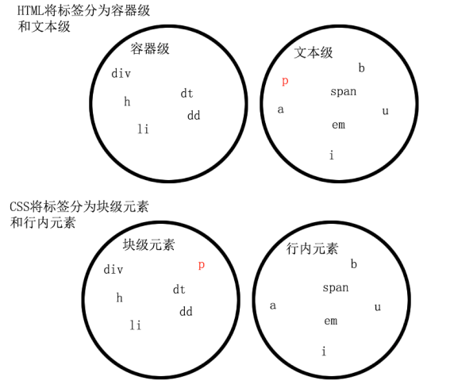

# CSS 盒子模型

`div` `span` `a` 都是盒子；图片、表单元素一律看作是文本，它们并不是盒子。

盒子主要的属性：

- `width` 和 `height` : 内容的宽度和高度。
- `padding` : 内边距。
- `border` : 边框。
- `margin` : 外边距。

标准的盒子模型如下图：


盒子的真实占有宽度 = 左 border + 左 padding + width + 右 padding + 右 border

## padding

padding 就是内边距，其区域有背景颜色，并且有四个方向。

四个方向有两种写法：

1. 写小属性：

```css
padding-top: 30px;
padding-right: 20px;
padding-bottom: 40px;
padding-left: 100px;
```

2. 写综合属性，用空格隔开：

```css
padding: 30px 20px 40px 100px; /* 上、右、下、左 */
padding: 30px 20px 40px; /*上、右和左、下。*/
padding: 30px 20px; /* 上和下、左和右 */
```

综合属性的写法对应的顺序：

- 如果写了四个值，则顺序为：上、右、下、左。
- 如果只写了三个值，则顺序为：上、右和左、下。
- 如果只写了两个值，则顺序为：上和下、左和右。

```css
div {
  width: 200px;
  height: 200px;
  padding-right: 60px;
  padding: 30px 20px 40px;
  padding-left: 10px;
  border: 1px solid red;
  background-color: pink;
}
```

上面的 padding 上、右、下、左 对应的值分别为：30px，20px，40px，10px。因为后面的属性可以折叠前面的属性。

## border

`border` 就是边框。边框有三个要素：像素（粗细）、线型、颜色。

`border` 属性是能够被拆开的，有两大种拆开方式：

1. 按三要素拆开：`border-width`、`border-style`、`border-color`。
2. 按方向拆开：`border-top`、`border-right`、`border-bottom`、`border-left`。
3. 按三要素和方向来拆。

例子：

```css
border-width: 10px 20px; /* 边框宽度 */
border-style: solid dashed dotted; /* 线型 */
border-color: red green blue yellow; /* 颜色 */

/* 按方向拆开 */
border-top: 10px solid red;
border-right: 10px solid red;
border-bottom: 10px solid red;
border-left: 10px solid red;

/* 按三要素和方向来拆 */
border-top-width: 10px;
border-top-style: solid;
border-top-color: red;
border-right-width: 10px;
border-right-style: solid;
border-right-color: red;
border-bottom-width: 10px;
border-bottom-style: solid;
border-bottom-color: red;
border-left-width: 10px;
border-left-style: solid;
border-left-color: red;
```

例如画一个三角形：

```css
div {
  width: 0;
  height: 0;
  border: 100px solid transparent;
  border-top-color: red;
  border-bottom: none;
}
```

# 浮动

## 标准文档流

标准文档流的特性:

1. 空白折叠现象，无论多少个空格、换行、tab，都会折叠为一个。
1. 高矮不齐，底边对齐。
1. 自动换行，一行写不满，换行写。

### 行内元素和块级元素

- 行内元素与其他行内元素并排；并且不能设置宽高。
- 块级元素霸占一行，不能与其他任何元素并列；能收受宽高。

行内元素：除了 p 之外，所有的文本级标签，都是行内元素。p 是个文本级，但是是个块级元素。

块级元素：所有的容器级标签都是块级元素，还有 p 标签。



行内元素和块级元素可以互相转换。
```css
display:inline; /* 块级元素转换为行内元素 */
display:block; /* 行内元素转换为块级元素 */
```
css有三种方式是一个元素脱离标准文档流：
1. 浮动
1. 绝对定位
1. 固定定位

### 浮动
- 浮动的元素脱标：所有标签，浮动之后就部分行内、块级了。
- 浮动元素互相贴靠：
- 浮动的元素有“字围”效果：标准流中的文字不会被浮动的盒子遮挡住。


# 定位

# vscode 使用快捷键：

在 VS Code 中输入 `p#haha`，按 `tab` 键后，会生成 `<p id="haha"></p>`。

在 VS Code 中输入 `p.haha`，按 `tab` 键后，会生成 `<p class="haha"></p>`。
