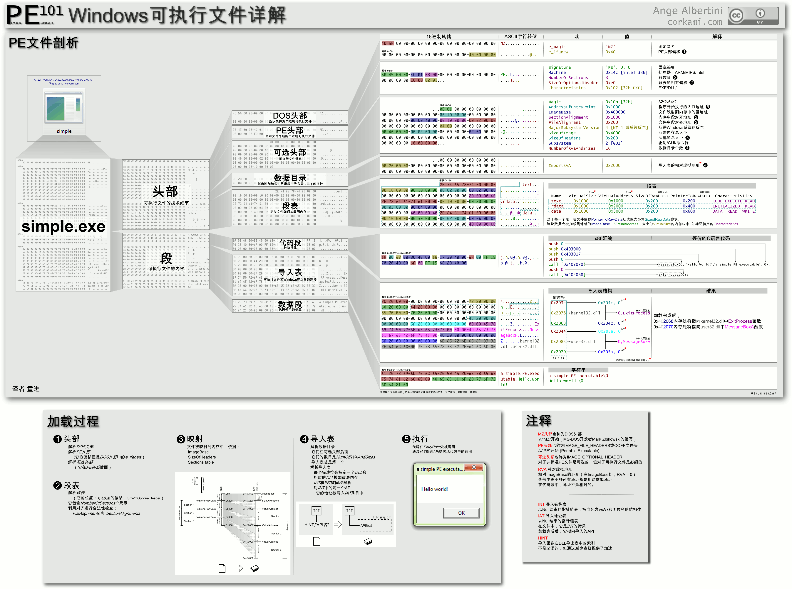

# 总览



> https://github.com/corkami/pics

## DOS 部分

DOS 部分主要是为了兼容以前的 DOS 系统，DOS 部分由 DOS Header 和 DOS Sub 组成。
DOS Header 结构如下：

```c
typedef struct _IMAGE_DOS_HEADER{
+00h 	WORD e_magic    // Magic DOS signature MZ(4Dh 5Ah) DOS可执行文件标记
+02h 	WORD e_cblp     // Bytes on last page of file
+04h 	WORD e_cp       // Pages in file
+06h 	WORD e_crlc     // Relocations
+08h 	WORD e_cparhdr  // Size of header in paragraphs
+0ah 	WORD e_minalloc // Minimun extra paragraphs needs
+0ch 	WORD e_maxalloc // Maximun extra paragraphs needs
+0eh 	WORD e_ss       // intial(relative)SS value DOS代码的初始化堆栈SS
+10h 	WORD e_sp       // intial SP value DOS代码的初始化堆栈指针SP
+12h 	WORD e_csum     // Checksum
+14h 	WORD e_ip       // intial IP value DOS代码的初始化指令入口[指针IP]
+16h 	WORD e_cs       // intial(relative)CS value DOS代码的初始堆栈入口
+18h 	WORD e_lfarlc   // File Address of relocation table
+1ah 	WORD e_ovno     // Overlay number
+1ch 	WORD e_res[4]   // Reserved words
+24h 	WORD e_oemid    // OEM identifier(for e_oeminfo)
+26h 	WORD e_oeminfo  // OEM information;e_oemid specific
+29h 	WORD e_res2[10] // Reserved words
+3ch 	LONG e_lfanew   // Offset to start of PE header 指向PE文件头
} IMAGE_DOS_HEADER, *PIMAGE_DOS_HEADER;
```

DOS Header 结构 `e_migic` 成员的值固定为 `0x5A4D`，即 `MZ` ；`e_lfanew` 成员的值指向
PE 文件头。其他的成员不需要了解，可以随意修改为任意值。

DOS Stub 为 DOS Header 和 PE 文件头之间的数据，为实模式下代码，主要是为了兼容 MS-DOS。
这部分的数据也不需要了解，可以随意修改。

## PE 文件头

PE 文件头的位置通过 DOS 文件头的 `e_lfanew` 成员定位。其结构包含 PE 头标志、标准 PE 头和
可选 PE 头三部分组成。其结构如下：

```c
typedef struct _IMAGE_NT_HEADERS {
+0x00    DWORD Signature;                         // PE文件头标志 => 4字节(0x04)
+0x04    IMAGE_FILE_HEADER FileHeader;            // 标准PE头 => 20字节(0x14)
+0x18    IMAGE_OPTIONAL_HEADER32 OptionalHeader;  // 可选E头 => 32位下224字节(0xE0) 64位下240字节(0xF0)
} IMAGE_NT_HEADERS32, *PIMAGE_NT_HEADERS32;
```

成员 `Signature` 固定为 `50 40 00 00`，也就是 `PE` 。

### 标准 PE 头

标准 PE 头结构如下：

```c
typedef struct _IMAGE_FILE_HEADER {
+0x00    WORD    Machine;                // 运行平台
+0x02    WORD    NumberOfSections;       // 节的数量
+0x04    DWORD   TimeDateStamp;          // 编译器填写的时间戳，可修改
+0x08    DWORD   PointerToSymbolTable;   // 调试相关，可修改
+0x0B    DWORD   NumberOfSymbols;        // 调试相关，可修改
+0x10    WORD    SizeOfOptionalHeader;   // 标识可选 PE 头大小
+0x12    WORD    Characteristics;        // 文件属性
} IMAGE_FILE_HEADER, *PIMAGE_FILE_HEADER;
```

标准 PE 头的 `NumberOfSections` 指定了节的数量。

### 可选 PE 头

可选 PE 头在 32 位和 64 位系统上大小是不同的，在 32 位系统上有 224 (0xE0)个字节，结构如下：

```c
typedef struct _IMAGE_OPTIONAL_HEADER {
    //
    // Standard fields.
    //

    WORD    Magic;                         // PE32: 10B PE64: 20B
    BYTE    MajorLinkerVersion;
    BYTE    MinorLinkerVersion;
    DWORD   SizeOfCode;                    // 所有含有代码的区块的大小 编译器填入 没用(可改)
    DWORD   SizeOfInitializedData;         // 所有初始化数据区块的大小 编译器填入 没用(可改)
    DWORD   SizeOfUninitializedData;       // 所有含未初始化数据区块的大小 编译器填入 没用(可改)
    DWORD   AddressOfEntryPoint;           // 程序入口 RVA
    DWORD   BaseOfCode;                    // 代码区块起始 RVA
    DWORD   BaseOfData;                    // 数据区块起始 RVA

    //
    // NT additional fields.
    //

    DWORD   ImageBase;                     //内存镜像基址(程序默认载入基地址)
    DWORD   SectionAlignment;              //内存中对齐大小
    DWORD   FileAlignment;                 //文件中对齐大小(提高程序运行效率)
    WORD    MajorOperatingSystemVersion;
    WORD    MinorOperatingSystemVersion;
    WORD    MajorImageVersion;
    WORD    MinorImageVersion;
    WORD    MajorSubsystemVersion;
    WORD    MinorSubsystemVersion;
    DWORD   Win32VersionValue;
    DWORD   SizeOfImage;        //内存中整个PE文件的映射的尺寸,可比实际值大,必须是SectionAlignment的整数倍
    DWORD   SizeOfHeaders;      //所有的头加上节表文件对齐之后的值
    DWORD   CheckSum;           //映像校验和,一些系统.dll文件有要求,判断是否被修改
    WORD    Subsystem;
    WORD    DllCharacteristics; //文件特性,不是针对DLL文件的,16进制转换2进制可以根据属性对应的表格得到相应的属性
    DWORD   SizeOfStackReserve;
    DWORD   SizeOfStackCommit;
    DWORD   SizeOfHeapReserve;
    DWORD   SizeOfHeapCommit;
    DWORD   LoaderFlags;
    DWORD   NumberOfRvaAndSizes;        // 数据目录表数量
    IMAGE_DATA_DIRECTORY DataDirectory[IMAGE_NUMBEROF_DIRECTORY_ENTRIES]; //数据目录表,结构体数组
} IMAGE_OPTIONAL_HEADER32, *PIMAGE_OPTIONAL_HEADER32;
```

64 位系统的可选 PE 头结构与 32 位类似， 但略有不同：没有 `BaseOfData，并且ImageBase` 和 `SizeOf{Stack,Heap}{Reserve,Commit}` 是 64 位，而不是 32 位。

```c
struct Pe32PlusOptionalHeader {
    WORD Magic; // 0x020b - PE32+ (64 bit)
    BYTE MajorLinkerVersion;
    BYTE MinorLinkerVersion;
    DWORD SizeOfCode;
    DWORD SizeOfInitializedData;
    DWORD SizeOfUninitializedData;
    DWORD AddressOfEntryPoint;
    DWORD BaseOfCode;
    QWORD ImageBase;
    DWORD SectionAlignment;
    DWORD FileAlignment;
    WORD MajorOperatingSystemVersion;
    WORD MinorOperatingSystemVersion;
    WORD MajorImageVersion;
    WORD MinorImageVersion;
    WORD MajorSubsystemVersion;
    WORD MinorSubsystemVersion;
    DWORD Win32VersionValue;
    DWORD SizeOfImage;
    DWORD SizeOfHeaders;
    DWORD CheckSum;
    WORD Subsystem;
    WORD DllCharacteristics;
    QWORD SizeOfStackReserve;
    QWORD SizeOfStackCommit;
    QWORD SizeOfHeapReserve;
    QWORD SizeOfHeapCommit;
    DWORD LoaderFlags;
    DWORD NumberOfRvaAndSizes;
    IMAGE_DATA_DIRECTORY DataDirectory[IMAGE_NUMBEROF_DIRECTORY_ENTRIES]; //数据目录表,结构体数组
};
```

`AddressOfEntryPoint` 字段并不是程序真正的入口，程序的真正入口点 = `ImageBase` + `AddressOfEntryPoint` 。

### 数据目录

数据目录位于可选 PE 头结构末尾，每一个数据目录大小为 8 字节，其结构如下：

```c
typedef struct _IMAGE_DATA_DIRECTORY {
    DWORD   VirtualAddress; // 目录的相对虚拟地址
    DWORD   Size;           // 目录大小
} IMAGE_DATA_DIRECTORY, *PIMAGE_DATA_DIRECTORY;
```

目前大多数可执行文件包含 16 个条目，但条目实际数量存储在 NumberOfRvaAndSizes 中。

| 索引 | PE32 位置 | PE32+位置 | 目录                                 | 节       | 备注               |
| ---- | --------- | --------- | ------------------------------------ | -------- | ------------------ |
| 0    | 96        | 112       | 导出表 RVA 和大小                    | .edata   |                    |
| 1    | 104       | 120       | 导入表 RVA 和尺寸                    | .idata   |                    |
| 2    | 112       | 128       | 资源表 RVA 和大小                    | .rsrc    |                    |
| 3    | 120       | 136       | 异常表 RVA 和大小                    | .pdata   |                    |
| 4    | 128       | 144       | 证书表偏移量（不是 RVA！）和大小     |          | 参见下面的签名 PE  |
| 5    | 136       | 152       | 基本重定位表 RVA 和大小              | .reloc   |                    |
| 6    | 144       | 160       | 调试数据 RVA 和大小                  | .debug   |                    |
| 7    | 152       | 168       | 架构，保留                           |          | 两个字段都必须为零 |
| 8    | 160       | 176       | 全局指针寄存器值 RVA 和大小          |          | 大小始终为 0       |
| 9    | 168       | 184       | 线程本地存储 (TLS) 表 RVA 和大小     | .tls     |                    |
| 10   | 176       | 192       | 加载配置表 RVA 和大小                |          |                    |
| 11   | 184       | 200       | 绑定导入表 RVA 和大小                |          |                    |
| 12   | 192       | 208       | 导入地址表 (IAT) RVA 和大小          |          |                    |
| 13   | 200       | 216       | 延迟导入描述符 RVA 和大小            |          |                    |
| 14   | 208       | 224       | 通用语言运行时 (CLR) 标头 RVA 和大小 | .cormeta |                    |
| 15   | 216       | 232       | 保留                                 |          | 两个字段都必须为零 |

## 节表

节表的结构如下，整体为 40 (0x28)个字节:

```c
typedef struct _IMAGE_SECTION_HEADER {
    BYTE    Name[IMAGE_SIZEOF_SHORT_NAME]; // ASCII字符串 可自定义 只截取8个字节
    union {                                // 该节在没有对齐之前的真实尺寸,该值可以不准确
            DWORD   PhysicalAddress;
            DWORD   VirtualSize;
    } Misc;
    DWORD   VirtualAddress;                // 内存中的偏移地址
    DWORD   SizeOfRawData;                 // 节在文件中对齐的尺寸
    DWORD   PointerToRawData;              // 节区在文件中的偏移
    DWORD   PointerToRelocations;
    DWORD   PointerToLinenumbers;
    WORD    NumberOfRelocations;
    WORD    NumberOfLinenumbers;
    DWORD   Characteristics;               // 节的属性
} IMAGE_SECTION_HEADER, *PIMAGE_SECTION_HEADER;
```

`SizeOfHeaders` 表示所有的头加上节表文件对齐之后的值，对齐的大小参考的就是 `FileAlignment` 成员。

## 导入表

导出表(Import Table)和导入表是靠 `IMAGE_DATA_DIRECTORY` 这个结构体数组来寻找的，`IMAGE_DATA_DIRECTORY` 的结构如下：

```c

```

导入表的结构如下：

```c
typedef struct _IMAGE_IMPORT_DESCRIPTOR {
    union {
        DWORD   Characteristics;            // 0 for terminating null import descriptor
        DWORD   OriginalFirstThunk;         // RVA 指向 INT (PIMAGE_THUNK_DATA结构数组)
    } DUMMYUNIONNAME;
    DWORD   TimeDateStamp;                  // 0 if not bound,
                                            // -1 if bound, and real date\time stamp
                                            //     in IMAGE_DIRECTORY_ENTRY_BOUND_IMPORT (new BIND)
                                            // O.W. date/time stamp of DLL bound to (Old BIND)

    DWORD   ForwarderChain;                 // -1 if no forwarders
    DWORD   Name;                            //RVA指向dll名字,以0结尾
    DWORD   FirstThunk;                     // RVA 指向 IAT (PIMAGE_THUNK_DATA结构数组)
} IMAGE_IMPORT_DESCRIPTOR;
typedef IMAGE_IMPORT_DESCRIPTOR UNALIGNED *PIMAGE_IMPORT_DESCRIPTOR;
```

我们还需要了解的结构体是 `IMAGE_THUNK_DATA` 和 `IMAGE_IMPORT_BY_NAME` 结构如下：

```c
typedef struct _IMAGE_IMPORT_BY_NAME {
    WORD    Hint;    //可能为空,编译器决定,如果不为空,是函数在导出表的索引
    BYTE    Name[1]; //函数名称,以0结尾
} IMAGE_IMPORT_BY_NAME, *PIMAGE_IMPORT_BY_NAME;

#include "pshpack8.h"                       // Use align 8 for the 64-bit IAT.

typedef struct _IMAGE_THUNK_DATA64 {
    union {
        ULONGLONG ForwarderString;  // 指向一个转向者字符串的RVA
        ULONGLONG Function;         // 被输入的函数的内存地址
        ULONGLONG Ordinal;          // 被输入API的序数值
        ULONGLONG AddressOfData;    // 指针指向 IMAGE_IMPORT_BY_NAME
    } u1;
} IMAGE_THUNK_DATA64;
typedef IMAGE_THUNK_DATA64 * PIMAGE_THUNK_DATA64;

#include "poppack.h"                        // Back to 4 byte packing

typedef struct _IMAGE_THUNK_DATA32 {
    union {
        DWORD ForwarderString;      // PBYTE
        DWORD Function;             // PDWORD
        DWORD Ordinal;
        DWORD AddressOfData;        // PIMAGE_IMPORT_BY_NAME
    } u1;
} IMAGE_THUNK_DATA32;
typedef IMAGE_THUNK_DATA32 * PIMAGE_THUNK_DATA32;
```

## 导出表

导出表(Export Table)一般是 DLL 文件用的比较多，导出表的数据结构如下：

```c
typedef struct _IMAGE_EXPORT_DIRECTORY {
    DWORD   Characteristics;
    DWORD   TimeDateStamp;
    WORD    MajorVersion;
    WORD    MinorVersion;
    DWORD   Name;                   // 指针指向该导出表文件名字符串
    DWORD   Base;                   // 导出函数起始序号
    DWORD   NumberOfFunctions;      // 所有导出函数的个数
    DWORD   NumberOfNames;          // 以函数名字导出的函数个数
    DWORD   AddressOfFunctions;     // 指针指向导出函数地址表RVA
    DWORD   AddressOfNames;         // 指针指向导出函数名称表RVA
    DWORD   AddressOfNameOrdinals;  // 指针指向导出函数序号表RVA
} IMAGE_EXPORT_DIRECTORY, *PIMAGE_EXPORT_DIRECTORY;
```

## 重定位表

当 PE 文件被装载到虚拟内存的另一个地址中的时候，也就是载入时不将默认的值作为基地址载入，
链接器登记的哪个地址是错误的，需要我们用重定位表来调整，重定位表在数据目录项的第 6 个
结构，结构如下:

```c
typedef struct _IMAGE_BASE_RELOCATION {
    DWORD   VirtualAddress; // 重定位数据的开始 RVA 地址
    DWORD   SizeOfBlock;    // 重定位块的长度
//  WORD    TypeOffset[1];  // 重定位项数组
} IMAGE_BASE_RELOCATION;
typedef IMAGE_BASE_RELOCATION UNALIGNED * PIMAGE_BASE_RELOCATION;
```
