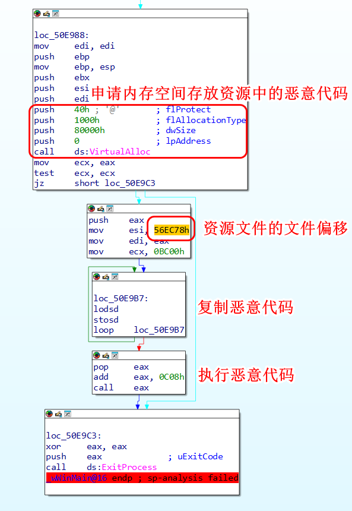
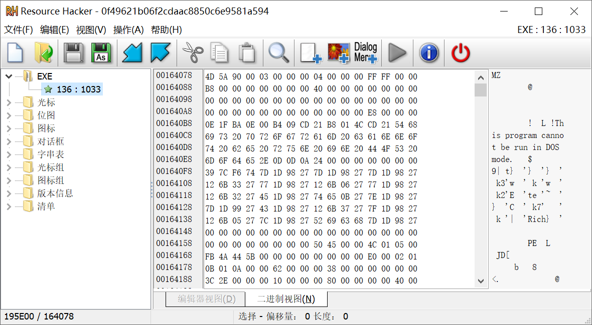
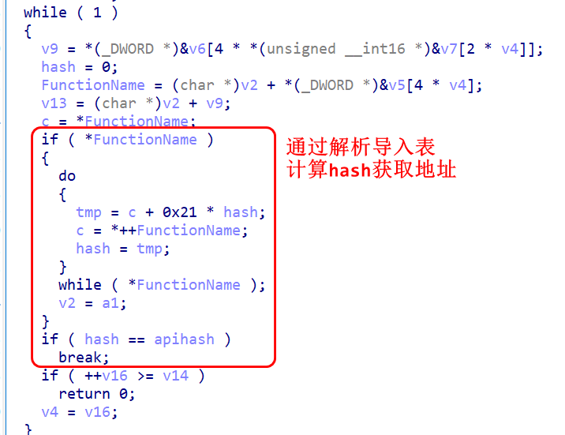
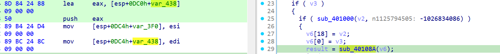
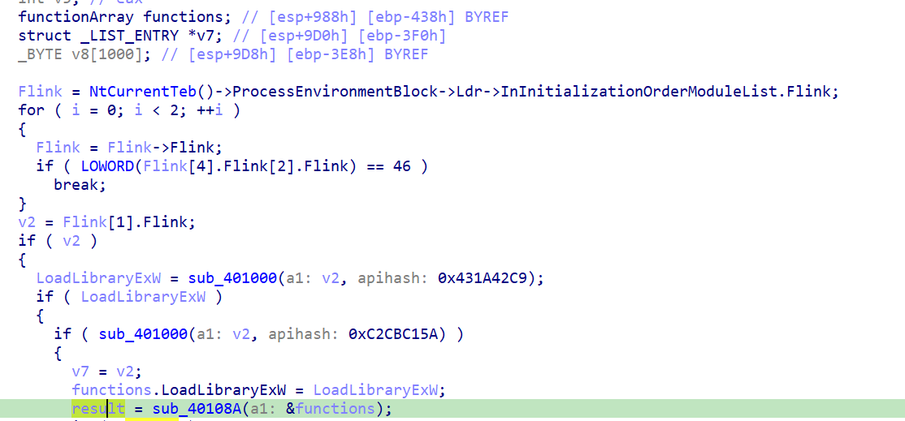
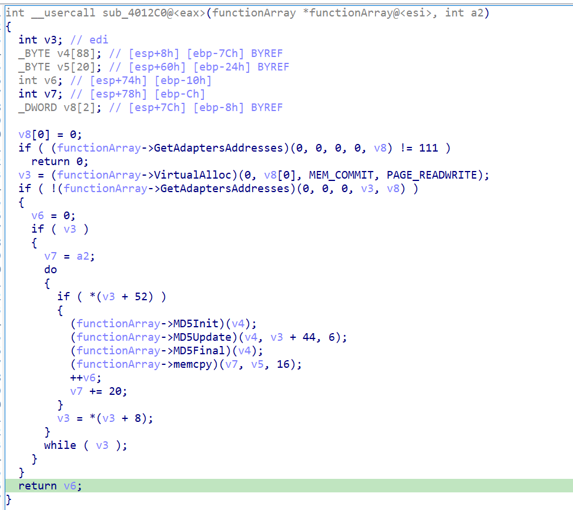
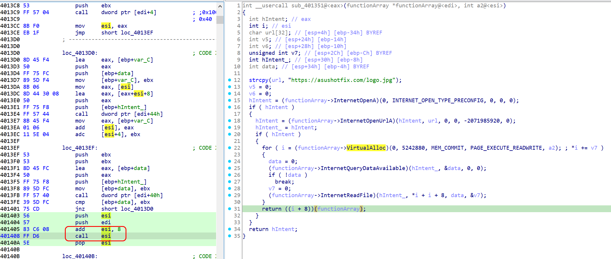
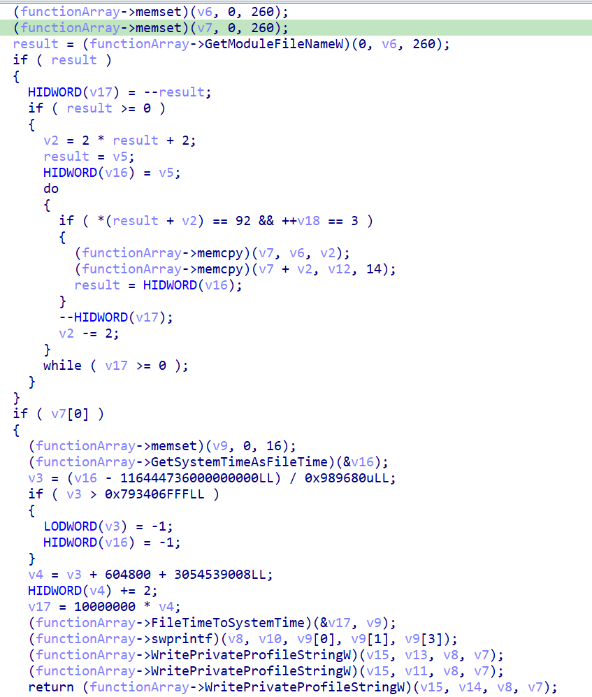

## 技术分析

md5: 0f49621b06f2cdaac8850c6e9581a594 

样本在 WinMain 函数中从资源 复制一个可执行文件到内存中：





导出该资源文件为 `EXE136.bin`，其md5为 63F2FE96DE336B6097806B22B5AB941A ，前面的 call eax 实际会调用 sub_401808 函数，其调用的 sub_401000 实际会解析导入表，通过计算hash 获取函数地址。



sub_40108A 会获取多个函数的地址，存入数组 v6 中：



通过动态调试，获取到数组各元素对应的函数名，新建一个结构体，如下：
```c
struct functionArray
{                                       
    void *LoadLibraryExW;
    void *VirtualAlloc;
    void *GetModuleFileNameW;
    void *WritePrivateProfileStringW;
    void *GetSystemTimeAsFileTime;
    void *FileTimeToSystemTime;
    void *memcpy;
    void *memcmp;
    void *memset;                      
    void *swprintf;
    void *MD5Init;
    void *MD5Update;
    void *MD5Final;
    void *GetAdaptersAddresses;
    void *InternetOpenA;
    void *InternetOpenUrlA;
    void *InternetQueryDataAvailable;
    void *InternetReadFile;
};
```
将数组v6的类型设置为该结构体，如下图所示：



将其他所有使用该数组的变量的类型都修改为该结构体或结构体指针，这里将 sub_4012C0 的第一个参数修改为结构体指针，整个函数的逻辑就非常清楚了，收集所有可用网络适配器的 MAC 地址，并为每个地址计算一个 MD5 哈希值，然后与一个包含 55 个硬编码值的表进行比较。



如果匹配上，则会进入下一阶段，从 https://asushotfix[.]com/logo.jpg 下载一个二进制对象，然后执行相应的代码：



没有匹配上，就会在当前可执行文件上两级目录的位置创建一个名为`idx.ini` 的 INI 文件。在 `[IDX_FILE]` 部分中写入了三个值：
```ini
[IDX_FILE]
XXX_IDN=YYYY-MM-DD
XXX_IDE=YYYY-MM-DD
XXX_IDX=YYYY-MM-DD
```



