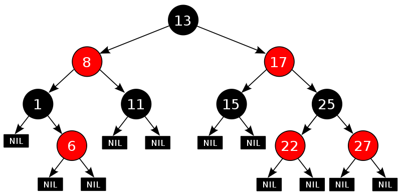
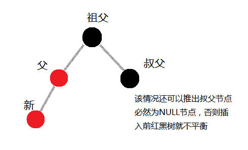
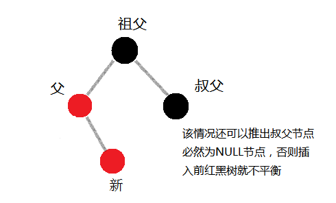
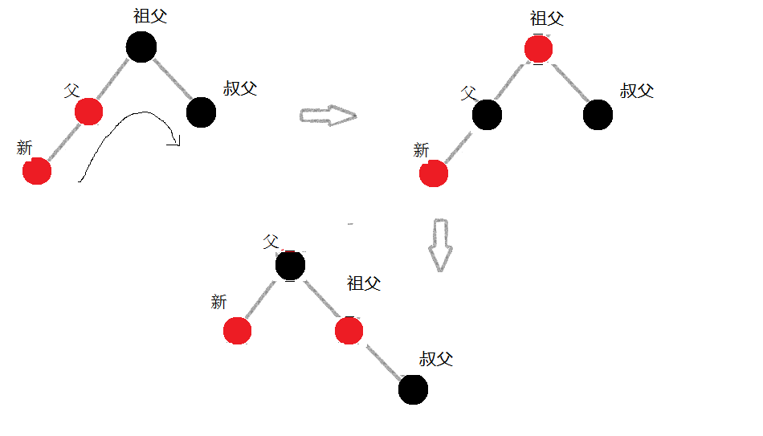
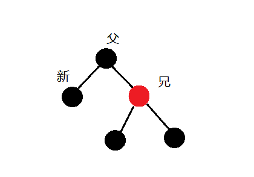

红黑树介绍与分析

最近觉得C++生疏了，拿出侯捷的《STL源码剖析》翻了翻，看到C++ set，map底层实现机制，其中采用的就是红黑树数据结构，另外Linux内核对内存管理和进程调度都用到了红黑树，看来它不能让人小视。自己从网上和书上重新看了下红黑树，把个人的理解放到博客上，跟大家讨论，也作为自己的重新梳理的方式。

 

红黑树(Red-Black Tree)

它是在1972 年由Rudolf Bayer 发明的，他称之为"对称二叉B 树"，它现代的名字是在Leo J. Guibas 和Robert Sedgewick 于1978 年写的一篇论文中获得的。它是复杂的，但它的操作有着良好的最坏情况运行时间，并且在实践中是高效的: 它可以在O(log n)时间内做查找，插入和删除，这里的n 是树中元素的数目。

红黑树本身是二叉搜索树，同时它应该始终满足五个性质


1. 红黑树每个节点颜色非红即黑；
1. 根节点颜色必须为黑色；
1. 每个叶节点(指的NULL指针节点)颜色均为黑；
1. 不可以出现相邻的两个红色节点；
1. 对于每个节点，其左右子树中的黑色节点个数必须相等；

一棵正常的红黑树如下图(引自wiki)：



红黑树的难点在于插入和删除操作涉及到的红黑树重新调整问题，关于原理性问题，有篇文章《红黑树原理详解》，作者：余强.  讲的比较清楚，也可以参照《CLRS》第13章红黑树的描述，以下主要结合c语言实现代码加注释的方式进行分析，编完代码后进行了一定的测试，如果还存在问题，可回帖反馈，我会进行更改，谢谢。 

插入操作：

新插入一个节点时，其颜色未定，可以选择黑色也可以选择红色，但是仔细看下上述红黑树5个性质，会发现，插入黑色节点必然会导致性质5被破坏(空树除外)，而如果插入红色节点，则可能破坏性质4，这其中有一定的几率无需调整红黑树(父节点为黑色)，因此插入的新节点颜色设置为红色，以下插入操作均不考虑是空树和父节点是黑色的情况，因为这两种情况无需进行调整。

而如果发生上面说的破坏性质4，即新插入节点与父节点均是红色的情况，则我们需要将这两个相邻红色节点分开，以使性质4重新被满足，而涉及到的调整则需要看新插入节点的父节点、叔父节点以及祖父节点颜色而定，可以分情况讨论之；  

首先考虑叔父节点的颜色，这里以叔父节点的颜色来划分接下来的调整操作是因为插入的新节点与其父节点均为红色，目的为了将这两个红色节点分开，可以通过性质推理知祖父节点必然为黑色，因为插入新节点前，树是满足性质的，而父节点颜色为红色，因此祖父节点必然为黑色。调整颜色过程中，如果需要改变父节点颜色，则必然需要考虑叔父节点，因此叔父节点是插入操作分情况讨论的关键点。

在介绍插入后红黑树重新调整前，首先引入左旋操作和右旋操作，在红黑树所有调整中，均采用左右旋操作解决节点移动问题，左右旋操作并不破坏二叉搜索树的性质，因此不会引入额外的重新对红黑树进行排序的负担，具体左右旋操作可参考其他红黑树相关文章或下文中对于左右旋操作的代码分析加注释；

重回正题，首先对插入操作所需要的调整进行分情况讨论，再次强调父节点为黑色的情况不分析，因为无需作过多调整，所以下面操作中父节点颜色均为红色：

叔父节点颜色为黑色：






以上两种情况为插入节点的父节点在祖父节点的左子树情况，当位于右子树时，情况类似。

以上两种情况，即新插入节点分别为外侧插入和内侧插入时，需要将父节点和新节点的相邻红色分开，该两种情况下叔父节点应该为NULL节点(如果有不正确，请大家指正)

因此调整操作是以祖父节点为基点，父节点和祖父节点的连接为轴进行右旋转（内侧插入即第二种情况必须先以父节点为基点进行左旋调整），然后改变父节点和祖父节点的颜色。



新节点外侧插入情况：以祖父节点为基点，右单选，改变父节点和祖父节点颜色；


新节点内侧插入情况：先对父节点左单选（如果这里不进行左旋转，则经过下一步的右旋转后，新节点即成为祖父节点的左孩子，如果祖父节点为红色，则会引入额外的调整和麻烦），改变新节点和祖父节点颜色，再对祖父节点右单旋；

叔父节点颜色为红色


该情况下比较简单，因为叔父和父节点都是红色，而且祖父节点为黑色，则将祖父节点颜色变为红色，父节点和叔父节点颜色为黑色，即可消除相邻的两个红色节点而且不改变相应的黑高度，此时如果曾祖父节点颜色为黑色，则调整结束，如果曾祖父节点颜色为红色，则可将祖父节点视为新节点，递归新插入情况，迭代向上处理。


总体来说插入情况相 对 比较简单，主要涉及上述几种操作，以下是c语言相关红黑树插入实现代码：
```cpp
/* 
 * key:新插入节点键值,root:红黑树根节点
 * 红黑树节点插入 
 * 1、插入新节点 
 * 2、旋转红黑树并做颜色调整 
 */ 
rb_node_t *rb_tree_insert(int key, rb_node_t* root) 
{ 
     	rb_node_t *last_node; 
        rb_node_t *curnode;
        /* 创建节点 */ 
        rb_node_t *node = (rb_node_t *)malloc(sizeof(rb_node_t)); 
        node->key = key; 
        
        curnode = root; //temp node,just for save something
        
        /* 树为空 */ 
        if (NULL == root) 
        { 
                node->color = black; 
                node->left_child = NULL; 
                node->right_child = NULL; 
                node->parent = NULL; 
                return node; 
        } 
        
        /* 向下搜索，直到找到相应的位置可以插入 */ 
        while (curnode) 
        { 
                last_node = curnode; 
                node->key > curnode->key ? (curnode = curnode->right_child) : (curnode = curnode->left_child);
        }         
        
        /* 判断插入搜索到的节点的左孩子还是右孩子 */         
        if (node->key > last_node->key) 
                last_node->right_child = node;         
        else 
                last_node->left_child = node; 
        
        node->parent = last_node;        //回马枪设置父节点 
        node->left_child = NULL; 
        node->right_child = NULL; 
        node->color = red; 
        
        /* 重新使红黑树调整为平衡状态 */ 
        root = rb_tree_rebalance(node, root); 
        return root; 
}


 
删除操作：

红黑树节点删除操作后的调整相比插入操作更加复杂，但是同样可以分情况讨论之。

首先红黑树删除同样采取跟二叉搜索树同样的删除方式，即如果需要删除节点A，则将A左子树中最大的节点(即最右边节点)和右子树中最小的节点(最左边的节点)删除，然后用删除节点替换A节点。 如下图：


需要删除8节点时，先搜索到7或9节点，将对应节点删除掉，同时将7或9的节点替换8的节点，详细参考请查阅二叉搜索树的删除。

其实红黑树节点删除说白了就是删除了一个黑色节点(红色无需调整)，因为删除了一个黑色节点，导致某一分支上黑高度减小了1，导致与兄弟分支黑高度产生了不平衡的情况。当这种情况出现的时候，我们总是在最小范围内挪动红黑树节点并改变附近节点的颜色来使得红黑树性质重新满足，而在这复杂的乾坤大挪移中，兄弟节点被涉及在所难免，因此跟上面的插入情况一样，我们也要对兄弟节点颜色分情况讨论，以梳理删除之后的重新调整情况：

兄弟节点颜色为红色

该情况下，可以推导出父节点必然为黑色，侄子节点必然为黑色(可能为NULL)


```cpp
/* 
 * 2011-8-11 
 * 华为 
 * 红黑树性质：在满足二叉搜索树的基础上 
 * 1、根节点为黑色 
 * 2、从根节点到叶节点的黑色节点总数相等
 * 3、不能有相邻的两个红色节点 
 * 4、每个节点颜色非黑即红 
 * 5、每个叶节点（空节点null）都是黑色 
 */ 
#include<stdio.h> 
#include<stdlib.h> 
#include"RBtree.h" 
/* 红黑树左旋操作，旋转点：base */
/* 
 *                     A
 *                   /   \
 *          (base) B      C
 *               /   \
 *              D     E 
 *               \ 
 *                F(new) 
 */ 
static rb_node_t *rb_tree_rotate_left(rb_node_t *base, rb_node_t *root)
{ 
        rb_node_t *right = base->right_child;
        
        base->right_child = right->left_child;        // E的左子树转换为B的右子树
        
        if (right->left_child != NULL)                        
                right->left_child->parent = base;     // 回马枪设置父节点
        
        right->parent = base->parent;                 // E的父节点替换为B的父节点
        
        if (base == root)
                root = right;
        else if (base->parent->left_child == base)
                base->parent->left_child = right;
        else 
                base->parent->right_child = right;
                
        right->left_child = base;                     // 设置旋转后的E节点的左孩子为B节点
        base->parent = right;                         // 回马枪设置
  
        return root; 
} 
 
/* 红黑树右旋操作，旋转点base 
 * 
 *              A 
 *            /   \ 
 *           B     C (base) 
 *                / \ 
 *               D   E 
 *              / 
 *             F(new)
 */ 
 
static rb_node_t *rb_tree_rotate_right(rb_node_t *base, rb_node_t *root)
{ 
        rb_node_t *left = base->left_child;
        
        base->left_child = left->right_child;        // D节点的右子树转换为C节点的左子树
        
        if (left->right_child)
                left->right_child->parent = base;    // 回马枪设置父节点
          
        left->parent = base->parent;                 // D的父节点替换为C的父节点
        
        if (base == root)
                root = left;
        else if (base->parent->right_child == base)
                base->parent->right_child = left;
        else 
                base->parent->left_child = left;
                
        left->right_child = base;                     // 设置旋转后的D节点的右孩子为E节点
        base->parent = left;
        
        return root; 
} 
 
/* 
 * 重新调整红黑树状态 
 * 使红黑树转换回平衡状态 
 * 使用rebalance函数说明红黑树至少有3层，深度至少为2
 * 
 *              A
 *            /  \ 
 *           B    C 
 *               / 
 *              D 
 */ 
rb_node_t* rb_tree_rebalance(rb_node_t* base, rb_node_t*root)
{         
        /* 
         * 父节点为黑或当前节点为根节点，则无需调整红黑树结构，立即返回        
         */ 
        if (base == root || base->parent->color == black)  	// 注意顺序不可颠倒，因为当前节点非根节点，所以必然存在父节点
        { 
                root->color = black;        			// 根节点必然为黑色
                return root;
        } 
        
        /* 
         * 情况1:父节点为红且非根节点(存在祖父节点)，叔叔节点为黑色
         */ 
          
         //确定uncle节点 
        rb_node_t *uncle;
 
        if (base->parent->parent->left_child == base->parent)
                 uncle = base->parent->parent->right_child;
        else 
                uncle = base->parent->parent->left_child;
          
         if (uncle == NULL || uncle->color == black)//叔叔节点为黑色
         { 
                if (base->parent->parent->left_child == base->parent) //父节点为祖父节点的左节点
                { 
                        if (base->parent->left_child == base) //左外侧插入
                        {
                                //对父节点和祖父节点(旋转基点)进行右旋转，并更改它们的颜色
                                base->parent->color = black;
                                base->parent->parent->color = red;
                                root = rb_tree_rotate_right(base->parent->parent, root);        
 
                        }
                        else //左内侧插入
                        {
                                //对插入节点和父节点进行左旋转，并更改插入节点和祖父节点的颜色
                                base->color = black;
                                base->parent->parent->color = red;
                                root = rb_tree_rotate_left(base->parent, root);        
 
                                root = rb_tree_rotate_right(base->parent, root); //再对插入节点和旋转后父节点进行右旋转
                        }
                } 
                else if(base->parent->parent->right_child == base->parent) //父节点为祖父节点的右节点
                { 
                        if (base->parent->right_child == base) //右外侧插入
                        {
                                //对父节点和祖父节点进行左旋转，并更改它们的颜色
                                base->parent->color = black;
                                base->parent->parent->color = red;
                                root = rb_tree_rotate_left(base->parent->parent, root);
                        }
                        else
                        {
                                //右内侧插入，对插入节点和父节点进行右旋转，并更改插入节点和祖父节点的颜色，
                                //再对插入节点和祖父节点进行左旋转
                                base->color = black;
                                base->parent->parent->color = red;
                                root = rb_tree_rotate_right(base->parent, root);        
                               
                                root = rb_tree_rotate_left(base->parent, root);
                        } 
                } 
         } 
        else //情况2:父节点为红，叔叔节点为红色
         { 
                //更改父节点和叔叔节点颜色为黑色，祖父节点颜色为红色，并继续向上进行平衡调整
                base->parent->color = black;
                uncle->color = black;
                base->parent->parent->color = red;
                root = rb_tree_rebalance(base->parent->parent, root);
         } 
          
         return root;
} 
 
/* 
 * 红黑树节点插入 
 * 1、插入新节点 
 * 2、旋转红黑树并做颜色调整 
 */ 
  
rb_node_t *rb_tree_insert(int key, rb_node_t* root)
{ 
        /* 创建节点 */ 
        rb_node_t *node = (rb_node_t *)malloc(sizeof(rb_node_t));
        node->key = key; 
        
        rb_node_t *curnode = root; //temp node,just for save something
        rb_node_t *last_node;
        
        /* 树为空 */ 
        if (NULL == root)
        { 
                node->color = black;
                node->left_child = NULL;
                node->right_child = NULL;
                node->parent = NULL;
                return node;
        } 
        
        /* 向下搜索，直到找到相应的位置可以插入 */
        while (curnode)
        { 
                last_node = curnode;
                node->key > curnode->key ? (curnode = curnode->right_child) : (curnode = curnode->left_child);
        }         
        
        /* 判断插入搜索到的节点的左孩子还是右孩子 */        
        if (node->key > last_node->key)
                last_node->right_child = node;        
        else 
                last_node->left_child = node;
        
        node->parent = last_node;        //回马枪设置父节点
        node->left_child = NULL;
        node->right_child = NULL;
        node->color = red;
        
        /* 重新使红黑树调整为平衡状态 */
        root = rb_tree_rebalance(node, root);
        return root; 
} 
 
/* 
 * 红黑树节点删除: 
 *                根据二叉查找树删除性质:
 *                        被删除的节点是被删除节点n的中序遍历的前驱节点(左子树中数值最大的节点)(补:同样可以是右子树中最小的节点)
 *                ---->根据上述思路，被删除的节点必然只有一个左孩子或无孩子
 *                ---->根据上述推理结合红黑树性质--->1、被删除的必定是只有一个红色孩子或没有孩子的结点；
 *                                                   2、根据上述推理所确定的被删除的节点如果是红色节点，则必然是叶子节点
 */ 
static rb_node_t *search_rbtree_node(int key, rb_node_t *root)
{ 
        if (root == NULL)
                return root;
        rb_node_t *tmp = root;
        while (tmp) 
        { 
                if (tmp->key == key) //找出对应节点
                        return tmp;
 
                if (tmp->key > key) // 当前节点key值大于搜索的key值
                        tmp = tmp->left_child;
                else 
                        tmp = tmp->right_child;
        } 
        return tmp;        //搜索不到指定节点,返回NULL
} 
 
/******************************************************************************
  函数名   : rb_tree_erase_fixed
  功能描述 : 红黑树删除节点后重新进行调整以满足性质
  输入参数 : node   :顶替删除位置的新的节点
             parent :新节点的父节点
             root   :红黑树根节点
  输出参数 : 无 
  返回值   : 新的红黑树根节点 
  其他说明 : 
  作者日期 : 王一静 2011-8-30
  修改履历 : 
******************************************************************************/
rb_node_t *rb_tree_erase_fixed(rb_node_t *node, rb_node_t* parent, rb_node_t *root)
{ 
        rb_node_t *other;  /* 新节点的兄弟节点 */
        
        /* 
         * 新节点为黑色,且非根节点,则说明被删除节点为黑色
         * 即红黑树一边子树的高度被减1，需要重新调整平衡
         */ 
        while ( (!node || black == node->color) && node != root)
        {         
                if (parent->left_child == node)        
                { 
                        other = parent->right_child;
                
                        /* 
                         * case1:兄弟节点为红色节点,则父节点必然为黑色
                         */
                        if (red == other->color)
                        {
                                other->color = black;
                                parent->color = red;
                                root = rb_tree_rotate_left(parent, root);
                                /* 旋转后红黑树左右已经平衡,但需要查看新父节点左右子树是否满足红黑树性质 */
                                other = parent->right_child;        
                        }
                        
                        /* 
                         * case2:兄弟节点为黑色节点,左右侄子节点均为黑色
                         */
                        if ((!other->left_child || black == other->left_child->color)
                                &&(!other->right_child || black == other->right_child->color))
                        {
                                /*
                                 * 兄弟节点为黑色,则改变兄弟节点颜色为红色,即达到父节点左右子树平衡
                                 * 若此时父节点为红色,则改变父节点颜色为黑色即可弥补被删除的节点的黑色高度，调整即可结束
                                 * 若此时父节点为黑色,则该父节点及子树高度整体减了1,向上递归解决该问题
                                 */
                                other->color = red;
                                node = node->parent;
                                parent = node->parent;
                        }
                        else
                        {
                           /*
                                * case3:黑色兄弟节点有一个孩子节点颜色为红色
                                */
                                if (!other->left_child || black == other->left_child->color)
                                {
                                        /* 内侧为黑色，外侧孩子为红色 */
                                        other->color = parent->color;
                                        parent->color = black;
                                        other->right_child->color = black;
                                        root = rb_tree_rotate_left(parent, root);
                                }
                                else
                                {
                                        /* 内侧孩子为红色 */
                                        other->left_child->color = parent->color;
                                        parent->color = black;
                                        root = rb_tree_rotate_right(other, root);
                                        root = rb_tree_rotate_left(parent, root);
                                }
                                node = root;
                                break;
                        }
                } 
                else 
                { 
                        other = parent->left_child;
                
                        /* 
                         * case1:兄弟节点为红色节点,则父节点必然为黑色
                         */
                        if (red == other->color)
                        {
                                other->color = black;
                                parent->color = red;
                                root = rb_tree_rotate_right(parent, root);
                                /* 旋转后红黑树左右已经平衡,但需要查看新父节点左右子树是否满足红黑树性质 */
                                other = parent->left_child;        
                        }
                        
                        /* 
                         * case2:兄弟节点为黑色节点,左右侄子节点均为黑色
                         */
                        if ((!other->left_child || black == other->left_child->color)
                                &&(!other->right_child || black == other->right_child->color))
                        {
                                /*
                                 * 兄弟节点为黑色,则改变兄弟节点颜色为红色,即达到父节点左右子树平衡
                                 * 若此时父节点为红色,则改变父节点颜色为黑色即可弥补被删除的节点的黑色高度，调整即可结束
                                 * 若此时父节点为黑色,则该父节点及子树高度整体减了1,向上递归解决该问题
                                 */
                                other->color = red;
                                node = node->parent;
                                parent = node->parent;
                        }
                        else
                        {
                           /*
                                * case3:黑色兄弟节点有一个孩子节点颜色为红色
                                */
                                if (!other->right_child || black == other->right_child->color)
                                {
                                        /* 内侧为黑色，外侧孩子为红色 */
                                        other->color = parent->color;
                                        parent->color = black;
                                        other->left_child->color = black;
                                        root = rb_tree_rotate_right(parent, root);
                                }
                                else
                                {
                                        /* 内侧孩子为红色 */
                                        other->right_child->color = parent->color;
                                        parent->color = black;
                                        root = rb_tree_rotate_left(other, root);
                                        root = rb_tree_rotate_right(parent, root);
                                }
                                node = root;
                                break;
                        }
                } 
        } 
        
        if (node) 
                node->color = black;
        return root; 
} 
 
 
rb_node_t *rb_tree_erase(int key, rb_node_t *root)
{ 
        rb_node_t *child, *parent;        //real delete节点右孩子和父节点
 
        /* 根据键值查询红黑树中对应节点 */
        rb_node_t *node = NULL;
        node = search_rbtree_node(key, root);
        
        /* 搜索不到指定key值的节点 */
        if (node == NULL) 
                return root;
        
        if (!node->left_child)                //delete节点无左子树
                child = node->right_child;
        else if (!node->right_child) //delete节点无右子树
                child = node->left_child;
        else 
        { 
                rb_node_t *old = node;
                node = node->right_child;
                while (node->left_child) //在右子树中查找最小的节点(即最左边的节点)
                { 
                        node = node->left_child;
                } 
 
                if (old->parent)                        //old节点是否使根节点
                { 
                        if(old->parent->left_child == old)
                                old->parent->left_child = node;
                        else
                                old->parent->right_child = node;
                } 
                else 
                        root = node;
 
                child = node->right_child;        //真正需要被移除节点的右孩子
                parent = node->parent;
                
                if (parent == old)                        /* node与old节点相邻 */
                        parent = node;          
                else                                                        
                { 
                        if (child)
                                child->parent = parent;
                        parent->left_child = child;
 
                        node->right_child = old->right_child;
                        old->right_child->parent = node;
                } 
                
                node->color = old->color;
                node->left_child = old->left_child;
                old->left_child->parent = node;
                return rb_tree_erase_fixed(child, parent, root);
        } 
        
        parent = node->parent;
 
        if (child) 
        { 
                child->parent = node->parent;
        } 
 
        if (parent) 
        { 
                if (parent->left_child == node)
                        parent->left_child = child;
                else 
                        parent->right_child = child;
        } 
        else 
                root = child;
        if (node->color == black)
                return rb_tree_erase_fixed(child, parent, root);
 
        return root; 
} 
```


转自：   http://blog.csdn.net/yijing21/article/details/6745313